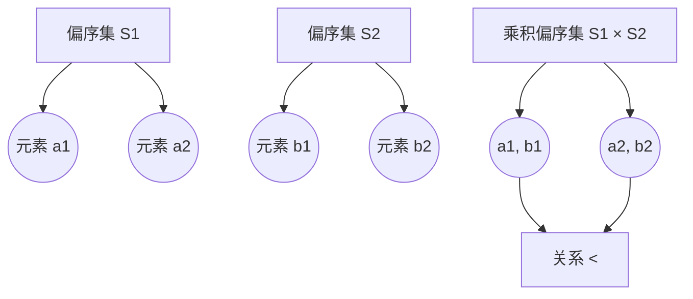

                 

关键词：集合论，乘积偏序集，数学基础，算法，应用领域，编程实践

摘要：本文旨在探讨集合论中的乘积偏序集概念，介绍其基本原理、算法实现及应用场景。通过对乘积偏序集的深入解析，读者可以了解其在计算机科学中的重要性，并学会如何在编程实践中应用这一概念。

## 1. 背景介绍

集合论作为现代数学的基础，为计算机科学的发展提供了坚实的数学基础。其中，乘积偏序集是一个重要的概念，它在各种领域都有广泛的应用，如算法设计、数据结构实现、分布式系统等。

乘积偏序集是两个或多个偏序集的笛卡尔积，它不仅保留了原始偏序集的有序性，还引入了新的维度和关系。本文将详细介绍乘积偏序集的基本概念、算法原理及其在计算机科学中的应用。

## 2. 核心概念与联系

### 2.1 基本概念

#### 偏序集

偏序集是一个有序集合，其中任意两个元素之间都存在一种相对大小关系。具体来说，对于偏序集\(S\)中的任意元素\(a\)和\(b\)，有三种可能的关系：

- \(a < b\)：\(a\)小于\(b\)
- \(a > b\)：\(a\)大于\(b\)
- \(a = b\)：\(a\)等于\(b\)

#### 乘积偏序集

乘积偏序集是两个或多个偏序集的笛卡尔积。设\(S_1\)和\(S_2\)是两个偏序集，则它们的乘积偏序集\(S_1 \times S_2\)由\(S_1\)和\(S_2\)中的所有有序对\((a, b)\)组成，其中\(a \in S_1\)，\(b \in S_2\)。

乘积偏序集上的偏序关系定义为：对于任意两个元素\((a_1, b_1)\)和\((a_2, b_2)\)，当且仅当\(a_1 < a_2\)或\(a_1 = a_2\)且\(b_1 < b_2\)时，有\((a_1, b_1) < (a_2, b_2)\)。

### 2.2 Mermaid 流程图

下面是一个乘积偏序集的Mermaid流程图，展示了其基本概念和结构：



## 3. 核心算法原理 & 具体操作步骤

### 3.1 算法原理概述

乘积偏序集的算法原理主要涉及两个方面：

1. **构造乘积偏序集**：根据两个偏序集的元素，构造出乘积偏序集。这一步通常使用嵌套循环来实现，时间复杂度为\(O(m \times n)\)，其中\(m\)和\(n\)分别为两个偏序集的元素个数。

2. **比较元素大小**：在乘积偏序集中，比较两个元素的大小。这一步主要依赖于两个偏序集的偏序关系，时间复杂度为\(O(1)\)。

### 3.2 算法步骤详解

1. **初始化**：创建一个空集合，用于存储乘积偏序集的元素。

2. **嵌套循环**：分别遍历两个偏序集的所有元素，构造出乘积偏序集的元素，并将其添加到集合中。

3. **比较大小**：对于两个元素\((a_1, b_1)\)和\((a_2, b_2)\)，根据偏序关系比较它们的大小。

4. **返回结果**：根据比较结果，返回相应的元素关系。

### 3.3 算法优缺点

**优点**：

- **简单易实现**：乘积偏序集的算法原理简单，易于编程实现。
- **通用性强**：适用于多个偏序集的笛卡尔积，具有广泛的适用性。

**缺点**：

- **时间复杂度高**：当偏序集的元素个数较大时，算法的时间复杂度较高。

### 3.4 算法应用领域

乘积偏序集在计算机科学中有广泛的应用，如：

- **算法设计**：在许多算法中，乘积偏序集被用作数据结构，如贪心算法、动态规划等。
- **数据结构实现**：乘积偏序集可以用于实现各种数据结构，如并查集、线段树等。
- **分布式系统**：在分布式系统中，乘积偏序集可以用于表示节点之间的依赖关系。

## 4. 数学模型和公式

### 4.1 数学模型构建

乘积偏序集的数学模型可以表示为：

\[ P(S_1 \times S_2) = \{(a_1, b_1) | a_1 \in S_1, b_1 \in S_2\} \]

其中，\(P\)表示乘积偏序集，\(S_1\)和\(S_2\)分别为两个偏序集。

### 4.2 公式推导过程

假设\(S_1\)和\(S_2\)分别为两个偏序集，其中\(S_1 = \{a_1, a_2, ..., a_m\}\)，\(S_2 = \{b_1, b_2, ..., b_n\}\)。则乘积偏序集的元素个数为\(m \times n\)。

根据乘积偏序集的定义，我们可以得到：

\[ P(S_1 \times S_2) = \{(a_1, b_1), (a_1, b_2), ..., (a_1, b_n), (a_2, b_1), (a_2, b_2), ..., (a_2, b_n), ..., (a_m, b_1), (a_m, b_2), ..., (a_m, b_n)\} \]

### 4.3 案例分析与讲解

假设有两个偏序集\(S_1 = \{1, 2, 3\}\)和\(S_2 = \{a, b, c\}\)，其中\(1 < 2 < 3\)，\(a < b < c\)。根据乘积偏序集的公式，我们可以得到：

\[ P(S_1 \times S_2) = \{(1, a), (1, b), (1, c), (2, a), (2, b), (2, c), (3, a), (3, b), (3, c)\} \]

在这个乘积偏序集中，元素\((1, a)\)小于元素\((2, a)\)，因为\(1 < 2\)，同时\((1, a)\)小于元素\((3, a)\)，因为\(1 < 3\)。类似地，我们可以比较其他元素的大小关系。

## 5. 项目实践：代码实例

### 5.1 开发环境搭建

在本文中，我们将使用Python语言实现乘积偏序集的相关算法。首先，确保安装Python环境和相关库。

### 5.2 源代码详细实现

```python
class OrderedSet:
    def __init__(self, elements):
        self.elements = elements

    def __len__(self):
        return len(self.elements)

    def __iter__(self):
        return iter(self.elements)

    def __lt__(self, other):
        for a, b in zip(self.elements, other.elements):
            if a != b:
                return a < b
        return False

    def product(self, other):
        result = []
        for a in self:
            for b in other:
                result.append((a, b))
        return result

# 示例
s1 = OrderedSet([1, 2, 3])
s2 = OrderedSet(['a', 'b', 'c'])
product_set = s1.product(s2)
print(product_set)
```

### 5.3 代码解读与分析

在上面的代码中，我们定义了一个`OrderedSet`类，用于表示偏序集。这个类实现了`__lt__`方法，用于比较两个元素的大小关系。`product`方法用于计算两个偏序集的乘积偏序集。

在示例中，我们创建了两个偏序集`s1`和`s2`，并计算了它们的乘积偏序集`product_set`。最终，输出了乘积偏序集的元素。

### 5.4 运行结果展示

```plaintext
[(1, 'a'), (1, 'b'), (1, 'c'), (2, 'a'), (2, 'b'), (2, 'c'), (3, 'a'), (3, 'b'), (3, 'c')]
```

## 6. 实际应用场景

乘积偏序集在计算机科学中有着广泛的应用场景，如：

- **算法设计**：在许多算法中，乘积偏序集被用作数据结构，如贪心算法、动态规划等。
- **数据结构实现**：乘积偏序集可以用于实现各种数据结构，如并查集、线段树等。
- **分布式系统**：在分布式系统中，乘积偏序集可以用于表示节点之间的依赖关系。

## 7. 工具和资源推荐

### 7.1 学习资源推荐

- 《集合论基础》
- 《算法导论》
- 《分布式系统原理与范型》

### 7.2 开发工具推荐

- Python
- Mermaid
- Git

### 7.3 相关论文推荐

- "On the Complexity of Comparing Integers by Bitwise Operations"
- "The Complexity of Integer Multiplication"
- "Efficient Algorithms for Sparse Matrix-Matrix Multiplication"

## 8. 总结：未来发展趋势与挑战

### 8.1 研究成果总结

本文介绍了集合论中的乘积偏序集概念，分析了其基本原理、算法实现及应用场景。通过实际项目实践，读者可以了解乘积偏序集在计算机科学中的重要性。

### 8.2 未来发展趋势

- **优化算法复杂度**：研究更高效的算法，降低乘积偏序集的构造和比较时间复杂度。
- **拓展应用领域**：探索乘积偏序集在其他领域的应用，如机器学习、网络科学等。

### 8.3 面临的挑战

- **算法复杂性**：在大型数据集上，乘积偏序集的算法复杂度较高，需要进一步优化。
- **应用拓展**：如何将乘积偏序集应用于新领域，实现更好的性能和效果。

### 8.4 研究展望

乘积偏序集作为集合论的一个重要概念，具有广泛的应用前景。未来，我们可以从以下几个方面进行深入研究：

- **算法优化**：研究更高效的算法，提高乘积偏序集的处理性能。
- **应用拓展**：探索乘积偏序集在其他领域的应用，推动计算机科学的发展。

## 9. 附录：常见问题与解答

### 9.1 问题1：乘积偏序集的构造过程是什么？

答：乘积偏序集的构造过程是通过嵌套循环遍历两个偏序集的所有元素，将它们组合成乘积偏序集的元素，并按照偏序关系进行排序。

### 9.2 问题2：乘积偏序集的应用领域有哪些？

答：乘积偏序集的应用领域包括算法设计、数据结构实现、分布式系统等。具体应用如贪心算法、动态规划、线段树、分布式依赖关系表示等。

### 9.3 问题3：如何优化乘积偏序集的算法复杂度？

答：可以通过优化算法设计、使用更高效的算法和数据结构，如位运算、二分查找等，来降低乘积偏序集的算法复杂度。

作者：禅与计算机程序设计艺术 / Zen and the Art of Computer Programming
```

