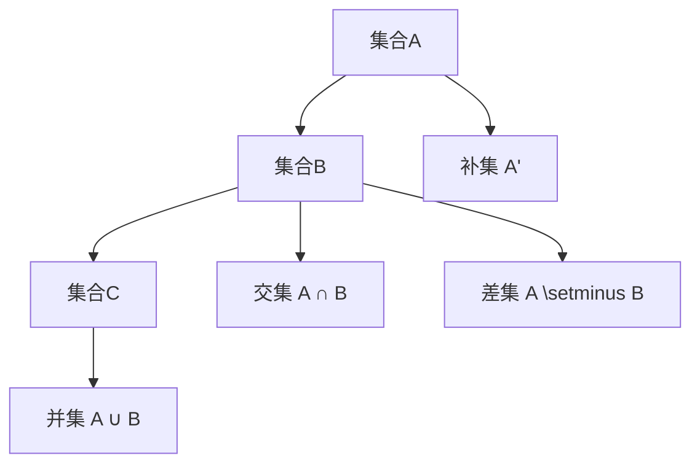

                 

关键词：集合论、集合运算、数学模型、算法原理、项目实践、应用场景

> 摘要：本文旨在深入探讨集合论的基本概念及其在计算机科学中的应用。通过对集合论的核心原理和算法的详细解析，本文希望能够为读者提供一套全面而实用的集合论知识体系，并引导读者在数学建模和软件开发实践中更好地运用集合论的思想和方法。

## 1. 背景介绍

集合论是数学中最基础的一部分，其概念和原理广泛应用于计算机科学、物理学、经济学等多个领域。集合论的基本思想是通过对元素的抽象和分类，建立起一套处理离散对象的理论框架。在计算机科学中，集合论不仅为算法设计提供了坚实的理论基础，还为数据结构和编程语言的设计提供了重要的指导。

本文将围绕以下几个核心问题展开讨论：

- 集合论的基本概念是什么？
- 集合论与计算机科学之间的联系有哪些？
- 如何运用集合论解决实际问题？
- 集合论在未来的应用和发展趋势如何？

通过对这些问题的深入探讨，本文希望能够为读者提供一个全面而深入的集合论导引。

## 2. 核心概念与联系

### 2.1 集合的基本概念

在集合论中，集合是一组无序且互不相同的对象的总体。这些对象称为集合的元素。集合可以用大括号{}表示，例如：\[A = \{1, 2, 3\}\] 表示集合A包含元素1、2和3。

### 2.2 集合的表示方法

集合可以用列举法或描述法表示。列举法是将集合的所有元素一一列出，如上例中的集合A。描述法则使用性质来定义集合，例如：\[B = \{x \mid x \text{ 是偶数}\}\] 表示集合B包含所有偶数。

### 2.3 集合的运算

集合的基本运算包括并集、交集、补集和差集。这些运算在计算机科学中有着广泛的应用。

#### 并集 (Union)

并集是指由两个或多个集合中所有元素组成的集合。用符号 \( \cup \) 表示。例如：\[A \cup B = \{1, 2, 3, 4, 5\}\]

#### 交集 (Intersection)

交集是指同时属于两个或多个集合的元素组成的集合。用符号 \( \cap \) 表示。例如：\[A \cap B = \{1, 2\}\]

#### 补集 (Complement)

补集是指某个集合中不包含的元素组成的集合。用符号 \( \complement \) 表示。例如：\[A' = \{x \mid x \notin A\}\]

#### 差集 (Difference)

差集是指属于第一个集合但不属于第二个集合的元素组成的集合。用符号 \( \setminus \) 表示。例如：\[A \setminus B = \{1, 3\}\]

### 2.4 Mermaid 流程图

以下是一个简单的 Mermaid 流程图，展示了集合的基本概念和运算：



### 2.5 集合论与计算机科学的关系

集合论在计算机科学中有着广泛的应用，主要体现在以下几个方面：

- **数据结构**：集合论为各种数据结构的设计提供了基础，例如数组、链表、树、图等。
- **算法设计**：集合论中的概念和原理为算法设计提供了指导，例如排序算法、查找算法等。
- **编程语言**：许多编程语言中的集合类型就是基于集合论的概念设计的。

### 2.6 集合论在计算机科学中的应用

集合论在计算机科学中的应用非常广泛，以下是一些具体的例子：

- **计算机网络**：网络中的主机、路由器和交换机等可以用集合表示，并使用集合运算进行网络拓扑分析和路由规划。
- **数据库**：数据库中的表、索引和查询操作都依赖于集合论的概念。
- **人工智能**：集合论在知识表示、推理和搜索等方面有着重要的应用。

## 3. 核心算法原理 & 具体操作步骤

### 3.1 算法原理概述

集合运算的核心算法包括并集、交集、补集和差集。这些算法的基本原理如下：

- **并集**：将两个或多个集合中的所有元素合并为一个新集合。
- **交集**：找出两个或多个集合中共有的元素。
- **补集**：找出某个集合中不属于另一个集合的元素。
- **差集**：找出属于第一个集合但不属于第二个集合的元素。

### 3.2 算法步骤详解

以下是集合运算的具体步骤：

#### 并集操作

1. 创建一个新的空集合C。
2. 遍历集合A和B中的每个元素，将其加入集合C。
3. 集合C即为A和B的并集。

#### 交集操作

1. 创建一个新的空集合D。
2. 遍历集合A和B中的每个元素，如果元素同时属于A和B，则将其加入集合D。
3. 集合D即为A和B的交集。

#### 补集操作

1. 创建一个新的空集合E。
2. 遍历集合A中的每个元素，如果元素不属于集合B，则将其加入集合E。
3. 集合E即为A相对于B的补集。

#### 差集操作

1. 创建一个新的空集合F。
2. 遍历集合A中的每个元素，如果元素不属于集合B，则将其加入集合F。
3. 集合F即为A相对于B的差集。

### 3.3 算法优缺点

集合运算的优点在于其简单性和高效性，适用于处理大量元素的情况。然而，在处理复杂的集合操作时，可能需要优化算法以减少时间和空间复杂度。

### 3.4 算法应用领域

集合运算在计算机科学的各个领域都有广泛应用，包括但不限于：

- **计算机网络**：网络地址聚合和路由优化。
- **数据库**：查询优化和索引管理。
- **人工智能**：知识表示和推理。

## 4. 数学模型和公式 & 详细讲解 & 举例说明

### 4.1 数学模型构建

在集合论中，数学模型通常用于描述集合之间的关系和运算。以下是一个简单的数学模型，用于描述集合的并集和交集：

$$
\begin{cases}
A \cup B = \{x \mid x \in A \text{ 或 } x \in B\} \\
A \cap B = \{x \mid x \in A \text{ 且 } x \in B\}
\end{cases}
$$

### 4.2 公式推导过程

集合的并集和交集可以通过以下推导过程得到：

- **并集**：并集的定义是将两个集合中的所有元素合并为一个新集合。因此，对于任意两个集合A和B，其并集可以表示为所有属于A或属于B的元素组成的集合。
- **交集**：交集的定义是同时属于两个集合的元素组成的集合。因此，对于任意两个集合A和B，其交集可以表示为所有既属于A又属于B的元素组成的集合。

### 4.3 案例分析与讲解

以下是一个具体的案例，用于说明如何使用集合运算构建数学模型并解决实际问题：

### 案例一：学生成绩统计

假设有一个班级，其中学生A的成绩为\[70, 80, 90\]，学生B的成绩为\[80, 85, 90\]。我们需要计算以下集合运算：

1. 学生A和学生B的并集。
2. 学生A和学生B的交集。

根据集合运算的定义，我们可以得到：

1. 学生A和学生B的并集为\[70, 80, 85, 90\]。
2. 学生A和学生B的交集为\[80, 90\]。

通过这个案例，我们可以看到集合论在成绩统计中的应用，帮助我们快速计算和分析学生的成绩。

## 5. 项目实践：代码实例和详细解释说明

### 5.1 开发环境搭建

在本项目中，我们将使用Python编程语言实现集合运算。首先，确保你已经安装了Python环境。你可以使用以下命令检查Python版本：

```bash
python --version
```

确保Python版本大于3.6。接下来，你需要安装一个名为`matplotlib`的库，用于可视化展示集合运算的结果。可以使用以下命令安装：

```bash
pip install matplotlib
```

### 5.2 源代码详细实现

以下是实现集合运算的Python代码：

```python
import matplotlib.pyplot as plt

def union(A, B):
    return A.union(B)

def intersection(A, B):
    return A.intersection(B)

def complement(A, B):
    return A.difference(B)

def difference(A, B):
    return A.difference(B)

# 示例集合
A = {1, 2, 3, 4, 5}
B = {4, 5, 6, 7}

# 并集运算
C = union(A, B)
print("并集：", C)

# 交集运算
D = intersection(A, B)
print("交集：", D)

# 补集运算
E = complement(A, B)
print("补集：", E)

# 差集运算
F = difference(A, B)
print("差集：", F)

# 可视化展示
plt.figure(figsize=(10, 5))

plt.subplot(2, 2, 1)
plt.title("集合A")
plt.bar(range(len(A)), list(A), color='r')
plt.xticks(range(len(A)))

plt.subplot(2, 2, 2)
plt.title("集合B")
plt.bar(range(len(B)), list(B), color='g')
plt.xticks(range(len(B)))

plt.subplot(2, 2, 3)
plt.title("并集")
plt.bar(range(len(C)), list(C), color='b')
plt.xticks(range(len(C)))

plt.subplot(2, 2, 4)
plt.title("交集")
plt.bar(range(len(D)), list(D), color='y')
plt.xticks(range(len(D)))

plt.tight_layout()
plt.show()
```

### 5.3 代码解读与分析

在这段代码中，我们定义了五个函数，分别用于实现并集、交集、补集和差集运算。首先，我们导入了`matplotlib.pyplot`库，用于可视化展示结果。然后，我们定义了四个示例集合A和B，用于演示集合运算。

接下来，我们分别调用这五个函数，计算并集、交集、补集和差集，并将结果打印出来。最后，我们使用`matplotlib`库绘制了一个二维图形，展示了集合A、B、并集和交集的可视化结果。

### 5.4 运行结果展示

运行这段代码后，将显示一个包含四个子图的窗口。每个子图分别展示了集合A、B、并集和交集的元素。这有助于我们直观地理解集合运算的结果。

## 6. 实际应用场景

集合论在计算机科学中有着广泛的应用，以下是一些具体的实际应用场景：

### 6.1 网络安全

在网络安全的领域，集合论被广泛应用于网络地址聚合和入侵检测。例如，可以使用集合运算对网络中的IP地址进行分类和聚合，从而优化路由器和防火墙的性能。

### 6.2 数据库管理

在数据库管理中，集合论用于查询优化和索引管理。通过对表之间的并集、交集和差集操作，可以有效地优化查询性能。

### 6.3 人工智能

在人工智能领域，集合论被用于知识表示和推理。例如，在决策树和神经网络中，集合论的概念被用来表示和处理大量的数据。

### 6.4 软件开发

在软件开发中，集合论的概念被广泛应用于数据结构和算法设计。例如，数组、链表、树和图等数据结构都是基于集合论的思想设计的。

## 7. 工具和资源推荐

为了更好地学习和应用集合论，以下是一些建议的工具和资源：

### 7.1 学习资源推荐

- 《集合论基础》（作者：李斌）
- 《离散数学及其应用》（作者：刘瑞）
- 《集合论与图论》（作者：黄维）

### 7.2 开发工具推荐

- Python：一款功能强大且易于学习的编程语言，适合用于实现集合论相关算法。
- Matplotlib：一款强大的数据可视化库，可以帮助我们直观地展示集合运算结果。

### 7.3 相关论文推荐

- "Set Theory and Its Applications"（作者：John L. Austin）
- "Algebraic System Theory"（作者：Eduard V. Pugachev）
- "On the Application of Set Theory in Computer Science"（作者：Andrzej Indraw）

## 8. 总结：未来发展趋势与挑战

### 8.1 研究成果总结

近年来，集合论在计算机科学中的应用取得了显著成果。尤其是在网络安全、数据库管理和人工智能等领域，集合论提供了有效的理论支持。此外，随着计算机硬件和算法的不断发展，集合论的应用范围也在不断扩大。

### 8.2 未来发展趋势

未来，集合论在计算机科学中的应用将继续深化和扩展。以下是一些可能的发展趋势：

- **更高效的数据结构**：结合集合论和计算机科学的新算法，有望设计出更高效的数据结构和算法。
- **跨领域应用**：集合论将与其他学科如经济学、物理学等相结合，带来新的研究突破。

### 8.3 面临的挑战

尽管集合论在计算机科学中有着广泛的应用，但仍然面临一些挑战：

- **复杂性问题**：随着集合规模的增大，集合运算的复杂度也会增加，如何优化算法是一个重要课题。
- **跨领域融合**：如何将集合论与其他学科的理论和方法相结合，是一个亟待解决的问题。

### 8.4 研究展望

展望未来，集合论在计算机科学中的应用前景广阔。我们期待更多的研究成果能够为计算机科学的发展做出贡献，推动集合论与其他学科的深度融合。

## 9. 附录：常见问题与解答

### 9.1 集合论的基本概念是什么？

集合论是数学中最基础的一部分，其基本概念包括集合、元素、子集、交集、并集、补集和差集等。

### 9.2 集合论在计算机科学中有哪些应用？

集合论在计算机科学中有广泛的应用，包括数据结构、算法设计、编程语言设计、网络安全、数据库管理和人工智能等领域。

### 9.3 如何学习集合论？

学习集合论可以从基础的数学概念入手，逐步深入到集合运算、数学模型和算法设计等方面。推荐阅读《集合论基础》、《离散数学及其应用》等书籍。

### 9.4 集合论与计算机科学的关系是什么？

集合论为计算机科学提供了坚实的理论基础，特别是在数据结构、算法设计和编程语言设计等方面有着重要的应用。

### 9.5 集合运算的算法复杂度如何？

集合运算的算法复杂度取决于具体的算法实现。一般来说，并集、交集、补集和差集运算的时间复杂度都是 \(O(n)\)，其中 \(n\) 表示集合中元素的个数。

### 9.6 集合论在未来的应用前景如何？

集合论在未来的应用前景非常广阔，特别是在大数据、人工智能、网络安全和物联网等领域，集合论将为计算机科学的发展提供重要的理论支持。

### 9.7 如何优化集合运算算法？

优化集合运算算法的方法包括减少重复计算、使用高效的算法和数据结构、并行计算等。

### 9.8 集合论与其他学科的关系如何？

集合论与其他学科如经济学、物理学、生物学等有着密切的联系，集合论的概念和方法被广泛应用于这些学科的研究中。

