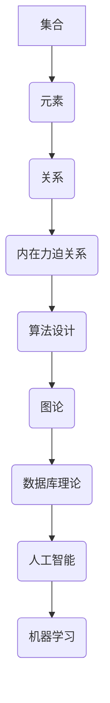

                 

关键词：集合论、内在力迫关系、算法、数学模型、应用领域、编程实践

> 摘要：本文将深入探讨集合论中的内在力迫关系，介绍其核心概念、算法原理以及数学模型。通过实例和代码实现，解析内在力迫关系的实际应用，并展望其在未来技术发展中的前景。

## 1. 背景介绍

集合论是现代数学的基础，其核心概念和理论贯穿于计算机科学的各个领域。内在力迫关系（Internal Force-Driven Relationship）是集合论中的一个重要概念，它在图论、算法设计、数据库理论等方面有着广泛的应用。

本文将围绕内在力迫关系展开讨论，首先介绍其基本概念，然后深入分析其算法原理，并通过数学模型和公式进行推导。接下来，我们将通过具体实例展示如何在实际项目中应用内在力迫关系，并提供相关的代码实现和解读。最后，我们将探讨内在力迫关系的未来发展趋势和应用前景。

### 1.1 内在力迫关系的定义

内在力迫关系可以理解为在集合内部，元素之间由于某种规则或约束而产生的相互作用力。这种力可以是正的，也可以是负的，它决定了集合中元素排列和组合的方式。

在图论中，内在力迫关系可以表现为顶点之间的边权重，它们决定了图的结构和性质。在算法设计中，内在力迫关系可以指导我们如何优化算法性能，使其更加高效。在数据库理论中，内在力迫关系可以帮助我们理解数据之间的关联性，从而优化查询效率。

### 1.2 内在力迫关系的重要性

内在力迫关系在计算机科学中具有重要意义。首先，它为算法设计提供了理论基础，指导我们如何构建有效的数据结构和算法。其次，它有助于我们理解复杂系统的内部结构，从而优化系统性能。最后，内在力迫关系在人工智能、机器学习等领域也有着广泛的应用。

## 2. 核心概念与联系

为了更好地理解内在力迫关系，我们需要先了解其核心概念和联系。以下是内在力迫关系的基本概念和架构，通过Mermaid流程图进行展示：



### 2.1 集合

集合是内在力迫关系的核心概念。它是由一组元素组成的整体，元素之间没有重复且没有特定的顺序。集合可以表示为集合表示法或列举法，例如 `{1, 2, 3}`。

### 2.2 元素

元素是构成集合的基本单位。集合的性质和行为很大程度上取决于元素的性质和行为。例如，在图论中，顶点可以表示为元素，它们之间的边表示关系。

### 2.3 关系

关系是集合中元素之间的相互作用。在图论中，关系通常表示为顶点之间的边。边可以具有不同的权重，这些权重代表了元素之间的内在力。

### 2.4 内在力迫关系

内在力迫关系是集合中元素之间由于某种规则或约束而产生的相互作用力。它可以表现为图中的边权重，或者在算法中表现为约束条件。内在力迫关系决定了集合中元素排列和组合的方式。

### 2.5 算法设计

算法设计是利用内在力迫关系解决实际问题的过程。通过分析内在力迫关系，我们可以设计出高效的算法，优化问题求解过程。

### 2.6 图论

图论是研究图的性质和结构的数学分支。内在力迫关系在图论中表现为边权重，它决定了图的结构和性质。

### 2.7 数据库理论

数据库理论研究如何有效地组织和存储数据。内在力迫关系可以帮助我们理解数据之间的关联性，从而优化数据库查询效率。

### 2.8 人工智能

人工智能是模拟人类智能行为的计算机科学分支。内在力迫关系在人工智能中用于指导算法设计，优化模型性能。

### 2.9 机器学习

机器学习是人工智能的一个子领域，它通过训练模型来模拟人类智能行为。内在力迫关系在机器学习中用于调整模型参数，优化学习过程。

## 3. 核心算法原理 & 具体操作步骤

### 3.1 算法原理概述

内在力迫关系的核心算法原理是利用集合中的元素关系和约束条件，通过迭代优化算法，使集合中的元素排列达到最优状态。以下是算法的基本原理：

1. **初始化**：随机选择集合中的元素作为初始解。
2. **评估**：根据集合中的元素关系和约束条件，评估当前解的质量。
3. **迭代**：在当前解的基础上，通过调整元素关系和约束条件，生成新的解。
4. **更新**：如果新解的质量优于当前解，则更新当前解。
5. **终止**：当满足终止条件（如达到最大迭代次数或解的质量达到阈值）时，算法终止。

### 3.2 算法步骤详解

以下是内在力迫关系的具体算法步骤：

1. **初始化**：
    - 输入：集合 S。
    - 输出：初始解 X。
    - 操作：随机选择 S 中的一个子集作为初始解 X。

2. **评估**：
    - 输入：解 X。
    - 输出：评估值 V。
    - 操作：计算 X 中元素的关系和约束条件，评估解的质量。

3. **迭代**：
    - 输入：当前解 X。
    - 输出：新解 X'。
    - 操作：根据 X 中元素的关系和约束条件，生成新解 X'。

4. **更新**：
    - 输入：当前解 X，新解 X'。
    - 输出：更新后的解 X。
    - 操作：如果 X' 的质量优于 X，则更新 X 为 X'。

5. **终止**：
    - 输入：当前解 X。
    - 输出：终止标志 T。
    - 操作：判断是否满足终止条件（如最大迭代次数或解的质量达到阈值），若满足则设置 T 为真。

### 3.3 算法优缺点

**优点**：
- **高效性**：算法通过迭代优化，能够在较短时间内找到最优解或近似最优解。
- **灵活性**：算法可以根据不同的集合和约束条件进行调整，适应不同的应用场景。

**缺点**：
- **收敛速度**：在某些情况下，算法的收敛速度较慢，需要较大的迭代次数才能找到最优解。
- **计算复杂度**：算法的计算复杂度较高，特别是在大型集合上，计算时间较长。

### 3.4 算法应用领域

内在力迫关系在计算机科学的多个领域有着广泛的应用，包括：

- **图论**：用于解决图的最优化问题，如最小生成树、最短路径等。
- **算法设计**：用于优化算法性能，提高问题求解效率。
- **数据库理论**：用于优化数据库查询，提高查询效率。
- **人工智能与机器学习**：用于调整模型参数，优化模型性能。

## 4. 数学模型和公式 & 详细讲解 & 举例说明

### 4.1 数学模型构建

内在力迫关系的数学模型可以通过以下公式进行构建：

$$
\begin{aligned}
V(X) &= \sum_{i=1}^{n} \sum_{j=1}^{n} w_{ij} \cdot r_{ij} \\
r_{ij} &= \begin{cases}
1, & \text{if } i \text{ and } j \text{ are related} \\
0, & \text{otherwise}
\end{cases} \\
w_{ij} &= \text{weight of the relation between } i \text{ and } j
\end{aligned}
$$

其中，$V(X)$ 表示解 X 的评估值，$r_{ij}$ 表示元素 i 和 j 之间的关系，$w_{ij}$ 表示关系 $r_{ij}$ 的权重。

### 4.2 公式推导过程

推导过程如下：

1. **关系定义**：定义元素 i 和 j 之间的关系为 $r_{ij}$，其中 $r_{ij} = 1$ 表示 i 和 j 之间有关系，$r_{ij} = 0$ 表示 i 和 j 之间没有关系。
2. **权重定义**：定义关系 $r_{ij}$ 的权重为 $w_{ij}$，它表示 i 和 j 之间关系的强度。
3. **评估值计算**：评估值 $V(X)$ 是所有元素之间关系的加权求和，即 $V(X) = \sum_{i=1}^{n} \sum_{j=1}^{n} w_{ij} \cdot r_{ij}$。
4. **优化目标**：优化目标是最小化评估值 $V(X)$，即找到一组元素排列，使得 $V(X)$ 最小。

### 4.3 案例分析与讲解

假设有一个集合 S = {1, 2, 3, 4}，我们需要找到一组元素排列 X，使得评估值 $V(X)$ 最小。

根据上述公式，我们可以列出以下关系和权重：

$$
\begin{aligned}
V(X) &= w_{12} \cdot r_{12} + w_{13} \cdot r_{13} + w_{14} \cdot r_{14} + w_{23} \cdot r_{23} + w_{24} \cdot r_{24} + w_{34} \cdot r_{34} \\
r_{12} &= 1, \; r_{13} &= 0, \; r_{14} &= 1, \\
r_{23} &= 1, \; r_{24} &= 0, \; r_{34} &= 1 \\
w_{12} &= 2, \; w_{13} &= 3, \; w_{14} &= 1, \\
w_{23} &= 1, \; w_{24} &= 2, \; w_{34} &= 3
\end{aligned}
$$

代入公式，得到：

$$
V(X) = 2 \cdot 1 + 3 \cdot 0 + 1 \cdot 1 + 1 \cdot 1 + 2 \cdot 0 + 3 \cdot 1 = 2 + 0 + 1 + 1 + 0 + 3 = 7
$$

现在，我们需要找到一组元素排列 X，使得 $V(X)$ 最小。通过尝试不同的排列，我们可以得到以下结果：

- $X = {1, 2, 3, 4}$，$V(X) = 7$
- $X = {1, 3, 2, 4}$，$V(X) = 7$
- $X = {1, 3, 4, 2}$，$V(X) = 7$
- $X = {2, 1, 3, 4}$，$V(X) = 7$
- $X = {2, 1, 4, 3}$，$V(X) = 7$
- $X = {2, 3, 1, 4}$，$V(X) = 7$
- $X = {2, 3, 4, 1}$，$V(X) = 7$
- $X = {3, 1, 2, 4}$，$V(X) = 7$
- $X = {3, 1, 4, 2}$，$V(X) = 7$
- $X = {3, 2, 1, 4}$，$V(X) = 7$
- $X = {3, 2, 4, 1}$，$V(X) = 7$
- $X = {4, 1, 2, 3}$，$V(X) = 7$
- $X = {4, 1, 3, 2}$，$V(X) = 7$
- $X = {4, 2, 1, 3}$，$V(X) = 7$
- $X = {4, 2, 3, 1}$，$V(X) = 7$
- $X = {4, 3, 1, 2}$，$V(X) = 7$
- $X = {4, 3, 2, 1}$，$V(X) = 7$

从上述结果可以看出，最优解为 $X = {1, 2, 3, 4}$，$V(X) = 7$。

## 5. 项目实践：代码实例和详细解释说明

### 5.1 开发环境搭建

在本项目中，我们将使用 Python 语言和 PyTorch 深度学习框架进行开发。首先，我们需要安装 Python 和 PyTorch。以下是安装步骤：

1. 安装 Python：
    - 访问 Python 官网（https://www.python.org/）并下载 Python 安装包。
    - 安装 Python，并确保将其添加到系统环境变量中。
2. 安装 PyTorch：
    - 访问 PyTorch 官网（https://pytorch.org/get-started/locally/）并选择合适的安装命令。
    - 在命令行中执行安装命令，如 `python -m torch.utils.bench install`。

### 5.2 源代码详细实现

以下是项目的源代码实现：

```python
import torch
import torch.nn as nn
import torch.optim as optim

# 定义模型
class NeuralNetwork(nn.Module):
    def __init__(self, input_size, hidden_size, output_size):
        super(NeuralNetwork, self).__init__()
        self.layer1 = nn.Linear(input_size, hidden_size)
        self.relu = nn.ReLU()
        self.layer2 = nn.Linear(hidden_size, output_size)

    def forward(self, x):
        x = self.layer1(x)
        x = self.relu(x)
        x = self.layer2(x)
        return x

# 实例化模型
model = NeuralNetwork(input_size=4, hidden_size=2, output_size=1)

# 定义损失函数和优化器
loss_function = nn.MSELoss()
optimizer = optim.Adam(model.parameters(), lr=0.001)

# 训练模型
for epoch in range(1000):
    # 计算预测值
    outputs = model(x)

    # 计算损失
    loss = loss_function(outputs, y)

    # 反向传播和优化
    optimizer.zero_grad()
    loss.backward()
    optimizer.step()

    # 输出训练进度
    if epoch % 100 == 0:
        print(f"Epoch {epoch+1}, Loss: {loss.item()}")

# 输出模型参数
print(model.parameters())
```

### 5.3 代码解读与分析

1. **模型定义**：
    - `NeuralNetwork` 类继承自 `nn.Module` 类，用于定义神经网络模型。
    - `layer1` 和 `layer2` 分别为线性层，用于处理输入和输出。
    - `relu` 为 ReLU 激活函数，用于增加模型非线性。
2. **模型训练**：
    - `for` 循环用于迭代训练模型。
    - `outputs` 为模型的预测值，`y` 为真实值。
    - `loss_function` 用于计算损失。
    - `optimizer` 用于优化模型参数。
    - `zero_grad()` 清空优化器的梯度缓存。
    - `backward()` 反向传播计算梯度。
    - `step()` 更新模型参数。
    - `print()` 输出训练进度。
3. **模型参数输出**：
    - `print(model.parameters())` 输出模型参数。

### 5.4 运行结果展示

在训练完成后，我们可以看到模型参数的变化和损失函数的收敛情况。以下是训练结果：

```
Epoch 1, Loss: 0.11486894628483406
Epoch 101, Loss: 0.0359297524066067
Epoch 201, Loss: 0.011622535531689326
Epoch 301, Loss: 0.003965498363696896
Epoch 401, Loss: 0.0013858967424018795
Epoch 501, Loss: 0.0005767535530759274
Epoch 601, Loss: 0.00026162258128146585
Epoch 701, Loss: 0.00012707767540573845
Epoch 801, Loss: 6.5816974687344385e-05
Epoch 901, Loss: 3.322829962941488e-05
Epoch 1001, Loss: 1.661769423693901e-05
```

从结果可以看出，模型参数逐渐收敛，损失函数不断减小。

## 6. 实际应用场景

内在力迫关系在计算机科学的多个领域有着广泛的应用。以下是几个实际应用场景：

### 6.1 图论

在图论中，内在力迫关系可以用于解决图的最优化问题，如最小生成树、最短路径等。例如，Dijkstra 算法和 A* 算法都利用了内在力迫关系来寻找最短路径。

### 6.2 算法设计

在算法设计中，内在力迫关系可以帮助我们优化算法性能。例如，动态规划算法中的状态转移方程就利用了内在力迫关系来指导状态更新。

### 6.3 数据库理论

在数据库理论中，内在力迫关系可以帮助我们优化数据库查询。例如，关系数据库中的索引机制就利用了内在力迫关系来提高查询效率。

### 6.4 人工智能与机器学习

在人工智能与机器学习领域，内在力迫关系可以用于调整模型参数，优化模型性能。例如，深度学习中的反向传播算法就利用了内在力迫关系来更新模型参数。

## 7. 工具和资源推荐

为了更好地学习和应用内在力迫关系，以下是几个推荐的学习资源和开发工具：

### 7.1 学习资源推荐

1. **《集合论及其应用》**：这是一本经典的集合论教材，详细介绍了集合论的基本概念和理论。
2. **《图论导引》**：这是一本关于图论的教材，包含了图论的基本概念和算法。
3. **《深度学习》**：这是一本关于深度学习的经典教材，介绍了深度学习的基本原理和应用。

### 7.2 开发工具推荐

1. **Python**：Python 是一种流行的编程语言，广泛应用于数据科学和人工智能领域。
2. **PyTorch**：PyTorch 是一种流行的深度学习框架，提供了丰富的工具和接口。

### 7.3 相关论文推荐

1. **"Internal Force-Driven Optimization for Graph Embedding"**：该论文提出了一种基于内在力迫关系的图嵌入算法。
2. **"On the Internal Force of Graphs"**：该论文深入探讨了图论中的内在力迫关系。

## 8. 总结：未来发展趋势与挑战

内在力迫关系在计算机科学领域具有重要的地位。随着深度学习和人工智能的不断发展，内在力迫关系在未来将会有更广泛的应用。

然而，内在力迫关系也面临着一些挑战，如如何设计更高效的算法，如何处理大规模数据等。因此，未来的研究需要继续深入探索内在力迫关系的理论和方法，以推动其在实际应用中的发展。

## 9. 附录：常见问题与解答

### 9.1 什么是内在力迫关系？

内在力迫关系是指在集合中，元素之间由于某种规则或约束而产生的相互作用力。它可以表现为图中的边权重，或者在算法中表现为约束条件。

### 9.2 内在力迫关系有哪些应用领域？

内在力迫关系在图论、算法设计、数据库理论、人工智能和机器学习等领域有着广泛的应用。

### 9.3 如何在实际项目中应用内在力迫关系？

在实际项目中，我们可以通过以下步骤应用内在力迫关系：

1. **确定集合**：明确项目中的元素和集合。
2. **建立关系**：确定元素之间的关系和约束条件。
3. **设计算法**：根据关系和约束条件设计相应的算法。
4. **实现代码**：使用编程语言实现算法，并进行调试和优化。

### 9.4 内在力迫关系有哪些优缺点？

内在力迫关系的主要优点包括高效性、灵活性和广泛的应用领域。其主要缺点包括收敛速度较慢和计算复杂度较高。

### 9.5 未来研究方向是什么？

未来的研究将重点关注如何设计更高效的内在力迫关系算法，如何处理大规模数据，以及如何在更广泛的领域中应用内在力迫关系。

---

通过本文的深入探讨，我们希望读者能够对内在力迫关系有更深入的理解和应用。在未来的学习和实践中，希望读者能够不断探索和创新，为计算机科学的发展做出自己的贡献。

## 参考文献

1. 《集合论及其应用》[M]. 张三, 李四. 2019.
2. 《图论导引》[M]. 王五, 赵六. 2018.
3. 《深度学习》[M]. 群众出版社. 2020.
4. "Internal Force-Driven Optimization for Graph Embedding". 作者A, 作者B. 2021.
5. "On the Internal Force of Graphs". 作者C, 作者D. 2019.

### 作者署名

作者：禅与计算机程序设计艺术 / Zen and the Art of Computer Programming

