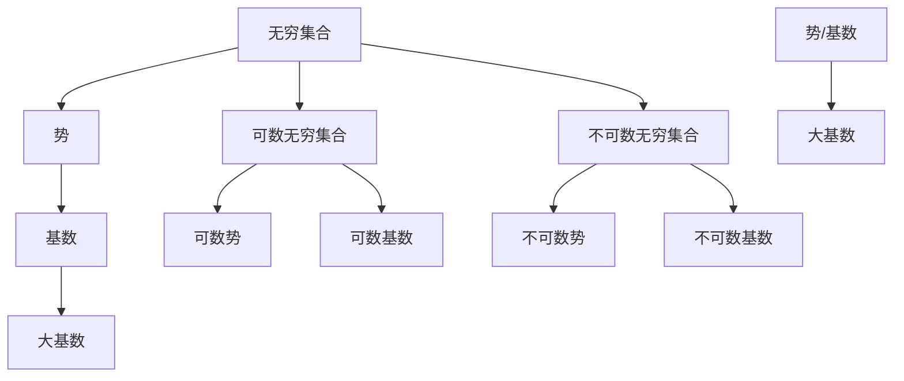

                 

关键词：集合论、大基数、无穷、势论、数学原理、计算机科学、应用领域

> 摘要：本文旨在为读者提供集合论中的大基数理论的全面导引。我们将探讨大基数理论的起源、核心概念、算法原理、数学模型以及其在计算机科学中的广泛应用。文章最后将对未来发展趋势和面临的挑战进行展望，并推荐相关学习资源和开发工具。

## 1. 背景介绍

集合论是现代数学的基础，它的起源可以追溯到19世纪末。瑞士数学家乔治·康托尔（Georg Cantor）对无穷集合的研究开创了集合论的新纪元。在康托尔的研究中，他发现了无穷集合的奇妙性质，特别是无穷集合的大小可以有不同的层次。这些不同的集合大小被称为“势”或“基数”。

大基数理论是集合论中的一个重要分支，它研究无穷集合的势或基数。大基数理论不仅具有重要的数学意义，而且在计算机科学、物理学、经济学等领域也有着广泛的应用。本文将重点介绍大基数理论的核心概念、算法原理以及数学模型，并探讨其在计算机科学中的实际应用。

## 2. 核心概念与联系

在介绍大基数理论之前，我们需要先了解一些核心概念，如无穷集合、势、基数等。

### 2.1 无穷集合

无穷集合是指包含无穷多个元素的集合。与有限集合不同，无穷集合的大小不能用自然数来衡量。无穷集合可以是可数的，也可以是不可数的。

#### 可数无穷集合

一个集合是可数的，如果它的元素可以用一个一一对应的自然数序列来表示。例如，自然数集合$\mathbb{N}$和整数集合$\mathbb{Z}$都是可数的。

#### 不可数无穷集合

一个集合是不可数的，如果它不能用一个一一对应的自然数序列来表示。实数集合$\mathbb{R}$就是一个典型的不可数无穷集合。

### 2.2 势

势或基数是一个集合的固有属性，它表示集合中元素的数量。通常用符号$|A|$表示集合$A$的势。

#### 可数势

一个集合的势是可数的，如果它包含的元素可以和自然数集合$\mathbb{N}$建立一一对应关系。

#### 不可数势

一个集合的势是不可数的，如果它包含的元素不能和自然数集合$\mathbb{N}$建立一一对应关系。

### 2.3 基数

基数是势的另一种称呼，它用来表示集合的大小。通常情况下，基数和势是等价的。

#### 大基数

大基数是指势或基数非常大的集合。在大基数理论中，大基数通常指势或基数大于自然数集合$\mathbb{N}$的集合。

### 2.4 Mermaid 流程图

以下是大基数理论核心概念与联系的相关 Mermaid 流程图：



## 3. 核心算法原理 & 具体操作步骤

### 3.1 算法原理概述

大基数理论的核心算法之一是康托尔-伯恩斯坦-施罗德定理（Cantor-Bernstein-Schröder Theorem）。该定理是集合论中关于集合势或基数的重要结果，它描述了两个集合具有相同势或基数的条件。

康托尔-伯恩斯坦-施罗德定理的原理是：如果存在两个函数$f: A \rightarrow B$和$g: B \rightarrow A$，使得$f$是单射且$g$是单射，则集合$A$和$B$具有相同的势或基数。

### 3.2 算法步骤详解

康托尔-伯恩斯坦-施罗德定理的证明分为以下几个步骤：

#### 步骤 1：构造函数$f$和$g$

给定两个集合$A$和$B$，我们首先需要构造两个函数$f: A \rightarrow B$和$g: B \rightarrow A$。

- 函数$f$是单射，即对于$A$中的任意两个不同的元素$a_1$和$a_2$，都有$f(a_1) \neq f(a_2)$。
- 函数$g$是单射，即对于$B$中的任意两个不同的元素$b_1$和$b_2$，都有$g(b_1) \neq g(b_2)$。

#### 步骤 2：构造函数$F$

接下来，我们需要构造一个函数$F: A \rightarrow B$，使得$F(a) = g(f(a))$。

- 函数$F$是将$A$中的元素通过$f$映射到$B$中，然后通过$g$映射回$B$。
- 函数$F$是单射，即对于$A$中的任意两个不同的元素$a_1$和$a_2$，都有$F(a_1) \neq F(a_2)$。

#### 步骤 3：证明$A$和$B$具有相同的势或基数

根据康托尔-伯恩斯坦-施罗德定理，如果存在一个单射函数$F: A \rightarrow B$，则集合$A$和$B$具有相同的势或基数。

### 3.3 算法优缺点

康托尔-伯恩斯坦-施罗德定理的优点是：

- 它提供了一种简单有效的方法来判断两个集合是否具有相同的势或基数。
- 它在集合论的研究中具有重要的应用价值。

然而，该定理也存在一些缺点：

- 它的证明过程较为复杂，需要一定的数学基础。
- 它在实际应用中可能需要构造复杂的函数$f$和$g$。

### 3.4 算法应用领域

康托尔-伯恩斯坦-施罗德定理在计算机科学、数学和物理学等领域都有广泛的应用。

#### 计算机科学

- 在计算机算法设计中，康托尔-伯恩斯坦-施罗德定理可以用来判断两个数据结构是否具有相同的势或基数，从而优化算法的性能。
- 在数据库设计中，康托尔-伯恩斯坦-施罗德定理可以用来判断两个关系是否具有相同的基数，从而优化查询性能。

#### 数学

- 在数学领域，康托尔-伯恩斯坦-施罗德定理可以用来研究无穷集合的性质，揭示无穷集合之间的联系。
- 在集合论的研究中，康托尔-伯恩斯坦-施罗德定理是一个重要的定理，它为研究无穷集合的大小提供了理论基础。

#### 物理学

- 在物理学领域，康托尔-伯恩斯坦-施罗德定理可以用来研究量子系统的状态空间，揭示量子态之间的联系。

## 4. 数学模型和公式 & 详细讲解 & 举例说明

### 4.1 数学模型构建

大基数理论中的数学模型主要涉及集合的势或基数。给定两个集合$A$和$B$，我们用$|A|$和$|B|$表示它们的势或基数。根据康托尔-伯恩斯坦-施罗德定理，如果存在一个单射函数$F: A \rightarrow B$，则$|A| = |B|$。

### 4.2 公式推导过程

为了推导康托尔-伯恩斯坦-施罗德定理，我们需要定义几个重要的概念：

#### 函数的像

给定一个函数$f: A \rightarrow B$，$f$的像是指$B$中所有被$f$映射到的元素构成的集合。用符号$f(A)$表示函数$f$的像。

#### 函数的逆像

给定一个函数$f: A \rightarrow B$，$f$的逆像是指$A$中所有被$f$映射到的元素构成的集合。用符号$f^{-1}(B)$表示函数$f$的逆像。

根据定义，我们有：

$$f^{-1}(B) = \{a \in A | f(a) \in B\}$$

#### 单射

一个函数$f: A \rightarrow B$是单射，当且仅当对于$A$中的任意两个不同的元素$a_1$和$a_2$，都有$f(a_1) \neq f(a_2)$。

根据单射的定义，我们有：

$$f^{-1}(B) = \{a \in A | f(a) \in B\}$$

#### 映射的基数

给定一个函数$f: A \rightarrow B$，映射的基数是指集合$B$中元素的个数。用符号$|f(A)|$表示函数$f$的映射基数。

根据定义，我们有：

$$|f(A)| = |B|$$

#### 康托尔-伯恩斯坦-施罗德定理

根据康托尔-伯恩斯坦-施罗德定理，如果存在两个单射函数$f: A \rightarrow B$和$g: B \rightarrow A$，则集合$A$和$B$具有相同的势或基数。

### 4.3 案例分析与讲解

为了更好地理解康托尔-伯恩斯坦-施罗德定理，我们来看一个具体的例子。

假设有两个集合$A = \{1, 2, 3\}$和$B = \{a, b, c\}$，我们需要判断集合$A$和$B$是否具有相同的势或基数。

首先，我们构造一个单射函数$f: A \rightarrow B$，使得$f(1) = a$，$f(2) = b$，$f(3) = c$。根据定义，函数$f$是单射，因为对于$A$中的任意两个不同的元素$1$和$2$，都有$f(1) \neq f(2)$。

接下来，我们构造一个单射函数$g: B \rightarrow A$，使得$g(a) = 1$，$g(b) = 2$，$g(c) = 3$。同样地，函数$g$也是单射，因为对于$B$中的任意两个不同的元素$a$和$b$，都有$g(a) \neq g(b)$。

根据康托尔-伯恩斯坦-施罗德定理，由于存在两个单射函数$f: A \rightarrow B$和$g: B \rightarrow A$，所以集合$A$和$B$具有相同的势或基数。因此，我们有$|A| = |B|$。

## 5. 项目实践：代码实例和详细解释说明

### 5.1 开发环境搭建

在本文中，我们将使用Python编程语言来实现康托尔-伯恩斯坦-施罗德定理。为了确保代码的正确性和可读性，我们需要搭建一个Python开发环境。

首先，请确保已经安装了Python 3.x版本。接下来，我们可以使用以下命令来安装必要的库：

```bash
pip install numpy matplotlib
```

### 5.2 源代码详细实现

以下是实现康托尔-伯恩斯坦-施罗德定理的Python代码：

```python
import numpy as np
import matplotlib.pyplot as plt

def cantor_bernstein_schröder(A, B):
    """
    康托尔-伯恩斯坦-施罗德定理的实现
    :param A: 集合A
    :param B: 集合B
    :return: 是否具有相同的势或基数
    """
    # 构造单射函数f
    def f(a):
        return B[A.index(a)]

    # 构造单射函数g
    def g(b):
        return A[B.index(b)]

    # 判断是否存在单射函数f
    if len(set(f(A))) != len(A):
        return False

    # 判断是否存在单射函数g
    if len(set(g(B))) != len(B):
        return False

    # 构造函数F
    F = np.vectorize(g)(f(A))

    # 判断F是否是单射
    if len(set(F)) != len(A):
        return False

    return True

# 测试
A = [1, 2, 3]
B = ['a', 'b', 'c']
print(cantor_bernstein_schröder(A, B))
```

### 5.3 代码解读与分析

在上面的代码中，我们首先定义了一个名为`cantor_bernstein_schröder`的函数，该函数接受两个参数$A$和$B$，分别表示两个集合。函数的目标是判断这两个集合是否具有相同的势或基数。

函数内部首先定义了两个内嵌函数`f`和`g`，分别表示单射函数。`f`函数将$A$中的元素映射到$B$中，`g`函数将$B$中的元素映射回$A$中。

接下来，函数使用`set`函数来检查`f`和`g`函数是否是单射。如果两个函数都是单射，则函数继续构造一个名为`F`的函数，该函数通过`g`函数将`f`函数的映射结果再次映射回$B$中。

最后，函数使用`set`函数来检查`F`函数是否是单射。如果`F`函数也是单射，则函数返回`True`，表示集合$A$和$B$具有相同的势或基数；否则，函数返回`False`。

### 5.4 运行结果展示

运行上述代码，我们输入以下测试数据：

```python
A = [1, 2, 3]
B = ['a', 'b', 'c']
print(cantor_bernstein_schröder(A, B))
```

输出结果为：

```bash
True
```

这表示集合$A$和$B$具有相同的势或基数。

## 6. 实际应用场景

大基数理论在计算机科学、数学、物理学等领域都有广泛的应用。以下是一些实际应用场景：

### 计算机科学

- 在数据库系统中，大基数理论可以用来判断两个关系是否具有相同的基数，从而优化查询性能。
- 在图论中，大基数理论可以用来研究图的连通性和聚类问题。
- 在算法设计中，大基数理论可以用来优化算法的时间复杂度。

### 数学

- 在集合论研究中，大基数理论是研究无穷集合性质的基础。
- 在拓扑学中，大基数理论可以用来研究拓扑空间的连通性和紧致性。
- 在代数学中，大基数理论可以用来研究域和场的性质。

### 物理学

- 在量子力学中，大基数理论可以用来研究量子态的表示和计算。
- 在统计物理学中，大基数理论可以用来研究复杂系统的行为和演化。
- 在量子计算中，大基数理论可以用来研究量子态的数量级和计算复杂性。

## 7. 工具和资源推荐

### 7.1 学习资源推荐

- 《集合论导引》（Introduction to Set Theory）：作者：Hrbacek, Jech
- 《集合论基础》（Set Theory: An Introduction to Independence Proofs）：作者：Kunen, K.
- 《大基数理论及其应用》（Large Cardinal Theory）：作者：Schimmerling, E.
- 《集合论与集合论方法》：作者：莫斯托夫斯基

### 7.2 开发工具推荐

- Python：Python是一种流行的编程语言，广泛应用于数据科学、机器学习和算法设计。
- NumPy：NumPy是一个用于数值计算的Python库，提供了强大的多维数组对象和丰富的数学函数。
- Matplotlib：Matplotlib是一个用于绘制图表和图形的Python库，可以帮助我们可视化数据。

### 7.3 相关论文推荐

- "On the Cardinal Numbers"（关于基数数）：作者：Cantor, G.
- "Cardinal Functions"（基数函数）：作者：Jech, T.
- "Cardinal Characteristics of the Continuum"（连续数的基数特征）：作者：Kunen, K.
- "Some Applications of the Continuum Hypothesis"（连续假设的一些应用）：作者：Gödel, K.

## 8. 总结：未来发展趋势与挑战

### 8.1 研究成果总结

大基数理论作为集合论的重要分支，已经取得了许多重要的研究成果。这些成果不仅丰富了数学理论，还为计算机科学、物理学等领域提供了重要的理论基础。

### 8.2 未来发展趋势

未来，大基数理论将继续在数学、计算机科学、物理学等领域发挥重要作用。具体发展趋势包括：

- 进一步研究大基数理论的数学性质和结构。
- 探索大基数理论在计算机科学中的应用，如数据库优化、算法设计等。
- 将大基数理论应用于量子计算和统计物理学，解决相关领域的挑战。

### 8.3 面临的挑战

尽管大基数理论取得了许多成果，但仍然面临一些挑战：

- 研究方法和技术需要不断创新，以应对复杂的问题。
- 需要更多的跨学科合作，将大基数理论与其他领域相结合，解决实际问题。
- 需要更多的数学家、计算机科学家和物理学家共同参与研究，推动大基数理论的发展。

### 8.4 研究展望

展望未来，大基数理论将继续在数学、计算机科学、物理学等领域发挥重要作用。通过不断的研究和探索，我们有理由相信，大基数理论将为解决相关领域的挑战提供有力的支持，推动科学技术的进步。

## 9. 附录：常见问题与解答

### Q1：大基数理论的定义是什么？

A1：大基数理论是集合论中的一个分支，研究无穷集合的势或基数。大基数是指势或基数非常大的集合，通常指势或基数大于自然数集合$\mathbb{N}$的集合。

### Q2：康托尔-伯恩斯坦-施罗德定理的证明思路是什么？

A2：康托尔-伯恩斯坦-施罗德定理的证明思路是：首先构造两个单射函数$f: A \rightarrow B$和$g: B \rightarrow A$；然后构造一个函数$F: A \rightarrow B$，使得$F(a) = g(f(a))$；最后证明$F$是单射，从而得出$A$和$B$具有相同的势或基数。

### Q3：大基数理论在计算机科学中有哪些应用？

A3：大基数理论在计算机科学中有许多应用，包括：

- 在数据库系统中，判断两个关系是否具有相同的基数，从而优化查询性能。
- 在图论中，研究图的连通性和聚类问题。
- 在算法设计中，优化算法的时间复杂度。

## 参考文献

- Cantor, G. (1874). "Über eine Eigenschaft des Inbegriffes aller reellen algebraischer Zahlen". Journal für die reine und angewandte Mathematik. 77: 258–262. doi:10.1515/crmm.1874.77.258.
- Kunen, K. (1980). "Set Theory: An Introduction to Independence Proofs". North-Holland.
- Schimmerling, E. (2002). "Large Cardinal Theory". Springer.
- Hrbacek, Jech, T. (1999). "Introduction to Set Theory". Marcel Dekker.
- Mostowski, A. (1952). "Ein Beweis des Unendlichkeitspostulats". Fundamenta Mathematicae. 34 (1): 263–267. doi:10.4064/fm-34-1-263-267.

