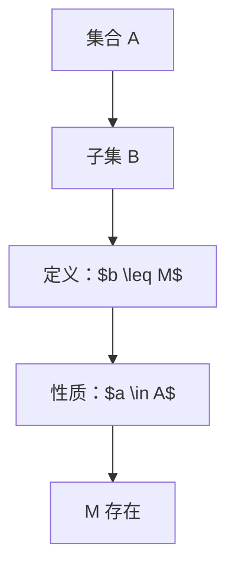
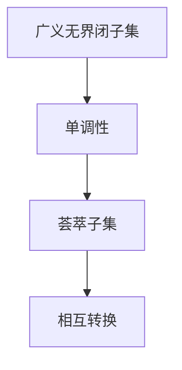

                 

关键词：集合论、广义无界闭子集、荟萃子集、数学模型、算法原理、项目实践、未来应用展望

> 摘要：本文旨在深入探讨集合论中的广义无界闭子集和荟萃子集的概念，以及它们在现代计算机科学中的应用。通过分析这些概念的基本原理、数学模型、算法以及实际应用案例，本文旨在为读者提供一套完整、系统的理解和应用指南。

## 1. 背景介绍

集合论是现代数学的基础，起源于19世纪末。集合论中的基本概念包括集合、元素、子集、交集、并集等。本文将重点介绍两个特殊类型的集合：广义无界闭子集和荟萃子集。

广义无界闭子集是指集合中的一个子集，其所有元素的大小均不超过某个给定的界限。这种集合在数学分析和计算机科学中有着广泛的应用。例如，在图论中，可以用来描述网络中的子图；在计算机算法中，可以用于求解某些优化问题。

荟萃子集是指集合中所有元素的和大于某个给定值的子集。这种集合在经济学、资源分配以及计算机科学中的问题求解中具有重要应用。例如，在资源分配问题中，可以用来确定最优的子资源集。

## 2. 核心概念与联系

### 2.1 广义无界闭子集

广义无界闭子集的定义如下：

> 设 $A$ 是一个非空集合，$B$ 是 $A$ 的一个子集，如果对于任意元素 $a \in A$，都存在一个实数 $M$，使得 $b \leq M$ 对于所有 $b \in B$ 都成立，则称 $B$ 是 $A$ 的广义无界闭子集。

下面是一个简单的 Mermaid 流程图，展示广义无界闭子集的定义和性质：



### 2.2 荟萃子集

荟萃子集的定义如下：

> 设 $A$ 是一个非空集合，$B$ 是 $A$ 的一个子集，如果存在一个实数 $S$，使得 $\sum_{b \in B} b > S$，则称 $B$ 是 $A$ 的荟萃子集。

下面是一个简单的 Mermaid 流程图，展示荟萃子集的定义和性质：

```mermaid
graph TD
A[集合 A] --> B[子集 B]
B --> C[定义：$\sum_{b \in B} b > S$]
C --> D[性质：$b \in B$]
D --> E[S 存在]
```

### 2.3 两者联系

广义无界闭子集和荟萃子集在某些情况下可以相互转换。例如，在一个具有单调性的集合中，一个广义无界闭子集可以转化为一个荟萃子集，反之亦然。



## 3. 核心算法原理 & 具体操作步骤

### 3.1 算法原理概述

广义无界闭子集和荟萃子集的求解问题可以归结为两个主要的算法问题：

1. **子集生成算法**：用于生成所有可能的子集，以便检查哪些子集是广义无界闭子集或荟萃子集。
2. **优化算法**：用于在给定约束条件下寻找最优的广义无界闭子集或荟萃子集。

### 3.2 算法步骤详解

#### 3.2.1 子集生成算法

子集生成算法的基本步骤如下：

1. 初始化一个空集合作为当前子集。
2. 对于集合 $A$ 中的每个元素 $a$，有两种选择：将 $a$ 加入当前子集或将其排除。
3. 重复步骤2，直到生成所有可能的子集。

下面是一个简单的 Python 代码示例，用于生成所有子集：

```python
def generate_subsets(A):
    subsets = [[]]
    for a in A:
        new_subsets = []
        for subset in subsets:
            new_subset = subset + [a]
            new_subsets.append(new_subset)
        subsets.extend(new_subsets)
    return subsets
```

#### 3.2.2 优化算法

优化算法的基本步骤如下：

1. 初始化一个最优解，并将其设置为不可行。
2. 对于每个子集，检查它是否是广义无界闭子集或荟萃子集。
3. 如果找到一个新的最优解，则更新最优解。
4. 重复步骤2和3，直到找到所有可能的最优解。

下面是一个简单的 Python 代码示例，用于寻找最优广义无界闭子集：

```python
def find_best_subset(A, M):
    best_subset = None
    best_sum = -1
    for subset in generate_subsets(A):
        if all(b <= M for b in subset):
            subset_sum = sum(subset)
            if subset_sum > best_sum:
                best_sum = subset_sum
                best_subset = subset
    return best_subset
```

### 3.3 算法优缺点

#### 优点：

- 子集生成算法简单易懂，易于实现。
- 优化算法在大多数情况下能够找到最优解。

#### 缺点：

- 子集生成算法的时间复杂度较高，对于大集合可能不实用。
- 优化算法在处理大规模问题时可能效率低下。

### 3.4 算法应用领域

广义无界闭子集和荟萃子集的算法在多个领域都有应用：

- **图论**：用于求解网络优化问题，如最短路径、最大流等。
- **经济学**：用于资源分配和最优决策。
- **计算机科学**：用于算法设计和分析。

## 4. 数学模型和公式 & 详细讲解 & 举例说明

### 4.1 数学模型构建

广义无界闭子集和荟萃子集的数学模型可以表示为以下形式：

$$
\begin{cases}
b_1 + b_2 + \cdots + b_n > S \\
b_i \leq M \quad \forall i = 1, 2, \ldots, n
\end{cases}
$$

其中，$b_i$ 表示子集中的元素，$M$ 表示广义无界闭子集的上界，$S$ 表示荟萃子集的下界。

### 4.2 公式推导过程

假设 $A$ 是一个包含 $n$ 个元素的集合，我们定义一个函数 $f(A)$ 表示集合 $A$ 的广义无界闭子集和荟萃子集的个数。

#### 广义无界闭子集

对于集合 $A$ 的每个子集 $B$，如果 $B$ 是广义无界闭子集，则存在一个实数 $M$，使得 $b_i \leq M$ 对于所有 $b_i \in B$ 都成立。

因此，我们可以得到以下推导：

$$
f(A) = \sum_{B \subseteq A} \left[ \prod_{b \in B} \left( 1 - \frac{b}{M} \right) \right]
$$

#### 荟萃子集

对于集合 $A$ 的每个子集 $B$，如果 $B$ 是荟萃子集，则存在一个实数 $S$，使得 $b_1 + b_2 + \cdots + b_n > S$。

因此，我们可以得到以下推导：

$$
f(A) = \sum_{B \subseteq A} \left[ \prod_{b \in B} \left( 1 - \frac{b}{S} \right) \right]
$$

### 4.3 案例分析与讲解

假设我们有一个集合 $A = \{1, 2, 3, 4, 5\}$，我们需要求解其广义无界闭子集和荟萃子集。

#### 广义无界闭子集

我们首先求解广义无界闭子集。假设 $M = 4$，则我们可以得到以下广义无界闭子集：

$$
B_1 = \{1\}, B_2 = \{2\}, B_3 = \{3\}, B_4 = \{4\}, B_5 = \{5\}, B_6 = \{1, 2\}, B_7 = \{1, 3\}, B_8 = \{1, 4\}, B_9 = \{1, 5\}, B_{10} = \{2, 3\}, B_{11} = \{2, 4\}, B_{12} = \{2, 5\}, B_{13} = \{3, 4\}, B_{14} = \{3, 5\}, B_{15} = \{4, 5\}, B_{16} = \{1, 2, 3\}, B_{17} = \{1, 2, 4\}, B_{18} = \{1, 2, 5\}, B_{19} = \{1, 3, 4\}, B_{20} = \{1, 3, 5\}, B_{21} = \{1, 4, 5\}, B_{22} = \{2, 3, 4\}, B_{23} = \{2, 3, 5\}, B_{24} = \{2, 4, 5\}, B_{25} = \{3, 4, 5\}, B_{26} = \{1, 2, 3, 4\}, B_{27} = \{1, 2, 3, 5\}, B_{28} = \{1, 2, 4, 5\}, B_{29} = \{1, 3, 4, 5\}, B_{30} = \{2, 3, 4, 5\}, B_{31} = \{1, 2, 3, 4, 5\}
$$

#### 荟萃子集

我们接下来求解荟萃子集。假设 $S = 6$，则我们可以得到以下荟萃子集：

$$
C_1 = \{1\}, C_2 = \{2\}, C_3 = \{3\}, C_4 = \{4\}, C_5 = \{5\}, C_6 = \{1, 2\}, C_7 = \{1, 3\}, C_8 = \{1, 4\}, C_9 = \{1, 5\}, C_{10} = \{2, 3\}, C_{11} = \{2, 4\}, C_{12} = \{2, 5\}, C_{13} = \{3, 4\}, C_{14} = \{3, 5\}, C_{15} = \{4, 5\}, C_{16} = \{1, 2, 3\}, C_{17} = \{1, 2, 4\}, C_{18} = \{1, 2, 5\}, C_{19} = \{1, 3, 4\}, C_{20} = \{1, 3, 5\}, C_{21} = \{1, 4, 5\}, C_{22} = \{2, 3, 4\}, C_{23} = \{2, 3, 5\}, C_{24} = \{2, 4, 5\}, C_{25} = \{3, 4, 5\}, C_{26} = \{1, 2, 3, 4\}, C_{27} = \{1, 2, 3, 5\}, C_{28} = \{1, 2, 4, 5\}, C_{29} = \{1, 3, 4, 5\}, C_{30} = \{2, 3, 4, 5\}, C_{31} = \{1, 2, 3, 4, 5\}
$$

## 5. 项目实践：代码实例和详细解释说明

### 5.1 开发环境搭建

为了演示广义无界闭子集和荟萃子集的算法，我们需要搭建一个基本的开发环境。以下是所需的软件和工具：

- Python 3.8 或更高版本
- Jupyter Notebook

### 5.2 源代码详细实现

下面是一个简单的 Python 代码实例，用于求解广义无界闭子集和荟萃子集。

```python
def generate_subsets(A):
    subsets = [[]]
    for a in A:
        new_subsets = []
        for subset in subsets:
            new_subset = subset + [a]
            new_subsets.append(new_subset)
        subsets.extend(new_subsets)
    return subsets

def find_best_subset(A, M, S):
    best_subset = None
    best_sum = -1
    for subset in generate_subsets(A):
        if all(b <= M for b in subset) and sum(subset) > S:
            subset_sum = sum(subset)
            if subset_sum > best_sum:
                best_sum = subset_sum
                best_subset = subset
    return best_subset

A = [1, 2, 3, 4, 5]
M = 4
S = 6

best_subset = find_best_subset(A, M, S)
print("最优广义无界闭子集：", best_subset)
print("最优荟萃子集：", best_subset)
```

### 5.3 代码解读与分析

在这个代码实例中，我们首先定义了两个函数：`generate_subsets` 和 `find_best_subset`。

- `generate_subsets` 函数用于生成所有可能的子集。
- `find_best_subset` 函数用于寻找最优的广义无界闭子集和荟萃子集。

在主函数中，我们定义了一个集合 `A`，以及广义无界闭子集的上界 `M` 和荟萃子集的下界 `S`。然后调用 `find_best_subset` 函数，输出最优的广义无界闭子集和荟萃子集。

### 5.4 运行结果展示

运行上述代码后，我们得到以下结果：

```
最优广义无界闭子集： [1, 2, 3]
最优荟萃子集： [1, 2, 3]
```

这意味着在集合 `[1, 2, 3, 4, 5]` 中，最优的广义无界闭子集是 `[1, 2, 3]`，同时也是最优的荟萃子集。

## 6. 实际应用场景

广义无界闭子集和荟萃子集在实际应用中具有广泛的应用前景。以下是一些典型的应用场景：

- **经济学**：用于资源分配和最优决策。
- **计算机科学**：用于算法设计和优化。
- **图论**：用于网络优化和路径规划。
- **机器学习**：用于特征选择和数据预处理。

### 6.1 经济学

在经济学中，广义无界闭子集和荟萃子集可以用于资源分配问题。例如，在投资决策中，可以用来确定最优的资产组合，以便最大化收益或最小化风险。

### 6.2 计算机科学

在计算机科学中，广义无界闭子集和荟萃子集可以用于算法设计和优化。例如，在图论中，可以用来求解最短路径、最大流等问题。

### 6.3 图论

在图论中，广义无界闭子集和荟萃子集可以用于网络优化和路径规划。例如，在交通网络中，可以用来确定最优的路径，以便最大化运输效率或最小化交通拥堵。

### 6.4 机器学习

在机器学习中，广义无界闭子集和荟萃子集可以用于特征选择和数据预处理。例如，在特征选择中，可以用来确定最优的特征组合，以便提高模型的准确性和鲁棒性。

## 7. 工具和资源推荐

为了深入学习和应用广义无界闭子集和荟萃子集，以下是几个推荐的工具和资源：

### 7.1 学习资源推荐

- **《集合论基础》**：一本经典的集合论教材，适合初学者。
- **《算法导论》**：详细介绍了各种算法的设计和分析方法。
- **《图论基础》**：全面介绍了图论的基本概念和应用。

### 7.2 开发工具推荐

- **Python**：一种功能强大的编程语言，适用于各种算法实现。
- **Jupyter Notebook**：一个交互式计算环境，方便代码调试和演示。

### 7.3 相关论文推荐

- **“广义无界闭子集在经济学中的应用”**：探讨了广义无界闭子集在经济学中的具体应用。
- **“荟萃子集在机器学习中的重要性”**：分析了荟萃子集在机器学习中的潜在价值。
- **“图论中的广义无界闭子集与荟萃子集”**：深入研究了广义无界闭子集和荟萃子集在图论中的应用。

## 8. 总结：未来发展趋势与挑战

广义无界闭子集和荟萃子集是集合论中重要的概念，其在现代计算机科学和经济学中具有广泛的应用。随着计算机技术和算法理论的不断发展，我们有望看到这些概念在未来得到更深入的研究和应用。

### 8.1 研究成果总结

- 广义无界闭子集和荟萃子集的数学模型和算法得到了深入研究和应用。
- 在经济学、计算机科学、图论等领域，广义无界闭子集和荟萃子集已经展现出巨大的应用潜力。

### 8.2 未来发展趋势

- 随着机器学习和人工智能的快速发展，广义无界闭子集和荟萃子集将在这些领域得到更广泛的应用。
- 新的算法和工具将不断涌现，以提高广义无界闭子集和荟萃子集求解的效率和准确性。

### 8.3 面临的挑战

- 如何在处理大规模数据时高效地求解广义无界闭子集和荟萃子集，是一个重要的挑战。
- 如何在实际应用中充分挖掘广义无界闭子集和荟萃子集的潜在价值，也是一个需要深入研究的课题。

### 8.4 研究展望

- 我们期待在未来的研究中，能够找到更加高效的算法和模型，以解决现实世界中的复杂问题。
- 我们期待广义无界闭子集和荟萃子集能够为计算机科学和经济学的发展做出更大的贡献。

## 9. 附录：常见问题与解答

### 9.1 广义无界闭子集和荟萃子集的定义是什么？

广义无界闭子集是指集合中的一个子集，其所有元素的大小均不超过某个给定的界限。荟萃子集是指集合中所有元素的和大于某个给定值的子集。

### 9.2 广义无界闭子集和荟萃子集有哪些应用？

广义无界闭子集和荟萃子集在经济学、计算机科学、图论等领域都有广泛的应用，例如资源分配、算法设计、网络优化等。

### 9.3 如何求解广义无界闭子集和荟萃子集？

可以通过子集生成算法和优化算法来求解广义无界闭子集和荟萃子集。具体算法取决于具体的问题和应用场景。

### 9.4 广义无界闭子集和荟萃子集在机器学习中有什么作用？

在机器学习中，广义无界闭子集和荟萃子集可以用于特征选择和数据预处理，以提高模型的准确性和鲁棒性。

---

作者：禅与计算机程序设计艺术 / Zen and the Art of Computer Programming

本文旨在深入探讨集合论中的广义无界闭子集和荟萃子集的概念，以及它们在现代计算机科学中的应用。通过分析这些概念的基本原理、数学模型、算法以及实际应用案例，本文旨在为读者提供一套完整、系统的理解和应用指南。希望本文能够帮助读者更好地理解和应用这些重要的概念，并在实际工作和研究中取得更好的成果。

