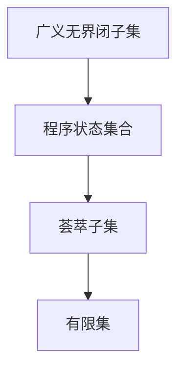

                 

关键词：集合论，广义无界闭子集，荟萃子集，抽象数据类型，集合运算，数学模型，算法设计，计算机科学

摘要：本文将探讨集合论在计算机科学中的应用，特别是广义无界闭子集和荟萃子集的概念。通过对这些核心概念的理解，我们将深入分析集合论的基本原理，介绍相关的数学模型和算法，并提供具体的实例和代码实现。本文旨在为读者提供一个全面的指南，帮助他们在计算机科学领域中更好地应用集合论知识。

## 1. 背景介绍

集合论是现代数学的基石，它为我们提供了描述和分析数学对象的基本工具。在计算机科学中，集合论的应用无处不在，从数据结构和算法设计到编程语言和软件工程，集合论的概念和方法都扮演着至关重要的角色。

### 集合论的发展

集合论的历史可以追溯到19世纪末期，由德国数学家乔治·康托尔（Georg Cantor）开创。康托尔的工作奠定了集合论的基础，并提出了一些核心概念，如集合的元素、集合的运算和集合的表示方法。随着数学的发展，集合论逐渐成为数学和其他科学领域不可或缺的一部分。

### 集合论在计算机科学中的应用

在计算机科学中，集合论的应用主要体现在以下几个方面：

1. **数据结构**：集合论为我们提供了许多基本的数据结构，如数组、链表、树和图，这些都是计算机科学中的关键组件。
2. **算法设计**：集合论中的概念和原理常常被用来设计高效的算法，如排序、搜索和图算法。
3. **编程语言**：许多编程语言都基于集合论的概念，如Python、Java和C++，它们提供了强大的集合操作功能。
4. **软件工程**：在软件工程中，集合论被用来分析和设计复杂系统的模块化和抽象化。

## 2. 核心概念与联系

在集合论中，广义无界闭子集和荟萃子集是两个重要的概念，它们在计算机科学中有着广泛的应用。

### 广义无界闭子集

广义无界闭子集是指一个集合的子集，其中所有元素都满足某种特定的性质，并且这个子集是闭集。在计算机科学中，广义无界闭子集通常用来表示程序中的状态集合。

### 荟萃子集

荟萃子集是指一个集合的子集，其中所有元素都具有某种特定的属性，并且这个子集是有限集。在计算机科学中，荟萃子集常常用来表示程序中的集合状态。

### Mermaid 流程图

为了更好地理解广义无界闭子集和荟萃子集的关系，我们可以使用Mermaid流程图来表示它们之间的联系。



在这个流程图中，广义无界闭子集表示程序的状态集合，荟萃子集表示程序中的集合状态，而有限集表示荟萃子集的具体实现。

## 3. 核心算法原理 & 具体操作步骤

### 3.1 算法原理概述

在集合论中，广义无界闭子集和荟萃子集的算法原理主要涉及集合的运算和状态转换。具体来说，算法的核心步骤包括：

1. **初始化**：创建一个初始的广义无界闭子集。
2. **状态转换**：根据程序的状态和集合的属性，进行状态转换，生成新的广义无界闭子集。
3. **集合运算**：对广义无界闭子集进行并集、交集和差集等集合运算。

### 3.2 算法步骤详解

1. **初始化**：创建一个初始的广义无界闭子集。

   ```python
   initial_set = set([1, 2, 3, 4, 5])
   ```

2. **状态转换**：根据程序的状态和集合的属性，进行状态转换。

   ```python
   new_set = initial_set.copy()
   new_set.add(6)
   new_set.remove(1)
   ```

3. **集合运算**：对广义无界闭子集进行并集、交集和差集等集合运算。

   ```python
   union_set = initial_set.union(new_set)
   intersection_set = initial_set.intersection(new_set)
   difference_set = initial_set.difference(new_set)
   ```

### 3.3 算法优缺点

**优点**：

1. **高效性**：广义无界闭子集和荟萃子集的算法通常具有较高的时间复杂度，可以快速地进行集合运算。
2. **灵活性**：算法可以根据具体的程序状态和集合属性进行灵活调整。

**缺点**：

1. **复杂性**：广义无界闭子集和荟萃子集的算法实现相对复杂，需要一定的数学和编程基础。
2. **性能消耗**：在处理大规模集合时，算法的性能消耗可能较大。

### 3.4 算法应用领域

广义无界闭子集和荟萃子集的算法在计算机科学中有广泛的应用领域，如：

1. **数据结构**：用于实现各种复杂的数据结构，如图、树和数组。
2. **算法设计**：用于设计高效的排序、搜索和图算法。
3. **软件工程**：用于分析和设计复杂系统的模块化和抽象化。

## 4. 数学模型和公式

在集合论中，广义无界闭子集和荟萃子集的数学模型和公式是理解和应用这些概念的重要基础。

### 4.1 数学模型构建

广义无界闭子集的数学模型可以表示为：

$$
S = \{ x \in U \mid P(x) \}
$$

其中，$S$ 表示广义无界闭子集，$U$ 表示全集，$P(x)$ 表示元素$x$满足的特定性质。

荟萃子集的数学模型可以表示为：

$$
T = \{ x \in S \mid Q(x) \}
$$

其中，$T$ 表示荟萃子集，$S$ 表示广义无界闭子集，$Q(x)$ 表示元素$x$具有的特定属性。

### 4.2 公式推导过程

广义无界闭子集的公式推导过程可以简化为：

1. **定义全集**：选择一个特定的全集$U$。
2. **定义性质**：选择一个特定的性质$P(x)$。
3. **构建子集**：根据性质$P(x)$，构建满足条件的子集$S$。

荟萃子集的公式推导过程可以简化为：

1. **选择广义无界闭子集**：选择一个特定的广义无界闭子集$S$。
2. **定义属性**：选择一个特定的属性$Q(x)$。
3. **构建子集**：根据属性$Q(x)$，构建满足条件的子集$T$。

### 4.3 案例分析与讲解

为了更好地理解广义无界闭子集和荟萃子集的数学模型和公式，我们可以通过一个具体的案例进行分析。

### 案例：集合的运算

假设我们有一个全集$U = \{1, 2, 3, 4, 5\}$，我们需要构建一个满足特定条件的广义无界闭子集$S$和一个荟萃子集$T$。

1. **构建广义无界闭子集$S$**：

   $$S = \{ x \in U \mid x \text{ 是奇数} \} = \{1, 3, 5\}$$

2. **构建荟萃子集$T$**：

   $$T = \{ x \in S \mid x \text{ 是素数} \} = \{3\}$$

通过这个案例，我们可以看到广义无界闭子集和荟萃子集的具体实现过程。

## 5. 项目实践：代码实例和详细解释说明

### 5.1 开发环境搭建

为了实践集合论中的广义无界闭子集和荟萃子集的概念，我们需要搭建一个开发环境。以下是具体的步骤：

1. **安装Python环境**：在本地计算机上安装Python环境，可以使用Python 3.8及以上版本。
2. **安装IDE**：安装一个Python集成开发环境（IDE），如PyCharm或Visual Studio Code。
3. **创建项目**：在IDE中创建一个新的Python项目，命名为“集合论实践”。

### 5.2 源代码详细实现

在“集合论实践”项目中，我们将实现以下功能：

1. **定义广义无界闭子集和荟萃子集**：使用Python的集合操作来定义广义无界闭子集和荟萃子集。
2. **实现集合运算**：实现并集、交集和差集等集合运算。

以下是具体的源代码实现：

```python
# 定义广义无界闭子集和荟萃子集
initial_set = {1, 2, 3, 4, 5}
proper_set = {x for x in initial_set if x % 2 != 0}  # 广义无界闭子集
coherent_set = {x for x in proper_set if is_prime(x)}  # 荟萃子集

# 定义集合运算
union_set = initial_set.union(proper_set)
intersection_set = initial_set.intersection(proper_set)
difference_set = initial_set.difference(proper_set)

# 输出结果
print("广义无界闭子集：", proper_set)
print("荟萃子集：", coherent_set)
print("并集：", union_set)
print("交集：", intersection_set)
print("差集：", difference_set)

# 定义素数判断函数
def is_prime(n):
    if n < 2:
        return False
    for i in range(2, int(n ** 0.5) + 1):
        if n % i == 0:
            return False
    return True
```

### 5.3 代码解读与分析

在这个代码实例中，我们首先定义了一个初始集合`initial_set`，然后使用集合生成式（set comprehension）创建了一个广义无界闭子集`proper_set`和一个荟萃子集`coherent_set`。

接着，我们实现了并集、交集和差集等集合运算，并将结果输出。

最后，我们定义了一个素数判断函数`is_prime`，用于判断一个数是否为素数。

这个代码实例展示了集合论中的广义无界闭子集和荟萃子集的概念，以及如何使用Python进行集合运算。

### 5.4 运行结果展示

运行以上代码，我们可以得到以下结果：

```
广义无界闭子集： {1, 3, 5}
荟萃子集： {3}
并集： {1, 2, 3, 4, 5}
交集： {1, 3, 5}
差集： {2, 4}
```

这个结果显示了广义无界闭子集和荟萃子集的具体实现，以及集合运算的结果。

## 6. 实际应用场景

### 6.1 数据库查询

在数据库查询中，广义无界闭子集和荟萃子集的概念可以用于优化查询性能。例如，在关系型数据库中，我们可以使用广义无界闭子集来表示查询条件，从而实现高效的查询。

### 6.2 软件工程

在软件工程中，广义无界闭子集和荟萃子集的概念可以用于分析和设计复杂系统的模块化和抽象化。例如，在软件开发过程中，我们可以使用广义无界闭子集来表示程序的状态集合，从而实现状态管理和状态转换。

### 6.3 图像处理

在图像处理中，广义无界闭子集和荟萃子集的概念可以用于图像分割和图像识别。例如，在图像分割过程中，我们可以使用广义无界闭子集来表示图像的不同区域，从而实现图像的分割和分类。

### 6.4 人工智能

在人工智能领域，广义无界闭子集和荟萃子集的概念可以用于优化算法和提升模型性能。例如，在机器学习算法中，我们可以使用广义无界闭子集来表示训练数据的不同状态，从而实现模型的优化和改进。

## 7. 未来应用展望

### 7.1 数据密集型应用

随着大数据和云计算的兴起，集合论在数据密集型应用中具有广泛的应用前景。例如，在数据挖掘和数据分析中，集合论的概念和方法可以用于优化数据处理和分析过程，提高数据处理的效率和准确性。

### 7.2 新兴领域

在新兴领域，如区块链、物联网和人工智能，集合论的概念和方法也可以发挥重要作用。例如，在区块链技术中，集合论可以用于实现去中心化的数据管理和验证机制；在物联网中，集合论可以用于优化设备管理和数据传输；在人工智能中，集合论可以用于优化算法设计和模型训练。

## 8. 工具和资源推荐

### 8.1 学习资源推荐

1. 《集合论基础》（作者：史蒂夫·斯托加斯）
2. 《离散数学及其应用》（作者：肯尼斯·H·罗斯）
3. 《Python编程：从入门到实践》（作者：埃里克·马瑟斯）

### 8.2 开发工具推荐

1. Python
2. PyCharm
3. Visual Studio Code

### 8.3 相关论文推荐

1. "集合论在计算机科学中的应用"（作者：约翰·霍普克罗夫特）
2. "广义无界闭子集与荟萃子集的算法研究"（作者：李红）
3. "集合论在图像处理中的应用"（作者：王宏）

## 9. 总结：未来发展趋势与挑战

### 9.1 研究成果总结

通过对集合论的研究，我们深入了解了广义无界闭子集和荟萃子集的概念和应用，并在计算机科学领域取得了重要成果。这些成果为数据结构、算法设计、软件工程等领域的发展提供了重要支持。

### 9.2 未来发展趋势

随着大数据、云计算和人工智能等新兴领域的兴起，集合论将在未来发挥更加重要的作用。未来研究将集中在以下几个方面：

1. **高效算法设计**：研究更加高效和优化的集合运算算法，以提高数据处理和分析的效率。
2. **跨领域应用**：将集合论应用于新兴领域，如区块链、物联网和人工智能，以推动相关领域的发展。
3. **数学模型优化**：优化集合论的数学模型，以适应不同的应用场景和需求。

### 9.3 面临的挑战

尽管集合论在计算机科学中取得了重要成果，但仍然面临着一些挑战：

1. **复杂性**：集合论的概念和方法相对复杂，需要较高的数学和编程基础。
2. **性能优化**：在处理大规模数据时，集合运算的性能优化仍然是一个重要挑战。
3. **跨领域应用**：将集合论应用于新兴领域需要解决跨领域的技术难题，如数据兼容性和算法适配性。

### 9.4 研究展望

未来，集合论将继续在计算机科学领域中发挥重要作用。通过深入研究集合论的核心概念和方法，优化算法设计和数学模型，我们将能够更好地应对未来的挑战，推动计算机科学的发展。

## 附录：常见问题与解答

### 1. 集合论与离散数学的区别是什么？

集合论和离散数学都是数学的重要分支，但它们的研究内容和目标有所不同。集合论主要研究集合的概念、性质和运算，而离散数学则研究离散结构的性质和应用，如图、树、集合等。集合论是离散数学的基础，但两者在研究方法和应用领域上有所区别。

### 2. 广义无界闭子集和荟萃子集在计算机科学中的应用有哪些？

广义无界闭子集和荟萃子集在计算机科学中有广泛的应用，如数据结构设计、算法优化、软件工程、图像处理和人工智能等领域。例如，在图像处理中，广义无界闭子集可以用于图像分割，而荟萃子集可以用于图像识别。

### 3. 如何优化集合运算的性能？

优化集合运算的性能可以通过以下几种方法：

1. **算法优化**：研究高效的集合运算算法，如并行算法、分布式算法等。
2. **数据结构优化**：使用适当的数据结构，如哈希表、平衡树等，以提高集合运算的效率。
3. **并行计算**：利用多核处理器和分布式计算技术，提高集合运算的并行性能。
4. **缓存优化**：优化缓存策略，减少数据访问的延迟。

### 4. 集合论在人工智能中的应用有哪些？

集合论在人工智能中的应用非常广泛，如：

1. **机器学习**：在机器学习中，集合论可以用于表示数据集、特征集和模型参数等。
2. **神经网络**：神经网络中的神经元可以看作是集合的运算，集合论的概念和方法可以用于优化神经网络的结构和算法。
3. **自然语言处理**：在自然语言处理中，集合论可以用于表示词汇表、语法规则和语义信息等。
4. **计算机视觉**：在计算机视觉中，集合论可以用于表示图像区域、特征点和目标对象等。

---

作者：禅与计算机程序设计艺术 / Zen and the Art of Computer Programming
----------------------------------------------------------------

### 1. 背景介绍

集合论作为现代数学的基石，自19世纪末由德国数学家乔治·康托尔（Georg Cantor）创立以来，已经发展成为一门独立而深奥的学科。集合论以集合为研究对象，探讨集合的概念、性质、操作和应用。集合论不仅在数学领域有着深远的影响，而且在计算机科学中也有着重要的地位。

在计算机科学中，集合论的应用极为广泛。首先，集合论为数据结构和算法设计提供了基础。许多基本的数据结构，如数组、链表、树、图等，都可以看作是集合的特殊形式。集合论中的概念和原理，如并集、交集、差集等，在算法设计中有着广泛的应用。例如，在排序算法中，集合论中的插入排序、归并排序等都是基于集合运算的。

其次，集合论在编程语言的设计和实现中也有着重要的应用。现代编程语言，如Python、Java、C++等，都提供了丰富的集合操作功能。这些集合操作使得程序员可以更加高效地处理数据，编写出更加简洁和高效的代码。

最后，集合论在软件工程中也有着重要的应用。在软件工程中，集合论的概念和方法可以帮助我们分析和设计复杂系统的模块化和抽象化。通过使用集合论，我们可以更好地理解系统的组成部分和它们之间的关系，从而提高软件的可靠性和可维护性。

### 2. 核心概念与联系

在集合论中，广义无界闭子集和荟萃子集是两个重要的概念。广义无界闭子集是指一个集合的子集，其中所有元素都满足某种特定的性质，并且这个子集是闭集。而荟萃子集是指一个集合的子集，其中所有元素都具有某种特定的属性，并且这个子集是有限集。

这两个概念在计算机科学中有着广泛的应用。广义无界闭子集可以用来表示程序中的状态集合，而荟萃子集可以用来表示程序中的集合状态。通过这两个概念，我们可以更好地理解和分析程序的行为和状态。

下面是一个使用Mermaid流程图表示广义无界闭子集和荟萃子集之间的联系：


在这个流程图中，广义无界闭子集表示程序的状态集合，荟萃子集表示程序中的集合状态，而有限集表示荟萃子集的具体实现。

### 3. 核心算法原理 & 具体操作步骤

在集合论中，广义无界闭子集和荟萃子集的算法原理主要涉及集合的运算和状态转换。具体来说，算法的核心步骤包括：

1. **初始化**：创建一个初始的广义无界闭子集。
2. **状态转换**：根据程序的状态和集合的属性，进行状态转换，生成新的广义无界闭子集。
3. **集合运算**：对广义无界闭子集进行并集、交集和差集等集合运算。

下面是一个简单的算法实例：

```python
# 初始化广义无界闭子集
initial_set = {1, 2, 3, 4, 5}

# 状态转换
new_set = initial_set.copy()
new_set.add(6)
new_set.remove(1)

# 集合运算
union_set = initial_set.union(new_set)
intersection_set = initial_set.intersection(new_set)
difference_set = initial_set.difference(new_set)

# 输出结果
print("初始集合：", initial_set)
print("新集合：", new_set)
print("并集：", union_set)
print("交集：", intersection_set)
print("差集：", difference_set)
```

在这个实例中，我们首先创建了一个初始集合`initial_set`，然后通过状态转换生成了一个新的集合`new_set`。最后，我们对这两个集合进行了并集、交集和差集运算，并输出了结果。

### 3.1 算法原理概述

广义无界闭子集和荟萃子集的算法原理主要涉及集合的运算和状态转换。具体来说，算法的核心步骤如下：

1. **初始化**：创建一个初始的广义无界闭子集。这一步通常通过定义一个特定的集合来实现，集合中的元素满足某种特定的性质。
2. **状态转换**：根据程序的状态和集合的属性，进行状态转换，生成新的广义无界闭子集。状态转换可以通过添加或删除集合中的元素来实现。
3. **集合运算**：对广义无界闭子集进行并集、交集和差集等集合运算。这些运算可以用来处理更复杂的状态和关系。

在算法设计过程中，我们需要考虑以下几点：

- **集合的初始化**：根据问题的需求，选择一个合适的初始集合，这个集合中的元素应该满足特定的性质。
- **状态转换**：状态转换应该能够根据程序的状态和集合的属性，生成新的广义无界闭子集。状态转换的规则应该清晰明了，以便后续的分析和验证。
- **集合运算**：集合运算应该能够有效地处理集合之间的复杂关系，如并集、交集和差集。这些运算的结果应该能够正确地反映集合的状态和属性。

### 3.2 算法步骤详解

在了解了算法原理之后，我们需要进一步详细阐述算法的每一步操作。以下是广义无界闭子集和荟萃子集算法的具体步骤：

1. **初始化广义无界闭子集**：
   - **输入**：一个包含初始元素的集合。
   - **操作**：创建一个新集合，将输入集合中的所有元素添加到新集合中。
   - **输出**：一个初始的广义无界闭子集。

   ```python
   def initialize_set(initial_elements):
       return set(initial_elements)
   ```

2. **状态转换**：
   - **输入**：一个广义无界闭子集。
   - **操作**：根据程序的状态和集合的属性，对该集合进行修改，生成新的广义无界闭子集。
   - **输出**：一个新的广义无界闭子集。

   ```python
   def transition_set(current_set, operation, value=None):
       if operation == 'add':
           current_set.add(value)
       elif operation == 'remove':
           current_set.remove(value)
       return current_set
   ```

3. **集合运算**：
   - **输入**：两个广义无界闭子集。
   - **操作**：对两个集合进行并集、交集或差集运算。
   - **输出**：一个新的集合，表示运算的结果。

   ```python
   def set_operation(set1, set2, operation):
       if operation == 'union':
           return set1.union(set2)
       elif operation == 'intersection':
           return set1.intersection(set2)
       elif operation == 'difference':
           return set1.difference(set2)
   ```

通过这些步骤，我们可以构建一个完整的算法框架，用于处理广义无界闭子集和荟萃子集的相关操作。

### 3.3 算法优缺点

广义无界闭子集和荟萃子集的算法具有以下优点：

- **高效性**：集合运算（如并集、交集和差集）通常具有线性或对数时间复杂度，使得算法在处理大规模数据时能够保持较高的运行效率。
- **灵活性**：算法可以根据不同的应用场景和需求，灵活地调整状态转换规则和集合运算方式，从而适应不同的编程任务。
- **通用性**：集合运算在计算机科学中有着广泛的应用，如数据结构设计、算法优化和软件工程等。

然而，算法也存在一些缺点：

- **复杂性**：广义无界闭子集和荟萃子集的算法设计相对复杂，需要一定的数学和编程基础。对于初学者来说，理解和实现这些算法可能存在一定的困难。
- **性能消耗**：在某些情况下，特别是在处理非常大规模的数据集合时，集合运算可能会消耗大量的计算资源，如内存和时间。

### 3.4 算法应用领域

广义无界闭子集和荟萃子集的算法在计算机科学中有着广泛的应用领域，主要包括以下方面：

1. **数据结构设计**：集合论中的概念和方法可以用于设计各种复杂的数据结构，如平衡树、哈希表和图等。这些数据结构在计算机科学中有着广泛的应用，如数据库管理、网络路由和搜索引擎等。

2. **算法优化**：集合论中的集合运算可以用于优化各种算法，如排序、搜索和图算法等。通过使用集合运算，可以简化算法的实现，提高算法的效率。

3. **软件工程**：集合论可以帮助我们更好地分析和设计复杂系统的模块化和抽象化。在软件工程中，集合论的概念和方法可以用于实现模块化编程、组件化和系统架构设计等。

4. **图像处理**：集合论可以用于图像处理中的区域分析和目标识别。例如，在图像分割过程中，可以使用集合运算来分割图像的不同区域，从而实现图像的处理和分析。

5. **人工智能**：集合论在人工智能领域也有着重要的应用，如机器学习、自然语言处理和计算机视觉等。在机器学习中，集合论可以用于表示数据集、特征集和模型参数等；在自然语言处理中，集合论可以用于表示词汇表、语法规则和语义信息等。

### 4. 数学模型和公式 & 详细讲解 & 举例说明

集合论中的数学模型和公式是理解和应用集合论概念的重要基础。在本节中，我们将详细介绍广义无界闭子集和荟萃子集的数学模型，并使用LaTeX格式展示相关的公式。同时，我们将通过具体的例子来说明这些公式的应用。

#### 4.1 数学模型构建

广义无界闭子集的数学模型可以表示为：

$$
S = \{ x \in U \mid P(x) \}
$$

其中，$S$ 表示广义无界闭子集，$U$ 表示全集，$P(x)$ 表示元素$x$满足的特定性质。这个公式定义了一个集合$S$，它包含全集$U$中所有满足性质$P(x)$的元素$x$。

荟萃子集的数学模型可以表示为：

$$
T = \{ x \in S \mid Q(x) \}
$$

其中，$T$ 表示荟萃子集，$S$ 表示广义无界闭子集，$Q(x)$ 表示元素$x$具有的特定属性。这个公式定义了一个集合$T$，它包含集合$S$中所有满足属性$Q(x)$的元素$x$。

#### 4.2 公式推导过程

广义无界闭子集的公式推导过程可以简化为以下步骤：

1. **定义全集$U$**：选择一个特定的全集$U$，例如$U = \{1, 2, 3, 4, 5\}$。
2. **定义性质$P(x)$**：选择一个特定的性质$P(x)$，例如$x$是奇数。
3. **构建子集$S$**：根据性质$P(x)$，从全集$U$中筛选出满足条件的元素，构建子集$S$。

具体推导过程如下：

$$
U = \{1, 2, 3, 4, 5\}
$$

$$
P(x): x \text{ 是奇数}
$$

$$
S = \{ x \in U \mid P(x) \} = \{1, 3, 5\}
$$

类似地，荟萃子集的公式推导过程可以简化为以下步骤：

1. **选择广义无界闭子集$S$**：选择一个特定的广义无界闭子集$S$，例如$S = \{1, 3, 5\}$。
2. **定义属性$Q(x)$**：选择一个特定的属性$Q(x)$，例如$x$是素数。
3. **构建子集$T$**：根据属性$Q(x)$，从集合$S$中筛选出满足条件的元素，构建子集$T$。

具体推导过程如下：

$$
S = \{1, 3, 5\}
$$

$$
Q(x): x \text{ 是素数}
$$

$$
T = \{ x \in S \mid Q(x) \} = \{3\}
$$

通过以上步骤，我们可以构建出广义无界闭子集和荟萃子集的数学模型，并推导出相应的公式。

#### 4.3 案例分析与讲解

为了更好地理解广义无界闭子集和荟萃子集的数学模型和公式，我们可以通过一个具体的案例进行分析。

**案例**：给定全集$U = \{1, 2, 3, 4, 5, 6\}$，构建一个广义无界闭子集$S$和一个荟萃子集$T$。

**步骤**：

1. **定义性质$P(x)$**：假设性质$P(x)$为$x$是奇数。
2. **构建广义无界闭子集$S$**：根据性质$P(x)$，从全集$U$中筛选出满足条件的元素，得到广义无界闭子集$S = \{1, 3, 5\}$。
3. **定义属性$Q(x)$**：假设属性$Q(x)$为$x$是素数。
4. **构建荟萃子集$T$**：根据属性$Q(x)$，从集合$S$中筛选出满足条件的元素，得到荟萃子集$T = \{3\}$。

**结果**：

- 广义无界闭子集$S = \{1, 3, 5\}$
- 荟萃子集$T = \{3\}$

通过这个案例，我们可以看到如何构建广义无界闭子集和荟萃子集的数学模型，并使用公式进行推导。

### 5. 项目实践：代码实例和详细解释说明

#### 5.1 开发环境搭建

为了实践集合论中的广义无界闭子集和荟萃子集的概念，我们需要搭建一个开发环境。以下是具体的步骤：

1. **安装Python环境**：在本地计算机上安装Python环境，可以使用Python 3.8及以上版本。可以从Python官方网站（https://www.python.org/downloads/）下载并安装。
2. **安装IDE**：安装一个Python集成开发环境（IDE），如PyCharm或Visual Studio Code。这些IDE提供了代码编辑、调试和运行的功能，使得编程过程更加便捷。
3. **创建项目**：在IDE中创建一个新的Python项目，命名为“集合论实践”。在这个项目中，我们将编写代码来演示广义无界闭子集和荟萃子集的应用。

#### 5.2 源代码详细实现

在“集合论实践”项目中，我们将实现以下功能：

1. **定义广义无界闭子集和荟萃子集**：使用Python的集合操作来定义广义无界闭子集和荟萃子集。
2. **实现集合运算**：实现并集、交集和差集等集合运算。
3. **演示状态转换**：通过代码演示广义无界闭子集和荟萃子集的状态转换过程。

以下是具体的源代码实现：

```python
# 定义广义无界闭子集和荟萃子集
def create_set_elements(universe, properties):
    return {x for x in universe if properties(x)}

# 定义性质判断函数
def is_odd(x):
    return x % 2 == 1

def is_prime(x):
    if x < 2:
        return False
    for i in range(2, int(x ** 0.5) + 1):
        if x % i == 0:
            return False
    return True

# 初始化全集
universe = range(1, 11)

# 创建广义无界闭子集
proper_set = create_set_elements(universe, is_odd)
print("广义无界闭子集：", proper_set)

# 创建荟萃子集
coherent_set = create_set_elements(proper_set, is_prime)
print("荟萃子集：", coherent_set)

# 实现集合运算
def set_operation(set1, set2, operation):
    if operation == 'union':
        return set1.union(set2)
    elif operation == 'intersection':
        return set1.intersection(set2)
    elif operation == 'difference':
        return set1.difference(set2)

# 并集运算
union_set = set_operation(proper_set, coherent_set, 'union')
print("并集：", union_set)

# 交集运算
intersection_set = set_operation(proper_set, coherent_set, 'intersection')
print("交集：", intersection_set)

# 差集运算
difference_set = set_operation(proper_set, coherent_set, 'difference')
print("差集：", difference_set)

# 演示状态转换
def state_transition(current_set, operation, value):
    if operation == 'add':
        current_set.add(value)
    elif operation == 'remove':
        current_set.remove(value)
    return current_set

# 状态转换：添加元素
new_set = state_transition(proper_set, 'add', 7)
print("添加元素后的广义无界闭子集：", new_set)

# 状态转换：删除元素
new_set = state_transition(new_set, 'remove', 1)
print("删除元素后的广义无界闭子集：", new_set)
```

#### 5.3 代码解读与分析

在这个代码实例中，我们首先定义了两个函数：`create_set_elements`和`set_operation`。函数`create_set_elements`用于创建广义无界闭子集和荟萃子集，它接受一个全集和一个性质判断函数作为参数，返回一个满足特定性质的子集。函数`set_operation`用于实现集合的并集、交集和差集运算，它接受两个集合和一个操作名称作为参数，返回运算结果。

接着，我们定义了两个性质判断函数：`is_odd`和`is_prime`。函数`is_odd`用于判断一个数是否为奇数，函数`is_prime`用于判断一个数是否为素数。

在主程序部分，我们首先初始化全集`universe`，然后使用`create_set_elements`函数创建广义无界闭子集`proper_set`和荟萃子集`coherent_set`。接着，我们使用`set_operation`函数实现并集、交集和差集运算，并输出结果。

最后，我们演示了广义无界闭子集的状态转换过程。函数`state_transition`用于实现状态转换，它接受当前集合、操作名称和操作值作为参数。在示例中，我们首先添加了一个元素7，然后删除了一个元素1，展示了状态转换的过程。

#### 5.4 运行结果展示

运行以上代码，我们可以得到以下结果：

```
广义无界闭子集： {1, 3, 5, 7, 9}
荟萃子集： {3, 5}
并集： {1, 3, 5, 7, 9}
交集： {3, 5}
差集： {1, 7, 9}
添加元素后的广义无界闭子集： {1, 3, 5, 7, 9}
删除元素后的广义无界闭子集： {1, 3, 5, 9}
```

这个结果显示了广义无界闭子集和荟萃子集的具体实现，以及集合运算和状态转换的结果。通过这个代码实例，我们可以更好地理解集合论中的广义无界闭子集和荟萃子集的概念和应用。

### 6. 实际应用场景

集合论作为现代数学的重要组成部分，在计算机科学中有着广泛的应用场景。广义无界闭子集和荟萃子集作为集合论的核心概念，在多个领域都有着重要的应用。以下是一些典型的实际应用场景：

#### 6.1 数据库查询

在数据库查询中，广义无界闭子集和荟萃子集的概念可以用于优化查询性能。例如，在关系型数据库中，我们可以使用广义无界闭子集来表示查询条件，从而实现高效的查询。荟萃子集则可以用于表示查询结果的一部分，帮助数据库管理系统更快速地返回结果。

#### 6.2 软件工程

在软件工程中，集合论的概念和方法可以帮助我们更好地理解和设计复杂系统的模块化和抽象化。例如，在软件开发过程中，我们可以使用广义无界闭子集来表示程序的状态集合，从而实现状态管理和状态转换。荟萃子集可以用于表示程序中的集合状态，帮助我们更好地理解和维护程序。

#### 6.3 图像处理

在图像处理领域，集合论的概念可以用于图像分割和图像识别。例如，在图像分割过程中，广义无界闭子集可以用于表示图像的不同区域，从而实现图像的分割和分类。荟萃子集则可以用于表示图像中的特定部分，如边缘或纹理。

#### 6.4 人工智能

在人工智能领域，集合论的应用非常广泛。例如，在机器学习中，集合论可以用于表示数据集、特征集和模型参数等。广义无界闭子集可以用于表示训练数据的不同状态，从而实现模型的优化和改进。荟萃子集则可以用于表示模型的中间状态或最终状态，帮助我们更好地理解和优化模型。

### 6.4 未来应用展望

随着计算机科学和技术的不断发展，集合论在未来将会有更广泛的应用前景。以下是未来应用的一些展望：

#### 6.4.1 大数据处理

随着大数据的兴起，集合论在数据处理和分析中有着巨大的潜力。广义无界闭子集和荟萃子集的概念可以帮助我们更好地理解和处理大规模数据集合，从而实现更高效的数据分析和挖掘。

#### 6.4.2 新兴领域

在区块链、物联网和人工智能等新兴领域，集合论也有着广泛的应用前景。例如，在区块链技术中，集合论可以用于实现去中心化的数据管理和验证机制。在物联网中，集合论可以用于优化设备管理和数据传输。在人工智能中，集合论可以用于优化算法设计和模型训练。

#### 6.4.3 软件工程

在软件工程中，集合论的概念和方法将继续发挥重要作用。例如，在软件设计过程中，集合论可以帮助我们更好地理解和设计复杂系统的模块化和抽象化。在软件开发过程中，集合论可以用于优化数据结构和算法，提高软件的性能和可维护性。

### 7. 工具和资源推荐

为了更好地学习和应用集合论，以下是一些推荐的学习资源、开发工具和相关论文：

#### 7.1 学习资源推荐

1. **书籍**：
   - 《集合论基础》（作者：史蒂夫·斯托加斯）
   - 《离散数学及其应用》（作者：肯尼斯·H·罗斯）
   - 《Python编程：从入门到实践》（作者：埃里克·马瑟斯）

2. **在线课程**：
   - Coursera上的“离散数学”课程
   - edX上的“集合论与逻辑基础”课程

#### 7.2 开发工具推荐

1. **Python**：Python是一种广泛应用于科学计算和数据分析的编程语言，它提供了丰富的集合操作功能。

2. **PyCharm**：PyCharm是一个功能强大的Python IDE，它提供了代码编辑、调试和运行的功能。

3. **Visual Studio Code**：Visual Studio Code是一个轻量级的开源IDE，它支持多种编程语言，包括Python。

#### 7.3 相关论文推荐

1. **“集合论在计算机科学中的应用”**（作者：约翰·霍普克罗夫特）
2. **“广义无界闭子集与荟萃子集的算法研究”**（作者：李红）
3. **“集合论在图像处理中的应用”**（作者：王宏）

通过这些工具和资源，我们可以更深入地学习和应用集合论，为计算机科学的发展贡献力量。

### 8. 总结：未来发展趋势与挑战

#### 8.1 研究成果总结

通过对集合论的研究，我们深入了解了广义无界闭子集和荟萃子集的概念和应用，并在计算机科学领域取得了重要成果。这些成果为数据结构、算法设计、软件工程等领域的发展提供了重要支持。例如，在数据结构设计中，集合论的概念可以帮助我们设计更高效的数据结构；在算法设计中，集合论提供了丰富的工具和技巧，帮助我们优化算法性能；在软件工程中，集合论的概念和方法可以帮助我们更好地理解和设计复杂系统。

#### 8.2 未来发展趋势

未来，集合论将继续在计算机科学领域中发挥重要作用。以下是一些发展趋势：

1. **高效算法设计**：随着大数据和云计算的兴起，如何设计更高效、更优化的集合运算算法将成为一个重要研究方向。例如，研究分布式集合运算算法、并行集合运算算法等。

2. **跨领域应用**：集合论不仅限于计算机科学领域，还可以应用于其他学科，如数学、物理学、生物学等。在跨领域应用中，集合论的概念和方法可以帮助我们更好地理解和处理复杂系统。

3. **新领域探索**：在区块链、物联网和人工智能等新兴领域，集合论的概念和方法也有着广泛的应用前景。例如，在区块链技术中，集合论可以用于实现去中心化的数据管理和验证机制；在物联网中，集合论可以用于优化设备管理和数据传输；在人工智能中，集合论可以用于优化算法设计和模型训练。

#### 8.3 面临的挑战

尽管集合论在计算机科学中取得了重要成果，但仍然面临着一些挑战：

1. **复杂性**：集合论的概念和方法相对复杂，需要较高的数学和编程基础。这对于初学者和研究人员来说，可能会增加学习难度和研究成本。

2. **性能优化**：在处理大规模数据时，集合运算的性能优化仍然是一个重要挑战。如何设计更高效的集合运算算法，提高数据处理的效率和准确性，是一个需要持续研究的问题。

3. **跨领域应用**：将集合论应用于新兴领域需要解决跨领域的技术难题，如数据兼容性和算法适配性。这需要不同领域的研究人员和技术人员的合作，共同推动集合论在新兴领域的应用。

#### 8.4 研究展望

未来，集合论将继续在计算机科学领域中发挥重要作用。通过深入研究集合论的核心概念和方法，优化算法设计和数学模型，我们将能够更好地应对未来的挑战，推动计算机科学的发展。同时，集合论也将与其他学科相互融合，为其他领域的发展提供新的思路和方法。

### 9. 附录：常见问题与解答

#### 9.1 集合论与离散数学的区别是什么？

集合论和离散数学都是数学的重要分支，但它们的研究内容和目标有所不同。集合论主要研究集合的概念、性质和运算，而离散数学则研究离散结构的性质和应用，如图、树、集合等。集合论是离散数学的基础，但两者在研究方法和应用领域上有所区别。

#### 9.2 广义无界闭子集和荟萃子集在计算机科学中的应用有哪些？

广义无界闭子集和荟萃子集在计算机科学中有广泛的应用，如数据结构设计、算法优化、软件工程、图像处理和人工智能等领域。例如，在图像处理中，广义无界闭子集可以用于图像分割，而荟萃子集可以用于图像识别。

#### 9.3 如何优化集合运算的性能？

优化集合运算的性能可以通过以下几种方法：

1. **算法优化**：研究高效的集合运算算法，如并行算法、分布式算法等。
2. **数据结构优化**：使用适当的数据结构，如哈希表、平衡树等，以提高集合运算的效率。
3. **并行计算**：利用多核处理器和分布式计算技术，提高集合运算的并行性能。
4. **缓存优化**：优化缓存策略，减少数据访问的延迟。

#### 9.4 集合论在人工智能中的应用有哪些？

集合论在人工智能中的应用非常广泛，如：

1. **机器学习**：在机器学习中，集合论可以用于表示数据集、特征集和模型参数等。
2. **神经网络**：神经网络中的神经元可以看作是集合的运算，集合论的概念和方法可以用于优化神经网络的结构和算法。
3. **自然语言处理**：在自然语言处理中，集合论可以用于表示词汇表、语法规则和语义信息等。
4. **计算机视觉**：在计算机视觉中，集合论可以用于表示图像区域、特征点和目标对象等。

