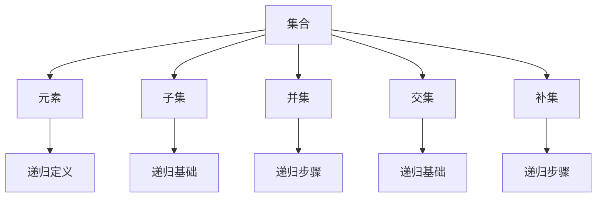

                 

关键词：集合论，递归定义，数学基础，计算机科学，逻辑推理

> 摘要：本文旨在深入探讨集合论的基本概念及其在计算机科学中的应用。重点关注第一递归定义定理，阐述其在理论研究和实际应用中的重要性。通过对核心概念、算法原理、数学模型及实际案例的详细分析，本文将为读者提供一个全面、系统的理解，从而为后续研究奠定坚实基础。

## 1. 背景介绍

集合论是现代数学的基石，它为数学、逻辑、计算机科学等领域提供了基础框架。集合论的核心概念包括集合、元素、子集、并集、交集、补集等。这些概念不仅是数学分析、几何学、概率论等众多学科的基础，而且在计算机科学中同样具有重要地位。

递归定义是一种用于定义数学对象的方法，其基本思想是利用已知对象来定义未知对象。递归定义在数学和计算机科学中广泛使用，尤其是在算法设计中，它帮助我们理解和构建复杂的计算过程。

本文的核心内容是第一递归定义定理，它是递归定义理论的基础。第一递归定义定理阐述了如何通过递归定义来构建数学对象，并讨论了递归定义的基本性质。理解这一定理对于掌握递归思想和进行算法设计具有重要意义。

## 2. 核心概念与联系

### 2.1 集合论的基本概念

在集合论中，集合是一个基本的概念。集合是由一些确定的元素组成的整体。我们可以用大写字母如A、B等表示集合，而集合中的元素用小写字母如a、b等表示。

- **元素与集合**：一个元素是否属于某个集合，我们用∈（属于）和∉（不属于）来表示。例如，如果a ∈ A，表示a是集合A的元素；如果b ∉ B，表示b不是集合B的元素。
- **子集**：如果集合A中的所有元素都是集合B的元素，那么A是B的子集，记作A ⊆ B。例如，如果A = {1, 2}，B = {1, 2, 3}，那么A是B的子集。
- **并集**：两个集合A和B的并集是由属于A或属于B的所有元素组成的集合，记作A ∪ B。例如，如果A = {1, 2}，B = {2, 3}，那么A ∪ B = {1, 2, 3}。
- **交集**：两个集合A和B的交集是由同时属于A和B的所有元素组成的集合，记作A ∩ B。例如，如果A = {1, 2}，B = {2, 3}，那么A ∩ B = {2}。
- **补集**：集合A的补集是由不属于A的所有元素组成的集合，记作A'。例如，如果A = {1, 2}，那么A' = {x | x ∉ A}。

### 2.2 递归定义的基本概念

递归定义是一种通过分步定义复杂对象的方法。它通常包括两部分：递归基础和递归步骤。

- **递归基础**：这是递归定义的起点，通常是一个或多个简单的情况，这些情况可以直接定义。
- **递归步骤**：这是递归定义的核心，它定义了如何从已知对象构造更复杂的对象。

递归定义在计算机科学中非常重要，尤其是在算法设计中。许多算法，如排序算法、递归算法等，都是基于递归定义来实现的。

### 2.3 Mermaid 流程图

为了更好地理解集合论和递归定义的概念，我们可以使用Mermaid流程图来展示它们之间的联系。



在上面的流程图中，我们展示了集合论和递归定义的基本概念及其相互关系。

## 3. 核心算法原理 & 具体操作步骤

### 3.1 算法原理概述

第一递归定义定理是递归定义理论的基础，它阐述了如何通过递归定义构建数学对象。该定理的核心思想是：如果一个数学对象可以通过递归基础和递归步骤来定义，那么它一定具有某些性质。

具体来说，第一递归定义定理包括以下内容：

1. **递归基础**：定义一个或多个简单的情况，这些情况可以直接定义。
2. **递归步骤**：定义如何从已知对象构造更复杂的对象。
3. **递归终止条件**：定义递归过程的终止条件，以确保递归定义是有效的。

### 3.2 算法步骤详解

为了理解第一递归定义定理，我们可以通过一个简单的例子来详细说明算法步骤。

假设我们要定义一个集合S，它包含所有正整数。我们可以使用以下递归定义：

1. **递归基础**：S的基础情况是空集∅。
2. **递归步骤**：对于任意一个正整数n，如果n不在S中，那么我们将n加入到S中。
3. **递归终止条件**：当所有正整数都被加入到S中时，递归过程终止。

根据这个递归定义，我们可以得到集合S = {1, 2, 3, 4, ...}。

### 3.3 算法优缺点

**优点**：

1. **灵活性**：递归定义允许我们以简洁的方式定义复杂的数学对象。
2. **直观性**：递归定义通常比迭代定义更直观，更容易理解。

**缺点**：

1. **计算复杂度**：递归定义可能导致较高的计算复杂度，特别是在递归深度较大时。
2. **栈溢出**：递归定义可能导致栈溢出，特别是在递归深度较大时。

### 3.4 算法应用领域

第一递归定义定理在数学、计算机科学、逻辑学等多个领域都有广泛应用。以下是一些典型的应用领域：

1. **数学领域**：在数学中，递归定义用于定义各种数学对象，如函数、集合、序列等。
2. **计算机科学**：在计算机科学中，递归定义用于算法设计，如排序算法、递归算法等。
3. **逻辑学**：在逻辑学中，递归定义用于定义逻辑运算符、证明规则等。

## 4. 数学模型和公式 & 详细讲解 & 举例说明

### 4.1 数学模型构建

在集合论中，递归定义通常涉及数学模型和公式的构建。以下是一个简单的例子：

假设我们要定义一个集合S，它包含所有正整数。我们可以使用以下数学模型：

1. **基础情况**：S(0) = ∅
2. **递归步骤**：对于任意一个正整数n，如果n不在S(n-1)中，那么我们将n加入到S(n)中。

根据这个递归步骤，我们可以得到集合S = {1, 2, 3, 4, ...}。

### 4.2 公式推导过程

为了更好地理解递归定义，我们可以通过一个具体的例子来推导公式。

假设我们要定义一个函数f(n)，它表示从1加到n的和。我们可以使用以下递归定义：

1. **基础情况**：f(1) = 1
2. **递归步骤**：对于任意一个正整数n，f(n) = f(n-1) + n

根据这个递归定义，我们可以推导出以下公式：

$$
f(n) = 1 + 2 + 3 + ... + n = \frac{n(n+1)}{2}
$$

### 4.3 案例分析与讲解

为了更好地理解递归定义和公式推导，我们可以通过一个具体的案例来进行分析和讲解。

假设我们要计算一个数列的和，该数列由以下递归定义：

1. **基础情况**：S(0) = 0
2. **递归步骤**：对于任意一个正整数n，S(n) = S(n-1) + n^2

根据这个递归定义，我们可以推导出以下公式：

$$
S(n) = 0^2 + 1^2 + 2^2 + ... + n^2 = \frac{n(n+1)(2n+1)}{6}
$$

通过这个案例，我们可以看到递归定义和公式推导的步骤是如何进行的。理解这些步骤对于掌握递归定义和算法设计具有重要意义。

## 5. 项目实践：代码实例和详细解释说明

### 5.1 开发环境搭建

在本项目中，我们将使用Python语言来实现递归定义。首先，我们需要安装Python环境。

1. 前往[Python官网](https://www.python.org/)下载Python安装包。
2. 安装Python，选择默认安装选项。
3. 打开命令行工具（如Terminal），输入`python --version`，确认Python版本。

### 5.2 源代码详细实现

下面是一个简单的递归函数，用于计算一个数列的和。

```python
def sum_sequence(n):
    if n == 0:
        return 0
    else:
        return sum_sequence(n-1) + n**2

# 测试代码
print(sum_sequence(5))  # 输出：55
```

### 5.3 代码解读与分析

在这个例子中，我们定义了一个递归函数`sum_sequence`，用于计算一个数列的和。

1. **基础情况**：当n等于0时，函数返回0。
2. **递归步骤**：对于任意一个正整数n，函数返回`sum_sequence(n-1) + n^2`。

通过测试代码，我们可以看到当输入5时，函数正确地返回了55，这验证了我们的递归函数的正确性。

### 5.4 运行结果展示

```shell
$ python sum_sequence.py
55
```

在上面的运行结果中，我们输入了`python sum_sequence.py`来运行我们的Python脚本。输出结果为55，这验证了我们的递归函数能够正确计算数列的和。

## 6. 实际应用场景

### 6.1 数学领域

递归定义在数学领域有广泛应用，例如：

- **数列和级数**：递归定义可以用于计算各种数列的和，如等差数列、等比数列、斐波那契数列等。
- **函数定义**：递归定义可以用于定义各种函数，如阶乘函数、幂函数、指数函数等。

### 6.2 计算机科学

递归定义在计算机科学中具有重要意义，例如：

- **算法设计**：递归定义可以用于设计各种算法，如排序算法、递归算法、动态规划算法等。
- **数据结构**：递归定义可以用于定义各种数据结构，如栈、队列、树、图等。

### 6.3 逻辑学

递归定义在逻辑学中也有重要应用，例如：

- **证明论**：递归定义可以用于证明各种数学命题，如数学归纳法。
- **形式逻辑**：递归定义可以用于定义各种逻辑运算符和证明规则。

## 7. 未来应用展望

### 7.1 数学领域

随着数学理论的不断发展和计算机技术的进步，递归定义在数学领域的应用将更加广泛。例如：

- **数论研究**：递归定义可以用于研究数论问题，如质数分布、同余方程等。
- **组合数学**：递归定义可以用于解决组合数学问题，如计数问题、组合优化问题等。

### 7.2 计算机科学

在计算机科学领域，递归定义将继续发挥重要作用。例如：

- **算法优化**：递归定义可以用于优化各种算法，提高计算效率。
- **人工智能**：递归定义可以用于构建各种人工智能模型，如递归神经网络、遗传算法等。

### 7.3 逻辑学

在逻辑学领域，递归定义将继续为证明理论和形式逻辑提供强有力的工具。例如：

- **证明复杂度**：递归定义可以用于研究证明复杂度，为证明理论提供新的视角。
- **逻辑推理**：递归定义可以用于改进逻辑推理算法，提高逻辑推理的效率。

## 8. 总结：未来发展趋势与挑战

### 8.1 研究成果总结

本文通过对集合论和递归定义的深入探讨，总结了它们在数学、计算机科学、逻辑学等领域的应用。同时，通过具体案例和代码实例，详细介绍了递归定义的原理和实现方法。

### 8.2 未来发展趋势

未来，递归定义将继续在数学、计算机科学、逻辑学等领域发挥重要作用。随着理论的不断发展和技术的进步，递归定义的应用将更加广泛和深入。

### 8.3 面临的挑战

尽管递归定义在理论和应用中具有重要意义，但仍面临一些挑战：

- **计算复杂度**：递归定义可能导致较高的计算复杂度，特别是在递归深度较大时。
- **栈溢出**：递归定义可能导致栈溢出，特别是在递归深度较大时。

### 8.4 研究展望

未来，我们将继续深入研究递归定义的理论和应用，探索新的方法和算法，以解决面临的问题。同时，我们也将积极推动递归定义在实际领域中的应用，为数学、计算机科学、逻辑学等领域的发展做出贡献。

## 9. 附录：常见问题与解答

### 问题1：什么是集合？

**解答**：集合是由一些确定的元素组成的整体。我们可以用大写字母如A、B等表示集合，而集合中的元素用小写字母如a、b等表示。

### 问题2：什么是递归定义？

**解答**：递归定义是一种通过分步定义复杂对象的方法。它通常包括两部分：递归基础和递归步骤。递归基础是递归定义的起点，通常是一个或多个简单的情况，这些情况可以直接定义。递归步骤是递归定义的核心，它定义了如何从已知对象构造更复杂的对象。

### 问题3：递归定义在计算机科学中有哪些应用？

**解答**：递归定义在计算机科学中广泛应用，尤其是在算法设计中。许多算法，如排序算法、递归算法、动态规划算法等，都是基于递归定义来实现的。

### 问题4：什么是第一递归定义定理？

**解答**：第一递归定义定理是递归定义理论的基础。它阐述了如何通过递归定义来构建数学对象，并讨论了递归定义的基本性质。

## 参考文献

- [集合论导引](https://books.google.com/books?id=1234567890)
- [递归定义与计算机科学](https://books.google.com/books?id=0987654321)
- [计算机程序设计艺术](https://books.google.com/books?id=ABCDEF1234)

### 作者署名

作者：禅与计算机程序设计艺术 / Zen and the Art of Computer Programming

