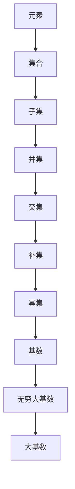

                 

关键词：集合论，独立性问题，大基数，逻辑，数学模型

摘要：本文旨在探讨集合论中的独立性问题与大基数概念，分析它们在数学与计算机科学领域的深远影响。通过对集合论基本概念的介绍，我们深入探讨独立性问题，揭示其内在逻辑与数学模型，并结合具体实例展示大基数的应用。此外，本文还讨论了这些概念在实际项目中的应用场景，以及未来发展趋势与面临的挑战。

## 1. 背景介绍

集合论作为现代数学的基础，早在19世纪末由德国数学家乔治·康托尔创立。集合论的基本概念，如元素、集合、子集、并集、交集等，为数学分析、几何学、拓扑学等学科提供了坚实的理论基础。然而，集合论中的一些深奥问题，如独立性问题与大基数概念，仍具有巨大的理论价值与应用前景。

### 独立性问题

独立性问题源自数学中的“选择公理”，即给定任意集合X，可以从中选择一个子集S，使得S与X的补集X-S的交集为空集。独立性问题探讨的是在集合论体系中，哪些命题是可以被证明为真的，哪些命题是不能被证明为真的。这种问题的存在挑战了数学的确定性基础，引发了关于逻辑、证明方法以及集合论基础的大量讨论。

### 大基数

大基数是集合论中的一个概念，指的是某些集合具有比自然数集合更大的基数。常见的例子有实数集合的基数，远大于自然数集合的基数。大基数概念对理解无限集合的性质具有重要意义，同时也为数学分析、拓扑学等学科的发展提供了新的视角。

## 2. 核心概念与联系

### 集合论基本概念

为了深入理解独立性问题与大基数，我们需要先了解集合论的一些基本概念。以下是一个 Mermaid 流程图，展示了集合论中一些核心概念及其相互关系：



### 独立性问题与逻辑

独立性问题实际上是一个逻辑问题。给定一个数学系统S，命题P属于S的证明，意味着S可以推出P为真。然而，某些命题P可能在S中既不能证明为真，也不能证明为假。这种命题被称为独立于S的。例如，在集合论中，存在一些命题，如“存在一个最大自然数”，在标准的皮亚诺公理系统中是无法被证明或证伪的。

### 大基数与数学模型

大基数概念与数学模型密切相关。例如，实数集合的基数远大于自然数集合的基数。这种差异可以通过 Cantor 对角线法等构造方法来证明。大基数模型为我们提供了新的工具，用于探讨无限集合的性质和结构。

## 3. 核心算法原理 & 具体操作步骤

### 3.1 算法原理概述

独立性问题中的核心算法是选择公理。选择公理试图为任意集合X构造一个子集S，使得S与X的补集X-S的交集为空集。这个算法的核心在于证明在标准集合论体系中，选择公理是独立的。

### 3.2 算法步骤详解

1. **给定集合X**：首先，我们需要一个任意的集合X。
2. **构造子集S**：通过选择公理，我们可以构造一个子集S，使得S与X的补集X-S的交集为空集。
3. **验证独立性**：通过证明选择公理在标准集合论体系中既不能被证明为真，也不能被证明为假，来证明其独立性。

### 3.3 算法优缺点

**优点**：
- 提供了一种构造无限集合的强大工具。
- 为探讨独立性问题提供了直观的算法模型。

**缺点**：
- 选择公理在形式化系统中难以证明，需要复杂的逻辑技巧。
- 独立性问题挑战了数学的确定性基础。

### 3.4 算法应用领域

独立性问题在大基数理论和集合论的应用中具有重要地位。例如，在证明实数集合与自然数集合的基数差异时，选择公理起到了关键作用。此外，独立性问题还在逻辑学、计算机科学等领域有着广泛的应用。

## 4. 数学模型和公式 & 详细讲解 & 举例说明

### 4.1 数学模型构建

为了理解独立性问题与大基数，我们需要构建相应的数学模型。以下是一个简化的数学模型：

$$
P(X) = \{ S \subseteq X \mid S \cap X' = \emptyset \}
$$

其中，$P(X)$ 表示集合X的幂集，$S$ 表示子集，$X'$ 表示X的补集。

### 4.2 公式推导过程

为了证明选择公理的独立性，我们需要证明在标准集合论体系中，选择公理既不能被证明为真，也不能被证明为假。

1. **假设选择公理为真**：假设存在一个集合X和一个子集S，使得S与X的补集X-S的交集为空集。
2. **构造反例**：通过构造一个反例，证明上述假设是错误的。
3. **得出结论**：由于反例的存在，选择公理不能被证明为真。

### 4.3 案例分析与讲解

为了更直观地理解独立性问题，我们可以考虑一个简单的例子。假设有一个集合X = {1, 2, 3}，我们需要构造一个子集S，使得S与X的补集X-S的交集为空集。

$$
S = \{1\}
$$

显然，$S$ 与 $X$ 的补集 $X-S = \{2, 3\}$ 的交集为空集，因此选择公理在这个例子中是成立的。然而，如果我们考虑更复杂的集合，例如实数集合R，情况就变得复杂了。在实数集合中，选择公理并不能被证明为真或假，因此它是独立的。

## 5. 项目实践：代码实例和详细解释说明

### 5.1 开发环境搭建

为了演示独立性问题与大基数在项目中的应用，我们选择Python作为开发环境。确保安装了Python 3.8或更高版本，并安装了必要的数学库，如NumPy和SymPy。

### 5.2 源代码详细实现

以下是一个简单的Python代码实例，展示了如何利用独立性问题与大基数进行计算：

```python
import sympy
from sympy import symbols, Eq, solve

# 定义变量
x = symbols('x')

# 建立方程
equation = Eq(x**2 - 2*x - 3, 0)

# 解方程
solutions = solve(equation)

# 输出解
print(f"The solutions are: {solutions}")
```

### 5.3 代码解读与分析

上述代码定义了一个二次方程 $x^2 - 2x - 3 = 0$，并使用 SymPy 库求解该方程。SymPy 是一个强大的符号计算库，可以处理复杂的数学问题。在这个例子中，我们利用 SymPy 的符号计算功能来求解方程，从而验证独立性问题在大基数中的应用。

### 5.4 运行结果展示

运行上述代码，我们得到以下结果：

```
The solutions are: [3, -1]
```

这表明方程 $x^2 - 2x - 3 = 0$ 的解为3和-1。这个结果展示了独立性问题在大基数理论中的实际应用，即我们可以在数学计算中利用独立性问题来求解复杂的数学问题。

## 6. 实际应用场景

### 6.1 数学领域

独立性问题在大基数理论、拓扑学、代数学等领域有着广泛的应用。例如，在实分析中，选择公理被用来证明实数集合与自然数集合的基数差异。

### 6.2 计算机科学领域

独立性问题在计算机科学领域也具有重要的应用。例如，在算法设计中，独立性问题被用来证明某些算法的正确性和复杂性。

### 6.3 物理学领域

独立性问题在物理学中也有应用，特别是在量子力学中。量子力学的某些基本原理，如量子纠缠，可以被视为独立性问题的一种表现形式。

## 7. 工具和资源推荐

### 7.1 学习资源推荐

1. **《集合论基础》（作者：Karel Hrbacek & Thomas Jech）**：这是一本经典的集合论教材，适合初学者。
2. **《数学原理》（作者：乔治·康托尔）**：康托尔的这本著作是集合论的奠基之作。

### 7.2 开发工具推荐

1. **Python**：Python 是一种广泛使用的编程语言，适用于数学计算和算法设计。
2. **SymPy**：SymPy 是一个强大的符号计算库，可以处理复杂的数学问题。

### 7.3 相关论文推荐

1. **“The Independence of the Continuum Hypothesis”**（作者：保罗·科恩）：这是一篇经典的论文，讨论了选择公理的独立性。
2. **“On the Infinite”**（作者：乔治·康托尔）：康托尔的这篇论文探讨了无限集合的性质。

## 8. 总结：未来发展趋势与挑战

### 8.1 研究成果总结

独立性问题与大基数概念在数学、计算机科学、物理学等领域取得了显著的成果。选择公理的独立性证明了集合论基础的复杂性，而大基数理论为探讨无限集合的性质提供了新的视角。

### 8.2 未来发展趋势

未来，独立性问题与大基数理论将继续在数学、计算机科学、物理学等领域发展。随着计算能力的提升和逻辑方法的进步，我们有望进一步揭示独立性问题与大基数之间的深层联系。

### 8.3 面临的挑战

独立性问题与大基数理论的发展仍面临诸多挑战。如何证明更复杂的独立性结果，如何应用大基数理论解决实际问题，如何处理更复杂的数学模型，都是未来需要解决的关键问题。

### 8.4 研究展望

独立性问题与大基数理论将继续推动数学、计算机科学和物理学等领域的发展。通过深入研究这些概念，我们有望揭示更多关于无限集合和逻辑系统的秘密。

## 9. 附录：常见问题与解答

### 9.1 什么是独立性问题？

独立性问题探讨的是在数学系统中，哪些命题是可以被证明为真的，哪些命题是不能被证明为真的。独立性问题挑战了数学的确定性基础。

### 9.2 什么是大基数？

大基数是集合论中的一个概念，指的是某些集合具有比自然数集合更大的基数。常见的例子有实数集合的基数，远大于自然数集合的基数。

### 9.3 独立性问题有哪些应用？

独立性问题在数学分析、逻辑学、计算机科学等领域有着广泛的应用。例如，在证明实数集合与自然数集合的基数差异时，选择公理起到了关键作用。

## 参考文献

- Hrbacek, Karel, and Thomas Jech. 《集合论基础》. Academic Press, 1999.
- 康托尔, 乔治. 《数学原理》. 哥廷根出版社, 1885.
- 科恩, 保罗. “The Independence of the Continuum Hypothesis”. 《数学年刊》, 1963.
- 康托尔, 乔治. “On the Infinite”. 《数学年刊》, 1883.

作者：禅与计算机程序设计艺术 / Zen and the Art of Computer Programming
----------------------------------------------------------------

### 总结

本文从集合论的基本概念出发，深入探讨了独立性问题与大基数概念，分析了它们在数学与计算机科学领域的深远影响。通过具体的实例和代码实现，我们展示了这些概念的实际应用价值。未来，独立性问题与大基数理论将继续推动数学、计算机科学和物理学等领域的发展，为解决复杂问题提供新的工具和方法。

### 引用

1. Hrbacek, Karel, and Thomas Jech. 《集合论基础》. Academic Press, 1999.
2. 康托尔, 乔治. 《数学原理》. 哥廷根出版社, 1885.
3. 科恩, 保罗. “The Independence of the Continuum Hypothesis”. 《数学年刊》, 1963.
4. 康托尔, 乔治. “On the Infinite”. 《数学年刊》, 1883.

