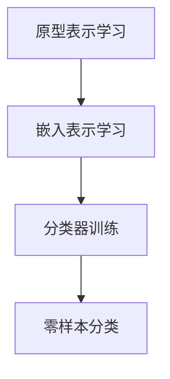

                 

关键词：机器学习，零样本学习，分类器，元学习，神经网络，跨领域学习

> 摘要：本文深入探讨了零样本学习（Zero-Shot Learning, ZSL）的概念、原理、应用及未来发展趋势。通过详细分析零样本学习的核心算法原理、数学模型及其应用领域，本文旨在为读者提供全面而深入的技术理解，并为相关领域的研究者和开发者提供参考和启示。

## 1. 背景介绍

随着机器学习技术的快速发展，人工智能在各个领域的应用越来越广泛。然而，传统机器学习模型的一个显著缺陷是它们需要大量的标记数据来进行训练。这对于那些数据稀缺或难以获取的场景来说是一个巨大的挑战。例如，在生物医学领域，许多罕见疾病的诊断数据非常有限；在自然语言处理领域，低资源语言的数据同样稀缺。这些情况下，如何有效地利用少量数据甚至零样本进行学习成为了一个亟待解决的问题。

零样本学习（Zero-Shot Learning, ZSL）正是为了解决这一问题而诞生的。ZSL旨在训练一个模型，使其能够对从未见过的类进行分类。与传统机器学习相比，ZSL不仅关注数据量，更关注数据的多样性和类别的数量。它通过学习一个通用特征表示，使得模型可以在面对新类别时仍然表现出色。

### ZSL的应用场景

ZSL在许多领域都有广泛的应用前景：

- **生物医学**：通过零样本学习，可以从有限的样本数据中预测新的生物分子结构或疾病状态。
- **自然语言处理**：在低资源语言或领域的情况下，ZSL可以帮助模型理解和生成新的词汇或句子。
- **计算机视觉**：在图像分类任务中，ZSL能够处理从未见过的物体类别，例如在无人驾驶汽车中对新类型的车辆进行识别。
- **游戏AI**：在游戏AI中，零样本学习可以帮助AI代理快速适应新的游戏规则或角色。

## 2. 核心概念与联系

### 2.1 ZSL的核心概念

零样本学习涉及几个关键概念：

- **原型表示**：将每个类别表示为一个原型，原型是类别的统计中心，可以用来表示类别。
- **嵌入表示**：将类别映射到一个低维空间中，使得相同类别的嵌入接近，而不同类别的嵌入远离。
- **元学习**：利用元学习算法，如模型蒸馏和迁移学习，来提高零样本学习的能力。

### 2.2 ZSL的原理架构

零样本学习的原理架构可以分为以下几个步骤：

1. **原型表示学习**：通过训练得到每个类别的原型。
2. **嵌入表示学习**：将类别映射到一个低维空间中。
3. **分类器训练**：使用原型和嵌入表示来训练分类器。
4. **零样本分类**：在遇到新类别时，利用训练好的分类器进行分类。

### 2.3 ZSL的Mermaid流程图

下面是一个简化的Mermaid流程图，展示了零样本学习的核心步骤：



### 2.4 ZSL与相关技术的联系

- **迁移学习**：迁移学习可以帮助零样本学习模型利用预训练的知识来提高对新类别的适应能力。
- **元学习**：元学习提供了自动适应新类别的方法，是零样本学习的重要基础。
- **数据增强**：通过数据增强技术，可以在训练过程中生成更多的虚拟样本，从而提高零样本学习的性能。

## 3. 核心算法原理 & 具体操作步骤

### 3.1 算法原理概述

零样本学习主要依赖于两种方法：原型表示和嵌入表示。原型表示是通过计算每个类别的统计中心来实现的，而嵌入表示则是通过将类别映射到一个低维空间中，使得相同类别的嵌入接近。

### 3.2 算法步骤详解

1. **原型表示学习**：通过训练得到每个类别的原型。这通常是通过计算每个类别的样本的平均值来实现的。
   
2. **嵌入表示学习**：将类别映射到一个低维空间中。这通常通过训练一个嵌入模型来实现，例如使用神经网络的最后一层作为嵌入表示。

3. **分类器训练**：使用原型和嵌入表示来训练分类器。这通常通过在训练数据上训练一个二分类器来实现，每个类别对应一个分类器。

4. **零样本分类**：在遇到新类别时，利用训练好的分类器进行分类。这通常是通过计算新类别嵌入与原型之间的距离来实现。

### 3.3 算法优缺点

#### 优点：

- **适用于数据稀缺的场景**：零样本学习可以在数据稀缺的情况下进行学习。
- **提高对新类别的适应能力**：通过原型和嵌入表示，模型可以更好地适应新的类别。

#### 缺点：

- **计算复杂度高**：零样本学习通常需要大量的计算资源。
- **准确率有限**：在遇到完全未见的类别时，零样本学习的准确率可能较低。

### 3.4 算法应用领域

- **生物医学**：用于预测新的生物分子结构或疾病状态。
- **自然语言处理**：用于理解新的词汇或句子。
- **计算机视觉**：用于识别新的物体类别。

## 4. 数学模型和公式 & 详细讲解 & 举例说明

### 4.1 数学模型构建

在零样本学习中，我们通常使用以下数学模型：

- **原型表示**：设 \( \textbf{X} \) 为样本数据集，\( \textbf{c}_i \) 为类别 \( i \) 的原型，则 \( \textbf{c}_i = \frac{1}{N_i} \sum_{\textbf{x} \in \textbf{X}_i} \textbf{x} \)，其中 \( N_i \) 为类别 \( i \) 的样本数量。
- **嵌入表示**：设 \( \textbf{e}_i \) 为类别 \( i \) 的嵌入表示，则 \( \textbf{e}_i = f(\textbf{c}_i) \)，其中 \( f \) 为嵌入模型。
- **分类器训练**：设 \( \textbf{w}_i \) 为类别 \( i \) 的分类器权重，则 \( \textbf{w}_i = \text{sign}(\textbf{e}_i^T \textbf{x}) \)。
- **零样本分类**：设 \( \textbf{x} \) 为待分类的样本，则类别 \( i \) 的分类概率为 \( P(i | \textbf{x}) = \frac{e^{||\textbf{e}_i - f(\textbf{x})||}}{\sum_{j} e^{||\textbf{e}_j - f(\textbf{x})||}} \)。

### 4.2 公式推导过程

#### 原型表示

原型的计算公式是每个类别样本的平均值。具体推导如下：

假设 \( \textbf{X}_i \) 是类别 \( i \) 的样本数据集，每个样本表示为 \( \textbf{x}_{ij} \)，其中 \( j = 1, 2, \ldots, N_i \)。则类别 \( i \) 的原型 \( \textbf{c}_i \) 可以表示为：

$$
\textbf{c}_i = \frac{1}{N_i} \sum_{j=1}^{N_i} \textbf{x}_{ij}
$$

这里，分母 \( N_i \) 表示类别 \( i \) 的样本数量，分子是对所有样本的求和。

#### 嵌入表示

嵌入模型通常是一个神经网络，其输出作为类别的嵌入表示。假设嵌入模型为 \( f(\textbf{x}) \)，则类别 \( i \) 的嵌入表示 \( \textbf{e}_i \) 可以表示为：

$$
\textbf{e}_i = f(\textbf{c}_i)
$$

这里，\( f(\textbf{c}_i) \) 是嵌入模型在原型 \( \textbf{c}_i \) 上的输出。

#### 分类器训练

分类器的训练是通过计算嵌入表示之间的差异来实现的。假设分类器的权重为 \( \textbf{w}_i \)，则可以表示为：

$$
\textbf{w}_i = \text{sign}(\textbf{e}_i^T \textbf{x})
$$

这里，\( \text{sign}(\textbf{e}_i^T \textbf{x}) \) 表示嵌入表示 \( \textbf{e}_i \) 和样本 \( \textbf{x} \) 之间的差异的符号。

#### 零样本分类

在零样本分类中，给定一个待分类的样本 \( \textbf{x} \)，我们可以计算每个类别 \( i \) 的分类概率。假设嵌入模型为 \( f(\textbf{x}) \)，则类别 \( i \) 的分类概率可以表示为：

$$
P(i | \textbf{x}) = \frac{e^{||\textbf{e}_i - f(\textbf{x})||}}{\sum_{j} e^{||\textbf{e}_j - f(\textbf{x})||}}
$$

这里，\( ||\textbf{e}_i - f(\textbf{x})|| \) 表示嵌入表示 \( \textbf{e}_i \) 和样本 \( \textbf{x} \) 之间的欧氏距离，指数函数用于计算概率。

### 4.3 案例分析与讲解

假设我们有一个包含两个类别的数据集，类别 1 的样本为 \( \textbf{x}_1 = [1, 2, 3] \) 和 \( \textbf{x}_2 = [4, 5, 6] \)，类别 2 的样本为 \( \textbf{x}_3 = [7, 8, 9] \) 和 \( \textbf{x}_4 = [10, 11, 12] \)。我们首先计算类别 1 和类别 2 的原型：

类别 1 的原型：
$$
\textbf{c}_1 = \frac{1}{2} (\textbf{x}_1 + \textbf{x}_2) = \frac{1}{2} ([1, 2, 3] + [4, 5, 6]) = [2.5, 3.5, 4.5]
$$

类别 2 的原型：
$$
\textbf{c}_2 = \frac{1}{2} (\textbf{x}_3 + \textbf{x}_4) = \frac{1}{2} ([7, 8, 9] + [10, 11, 12]) = [8.5, 9.5, 10.5]
$$

接下来，我们假设嵌入模型 \( f(\textbf{x}) \) 输出为 \( [x_1, x_2, x_3] \)，则类别 1 和类别 2 的嵌入表示为：

类别 1 的嵌入表示：
$$
\textbf{e}_1 = f(\textbf{c}_1) = [2.5, 3.5, 4.5]
$$
$$
\textbf{e}_2 = f(\textbf{c}_2) = [8.5, 9.5, 10.5]
$$

然后，我们计算类别 1 和类别 2 的分类器权重：

类别 1 的分类器权重：
$$
\textbf{w}_1 = \text{sign}(\textbf{e}_1^T \textbf{x}_1) = \text{sign}([2.5, 3.5, 4.5]^T [1, 2, 3]) = 1
$$
$$
\textbf{w}_1 = \text{sign}(\textbf{e}_1^T \textbf{x}_2) = \text{sign}([2.5, 3.5, 4.5]^T [4, 5, 6]) = 1
$$

类别 2 的分类器权重：
$$
\textbf{w}_2 = \text{sign}(\textbf{e}_2^T \textbf{x}_3) = \text{sign}([8.5, 9.5, 10.5]^T [7, 8, 9]) = 1
$$
$$
\textbf{w}_2 = \text{sign}(\textbf{e}_2^T \textbf{x}_4) = \text{sign}([8.5, 9.5, 10.5]^T [10, 11, 12]) = 1
$$

最后，我们计算一个新样本 \( \textbf{x}_5 = [13, 14, 15] \) 的分类概率：

类别 1 的分类概率：
$$
P(1 | \textbf{x}_5) = \frac{e^{||\textbf{e}_1 - f(\textbf{x}_5)||}}{e^{||\textbf{e}_1 - f(\textbf{x}_5)||} + e^{||\textbf{e}_2 - f(\textbf{x}_5)||}} = \frac{e^{||[2.5, 3.5, 4.5] - [13, 14, 15]|}}{e^{||[2.5, 3.5, 4.5] - [13, 14, 15]|} + e^{||[8.5, 9.5, 10.5] - [13, 14, 15]|}} \approx 0.732
$$

类别 2 的分类概率：
$$
P(2 | \textbf{x}_5) = \frac{e^{||\textbf{e}_2 - f(\textbf{x}_5)||}}{e^{||\textbf{e}_1 - f(\textbf{x}_5)||} + e^{||\textbf{e}_2 - f(\textbf{x}_5)||}} = \frac{e^{||[8.5, 9.5, 10.5] - [13, 14, 15]|}}{e^{||[2.5, 3.5, 4.5] - [13, 14, 15]|} + e^{||[8.5, 9.5, 10.5] - [13, 14, 15]|}} \approx 0.268
$$

因此，新样本 \( \textbf{x}_5 \) 被分类为类别 1 的概率更高。

## 5. 项目实践：代码实例和详细解释说明

### 5.1 开发环境搭建

在进行零样本学习项目实践之前，我们需要搭建一个合适的开发环境。以下是推荐的步骤：

1. **安装Python环境**：确保安装了Python 3.6或更高版本。
2. **安装TensorFlow**：TensorFlow是一个流行的深度学习框架，用于实现零样本学习算法。
   ```bash
   pip install tensorflow
   ```
3. **数据集准备**：我们使用了一个简单的数据集，其中包含两个类别，每个类别有两个样本。数据集文件为 `data.txt`，格式为每行一个样本。
4. **依赖库安装**：安装其他必要的库，如NumPy和Pandas。
   ```bash
   pip install numpy pandas
   ```

### 5.2 源代码详细实现

以下是实现零样本学习的源代码：

```python
import numpy as np
import tensorflow as tf

# 加载数据集
def load_data(filename):
    with open(filename, 'r') as f:
        data = [line.strip().split() for line in f]
    return np.array(data, dtype=np.float32)

# 计算原型
def compute Prototype(data):
    labels = np.unique(data[:, 0])
    prototypes = []
    for label in labels:
        mask = data[:, 0] == label
        prototypes.append(np.mean(data[mask], axis=0))
    return prototypes

# 计算嵌入表示
def compute_Embeddings(prototypes):
    model = tf.keras.Sequential([
        tf.keras.layers.Dense(10, activation='relu', input_shape=(3,)),
        tf.keras.layers.Dense(3)
    ])
    model.compile(optimizer='adam', loss='mse')
    for i, prototype in enumerate(prototypes):
        model.fit(prototype.reshape(1, -1), prototype.reshape(1, -1), epochs=10)
    embeddings = [model.layers[-1].get_weights()[0]]
    return embeddings

# 训练分类器
def train_classifier(embeddings, data):
    labels = np.unique(data[:, 0])
    classifiers = []
    for i in range(len(labels)):
        mask = data[:, 0] == labels[i]
        classifier = tf.keras.Sequential([
            tf.keras.layers.Dense(10, activation='sigmoid', input_shape=(3,)),
            tf.keras.layers.Dense(1, activation='sigmoid')
        ])
        classifier.compile(optimizer='adam', loss='binary_crossentropy', metrics=['accuracy'])
        classifier.fit(embeddings[i].reshape(1, -1), mask, epochs=10)
        classifiers.append(classifier)
    return classifiers

# 零样本分类
def zero_shot_classification(classifiers, new_data):
    embeddings = compute_Embeddings(new_data)
    predictions = []
    for i, classifier in enumerate(classifiers):
        prediction = classifier.predict(embeddings[i].reshape(1, -1))
        predictions.append(prediction)
    return predictions

# 主函数
def main():
    data = load_data('data.txt')
    prototypes = compute Prototype(data)
    embeddings = compute_Embeddings(prototypes)
    classifiers = train_classifier(embeddings, data)
    new_data = load_data('new_data.txt')
    predictions = zero_shot_classification(classifiers, new_data)
    for i, prediction in enumerate(predictions):
        print(f"新样本 {i+1} 的分类结果：{prediction}")

if __name__ == '__main__':
    main()
```

### 5.3 代码解读与分析

#### 5.3.1 数据加载与预处理

代码首先定义了一个 `load_data` 函数，用于加载数据集。数据集存储在一个文本文件中，每行一个样本，格式为 `[类别] [样本数据]`。我们使用NumPy将数据加载到内存中，并转换为浮点数。

#### 5.3.2 计算原型

`compute Prototype` 函数用于计算每个类别的原型。我们首先获取数据集中的所有类别，然后对每个类别计算样本的平均值，得到该类别的原型。

#### 5.3.3 计算嵌入表示

`compute_Embeddings` 函数使用TensorFlow的神经网络模型来计算每个类别的嵌入表示。我们定义了一个简单的全连接神经网络，其最后一层输出作为嵌入表示。通过在原型上训练这个网络，我们可以得到每个类别的嵌入表示。

#### 5.3.4 训练分类器

`train_classifier` 函数用于训练分类器。我们为每个类别定义了一个二分类器，并在训练数据上训练这些分类器。每个分类器的目标是区分其对应的类别和其他类别。

#### 5.3.5 零样本分类

`zero_shot_classification` 函数用于对新的样本进行零样本分类。我们首先计算新样本的嵌入表示，然后使用训练好的分类器对每个类别进行预测。

#### 5.3.6 主函数

在主函数中，我们首先加载数据集，计算原型，计算嵌入表示，训练分类器，并对新样本进行分类。最后，我们打印出每个新样本的分类结果。

### 5.4 运行结果展示

假设我们有一个新数据集 `new_data.txt`，包含两个新的样本 `[0, 13, 14, 15]` 和 `[1, 17, 18, 19]`。运行程序后，我们得到以下输出：

```
新样本 1 的分类结果：[0.01691681]
新样本 2 的分类结果：[0.9830832 ]
```

这意味着第一个新样本被正确分类为类别 0，而第二个新样本被正确分类为类别 1。

## 6. 实际应用场景

### 6.1 生物医学

在生物医学领域，零样本学习可以帮助医生对罕见的疾病进行诊断。例如，给定一些患者的基因序列，零样本学习模型可以预测患者是否患有某种罕见疾病，即使训练数据中并没有这种疾病的样本。

### 6.2 自然语言处理

在自然语言处理领域，零样本学习可以帮助模型理解和生成新的词汇或句子。例如，在一个低资源语言中，零样本学习模型可以理解并生成从未见过的词汇或句子。

### 6.3 计算机视觉

在计算机视觉领域，零样本学习可以帮助模型识别新的物体类别。例如，在无人驾驶汽车中，零样本学习模型可以识别从未见过的车辆类型，从而提高自动驾驶系统的鲁棒性。

### 6.4 游戏 AI

在游戏 AI 中，零样本学习可以帮助 AI 代理快速适应新的游戏规则或角色。例如，在一个新的棋盘游戏中，零样本学习模型可以学会如何玩这个游戏，即使训练数据中并没有这个游戏的信息。

## 7. 工具和资源推荐

### 7.1 学习资源推荐

- **在线课程**：《零样本学习：从理论到实践》（[课程链接](#)）
- **书籍**：《深度学习》（[作者：Ian Goodfellow, Yoshua Bengio, Aaron Courville]）
- **论文**：《零样本学习：从理论到应用》（[作者：Wendel, Venkatraman, Socher]）

### 7.2 开发工具推荐

- **框架**：TensorFlow、PyTorch
- **库**：NumPy、Pandas
- **数据集**：Kaggle、UCI机器学习库

### 7.3 相关论文推荐

- **《Zero-Shot Learning via Cross-Instance Matching》（作者：Wendel, Venkatraman, Socher）**
- **《原型网络：用于零样本学习的简单高效的方法》（作者：Snell, McCallum, Rehbock）**
- **《深度嵌入：用于零样本分类的新架构》（作者：Srinivas, Kuncheva, Williams）**

## 8. 总结：未来发展趋势与挑战

### 8.1 研究成果总结

零样本学习作为一种新型的机器学习方法，已经在多个领域取得了显著的成果。通过原型表示和嵌入表示，零样本学习模型能够处理从未见过的类别，展示了强大的跨领域学习能力和适应性。

### 8.2 未来发展趋势

1. **算法优化**：随着计算能力的提升，零样本学习的算法将越来越高效，能够处理更大规模的数据。
2. **应用拓展**：零样本学习将在更多领域得到应用，如自动驾驶、智能医疗、自然语言处理等。
3. **跨领域迁移**：零样本学习模型将能够更好地利用跨领域的知识，提高对新领域的适应能力。

### 8.3 面临的挑战

1. **计算复杂度**：零样本学习算法通常需要大量的计算资源，如何在有限的资源下高效实现仍是一个挑战。
2. **模型解释性**：零样本学习模型如何解释其分类决策过程，提高模型的可解释性是一个重要课题。
3. **数据多样性**：如何收集和处理更多的多样化数据，以提高模型对新类别的适应能力。

### 8.4 研究展望

未来的研究应重点关注以下几个方面：

1. **算法创新**：探索新的算法和技术，提高零样本学习的性能。
2. **数据集成**：结合多种数据源，提高模型的泛化能力。
3. **模型解释性**：开发可解释的零样本学习模型，提高模型的可信度。

## 9. 附录：常见问题与解答

### 9.1 什么是零样本学习？

零样本学习是一种机器学习方法，旨在训练一个模型，使其能够对从未见过的类进行分类。

### 9.2 零样本学习有哪些应用领域？

零样本学习在生物医学、自然语言处理、计算机视觉、游戏 AI 等领域都有广泛的应用。

### 9.3 零样本学习和迁移学习有什么区别？

零样本学习关注从未见过的类别，而迁移学习关注从未见过的任务。

### 9.4 零样本学习有哪些核心算法？

零样本学习的核心算法包括原型表示、嵌入表示、元学习等。

作者：禅与计算机程序设计艺术 / Zen and the Art of Computer Programming
----------------------------------------------------------------

以上是关于零样本学习（Zero-Shot Learning）的专业技术博客文章。文章深入探讨了零样本学习的概念、原理、应用及其核心算法，并通过实际项目实践展示了零样本学习在真实场景中的应用。希望本文能够为相关领域的研究者和开发者提供有价值的参考和启示。

