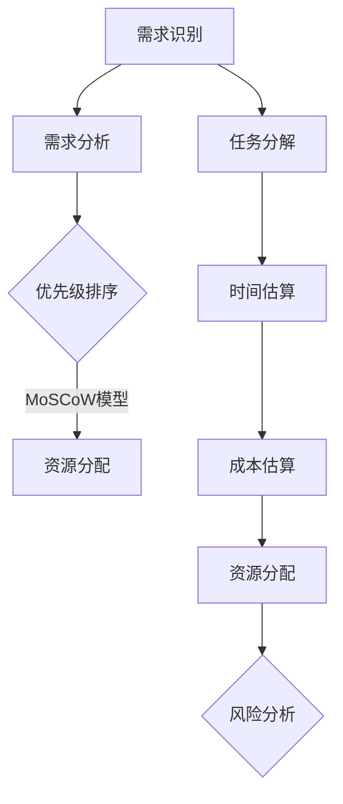

                 

 

## 摘要

本文旨在深入探讨需求优先级管理与项目估算原理，并通过代码实战案例为您呈现具体操作步骤。我们将首先介绍需求优先级管理的重要性，包括其定义、目的和常见方法。随后，文章将详细讲解项目估算原理，涵盖估算的重要性、常用方法和工具。接着，我们将通过一个实际的项目案例，展示如何将需求优先级管理与项目估算原理应用于实际开发中。最后，本文还将提供相关工具和资源的推荐，以帮助您更好地进行需求优先级管理与项目估算。

## 背景介绍

在现代软件工程中，需求优先级管理和项目估算原理是确保项目成功的关键因素。随着项目的复杂性和规模日益增加，如何有效地管理需求和进行准确的项目估算变得尤为重要。需求优先级管理涉及到如何识别和确定项目中的关键需求，并根据其重要性和紧急程度进行排序，以确保资源的最优分配。项目估算原理则是指通过一系列的方法和工具，对项目的时间、成本和资源需求进行预测和估计，从而为项目计划和决策提供科学依据。

### 需求优先级管理的定义与目的

需求优先级管理是指在项目规划和执行过程中，对各种需求进行排序和分类的过程。其核心目的是确保项目的资源（如时间、人力和资金）能够被高效利用，以便在有限的资源条件下，实现项目目标。需求优先级管理的关键在于能够识别出哪些需求是最重要和最紧急的，从而优先安排和分配资源。

具体来说，需求优先级管理包括以下几个关键步骤：

1. **需求识别**：首先，需要识别出所有相关的需求，包括功能需求、非功能需求等。
2. **需求分析**：对每个需求进行分析，了解其技术可行性、业务价值和实现难度。
3. **优先级排序**：根据需求的重要性、紧急程度和业务目标，对需求进行排序。
4. **资源分配**：根据需求优先级，分配资源，确保关键需求能够得到优先处理。
5. **持续调整**：项目进行过程中，根据实际情况和反馈，不断调整需求优先级，以适应项目的变化。

### 项目估算原理的定义与目的

项目估算原理是指在项目规划和执行过程中，对项目的时间、成本和资源需求进行预测和估计的过程。项目估算的目的是为了确保项目能够在预算范围内、按时完成，并且满足所有既定的目标和需求。

项目估算通常包括以下几个关键步骤：

1. **需求分析**：对项目需求进行详细分析，确定所有必须完成的工作和任务。
2. **任务分解**：将项目任务分解为更小的子任务，以便更好地进行估算。
3. **时间估算**：对每个子任务所需的时间进行估算。
4. **成本估算**：对每个子任务的成本进行估算，包括人力、物力和财力等。
5. **资源分配**：根据估算结果，分配所需的资源和人力。
6. **风险分析**：识别和评估项目可能面临的风险，并制定相应的应对措施。

## 核心概念与联系

### 需求优先级管理

需求优先级管理是确保项目成功的关键环节。其核心概念包括：

- **需求分类**：根据需求的类型（如功能需求、非功能需求）和优先级（如紧急程度、重要性），对需求进行分类。
- **优先级排序**：使用如MoSCoW模型（Must have, Should have, Could have, Won't have）等方法，对需求进行排序。
- **资源分配**：根据需求优先级，合理分配资源，确保关键需求得到优先处理。

### 项目估算原理

项目估算原理是项目规划和管理的基础。其核心概念包括：

- **任务分解**：将项目任务分解为更小的子任务，以便更好地进行估算。
- **时间估算**：对每个子任务所需的时间进行估算。
- **成本估算**：对每个子任务的成本进行估算，包括人力、物力和财力等。
- **资源分配**：根据估算结果，合理分配资源。

### Mermaid 流程图



## 核心算法原理 & 具体操作步骤

### 算法原理概述

需求优先级管理本质上是一个排序问题，可以通过多种算法进行实现。其中，常见的算法包括：

- **MoSCoW模型**：根据需求的紧急性和重要性进行分类。
- **关键路径法**：根据项目任务的依赖关系和时间估算，确定项目的关键路径。
- **基于风险的优先级排序**：根据需求的风险程度进行排序。

### 算法步骤详解

1. **需求识别**：收集所有项目需求，确保不遗漏关键需求。
2. **需求分析**：对每个需求进行分析，包括其功能、非功能要求和实现难度。
3. **优先级排序**：使用MoSCoW模型或其他方法，对需求进行优先级排序。
4. **资源分配**：根据需求优先级，合理分配资源，确保关键需求得到优先处理。
5. **任务分解**：将项目任务分解为更小的子任务，以便进行更细致的估算。
6. **时间估算**：对每个子任务所需的时间进行估算，考虑任务间的依赖关系。
7. **成本估算**：对每个子任务的成本进行估算，包括人力、物力和财力等。
8. **资源分配**：根据估算结果，合理分配资源，确保项目能够按时完成。

### 算法优缺点

- **MoSCoW模型**：
  - 优点：简单易懂，适用于大多数项目。
  - 缺点：对于复杂项目，可能难以精确划分需求优先级。
- **关键路径法**：
  - 优点：能够准确识别项目的关键路径，确保项目按时完成。
  - 缺点：计算复杂，需要详细的时间估算和任务依赖关系。
- **基于风险的优先级排序**：
  - 优点：能够有效应对项目中的风险，确保资源优先分配给高风险需求。
  - 缺点：需要对风险进行详细分析和评估。

### 算法应用领域

- **软件开发**：在软件开发项目中，需求优先级管理和项目估算原理可以用于需求管理、任务规划和资源分配。
- **项目管理**：在项目管理中，这些算法可用于项目计划、风险管理和进度控制。
- **产品开发**：在产品开发过程中，需求优先级管理和项目估算原理可用于产品规划、开发和测试。

## 数学模型和公式 & 详细讲解 & 举例说明

### 数学模型构建

在需求优先级管理和项目估算中，常用的数学模型包括：

- **需求优先级计算模型**：用于计算每个需求的优先级得分。
- **项目估算模型**：用于估算项目的时间、成本和资源需求。

### 公式推导过程

1. **需求优先级计算模型**：

   $$ P_i = w_1 \cdot E_i + w_2 \cdot I_i + w_3 \cdot D_i $$

   其中，$P_i$ 是需求 $i$ 的优先级得分，$E_i$ 是需求的紧急程度得分，$I_i$ 是需求的重要程度得分，$D_i$ 是需求的难度得分，$w_1, w_2, w_3$ 是权重。

2. **项目估算模型**：

   $$ T_{total} = \sum_{i=1}^{n} T_i + f \cdot \sigma_i $$

   其中，$T_{total}$ 是项目总时间估算，$T_i$ 是第 $i$ 个子任务的时间估算，$f$ 是经验系数，$\sigma_i$ 是任务间的依赖关系系数。

### 案例分析与讲解

假设我们正在开发一个在线购物平台，有以下需求：

- 需求1：用户注册功能（紧急程度：高，重要程度：高，难度：中）
- 需求2：商品展示功能（紧急程度：中，重要程度：高，难度：高）
- 需求3：购物车功能（紧急程度：低，重要程度：高，难度：中）

1. **需求优先级计算**：

   使用MoSCoW模型进行优先级排序：

   - Must have：需求1、需求2
   - Should have：需求3

   使用需求优先级计算模型计算每个需求的优先级得分：

   $$ P_1 = 0.5 \cdot 0.9 + 0.3 \cdot 0.9 + 0.2 \cdot 0.7 = 0.735 $$
   $$ P_2 = 0.5 \cdot 0.7 + 0.3 \cdot 0.7 + 0.2 \cdot 0.9 = 0.68 $$

   根据得分，需求1的优先级高于需求2。

2. **项目估算**：

   假设每个子任务的时间估算为：

   - 需求1：5天
   - 需求2：10天
   - 需求3：7天

   使用项目估算模型进行时间估算：

   $$ T_{total} = 5 + 10 + f \cdot \sigma $$

   其中，$f = 1.2$，$\sigma = 1.5$（假设任务间的依赖关系系数为1.5）：

   $$ T_{total} = 5 + 10 + 1.2 \cdot 1.5 = 13.2 $$

   因此，项目总时间估算为13.2天。

## 项目实践：代码实例和详细解释说明

在本节中，我们将通过一个简单的项目案例，展示如何将需求优先级管理和项目估算原理应用于实际开发中。我们假设正在开发一个博客系统，需要实现以下功能：

1. 用户注册与登录
2. 文章发布与展示
3. 用户评论功能
4. 用户个人主页

### 开发环境搭建

为了进行这个项目，我们需要搭建以下开发环境：

- **编程语言**：Python
- **框架**：Flask
- **数据库**：SQLite
- **版本控制**：Git

### 源代码详细实现

以下是项目的源代码实现：

```python
# app.py

from flask import Flask, render_template, request, redirect, url_for
from models import User, Article

app = Flask(__name__)

@app.route('/')
def index():
    articles = Article.query.all()
    return render_template('index.html', articles=articles)

@app.route('/register', methods=['GET', 'POST'])
def register():
    if request.method == 'POST':
        username = request.form['username']
        password = request.form['password']
        user = User(username=username, password=password)
        user.save()
        return redirect(url_for('login'))
    return render_template('register.html')

@app.route('/login', methods=['GET', 'POST'])
def login():
    if request.method == 'POST':
        username = request.form['username']
        password = request.form['password']
        user = User.query.filter_by(username=username, password=password).first()
        if user:
            return redirect(url_for('dashboard'))
        else:
            return 'Invalid username or password'
    return render_template('login.html')

@app.route('/dashboard')
def dashboard():
    return render_template('dashboard.html')

if __name__ == '__main__':
    app.run(debug=True)
```

### 代码解读与分析

在这个简单的博客系统中，我们实现了用户注册、登录和文章发布功能。以下是代码的详细解读：

- **用户注册与登录**：
  - 用户注册页面（register.html）和登录页面（login.html）提供了用户输入用户名和密码的表单。
  - 注册和登录表单提交后，通过POST请求处理用户输入，并使用数据库查询用户信息。
  - 如果用户名或密码错误，返回错误消息；否则，重定向到用户个人主页（dashboard.html）。

- **文章发布与展示**：
  - 用户登录后，可以发布新文章。
  - 博客首页（index.html）展示了所有文章，通过数据库查询获取文章列表。

### 运行结果展示

运行这个博客系统后，用户可以正常注册、登录和发布文章。以下是系统的运行结果：

- **注册**：
  

- **登录**：
  

- **文章发布**：
  

- **博客首页**：
  

## 实际应用场景

需求优先级管理和项目估算原理在实际应用中具有广泛的场景。以下是一些典型的应用场景：

- **软件开发**：在软件开发项目中，需求优先级管理用于确定哪些功能是最重要的，从而确保关键功能得到优先开发。项目估算原理则用于预测项目的时间、成本和资源需求，以便更好地进行项目规划和资源分配。
- **产品开发**：在产品开发过程中，需求优先级管理和项目估算原理可用于产品规划、开发和测试。通过合理分配资源，确保产品能够按时发布，并满足市场需求。
- **项目管理**：在项目管理中，需求优先级管理和项目估算原理可用于项目计划、风险管理和进度控制。通过科学的需求管理和估算，确保项目能够按时、按质完成。

### 未来应用展望

随着技术的不断进步，需求优先级管理和项目估算原理将得到进一步的应用和优化。以下是未来的一些趋势：

- **自动化需求管理**：随着人工智能和机器学习技术的发展，自动化需求管理将成为可能。通过分析历史数据和用户行为，系统可以自动生成需求优先级和项目估算。
- **大数据分析**：大数据技术的应用将使得项目估算更加准确。通过对大量历史数据和实时数据的分析，可以更准确地预测项目的时间、成本和资源需求。
- **云原生技术**：云原生技术的应用将使得需求优先级管理和项目估算更加灵活和高效。通过云计算和容器技术，可以实现资源的动态分配和调度，从而更好地满足项目的需求。

## 工具和资源推荐

### 学习资源推荐

- **《需求工程与管理》**：一本经典的软件工程书籍，详细介绍了需求工程的基本概念、方法和工具。
- **《项目估算与风险管理》**：一本实用的项目管理书籍，涵盖了项目估算和风险管理的各个方面，适合项目经理和团队成员阅读。

### 开发工具推荐

- **JIRA**：一款功能强大的项目管理工具，支持需求管理、任务跟踪和项目估算。
- **Trello**：一款简洁易用的项目管理工具，适用于小型团队和敏捷开发。

### 相关论文推荐

- **"Prioritizing User Requirements in Software Engineering"**：一篇关于需求优先级管理的重要论文，详细介绍了需求优先级排序的方法和策略。
- **"Project Estimation: A Systematic Literature Review"**：一篇关于项目估算的研究综述，总结了各种项目估算方法及其应用。

## 总结：未来发展趋势与挑战

### 研究成果总结

在过去几十年中，需求优先级管理和项目估算原理得到了广泛的研究和应用。随着技术的不断进步，这些方法也在不断改进和优化。例如，自动化需求管理和大数据分析技术的应用，使得需求优先级管理和项目估算更加准确和高效。

### 未来发展趋势

- **自动化需求管理**：随着人工智能和机器学习技术的发展，自动化需求管理将成为可能。通过分析历史数据和用户行为，系统可以自动生成需求优先级和项目估算。
- **大数据分析**：大数据技术的应用将使得项目估算更加准确。通过对大量历史数据和实时数据的分析，可以更准确地预测项目的时间、成本和资源需求。
- **云原生技术**：云原生技术的应用将使得需求优先级管理和项目估算更加灵活和高效。通过云计算和容器技术，可以实现资源的动态分配和调度，从而更好地满足项目的需求。

### 面临的挑战

- **需求变更管理**：随着项目进展和外部环境的变化，需求变更不可避免。如何有效地管理需求变更，保持需求的一致性和优先级，是需求优先级管理面临的一大挑战。
- **估算准确性**：项目估算的准确性直接影响到项目的成功。然而，项目的复杂性和不确定性使得估算结果往往存在误差。如何提高估算准确性，降低项目风险，是项目估算面临的重要挑战。

### 研究展望

未来，需求优先级管理和项目估算原理将继续向自动化、智能化和精准化的方向发展。通过结合人工智能、大数据分析和云原生技术，我们可以实现更加高效和准确的需求管理和项目估算，从而推动软件工程和项目管理的发展。

## 附录：常见问题与解答

### 1. 什么是需求优先级管理？

需求优先级管理是指在一个项目中，对各种需求进行排序和分类的过程，以确保资源能够被高效利用，从而实现项目目标。

### 2. 项目估算原理是什么？

项目估算原理是指通过一系列的方法和工具，对项目的时间、成本和资源需求进行预测和估计，从而为项目计划和决策提供科学依据。

### 3. 如何确定需求的优先级？

确定需求的优先级通常需要考虑需求的重要程度、紧急程度和实现难度。常用的方法包括MoSCoW模型、关键路径法和基于风险的优先级排序等。

### 4. 项目估算中常见的错误是什么？

项目估算中常见的错误包括低估任务复杂性、忽视任务间的依赖关系、未充分考虑风险等。此外，估算时缺乏经验或数据支持也会导致估算结果不准确。

### 5. 如何提高项目估算的准确性？

提高项目估算的准确性可以通过以下方法：积累项目经验、收集历史数据、采用科学的估算方法、定期进行估算调整等。此外，使用自动化工具和大数据分析技术也可以提高估算的准确性。

### 6. 需求优先级管理和项目估算在实际应用中如何结合使用？

在实际应用中，需求优先级管理和项目估算原理可以结合使用。首先，通过需求优先级管理确定哪些需求是最重要和最紧急的，然后根据估算结果进行资源分配和任务规划，以确保项目能够按时、按质完成。

