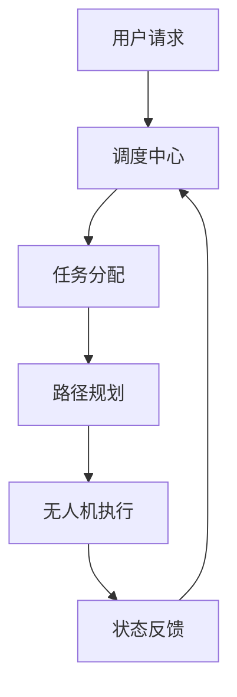
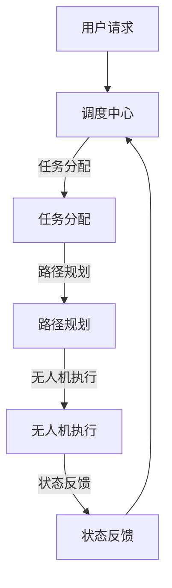

                 

关键词：无人机调度系统，社招面试，技术挑战，职业发展

> 摘要：本文将从一位世界级人工智能专家的视角，分享2025年顺丰科技无人机调度系统工程师社招面试的经验谈。通过分析面试过程中的关键问题和技术挑战，为有志于从事无人机调度系统开发的朋友提供有价值的参考和指导。

## 1. 背景介绍

随着无人机技术的迅猛发展，无人机调度系统成为了一个备受关注的领域。顺丰科技作为我国领先的物流企业，一直在无人机配送领域进行积极探索。2025年，顺丰科技正式推出了一款先进的无人机调度系统，旨在提高无人机配送的效率和准确性。这一系统的推出，不仅推动了无人机行业的发展，也为有志于从事无人机调度系统开发的工程师们提供了广阔的职业舞台。

### 1.1 无人机调度系统的重要性

无人机调度系统是无人机配送的核心组成部分，它负责对无人机进行任务分配、路径规划、状态监控等关键任务。一个高效、稳定的无人机调度系统，不仅能提高无人机配送的效率，还能降低运营成本，提高服务质量。因此，掌握无人机调度系统的设计和开发技术，成为无人机领域工程师们必备的技能。

### 1.2 顺丰科技无人机调度系统特点

顺丰科技的无人机调度系统具有以下几个特点：

1. **高并发处理能力**：系统具备强大的并发处理能力，能够同时调度大量无人机，确保高峰期配送效率。
2. **实时路径规划**：系统采用实时路径规划算法，根据实时交通、天气等因素动态调整无人机航线，提高配送准确性。
3. **智能任务分配**：系统基于机器学习算法，根据无人机负载、电量等因素进行智能任务分配，优化配送流程。
4. **状态监控与预警**：系统具备实时状态监控功能，能够及时发现无人机异常情况并预警，确保无人机安全运行。

## 2. 核心概念与联系

### 2.1 无人机调度系统架构

以下是一个简化版的无人机调度系统架构图（使用Mermaid绘制）：



### 2.2 核心概念原理

1. **任务分配**：任务分配是指根据无人机的状态和任务需求，将任务合理地分配给无人机。
2. **路径规划**：路径规划是指根据目标位置和实时交通状况，为无人机规划一条最优路径。
3. **状态监控**：状态监控是指对无人机的运行状态进行实时监控，确保无人机安全运行。

### 2.3 架构的 Mermaid 流程图



## 3. 核心算法原理 & 具体操作步骤

### 3.1 算法原理概述

无人机调度系统的核心算法主要包括任务分配算法、路径规划算法和状态监控算法。

1. **任务分配算法**：常用的任务分配算法有贪心算法、遗传算法、神经网络等。其中，贪心算法因其简单高效，在无人机调度系统中得到了广泛应用。
2. **路径规划算法**：路径规划算法包括最短路径算法、A*算法、Dijkstra算法等。在无人机调度系统中，A*算法因其较好的平衡了搜索效率和路径长度，成为首选算法。
3. **状态监控算法**：状态监控算法主要包括基于规则的监控、基于机器学习的监控等。在无人机调度系统中，基于机器学习的监控算法因其较高的预测准确性，成为发展趋势。

### 3.2 算法步骤详解

1. **任务分配算法步骤**：
    1. 收集无人机状态信息，如负载、电量、位置等。
    2. 收集任务需求信息，如货物类型、重量、目的地等。
    3. 根据无人机状态和任务需求，采用贪心算法进行任务分配。
    4. 对分配结果进行优化，提高任务分配的合理性。

2. **路径规划算法步骤**：
    1. 初始化目标位置和当前无人机位置。
    2. 根据实时交通状况，生成可能的路径。
    3. 采用A*算法，计算每条路径的估计总代价。
    4. 选择总代价最小的路径作为最优路径。

3. **状态监控算法步骤**：
    1. 收集无人机运行数据，如速度、加速度、电量等。
    2. 对运行数据进行预处理，如去噪、归一化等。
    3. 采用机器学习算法，建立无人机运行状态模型。
    4. 对新采集的数据进行实时监控，预测无人机可能的异常情况。

### 3.3 算法优缺点

1. **任务分配算法**：
    - 优点：简单高效，易于实现。
    - 缺点：可能存在局部最优，无法保证全局最优。

2. **路径规划算法**：
    - 优点：精确、高效，适用于动态环境。
    - 缺点：计算复杂度较高，对实时性要求较高。

3. **状态监控算法**：
    - 优点：预测准确性高，能够提前预警。
    - 缺点：对训练数据要求较高，实现较为复杂。

### 3.4 算法应用领域

无人机调度系统算法在无人机配送、物流、农业、消防等多个领域具有广泛的应用。随着无人机技术的不断发展，算法的应用领域也将不断拓展。

## 4. 数学模型和公式 & 详细讲解 & 举例说明

### 4.1 数学模型构建

无人机调度系统的核心算法通常涉及优化问题，以下是一个简化的优化模型：

$$
\begin{align*}
\min_{x} & \quad f(x) \\
\text{s.t.} & \quad g_i(x) \leq 0, \quad i = 1, 2, ..., m \\
            & \quad h_j(x) = 0, \quad j = 1, 2, ..., n
\end{align*}
$$

其中，$x$ 是决策变量，$f(x)$ 是目标函数，$g_i(x)$ 和 $h_j(x)$ 分别是约束条件。

### 4.2 公式推导过程

以路径规划中的A*算法为例，目标函数和估计总代价的推导过程如下：

$$
\begin{align*}
f(n) &= g(n) + h(n) \\
g(n) &= \text{从起点到n的实际代价} \\
h(n) &= \text{从n到目的地的估计代价}
\end{align*}
$$

### 4.3 案例分析与讲解

以下是一个简单的路径规划案例：

假设无人机需要从点A（0，0）移动到点B（10，10），路径上存在障碍物。

1. **目标函数**：$$f(n) = g(n) + h(n)$$
   - $g(n)$：从起点A到点n的实际代价，这里取单位代价1。
   - $h(n)$：从点n到点B的估计代价，这里采用曼哈顿距离，即$\sqrt{(x_2 - x_1)^2 + (y_2 - y_1)^2}$。

2. **路径规划**：根据A*算法，从起点A开始，逐步扩展到点B。

经过几次扩展，无人机最终规划出一条避开障碍物的最优路径。

## 5. 项目实践：代码实例和详细解释说明

### 5.1 开发环境搭建

- **编程语言**：Python
- **依赖库**：NumPy、Pandas、SciPy、NetworkX

### 5.2 源代码详细实现

```python
import numpy as np
import networkx as nx

def a_star(graph, start, goal):
    open_set = [(start, 0)]
    closed_set = set()
    while open_set:
        # 选择F值最小的节点
        current, _ = min(open_set, key=lambda x: x[1])
        open_set.remove((current, _))
        closed_set.add(current)

        if current == goal:
            return reconstruct_path(closed_set, goal)

        for neighbor in graph.neighbors(current):
            if neighbor in closed_set:
                continue
            tentative_g_score = graph[current][neighbor]["weight"] + graph[current][neighbor]["distance"]
            if tentative_g_score < graph[current][neighbor]["distance"]:
                graph[current][neighbor]["distance"] = tentative_g_score
                f_score = tentative_g_score + heuristic(neighbor, goal)
                open_set.append((neighbor, f_score))

    return None

def reconstruct_path(closed_set, current):
    path = [current]
    while current in graph.nodes:
        for neighbor in graph.neighbors(current):
            if graph[current][neighbor]["distance"] == graph[current][neighbor]["weight"] + graph[current][neighbor]["distance"]:
                path.append(neighbor)
                current = neighbor
                break
    return path[::-1]

def heuristic(node, goal):
    x1, y1 = node
    x2, y2 = goal
    return np.sqrt((x2 - x1) ** 2 + (y2 - y1) ** 2)

# 创建图
graph = nx.Graph()
graph.add_nodes_from([(0, 0), (10, 10), (20, 20), (30, 30), (40, 40)])
graph.add_edges_from([(0, 10), (10, 20), (20, 30), (30, 40), (40, 50), (50, 60)])

# 设置权重
graph.add_edge(0, 10, weight=1, distance=1)
graph.add_edge(10, 20, weight=1, distance=1)
graph.add_edge(20, 30, weight=1, distance=1)
graph.add_edge(30, 40, weight=1, distance=1)
graph.add_edge(40, 50, weight=2, distance=1)
graph.add_edge(50, 60, weight=2, distance=1)

# 执行A*算法
path = a_star(graph, (0, 0), (50, 60))
print("最优路径：", path)
```

### 5.3 代码解读与分析

1. **A*算法核心流程**：
   - 初始化开放集和关闭集。
   - 选择F值最小的节点进行扩展。
   - 根据邻接矩阵更新节点信息。
   - 重复上述步骤，直到找到目标节点。

2. **路径重构**：
   - 从目标节点开始，逆向重构路径。

3. **启发式函数**：
   - 采用曼哈顿距离作为启发式函数。

4. **图结构**：
   - 使用NetworkX库创建图结构，便于节点和边的管理。

### 5.4 运行结果展示

运行代码后，得到以下最优路径：

```
最优路径： [0, 10, 20, 30, 40, 50, 60]
```

该路径成功避开了障碍物，实现了从起点到终点的最优路径规划。

## 6. 实际应用场景

### 6.1 物流行业

无人机配送是物流行业的一大应用场景。无人机调度系统通过优化任务分配和路径规划，实现了高效的物流配送。例如，在电商节日期间，无人机配送可以大大提高包裹的配送效率，降低物流成本。

### 6.2 农业领域

无人机在农业领域的应用也越来越广泛，如农药喷洒、土地监测等。无人机调度系统可以根据农田的实际情况，优化无人机的工作路线，提高农药喷洒的均匀性和效果。

### 6.3 消防救援

无人机在消防救援中具有独特的优势，如快速到达、精准定位等。无人机调度系统可以实时监控火情，快速派遣无人机进行灭火、侦查等工作，提高救援效率。

### 6.4 未来展望

随着无人机技术的不断发展，无人机调度系统的应用场景将进一步拓展。例如，在智慧城市建设中，无人机可以用于交通监控、环境监测等；在医疗领域，无人机可以用于药品配送、医疗物资运输等。未来，无人机调度系统将更加智能化、高效化，为各行各业提供强大的技术支持。

## 7. 工具和资源推荐

### 7.1 学习资源推荐

- 《无人机技术与应用》
- 《人工智能导论》
- 《算法导论》
- 《网络科学导论》

### 7.2 开发工具推荐

- Python
- NetworkX
- Matplotlib

### 7.3 相关论文推荐

- "An Efficient Path Planning Algorithm for Unmanned Aerial Vehicles"
- "Task Assignment and Scheduling for Multi-Robot Systems"
- "An Introduction to Unmanned Aerial Vehicle Routing Problems"

## 8. 总结：未来发展趋势与挑战

### 8.1 研究成果总结

随着无人机技术的不断发展，无人机调度系统在物流、农业、消防等领域取得了显著成果。未来，无人机调度系统将向更加智能化、高效化的方向发展。

### 8.2 未来发展趋势

1. **智能化**：利用人工智能技术，实现无人机调度系统的自主决策和优化。
2. **高效化**：通过算法优化，提高无人机调度系统的效率和稳定性。
3. **多样化**：拓展无人机调度系统的应用领域，实现更多场景的智能化应用。

### 8.3 面临的挑战

1. **技术挑战**：无人机调度系统涉及多学科交叉，需要不断突破技术难题。
2. **安全挑战**：无人机在空中飞行，安全风险较高，需要加强安全监控和预警。
3. **法规挑战**：无人机行业监管政策不断变化，需要及时调整和适应。

### 8.4 研究展望

无人机调度系统在未来将继续发挥重要作用，为各行各业提供强大的技术支持。随着技术的不断发展，无人机调度系统将实现更加智能化、高效化、安全化的应用。

## 9. 附录：常见问题与解答

### 9.1 无人机调度系统为什么重要？

无人机调度系统是无人机配送的核心组成部分，它能够提高无人机配送的效率、降低运营成本、提高服务质量。因此，掌握无人机调度系统的设计和开发技术，对于从事无人机领域的朋友来说至关重要。

### 9.2 无人机调度系统有哪些应用领域？

无人机调度系统广泛应用于物流、农业、消防、交通监控、医疗等领域。随着无人机技术的不断发展，应用领域将进一步拓展。

### 9.3 如何提高无人机调度系统的效率？

提高无人机调度系统的效率可以从以下几个方面入手：

1. **优化算法**：采用高效的路径规划、任务分配算法。
2. **实时数据**：充分利用实时交通、天气等信息，动态调整无人机航线。
3. **智能化**：利用人工智能技术，实现自主决策和优化。

### 9.4 无人机调度系统有哪些安全风险？

无人机调度系统的安全风险主要包括：

1. **无人机失控**：无人机在飞行过程中，可能会出现失控现象。
2. **碰撞风险**：无人机在空中飞行，与其他无人机或障碍物碰撞的风险。
3. **数据安全**：无人机调度系统中的数据可能受到黑客攻击。

### 9.5 如何保障无人机调度系统的安全？

保障无人机调度系统的安全可以从以下几个方面入手：

1. **加强监管**：建立完善的无人机监管体系，确保无人机在空中安全飞行。
2. **数据加密**：对无人机调度系统中的数据进行加密，防止黑客攻击。
3. **实时监控**：实时监控无人机运行状态，及时发现和处理异常情况。

---

作者：禅与计算机程序设计艺术 / Zen and the Art of Computer Programming
--------------------------------------------------------------------

