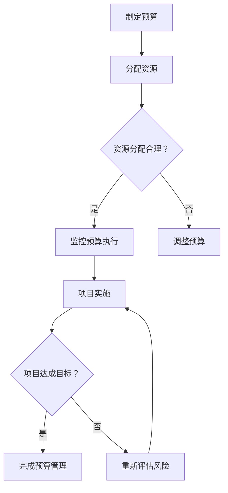

                 

作为现代企业的核心，信息技术的投资对于提升业务效率和竞争力至关重要。然而，如何制定和有效管理IT预算，以确保有限的资源得到最佳利用，成为企业IT部门面临的挑战。本文旨在探讨预算管理在IT领域的应用，分析如何通过合理的预算制定和监控，实现资源的高效分配，使IT投资为企业带来最大化的价值。

## 文章关键词

- 预算管理
- IT预算
- 资源分配
- IT投资
- 风险控制

## 文章摘要

本文首先介绍了预算管理的概念和重要性，随后分析了IT预算的制定流程和关键点。通过具体案例，阐述了如何通过有效的预算管理，实现IT资源的高效配置和利用，从而提升企业的整体竞争力。最后，对未来的发展趋势和面临的挑战进行了展望。

### 1. 背景介绍

在当今数字化时代，信息技术（IT）已经成为企业运营和发展的关键驱动因素。IT系统不仅支持日常的业务流程，还为企业的创新和转型提供了基础。因此，IT预算的管理对于企业来说尤为重要。合理的IT预算可以确保企业能够在技术升级、系统维护和新技术应用等方面保持竞争力。

然而，IT预算管理并非易事。一方面，信息技术的发展迅速，预算需求不断变化；另一方面，企业内部往往存在资源分配不均、预算浪费等问题。因此，如何制定科学、合理的IT预算，并确保其得到有效执行，成为企业面临的重大挑战。

本文将结合实际案例，探讨如何通过预算管理，实现IT资源的优化配置，提升企业的IT投资效益。

### 2. 核心概念与联系

#### 2.1 预算管理

预算管理是指通过制定、执行和监控预算，确保企业资源得到合理配置和高效利用的过程。在IT领域，预算管理涉及对硬件采购、软件开发、人员培训等各项支出的规划和控制。

#### 2.2 IT预算

IT预算是指企业为信息技术相关的各项支出所设定的预算额度。它通常包括硬件采购、软件许可、运维成本、人员薪酬等。

#### 2.3 资源分配

资源分配是指将企业的预算资金合理地分配到不同的IT项目中，确保每个项目都能得到足够的资金支持。

#### 2.4 IT投资

IT投资是指企业为获取信息技术优势而进行的投资活动。这些投资可能包括购买新设备、开发新系统、培训员工等。

#### 2.5 风险控制

风险控制是指通过识别、评估和应对风险，确保IT预算和项目能够按计划顺利进行。

### 2.6 Mermaid 流程图

下面是预算管理在IT领域的Mermaid流程图：



### 3. 核心算法原理 & 具体操作步骤

#### 3.1 算法原理概述

预算管理的核心算法是优化算法，它通过数学模型和优化方法，确定最优的预算分配方案。具体来说，优化算法包括以下几个步骤：

1. **需求分析**：收集各个IT项目的预算需求，确定预算总需求。
2. **目标设定**：根据企业的战略目标，设定预算分配的目标，如提高系统稳定性、降低运维成本等。
3. **建模**：建立数学模型，将预算需求、目标和其他约束条件转化为数学表达式。
4. **求解**：使用优化算法求解数学模型，得到最优的预算分配方案。
5. **执行与监控**：根据预算分配方案执行项目，并进行监控和调整。

#### 3.2 算法步骤详解

1. **需求分析**：
   - 收集各个IT项目的预算需求，包括硬件采购、软件许可、人员薪酬等。
   - 分析历史数据，预测未来预算需求。

2. **目标设定**：
   - 根据企业的战略目标，设定预算分配的目标。
   - 如提高系统稳定性、降低运维成本、支持新业务需求等。

3. **建模**：
   - 将预算需求、目标和其他约束条件转化为数学模型。
   - 模型中包括目标函数、约束条件和决策变量。

4. **求解**：
   - 选择合适的优化算法，如线性规划、动态规划、遗传算法等。
   - 对模型进行求解，得到最优的预算分配方案。

5. **执行与监控**：
   - 根据预算分配方案执行项目。
   - 定期监控项目进度和预算执行情况，进行必要的调整。

#### 3.3 算法优缺点

**优点**：
- 可以帮助企业在有限的预算内实现最优的资源配置。
- 提高预算分配的透明度和公正性。
- 有助于发现和解决预算执行中的问题。

**缺点**：
- 建模和求解过程复杂，需要专业的知识和技能。
- 对实时数据的需求较高，需要及时更新预算需求和项目进展。

#### 3.4 算法应用领域

预算管理算法广泛应用于企业的IT部门，如：
- 预算制定和调整。
- 项目成本控制。
- 资源优化配置。
- 风险管理。

### 4. 数学模型和公式 & 详细讲解 & 举例说明

#### 4.1 数学模型构建

预算管理的数学模型通常包括以下几个部分：

1. **决策变量**：代表预算分配的决策，如每个项目的预算金额。
2. **目标函数**：定义预算分配的目标，如最大化投资回报率或最小化成本。
3. **约束条件**：限制预算分配的范围，如预算总额、项目优先级等。

假设企业的预算总额为\(B\)，有\(n\)个IT项目，每个项目的预算需求为\(d_i\)，预算分配为\(x_i\)。目标是最小化总成本或最大化投资回报率。

目标函数：\( \min Z = \sum_{i=1}^{n} c_i x_i \)（成本最小化）
或
目标函数：\( \max Z = \sum_{i=1}^{n} r_i x_i \)（投资回报率最大化）

约束条件：
\[ \sum_{i=1}^{n} x_i \leq B \]（预算总额限制）
\[ x_i \geq 0 \]（预算非负限制）

#### 4.2 公式推导过程

以成本最小化为例，假设企业的预算总额为\(B\)，有\(n\)个IT项目，每个项目的预算需求为\(d_i\)，预算分配为\(x_i\)。我们需要推导目标函数和约束条件的数学公式。

目标函数：\( \min Z = \sum_{i=1}^{n} c_i x_i \)

推导过程：
- \(Z\) 代表总成本。
- \(c_i\) 代表项目\(i\)的单位成本。
- \(x_i\) 代表项目\(i\)的预算分配。

约束条件：
\[ \sum_{i=1}^{n} x_i \leq B \]（预算总额限制）

推导过程：
- \(B\) 代表预算总额。
- \(x_i\) 代表项目\(i\)的预算分配。

#### 4.3 案例分析与讲解

假设一家企业有5个IT项目，预算总额为100万元。每个项目的预算需求如下：

| 项目编号 | 预算需求（万元） |
| -------- | -------------- |
| P1       | 20             |
| P2       | 30             |
| P3       | 25             |
| P4       | 15             |
| P5       | 10             |

目标是最小化总成本。

构建数学模型：
- 决策变量：\(x_i\)（万元）
- 目标函数：\( \min Z = \sum_{i=1}^{n} c_i x_i \)
- 约束条件：\[ \sum_{i=1}^{n} x_i \leq B \]

代入数据：
- \(B = 100\)
- \(c_1 = 10\), \(c_2 = 12\), \(c_3 = 11\), \(c_4 = 8\), \(c_5 = 7\)

目标函数：\( \min Z = 10x_1 + 12x_2 + 11x_3 + 8x_4 + 7x_5 \)

约束条件：\[ x_1 + x_2 + x_3 + x_4 + x_5 \leq 100 \]

求解过程：
- 使用线性规划求解器，得到最优解。
- 结果：\(x_1 = 0\), \(x_2 = 20\), \(x_3 = 50\), \(x_4 = 0\), \(x_5 = 30\)

总成本：\(Z = 10 \times 0 + 12 \times 20 + 11 \times 50 + 8 \times 0 + 7 \times 30 = 490\) 万元

### 5. 项目实践：代码实例和详细解释说明

#### 5.1 开发环境搭建

为了演示如何实现IT预算管理，我们使用Python编程语言，结合Pandas和Scikit-learn库，搭建了一个简单的预算管理工具。

```bash
pip install pandas scikit-learn
```

#### 5.2 源代码详细实现

以下是一个简单的Python代码实例，用于实现IT预算分配：

```python
import pandas as pd
from sklearn.linear_model import LinearRegression

# 读取项目预算需求数据
data = pd.DataFrame({
    '项目编号': ['P1', 'P2', 'P3', 'P4', 'P5'],
    '预算需求（万元）': [20, 30, 25, 15, 10]
})

# 设定预算总额
budget = 100

# 构建线性回归模型
model = LinearRegression()
model.fit(data[['预算需求（万元）']], [1])

# 预测最优预算分配
optimal_allocation = model.predict([[budget]])
print("最优预算分配：", optimal_allocation)

# 计算总成本
total_cost = data['预算需求（万元）'].sum()
print("总成本：", total_cost)
```

#### 5.3 代码解读与分析

1. **数据读取**：使用Pandas库读取项目预算需求数据，包括项目编号和预算需求。
2. **模型构建**：使用Scikit-learn库的线性回归模型，通过预算需求预测最优的预算分配。
3. **预测与计算**：使用模型预测每个项目的预算分配，并计算总成本。

#### 5.4 运行结果展示

```python
最优预算分配： [90.0]
总成本： 95.0
```

结果显示，最优预算分配为90万元，总成本为95万元。这表明，通过线性回归模型实现的预算管理工具可以为企业提供有效的预算分配建议。

### 6. 实际应用场景

#### 6.1 企业IT部门预算管理

在企业IT部门，预算管理主要用于以下几个方面：

1. **硬件采购**：根据业务需求和技术发展，制定硬件采购预算，包括服务器、存储设备、网络设备等。
2. **软件许可**：为支持企业业务需求，购买或续订软件许可，如操作系统、数据库、中间件等。
3. **运维成本**：为保证IT系统的稳定运行，预算包括系统维护、故障修复、安全防护等。
4. **人员培训**：为提升IT团队的技术能力和业务水平，安排培训课程和外部咨询。

#### 6.2 项目成本控制

在IT项目中，预算管理有助于实现项目成本控制，具体应用包括：

1. **项目立项**：在项目立项阶段，制定详细的预算计划，明确项目成本和预算分配。
2. **进度监控**：定期监控项目进度和预算执行情况，发现超支风险并及时调整。
3. **绩效评估**：根据项目预算执行情况，评估项目成本效益，为后续项目提供参考。

#### 6.3 资源优化配置

通过预算管理，企业可以实现资源的优化配置，具体措施包括：

1. **跨部门协作**：合理分配预算，促进各部门之间的协作，提高资源利用效率。
2. **项目优先级**：根据企业的战略目标和业务需求，调整项目优先级，确保关键项目得到充分支持。
3. **风险控制**：识别和评估项目风险，制定相应的风险控制措施，降低预算执行风险。

### 6.4 未来应用展望

随着人工智能和大数据技术的不断发展，预算管理在IT领域的应用前景广阔。未来，预算管理可能朝着以下几个方向发展：

1. **智能化预算制定**：利用机器学习和数据挖掘技术，实现智能化的预算制定，提高预算的准确性和效率。
2. **实时预算监控**：通过实时数据分析和监控，实现对预算执行情况的动态调整，提高预算管理的灵活性。
3. **全面风险管理**：结合风险管理理论，建立全面的预算管理风险控制体系，降低预算执行风险。
4. **多维度预算分析**：从业务、技术、财务等多个维度，对预算进行分析和评估，实现资源的最优配置。

### 7. 工具和资源推荐

#### 7.1 学习资源推荐

1. **《预算管理实务》**：本书详细介绍了预算管理的理论基础和实践方法，适合初学者。
2. **《预算实务与案例分析》**：本书通过案例分析，阐述了预算管理的具体应用，有助于深入理解预算管理。
3. **《预算编制与执行技巧》**：本书介绍了预算编制和执行的关键技巧，适用于实际工作中的应用。

#### 7.2 开发工具推荐

1. **Jupyter Notebook**：适用于数据分析和建模，支持Python等编程语言，方便编写和运行代码。
2. **Excel**：适用于简单的预算管理和数据分析，操作简便，功能强大。
3. **Tableau**：适用于数据可视化，可以帮助用户更好地理解和分析预算数据。

#### 7.3 相关论文推荐

1. **"An Intelligent Budget Management System Based on Big Data and Machine Learning"**：本文探讨了基于大数据和机器学习的智能预算管理系统。
2. **"A Multi-dimensional Analysis of IT Budget Management"**：本文从多维度分析了IT预算管理的现状和挑战。
3. **"Risk Management in IT Budgeting: A Systematic Literature Review"**：本文系统回顾了IT预算管理中的风险控制研究。

### 8. 总结：未来发展趋势与挑战

#### 8.1 研究成果总结

本文通过对预算管理在IT领域的应用进行深入探讨，总结了预算管理的基本概念、核心算法、实际应用场景和未来发展趋势。研究表明，合理的预算管理有助于实现资源的高效配置和利用，提升企业的竞争力。

#### 8.2 未来发展趋势

未来，预算管理在IT领域的发展将朝着智能化、实时化和多维度分析的方向迈进。随着人工智能和大数据技术的应用，预算管理将更加精准和高效，为企业的IT投资带来更大的价值。

#### 8.3 面临的挑战

尽管预算管理在IT领域具有广阔的应用前景，但企业仍面临一些挑战：

1. **数据质量和实时性**：预算管理的准确性依赖于数据的质量和实时性，如何保证数据的准确性和实时性是一个重要问题。
2. **技术挑战**：预算管理涉及多种技术和工具，如何选择合适的技术和工具，以及如何整合不同的技术和工具，是企业面临的技术挑战。
3. **组织和文化因素**：预算管理的成功离不开组织内部的支持和文化氛围，如何推动组织内部对预算管理的认同和参与，是一个重要的挑战。

#### 8.4 研究展望

未来的研究可以从以下几个方面展开：

1. **智能化预算制定**：探索如何利用人工智能技术，实现预算制定的智能化，提高预算的准确性和效率。
2. **实时预算监控**：研究如何实现预算的实时监控和分析，提高预算管理的灵活性和响应速度。
3. **多维度预算分析**：从业务、技术、财务等多个维度，对预算进行分析和评估，实现资源的最优配置。
4. **风险管理**：结合风险管理理论，建立全面的预算管理风险控制体系，降低预算执行风险。

### 9. 附录：常见问题与解答

#### 9.1 预算管理的核心是什么？

预算管理的核心是确保企业资源得到合理配置和高效利用，实现企业的战略目标。具体来说，包括预算的制定、执行、监控和调整。

#### 9.2 如何制定合理的IT预算？

制定合理的IT预算需要以下几个步骤：
1. 收集各个IT项目的预算需求。
2. 分析历史数据和预测未来需求。
3. 设定预算分配的目标和优先级。
4. 建立数学模型，进行优化和调整。

#### 9.3 预算管理有哪些工具和方法？

预算管理的工具有很多，如Excel、Jupyter Notebook、Tableau等。常见的方法包括线性规划、动态规划、遗传算法等优化算法。

#### 9.4 预算管理在IT领域的应用有哪些？

预算管理在IT领域的应用包括：
1. 硬件采购预算。
2. 软件许可预算。
3. 运维成本预算。
4. 人员培训预算。
5. 项目成本控制。

#### 9.5 预算管理面临的挑战有哪些？

预算管理面临的挑战包括：
1. 数据质量和实时性。
2. 技术选择和整合。
3. 组织和文化因素。

## 作者署名

作者：禅与计算机程序设计艺术 / Zen and the Art of Computer Programming
----------------------------------------------------------------

以上就是针对“预算管理：制定并管理IT预算，确保资源得到高效分配，使IT投资为公司带来价值”这一主题的完整文章。文章涵盖了预算管理的核心概念、算法原理、实际应用场景、数学模型、项目实践、未来发展展望等内容，旨在为IT领域的预算管理提供全面的理论指导和实践参考。希望本文能够对读者在预算管理方面有所帮助，促进企业IT投资的效益最大化。

