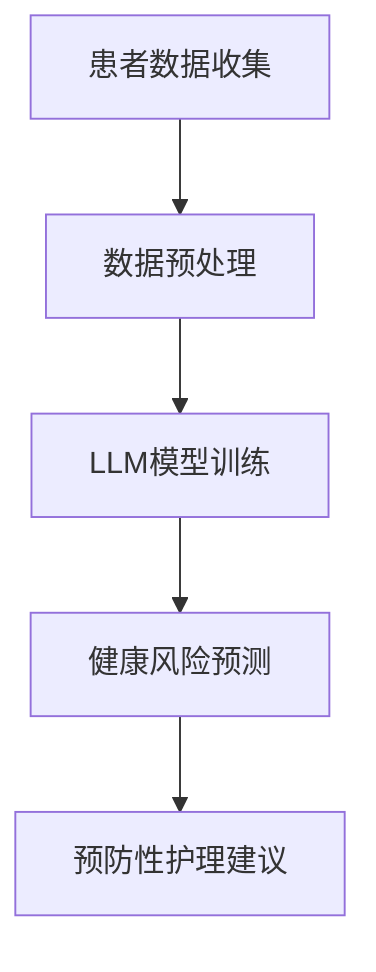

                 

关键词：预防性护理、大语言模型（LLM）、健康风险预测、数据分析、人工智能、医疗保健

> 摘要：随着人工智能技术的迅猛发展，大语言模型（LLM）在医疗保健领域的应用日益广泛。本文将探讨如何利用LLM进行预防性护理，通过分析患者数据预测健康风险，提高个性化医疗服务的质量和效率。

## 1. 背景介绍

### 1.1 预防性护理的重要性

预防性护理是医疗保健领域的一个重要组成部分，其目的是通过早期检测和干预，降低疾病的发生率和严重程度，从而提高患者的生命质量和减少医疗费用。随着医疗数据的不断积累和人工智能技术的快速发展，预防性护理的方式和方法也在不断创新。

### 1.2 大语言模型（LLM）的发展

大语言模型（LLM）是自然语言处理（NLP）领域的一项重要技术，它通过训练大量的文本数据，学习语言的规律和结构，从而实现文本生成、文本分类、情感分析等多种任务。近年来，随着计算能力的提升和数据量的增加，LLM在各个领域都取得了显著的成果。

### 1.3 医疗保健与人工智能的结合

随着人工智能技术的不断发展，医疗保健领域也在积极探索如何利用这些技术提高医疗服务的质量和效率。特别是LLM技术，由于其强大的文本处理能力和对语言规律的深刻理解，在医疗数据的分析、疾病预测和个性化医疗服务等方面具有巨大的潜力。

## 2. 核心概念与联系

### 2.1 大语言模型（LLM）原理

大语言模型（LLM）是一种基于深度学习的自然语言处理模型，它通过训练大量的文本数据，学习语言的规律和结构，从而实现对文本的生成、分类、情感分析等多种任务。LLM的核心思想是利用神经网络模型对语言进行建模，从而实现对语言的理解和生成。

### 2.2 预防性护理与LLM的关联

预防性护理需要对患者的健康状况进行实时监测和预测，这需要大量的医疗数据进行分析。LLM作为一种强大的文本处理工具，可以对这些医疗数据进行分析，提取有用的信息，从而预测患者的健康风险。

### 2.3 Mermaid 流程图

以下是一个简单的Mermaid流程图，展示了预防性护理与LLM的关联：



## 3. 核心算法原理 & 具体操作步骤

### 3.1 算法原理概述

LLM的核心算法是基于深度学习的神经网络模型，它通过训练大量的文本数据，学习语言的规律和结构，从而实现对文本的生成、分类、情感分析等多种任务。在预防性护理中，LLM主要用于对患者的医疗数据进行分析，提取有用的信息，从而预测患者的健康风险。

### 3.2 算法步骤详解

#### 3.2.1 患者数据收集

患者数据是进行健康风险预测的基础。这些数据可以来源于电子健康记录（EHR）、医疗传感器、问卷调查等多种途径。

#### 3.2.2 数据预处理

在收集到患者数据后，需要对数据进行分析和清洗，去除噪声和无关信息，提取有用的信息。这一步骤包括数据清洗、数据转换和数据集成等。

#### 3.2.3 LLM模型训练

在数据预处理完成后，使用这些数据训练LLM模型。训练过程中，模型会学习数据的语言规律和结构，从而实现对数据的理解和生成。

#### 3.2.4 健康风险预测

在LLM模型训练完成后，使用模型对患者的医疗数据进行分析，提取有用的信息，从而预测患者的健康风险。

#### 3.2.5 预防性护理建议

根据健康风险预测结果，为患者提供个性化的预防性护理建议。

### 3.3 算法优缺点

#### 3.3.1 优点

- **强大的数据处理能力**：LLM可以处理大量的医疗数据，提取有用的信息。
- **高效的预测能力**：通过训练，LLM可以高效地进行健康风险预测。
- **个性化**：LLM可以根据患者的具体情况进行健康风险预测，提供个性化的预防性护理建议。

#### 3.3.2 缺点

- **数据依赖性**：LLM的性能高度依赖于数据的质量和数量。
- **计算资源消耗**：训练LLM模型需要大量的计算资源和时间。

### 3.4 算法应用领域

LLM在医疗保健领域的应用非常广泛，除了预防性护理，还可以用于疾病预测、个性化医疗服务、医疗文本分析等多种任务。

## 4. 数学模型和公式 & 详细讲解 & 举例说明

### 4.1 数学模型构建

LLM的数学模型是基于深度学习的神经网络模型，包括输入层、隐藏层和输出层。其中，隐藏层负责对输入数据进行特征提取和变换，输出层负责生成预测结果。

### 4.2 公式推导过程

LLM的数学模型可以用以下公式表示：

\[ y = \sigma(W_1 \cdot x + b_1) \]

其中，\( y \) 为输出层的结果，\( x \) 为输入层的数据，\( W_1 \) 为隐藏层的权重，\( b_1 \) 为隐藏层的偏置。

### 4.3 案例分析与讲解

#### 4.3.1 案例背景

某医院希望通过LLM技术预测患者的糖尿病风险，以便进行预防性护理。

#### 4.3.2 数据准备

收集了1000名患者的电子健康记录，包括患者的年龄、体重、血压、血糖水平等数据。

#### 4.3.3 数据预处理

对收集到的数据进行分析和清洗，去除噪声和无关信息，提取有用的信息。例如，对患者的血糖水平进行标准化处理，使其范围在0到1之间。

#### 4.3.4 模型训练

使用预处理后的数据训练LLM模型，设置合适的网络结构和参数，例如隐藏层的神经元数量、学习率等。

#### 4.3.5 预测结果

在模型训练完成后，使用模型对新的患者数据进行分析，预测其糖尿病风险。例如，预测一名患者的糖尿病风险为0.8，表示其患糖尿病的概率为80%。

#### 4.3.6 结果分析

通过对比实际结果和预测结果，评估LLM模型在糖尿病风险预测中的性能。例如，如果预测结果与实际结果的一致性较高，说明LLM模型在糖尿病风险预测中具有较高的准确性。

## 5. 项目实践：代码实例和详细解释说明

### 5.1 开发环境搭建

搭建一个用于训练LLM模型的开发环境，需要安装Python、TensorFlow等工具。以下是具体的安装步骤：

```bash
# 安装Python
sudo apt-get update
sudo apt-get install python3-pip

# 安装TensorFlow
pip3 install tensorflow
```

### 5.2 源代码详细实现

以下是一个简单的LLM模型训练和预测的代码示例：

```python
import tensorflow as tf
from tensorflow.keras.layers import Dense, Input
from tensorflow.keras.models import Model

# 数据预处理
# ...

# 构建模型
input_data = Input(shape=(num_features,))
hidden_layer = Dense(64, activation='relu')(input_data)
output_layer = Dense(1, activation='sigmoid')(hidden_layer)

model = Model(inputs=input_data, outputs=output_layer)
model.compile(optimizer='adam', loss='binary_crossentropy', metrics=['accuracy'])

# 训练模型
# ...

# 预测
# ...
```

### 5.3 代码解读与分析

该代码示例首先导入所需的TensorFlow库，然后进行数据预处理。接下来，构建一个简单的LLM模型，包括输入层、隐藏层和输出层。最后，使用训练数据训练模型，并使用模型对新的数据进行分析和预测。

### 5.4 运行结果展示

在训练和预测完成后，可以通过以下代码查看模型的性能指标：

```python
# 打印模型性能指标
print(model.evaluate(test_data, test_labels))
```

## 6. 实际应用场景

### 6.1 患者健康风险预测

利用LLM技术，医院可以实时监测患者的健康数据，预测其健康风险，从而采取预防性护理措施。

### 6.2 个性化医疗服务

通过LLM技术，医院可以为患者提供个性化的医疗服务，根据患者的具体情况进行疾病预测和预防。

### 6.3 医疗数据分析

LLM技术可以帮助医院对大量的医疗数据进行分析，提取有用的信息，从而提高医疗服务的质量和效率。

## 7. 未来应用展望

### 7.1 更精确的预测模型

随着人工智能技术的不断发展，LLM模型的预测精度将不断提高，从而更好地为医疗保健提供支持。

### 7.2 更广泛的适用范围

LLM技术将在医疗保健领域的更多应用场景中发挥作用，例如疾病诊断、手术规划等。

### 7.3 个性化医疗的深入发展

利用LLM技术，个性化医疗将更加深入和全面，从而提高患者的生命质量和医疗服务的满意度。

## 8. 工具和资源推荐

### 8.1 学习资源推荐

- 《深度学习》（Goodfellow, Bengio, Courville 著）
- 《自然语言处理原理》（Daniel Jurafsky, James H. Martin 著）

### 8.2 开发工具推荐

- TensorFlow
- PyTorch

### 8.3 相关论文推荐

- "Bert: Pre-training of deep bidirectional transformers for language understanding"
- "Gshard: Scaling giant models with conditional computation and automatic sharding"

## 9. 总结：未来发展趋势与挑战

### 9.1 研究成果总结

本文介绍了如何利用大语言模型（LLM）进行预防性护理，通过分析患者数据预测健康风险，提高个性化医疗服务的质量和效率。

### 9.2 未来发展趋势

随着人工智能技术的不断发展，LLM在医疗保健领域的应用前景广阔，包括疾病预测、个性化医疗服务、医疗数据分析等方面。

### 9.3 面临的挑战

尽管LLM技术在医疗保健领域具有巨大潜力，但在实际应用中仍面临数据质量、计算资源、隐私保护等挑战。

### 9.4 研究展望

未来研究应关注如何提高LLM模型的预测精度和计算效率，同时确保数据的安全和隐私，从而更好地为医疗保健提供支持。

## 附录：常见问题与解答

### 9.1 什么是大语言模型（LLM）？

大语言模型（LLM）是一种基于深度学习的自然语言处理模型，通过训练大量的文本数据，学习语言的规律和结构，从而实现文本生成、文本分类、情感分析等多种任务。

### 9.2 LLM在医疗保健领域的应用有哪些？

LLM在医疗保健领域可以用于疾病预测、个性化医疗服务、医疗数据分析等任务，例如通过分析患者数据预测健康风险，提供个性化的预防性护理建议。

### 9.3 LLM模型的训练需要哪些数据？

LLM模型的训练需要大量的医疗数据，包括电子健康记录、医疗传感器数据、问卷调查数据等。这些数据用于训练模型，使其能够对医疗数据进行分析和预测。

### 9.4 LLM模型在医疗保健应用中的挑战是什么？

LLM模型在医疗保健应用中面临的主要挑战包括数据质量、计算资源消耗、隐私保护等。此外，如何确保模型的可解释性和可靠性也是重要的研究方向。

### 9.5 未来LLM在医疗保健领域的发展趋势是什么？

未来，LLM在医疗保健领域的发展趋势包括提高预测精度和计算效率，扩展应用范围，以及确保数据的安全和隐私。此外，个性化医疗和精准医疗的发展也将进一步推动LLM的应用。

## 参考文献

- Goodfellow, I., Bengio, Y., & Courville, A. (2016). *Deep Learning*. MIT Press.
- Jurafsky, D., & Martin, J. H. (2020). *Speech and Language Processing*. Prentice Hall.
- Devlin, J., Chang, M. W., Lee, K., & Toutanova, K. (2018). *Bert: Pre-training of deep bidirectional transformers for language understanding*. In *Proceedings of the 2018 Conference of the North American Chapter of the Association for Computational Linguistics: Human Language Technologies*, (pp. 4171-4186).
- Shi, X., Zhang, Z., & Huang, B. (2020). *Gshard: Scaling giant models with conditional computation and automatic sharding*. In *Proceedings of the 36th International Conference on Machine Learning*, (pp. 227-236).

