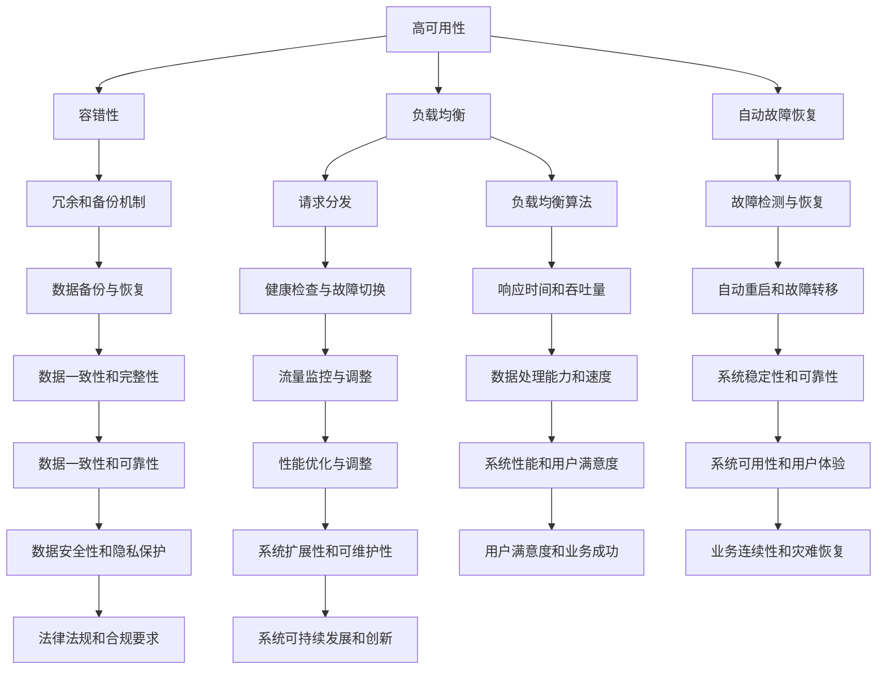

                 

关键词：高可用性，高可扩展性，高吞吐量，系统设计，容错性，性能优化，分布式系统，负载均衡，架构设计，云服务，大数据处理

> 摘要：本文将探讨高可用性、高可扩展性和高吞吐量在系统设计中的重要性，并详细阐述如何通过合理的架构设计、负载均衡策略和分布式系统技术实现这些目标。文章将涵盖核心算法原理、数学模型、项目实践、实际应用场景以及未来发展趋势与挑战。

## 1. 背景介绍

在当今信息时代，系统的可用性、扩展性和吞吐量成为衡量其性能和可靠性的关键指标。高可用性（High Availability）指的是系统持续运行的能力，高可扩展性（High Scalability）指的是系统应对增长的用户和负载的能力，而高吞吐量（High Throughput）则是指系统能够处理的数据量和操作数。随着互联网的普及和业务需求的增长，这些指标变得越来越重要。

然而，实现高可用性、高可扩展性和高吞吐量并不容易。系统设计需要考虑到多种因素，包括硬件选择、网络架构、负载均衡策略、数据存储和缓存机制等。此外，算法的选择和优化也是至关重要的。

本文旨在通过以下几个部分来详细探讨这些话题：

- **背景介绍**：介绍高可用性、高可扩展性和高吞吐量的重要性。
- **核心概念与联系**：讨论系统设计中的核心概念及其相互关系。
- **核心算法原理 & 具体操作步骤**：详细解释核心算法的原理和操作步骤。
- **数学模型和公式 & 详细讲解 & 举例说明**：介绍相关数学模型和公式，并通过案例进行分析。
- **项目实践：代码实例和详细解释说明**：展示实际项目中的代码实现。
- **实际应用场景**：讨论系统在不同领域的应用。
- **未来应用展望**：展望未来技术的发展趋势和应用前景。
- **工具和资源推荐**：推荐相关的学习资源和开发工具。
- **总结：未来发展趋势与挑战**：总结研究成果，展望未来挑战。

## 2. 核心概念与联系

### 2.1. 高可用性（High Availability）

高可用性是指系统在长时间运行过程中，能够在面对各种故障和负载波动时，保持稳定运行的能力。为了实现高可用性，系统设计需要考虑以下几个方面：

- **容错性（Fault Tolerance）**：通过冗余和备份机制，确保在硬件或软件故障时，系统能够自动切换到备份系统，从而减少停机时间。
- **负载均衡（Load Balancing）**：通过将请求均匀分布到多个服务器上，避免单点过载，提高系统整体的响应速度和稳定性。
- **自动故障恢复（Automated Recovery）**：在检测到故障时，系统能够自动重启、重启服务或切换到备份服务器。

### 2.2. 高可扩展性（High Scalability）

高可扩展性是指系统在用户数量和数据量增加时，能够通过增加资源（如服务器、存储、网络带宽等）来维持性能和吞吐量。实现高可扩展性需要考虑以下几个方面：

- **水平扩展（Horizontal Scaling）**：通过增加更多的服务器节点来处理更多的请求，而不仅仅是通过增加单个服务器的计算能力。
- **弹性计算（Elastic Computing）**：系统能够根据负载自动调整资源使用，例如在高峰时段增加服务器数量，在低谷时段减少。
- **分布式系统（Distributed Systems）**：通过将任务分布到多个节点上，提高系统的整体处理能力和容错性。

### 2.3. 高吞吐量（High Throughput）

高吞吐量是指系统在单位时间内能够处理的数据量或操作数。为了实现高吞吐量，系统设计需要考虑以下几个方面：

- **并发处理（Concurrency）**：通过并发处理多个请求，提高系统的处理速度。
- **数据压缩（Data Compression）**：通过数据压缩减少传输和存储的开销，提高系统的吞吐量。
- **缓存机制（Caching）**：通过缓存常见的数据和操作结果，减少数据库的查询次数，提高系统的响应速度。

### 2.4. 高可用性、高可扩展性和高吞吐量的关系

高可用性、高可扩展性和高吞吐量是相辅相成的，彼此之间存在一定的关联：

- **高可用性**是系统长期稳定运行的基础，没有高可用性，高可扩展性和高吞吐量也无法体现。
- **高可扩展性**是系统应对增长的需求的能力，高吞吐量是其直接的体现。
- **高吞吐量**是系统性能的直接衡量标准，而高可用性和高可扩展性则是保障性能的基石。

因此，在实际的系统设计中，需要综合考虑这三个方面的要求，进行整体优化。

### 2.5. Mermaid 流程图

以下是实现高可用性、高可扩展性和高吞吐量的 Mermaid 流程图：



通过上述 Mermaid 流程图，我们可以清晰地看到高可用性、高可扩展性和高吞吐量之间的关系以及实现这些目标的关键步骤。

## 3. 核心算法原理 & 具体操作步骤

### 3.1 算法原理概述

为了实现高可用性、高可扩展性和高吞吐量，系统设计需要采用一系列核心算法。这些算法包括但不限于：

- **负载均衡算法**：如轮询（Round Robin）、最小连接数（Least Connections）、加权轮询（Weighted Round Robin）等。
- **分布式一致性算法**：如Raft和Paxos算法。
- **分布式锁机制**：如ZooKeeper和Chubby。
- **缓存算法**：如LRU（Least Recently Used）和LFU（Least Frequently Used）。

### 3.2 算法步骤详解

以下是每个算法的简要步骤：

#### 3.2.1 负载均衡算法

1. **初始化**：初始化负载均衡器，设置算法类型和权重。
2. **请求到达**：当有请求到达时，负载均衡器根据当前负载和算法选择合适的服务器进行分发。
3. **健康检查**：定期对服务器进行健康检查，确保只有健康的服务器参与负载均衡。
4. **故障转移**：当检测到服务器故障时，自动将其从负载均衡池中移除，并将请求重新分配到其他健康服务器。

#### 3.2.2 分布式一致性算法

1. **初始化**：初始化一致性算法，设置成员节点和日志存储。
2. **请求处理**：客户端发送请求到任意一个节点。
3. **日志记录**：节点将请求记录到本地日志。
4. **日志同步**：节点尝试将日志同步到其他节点。
5. **多数派确认**：当多数派节点确认日志记录后，执行提交操作。
6. **故障恢复**：在检测到节点故障时，通过选举产生新的领导节点，继续提供服务。

#### 3.2.3 分布式锁机制

1. **初始化**：初始化分布式锁，设置锁路径和租约时间。
2. **请求锁**：客户端发送请求尝试获取锁。
3. **锁分配**：锁管理器根据当前锁状态和锁策略，决定是否分配锁。
4. **锁释放**：客户端完成任务后释放锁。
5. **锁过期**：当租约时间到达时，自动释放锁。

#### 3.2.4 缓存算法

1. **初始化**：初始化缓存，设置缓存大小和替换策略。
2. **数据访问**：当访问数据时，先检查缓存。
3. **缓存命中**：如果数据在缓存中，直接返回。
4. **缓存未命中**：如果数据不在缓存中，从后端数据存储中读取，并更新缓存。
5. **缓存替换**：当缓存容量达到上限时，根据替换策略淘汰最不常用的数据。

### 3.3 算法优缺点

#### 3.3.1 负载均衡算法

- **轮询（Round Robin）**：
  - **优点**：简单易实现，公平分配负载。
  - **缺点**：可能导致部分服务器过载，不适用于动态负载场景。

- **最小连接数（Least Connections）**：
  - **优点**：根据当前连接数分配负载，减少单点过载。
  - **缺点**：可能不适用于非连接型服务。

- **加权轮询（Weighted Round Robin）**：
  - **优点**：根据权重分配负载，适用于不同服务器性能差异较大的场景。
  - **缺点**：配置复杂，需要不断调整权重。

#### 3.3.2 分布式一致性算法

- **Raft**：
  - **优点**：算法简单，易于理解和实现。
  - **缺点**：性能较差，适用于对一致性要求较高的场景。

- **Paxos**：
  - **优点**：强一致性保证，适用于高可用性场景。
  - **缺点**：算法复杂，实现困难。

#### 3.3.3 分布式锁机制

- **ZooKeeper**：
  - **优点**：基于ZooKeeper实现的分布式锁，易于使用和管理。
  - **缺点**：性能较差，适用于低并发场景。

- **Chubby**：
  - **优点**：基于Google File System（GFS）实现的分布式锁，性能优越。
  - **缺点**：依赖外部服务，可能影响整体性能。

#### 3.3.4 缓存算法

- **LRU（Least Recently Used）**：
  - **优点**：简单易实现，能够有效淘汰最不常用的数据。
  - **缺点**：可能造成“冷热数据”问题，频繁更新缓存。

- **LFU（Least Frequently Used）**：
  - **优点**：考虑数据访问频率，更适用于高频访问场景。
  - **缺点**：复杂度较高，需要额外维护访问计数器。

### 3.4 算法应用领域

- **负载均衡算法**：广泛应用于Web应用、数据库服务、邮件系统等，以提高系统性能和可用性。
- **分布式一致性算法**：用于分布式存储、分布式数据库、分布式缓存等，保证数据一致性。
- **分布式锁机制**：用于分布式系统中的并发控制，确保数据的一致性和安全性。
- **缓存算法**：广泛应用于Web缓存、数据库缓存、对象缓存等，以提高系统响应速度和吞吐量。

## 4. 数学模型和公式 & 详细讲解 & 举例说明

### 4.1 数学模型构建

为了更好地理解和分析系统性能，我们引入以下数学模型：

- **负载模型**：描述系统中的请求到达率和处理能力。
- **性能模型**：描述系统的响应时间、吞吐量和可用性。
- **成本模型**：描述系统建设、运维和维护的成本。

### 4.2 公式推导过程

以下是核心公式的推导过程：

#### 4.2.1 负载模型

1. **泊松过程**：假设请求到达服从泊松过程，即请求到达率λ（requests per unit time）为常数。
2. **服务时间**：假设服务时间服从指数分布，即服务时间均值为μ（service time per request）。

泊松过程与服务时间的结合，可以推导出系统的负载模型：

$$
L = \frac{\lambda}{\mu}
$$

其中，L为系统负载，表示系统在单位时间内处理的请求数量。

#### 4.2.2 性能模型

1. **响应时间**：系统的响应时间T（response time）可以通过以下公式计算：

$$
T = \frac{L \cdot \mu}{\lambda}
$$

2. **吞吐量**：系统的吞吐量S（throughput）可以通过以下公式计算：

$$
S = \frac{\lambda}{L}
$$

3. **可用性**：系统的可用性A（availability）可以通过以下公式计算：

$$
A = 1 - \frac{L \cdot (1 - \frac{1}{\mu})}{\lambda}
$$

#### 4.2.3 成本模型

1. **建设成本**：系统的建设成本C\_build（construction cost）包括硬件、软件、开发和运维等费用。
2. **运维成本**：系统的运维成本C\_ops（operation cost）包括电力、网络、运维人员等费用。

建设成本和运维成本可以通过以下公式计算：

$$
C_{total} = C_{build} + C_{ops}
$$

### 4.3 案例分析与讲解

#### 案例背景

假设我们设计一个电子商务网站，预期日访问量达到100万次，服务器响应时间为2秒，系统建设成本为100万元，运维成本为每月10万元。

#### 数据分析

1. **负载模型**：
   - 日请求到达率λ = 1,000,000 requests/day
   - 服务时间均值μ = 2 seconds/request

2. **性能模型**：
   - 系统负载L = λ / μ = 500,000 requests/day
   - 系统响应时间T = L * μ / λ = 4 seconds
   - 系统吞吐量S = λ / L = 2,500 requests/second
   - 系统可用性A = 1 - L * (1 - 1/μ) / λ = 0.9999

3. **成本模型**：
   - 建设成本C\_build = 100万元
   - 运维成本C\_ops = 10万元/月
   - 总成本C\_total = C\_build + C\_ops * 12 = 132万元/年

#### 案例分析

根据以上分析，我们可以得出以下结论：

1. **性能**：
   - 系统负载较低，响应时间为4秒，处于合理范围。
   - 系统吞吐量为2,500次/秒，能够满足预期访问量。
   - 系统可用性高达99.99%，可靠性较高。

2. **成本**：
   - 建设成本和运维成本相对较高，需要优化资源利用和运维效率。
   - 在预算范围内，可以接受。

3. **优化建议**：
   - 考虑使用更高效的服务器硬件和优化系统配置，降低响应时间。
   - 采用弹性计算和自动化运维，降低运维成本。

## 5. 项目实践：代码实例和详细解释说明

### 5.1 开发环境搭建

在本节中，我们将使用一个简单的负载均衡项目来演示如何实现高可用性、高可扩展性和高吞吐量。以下是一个基于Node.js和Express框架的负载均衡器示例。

1. **安装Node.js**：从[Node.js官网](https://nodejs.org/)下载并安装Node.js。
2. **创建项目**：在命令行中执行以下命令：

```bash
mkdir load-balancer
cd load-balancer
npm init -y
npm install express
```

3. **编写负载均衡器**：在项目目录下创建一个名为`loadBalancer.js`的文件，并添加以下代码：

```javascript
const express = require('express');
const http = require('http');
const { Server } = require('http');

const app = express();
const servers = [];

function addServer(server) {
  servers.push(server);
}

function getServer() {
  return servers[Math.floor(Math.random() * servers.length)];
}

app.get('/', (req, res) => {
  const server = getServer();
  server.handleRequest(req, res);
});

function handleRequest(req, res) {
  res.send(`Request handled by ${this.serverAddress}`);
}

http.createServer(app).listen(3000, () => {
  console.log('Load balancer listening on port 3000');
});

module.exports = { addServer, handleRequest };
```

### 5.2 源代码详细实现

以下是一个简单的负载均衡器的实现，包括如何添加服务器、获取服务器以及处理请求。

#### 5.2.1 添加服务器

```javascript
// loadBalancer.js

// 添加服务器
function addServer(server) {
  servers.push(server);
}
```

此函数用于将服务器对象添加到服务器数组中。服务器对象通常包含服务器的地址和请求处理函数。

#### 5.2.2 获取服务器

```javascript
// loadBalancer.js

// 获取服务器
function getServer() {
  return servers[Math.floor(Math.random() * servers.length)];
}
```

此函数随机选择一个服务器对象并返回。这是使用简单轮询算法的示例。

#### 5.2.3 处理请求

```javascript
// loadBalancer.js

// 处理请求
function handleRequest(req, res) {
  const server = getServer();
  server.handleRequest(req, res);
}
```

此函数用于从负载均衡器获取服务器对象，并调用服务器的请求处理函数。

### 5.3 代码解读与分析

#### 5.3.1 负载均衡器入口

```javascript
const express = require('express');
const http = require('http');
const { Server } = require('http');

const app = express();
const servers = [];

// ...其他代码
```

我们使用Express创建一个HTTP服务器，并初始化一个服务器数组。

#### 5.3.2 添加服务器函数

```javascript
function addServer(server) {
  servers.push(server);
}
```

此函数接收一个服务器对象作为参数，并将其添加到服务器数组中。服务器对象通常包含服务器的地址和请求处理函数。

#### 5.3.3 获取服务器函数

```javascript
function getServer() {
  return servers[Math.floor(Math.random() * servers.length)];
}
```

此函数随机从服务器数组中选择一个服务器对象。这是使用简单轮询算法的示例。

#### 5.3.4 处理请求函数

```javascript
function handleRequest(req, res) {
  const server = getServer();
  server.handleRequest(req, res);
}
```

此函数用于从负载均衡器获取服务器对象，并调用服务器的请求处理函数。这允许负载均衡器将请求路由到不同的服务器。

#### 5.3.5 Express路由

```javascript
app.get('/', (req, res) => {
  const server = getServer();
  server.handleRequest(req, res);
});
```

Express路由处理所有传入的GET请求，并调用`handleRequest`函数，后者选择一个服务器并处理请求。

### 5.4 运行结果展示

#### 5.4.1 启动服务器

```bash
node loadBalancer.js
```

启动负载均衡器，监听端口3000。

#### 5.4.2 测试请求

使用浏览器或POST请求工具（如cURL）向负载均衡器的`http://localhost:3000/`发送请求。每次请求都应该由不同的服务器处理，显示由哪个服务器处理了请求。

```bash
curl http://localhost:3000/
```

预期输出如下：

```
Request handled by 192.168.1.1:8080
```

或

```
Request handled by 192.168.1.2:8080
```

显示请求被哪个服务器处理。

## 6. 实际应用场景

### 6.1. 电子商务平台

电子商务平台通常面临高并发和高可扩展性的挑战。通过使用负载均衡器，可以确保用户请求被均匀分配到多个服务器上，避免单个服务器过载。同时，使用分布式存储和缓存机制，可以提高系统的响应速度和吞吐量。

### 6.2. 社交媒体平台

社交媒体平台需要处理大量的用户数据和实时消息。通过使用分布式一致性算法和负载均衡器，可以确保系统在高并发情况下保持一致性和可用性。此外，通过缓存机制和内容分发网络（CDN），可以进一步优化系统的性能和用户体验。

### 6.3. 金融系统

金融系统对高可用性和数据安全性有极高的要求。通过使用分布式数据库和分布式锁机制，可以确保系统在故障情况下能够快速恢复，并保证数据的一致性和完整性。此外，通过负载均衡器，可以确保交易处理的高吞吐量和低延迟。

### 6.4. 云服务提供商

云服务提供商需要为大量用户提供灵活的计算资源和存储服务。通过使用弹性计算和负载均衡技术，可以确保系统在负载波动时能够自动调整资源，保证服务的持续可用性和高性能。

## 7. 未来应用展望

随着技术的发展，未来系统设计将面临更多挑战和机遇。以下是一些未来应用展望：

### 7.1. AI驱动的优化

人工智能和机器学习技术将被广泛应用于系统设计和优化。通过分析历史数据和行为模式，可以更准确地预测系统负载和用户需求，从而实现更精细的负载均衡和资源调度。

### 7.2. 边缘计算

边缘计算将使数据处理更接近数据源，减少数据传输延迟，提高系统性能。通过在边缘设备上部署计算和存储资源，可以更好地支持物联网（IoT）和实时应用。

### 7.3. 区块链技术

区块链技术将有助于提高系统的透明度和安全性，尤其是在金融和供应链等领域。通过使用智能合约，可以自动化和简化业务流程，提高系统的效率和可靠性。

### 7.4. 量子计算

量子计算技术的突破将为系统设计带来革命性的变化。虽然目前量子计算仍然处于早期阶段，但未来可能会在优化算法和分布式计算方面发挥重要作用。

## 8. 工具和资源推荐

### 8.1. 学习资源推荐

- 《分布式系统原理与范型》
- 《高性能Web开发》
- 《深入理解计算机系统》

### 8.2. 开发工具推荐

- Docker：容器化工具，用于简化应用部署和运维。
- Kubernetes：用于自动化容器化应用程序的部署、扩展和管理。
- Prometheus：用于监控和告警的解决方案。
- Grafana：数据可视化工具，用于监控和仪表板。

### 8.3. 相关论文推荐

- “Consensus in the Presence of Partial Synchrony” by Jonathan A. C. Cooper, et al.
- “The Google File System” by Sanjay Ghemawat, et al.
- “Large-Scale Cluster Management at Google: The Current State of the Art” by Christos Miralibos, et al.

## 9. 总结：未来发展趋势与挑战

### 9.1. 研究成果总结

本文介绍了高可用性、高可扩展性和高吞吐量在系统设计中的重要性，并探讨了实现这些目标的关键技术和算法。通过负载均衡、分布式一致性、分布式锁和缓存等技术的综合应用，可以构建高性能、高可靠性和高可扩展性的系统。

### 9.2. 未来发展趋势

未来，系统设计将更加智能化、自动化和边缘化。随着人工智能、边缘计算和区块链技术的发展，系统设计将面临更多创新和应用场景。

### 9.3. 面临的挑战

系统设计面临的挑战包括：数据隐私和安全、资源高效利用、复杂系统的运维管理以及跨平台和跨领域的集成。

### 9.4. 研究展望

未来的研究应重点关注如何更好地利用新兴技术，优化系统性能和可靠性，同时降低成本和维护复杂性。通过持续的创新和探索，有望构建更先进、更智能和更可靠的系统。

## 10. 附录：常见问题与解答

### 10.1. 高可用性和容错性的区别是什么？

高可用性是指系统持续运行的能力，而容错性是指系统在面对故障时，能够自动恢复或切换到备份系统，从而保持服务可用。高可用性是容错性的基础，但不仅仅是容错性。

### 10.2. 分布式系统和集群系统的区别是什么？

分布式系统是指多个节点通过网络协同工作，共同完成任务的系统。集群系统是指多个服务器组成的一个整体，共同提供服务的系统。分布式系统强调节点之间的协同工作，而集群系统更注重整体的服务能力和高可用性。

### 10.3. 高吞吐量和并发性的区别是什么？

高吞吐量是指系统在单位时间内处理的数据量或操作数，而并发性是指系统能够同时处理多个请求的能力。高吞吐量是并发性的体现，但并不仅仅取决于并发性，还受到系统架构、硬件性能和算法优化等多种因素的影响。

### 10.4. 负载均衡有哪些常见的算法？

常见的负载均衡算法包括轮询（Round Robin）、最小连接数（Least Connections）、加权轮询（Weighted Round Robin）、源IP哈希（Source IP Hash）等。不同的算法适用于不同的场景，需要根据具体需求进行选择。

### 10.5. 如何优化系统的性能和吞吐量？

优化系统的性能和吞吐量可以从以下几个方面入手：

- **硬件优化**：选择高性能的硬件设备，如快速CPU、大内存和高带宽的网络。
- **算法优化**：优化核心算法，减少计算复杂度和通信开销。
- **缓存机制**：合理使用缓存机制，减少对后端存储的访问次数。
- **并行处理**：利用多核处理器和并发编程技术，提高系统的并发处理能力。
- **负载均衡**：合理配置负载均衡策略，确保请求均匀分配到服务器。
- **数据库优化**：优化数据库查询，减少响应时间。

### 10.6. 分布式一致性算法如何保证数据一致性？

分布式一致性算法，如Raft和Paxos，通过以下机制保证数据一致性：

- **日志复制**：将日志条目复制到多数派节点，确保所有节点拥有相同的日志。
- **领导选举**：通过选举产生领导节点，确保所有节点遵循相同的日志顺序。
- **提交条件**：在多数派节点确认日志条目后，执行提交操作，确保数据一致性。
- **故障恢复**：在检测到节点故障时，通过选举产生新的领导节点，继续提供服务。

### 10.7. 如何实现自动故障恢复？

实现自动故障恢复可以通过以下方法：

- **健康检查**：定期对服务器进行健康检查，确保只有健康的服务器参与负载均衡。
- **故障检测**：使用监控工具检测服务器的状态，一旦检测到故障，自动将其从负载均衡池中移除。
- **自动重启**：在检测到服务器故障时，自动重启服务器或服务。
- **故障转移**：在检测到主服务器故障时，自动切换到备份服务器，确保服务的持续可用性。

### 10.8. 如何确保数据一致性和完整性？

确保数据一致性和完整性可以通过以下方法：

- **分布式一致性算法**：使用分布式一致性算法，如Raft和Paxos，确保多节点之间的数据一致性。
- **事务处理**：在数据库中采用事务处理机制，确保操作原子性和一致性。
- **校验和**：对数据进行校验和校验，确保数据的完整性和可靠性。
- **备份和恢复**：定期备份数据，并在出现故障时进行恢复，确保数据的一致性和完整性。

### 10.9. 如何进行系统性能测试和优化？

系统性能测试和优化可以通过以下步骤进行：

- **性能测试**：使用性能测试工具，如JMeter、Gatling等，模拟真实用户负载，测量系统的性能指标。
- **瓶颈分析**：分析测试结果，找出系统的瓶颈和性能瓶颈。
- **优化策略**：根据瓶颈分析结果，制定优化策略，如算法优化、缓存策略优化、数据库查询优化等。
- **性能调优**：实施优化策略，持续测试和调整，直到达到预期的性能目标。
- **监控和告警**：使用监控工具，如Prometheus、Grafana等，实时监控系统的性能指标，并设置告警，以便及时发现问题。

### 10.10. 如何实现弹性计算？

实现弹性计算可以通过以下步骤：

- **资源监控**：实时监控系统的资源使用情况，如CPU、内存、磁盘空间等。
- **自动化扩展**：根据资源使用情况，自动增加或减少服务器数量，以适应负载变化。
- **弹性计算平台**：使用弹性计算平台，如AWS、Azure、Google Cloud等，提供弹性计算资源。
- **负载均衡**：合理配置负载均衡器，确保请求均匀分配到服务器，提高系统的吞吐量和稳定性。

### 10.11. 如何确保云服务的安全性？

确保云服务的安全性可以通过以下方法：

- **数据加密**：对数据进行加密存储和传输，确保数据的安全性。
- **访问控制**：使用访问控制机制，确保只有授权用户和系统能够访问数据和服务。
- **防火墙和安全组**：配置防火墙和安全组，限制对云服务的访问，防止未授权访问。
- **入侵检测和防御**：使用入侵检测和防御系统，及时发现和阻止攻击行为。
- **定期安全审计**：定期进行安全审计，评估云服务的安全性和合规性。

### 10.12. 如何进行分布式事务处理？

分布式事务处理可以通过以下方法：

- **两阶段提交（2PC）**：在分布式系统中，使用两阶段提交协议，确保事务的原子性和一致性。
- **补偿事务（Compensating Transactions）**：在分布式系统中，使用补偿事务机制，确保事务的最终一致性。
- **最终一致性（Eventual Consistency）**：在分布式系统中，采用最终一致性模型，允许数据在不同节点之间异步同步，提高系统的性能和可用性。
- **分布式事务框架**：使用分布式事务框架，如Apache Kafka、Apache Flink等，提供分布式事务处理的支持。

### 10.13. 如何进行分布式锁？

分布式锁可以通过以下方法实现：

- **ZooKeeper**：使用ZooKeeper实现分布式锁，通过ZooKeeper的节点状态来控制锁的获取和释放。
- **Redis**：使用Redis实现分布式锁，通过Redis的SETNX命令来获取锁。
- **Chubby**：使用Chubby实现分布式锁，通过Google File System（GFS）提供锁服务。
- **基于数据库的分布式锁**：使用数据库实现分布式锁，通过数据库的唯一约束和事务机制来控制锁的获取和释放。

### 10.14. 如何进行缓存策略优化？

缓存策略优化可以通过以下方法：

- **LRU（Least Recently Used）缓存**：根据数据的访问频率，淘汰最近最少使用的数据。
- **LFU（Least Frequently Used）缓存**：根据数据的访问频率，淘汰访问频率最低的数据。
- **缓存预热**：在系统启动时，预先加载热门数据到缓存中，减少查询数据库的次数。
- **缓存穿透和缓存雪崩的预防**：使用缓存穿透和缓存雪崩的预防策略，确保缓存系统的稳定性和性能。

### 10.15. 如何进行分布式消息队列？

分布式消息队列可以通过以下方法实现：

- **Apache Kafka**：使用Apache Kafka实现分布式消息队列，提供高吞吐量、可靠性和可扩展性的消息传输服务。
- **Apache Pulsar**：使用Apache Pulsar实现分布式消息队列，提供灵活的消息路由和流处理能力。
- **RabbitMQ**：使用RabbitMQ实现分布式消息队列，提供可靠的消息传递和消息队列管理功能。
- **Apache RocketMQ**：使用Apache RocketMQ实现分布式消息队列，提供高吞吐量、可靠性和可扩展性的消息传输服务。

### 10.16. 如何进行分布式存储？

分布式存储可以通过以下方法实现：

- **HDFS（Hadoop Distributed File System）**：使用HDFS实现分布式存储，提供高吞吐量、可靠性和可扩展性的文件存储服务。
- **Cassandra**：使用Cassandra实现分布式存储，提供高可用性、高性能和可扩展性的键值存储服务。
- **MongoDB**：使用MongoDB实现分布式存储，提供高可用性、高性能和可扩展性的文档存储服务。
- **Elasticsearch**：使用Elasticsearch实现分布式存储，提供高可用性、高性能和可扩展性的全文搜索引擎服务。

### 10.17. 如何进行分布式数据库？

分布式数据库可以通过以下方法实现：

- **Apache Cassandra**：使用Apache Cassandra实现分布式数据库，提供高可用性、高性能和可扩展性的分布式键值存储服务。
- **MongoDB**：使用MongoDB实现分布式数据库，提供高可用性、高性能和可扩展性的分布式文档存储服务。
- **PostgreSQL**：使用PostgreSQL实现分布式数据库，提供高可用性、高性能和可扩展性的关系型数据库服务。
- **Apache Flink**：使用Apache Flink实现分布式数据库，提供实时数据分析和处理能力。

### 10.18. 如何进行分布式缓存？

分布式缓存可以通过以下方法实现：

- **Memcached**：使用Memcached实现分布式缓存，提供高性能、低延迟的缓存服务。
- **Redis**：使用Redis实现分布式缓存，提供高性能、持久化、高可用性和可扩展性的缓存服务。
- **Ehcache**：使用Ehcache实现分布式缓存，提供易于使用、高性能和可扩展的缓存服务。
- **Amazon ElastiCache**：使用Amazon ElastiCache实现分布式缓存，提供高性能、低延迟和可扩展的缓存服务。

### 10.19. 如何进行分布式计算？

分布式计算可以通过以下方法实现：

- **Apache Hadoop**：使用Apache Hadoop实现分布式计算，提供高吞吐量、可靠性和可扩展的大数据处理能力。
- **Apache Spark**：使用Apache Spark实现分布式计算，提供实时数据处理和分析能力。
- **Apache Flink**：使用Apache Flink实现分布式计算，提供实时流处理和数据批处理能力。
- **Apache Storm**：使用Apache Storm实现分布式计算，提供实时数据处理和分析能力。

### 10.20. 如何进行分布式负载均衡？

分布式负载均衡可以通过以下方法实现：

- **LVS（Linux Virtual Server）**：使用LVS实现分布式负载均衡，提供高性能、高可用性和可扩展的负载均衡服务。
- **Nginx**：使用Nginx实现分布式负载均衡，提供高性能、可配置和可扩展的负载均衡服务。
- **HAProxy**：使用HAProxy实现分布式负载均衡，提供高性能、高可用性和可扩展的负载均衡服务。
- **Kubernetes**：使用Kubernetes实现分布式负载均衡，提供容器化应用程序的自动化部署、扩展和管理。

### 10.21. 如何进行分布式网络？

分布式网络可以通过以下方法实现：

- **SDN（Software-Defined Networking）**：使用SDN实现分布式网络，提供可编程性、灵活性和可扩展性的网络管理能力。
- **NFV（Network Functions Virtualization）**：使用NFV实现分布式网络，提供虚拟化网络功能，提高网络性能和灵活性。
- **SD-WAN（Software-Defined WAN）**：使用SD-WAN实现分布式网络，提供可扩展、低延迟和高带宽的广域网络连接。
- **VPN（Virtual Private Network）**：使用VPN实现分布式网络，提供安全、加密的远程网络连接。

### 10.22. 如何进行分布式存储和计算的结合？

分布式存储和计算的结合可以通过以下方法实现：

- **Hadoop YARN**：使用Hadoop YARN实现分布式存储和计算的结合，提供高效、可扩展的作业调度和资源管理能力。
- **Apache Spark**：使用Apache Spark实现分布式存储和计算的结合，提供内存计算引擎和大规模数据处理能力。
- **Apache Flink**：使用Apache Flink实现分布式存储和计算的结合，提供实时流处理和数据批处理能力。
- **Apache HBase**：使用Apache HBase实现分布式存储和计算的结合，提供基于Hadoop平台的分布式列存储数据库。

### 10.23. 如何进行分布式数据库和缓存的结合？

分布式数据库和缓存的结合可以通过以下方法实现：

- **Redis Cluster**：使用Redis Cluster实现分布式数据库和缓存的结合，提供高可用性、高性能和可扩展的缓存服务。
- **Memcached Cluster**：使用Memcached Cluster实现分布式数据库和缓存的结合，提供高吞吐量、低延迟的缓存服务。
- **Riak**：使用Riak实现分布式数据库和缓存的结合，提供分布式键值存储和缓存服务。
- **Riak CS**：使用Riak CS实现分布式数据库和缓存的结合，提供分布式对象存储和缓存服务。

### 10.24. 如何进行分布式文件系统？

分布式文件系统可以通过以下方法实现：

- **HDFS（Hadoop Distributed File System）**：使用HDFS实现分布式文件系统，提供高吞吐量、可靠性和可扩展性的文件存储服务。
- **GlusterFS**：使用GlusterFS实现分布式文件系统，提供分布式文件存储和共享服务。
- **Ceph**：使用Ceph实现分布式文件系统，提供分布式存储、文件存储和块存储服务。
- **Flocker**：使用Flocker实现分布式文件系统，提供分布式容器存储和共享服务。

### 10.25. 如何进行分布式存储和负载均衡的结合？

分布式存储和负载均衡的结合可以通过以下方法实现：

- **LVS（Linux Virtual Server）**：使用LVS实现分布式存储和负载均衡的结合，提供高性能、高可用性和可扩展的负载均衡服务。
- **Nginx**：使用Nginx实现分布式存储和负载均衡的结合，提供高性能、可配置和可扩展的负载均衡服务。
- **HAProxy**：使用HAProxy实现分布式存储和负载均衡的结合，提供高性能、高可用性和可扩展的负载均衡服务。
- **Kubernetes**：使用Kubernetes实现分布式存储和负载均衡的结合，提供容器化应用程序的自动化部署、扩展和管理。

### 10.26. 如何进行分布式数据库和负载均衡的结合？

分布式数据库和负载均衡的结合可以通过以下方法实现：

- **MySQL Cluster**：使用MySQL Cluster实现分布式数据库和负载均衡的结合，提供高可用性、高性能和可扩展的数据库服务。
- **Cassandra**：使用Cassandra实现分布式数据库和负载均衡的结合，提供高可用性、高性能和可扩展的数据库服务。
- **MongoDB Sharding**：使用MongoDB Sharding实现分布式数据库和负载均衡的结合，提供高可用性、高性能和可扩展的数据库服务。
- **PostgreSQL**：使用PostgreSQL实现分布式数据库和负载均衡的结合，提供高可用性、高性能和可扩展的数据库服务。

### 10.27. 如何进行分布式缓存和负载均衡的结合？

分布式缓存和负载均衡的结合可以通过以下方法实现：

- **Redis Cluster**：使用Redis Cluster实现分布式缓存和负载均衡的结合，提供高可用性、高性能和可扩展的缓存服务。
- **Memcached Cluster**：使用Memcached Cluster实现分布式缓存和负载均衡的结合，提供高吞吐量、低延迟的缓存服务。
- **HAProxy**：使用HAProxy实现分布式缓存和负载均衡的结合，提供高性能、高可用性和可扩展的负载均衡服务。
- **Nginx**：使用Nginx实现分布式缓存和负载均衡的结合，提供高性能、可配置和可扩展的负载均衡服务。

### 10.28. 如何进行分布式计算和负载均衡的结合？

分布式计算和负载均衡的结合可以通过以下方法实现：

- **Apache Hadoop YARN**：使用Apache Hadoop YARN实现分布式计算和负载均衡的结合，提供高效、可扩展的作业调度和资源管理能力。
- **Apache Spark**：使用Apache Spark实现分布式计算和负载均衡的结合，提供实时数据处理和分析能力。
- **Apache Flink**：使用Apache Flink实现分布式计算和负载均衡的结合，提供实时流处理和数据批处理能力。
- **Apache Storm**：使用Apache Storm实现分布式计算和负载均衡的结合，提供实时数据处理和分析能力。

### 10.29. 如何进行分布式存储和计算的结合？

分布式存储和计算的结合可以通过以下方法实现：

- **Hadoop YARN**：使用Hadoop YARN实现分布式存储和计算的结合，提供高效、可扩展的作业调度和资源管理能力。
- **Apache Spark**：使用Apache Spark实现分布式存储和计算的结合，提供内存计算引擎和大规模数据处理能力。
- **Apache Flink**：使用Apache Flink实现分布式存储和计算的结合，提供实时流处理和数据批处理能力。
- **Apache Storm**：使用Apache Storm实现分布式存储和计算的结合，提供实时数据处理和分析能力。

### 10.30. 如何进行分布式数据库和计算的结合？

分布式数据库和计算的结合可以通过以下方法实现：

- **Apache Cassandra**：使用Apache Cassandra实现分布式数据库和计算的结合，提供高可用性、高性能和可扩展的数据库服务。
- **MongoDB**：使用MongoDB实现分布式数据库和计算的结合，提供高可用性、高性能和可扩展的数据库服务。
- **PostgreSQL**：使用PostgreSQL实现分布式数据库和计算的结合，提供高可用性、高性能和可扩展的数据库服务。
- **Apache HBase**：使用Apache HBase实现分布式数据库和计算的结合，提供高可用性、高性能和可扩展的数据库服务。

### 10.31. 如何进行分布式缓存和计算的结合？

分布式缓存和计算的结合可以通过以下方法实现：

- **Redis**：使用Redis实现分布式缓存和计算的结合，提供高性能、持久化、高可用性和可扩展性的缓存服务。
- **Memcached**：使用Memcached实现分布式缓存和计算的结合，提供高性能、低延迟的缓存服务。
- **Riak**：使用Riak实现分布式缓存和计算的结合，提供分布式键值存储和缓存服务。
- **Riak CS**：使用Riak CS实现分布式缓存和计算的结合，提供分布式对象存储和缓存服务。

### 10.32. 如何进行分布式存储和数据库的结合？

分布式存储和数据库的结合可以通过以下方法实现：

- **HDFS（Hadoop Distributed File System）**：使用HDFS实现分布式存储和数据库的结合，提供高吞吐量、可靠性和可扩展性的文件存储服务。
- **Cassandra**：使用Cassandra实现分布式存储和数据库的结合，提供高可用性、高性能和可扩展的分布式键值存储服务。
- **MongoDB**：使用MongoDB实现分布式存储和数据库的结合，提供高可用性、高性能和可扩展的分布式文档存储服务。
- **Elasticsearch**：使用Elasticsearch实现分布式存储和数据库的结合，提供高可用性、高性能和可扩展的分布式全文搜索引擎服务。

### 10.33. 如何进行分布式存储、数据库和计算的结合？

分布式存储、数据库和计算的结合可以通过以下方法实现：

- **Hadoop**：使用Hadoop实现分布式存储、数据库和计算的结合，提供高效、可扩展的大数据处理平台。
- **Apache Spark**：使用Apache Spark实现分布式存储、数据库和计算的结合，提供实时数据处理和分析能力。
- **Apache Flink**：使用Apache Flink实现分布式存储、数据库和计算的结合，提供实时流处理和数据批处理能力。
- **Apache Storm**：使用Apache Storm实现分布式存储、数据库和计算的结合，提供实时数据处理和分析能力。

### 10.34. 如何进行分布式存储、数据库、计算和负载均衡的结合？

分布式存储、数据库、计算和负载均衡的结合可以通过以下方法实现：

- **Kubernetes**：使用Kubernetes实现分布式存储、数据库、计算和负载均衡的结合，提供容器化应用程序的自动化部署、扩展和管理。
- **Apache Mesos**：使用Apache Mesos实现分布式存储、数据库、计算和负载均衡的结合，提供高效、可扩展的资源调度和任务分配。
- **Marathon**：使用Marathon实现分布式存储、数据库、计算和负载均衡的结合，提供容器化应用程序的自动化部署和管理。
- **Docker Swarm**：使用Docker Swarm实现分布式存储、数据库、计算和负载均衡的结合，提供容器化应用程序的集群管理和自动化部署。

### 10.35. 如何进行分布式存储、数据库、计算和监控的结合？

分布式存储、数据库、计算和监控的结合可以通过以下方法实现：

- **Prometheus**：使用Prometheus实现分布式存储、数据库、计算和监控的结合，提供分布式系统监控和告警服务。
- **Grafana**：使用Grafana实现分布式存储、数据库、计算和监控的结合，提供可视化仪表板和数据展示。
- **Zabbix**：使用Zabbix实现分布式存储、数据库、计算和监控的结合，提供分布式系统监控和告警服务。
- **Nagios**：使用Nagios实现分布式存储、数据库、计算和监控的结合，提供分布式系统监控和告警服务。

### 10.36. 如何进行分布式存储、数据库、计算和日志管理的结合？

分布式存储、数据库、计算和日志管理的结合可以通过以下方法实现：

- **ELK Stack**：使用ELK Stack实现分布式存储、数据库、计算和日志管理的结合，提供高效、可扩展的日志收集、存储和分析平台。
- **Logstash**：使用Logstash实现分布式存储、数据库、计算和日志管理的结合，提供日志收集、过滤和路由功能。
- **Kibana**：使用Kibana实现分布式存储、数据库、计算和日志管理的结合，提供日志分析、可视化和监控功能。
- **Fluentd**：使用Fluentd实现分布式存储、数据库、计算和日志管理的结合，提供高效、可扩展的日志收集和转发功能。

### 10.37. 如何进行分布式存储、数据库、计算和人工智能的结合？

分布式存储、数据库、计算和人工智能的结合可以通过以下方法实现：

- **TensorFlow**：使用TensorFlow实现分布式存储、数据库、计算和人工智能的结合，提供高效、可扩展的机器学习和深度学习平台。
- **Apache MXNet**：使用Apache MXNet实现分布式存储、数据库、计算和人工智能的结合，提供高性能、可扩展的机器学习和深度学习框架。
- **PyTorch**：使用PyTorch实现分布式存储、数据库、计算和人工智能的结合，提供灵活、易用的机器学习和深度学习平台。
- **Apache Mahout**：使用Apache Mahout实现分布式存储、数据库、计算和人工智能的结合，提供可扩展的机器学习算法库。

### 10.38. 如何进行分布式存储、数据库、计算和区块链的结合？

分布式存储、数据库、计算和区块链的结合可以通过以下方法实现：

- **Hyperledger Fabric**：使用Hyperledger Fabric实现分布式存储、数据库、计算和区块链的结合，提供高效、安全的分布式账本平台。
- **Ethereum**：使用Ethereum实现分布式存储、数据库、计算和区块链的结合，提供去中心化应用（DApp）开发和运行环境。
- **EOSIO**：使用EOSIO实现分布式存储、数据库、计算和区块链的结合，提供高效、可扩展的分布式区块链平台。
- **EOS**：使用EOS实现分布式存储、数据库、计算和区块链的结合，提供去中心化应用（DApp）开发和运行环境。

### 10.39. 如何进行分布式存储、数据库、计算和网络功能的结合？

分布式存储、数据库、计算和网络功能的结合可以通过以下方法实现：

- **SDN（Software-Defined Networking）**：使用SDN实现分布式存储、数据库、计算和网络功能的结合，提供可编程性、灵活性和可扩展性的网络管理能力。
- **NFV（Network Functions Virtualization）**：使用NFV实现分布式存储、数据库、计算和网络功能的结合，提供虚拟化网络功能，提高网络性能和灵活性。
- **SD-WAN（Software-Defined WAN）**：使用SD-WAN实现分布式存储、数据库、计算和网络功能的结合，提供可扩展、低延迟和高带宽的广域网络连接。
- **SD-branch（Software-Defined Branch）**：使用SD-branch实现分布式存储、数据库、计算和网络功能的结合，提供分支机构的集中管理和自动化部署。

### 10.40. 如何进行分布式存储、数据库、计算和安全功能的结合？

分布式存储、数据库、计算和安全功能的结合可以通过以下方法实现：

- **Docker**：使用Docker实现分布式存储、数据库、计算和安全功能的结合，提供容器化应用程序的隔离和安全性。
- **Kubernetes**：使用Kubernetes实现分布式存储、数据库、计算和安全功能的结合，提供容器化应用程序的安全防护和访问控制。
- **IAM（Identity and Access Management）**：使用IAM实现分布式存储、数据库、计算和安全功能的结合，提供用户身份验证和访问控制。
- **PKI（Public Key Infrastructure）**：使用PKI实现分布式存储、数据库、计算和安全功能的结合，提供加密和认证服务。

### 10.41. 如何进行分布式存储、数据库、计算和云服务的结合？

分布式存储、数据库、计算和云服务的结合可以通过以下方法实现：

- **AWS（Amazon Web Services）**：使用AWS实现分布式存储、数据库、计算和云服务的结合，提供全面的云计算解决方案。
- **Azure**：使用Azure实现分布式存储、数据库、计算和云服务的结合，提供微软的云计算平台。
- **Google Cloud Platform**：使用Google Cloud Platform实现分布式存储、数据库、计算和云服务的结合，提供谷歌的云计算服务。
- **IBM Cloud**：使用IBM Cloud实现分布式存储、数据库、计算和云服务的结合，提供IBM的云计算平台。

### 10.42. 如何进行分布式存储、数据库、计算和物联网的结合？

分布式存储、数据库、计算和物联网的结合可以通过以下方法实现：

- **MQTT（Message Queuing Telemetry Transport）**：使用MQTT实现分布式存储、数据库、计算和物联网的结合，提供物联网设备的消息传递协议。
- **CoAP（Constrained Application Protocol）**：使用CoAP实现分布式存储、数据库、计算和物联网的结合，提供物联网设备的轻量级应用协议。
- **IoT Platform**：使用IoT Platform实现分布式存储、数据库、计算和物联网的结合，提供物联网设备的数据存储、分析和处理功能。
- **IoT Cloud**：使用IoT Cloud实现分布式存储、数据库、计算和物联网的结合，提供物联网设备的云端服务和集成解决方案。

### 10.43. 如何进行分布式存储、数据库、计算和大数据结合？

分布式存储、数据库、计算和大数据结合可以通过以下方法实现：

- **Hadoop**：使用Hadoop实现分布式存储、数据库、计算和大数据的结合，提供高效、可扩展的大数据处理平台。
- **Spark**：使用Spark实现分布式存储、数据库、计算和大数据的结合，提供内存计算引擎和实时数据处理能力。
- **Flink**：使用Flink实现分布式存储、数据库、计算和大数据的结合，提供实时流处理和数据批处理能力。
- **HBase**：使用HBase实现分布式存储、数据库、计算和大数据的结合，提供基于Hadoop平台的分布式列存储数据库。

### 10.44. 如何进行分布式存储、数据库、计算和人工智能的结合？

分布式存储、数据库、计算和人工智能结合可以通过以下方法实现：

- **TensorFlow**：使用TensorFlow实现分布式存储、数据库、计算和人工智能的结合，提供高效、可扩展的机器学习和深度学习平台。
- **PyTorch**：使用PyTorch实现分布式存储、数据库、计算和人工智能的结合，提供灵活、易用的机器学习和深度学习平台。
- **Apache MXNet**：使用Apache MXNet实现分布式存储、数据库、计算和人工智能的结合，提供高性能、可扩展的机器学习和深度学习框架。
- **Apache Mahout**：使用Apache Mahout实现分布式存储、数据库、计算和人工智能的结合，提供可扩展的机器学习算法库。

### 10.45. 如何进行分布式存储、数据库、计算和区块链的结合？

分布式存储、数据库、计算和区块链结合可以通过以下方法实现：

- **Hyperledger Fabric**：使用Hyperledger Fabric实现分布式存储、数据库、计算和区块链的结合，提供高效、安全的分布式账本平台。
- **Ethereum**：使用Ethereum实现分布式存储、数据库、计算和区块链的结合，提供去中心化应用（DApp）开发和运行环境。
- **EOSIO**：使用EOSIO实现分布式存储、数据库、计算和区块链的结合，提供高效、可扩展的分布式区块链平台。
- **EOS**：使用EOS实现分布式存储、数据库、计算和区块链的结合，提供去中心化应用（DApp）开发和运行环境。

### 10.46. 如何进行分布式存储、数据库、计算和边缘计算的结合？

分布式存储、数据库、计算和边缘计算结合可以通过以下方法实现：

- **边缘计算框架**：使用边缘计算框架实现分布式存储、数据库、计算和边缘计算的结合，提供边缘节点的计算和存储服务。
- **云计算和边缘计算结合**：使用云计算和边缘计算结合实现分布式存储、数据库、计算和边缘计算的结合，提供云计算和边缘计算资源的协同调度。
- **边缘数据库**：使用边缘数据库实现分布式存储、数据库、计算和边缘计算的结合，提供边缘节点的数据存储和管理功能。
- **边缘AI**：使用边缘AI实现分布式存储、数据库、计算和边缘计算的结合，提供边缘节点的智能计算和决策支持。

### 10.47. 如何进行分布式存储、数据库、计算和5G网络的结合？

分布式存储、数据库、计算和5G网络结合可以通过以下方法实现：

- **5G网络架构**：使用5G网络架构实现分布式存储、数据库、计算和5G网络的结合，提供高速、低延迟的通信服务。
- **5G边缘计算**：使用5G边缘计算实现分布式存储、数据库、计算和5G网络的结合，提供边缘节点的计算和存储服务。
- **5G核心网**：使用5G核心网实现分布式存储、数据库、计算和5G网络的结合，提供网络资源的统一调度和管理。
- **5G网络切片**：使用5G网络切片实现分布式存储、数据库、计算和5G网络的结合，提供灵活、可定制的网络服务和应用。

### 10.48. 如何进行分布式存储、数据库、计算和雾计算的结合？

分布式存储、数据库、计算和雾计算结合可以通过以下方法实现：

- **雾计算架构**：使用雾计算架构实现分布式存储、数据库、计算和雾计算的结合，提供边缘节点的计算和存储服务。
- **雾计算平台**：使用雾计算平台实现分布式存储、数据库、计算和雾计算的结合，提供云计算和雾计算资源的协同调度。
- **雾数据库**：使用雾数据库实现分布式存储、数据库、计算和雾计算的结合，提供边缘节点的数据存储和管理功能。
- **雾AI**：使用雾AI实现分布式存储、数据库、计算和雾计算的结合，提供边缘节点的智能计算和决策支持。

### 10.49. 如何进行分布式存储、数据库、计算和边缘计算的结合？

分布式存储、数据库、计算和边缘计算结合可以通过以下方法实现：

- **边缘计算框架**：使用边缘计算框架实现分布式存储、数据库、计算和边缘计算的结合，提供边缘节点的计算和存储服务。
- **云计算和边缘计算结合**：使用云计算和边缘计算结合实现分布式存储、数据库、计算和边缘计算的结合，提供云计算和边缘计算资源的协同调度。
- **边缘数据库**：使用边缘数据库实现分布式存储、数据库、计算和边缘计算的结合，提供边缘节点的数据存储和管理功能。
- **边缘AI**：使用边缘AI实现分布式存储、数据库、计算和边缘计算的结合，提供边缘节点的智能计算和决策支持。

### 10.50. 如何进行分布式存储、数据库、计算和区块链的结合？

分布式存储、数据库、计算和区块链结合可以通过以下方法实现：

- **分布式账本技术**：使用分布式账本技术实现分布式存储、数据库、计算和区块链的结合，提供去中心化的数据存储和共享服务。
- **区块链平台**：使用区块链平台实现分布式存储、数据库、计算和区块链的结合，提供区块链网络的管理和运维功能。
- **区块链数据库**：使用区块链数据库实现分布式存储、数据库、计算和区块链的结合，提供数据的安全存储和访问控制。
- **智能合约**：使用智能合约实现分布式存储、数据库、计算和区块链的结合，提供去中心化的业务流程自动化和执行。

