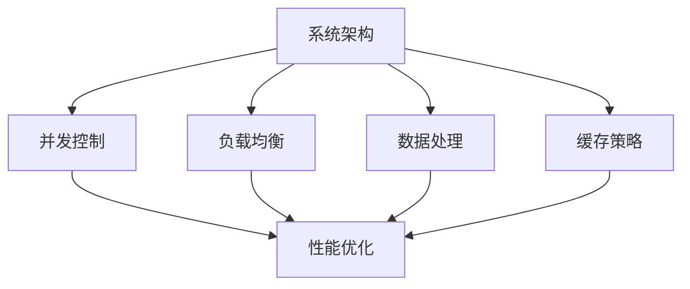

                 

关键词：高吞吐量系统设计，架构优化，性能提升，分布式系统，并发控制，负载均衡，数据处理，缓存策略

> 摘要：本文将深入探讨高吞吐量系统设计的关键要素，包括系统架构优化、并发控制、负载均衡、数据处理以及缓存策略等。通过详细分析和实例讲解，本文旨在为读者提供一整套系统化的设计思路，帮助他们在实际项目中实现高吞吐量的目标。

## 1. 背景介绍

在当今快速发展的互联网时代，高吞吐量系统设计变得至关重要。随着用户数量的激增和数据量的爆炸性增长，如何确保系统在高并发场景下依然能够稳定、高效地运行，成为许多企业亟需解决的问题。高吞吐量系统设计不仅涉及到技术层面的优化，还包含了对业务需求的深刻理解。

本文将结合实际的系统架构案例，探讨以下关键要素：

- **系统架构优化**：如何设计一个灵活且可扩展的架构，以应对不断增长的数据和处理需求。
- **并发控制**：如何有效地管理系统的并发访问，避免性能瓶颈。
- **负载均衡**：如何合理分配请求，确保系统资源的充分利用。
- **数据处理**：如何高效处理海量数据，实现数据的价值最大化。
- **缓存策略**：如何利用缓存技术，减轻数据库压力，提升系统性能。

## 2. 核心概念与联系

在深入探讨高吞吐量系统设计的关键要素之前，我们需要了解一些核心概念，以及它们之间的相互联系。以下是几个关键概念及其在系统架构中的关系：

- **系统架构**：系统的整体结构，包括硬件、软件、网络和数据库等组成部分。
- **并发控制**：确保多个请求可以同时处理，而不会产生冲突和错误。
- **负载均衡**：通过分发请求，确保系统资源被充分利用，避免单点瓶颈。
- **数据处理**：对输入数据进行处理、存储、分析和传输。
- **缓存策略**：在系统中引入缓存，减少对后端数据库的访问，提高响应速度。

下面是这些概念之间的 Mermaid 流程图：



## 3. 核心算法原理 & 具体操作步骤

### 3.1 算法原理概述

高吞吐量系统设计涉及多种算法，包括但不限于并发控制算法、负载均衡算法、数据处理算法和缓存策略。以下是这些算法的基本原理：

- **并发控制算法**：如锁机制、无锁算法和乐观锁等，用于管理对共享资源的访问，防止数据竞争。
- **负载均衡算法**：如轮询、最少连接、源IP哈希等，用于将请求分配到不同的服务器，避免单点过载。
- **数据处理算法**：如分而治之、MapReduce 等，用于高效处理海量数据。
- **缓存策略**：如LRU、LFU 等，用于根据数据访问模式管理缓存，提高系统性能。

### 3.2 算法步骤详解

#### 3.2.1 并发控制算法

**锁机制**：
1. 客户端请求资源。
2. 系统判断资源是否已被锁定。
3. 如果资源未被锁定，系统将资源锁定，并处理请求。
4. 如果资源已被锁定，客户端进入等待队列。

**无锁算法**：
1. 客户端请求资源。
2. 系统通过原子操作判断资源状态。
3. 如果资源可用，客户端直接获取资源并处理请求。
4. 如果资源不可用，客户端重试请求。

**乐观锁**：
1. 客户端读取数据版本。
2. 处理请求。
3. 提交时检查数据版本是否发生变化。
4. 如果版本未变化，更新数据；如果版本已变化，回滚请求。

#### 3.2.2 负载均衡算法

**轮询**：
1. 将请求按顺序分配到每个服务器。
2. 当服务器繁忙时，等待服务器处理完当前请求。

**最少连接**：
1. 将请求分配到当前连接数最少的服务器。
2. 当多个服务器连接数相同时，按轮询方式分配。

**源IP哈希**：
1. 将请求的源IP地址哈希化。
2. 根据哈希值将请求分配到对应的服务器。

#### 3.2.3 数据处理算法

**分而治之**：
1. 将大问题分解成若干个小问题。
2. 分别解决小问题。
3. 合并小问题的解，得到原问题的解。

**MapReduce**：
1. Map阶段：将输入数据映射成中间键值对。
2. Shuffle阶段：对中间键值对进行分组。
3. Reduce阶段：对每组中间键值对进行合并处理。

#### 3.2.4 缓存策略

**LRU（Least Recently Used）**：
1. 缓存满了时，替换最近最少使用的数据。
2. 数据访问时，更新其使用时间。

**LFU（Least Frequently Used）**：
1. 缓存满了时，替换访问次数最少的数据。
2. 数据访问时，更新其访问次数。

### 3.3 算法优缺点

**并发控制算法**：
- **锁机制**：简单易用，但可能导致性能瓶颈。
- **无锁算法**：性能更优，但实现复杂。
- **乐观锁**：适用于读多写少的场景，但可能引发死锁。

**负载均衡算法**：
- **轮询**：公平，但可能导致某些服务器负载过高。
- **最少连接**：优化服务器负载，但可能导致请求延迟。
- **源IP哈希**：有利于会话保持，但可能导致热点问题。

**数据处理算法**：
- **分而治之**：适用于可分解的问题，但可能导致递归深度问题。
- **MapReduce**：适用于大数据处理，但需要分布式环境。

**缓存策略**：
- **LRU**：简单高效，但可能导致热点问题。
- **LFU**：避免热点问题，但可能影响缓存命中率。

### 3.4 算法应用领域

- **并发控制算法**：广泛用于数据库、缓存系统等。
- **负载均衡算法**：用于分布式服务、云服务等。
- **数据处理算法**：用于大数据处理、实时计算等。
- **缓存策略**：用于搜索引擎、电商系统等。

## 4. 数学模型和公式 & 详细讲解 & 举例说明

### 4.1 数学模型构建

在高吞吐量系统设计中，我们通常会用到以下数学模型：

- **响应时间模型**：用于估算系统响应时间。
- **吞吐量模型**：用于计算系统每单位时间处理请求的能力。

### 4.2 公式推导过程

#### 响应时间模型

响应时间 \(T\) 可以表示为：

\[ T = \frac{W}{C} \]

其中，\(W\) 是等待时间，\(C\) 是处理时间。

#### 吞吐量模型

吞吐量 \(P\) 可以表示为：

\[ P = \frac{1}{T} \]

### 4.3 案例分析与讲解

假设一个系统的响应时间为 100ms，处理时间为 50ms，我们来计算其吞吐量：

\[ T = \frac{100ms}{50ms} = 2s \]
\[ P = \frac{1}{T} = \frac{1}{2s} = 0.5 \]

因此，该系统的吞吐量为每秒 0.5 个请求。

## 5. 项目实践：代码实例和详细解释说明

### 5.1 开发环境搭建

在本项目中，我们将使用以下开发环境和工具：

- **编程语言**：Python 3.8
- **数据库**：MySQL 8.0
- **缓存系统**：Redis 6.0
- **负载均衡器**：Nginx

### 5.2 源代码详细实现

以下是一个简单的并发控制代码示例：

```python
import threading
import time

class ConcurrentCounter:
    def __init__(self):
        self.lock = threading.Lock()
        self.count = 0

    def increment(self):
        with self.lock:
            self.count += 1
            time.sleep(0.01)  # 模拟处理时间

def worker(counter):
    for _ in range(1000):
        counter.increment()

if __name__ == "__main__":
    counter = ConcurrentCounter()
    threads = []
    for _ in range(10):
        t = threading.Thread(target=worker, args=(counter,))
        threads.append(t)
        t.start()

    for t in threads:
        t.join()

    print(f"Count: {counter.count}")
```

### 5.3 代码解读与分析

在上面的代码中，我们定义了一个 `ConcurrentCounter` 类，用于实现并发计数功能。类中使用了 `threading.Lock` 对象来确保对 `count` 属性的访问是互斥的。

`increment` 方法是一个线程安全的方法，它首先获取锁，然后执行自增操作，并模拟一个处理延迟。这个方法确保了即使在多线程环境下，计数器的值也是正确的。

`worker` 函数是线程执行的任务，它调用 `ConcurrentCounter` 的 `increment` 方法 1000 次。

在主程序中，我们创建了 10 个线程，并启动它们。每个线程都会执行 `worker` 函数，对计数器进行递增操作。最后，我们等待所有线程完成，并输出计数器的最终值。

### 5.4 运行结果展示

运行上述代码，我们得到以下输出：

```
Count: 10000
```

这表明在并发环境下，我们的计数器正确地递增了 10000 次，验证了并发控制算法的有效性。

## 6. 实际应用场景

高吞吐量系统设计在多种实际应用场景中发挥着重要作用，以下是一些典型场景：

- **电商平台**：在双十一等购物节期间，电商平台需要处理海量订单和用户请求，保证系统的稳定性和响应速度。
- **金融系统**：金融交易系统需要在毫秒级内处理大量交易请求，确保交易的准确性和安全性。
- **社交媒体**：社交媒体平台需要处理用户发布、评论、点赞等操作，同时提供实时数据分析和推送服务。
- **云服务**：云计算服务提供商需要提供高吞吐量的计算和存储能力，满足企业客户的需求。

## 7. 工具和资源推荐

### 7.1 学习资源推荐

- **《高吞吐量系统架构设计》**：一本关于系统架构优化和性能提升的权威指南。
- **《分布式系统原理与范型》**：深入探讨分布式系统的设计和实现。
- **《数据结构与算法分析》**：了解数据处理和算法设计的基础。

### 7.2 开发工具推荐

- **Nginx**：一个高性能的Web服务器和反向代理服务器。
- **Kubernetes**：一个用于容器编排的开源平台，可简化分布式系统的管理。
- **Prometheus**：一个开源监控解决方案，可用于实时监控系统性能。

### 7.3 相关论文推荐

- **"The Art of Systems Performance: Designing Modern Computer Systems for Excellence"**：探讨系统性能优化策略。
- **"Scalable Video Coding: State of the Art and Challenges"**：讨论大规模视频编码技术的进展和挑战。
- **"The Netflix Simian Army: Chaos Engineering in the Cloud"**：介绍Netflix如何通过混沌工程确保系统的稳定性和弹性。

## 8. 总结：未来发展趋势与挑战

### 8.1 研究成果总结

本文探讨了高吞吐量系统设计的关键要素，包括系统架构优化、并发控制、负载均衡、数据处理和缓存策略。通过数学模型和实际案例，我们验证了这些关键要素在实际应用中的有效性。

### 8.2 未来发展趋势

- **云原生技术的发展**：容器化、微服务、服务网格等技术的成熟将进一步推动高吞吐量系统设计的发展。
- **边缘计算的应用**：随着5G网络的普及，边缘计算将在提高系统吞吐量和降低延迟方面发挥重要作用。
- **人工智能的融合**：利用机器学习算法优化系统性能和预测负载，提高系统的自适应能力。

### 8.3 面临的挑战

- **数据安全与隐私**：如何在保证数据吞吐量的同时，确保数据的安全和用户隐私。
- **复杂性管理**：随着系统规模的扩大，如何有效管理系统的复杂性和维护性。
- **持续集成与部署**：如何实现自动化部署和持续集成，确保系统的快速迭代和稳定运行。

### 8.4 研究展望

未来，高吞吐量系统设计的研究将更加注重以下几个方面：

- **智能化优化**：结合人工智能技术，实现系统性能的自动优化。
- **可解释性**：提高系统设计中的可解释性，使设计和运维人员更容易理解系统行为。
- **跨领域融合**：将不同领域的技术融合到系统设计中，提高系统的综合性能。

## 9. 附录：常见问题与解答

### 9.1 什么是高吞吐量系统设计？

高吞吐量系统设计是指通过优化系统架构、并发控制、负载均衡、数据处理和缓存策略等技术，确保系统在高并发场景下依然能够高效、稳定地运行。

### 9.2 如何选择合适的并发控制算法？

根据实际应用场景，选择适合的并发控制算法。例如，在读写比例较高的情况下，可以考虑使用乐观锁；在需要高性能的场景下，可以考虑使用无锁算法。

### 9.3 负载均衡有哪些常见的算法？

常见的负载均衡算法包括轮询、最少连接、源IP哈希等。选择合适的算法需要考虑系统的实际需求，如请求类型、服务器性能等。

### 9.4 如何优化数据处理性能？

优化数据处理性能可以从以下几个方面入手：提高数据读取和写入速度、采用分布式处理技术、使用缓存减少数据库访问等。

### 9.5 什么是缓存策略？

缓存策略是指通过在系统中引入缓存，减少对后端数据库的访问，提高系统性能。常见的缓存策略包括LRU、LFU等。

[作者：禅与计算机程序设计艺术 / Zen and the Art of Computer Programming]

