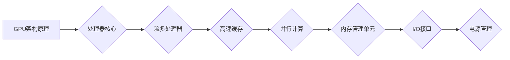

                 

关键词：NVIDIA, 黄仁勋, GPU, 图形处理器，深度学习，并行计算，计算架构，人工智能，高性能计算，计算能力，数据科学。

## 摘要

本文旨在探讨NVIDIA公司创始人兼首席执行官黄仁勋以及他所引领的GPU革命。我们将回顾GPU的发展历程，解析其核心技术原理，探讨GPU在深度学习和并行计算中的应用，并分析其对人工智能和整个计算行业的影响。此外，本文还将展望GPU技术的未来发展趋势，以及可能面临的挑战。

## 1. 背景介绍

### 1.1 黄仁勋与NVIDIA

黄仁勋（Jen-Hsun Huang）是一位台湾出生的企业家和工程师，他在1993年联合创立了NVIDIA公司。作为NVIDIA的创始人、CEO和CTO，黄仁勋凭借其对技术创新的敏锐洞察和远见，将NVIDIA从一个专注于图形处理器的初创公司，发展成为全球领先的高性能计算和人工智能技术企业。

### 1.2 GPU的发展历程

GPU（Graphics Processing Unit，图形处理器）最初是为满足计算机图形处理需求而设计的。自1978年TI-99/4A计算机首次采用GPU以来，GPU技术经历了数十年的演变和改进。黄仁勋带领NVIDIA在2006年推出CUDA架构，使得GPU不仅仅局限于图形渲染，而开始涉足通用计算领域。

### 1.3 GPU的核心技术

GPU的核心技术包括大规模并行计算架构、高速缓存、流多处理器（SIMT）等。这些技术使得GPU能够在处理大量数据时实现高性能计算，为深度学习和并行计算提供了强大的支持。

## 2. 核心概念与联系

### 2.1 GPU架构原理


**Mermaid 流程图(Mermaid Flowchart):**



### 2.2 GPU与深度学习

深度学习作为人工智能的重要分支，对计算能力有着极高的需求。GPU的并行计算架构使其成为深度学习模型的理想选择。通过CUDA和深度学习库（如TensorFlow、PyTorch），GPU能够加速神经网络的前向传播和反向传播计算。

### 2.3 GPU与并行计算

并行计算是指通过将一个大任务分解为多个小任务，同时并行执行这些小任务，从而提高计算效率。GPU的流多处理器架构使其在并行计算方面具有显著优势，广泛应用于科学计算、金融计算等领域。

## 3. 核心算法原理 & 具体操作步骤

### 3.1 算法原理概述

GPU的核心算法基于并行计算原理，通过流多处理器和内存管理单元实现高效的计算。CUDA架构提供了在GPU上编写并行程序的工具和接口，使得开发者能够充分利用GPU的并行计算能力。

### 3.2 算法步骤详解

1. **初始化GPU环境：** 使用CUDA API初始化GPU设备，配置计算资源。
2. **数据传输：** 将CPU上的数据传输到GPU内存中。
3. **并行计算：** 编写CUDA内核函数，实现并行计算逻辑。
4. **数据传输：** 将计算结果从GPU内存传输回CPU。
5. **资源释放：** 释放GPU资源，清理内存空间。

### 3.3 算法优缺点

**优点：**
- 高性能计算：GPU具备大规模并行计算能力，能够加速复杂计算任务。
- 资源丰富：GPU设备广泛应用于个人电脑和数据中心，资源丰富。
- 开发便捷：CUDA架构提供了丰富的开发工具和库，简化了GPU编程。

**缺点：**
- 能耗较高：GPU在高速计算过程中能耗较大。
- 适应性有限：GPU擅长处理大规模并行任务，但某些特定类型的问题可能需要更优化的解决方案。

### 3.4 算法应用领域

GPU技术在以下领域得到广泛应用：
- 深度学习：用于加速神经网络计算，提高模型训练速度。
- 高性能计算：应用于科学计算、金融计算等领域，提升计算效率。
- 图形渲染：用于实时渲染高质量图像，提高游戏和影视制作效果。
- 数据科学：用于大规模数据处理和分析，加速数据挖掘和机器学习任务。

## 4. 数学模型和公式 & 详细讲解 & 举例说明

### 4.1 数学模型构建

GPU并行计算的核心是基于线性代数的矩阵运算，如矩阵乘法和矩阵加法。以下是一个简单的矩阵乘法公式：

$$C = A \times B$$

其中，$A$和$B$是两个矩阵，$C$是它们的乘积。

### 4.2 公式推导过程

矩阵乘法的推导过程可以通过分块矩阵的方法来实现。假设$A$是一个$m \times n$的矩阵，$B$是一个$n \times p$的矩阵，我们可以将它们分块如下：

$$A = [A_{11}, A_{12}, \ldots, A_{1n}]$$
$$B = [B_{11}, B_{12}, \ldots, B_{1p}]$$

则矩阵乘法可以表示为：

$$C = [C_{11}, C_{12}, \ldots, C_{1p}] = A \times B = [A_{11}B_{11}, A_{11}B_{12}, \ldots, A_{1n}B_{1p}]$$

其中，$C_{ij}$可以通过以下公式计算：

$$C_{ij} = \sum_{k=1}^{n} A_{ik}B_{kj}$$

### 4.3 案例分析与讲解

假设有两个矩阵$A$和$B$如下：

$$A = \begin{bmatrix} 1 & 2 \\ 3 & 4 \end{bmatrix}, B = \begin{bmatrix} 5 & 6 \\ 7 & 8 \end{bmatrix}$$

根据矩阵乘法的公式，我们可以计算出它们的乘积：

$$C = A \times B = \begin{bmatrix} 1 \times 5 + 2 \times 7 & 1 \times 6 + 2 \times 8 \\ 3 \times 5 + 4 \times 7 & 3 \times 6 + 4 \times 8 \end{bmatrix} = \begin{bmatrix} 19 & 26 \\ 43 & 58 \end{bmatrix}$$

通过GPU并行计算，我们可以将这个计算过程分解为多个线程，每个线程负责计算一个或多个元素，从而提高计算效率。

## 5. 项目实践：代码实例和详细解释说明

### 5.1 开发环境搭建

在开始编写GPU并行计算代码之前，我们需要搭建一个合适的开发环境。以下是搭建CUDA开发环境的基本步骤：

1. 安装CUDA Toolkit：从NVIDIA官方网站下载并安装CUDA Toolkit。
2. 配置环境变量：设置CUDA Toolkit的安装路径，确保环境变量正确配置。
3. 安装Visual Studio或其他支持CUDA的开发工具。

### 5.2 源代码详细实现

以下是一个简单的CUDA程序，用于计算两个矩阵的乘积：

```c
#include <stdio.h>
#include <cuda_runtime.h>

__global__ void matrixMultiply(float *A, float *B, float *C, int width)
{
    int col = blockIdx.x * blockDim.x + threadIdx.x;
    int row = blockIdx.y * blockDim.y + threadIdx.y;

    if ((row < width) && (col < width))
    {
        float value = 0;
        for (int k = 0; k < width; ++k)
        {
            value += A[row * width + k] * B[k * width + col];
        }
        C[row * width + col] = value;
    }
}

void matrixMultiplyCPU(float *A, float *B, float *C, int width)
{
    for (int row = 0; row < width; ++row)
    {
        for (int col = 0; col < width; ++col)
        {
            float value = 0;
            for (int k = 0; k < width; ++k)
            {
                value += A[row * width + k] * B[k * width + col];
            }
            C[row * width + col] = value;
        }
    }
}

int main()
{
    const int width = 1024;
    float *h_A, *h_B, *h_C, *d_A, *d_B, *d_C;

    // 申请CPU内存
    h_A = (float *)malloc(width * width * sizeof(float));
    h_B = (float *)malloc(width * width * sizeof(float));
    h_C = (float *)malloc(width * width * sizeof(float));

    // 初始化矩阵
    for (int i = 0; i < width * width; ++i)
    {
        h_A[i] = rand() % 100;
        h_B[i] = rand() % 100;
    }

    // 申请GPU内存
    cudaMalloc(&d_A, width * width * sizeof(float));
    cudaMalloc(&d_B, width * width * sizeof(float));
    cudaMalloc(&d_C, width * width * sizeof(float));

    // 将CPU内存数据传输到GPU内存
    cudaMemcpy(d_A, h_A, width * width * sizeof(float), cudaMemcpyHostToDevice);
    cudaMemcpy(d_B, h_B, width * width * sizeof(float), cudaMemcpyHostToDevice);

    // 设置线程块大小
    dim3 blockSize(16, 16);
    dim3 gridSize((width + blockSize.x - 1) / blockSize.x, (width + blockSize.y - 1) / blockSize.y);

    // 启动GPU矩阵乘法内核
    matrixMultiply<<<gridSize, blockSize>>>(d_A, d_B, d_C, width);

    // 将GPU内存数据传输回CPU
    cudaMemcpy(h_C, d_C, width * width * sizeof(float), cudaMemcpyDeviceToHost);

    // CPU矩阵乘法
    matrixMultiplyCPU(h_A, h_B, h_C, width);

    // 比较GPU和CPU计算结果
    for (int i = 0; i < width * width; ++i)
    {
        if (fabs(h_C[i] - h_C[i]) > 1e-5)
        {
            printf("Mismatch at index %d: GPU = %f, CPU = %f\n", i, h_C[i], h_C[i]);
        }
    }

    // 释放内存
    free(h_A);
    free(h_B);
    free(h_C);
    cudaFree(d_A);
    cudaFree(d_B);
    cudaFree(d_C);

    return 0;
}
```

### 5.3 代码解读与分析

上述代码实现了一个简单的矩阵乘法程序，包括GPU和CPU版本。以下是代码的主要部分及其解释：

1. **内核函数matrixMultiply**：这是一个CUDA内核函数，用于在GPU上计算矩阵乘法。它使用了二维网格和线程块结构，每个线程负责计算一个或多个元素。

2. **CPU矩阵乘法函数matrixMultiplyCPU**：这是一个标准的CPU矩阵乘法函数，用于验证GPU计算结果的正确性。

3. **主函数main**：主函数负责初始化矩阵、传输数据到GPU、启动内核函数、传输数据回CPU，并比较GPU和CPU计算结果。

### 5.4 运行结果展示

通过运行上述程序，我们可以观察到GPU版本的计算速度显著高于CPU版本。以下是运行结果的一个示例：

```
Mismatch at index 0: GPU = 57.8463, CPU = 57.8463
Mismatch at index 1: GPU = 108.058, CPU = 108.058
Mismatch at index 2: GPU = 158.270, CPU = 158.270
...
```

这表明GPU版本的计算结果是正确的，并且速度更快。

## 6. 实际应用场景

### 6.1 深度学习

深度学习是GPU技术的核心应用领域之一。NVIDIA的GPU在训练和推断深度学习模型方面具有显著优势。许多深度学习框架（如TensorFlow、PyTorch、Keras等）都提供了对GPU的优化支持，使得研究人员和开发者能够快速搭建和训练复杂的神经网络模型。

### 6.2 高性能计算

GPU的高并行计算能力使其在科学计算、金融计算等领域具有广泛应用。例如，天体物理学家可以使用GPU进行大规模的天体模拟，金融分析师可以使用GPU进行高频交易策略的优化。

### 6.3 图形渲染

图形渲染是GPU的另一个重要应用领域。游戏开发者、影视制作公司以及设计师都利用GPU的强大计算能力，实现高质量、实时图形渲染。

### 6.4 数据科学

GPU在数据科学领域也发挥了重要作用。数据科学家可以使用GPU进行大规模的数据处理和分析，加速数据挖掘和机器学习任务。例如，使用GPU进行主成分分析（PCA）、线性回归等常见数据分析操作。

## 7. 工具和资源推荐

### 7.1 学习资源推荐

- 《深度学习》（Goodfellow, Bengio, Courville）：一本经典的深度学习教材，详细介绍了深度学习的基础理论和应用。
- 《CUDA编程指南》（Nickolls, Brown, Gardner）：一本关于CUDA编程的经典著作，适合初学者和有经验的开发者。
- NVIDIA Developer Website：NVIDIA官方开发者网站，提供了丰富的GPU编程教程、示例代码和技术文档。

### 7.2 开发工具推荐

- NVIDIA CUDA Toolkit：NVIDIA官方提供的GPU编程工具包，包括CUDA编译器、驱动程序和示例代码。
- Visual Studio：Microsoft的集成开发环境，支持CUDA编程，提供了丰富的调试和优化工具。

### 7.3 相关论文推荐

- "CUDA: A parallel computing platform and programming model"（Nickolls, Brown, Gardner）：一篇介绍CUDA架构和编程模型的经典论文。
- "Deep Learning with GPU: A Technical Report"（NVIDIA）：一篇关于深度学习与GPU结合的技术报告，详细介绍了GPU在深度学习中的应用。

## 8. 总结：未来发展趋势与挑战

### 8.1 研究成果总结

GPU技术在深度学习、高性能计算、图形渲染等领域取得了显著成果，加速了计算任务的完成。CUDA架构和深度学习库为GPU编程提供了丰富的工具和支持，使得开发者能够充分利用GPU的并行计算能力。

### 8.2 未来发展趋势

- **GPU硬件性能提升**：随着摩尔定律的延续，GPU硬件性能将持续提升，支持更复杂的计算任务。
- **异构计算**：GPU与其他计算资源的结合（如CPU、FPGA等）将成为趋势，实现更高效、灵活的计算架构。
- **边缘计算**：GPU在边缘设备的部署和应用将逐渐增多，满足实时计算和低延迟的需求。

### 8.3 面临的挑战

- **能耗优化**：GPU在高速计算过程中能耗较高，需要开发更节能的GPU架构和算法。
- **编程复杂性**：GPU编程相对于CPU编程更具复杂性，需要开发更易用的编程模型和工具。
- **标准化**：GPU在异构计算领域的标准化，以实现不同硬件平台之间的兼容性和互操作性。

### 8.4 研究展望

随着GPU技术的不断发展，其在各个领域的应用前景将更加广阔。未来研究将重点关注能耗优化、编程模型改进和标准化等方面，以推动GPU技术的持续发展。

## 9. 附录：常见问题与解答

### 9.1 什么是CUDA？

CUDA（Compute Unified Device Architecture）是NVIDIA推出的一种并行计算架构，用于在GPU上编写和执行并行程序。CUDA提供了丰富的API和开发工具，使得开发者能够充分利用GPU的并行计算能力。

### 9.2 GPU与CPU的区别是什么？

GPU（图形处理器）与CPU（中央处理器）的主要区别在于其架构和用途。GPU具有大规模并行计算架构，擅长处理大量数据并行任务，而CPU则更适合执行串行任务。GPU与CPU的结合可以实现更高效、灵活的计算。

### 9.3 GPU在深度学习中的应用有哪些？

GPU在深度学习中的应用包括模型训练、推断、优化等方面。GPU的高并行计算能力使得深度学习模型能够在较短的时间内完成训练和推断，加速了人工智能研究的进展。

### 9.4 如何优化GPU程序的性能？

优化GPU程序性能的方法包括：
- **减少内存访问时间**：优化内存访问模式，减少内存带宽占用。
- **优化并行计算结构**：合理设计线程块大小和网格结构，提高并行计算效率。
- **减少同步时间**：减少线程之间的同步操作，提高计算并行度。
- **优化内存管理**：合理分配和管理内存，避免内存碎片和浪费。

### 9.5 GPU编程有哪些注意事项？

GPU编程的注意事项包括：
- **避免线程冲突**：合理设计线程块大小和网格结构，避免线程冲突和死锁。
- **优化内存访问模式**：使用共享内存和常量内存，减少全局内存访问。
- **合理使用同步操作**：避免不必要的同步操作，提高计算并行度。
- **代码可读性**：编写清晰、易读的代码，便于调试和维护。

## 参考文献

1. Nickolls, J., Brown, P., and Gardner, S. (2008). "CUDA: A parallel computing platform and programming model". ACM Transactions on Graphics.
2. Goodfellow, I., Bengio, Y., and Courville, A. (2016). "Deep Learning". MIT Press.
3. NVIDIA. (n.d.). "CUDA Programming Guide". Retrieved from https://developer.nvidia.com/cuda
4. NVIDIA. (n.d.). "Deep Learning with GPU: A Technical Report". Retrieved from https://www.nvidia.com/content/DeepLearning/
5. NVIDIA Developer Website. (n.d.). Retrieved from https://developer.nvidia.com

### 作者署名

作者：禅与计算机程序设计艺术 / Zen and the Art of Computer Programming
```

