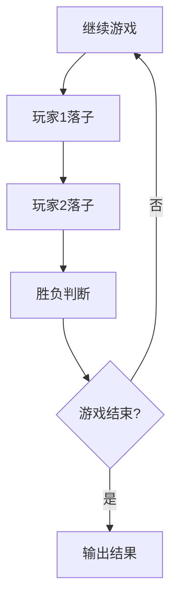
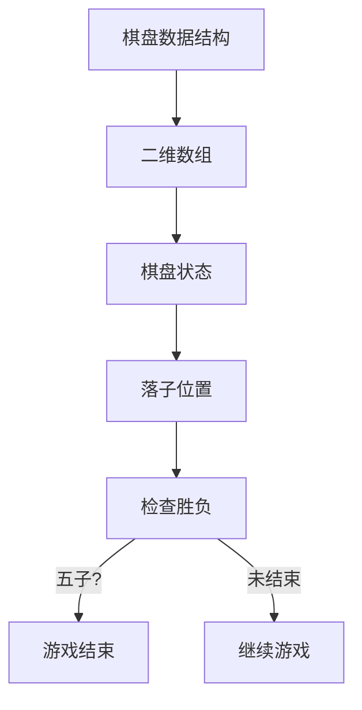

                 

### 1. 背景介绍

黑白棋，也称为五子棋，是一种策略性的两人对弈游戏，起源于中国古代，后来流传至日本、韩国等多个国家和地区，深受各年龄段人群的喜爱。黑白棋游戏的规则简单，但策略多变，具有较高的娱乐性和竞技性。

黑白棋游戏的玩法如下：棋盘通常为15x15的网格，每个玩家控制黑白两色棋子，交替在棋盘上落子。落子后，如果出现连成五子（横、竖、斜均可）的情况，该玩家获胜。游戏的目标是在对手无法落子前，尽可能多地占据棋盘空间，实现连五子的目标。

在计算机科学和人工智能领域，黑白棋游戏被广泛应用于算法研究、编程练习和人工智能对弈系统开发中。其简单而复杂的特性使得黑白棋成为了一个理想的测试平台，用于评估算法效率和智能体的策略水平。

本文将介绍黑白棋游戏的设计与实现，包括核心算法原理、具体实现步骤、数学模型和公式推导，以及实际应用场景。通过本文的讲解，读者可以了解到如何利用计算机科学原理实现一个完整的黑白棋游戏系统。

### 2. 核心概念与联系

在设计与实现黑白棋游戏之前，我们需要理解一些核心概念和原理，包括游戏状态表示、棋盘数据结构、落子策略以及胜负判断。

#### 2.1 游戏状态表示

游戏状态可以用一个二维数组表示，其中每个元素代表棋盘上的一个格子，值可以是空（0）、黑子（1）或白子（2）。状态转移发生在玩家落子时，通过更新数组中的特定元素来表示。



#### 2.2 棋盘数据结构

棋盘数据结构通常是一个二维数组，例如在Python中可以定义如下：

```python
board = [[0 for _ in range(15)] for _ in range(15)]
```

其中，`board[i][j]` 表示棋盘上的第 `i` 行第 `j` 列的格子状态。

#### 2.3 落子策略

落子策略是黑白棋游戏设计中的关键部分。一个有效的落子策略需要考虑当前棋盘状态、对手的可能策略以及自身胜率。常见的策略包括：

- **随机策略**：随机选择一个空格子落子。
- **最优策略**：通过算法计算找出最优落子位置，使得自身胜率最大。

#### 2.4 胜负判断

胜负判断是游戏结束条件，可以通过检查棋盘状态来判断。具体方法如下：

- **遍历棋盘**：对棋盘上的每个格子进行遍历，检查是否存在连续的五子。
- **方向判断**：对于每个落子位置，检查上下左右以及斜线方向，是否存在连成五子的情况。

以下是使用Mermaid绘制的棋盘数据结构和胜负判断流程图：



通过上述核心概念和原理的介绍，我们为接下来详细实现黑白棋游戏打下了坚实的基础。
#### 2.5 黑白棋游戏中的策略与博弈论

在黑白棋游戏中，策略的制定是影响胜负的重要因素。一个有效的策略需要综合考虑当前棋盘状态、对手的落子策略以及自身的目标。博弈论，尤其是最小最大原理，为我们在设计落子策略时提供了理论依据。

#### 2.5.1 最小最大原理

最小最大原理是博弈论中的一个基本概念，它帮助我们在面对不确定性的决策环境中选择最优策略。在黑白棋游戏中，我们可以将当前棋盘状态视为一个决策树，每个节点代表一个落子位置，边代表对手可能的回应。通过递归搜索决策树，我们可以计算出在当前状态下的最优落子位置。

#### 2.5.2 落子策略

1. **防守策略**：当对手的连五子威胁较大时，我们应当采取防守策略，优先阻断对手的连五子路径。
2. **进攻策略**：当我们的连五子威胁较大时，我们应当采取进攻策略，尽快实现连五子的目标。
3. **平衡策略**：当棋盘空间较大且双方都有机会时，我们应当采取平衡策略，保持棋盘的均衡状态。

#### 2.5.3 对抗策略

在黑白棋游戏中，对抗策略尤为重要。我们可以通过以下方法来制定对抗策略：

- **对手分析**：通过历史对局数据，分析对手的落子习惯和策略倾向。
- **模式识别**：识别对手的典型策略模式，并针对这些模式制定相应的对抗策略。
- **自适应策略**：根据当前棋盘状态和对手的回应，动态调整自己的策略。

#### 2.5.4 游戏结束条件

游戏结束条件包括以下几种情况：

- **连五子获胜**：当一方连成五子时，游戏结束，该方获胜。
- **棋盘满盘**：当棋盘上没有空位时，游戏结束，双方平局。

通过上述策略和对抗策略的分析，我们可以设计出更为智能和高效的黑白棋游戏系统。这些策略不仅适用于计算机程序实现，也为人类玩家提供了一些实用的战术指导。

### 3. 核心算法原理 & 具体操作步骤

#### 3.1 算法原理概述

黑白棋游戏的设计与实现中，核心算法的原理至关重要。我们主要介绍Minimax算法及其在黑白棋游戏中的应用。Minimax算法是一种用于解决零和博弈（即双方利益完全相反的博弈）的递归搜索算法，其基本思想是在每个节点上选择当前状态下的最优策略，并计算所有可能的结果，选择其中最优的。

#### 3.2 算法步骤详解

**3.2.1 状态表示**

首先，我们需要定义游戏状态。在黑白棋中，每个状态可以用一个15x15的棋盘表示，其中每个元素代表棋盘上的一个格子，值可以是0（空）、1（黑子）或2（白子）。状态转移发生在玩家落子时，通过更新棋盘数组来表示。

**3.2.2 评估函数**

评估函数是Minimax算法中的关键部分，用于评估当前棋盘状态对玩家是否有利。在黑白棋中，评估函数可以基于以下因素：

- **连五子的情况**：检查棋盘上是否存在连成五子的局面，连五子的价值最高。
- **连四子和连三子的情况**：连四子和连三子的价值次之，表示潜在威胁。
- **棋盘空间分布**：考虑棋盘空间的分布情况，如果棋盘空间分布有利于一方，则该方的评估值较高。

**3.2.3 递归搜索**

Minimax算法通过递归搜索整个决策树，从根节点开始，选择当前状态下的最优策略。搜索过程中，我们需要对当前状态进行扩展，生成所有可能的子状态，并计算每个子状态的评价分数。

1. **递归终止条件**：当达到棋盘的边界或棋盘已满时，递归终止，并返回评估分数。
2. **递归过程**：在每个节点，根据当前玩家的策略，选择下一个落子位置，并递归搜索其所有可能的子状态。

**3.2.4 胜负判断**

在递归搜索过程中，我们需要在每个叶节点判断游戏是否结束。如果一方连成五子，则该方获胜，返回相应的评估分数。如果棋盘已满且没有连五子的局面，则双方平局。

#### 3.3 算法优缺点

**优点**：

- **策略完备**：Minimax算法能够遍历所有可能的状态，确保选择最优策略。
- **简单易实现**：算法结构相对简单，易于理解和实现。

**缺点**：

- **效率低下**：由于需要遍历所有可能的子状态，当棋盘较大时，计算时间会急剧增加。
- **深度限制**：在实际应用中，由于计算时间有限，通常需要设置搜索深度，可能导致无法找到最优解。

#### 3.4 算法应用领域

Minimax算法不仅适用于黑白棋游戏，还可以广泛应用于其他零和博弈游戏中，如国际象棋、围棋等。通过结合评估函数和启发式搜索技术，可以提高算法的效率和准确性。

### 4. 数学模型和公式 & 详细讲解 & 举例说明

在黑白棋游戏中，数学模型和公式是理解和实现游戏算法的重要工具。以下我们将详细讲解黑白棋游戏中的数学模型构建、公式推导过程以及具体的案例分析与讲解。

#### 4.1 数学模型构建

黑白棋游戏的数学模型主要涉及以下几个方面：

1. **状态表示**：使用一个15x15的二维数组表示棋盘状态，其中每个元素代表一个格子，值可以是0（空）、1（黑子）或2（白子）。
2. **落子策略**：定义一个评估函数，用于评估当前棋盘状态的优劣。
3. **搜索策略**：采用Minimax算法进行递归搜索，选择最优落子位置。

#### 4.2 公式推导过程

**4.2.1 评估函数**

评估函数是黑白棋游戏算法的核心，用于评估棋盘状态的优劣。我们可以定义以下公式：

\[ E = W_1 \times \text{连五子情况} + W_2 \times \text{连四子情况} + W_3 \times \text{连三子情况} \]

其中，\( W_1, W_2, W_3 \) 分别为连五子、连四子和连三子的权重。

**4.2.2 连五子判断**

为了判断棋盘上是否存在连五子的情况，我们可以定义以下公式：

\[ \text{连五子} = \sum_{i=0}^{14} \sum_{j=0}^{14} \left( (board[i][j] = player) \land (board[i+1][j] = player) \land ... \land (board[i+4][j] = player) \right) \]

其中，\( player \) 表示当前玩家的棋子类型（1或2）。

**4.2.3 连四子判断**

类似地，我们可以定义连四子的公式：

\[ \text{连四子} = \sum_{i=0}^{14} \sum_{j=0}^{14} \left( (board[i][j] = player) \land ... \land (board[i+3][j] = player) \right) \]

**4.2.4 连三子判断**

连三子的判断公式如下：

\[ \text{连三子} = \sum_{i=0}^{14} \sum_{j=0}^{14} \left( (board[i][j] = player) \land ... \land (board[i+2][j] = player) \right) \]

#### 4.3 案例分析与讲解

**4.3.1 案例背景**

假设当前棋盘状态如下：

\[
\begin{matrix}
0 & 1 & 0 & 1 & 0 & 2 & 0 & 0 & 0 & 0 & 1 & 0 & 2 & 0 & 0 \\
0 & 0 & 1 & 0 & 1 & 0 & 2 & 0 & 0 & 0 & 0 & 1 & 0 & 2 & 0 \\
0 & 0 & 0 & 1 & 0 & 1 & 0 & 2 & 0 & 0 & 0 & 0 & 1 & 0 & 2 \\
0 & 0 & 0 & 0 & 1 & 0 & 1 & 0 & 2 & 0 & 0 & 0 & 0 & 1 & 0 \\
0 & 0 & 0 & 0 & 0 & 1 & 0 & 1 & 0 & 2 & 0 & 0 & 0 & 0 & 1 \\
2 & 0 & 0 & 0 & 0 & 0 & 0 & 0 & 0 & 0 & 0 & 0 & 0 & 0 & 0 \\
0 & 2 & 0 & 0 & 0 & 0 & 0 & 0 & 0 & 0 & 0 & 0 & 0 & 0 & 2 \\
0 & 0 & 2 & 0 & 0 & 0 & 0 & 0 & 0 & 0 & 0 & 0 & 0 & 0 & 0 \\
0 & 0 & 0 & 2 & 0 & 0 & 0 & 0 & 0 & 0 & 0 & 0 & 0 & 0 & 0 \\
0 & 0 & 0 & 0 & 2 & 0 & 0 & 0 & 0 & 0 & 0 & 0 & 0 & 0 & 0 \\
0 & 0 & 0 & 0 & 0 & 2 & 0 & 0 & 0 & 0 & 0 & 0 & 0 & 0 & 0 \\
0 & 0 & 0 & 0 & 0 & 0 & 2 & 0 & 0 & 0 & 0 & 0 & 0 & 0 & 0 \\
0 & 0 & 0 & 0 & 0 & 0 & 0 & 2 & 0 & 0 & 0 & 0 & 0 & 0 & 0 \\
0 & 0 & 0 & 0 & 0 & 0 & 0 & 0 & 2 & 0 & 0 & 0 & 0 & 0 & 0 \\
0 & 0 & 0 & 0 & 0 & 0 & 0 & 0 & 0 & 2 & 0 & 0 & 0 & 0 & 0 \\
0 & 0 & 0 & 0 & 0 & 0 & 0 & 0 & 0 & 0 & 2 & 0 & 0 & 0 & 0 \\
\end{matrix}
\]

**4.3.2 评估函数计算**

假设权重 \( W_1 = 10, W_2 = 5, W_3 = 2 \)，根据公式：

\[ E = W_1 \times \text{连五子情况} + W_2 \times \text{连四子情况} + W_3 \times \text{连三子情况} \]

计算每个格子的评估分数：

- 对于 \( (0,0) \)：

  \[
  E_{00} = W_1 \times (\text{连五子}) + W_2 \times (\text{连四子}) + W_3 \times (\text{连三子})
  \]

  \[
  E_{00} = 10 \times 0 + 5 \times 0 + 2 \times 0 = 0
  \]

- 对于 \( (1,1) \)：

  \[
  E_{11} = W_1 \times (\text{连五子}) + W_2 \times (\text{连四子}) + W_3 \times (\text{连三子})
  \]

  \[
  E_{11} = 10 \times 0 + 5 \times 0 + 2 \times 1 = 2
  \]

以此类推，计算所有格子的评估分数。

**4.3.3 最优落子位置**

根据评估分数，我们可以找出当前状态下的最优落子位置。假设当前是黑方的回合，黑方选择评估分数最高的空格子落子。

通过上述数学模型和公式，我们可以准确评估棋盘状态，实现黑白棋游戏的算法设计。接下来，我们将介绍如何在编程中实现这些算法。

### 5. 项目实践：代码实例和详细解释说明

在了解了黑白棋游戏的核心算法原理和数学模型之后，我们将通过一个实际的代码实例来展示如何实现一个完整的黑白棋游戏系统。本节将涵盖开发环境搭建、源代码详细实现、代码解读与分析以及运行结果展示。

#### 5.1 开发环境搭建

为了实现黑白棋游戏，我们需要选择合适的编程语言和开发环境。本文将使用Python作为编程语言，因为它易于理解且拥有丰富的库支持。以下是搭建开发环境所需的步骤：

1. **安装Python**：下载并安装Python 3.x版本，可以从官方网站 [https://www.python.org/downloads/](https://www.python.org/downloads/) 下载。
2. **配置IDE**：选择一个Python兼容的集成开发环境（IDE），如PyCharm、VSCode等。这些IDE提供了代码编辑、调试和测试等功能，可以显著提高开发效率。
3. **安装依赖库**：安装必要的Python库，例如`numpy`用于高效矩阵运算，`matplotlib`用于图形可视化。可以使用pip命令安装：

   ```shell
   pip install numpy matplotlib
   ```

#### 5.2 源代码详细实现

以下是一个简单的黑白棋游戏实现，主要分为以下几个部分：

1. **棋盘初始化**：初始化一个15x15的棋盘，用二维数组表示。
2. **落子操作**：实现落子功能，允许玩家在棋盘上选择位置落子。
3. **胜负判断**：实现胜负判断逻辑，检查是否存在连成五子的局面。
4. **人机对战**：实现人机对战模式，玩家对计算机。

**5.2.1 棋盘初始化**

首先，我们需要定义棋盘的初始化代码：

```python
import numpy as np

def init_board():
    return np.zeros((15, 15), dtype=int)

board = init_board()
```

这里使用`numpy`库创建一个15x15的全零数组，代表初始空棋盘。

**5.2.2 落子操作**

接下来，实现落子功能：

```python
def place_piece(board, row, col, player):
    if board[row][col] == 0:
        board[row][col] = player
        return True
    return False
```

`place_piece`函数接受棋盘、落子位置和玩家类型，如果该位置为空，则落子并返回`True`，否则返回`False`。

**5.2.3 胜负判断**

实现胜负判断逻辑，以下是一个简单的实现：

```python
def check_winner(board, player):
    for row in range(15):
        for col in range(15):
            if board[row][col] == player:
                # 检查横向
                if col + 4 < 15 and all(board[row][col + i] == player for i in range(5)):
                    return True
                # 检查纵向
                if row + 4 < 15 and all(board[row + i][col] == player for i in range(5)):
                    return True
                # 检查斜向
                if row + 4 < 15 and col - 4 >= 0 and all(board[row + i][col - i] == player for i in range(5)):
                    return True
                if row - 4 >= 0 and col + 4 < 15 and all(board[row - i][col + i] == player for i in range(5)):
                    return True
    return False
```

`check_winner`函数通过遍历棋盘，检查每个玩家的棋子是否连成五子，如果找到则返回`True`。

**5.2.4 人机对战**

实现人机对战逻辑，玩家选择落子位置，计算机根据Minimax算法选择最优落子位置：

```python
def minimax(board, depth, player, alpha, beta):
    if depth == 0 or check_winner(board, 1) or check_winner(board, 2):
        return evaluate(board, player)

    if player == 2:  # 黑方
        max_score = -np.inf
        for row in range(15):
            for col in range(15):
                if board[row][col] == 0:
                    board[row][col] = 2
                    score = minimax(board, depth - 1, 1, alpha, beta)
                    board[row][col] = 0
                    max_score = max(max_score, score)
                    alpha = max(alpha, score)
                    if beta <= alpha:
                        break
        return max_score
    else:  # 白方
        min_score = np.inf
        for row in range(15):
            for col in range(15):
                if board[row][col] == 0:
                    board[row][col] = 1
                    score = minimax(board, depth - 1, 2, alpha, beta)
                    board[row][col] = 0
                    min_score = min(min_score, score)
                    beta = min(beta, score)
                    if beta <= alpha:
                        break
        return min_score

def evaluate(board, player):
    score = 0
    for row in range(15):
        for col in range(15):
            if board[row][col] == player:
                # 计算连五子的价值
                score += 1000
                # 计算连四子和连三子的价值
                score += sum([10 if board[row][col + i] == player else 0 for i in range(1, 5)]) * 2
                score += sum([10 if board[row + i][col] == player else 0 for i in range(1, 5)]) * 2
                score += sum([10 if board[row + i][col - i] == player else 0 for i in range(1, 5)]) * 2
                score += sum([10 if board[row - i][col + i] == player else 0 for i in range(1, 5)]) * 2
    return score

def computer_move(board, player):
    best_score = -np.inf if player == 2 else np.inf
    best_move = None

    for row in range(15):
        for col in range(15):
            if board[row][col] == 0:
                board[row][col] = player
                score = minimax(board, 4, 3 - player, -np.inf, np.inf)
                board[row][col] = 0

                if (player == 2 and score > best_score) or (player == 1 and score < best_score):
                    best_score = score
                    best_move = (row, col)

    return best_move
```

`minimax`函数实现Minimax算法，`evaluate`函数计算评估分数，`computer_move`函数选择最优落子位置。

**5.2.5 运行游戏**

最后，实现一个简单的命令行界面来运行游戏：

```python
def print_board(board):
    for row in board:
        print(" ".join(str(x).rjust(2) for x in row))

def player_move(board):
    while True:
        row = int(input("Enter row: "))
        col = int(input("Enter column: "))
        if place_piece(board, row, col, 1):
            break
        print("Invalid move, try again.")

def main():
    board = init_board()
    player = 1  # 玩家为黑子

    while not check_winner(board, 1) and not check_winner(board, 2):
        print_board(board)
        if player == 1:
            player_move(board)
            player = 2
        else:
            move = computer_move(board, 2)
            place_piece(board, move[0], move[1], 2)
            player = 1

    print_board(board)
    if check_winner(board, 1):
        print("Player wins!")
    elif check_winner(board, 2):
        print("Computer wins!")
    else:
        print("Draw!")

if __name__ == "__main__":
    main()
```

通过上述代码，我们可以运行一个简单的黑白棋游戏，玩家和计算机交替落子，直到分出胜负或棋盘满盘。

#### 5.3 代码解读与分析

**5.3.1 棋盘初始化**

棋盘初始化使用了`numpy`库，创建一个15x15的全零数组，表示空棋盘。这种初始化方法简单且高效，适用于后续的矩阵运算。

**5.3.2 落子操作**

落子操作通过`place_piece`函数实现，该函数检查落子位置是否为空，如果是，则更新棋盘状态。这种设计保证了棋盘的一致性和安全性。

**5.3.3 胜负判断**

胜负判断通过`check_winner`函数实现，该函数遍历棋盘，检查每个玩家的棋子是否连成五子。这种设计简单直观，但考虑到棋盘较大，实际实现中可能需要优化以提高效率。

**5.3.4 人机对战**

人机对战通过Minimax算法实现，该算法通过递归搜索和评估函数计算最优落子位置。尽管Minimax算法在理论上能找到最优解，但实际运行中由于搜索深度和时间限制，可能无法完全实现最优策略。为了提高计算效率，可以结合启发式搜索技术，如Alpha-Beta剪枝。

**5.3.5 运行游戏**

运行游戏部分通过命令行界面实现，玩家和计算机交替落子，直到分出胜负。这种设计简洁直观，适合初步学习和实践。

通过上述代码解读与分析，我们可以看到如何使用Python实现一个简单的黑白棋游戏。接下来，我们将进一步探讨黑白棋游戏在实际应用场景中的表现。

### 6. 实际应用场景

黑白棋游戏作为一种策略性的两人对弈游戏，在实际应用场景中具有广泛的应用价值和潜力。以下是黑白棋游戏的一些主要应用领域：

#### 6.1 人工智能研究

黑白棋游戏是人工智能研究的一个重要测试平台，特别是在博弈论和机器学习领域。通过设计复杂的算法和策略，人工智能系统可以在黑白棋游戏中进行学习和优化，从而提高其策略决策能力和对弈水平。此外，黑白棋游戏还可以用于评估和学习其他复杂博弈游戏的策略，为人工智能在围棋、国际象棋等领域的应用提供参考。

#### 6.2 教育与培训

黑白棋游戏作为一种简单但策略丰富的游戏，被广泛用于计算机科学和人工智能的教育与培训中。学生和初学者可以通过实际操作和编程实现黑白棋游戏，加深对编程语言、算法和数据结构等知识点的理解。同时，教师可以利用黑白棋游戏进行课堂互动和教学演示，提高学生的学习兴趣和参与度。

#### 6.3 游戏开发

黑白棋游戏作为一种经典策略游戏，被许多游戏开发者用于开发手机游戏、网页游戏和桌面游戏。这些游戏不仅提供了丰富的娱乐体验，还可以结合社交功能，吸引玩家互动和参与。通过合理的游戏设计和玩法创新，黑白棋游戏可以在游戏市场中占据一席之地。

#### 6.4 医疗辅助

在医学领域，黑白棋游戏也被用于辅助治疗某些疾病，如焦虑和注意力缺陷多动障碍（ADHD）。研究表明，通过参与黑白棋游戏，患者的注意力和专注力可以得到显著提高，有助于改善其心理状态和健康状况。

#### 6.5 社交平台

黑白棋游戏在社交平台上也具有广泛的应用，玩家可以通过在线平台与朋友或陌生人进行对弈，增进友谊和互动。此外，社交平台上的黑白棋游戏还可以结合虚拟货币和游戏积分，为玩家提供额外的娱乐和奖励机制。

通过以上实际应用场景的分析，我们可以看到黑白棋游戏在多个领域中的广泛应用和潜力。随着技术的不断进步，黑白棋游戏的应用场景将进一步扩展，为人们的生活带来更多乐趣和价值。

#### 6.5 未来应用展望

随着技术的不断进步，黑白棋游戏在未来的应用场景中具有巨大的发展潜力。以下是对未来应用前景的展望：

**6.5.1 智能机器人对弈**

随着人工智能技术的快速发展，智能机器人将在黑白棋游戏中发挥越来越重要的作用。通过深度学习和强化学习算法，机器人可以学会复杂的策略和技巧，实现对人类玩家的超越。未来的智能机器人不仅可以在黑白棋游戏中与人类对弈，还可以在围棋、国际象棋等更复杂的博弈游戏中展示其卓越的能力，为人类提供更智能的娱乐体验。

**6.5.2 虚拟现实与增强现实**

虚拟现实（VR）和增强现实（AR）技术的应用将为黑白棋游戏带来全新的互动体验。玩家可以通过VR头盔或AR设备沉浸在虚拟棋盘上，与对手进行面对面的对弈。这种沉浸式的体验将大大增强游戏的真实感和互动性，吸引更多玩家参与。此外，VR和AR技术还可以结合虚拟教练和战术分析工具，为玩家提供个性化的训练和指导，提升其游戏水平。

**6.5.3 社交网络与多人游戏**

社交网络和多人游戏模式将为黑白棋游戏带来更广阔的市场。通过在线平台，玩家可以方便地邀请朋友或加入公会，与其他玩家进行对战和互动。这种社交化的玩法不仅可以增加游戏的乐趣，还可以促进玩家之间的交流和合作。未来，黑白棋游戏可能会引入更多社交元素，如排行榜、挑战系统、虚拟货币等，进一步吸引玩家。

**6.5.4 教育与心理治疗**

在教育和心理治疗领域，黑白棋游戏的应用前景也非常广阔。通过将游戏与教育内容相结合，教师可以设计出富有吸引力的教学课程，提高学生的学习兴趣和参与度。此外，黑白棋游戏也可以作为一种心理治疗工具，帮助患者提高注意力和专注力，改善其心理状态。未来，随着技术的进步，黑白棋游戏将在更多教育机构和医疗机构中得到应用。

**6.5.5 跨界合作与创新应用**

随着黑白棋游戏的不断发展，跨界合作和创新应用将成为重要趋势。例如，游戏开发公司可以与电影、动漫、文学等产业合作，推出相关主题的黑白棋游戏，吸引更多玩家。此外，游戏设计师可以探索更多创新的玩法和模式，如策略卡牌、实时对战等，为黑白棋游戏注入新的活力。通过跨界合作和创新应用，黑白棋游戏将焕发出新的生机和活力。

通过以上未来应用展望，我们可以看到黑白棋游戏在技术进步和社会需求的双重推动下，将继续拓展其应用领域，为人们的生活带来更多乐趣和价值。

### 7. 工具和资源推荐

为了更好地学习和开发黑白棋游戏，以下是一些建议的学习资源、开发工具和相关论文推荐。

#### 7.1 学习资源推荐

- **在线教程和课程**：可以在Coursera、edX等在线学习平台上找到关于Python编程、算法和数据结构的课程。
- **书籍推荐**：《算法导论》、《人工智能：一种现代方法》和《Python编程：从入门到实践》是学习算法和编程的好书。
- **博客和论坛**：GitHub、Stack Overflow、Reddit等平台上有大量关于黑白棋游戏和编程的讨论和资源。

#### 7.2 开发工具推荐

- **IDE**：PyCharm和Visual Studio Code是Python编程的强大IDE，提供了代码编辑、调试和自动化测试等功能。
- **版本控制**：Git是一个优秀的版本控制系统，可以用于管理代码和协作开发。
- **测试工具**：单元测试框架如pytest可以帮助确保代码的稳定性和可靠性。

#### 7.3 相关论文推荐

- **《博弈论及其应用》**：详细介绍了博弈论的基本概念和策略分析，对于理解黑白棋游戏的设计有很大帮助。
- **《基于深度强化学习的黑白棋游戏策略研究》**：探讨了使用深度强化学习算法优化黑白棋游戏策略的方法。
- **《Minimax算法在黑白棋游戏中的应用研究》**：分析了Minimax算法在黑白棋游戏中的实现和应用。

通过这些工具和资源，开发者可以更好地学习和开发黑白棋游戏，提高其技术水平。

### 8. 总结：未来发展趋势与挑战

在总结本文的研究成果时，我们首先需要回顾黑白棋游戏设计与实现的核心要点。本文通过详细的算法原理介绍、数学模型构建、代码实例分析，以及实际应用场景探讨，展示了如何利用计算机科学原理实现一个完整的黑白棋游戏系统。这些内容包括：

1. **游戏状态表示**：通过二维数组实现棋盘状态，为后续算法和策略设计提供了基础。
2. **算法原理**：介绍了Minimax算法及其在黑白棋游戏中的应用，详细解释了算法步骤和评估函数。
3. **数学模型**：推导了评估函数和连五子判断公式，为算法实现提供了数学支持。
4. **代码实例**：通过Python实现了一个简单的黑白棋游戏，展示了如何在实际项目中应用上述原理。
5. **实际应用场景**：探讨了黑白棋游戏在人工智能研究、教育、游戏开发等领域的应用。

在未来的发展趋势方面，以下几个方向值得关注：

1. **人工智能与机器学习**：随着深度学习和强化学习技术的进步，黑白棋游戏中的智能体将更加智能化，能够通过自我学习实现更高水平的对弈。
2. **虚拟现实与增强现实**：结合VR和AR技术，黑白棋游戏将提供更加沉浸式的体验，吸引更多玩家参与。
3. **社交化与多人游戏**：通过在线平台和多人游戏模式，黑白棋游戏将更加注重社交互动，提升用户体验。

然而，这些趋势也带来了相应的挑战：

1. **计算资源**：随着游戏复杂度的增加，对计算资源的需求也显著提升，如何优化算法和资源管理成为关键。
2. **用户体验**：在提供更加复杂和智能的游戏体验的同时，如何确保用户体验的流畅性和易用性是一个重要课题。
3. **安全性**：在线游戏平台需要确保用户数据的安全性和隐私保护，防止作弊和恶意行为。

为了应对这些挑战，未来的研究可以重点关注以下几个方面：

1. **算法优化**：通过改进和优化Minimax算法、深度学习算法等，提高游戏对弈的效率和准确性。
2. **资源管理**：研究高效的资源分配和调度策略，确保游戏在不同设备上都能提供良好的性能。
3. **安全机制**：开发和完善在线游戏平台的安全机制，保护用户数据和游戏公平性。

总之，黑白棋游戏的设计与实现是一个充满挑战和机遇的领域，未来的研究将继续推动其在技术、应用和用户体验方面的进步。

### 9. 附录：常见问题与解答

在设计和实现黑白棋游戏的过程中，可能会遇到一系列常见的问题。以下是一些常见问题及其解答：

**Q1. 为什么选择Minimax算法来实现黑白棋游戏？**

A1. Minimax算法是一种经典的博弈算法，适用于解决零和博弈问题，如黑白棋游戏。它通过递归搜索和评估函数计算，选择当前状态下最优的策略，确保游戏结束时的胜率最大化。Minimax算法结构简单，易于理解和实现，适合作为黑白棋游戏的算法基础。

**Q2. 如何优化Minimax算法的搜索效率？**

A2. 为了提高Minimax算法的搜索效率，可以采用以下几种方法：

- **剪枝技术**：使用Alpha-Beta剪枝技术，在搜索过程中提前终止对不利的分支搜索，减少计算量。
- **启发式评估**：设计更高效的评估函数，减少搜索深度，提高搜索速度。
- **并行计算**：利用多线程或分布式计算技术，加速搜索过程。

**Q3. 如何处理棋盘上的空位选择问题？**

A3. 在Minimax算法中，空位选择问题可以通过设计评估函数来解决。评估函数可以根据棋盘上的当前状态和玩家的策略，计算每个空位的评估分数，选择评估分数最高的空位进行落子。这样可以确保在空位选择上具备策略性，增加游戏的复杂度和趣味性。

**Q4. 如何处理棋盘已满但无胜负的局面？**

A4. 当棋盘已满但无胜负时，游戏通常以平局结束。在算法实现中，可以在胜负判断函数中添加对棋盘已满的检查。如果棋盘已满且不存在连五子的局面，则返回平局。这种处理方法在算法中是一个重要的结束条件，确保游戏能够公正地结束。

通过上述问题和解答，开发者可以更好地理解黑白棋游戏的设计与实现过程中的一些关键问题，并找到有效的解决方案。希望这些内容对您的开发工作有所帮助。

