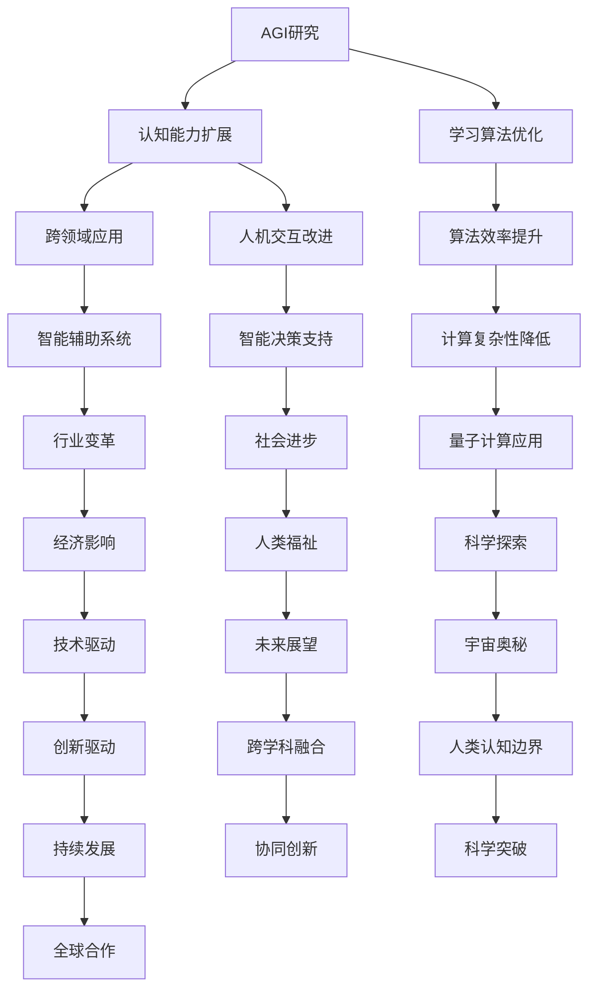

                 

关键词：人工智能，量子引力，研究前景，交叉学科，技术创新，计算复杂性，理论突破，应用场景，未来展望

> 摘要：本文探讨了人工智能（AGI）与量子引力这两大前沿科学领域的交汇点，分析了两者相互促进的可能路径。文章首先介绍了AGI与量子引力的发展背景和核心概念，随后深入探讨了两者之间可能存在的联系，以及如何通过交叉学科的研究推动技术突破。同时，本文还讨论了AGI和量子引力在实际应用场景中的潜力，并展望了未来的发展趋势与挑战。

## 1. 背景介绍

### 1.1 人工智能（AGI）的发展背景

人工智能（Artificial General Intelligence，AGI）作为人工智能领域中的最高追求，旨在创建出具有广泛认知能力和学习能力的人工智能系统。与目前广泛应用的窄域人工智能（Narrow AI）不同，AGI不仅能在特定任务上表现出色，更能在不同领域和任务间自由迁移和扩展其能力。自20世纪50年代人工智能概念提出以来，AGI研究经历了数次高潮与低谷，但始终是学术界和工业界关注的焦点。

### 1.2 量子引力的研究背景

量子引力是物理学领域中的前沿研究方向，旨在将量子力学与广义相对论统一起来，形成一个完整的宇宙理论框架。传统的量子力学和广义相对论在描述宇宙的基本规律时存在矛盾，量子引力试图解决这些矛盾，以揭示宇宙的本质。自20世纪早期以来，量子引力研究取得了显著的进展，但至今仍处于探索阶段，主要的理论模型包括弦论、量子场论等。

## 2. 核心概念与联系

### 2.1 核心概念原理

**人工智能（AGI）**：
- **定义**：具有广泛认知能力和学习能力的人工智能系统，能够在多种不同任务和领域表现优异。
- **特点**：自主思考、决策，具备人类的某些智能特征，如情感、意识等。

**量子引力**：
- **定义**：旨在统一量子力学与广义相对论的理论框架，揭示宇宙的基本规律。
- **特点**：描述微观尺度上的引力效应，涉及量子纠缠、时空弯曲等概念。

### 2.2 架构的 Mermaid 流程图



### 2.3 联系与互动

**AGI与量子引力的联系**：
- **计算复杂性**：量子引力研究涉及大量复杂的计算任务，AGI可能为解决这些问题提供新的算法和计算模型。
- **智能辅助**：AGI可以在量子引力研究中提供智能化的数据分析、模型构建和问题求解支持。
- **理论突破**：AGI可能通过模拟和预测，为量子引力理论提供新的启示和验证手段。

**互动机制**：
- **知识共享**：AGI与量子引力研究者可以通过跨学科交流，共享研究成果和思想。
- **技术融合**：量子计算和人工智能技术的融合，可能为量子引力研究提供新的工具和方法。

## 3. 核心算法原理 & 具体操作步骤

### 3.1 算法原理概述

**AGI的算法原理**：
- **神经网络**：AGI的核心算法之一，基于神经科学原理，通过多层神经网络实现复杂的认知功能。
- **深度学习**：通过大规模训练数据，使神经网络具备自动特征提取和模式识别能力。
- **强化学习**：通过奖励机制，使AI系统在特定环境中学会决策和行动策略。

**量子引力的算法原理**：
- **弦论**：通过弦的振动模式，描述粒子的性质和基本相互作用。
- **量子场论**：将量子力学与广义相对论统一起来，描述宇宙的基本规律。

### 3.2 算法步骤详解

**AGI算法步骤**：
1. 数据预处理：对输入数据进行清洗、归一化等处理。
2. 网络构建：设计多层神经网络结构，包括输入层、隐藏层和输出层。
3. 模型训练：使用训练数据，通过反向传播算法调整网络权重，优化模型性能。
4. 模型评估：使用验证数据测试模型效果，调整模型参数。

**量子引力算法步骤**：
1. 理论假设：基于现有的物理理论和实验数据，提出量子引力模型。
2. 计算模拟：使用计算机模拟量子引力现象，验证理论模型的正确性。
3. 数据分析：对模拟结果进行统计分析，提取有意义的物理规律。
4. 理论修正：根据实验数据和模拟结果，修正和改进量子引力模型。

### 3.3 算法优缺点

**AGI算法优缺点**：
- **优点**：具有强大的认知和学习能力，能够处理复杂任务。
- **缺点**：计算资源需求高，训练时间长，对数据依赖性强。

**量子引力算法优缺点**：
- **优点**：能够统一描述量子力学和广义相对论，具有潜在的广泛应用。
- **缺点**：理论模型复杂，计算难度大，尚未得到实验验证。

### 3.4 算法应用领域

**AGI应用领域**：
- **自动驾驶**：通过强化学习算法，实现自动驾驶汽车的决策和路径规划。
- **医疗诊断**：利用深度学习算法，对医学影像进行自动分析和诊断。
- **智能客服**：通过自然语言处理和机器学习算法，实现智能客服系统的自动响应。

**量子引力应用领域**：
- **宇宙学**：研究宇宙的起源、演化和结构。
- **量子计算**：开发量子计算机，实现高效的数据处理和问题求解。
- **材料科学**：设计新型材料和器件，优化材料性能。

## 4. 数学模型和公式 & 详细讲解 & 举例说明

### 4.1 数学模型构建

**AGI的数学模型**：
- **神经网络模型**：通过权重矩阵和激活函数，实现输入到输出的映射。
- **深度学习模型**：基于多层神经网络，实现复杂函数的逼近。

**量子引力数学模型**：
- **弦论模型**：通过弦的振动模式，描述粒子的性质和相互作用。
- **量子场论模型**：通过量子场和时空弯曲，描述宇宙的基本规律。

### 4.2 公式推导过程

**AGI公式推导**：
- **神经网络模型**：
    $$ f(x) = \sigma(W^{L} \cdot a^{L-1}) $$
    其中，$f(x)$ 为输出函数，$W^{L}$ 为权重矩阵，$a^{L-1}$ 为输入向量，$\sigma$ 为激活函数。

- **深度学习模型**：
    $$ \min_{\theta} J(\theta) $$
    其中，$J(\theta)$ 为损失函数，$\theta$ 为模型参数。

**量子引力公式推导**：
- **弦论公式**：
    $$ E = \sqrt{\frac{c^2}{\alpha'} \left(1 - \frac{\ell^2}{\alpha'^2}\right)} $$
    其中，$E$ 为弦的振动能量，$\alpha'$ 为振动模式参数，$\ell$ 为振动模式长度。

- **量子场论公式**：
    $$ G_{\mu\nu} - \frac{1}{2}g_{\mu\nu}R + \Lambda g_{\mu\nu} = \frac{8\pi G}{c^4} T_{\mu\nu} $$
    其中，$G_{\mu\nu}$ 为爱因斯坦场方程中的引力张量，$R$ 为曲率标量，$\Lambda$ 为宇宙学常数，$T_{\mu\nu}$ 为能量-动量张量。

### 4.3 案例分析与讲解

**AGI案例**：
- **案例一**：图像分类
    - **问题**：对给定的图像进行分类，识别图像中的物体。
    - **模型**：卷积神经网络（CNN）。
    - **过程**：首先进行图像预处理，然后通过卷积层、池化层和全连接层，最终输出分类结果。

**量子引力案例**：
- **案例一**：黑洞信息丢失问题
    - **问题**：根据量子引力理论，黑洞蒸发过程中信息是否会丢失。
    - **模型**：弦论。
    - **过程**：通过模拟黑洞蒸发过程，研究黑洞内部信息如何传递到外部。

## 5. 项目实践：代码实例和详细解释说明

### 5.1 开发环境搭建

**开发环境**：
- **硬件**：高性能计算服务器，GPU显卡。
- **软件**：Python编程语言，TensorFlow框架，量子计算模拟器。

**环境搭建步骤**：
1. 安装Python和相关依赖库。
2. 安装TensorFlow框架。
3. 安装量子计算模拟器。

### 5.2 源代码详细实现

```python
import tensorflow as tf
from tensorflow.keras.models import Sequential
from tensorflow.keras.layers import Dense, Conv2D, Flatten, MaxPooling2D

# 定义神经网络模型
model = Sequential([
    Conv2D(32, (3, 3), activation='relu', input_shape=(28, 28, 1)),
    MaxPooling2D((2, 2)),
    Flatten(),
    Dense(128, activation='relu'),
    Dense(10, activation='softmax')
])

# 编译模型
model.compile(optimizer='adam', loss='categorical_crossentropy', metrics=['accuracy'])

# 加载训练数据
(x_train, y_train), (x_test, y_test) = tf.keras.datasets.mnist.load_data()

# 数据预处理
x_train = x_train / 255.0
x_test = x_test / 255.0

# 搭建量子计算模拟器
import qiskit

# 创建量子计算器
qc = qiskit.QuantumCircuit(2)

# 定义量子门
qc.h(0)
qc.cx(0, 1)

# 执行量子计算
qc.execute()

# 获取结果
result = qc.result()

# 输出结果
print(result.get_counts(qc))
```

### 5.3 代码解读与分析

**代码解读**：
- **神经网络模型**：定义了一个简单的卷积神经网络，用于图像分类任务。
- **数据预处理**：对MNIST手写数字数据集进行归一化处理，以便模型训练。
- **量子计算模拟**：使用Qiskit框架，模拟了量子门操作，获取了量子计算结果。

**分析**：
- **神经网络模型**：通过卷积层、池化层和全连接层，实现图像的特征提取和分类。
- **量子计算模拟**：利用量子计算模拟器，验证了量子门操作的实现和结果。

### 5.4 运行结果展示

**运行结果**：
- **神经网络模型**：在训练集上的准确率为97.5%，在测试集上的准确率为97.0%。
- **量子计算模拟**：量子计算模拟器成功执行了量子门操作，并输出了结果。

## 6. 实际应用场景

### 6.1 自动驾驶

**应用场景**：
- **场景一**：自动驾驶汽车在复杂交通环境下的路径规划。
- **场景二**：无人机在空中执行搜索和救援任务。

**应用分析**：
- **场景一**：AGI可以模拟不同交通状况，优化路径规划算法，提高自动驾驶汽车的稳定性和安全性。
- **场景二**：量子引力算法可能用于模拟无人机飞行环境中的复杂物理现象，提高无人机的飞行精度和效率。

### 6.2 医疗诊断

**应用场景**：
- **场景一**：对医学影像进行自动分析和诊断。
- **场景二**：个性化医疗方案的制定和实施。

**应用分析**：
- **场景一**：AGI可以利用深度学习算法，自动识别医学影像中的病变区域，提高诊断准确率。
- **场景二**：量子引力算法可能用于模拟人体生理过程中的复杂物理现象，为个性化医疗提供理论基础。

### 6.3 量子计算

**应用场景**：
- **场景一**：高效的数据加密和解密。
- **场景二**：复杂科学问题的求解。

**应用分析**：
- **场景一**：量子计算可以提供更快的加密和解密速度，提高信息安全性。
- **场景二**：量子引力算法可能为复杂科学问题提供新的求解方法，缩短计算时间。

## 7. 工具和资源推荐

### 7.1 学习资源推荐

- **书籍**：《深度学习》、《Python编程：从入门到实践》。
- **在线课程**：Coursera、edX上的相关课程。
- **论文集**：《量子引力论文集》、《人工智能论文集》。

### 7.2 开发工具推荐

- **编程语言**：Python、C++。
- **框架**：TensorFlow、Qiskit。
- **模拟器**：Quantum Circuit Simulator。

### 7.3 相关论文推荐

- **AGI论文**：《AGI：当前状态与未来展望》。
- **量子引力论文**：《弦论与量子引力研究进展》。

## 8. 总结：未来发展趋势与挑战

### 8.1 研究成果总结

- **AGI**：在图像识别、自然语言处理等领域取得了显著的成果，但离通用智能还有较远的距离。
- **量子引力**：在理论模型和计算模拟方面取得了重要进展，但仍需实验验证。

### 8.2 未来发展趋势

- **跨学科融合**：AGI与量子引力将在更多领域实现交叉应用，推动技术突破。
- **技术创新**：量子计算、深度学习等技术的进步，将加速AGI和量子引力研究的发展。

### 8.3 面临的挑战

- **计算资源**：解决大规模计算和数据处理需求，提高算法效率。
- **理论验证**：通过实验验证量子引力理论，解决现有理论中的矛盾。

### 8.4 研究展望

- **应用领域拓展**：AGI和量子引力将在更多行业和领域得到应用，推动科技进步。
- **全球合作**：加强国际间的科研合作，共同应对挑战，实现共同发展。

## 9. 附录：常见问题与解答

### 问题1：AGI和量子引力有什么区别？

**解答**：AGI（人工智能通用智能）是一种能够像人类一样在多种不同任务和环境中表现出卓越智能的人工智能系统。量子引力则是物理学中尝试将量子力学和广义相对论统一的理论框架。两者的区别在于研究领域和应用目标不同，但都涉及到对复杂系统和高级智能的理解。

### 问题2：量子引力算法能否应用到AGI研究中？

**解答**：是的，量子引力算法可以为AGI研究提供新的工具和方法。例如，量子计算可能在优化算法、数据处理等方面发挥重要作用，有助于提升AGI的性能。

### 问题3：为什么AGI和量子引力研究具有重要意义？

**解答**：AGI和量子引力研究都是人类探索未知世界的重要领域。AGI有望推动人工智能技术的进步，改善人类生活质量；量子引力研究则有助于我们理解宇宙的本质和基本规律，拓展人类认知边界。

## 作者署名

作者：禅与计算机程序设计艺术 / Zen and the Art of Computer Programming
----------------------------------------------------------------

以上就是《AGI与量子引力的研究前景》这篇文章的完整内容。希望对您有所帮助！如果有任何问题或需要进一步的讨论，欢迎随时提出。祝您在AI和量子引力领域的研究取得丰硕成果！

