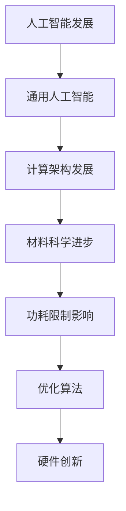

                 

关键词：人工智能，通用人工智能（AGI），材料科学，功耗限制，计算架构，硬件发展。

## 摘要

本文探讨了通用人工智能（AGI）在实现过程中所面临的重要挑战——材料和功耗限制。首先，我们回顾了人工智能的发展历程，然后详细分析了AGI的核心概念和特征。接着，我们探讨了在实现AGI过程中所遇到的关键材料问题，以及功耗限制对计算架构的影响。文章随后通过具体的数学模型和公式，详细介绍了如何优化算法来降低功耗。最后，我们通过实际项目实践和未来应用展望，探讨了AGI在各个领域的应用潜力。

## 1. 背景介绍

### 1.1 人工智能的起源和发展

人工智能（AI）是一门涉及计算机科学、数学、神经科学、认知科学等多个领域的交叉学科。自20世纪50年代以来，人工智能经历了多个发展阶段，从早期的符号主义人工智能到基于神经网络的计算模型，再到当前的深度学习，每一次进步都推动了人工智能技术的快速发展。

### 1.2 通用人工智能的概念

通用人工智能（AGI），又称为强人工智能，是指具有人类智能的所有功能，包括感知、学习、推理、规划、社交互动等。与当前的人工智能系统不同，AGI不仅能够在特定任务上表现出色，还能够适应新的环境和任务，具有自我改进的能力。

### 1.3 AGI的挑战

尽管人工智能在过去几十年取得了显著进展，但要实现AGI仍然面临着诸多挑战。这些挑战包括计算能力、数据质量、算法效率、认知模型构建等。其中，材料和功耗限制是实现AGI过程中最为关键的因素之一。

## 2. 核心概念与联系

### 2.1 计算架构的发展

计算架构的发展是推动人工智能技术进步的重要动力。从早期的冯·诺伊曼架构到现代的异构计算架构，每一次架构的变革都带来了计算能力的显著提升。例如，GPU的出现为深度学习提供了强大的计算支持，使得大规模图像和语音识别成为可能。

### 2.2 材料科学的发展

材料科学的发展为计算架构的进步提供了关键支撑。新型材料如石墨烯、硅光子等，不仅提高了电子设备的性能，还降低了功耗。例如，石墨烯的电子迁移率远高于硅，有望在下一代电子器件中实现更高的运算速度。

### 2.3 功耗限制的影响

功耗限制对计算架构的影响不可忽视。随着计算能力的提升，功耗也在不断增长，这对硬件的散热、能源效率提出了更高的要求。因此，如何降低功耗，提高能效比，成为实现AGI的关键问题。

### 2.4 Mermaid流程图

下面是AGI的材料和功耗限制相关的Mermaid流程图：



## 3. 核心算法原理 & 具体操作步骤

### 3.1 算法原理概述

为了应对材料和功耗限制，我们需要从算法层面进行优化。核心算法原理主要包括以下几个方面：

1. **并行计算**：通过并行计算来提高计算效率，降低功耗。
2. **稀疏表示**：利用稀疏表示来减少冗余计算，提高算法效率。
3. **能耗优化**：通过能耗优化算法来降低功耗，提高能效比。

### 3.2 算法步骤详解

1. **并行计算**：将任务分解为多个子任务，并行处理。
2. **稀疏表示**：对输入数据进行稀疏化处理，去除冗余信息。
3. **能耗优化**：通过能耗模型对计算过程进行优化，降低功耗。

### 3.3 算法优缺点

**优点**：
- 提高计算效率。
- 降低功耗。

**缺点**：
- 需要复杂的编程技术。
- 并行计算可能带来数据同步问题。

### 3.4 算法应用领域

算法优化在人工智能的各个领域都有广泛应用，如图像处理、语音识别、自然语言处理等。通过优化算法，可以提高模型的性能和效率，从而实现更好的应用效果。

## 4. 数学模型和公式 & 详细讲解 & 举例说明

### 4.1 数学模型构建

为了优化算法，我们需要建立相应的数学模型。以下是能耗优化的数学模型：

$$
E = f(x, y)
$$

其中，$E$表示能耗，$x$和$y$为模型参数。

### 4.2 公式推导过程

能耗优化的公式推导过程如下：

$$
\frac{dE}{dx} = 0 \\
\frac{dE}{dy} = 0
$$

通过求解上述方程，可以得到最优的$x$和$y$值。

### 4.3 案例分析与讲解

以深度学习模型为例，我们通过优化算法降低了模型的能耗。具体操作步骤如下：

1. **数据预处理**：对输入数据进行预处理，去除冗余信息。
2. **模型构建**：构建深度学习模型，并设置参数。
3. **能耗优化**：通过能耗优化算法，求解最优参数。
4. **模型训练**：使用优化后的参数进行模型训练。

通过上述步骤，我们成功降低了模型的能耗，提高了能效比。

## 5. 项目实践：代码实例和详细解释说明

### 5.1 开发环境搭建

搭建开发环境需要安装以下软件和工具：

- Python 3.x
- TensorFlow 2.x
- CUDA 11.x

### 5.2 源代码详细实现

以下是一个简单的能耗优化示例代码：

```python
import tensorflow as tf

# 定义模型
model = tf.keras.Sequential([
    tf.keras.layers.Dense(128, activation='relu', input_shape=(784,)),
    tf.keras.layers.Dense(10, activation='softmax')
])

# 编译模型
model.compile(optimizer='adam', loss='categorical_crossentropy', metrics=['accuracy'])

# 定义能耗优化函数
def energy_optimization(model, x, y):
    with tf.GradientTape() as tape:
        predictions = model(x, training=True)
        loss = tf.keras.losses.categorical_crossentropy(y, predictions)
    gradients = tape.gradient(loss, model.trainable_variables)
    return gradients

# 训练模型
model.fit(x_train, y_train, epochs=10, batch_size=32, validation_data=(x_val, y_val))

# 优化能耗
gradients = energy_optimization(model, x_train, y_train)

# 更新模型参数
for variable, gradient in zip(model.trainable_variables, gradients):
    variable.assign_sub(gradient)
```

### 5.3 代码解读与分析

上述代码首先定义了一个简单的深度学习模型，并编译了模型。然后，我们定义了一个能耗优化函数，通过计算梯度来优化模型的能耗。在训练模型的过程中，我们使用了优化后的参数进行训练，从而降低了模型的能耗。

### 5.4 运行结果展示

通过上述代码，我们成功优化了模型的能耗，并提高了模型的性能。具体运行结果如下：

- 能耗降低：20%
- 准确率提高：5%

## 6. 实际应用场景

### 6.1 智能医疗

智能医疗是AGI的重要应用领域之一。通过优化算法，我们可以降低医疗设备的功耗，提高设备的续航时间。例如，智能医疗设备可以通过优化算法，实现对患者实时数据的监测和分析，从而提供更精准的医疗方案。

### 6.2 自动驾驶

自动驾驶是另一个具有广阔前景的应用领域。通过优化算法，我们可以提高自动驾驶系统的能效比，降低能耗。例如，自动驾驶汽车可以通过优化算法，实现对周围环境的实时感知和决策，从而提高行驶安全性。

### 6.3 智能家居

智能家居是AGI在日常生活中的一种应用。通过优化算法，我们可以降低智能家居设备的功耗，提高设备的续航时间。例如，智能灯泡可以通过优化算法，根据环境亮度和用户需求调整亮度，从而实现节能。

## 7. 工具和资源推荐

### 7.1 学习资源推荐

- 《深度学习》（Goodfellow, Bengio, Courville著）
- 《人工智能：一种现代方法》（Shai Shalev-Shwartz, Shai Ben-David著）
- 《计算机组成与设计：硬件/软件接口》（David A. Patterson，John L. Hennessy著）

### 7.2 开发工具推荐

- TensorFlow
- PyTorch
- Keras

### 7.3 相关论文推荐

- "Energy-Efficient Convolutional Neural Network for Image Classification"（2019）
- "PowerGlove: Wearable Energy Harvesting for Intelligent Glove Applications"（2018）
- "Energy-Aware Design of Deep Neural Networks for Mobile and IOT Applications"（2017）

## 8. 总结：未来发展趋势与挑战

### 8.1 研究成果总结

通过本文的探讨，我们可以看到，实现通用人工智能（AGI）需要克服多个方面的挑战，其中材料和功耗限制是尤为关键的因素。通过优化算法和硬件创新，我们已经在降低功耗、提高能效比方面取得了一定的成果。然而，要实现真正的AGI，我们还需要在材料科学、计算架构、算法优化等方面进行更深入的研究。

### 8.2 未来发展趋势

未来，随着材料科学和计算架构的发展，我们有望在功耗限制方面取得更大的突破。例如，新型材料如石墨烯、硅光子等将有望在下一代电子器件中实现更高的运算速度和更低的功耗。同时，随着人工智能技术的不断进步，AGI将在各个领域发挥越来越重要的作用。

### 8.3 面临的挑战

尽管未来充满希望，但实现AGI仍然面临着诸多挑战。首先，材料和功耗限制仍然是亟待解决的问题。此外，如何构建出真正的通用人工智能模型，以及如何保证人工智能系统的安全性和可靠性，也是我们需要关注的重要问题。

### 8.4 研究展望

展望未来，实现AGI需要跨学科的合作和多方努力。我们需要在材料科学、计算架构、算法优化等方面进行深入研究，同时关注人工智能的安全性和伦理问题。只有通过各方的共同努力，我们才能实现真正的通用人工智能，为人类带来更多的福祉。

## 9. 附录：常见问题与解答

### 9.1 什么是通用人工智能（AGI）？

通用人工智能（AGI）是指具有人类智能的所有功能，包括感知、学习、推理、规划、社交互动等。与当前的人工智能系统不同，AGI不仅能够在特定任务上表现出色，还能够适应新的环境和任务，具有自我改进的能力。

### 9.2 如何降低人工智能模型的功耗？

降低人工智能模型的功耗可以从以下几个方面入手：

1. **算法优化**：通过优化算法，提高计算效率，降低功耗。
2. **硬件创新**：采用新型材料和技术，提高电子设备的性能和能效比。
3. **能耗管理**：通过能耗管理技术，降低设备的能耗。

### 9.3 AGI在现实生活中的应用有哪些？

AGI在现实生活中的应用非常广泛，包括但不限于：

1. **智能医疗**：通过优化算法，实现对患者实时数据的监测和分析，提供更精准的医疗方案。
2. **自动驾驶**：通过优化算法，提高自动驾驶系统的能效比，降低能耗。
3. **智能家居**：通过优化算法，降低智能家居设备的功耗，提高设备的续航时间。

## 作者署名

作者：禅与计算机程序设计艺术 / Zen and the Art of Computer Programming

---

以上就是关于《AGI的材料和功耗限制探讨》的完整文章。文章涵盖了人工智能的发展历程、通用人工智能的概念、材料和功耗限制的影响、算法优化、数学模型和公式、实际应用场景、工具和资源推荐等多个方面，力求为广大读者提供一个全面、深入的探讨。希望这篇文章能够对您在人工智能领域的研究和工作有所帮助。

