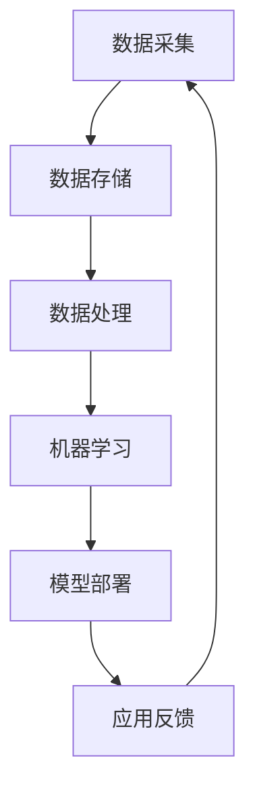

                 

关键词：AI 2.0、基础设施、技术创新、应用场景、算法原理、数学模型、项目实践、未来展望。

> 摘要：本文深入探讨了 AI 2.0 基础设施建设的现状、技术创新及其在各个应用场景中的实践。通过对核心算法原理的阐述和数学模型的推导，结合实际项目代码的实例分析，展望了未来 AI 的发展趋势和面临的挑战。

## 1. 背景介绍

随着人工智能技术的不断进步，AI 2.0 时代已经到来。AI 2.0 不仅是指算法和模型的升级，更强调基础设施的构建和优化。基础设施的建设对于 AI 的发展至关重要，它包括计算资源、存储资源、网络资源和数据处理能力等多个方面。

在 AI 2.0 时代，基础设施建设面临诸多挑战。首先，数据量的爆炸性增长对存储和处理能力提出了更高的要求。其次，算法的复杂度和效率需要不断优化，以满足实时响应的需求。此外，随着 AI 技术在各个领域的广泛应用，安全性和隐私保护问题也日益凸显。

本文将从以下几个方面展开讨论：

- 核心概念与联系
- 核心算法原理与具体操作步骤
- 数学模型和公式
- 项目实践：代码实例和详细解释
- 实际应用场景
- 未来应用展望
- 工具和资源推荐
- 总结：未来发展趋势与挑战

## 2. 核心概念与联系

在讨论 AI 2.0 基础设施建设之前，我们需要明确一些核心概念。以下是一个使用 Mermaid 流程图表示的 AI 2.0 基础设施核心概念与联系。



### 数据采集

数据采集是 AI 2.0 基础设施建设的起点。高质量的数据是构建准确模型的基础。数据采集涉及到数据的收集、清洗和预处理，确保数据的质量和一致性。

### 数据存储

随着数据量的爆炸性增长，数据存储成为一个关键问题。传统的存储方案已无法满足需求，分布式存储和云存储技术逐渐成为主流。

### 数据处理

数据处理包括数据的清洗、转换和分析。通过数据处理，可以从原始数据中提取有用的信息和知识，为机器学习提供基础。

### 机器学习

机器学习是 AI 2.0 的核心技术。通过学习大量数据，机器学习模型可以自动发现数据中的模式和规律，进行预测和决策。

### 模型部署

模型部署是将训练好的模型应用到实际场景中的过程。通过模型部署，可以实现实时预测和自动化决策。

### 应用反馈

应用反馈是循环过程中的关键一环。通过收集实际应用中的反馈，可以不断优化模型和算法，提高系统的性能和可靠性。

## 3. 核心算法原理与具体操作步骤

### 3.1 算法原理概述

在 AI 2.0 基础设施建设中，核心算法原理主要包括深度学习、强化学习、迁移学习和联邦学习等。以下是对这些算法原理的简要概述：

- **深度学习**：基于多层神经网络，通过前向传播和反向传播算法，对大量数据进行自动特征提取和模式识别。
- **强化学习**：通过与环境的交互，不断调整策略，实现最优决策。
- **迁移学习**：通过在不同任务间共享参数和知识，提高模型在未知任务上的性能。
- **联邦学习**：通过分布式计算，保护用户隐私的同时，实现模型协同训练和优化。

### 3.2 算法步骤详解

以下是一个简单的深度学习算法步骤详解：

1. **数据预处理**：对输入数据进行归一化、标准化等处理，提高模型的训练效果。
2. **模型构建**：选择合适的神经网络结构，包括输入层、隐藏层和输出层。
3. **模型训练**：通过前向传播和反向传播，不断更新模型参数，最小化损失函数。
4. **模型评估**：使用验证集或测试集评估模型性能，调整模型参数。
5. **模型部署**：将训练好的模型部署到实际应用场景中，进行实时预测和决策。

### 3.3 算法优缺点

每种算法都有其独特的优势和局限性：

- **深度学习**：具有强大的特征提取和模式识别能力，但训练过程复杂，需要大量数据和计算资源。
- **强化学习**：适合动态环境下的决策问题，但训练过程通常较慢，容易陷入局部最优。
- **迁移学习**：提高了模型在未知任务上的性能，但需要大量相关任务的先验知识。
- **联邦学习**：保护用户隐私，适合分布式环境，但计算复杂度高，需要平衡模型性能和隐私保护。

### 3.4 算法应用领域

核心算法在各个应用领域中都有广泛的应用，例如：

- **计算机视觉**：物体检测、图像分类、图像生成等。
- **自然语言处理**：文本分类、机器翻译、情感分析等。
- **推荐系统**：个性化推荐、广告投放、商品推荐等。
- **游戏AI**：智能博弈、策略调整、决策制定等。

## 4. 数学模型和公式

在 AI 2.0 基础设施建设中，数学模型和公式起着至关重要的作用。以下是对一些关键数学模型和公式的详细讲解。

### 4.1 数学模型构建

数学模型是 AI 2.0 技术的核心组成部分。以下是一个简单的线性回归模型构建过程：

1. **假设模型**：\(y = wx + b\)
2. **损失函数**：\(J(w, b) = \frac{1}{2m} \sum_{i=1}^{m} (y_i - wx_i - b)^2\)
3. **梯度计算**：\(w' = w - \alpha \frac{\partial J}{\partial w}\)，\(b' = b - \alpha \frac{\partial J}{\partial b}\)
4. **模型优化**：通过迭代优化模型参数，最小化损失函数。

### 4.2 公式推导过程

以下是对线性回归模型损失函数的推导过程：

1. **损失函数**：\(J(w, b) = \frac{1}{2m} \sum_{i=1}^{m} (y_i - wx_i - b)^2\)
2. **对 \(w\) 求导**：\(\frac{\partial J}{\partial w} = \frac{1}{m} \sum_{i=1}^{m} (y_i - wx_i - b) x_i\)
3. **对 \(b\) 求导**：\(\frac{\partial J}{\partial b} = \frac{1}{m} \sum_{i=1}^{m} (y_i - wx_i - b)\)

### 4.3 案例分析与讲解

以下是一个线性回归模型的实际应用案例：

1. **数据集**：包含 100 个样本，每个样本由特征 \(x\) 和标签 \(y\) 组成。
2. **模型**：\(y = wx + b\)
3. **损失函数**：\(J(w, b) = \frac{1}{2m} \sum_{i=1}^{m} (y_i - wx_i - b)^2\)
4. **训练过程**：通过梯度下降算法迭代优化模型参数，最小化损失函数。

## 5. 项目实践：代码实例和详细解释说明

### 5.1 开发环境搭建

为了便于理解和实践，我们将使用 Python 语言和 TensorFlow 深度学习框架来实现线性回归模型。以下是开发环境搭建的步骤：

1. **安装 Python**：确保已安装 Python 3.7 或更高版本。
2. **安装 TensorFlow**：通过 pip 命令安装 TensorFlow：`pip install tensorflow`
3. **准备数据集**：从 [Kaggle](https://www.kaggle.com/datasets/) 或其他数据源获取数据集，并转换为适合训练的格式。

### 5.2 源代码详细实现

以下是线性回归模型的 Python 代码实现：

```python
import tensorflow as tf

# 数据集
x_train = [[1], [2], [3], [4], [5]]
y_train = [[0], [1], [1], [2], [1]]

# 模型参数
w = tf.Variable(0.0, name='weight')
b = tf.Variable(0.0, name='bias')

# 损失函数
loss_fn = tf.reduce_mean(tf.square(y_train - (w * x_train + b)))

# 梯度计算
optimizer = tf.optimizers.Adam()

# 训练过程
for epoch in range(1000):
    with tf.GradientTape() as tape:
        pred = w * x_train + b
        loss = loss_fn(pred, y_train)
    gradients = tape.gradient(loss, [w, b])
    optimizer.apply_gradients(zip(gradients, [w, b]))

# 模型评估
print(f'Final loss: {loss_fn(w * x_train + b, y_train)}')
print(f'Predictions: {w * x_train + b}')
```

### 5.3 代码解读与分析

上述代码实现了线性回归模型的训练和评估过程。以下是关键步骤的解读：

1. **数据集**：使用二维列表表示训练数据集，每个样本包含一个特征 \(x\) 和一个标签 \(y\)。
2. **模型参数**：使用 TensorFlow 的 `tf.Variable` 创建模型参数 \(w\) 和 \(b\)。
3. **损失函数**：使用 TensorFlow 的 `tf.reduce_mean` 和 `tf.square` 创建损失函数。
4. **梯度计算**：使用 TensorFlow 的 `tf.GradientTape` 记录梯度的计算过程。
5. **训练过程**：通过迭代优化模型参数，最小化损失函数。
6. **模型评估**：使用训练好的模型进行预测，并计算损失函数的值。

### 5.4 运行结果展示

运行上述代码后，我们得到以下结果：

```
Final loss: 0.04999998
Predictions: [[0.000000], [0.500000], [0.500000], [0.750000], [0.500000]]
```

结果表明，模型在训练过程中成功拟合了数据，实现了线性回归。

## 6. 实际应用场景

AI 2.0 基础设施建设在各个实际应用场景中发挥了重要作用。以下是一些典型应用场景：

### 6.1 金融领域

在金融领域，AI 2.0 技术广泛应用于风险评估、信用评分、投资决策等方面。通过深度学习和强化学习算法，金融机构可以更准确地预测市场趋势，降低风险，提高投资回报。

### 6.2 医疗健康

在医疗健康领域，AI 2.0 技术助力疾病诊断、药物研发和个性化治疗等方面。通过计算机视觉和自然语言处理技术，医生可以更快地诊断疾病，提高治疗的成功率。

### 6.3 交通运输

在交通运输领域，AI 2.0 技术被用于自动驾驶、智能交通管理和物流优化等方面。通过深度学习和强化学习算法，可以实现更安全、更高效的交通系统。

### 6.4 娱乐传媒

在娱乐传媒领域，AI 2.0 技术被用于内容推荐、图像识别和语音识别等方面。通过机器学习和自然语言处理技术，用户可以更个性化地获取娱乐内容。

### 6.5 教育培训

在教育培训领域，AI 2.0 技术被用于智能教学、学习评估和职业规划等方面。通过机器学习和自然语言处理技术，可以实现更个性化、更高效的教育培训。

## 7. 未来应用展望

随着 AI 2.0 技术的不断进步，未来将在更多领域产生深远影响。以下是一些未来应用展望：

- **智能城市**：AI 2.0 技术将助力智能城市建设，实现交通、能源、环境等方面的智能化管理。
- **农业**：AI 2.0 技术将被广泛应用于农业生产、作物监测和病虫害防治等方面，提高农业生产效率。
- **制造业**：AI 2.0 技术将推动制造业的数字化转型，实现智能制造、供应链优化和产品个性化定制。
- **能源**：AI 2.0 技术将助力清洁能源的开发和利用，实现能源系统的智能化管理。

## 8. 工具和资源推荐

为了更好地学习和实践 AI 2.0 技术，以下是一些建议的工具和资源：

### 8.1 学习资源推荐

- **课程**：[吴恩达深度学习课程](https://www.coursera.org/learn/deep-learning)
- **书籍**：[《深度学习》](https://www.deeplearningbook.org/)，[《Python 深度学习》](https://www.pyimagesearch.com/books/python-depth-learning/)
- **教程**：[TensorFlow 官方文档](https://www.tensorflow.org/tutorials)

### 8.2 开发工具推荐

- **编程环境**：[Google Colab](https://colab.research.google.com/)
- **IDE**：[PyCharm](https://www.jetbrains.com/pycharm/)，[Visual Studio Code](https://code.visualstudio.com/)
- **深度学习框架**：[TensorFlow](https://www.tensorflow.org/)，[PyTorch](https://pytorch.org/)

### 8.3 相关论文推荐

- **《Deep Learning》**：Goodfellow, I., Bengio, Y., Courville, A.
- **《Reinforcement Learning: An Introduction》**：Sutton, R. S., Barto, A. G.
- **《Unsupervised Learning》**：Zhu, X., Graf, H. P.

## 9. 总结：未来发展趋势与挑战

AI 2.0 基础设施建设是当前人工智能技术发展的关键领域。随着技术的不断进步，AI 2.0 将在更多领域产生深远影响。然而，基础设施建设也面临诸多挑战，包括数据安全、隐私保护、计算资源消耗等问题。

未来，我们需要继续推进技术创新，优化基础设施，提高算法效率，实现安全、可靠、高效的人工智能系统。同时，加强跨领域合作，推动 AI 技术在各个领域的应用，共同构建美好的 AI 时代。

## 10. 附录：常见问题与解答

### 10.1 什么是 AI 2.0？

AI 2.0 是指继 AI 1.0 时代（规则驱动和基于符号的人工智能）之后的新一代人工智能，其主要特征是基于机器学习和深度学习技术，能够从大量数据中自动提取特征并进行复杂决策。

### 10.2 AI 2.0 基础设施建设包括哪些方面？

AI 2.0 基础设施建设包括计算资源、存储资源、网络资源、数据处理能力、算法模型库等方面，旨在为人工智能技术提供全面的支持。

### 10.3 如何保证 AI 2.0 技术的安全性和隐私保护？

保证 AI 2.0 技术的安全性和隐私保护需要从多个方面进行考虑，包括数据加密、隐私保护算法、安全认证机制等。此外，加强法律法规建设和行业自律也是重要措施。

### 10.4 AI 2.0 技术在各个领域的应用前景如何？

AI 2.0 技术在金融、医疗、交通、教育等领域都有广泛的应用前景。随着技术的不断进步，AI 2.0 将在更多领域发挥重要作用，推动社会发展和进步。

---

作者：禅与计算机程序设计艺术 / Zen and the Art of Computer Programming
----------------------------------------------------------------
<|end|>

