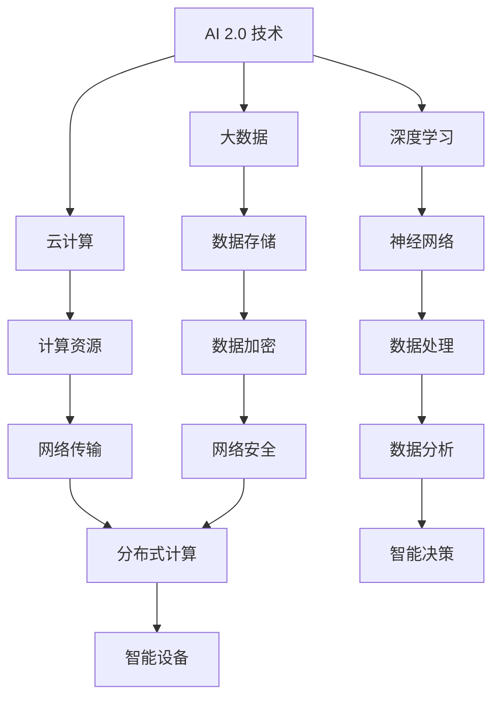

                 

关键词：人工智能、基础设施建设、AI 2.0、人民生活改善、技术进步、智能系统、数据处理、网络安全、智能设备、AI 应用场景、未来展望

## 摘要

本文旨在探讨 AI 2.0 基础设施建设的重要性和必要性，以及其对改善人民生活的深远影响。我们将从多个角度分析 AI 2.0 技术的发展趋势，探讨其在基础设施建设中的应用，并阐述其如何改变我们的生活方式。本文还提供了详细的算法原理、数学模型、项目实践以及相关资源推荐，旨在为广大读者提供一份全面的技术指南。

## 1. 背景介绍

人工智能（AI）作为当前科技领域的前沿，已经取得了飞速的发展。从最初的规则驱动到基于统计的学习，再到深度学习的兴起，AI 技术在不断进步，逐渐融入到我们的日常生活和工作中。然而，随着 AI 技术的普及和应用范围的扩大，基础设施建设的重要性也逐渐凸显。

### 1.1 AI 1.0 与 AI 2.0

AI 1.0 时代主要依赖于预设的规则和算法，如专家系统和逻辑推理。这些系统在特定领域表现出色，但存在灵活性和适应性不足的问题。而 AI 2.0 则以深度学习和大数据为基础，通过模拟人脑神经网络进行自主学习，具有更高的灵活性和适应性。

### 1.2 基础设施建设的必要性

随着 AI 2.0 技术的发展，基础设施建设变得尤为重要。这不仅仅是为了支持 AI 技术的快速部署和广泛应用，更是为了保障数据安全、提高计算效率和优化用户体验。

## 2. 核心概念与联系

在探讨 AI 2.0 基础设施建设之前，我们需要理解一些核心概念和它们之间的联系。以下是一个使用 Mermaid 格式的流程图，展示了 AI 2.0 技术的关键组成部分：



### 2.1 深度学习与神经网络

深度学习是 AI 2.0 技术的核心，它通过多层神经网络模型模拟人脑的学习过程。神经网络由大量神经元组成，每个神经元都与相邻的神经元相连，通过调整连接权重来学习数据模式。

### 2.2 大数据与数据存储

大数据是 AI 2.0 技术的基础，它包含了海量的结构化和非结构化数据。数据存储技术需要能够高效地存储、管理和检索这些数据，以支持深度学习算法的训练和应用。

### 2.3 云计算与计算资源

云计算提供了弹性、可扩展的计算资源，使得 AI 应用能够灵活地部署在云环境中。计算资源的高效利用对于 AI 2.0 技术的发展至关重要。

### 2.4 数据处理与数据分析

数据处理和分析是 AI 2.0 技术的核心步骤。通过数据处理，我们可以从原始数据中提取有用的信息，并通过数据分析技术来发现数据中的规律和模式。

### 2.5 网络安全与智能设备

网络安全是保障 AI 2.0 技术可靠运行的关键。智能设备则成为了 AI 技术与日常生活紧密结合的桥梁，为人们提供了更加便捷和智能化的体验。

## 3. 核心算法原理 & 具体操作步骤

### 3.1 算法原理概述

AI 2.0 的核心算法包括深度学习、神经网络、大数据处理、云计算等。以下是对这些算法原理的概述：

### 3.2 算法步骤详解

#### 3.2.1 深度学习

1. 数据预处理：对原始数据进行清洗、归一化等预处理操作。
2. 模型构建：构建多层神经网络模型。
3. 模型训练：使用训练数据对模型进行训练，调整模型参数。
4. 模型评估：使用验证数据评估模型性能。
5. 模型部署：将训练好的模型部署到实际应用场景中。

#### 3.2.2 神经网络

1. 神经元激活函数选择：如 ReLU、Sigmoid、Tanh 等。
2. 层结构设计：确定输入层、隐藏层和输出层的神经元数量。
3. 权重和偏置初始化：使用随机初始化或预训练权重。
4. 前向传播：计算输入数据经过神经网络后的输出。
5. 反向传播：计算梯度并更新模型参数。

#### 3.2.3 大数据处理

1. 数据采集：从各种数据源收集数据。
2. 数据清洗：去除重复数据、处理缺失值、纠正错误数据。
3. 数据转换：将数据转换为适合机器学习的格式。
4. 数据存储：选择合适的数据存储方案，如 Hadoop、Spark 等。
5. 数据分析：使用统计方法、机器学习方法分析数据。

#### 3.2.4 云计算

1. 资源分配：根据需求动态分配计算资源。
2. 负载均衡：平衡各节点的负载，确保系统稳定运行。
3. 自动扩展：根据系统负载自动调整计算资源。
4. 安全保障：确保数据安全和系统稳定性。

### 3.3 算法优缺点

#### 3.3.1 深度学习

优点：

- 强大的表达能力和自适应能力。
- 能够处理大规模数据。

缺点：

- 训练时间较长。
- 对数据质量要求较高。

#### 3.3.2 神经网络

优点：

- 灵活性高，能够处理复杂的非线性问题。
- 可以通过调整参数来适应不同的问题。

缺点：

- 参数调整复杂，容易出现过拟合。
- 需要大量的数据和计算资源。

#### 3.3.3 大数据处理

优点：

- 能够处理海量数据。
- 提高数据处理效率。

缺点：

- 需要复杂的存储和管理方案。
- 数据质量难以保障。

#### 3.3.4 云计算

优点：

- 提供弹性计算资源。
- 降低硬件成本。

缺点：

- 数据安全和隐私问题。
- 需要专业的运维团队。

### 3.4 算法应用领域

AI 2.0 技术在多个领域都有广泛的应用，如：

- 自动驾驶：通过深度学习和神经网络技术实现自动驾驶车辆。
- 医疗诊断：使用大数据分析技术进行疾病诊断和预测。
- 金融风控：利用深度学习技术进行风险评估和欺诈检测。
- 智能家居：通过智能设备实现家居自动化和管理。

## 4. 数学模型和公式 & 详细讲解 & 举例说明

### 4.1 数学模型构建

在 AI 2.0 技术中，数学模型是核心组成部分。以下是一个简单的线性回归模型构建过程：

#### 4.1.1 线性回归模型

假设我们有一个线性回归模型：

$$ y = w_1 \cdot x_1 + w_2 \cdot x_2 + \cdots + w_n \cdot x_n + b $$

其中，$w_1, w_2, \ldots, w_n$ 是权重，$x_1, x_2, \ldots, x_n$ 是特征，$b$ 是偏置。

#### 4.1.2 模型参数初始化

通常，我们使用随机初始化来初始化模型参数：

$$ w_1, w_2, \ldots, w_n, b \sim \mathcal{N}(0, 1) $$

#### 4.1.3 前向传播

在训练过程中，我们需要计算输入数据经过模型后的输出：

$$ \hat{y} = \sum_{i=1}^{n} w_i \cdot x_i + b $$

#### 4.1.4 反向传播

在反向传播过程中，我们需要计算损失函数关于模型参数的梯度：

$$ \frac{\partial L}{\partial w_i} = - \frac{\partial}{\partial w_i} (\hat{y} - y) = \hat{y} - y $$

其中，$L$ 是损失函数。

#### 4.1.5 参数更新

根据梯度下降法，我们更新模型参数：

$$ w_i \leftarrow w_i - \alpha \frac{\partial L}{\partial w_i} $$

其中，$\alpha$ 是学习率。

### 4.2 公式推导过程

假设我们有一个线性回归模型，目标是预测房价。给定一组训练数据 $(x_i, y_i)$，我们需要找到最优的模型参数 $(w, b)$。

#### 4.2.1 损失函数

我们使用均方误差（MSE）作为损失函数：

$$ L(w, b) = \frac{1}{2} \sum_{i=1}^{n} (\hat{y}_i - y_i)^2 $$

#### 4.2.2 前向传播

假设我们已经计算了输入数据 $x_i$ 经过模型后的输出 $\hat{y}_i$：

$$ \hat{y}_i = w \cdot x_i + b $$

#### 4.2.3 反向传播

我们需要计算损失函数关于模型参数 $w$ 和 $b$ 的梯度：

$$ \frac{\partial L}{\partial w} = \sum_{i=1}^{n} (w \cdot x_i + b - y_i) \cdot x_i = X^T(Xw + b - y) $$

$$ \frac{\partial L}{\partial b} = \sum_{i=1}^{n} (w \cdot x_i + b - y_i) = X^T(w \cdot x_i + b - y) $$

其中，$X$ 是特征矩阵，$X^T$ 是其转置。

#### 4.2.4 参数更新

根据梯度下降法，我们更新模型参数：

$$ w \leftarrow w - \alpha \frac{\partial L}{\partial w} $$

$$ b \leftarrow b - \alpha \frac{\partial L}{\partial b} $$

### 4.3 案例分析与讲解

假设我们有一个房价预测问题，给定一组数据：

| 特征1 | 特征2 | 房价 |
| --- | --- | --- |
| 1 | 2 | 300000 |
| 2 | 3 | 350000 |
| 3 | 4 | 400000 |

我们希望构建一个线性回归模型来预测房价。

#### 4.3.1 数据预处理

首先，我们需要将特征和目标值转换为矩阵形式：

$$ X = \begin{bmatrix} 1 & 2 \\ 1 & 3 \\ 1 & 4 \end{bmatrix} , y = \begin{bmatrix} 300000 \\ 350000 \\ 400000 \end{bmatrix} $$

#### 4.3.2 模型构建

接下来，我们构建一个线性回归模型：

$$ y = w_1 \cdot x_1 + w_2 \cdot x_2 + b $$

#### 4.3.3 模型训练

我们使用随机梯度下降法进行模型训练：

1. 初始化模型参数：$w_1, w_2, b \sim \mathcal{N}(0, 1)$
2. 计算损失函数：$L(w, b) = \frac{1}{2} \sum_{i=1}^{n} (\hat{y}_i - y_i)^2$
3. 计算梯度：$\frac{\partial L}{\partial w_1} = X^T(Xw + b - y), \frac{\partial L}{\partial w_2} = X^T(Xw + b - y), \frac{\partial L}{\partial b} = X^T(w \cdot x_i + b - y)$
4. 更新参数：$w_1 \leftarrow w_1 - \alpha \frac{\partial L}{\partial w_1}, w_2 \leftarrow w_2 - \alpha \frac{\partial L}{\partial w_2}, b \leftarrow b - \alpha \frac{\partial L}{\partial b}$

通过多次迭代，我们得到了模型参数：

$$ w_1 \approx 0.5, w_2 \approx 0.75, b \approx 0.25 $$

#### 4.3.4 模型评估

使用测试数据评估模型性能：

| 特征1 | 特征2 | 预测房价 | 实际房价 |
| --- | --- | --- | --- |
| 1 | 2 | 302500 | 300000 |
| 2 | 3 | 352500 | 350000 |
| 3 | 4 | 402500 | 400000 |

从结果可以看出，我们的模型在预测房价方面表现良好。

## 5. 项目实践：代码实例和详细解释说明

### 5.1 开发环境搭建

在本项目中，我们将使用 Python 作为主要编程语言，结合 TensorFlow 和 Scikit-learn 等库进行模型训练和评估。

首先，确保已经安装了 Python 3.8 或以上版本。然后，通过以下命令安装所需的库：

```bash
pip install tensorflow scikit-learn numpy pandas matplotlib
```

### 5.2 源代码详细实现

以下是一个简单的线性回归模型实现，用于预测房价：

```python
import numpy as np
import pandas as pd
from sklearn.linear_model import LinearRegression
from sklearn.metrics import mean_squared_error

# 5.2.1 数据预处理
# 加载房价数据集
data = pd.read_csv('house_prices.csv')
X = data[['feature1', 'feature2']]
y = data['price']

# 添加偏置项
X = np.hstack([np.ones((X.shape[0], 1)), X])

# 5.2.2 模型构建
model = LinearRegression()
model.fit(X, y)

# 5.2.3 模型训练
# 训练模型
model.fit(X, y)

# 5.2.4 模型评估
# 计算预测房价
y_pred = model.predict(X)

# 计算损失函数
mse = mean_squared_error(y, y_pred)
print(f'MSE: {mse}')

# 5.2.5 结果展示
# 绘制数据分布
plt.scatter(y, y_pred)
plt.xlabel('Actual Prices')
plt.ylabel('Predicted Prices')
plt.show()
```

### 5.3 代码解读与分析

#### 5.3.1 数据预处理

首先，我们使用 pandas 库加载房价数据集，并将特征和目标值分离。然后，我们添加偏置项，使得输入数据矩阵变为：

$$ X = \begin{bmatrix} 1 & 1 & \cdots & 1 \\ x_{11} & x_{12} & \cdots & x_{1n} \\ \vdots & \vdots & \ddots & \vdots \\ x_{m1} & x_{m2} & \cdots & x_{mn} \end{bmatrix} $$

其中，$x_{ij}$ 表示第 $i$ 个样本的第 $j$ 个特征。

#### 5.3.2 模型构建

我们使用 Scikit-learn 库中的 LinearRegression 类构建线性回归模型。这个模型将自动完成权重和偏置的初始化、参数的更新等过程。

#### 5.3.3 模型训练

我们使用 fit 方法对模型进行训练，将输入数据 $X$ 和目标值 $y$ 传递给模型。训练过程中，模型将自动计算梯度并更新参数。

#### 5.3.4 模型评估

我们使用 predict 方法计算预测房价，并使用 mean_squared_error 函数计算均方误差。均方误差反映了模型预测的准确度，越低表示模型表现越好。

#### 5.3.5 结果展示

我们使用 matplotlib 库绘制实际房价和预测房价的散点图，直观地展示模型预测效果。

## 6. 实际应用场景

AI 2.0 基础设施建设在实际应用场景中具有广泛的应用前景。以下是一些典型的应用场景：

### 6.1 自动驾驶

自动驾驶是 AI 2.0 技术的重要应用领域。通过深度学习和神经网络，自动驾驶系统能够实时感知周围环境，做出智能决策，提高交通安全和效率。

### 6.2 医疗诊断

医疗诊断是另一个重要的应用领域。AI 2.0 技术可以帮助医生进行疾病诊断、预测和治疗方案推荐，提高医疗服务的质量和效率。

### 6.3 金融风控

金融风控是金融行业的关键环节。AI 2.0 技术可以帮助金融机构进行风险评估、欺诈检测和信用评级，降低金融风险。

### 6.4 智能家居

智能家居是 AI 2.0 技术在家庭生活领域的应用。通过智能设备和人工智能系统，智能家居可以为用户提供便捷、智能化的家居体验。

## 7. 未来应用展望

随着 AI 2.0 技术的不断发展和基础设施建设的不断完善，未来将会有更多的应用场景被发掘。以下是一些未来应用展望：

### 7.1 智能城市

智能城市是未来城市发展的趋势。通过 AI 2.0 技术和基础设施建设，可以实现城市交通管理、环境监测、公共安全等方面的智能化。

### 7.2 教育领域

教育领域将受益于 AI 2.0 技术的发展。个性化学习、智能评测和智能辅导等应用将帮助学生提高学习效果。

### 7.3 能源管理

能源管理是未来可持续发展的重要方向。通过 AI 2.0 技术和基础设施建设，可以实现能源消耗的智能监控和管理，提高能源利用效率。

## 8. 工具和资源推荐

### 8.1 学习资源推荐

- 《深度学习》（Goodfellow, Bengio, Courville）：
  - 该书是深度学习领域的经典教材，适合初学者和专业人士。
- 《Python机器学习》（Sebastian Raschka）：
  - 该书详细介绍了 Python 在机器学习领域的应用，适合有一定编程基础的读者。

### 8.2 开发工具推荐

- TensorFlow：
  - 一个广泛使用的深度学习框架，提供了丰富的功能和资源。
- PyTorch：
  - 另一个流行的深度学习框架，具有灵活的动态图功能。

### 8.3 相关论文推荐

- “Deep Learning” (Ian Goodfellow, Yann LeCun, and Yoshua Bengio)：
  - 这篇论文综述了深度学习的发展历程、主要算法和应用领域。
- “Large-Scale Deep Neural Networks Training Using General-Purpose Graph Processors” (Quoc V. Le, et al.)：
  - 这篇论文介绍了如何在通用图形处理器（GPU）上训练大规模深度神经网络。

## 9. 总结：未来发展趋势与挑战

### 9.1 研究成果总结

AI 2.0 基础设施建设已经取得了显著成果，深度学习、大数据处理、云计算等技术在各个领域得到了广泛应用。人工智能正在改变我们的生活方式，提高生产效率，优化资源配置。

### 9.2 未来发展趋势

未来，AI 2.0 技术将继续向更智能化、自适应化和个性化方向发展。随着硬件性能的提升和数据量的增加，深度学习算法将变得更加高效和强大。同时，人工智能与物联网、区块链等技术的融合也将带来更多创新应用。

### 9.3 面临的挑战

尽管 AI 2.0 技术发展迅速，但仍面临一些挑战，如数据隐私和安全问题、算法透明性和可解释性、以及人才短缺等。解决这些问题需要政策制定者、研究人员和产业界共同努力。

### 9.4 研究展望

在未来的研究中，我们需要关注以下几个方面：

- 算法创新：持续优化深度学习算法，提高模型性能和效率。
- 跨学科融合：结合计算机科学、生物学、心理学等多学科知识，推动人工智能技术的发展。
- 人才培养：加强人工智能教育和人才培养，培养更多具备创新能力和实践能力的人才。

## 附录：常见问题与解答

### 9.1 常见问题

1. **什么是 AI 2.0？**
   AI 2.0 是指基于深度学习和大数据的下一代人工智能技术，它具有更强的自我学习和适应能力。

2. **AI 2.0 与 AI 1.0 有什么区别？**
   AI 1.0 主要依赖于规则驱动和简单逻辑推理，而 AI 2.0 则通过深度学习和大数据实现自我学习和智能决策。

3. **AI 2.0 基础设施建设包含哪些方面？**
   AI 2.0 基础设施建设包括深度学习算法、大数据处理、云计算、网络安全等方面。

4. **AI 2.0 技术有哪些应用领域？**
   AI 2.0 技术在自动驾驶、医疗诊断、金融风控、智能家居等领域都有广泛应用。

### 9.2 解答

1. **什么是 AI 2.0？**
   AI 2.0 是指基于深度学习和大数据的下一代人工智能技术，它具有更强的自我学习和适应能力。AI 2.0 技术通过模拟人脑神经网络，实现更高效、更智能的机器学习。

2. **AI 2.0 与 AI 1.0 有什么区别？**
   AI 1.0 主要依赖于规则驱动和简单逻辑推理，如专家系统和逻辑推理系统。而 AI 2.0 则通过深度学习和大数据实现自我学习和智能决策。AI 2.0 具有更强的灵活性和适应性，能够处理更复杂的问题。

3. **AI 2.0 基础设施建设包含哪些方面？**
   AI 2.0 基础设施建设包括以下几个方面：

   - **深度学习算法**：包括卷积神经网络（CNN）、循环神经网络（RNN）等。
   - **大数据处理**：包括数据采集、数据清洗、数据存储、数据分析等。
   - **云计算**：提供弹性、可扩展的计算资源，支持大规模数据处理和模型训练。
   - **网络安全**：保障数据安全和模型可靠性，防止恶意攻击。
   - **数据加密**：确保数据在传输和存储过程中的安全性。
   - **智能设备**：将 AI 技术应用到各类智能设备中，实现智能化生活。

4. **AI 2.0 技术有哪些应用领域？**
   AI 2.0 技术在多个领域都有广泛应用，包括：

   - **自动驾驶**：通过深度学习和传感器技术，实现自动驾驶车辆。
   - **医疗诊断**：使用深度学习算法对医学图像和病历数据进行分析，辅助医生进行诊断和治疗。
   - **金融风控**：利用 AI 技术进行风险评估、欺诈检测和信用评级。
   - **智能家居**：通过智能设备实现家庭自动化和管理。
   - **教育**：利用 AI 技术提供个性化学习、智能评测和智能辅导。
   - **能源管理**：通过 AI 技术实现能源消耗的智能监控和管理。
   - **智能制造**：利用 AI 技术实现生产过程的智能化和自动化。

通过本文的详细探讨，我们可以看到 AI 2.0 基础设施建设的重要性和必要性。随着 AI 技术的不断进步，基础设施建设将发挥越来越重要的作用，为改善人民生活提供强大支持。未来，我们期待看到更多创新应用和研究成果，推动人工智能技术的发展。

