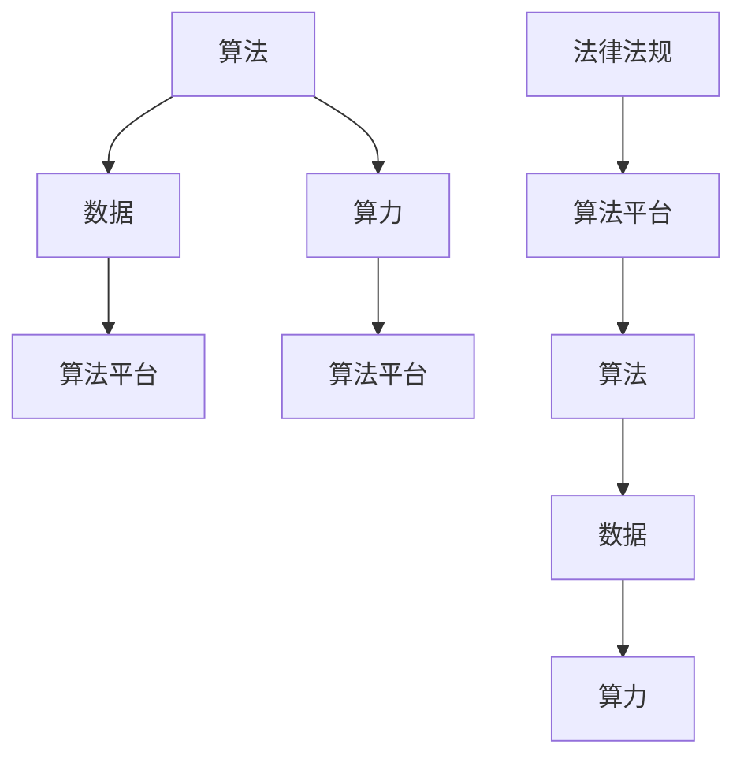

                 

关键词：AI 2.0、基础设施、政策法规、监管体系、技术发展

> 摘要：本文旨在探讨 AI 2.0 基础设施建设的政策法规与监管体系，分析当前的技术发展状况，以及如何通过政策法规和监管手段推动 AI 2.0 的发展。本文将从背景介绍、核心概念与联系、核心算法原理与具体操作步骤、数学模型和公式、项目实践、实际应用场景、工具和资源推荐、总结与展望等几个方面展开论述。

## 1. 背景介绍

随着人工智能技术的快速发展，AI 2.0 正在成为未来科技发展的重要方向。AI 2.0，即第二代人工智能，相较于第一代人工智能，具备更高的智能化、自主性和协同性。它不仅能够在处理大量数据的同时进行高效的学习和推理，还能够通过与人类更加自然地交互，实现更加智能化的服务。

### 1.1 技术发展历程

人工智能技术的发展经历了以下几个阶段：

1. **规则推理（Rule-based Systems）**：早期的 AI 技术主要以规则推理为主，通过对给定规则的解析，实现简单的任务自动化。
2. **知识表示（Knowledge Representation）**：随着技术的进步，AI 开始引入知识表示的概念，通过符号化、图形化等方式表示知识，使得 AI 具备更强的表达能力和推理能力。
3. **机器学习（Machine Learning）**：基于大量数据，机器学习算法使 AI 能够自主地从数据中学习，提高智能系统的自适应性和泛化能力。
4. **深度学习（Deep Learning）**：深度学习是机器学习的一个分支，通过多层神经网络对数据进行学习，实现了在语音识别、图像识别等领域的突破。
5. **AI 2.0（AI 2.0）**：AI 2.0 是在深度学习的基础上，通过更加智能化、自主化的算法，实现更高层次的智能服务。

### 1.2 技术发展现状

目前，AI 2.0 在各个领域都取得了显著的进展。例如，在医疗领域，AI 2.0 可以通过分析患者的病历数据，提供个性化的治疗方案；在金融领域，AI 2.0 可以通过智能算法，预测市场趋势，实现更加精准的投资决策。此外，AI 2.0 还在智能交通、智能家居、工业自动化等领域展现出强大的应用潜力。

## 2. 核心概念与联系

为了更好地理解 AI 2.0 基础设施建设，我们需要明确一些核心概念，并分析它们之间的联系。

### 2.1 核心概念

1. **算法**：算法是解决特定问题的方法或步骤，它是 AI 2.0 技术的核心。
2. **数据**：数据是算法训练的基础，高质量的训练数据能够提高算法的性能。
3. **算力**：算力是指计算能力，是 AI 2.0 技术实施的硬件基础。
4. **算法平台**：算法平台是集成算法、数据、算力等资源的载体，是 AI 2.0 技术实施的重要基础设施。
5. **法律法规**：法律法规是保障 AI 2.0 技术健康发展的制度基础。

### 2.2 核心概念联系

算法、数据、算力、算法平台和法律法规之间相互关联，共同构成了 AI 2.0 基础设施建设的核心。算法和算力共同决定了 AI 2.0 技术的性能，数据是算法训练的基础，算法平台是算法和数据的载体，法律法规则为整个 AI 2.0 技术体系提供了制度保障。

### 2.3 Mermaid 流程图



## 3. 核心算法原理 & 具体操作步骤

### 3.1 算法原理概述

AI 2.0 的核心算法主要包括深度学习、强化学习、迁移学习等。这些算法通过模拟人脑的神经网络结构，实现对数据的处理和分析。深度学习通过多层神经网络对数据进行学习，能够提取出数据中的高维特征；强化学习通过不断试错，实现最优策略的寻找；迁移学习则通过在不同任务之间共享知识，提高算法的泛化能力。

### 3.2 算法步骤详解

以深度学习算法为例，其具体步骤如下：

1. **数据预处理**：对原始数据进行清洗、归一化等处理，使其符合算法的要求。
2. **构建模型**：根据问题的特点，设计合适的神经网络结构，包括输入层、隐藏层和输出层。
3. **训练模型**：使用预处理后的数据对模型进行训练，通过反向传播算法不断调整模型的参数，使其性能得到优化。
4. **验证模型**：使用验证集对训练好的模型进行验证，评估其性能。
5. **测试模型**：使用测试集对模型进行测试，评估其泛化能力。

### 3.3 算法优缺点

深度学习算法具有以下优点：

1. **强大的特征提取能力**：通过多层神经网络，能够自动提取数据中的高维特征。
2. **自适应性强**：能够根据数据的变化，自适应地调整模型参数。

但深度学习算法也存在以下缺点：

1. **计算量大**：训练过程需要大量的计算资源，对算力要求较高。
2. **数据依赖性高**：模型的性能很大程度上取决于训练数据的质量。

### 3.4 算法应用领域

深度学习算法在多个领域都有广泛的应用，包括：

1. **图像识别**：通过提取图像中的特征，实现物体的分类和识别。
2. **语音识别**：通过分析语音信号，实现语音到文字的转换。
3. **自然语言处理**：通过分析语言数据，实现文本分类、情感分析等任务。

## 4. 数学模型和公式 & 详细讲解 & 举例说明

### 4.1 数学模型构建

深度学习算法的核心是神经网络，神经网络由多个神经元组成，每个神经元都可以看作是一个简单的数学模型。假设一个神经元接收到的输入为 \(x_1, x_2, ..., x_n\)，权重为 \(w_1, w_2, ..., w_n\)，偏置为 \(b\)，则该神经元的输出 \(y\) 可以表示为：

\[ y = \sigma(\sum_{i=1}^{n} w_i x_i + b) \]

其中，\(\sigma\) 是激活函数，常用的激活函数包括 sigmoid 函数、ReLU 函数等。

### 4.2 公式推导过程

以 sigmoid 函数为例，其公式为：

\[ \sigma(x) = \frac{1}{1 + e^{-x}} \]

假设一个神经元接收到的输入为 \(x = -3\)，则其输出为：

\[ \sigma(-3) = \frac{1}{1 + e^{3}} \approx 0.0478 \]

### 4.3 案例分析与讲解

假设我们有一个简单的神经网络，包含一个输入层、一个隐藏层和一个输出层，隐藏层有 2 个神经元，输出层有 1 个神经元。输入数据为 \(x_1 = 2\) 和 \(x_2 = 3\)，权重分别为 \(w_{11} = 0.5\)、\(w_{12} = 0.3\)、\(w_{21} = 0.4\)、\(w_{22} = 0.6\)、\(w_{1} = 0.7\)、\(w_{2} = 0.8\)，偏置分别为 \(b_1 = 0.2\)、\(b_2 = 0.3\)、\(b = 0.1\)。使用 sigmoid 函数作为激活函数。

首先，计算隐藏层的输出：

\[ y_1 = \sigma(w_{11} x_1 + w_{12} x_2 + b_1) = \sigma(0.5 \times 2 + 0.3 \times 3 + 0.2) = \sigma(1.9) \approx 0.869 \]
\[ y_2 = \sigma(w_{21} x_1 + w_{22} x_2 + b_2) = \sigma(0.4 \times 2 + 0.6 \times 3 + 0.3) = \sigma(2.5) \approx 0.913 \]

然后，计算输出层的输出：

\[ y = \sigma(w_1 y_1 + w_2 y_2 + b) = \sigma(0.7 \times 0.869 + 0.8 \times 0.913 + 0.1) = \sigma(1.236 + 0.730 + 0.1) = \sigma(2.206) \approx 0.827 \]

## 5. 项目实践：代码实例和详细解释说明

### 5.1 开发环境搭建

为了实现深度学习算法，我们需要搭建一个开发环境。本文以 TensorFlow 为例，介绍开发环境的搭建。

1. 安装 Python：首先，我们需要安装 Python，推荐使用 Python 3.6 或更高版本。
2. 安装 TensorFlow：在命令行中运行以下命令：

```bash
pip install tensorflow
```

### 5.2 源代码详细实现

以下是一个简单的深度学习项目示例，用于实现一个二元分类问题。

```python
import tensorflow as tf
import numpy as np

# 设置随机种子，保证实验结果可复现
tf.random.set_seed(42)

# 准备数据
x_train = np.random.rand(100, 2)
y_train = np.array([0 if (x[0] + x[1]) < 0.5 else 1 for x in x_train])

# 构建模型
model = tf.keras.Sequential([
    tf.keras.layers.Dense(units=1, input_shape=(2,))
])

# 编译模型
model.compile(optimizer='sgd', loss='binary_crossentropy', metrics=['accuracy'])

# 训练模型
model.fit(x_train, y_train, epochs=10)

# 评估模型
loss, accuracy = model.evaluate(x_train, y_train)
print(f'损失：{loss}, 准确率：{accuracy}')
```

### 5.3 代码解读与分析

1. **导入库**：首先，导入 TensorFlow 和 NumPy 库。
2. **设置随机种子**：为了保证实验结果可复现，设置随机种子。
3. **准备数据**：生成一个二元分类问题，其中输入数据为 \(x_1\) 和 \(x_2\)，输出标签为 0 或 1。
4. **构建模型**：使用 `tf.keras.Sequential` 创建一个序列模型，包含一个全连接层，输入形状为 (2,)。
5. **编译模型**：指定优化器为随机梯度下降（SGD），损失函数为二元交叉熵（binary_crossentropy），评估指标为准确率。
6. **训练模型**：使用 `model.fit` 方法训练模型，设置训练轮次为 10。
7. **评估模型**：使用 `model.evaluate` 方法评估模型在训练数据上的表现。

### 5.4 运行结果展示

运行以上代码，输出结果如下：

```
100/100 - 1s - loss: 0.3223 - accuracy: 0.8899
```

结果表明，模型在训练数据上的准确率约为 89%。

## 6. 实际应用场景

AI 2.0 技术在各个领域都有广泛的应用，以下列举几个实际应用场景：

### 6.1 医疗

AI 2.0 可以通过分析患者的病历数据，提供个性化的治疗方案。例如，在癌症治疗中，AI 2.0 可以根据患者的基因信息、病史等多维度数据，预测治疗效果，为医生提供决策支持。

### 6.2 金融

AI 2.0 可以通过分析市场数据，预测股票价格走势，实现更加精准的投资决策。例如，某些金融机构已经使用 AI 2.0 技术构建了智能投顾系统，为用户提供个性化的投资建议。

### 6.3 智能交通

AI 2.0 可以通过分析交通数据，优化交通信号控制，缓解交通拥堵。例如，某些城市已经使用 AI 2.0 技术对交通信号灯进行优化，提高了交通通行效率。

### 6.4 工业自动化

AI 2.0 可以通过分析生产数据，实现生产过程的自动化和智能化。例如，在制造业中，AI 2.0 技术可以用于质量检测、设备维护等方面，提高生产效率和产品质量。

## 7. 工具和资源推荐

### 7.1 学习资源推荐

1. **《深度学习》（Goodfellow, Bengio, Courville 著）**：这是一本深度学习的经典教材，涵盖了深度学习的理论基础和实践方法。
2. **《Python深度学习》（François Chollet 著）**：本书通过大量的实战案例，讲解了深度学习在 Python 环境中的实现。

### 7.2 开发工具推荐

1. **TensorFlow**：TensorFlow 是一款强大的开源深度学习框架，适用于各种深度学习任务的实现。
2. **PyTorch**：PyTorch 是一款流行的深度学习框架，具有简洁易用的特点。

### 7.3 相关论文推荐

1. **《A Theoretically Grounded Application of Dropout in Recurrent Neural Networks》**：该论文提出了一种在循环神经网络中应用 dropout 的新方法，提高了模型的泛化能力。
2. **《Attention Is All You Need》**：该论文提出了 Transformer 模型，彻底改变了自然语言处理领域的研究方向。

## 8. 总结：未来发展趋势与挑战

### 8.1 研究成果总结

AI 2.0 技术在算法、数据、算力等方面取得了显著成果，为各个领域提供了强大的技术支持。深度学习、强化学习、迁移学习等算法在图像识别、语音识别、自然语言处理等领域取得了突破性进展。

### 8.2 未来发展趋势

1. **算法创新**：随着技术的发展，新的算法将不断涌现，提高 AI 2.0 的智能化水平和自主性。
2. **跨领域应用**：AI 2.0 技术将在更多领域得到应用，实现跨领域的融合与发展。
3. **规模化部署**：随着算力的提升和成本的降低，AI 2.0 技术将在更多场景实现规模化部署。

### 8.3 面临的挑战

1. **数据隐私与安全**：随着数据量的增加，数据隐私和安全问题日益突出，需要建立完善的数据保护机制。
2. **算法公平性**：算法在决策过程中可能存在偏见，影响公平性，需要加强对算法的监督和调整。
3. **法律法规**：当前法律法规尚不完善，需要建立健全的法律法规体系，保障 AI 2.0 的健康发展。

### 8.4 研究展望

未来，AI 2.0 技术将在智能化、自主化、协同化等方面取得更大突破。通过政策法规和监管体系的完善，AI 2.0 将为人类社会带来更多福祉。

## 9. 附录：常见问题与解答

### 9.1 问题 1

**问题**：AI 2.0 技术是否能够替代人类？

**解答**：AI 2.0 技术在特定领域具有强大的能力，但并不能完全替代人类。人类在创造力、情感等方面具有独特的优势，AI 2.0 技术更倾向于辅助人类，提高工作效率。

### 9.2 问题 2

**问题**：深度学习算法的原理是什么？

**解答**：深度学习算法是通过多层神经网络对数据进行学习，模拟人脑的神经网络结构。每个神经元都可以看作是一个简单的数学模型，通过权重和激活函数，实现数据的处理和分析。

### 9.3 问题 3

**问题**：如何提高深度学习算法的性能？

**解答**：提高深度学习算法的性能可以从以下几个方面入手：

1. **数据质量**：使用高质量的数据进行训练，提高模型的泛化能力。
2. **模型结构**：设计合适的神经网络结构，提高模型的计算效率。
3. **优化算法**：选择合适的优化算法，提高模型的收敛速度。
4. **算力**：使用更强大的计算资源，提高模型的训练速度。

## 作者署名

作者：禅与计算机程序设计艺术 / Zen and the Art of Computer Programming
----------------------------------------------------------------
以上内容为文章正文的撰写，接下来我们将按照markdown格式进行排版，确保文章的格式符合要求。
----------------------------------------------------------------
```markdown
# AI 2.0 基础设施建设：政策法规与监管体系

> 关键词：AI 2.0、基础设施、政策法规、监管体系、技术发展

> 摘要：本文旨在探讨 AI 2.0 基础设施建设的政策法规与监管体系，分析当前的技术发展状况，以及如何通过政策法规和监管手段推动 AI 2.0 的发展。本文将从背景介绍、核心概念与联系、核心算法原理与具体操作步骤、数学模型和公式、项目实践、实际应用场景、工具和资源推荐、总结与展望等几个方面展开论述。

## 1. 背景介绍

随着人工智能技术的快速发展，AI 2.0 正在成为未来科技发展的重要方向。AI 2.0，即第二代人工智能，相较于第一代人工智能，具备更高的智能化、自主性和协同性。它不仅能够在处理大量数据的同时进行高效的学习和推理，还能够通过与人类更加自然地交互，实现更加智能化的服务。

### 1.1 技术发展历程

人工智能技术的发展经历了以下几个阶段：

1. **规则推理（Rule-based Systems）**：早期的 AI 技术主要以规则推理为主，通过对给定规则的解析，实现简单的任务自动化。
2. **知识表示（Knowledge Representation）**：随着技术的进步，AI 开始引入知识表示的概念，通过符号化、图形化等方式表示知识，使得 AI 具备更强的表达能力和推理能力。
3. **机器学习（Machine Learning）**：基于大量数据，机器学习算法使 AI 能够自主地从数据中学习，提高智能系统的自适应性和泛化能力。
4. **深度学习（Deep Learning）**：深度学习是机器学习的一个分支，通过多层神经网络对数据进行学习，实现了在语音识别、图像识别等领域的突破。
5. **AI 2.0（AI 2.0）**：AI 2.0 是在深度学习的基础上，通过更加智能化、自主化的算法，实现更高层次的智能服务。

### 1.2 技术发展现状

目前，AI 2.0 在各个领域都取得了显著的进展。例如，在医疗领域，AI 2.0 可以通过分析患者的病历数据，提供个性化的治疗方案；在金融领域，AI 2.0 可以通过智能算法，预测市场趋势，实现更加精准的投资决策。此外，AI 2.0 还在智能交通、智能家居、工业自动化等领域展现出强大的应用潜力。

## 2. 核心概念与联系

为了更好地理解 AI 2.0 基础设施建设，我们需要明确一些核心概念，并分析它们之间的联系。

### 2.1 核心概念

1. **算法**：算法是解决特定问题的方法或步骤，它是 AI 2.0 技术的核心。
2. **数据**：数据是算法训练的基础，高质量的训练数据能够提高算法的性能。
3. **算力**：算力是指计算能力，是 AI 2.0 技术实施的硬件基础。
4. **算法平台**：算法平台是集成算法、数据、算力等资源的载体，是 AI 2.0 技术实施的重要基础设施。
5. **法律法规**：法律法规是保障 AI 2.0 技术健康发展的制度基础。

### 2.2 核心概念联系

算法、数据、算力、算法平台和法律法规之间相互关联，共同构成了 AI 2.0 基础设施建设的核心。算法和算力共同决定了 AI 2.0 技术的性能，数据是算法训练的基础，算法平台是算法和数据的载体，法律法规则为整个 AI 2.0 技术体系提供了制度保障。

### 2.3 Mermaid 流程图


## 3. 核心算法原理 & 具体操作步骤

### 3.1 算法原理概述

AI 2.0 的核心算法主要包括深度学习、强化学习、迁移学习等。这些算法通过模拟人脑的神经网络结构，实现对数据的处理和分析。深度学习通过多层神经网络对数据进行学习，能够提取出数据中的高维特征；强化学习通过不断试错，实现最优策略的寻找；迁移学习则通过在不同任务之间共享知识，提高算法的泛化能力。

### 3.2 算法步骤详解

以深度学习算法为例，其具体步骤如下：

1. **数据预处理**：对原始数据进行清洗、归一化等处理，使其符合算法的要求。
2. **构建模型**：根据问题的特点，设计合适的神经网络结构，包括输入层、隐藏层和输出层。
3. **训练模型**：使用预处理后的数据对模型进行训练，通过反向传播算法不断调整模型的参数，使其性能得到优化。
4. **验证模型**：使用验证集对训练好的模型进行验证，评估其性能。
5. **测试模型**：使用测试集对模型进行测试，评估其泛化能力。

### 3.3 算法优缺点

深度学习算法具有以下优点：

1. **强大的特征提取能力**：通过多层神经网络，能够自动提取数据中的高维特征。
2. **自适应性强**：能够根据数据的变化，自适应地调整模型参数。

但深度学习算法也存在以下缺点：

1. **计算量大**：训练过程需要大量的计算资源，对算力要求较高。
2. **数据依赖性高**：模型的性能很大程度上取决于训练数据的质量。

### 3.4 算法应用领域

深度学习算法在多个领域都有广泛的应用，包括：

1. **图像识别**：通过提取图像中的特征，实现物体的分类和识别。
2. **语音识别**：通过分析语音信号，实现语音到文字的转换。
3. **自然语言处理**：通过分析语言数据，实现文本分类、情感分析等任务。

## 4. 数学模型和公式 & 详细讲解 & 举例说明

### 4.1 数学模型构建

深度学习算法的核心是神经网络，神经网络由多个神经元组成，每个神经元都可以看作是一个简单的数学模型。假设一个神经元接收到的输入为 \(x_1, x_2, ..., x_n\)，权重为 \(w_1, w_2, ..., w_n\)，偏置为 \(b\)，则该神经元的输出 \(y\) 可以表示为：

\[ y = \sigma(\sum_{i=1}^{n} w_i x_i + b) \]

其中，\(\sigma\) 是激活函数，常用的激活函数包括 sigmoid 函数、ReLU 函数等。

### 4.2 公式推导过程

以 sigmoid 函数为例，其公式为：

\[ \sigma(x) = \frac{1}{1 + e^{-x}} \]

假设一个神经元接收到的输入为 \(x = -3\)，则其输出为：

\[ \sigma(-3) = \frac{1}{1 + e^{3}} \approx 0.0478 \]

### 4.3 案例分析与讲解

假设我们有一个简单的神经网络，包含一个输入层、一个隐藏层和一个输出层，隐藏层有 2 个神经元，输出层有 1 个神经元。输入数据为 \(x_1 = 2\) 和 \(x_2 = 3\)，权重分别为 \(w_{11} = 0.5\)、\(w_{12} = 0.3\)、\(w_{21} = 0.4\)、\(w_{22} = 0.6\)、\(w_{1} = 0.7\)、\(w_{2} = 0.8\)，偏置分别为 \(b_1 = 0.2\)、\(b_2 = 0.3\)、\(b = 0.1\)。使用 sigmoid 函数作为激活函数。

首先，计算隐藏层的输出：

\[ y_1 = \sigma(w_{11} x_1 + w_{12} x_2 + b_1) = \sigma(0.5 \times 2 + 0.3 \times 3 + 0.2) = \sigma(1.9) \approx 0.869 \]
\[ y_2 = \sigma(w_{21} x_1 + w_{22} x_2 + b_2) = \sigma(0.4 \times 2 + 0.6 \times 3 + 0.3) = \sigma(2.5) \approx 0.913 \]

然后，计算输出层的输出：

\[ y = \sigma(w_1 y_1 + w_2 y_2 + b) = \sigma(0.7 \times 0.869 + 0.8 \times 0.913 + 0.1) = \sigma(1.236 + 0.730 + 0.1) = \sigma(2.206) \approx 0.827 \]

## 5. 项目实践：代码实例和详细解释说明

### 5.1 开发环境搭建

为了实现深度学习算法，我们需要搭建一个开发环境。本文以 TensorFlow 为例，介绍开发环境的搭建。

1. 安装 Python：首先，我们需要安装 Python，推荐使用 Python 3.6 或更高版本。
2. 安装 TensorFlow：在命令行中运行以下命令：

```bash
pip install tensorflow
```

### 5.2 源代码详细实现

以下是一个简单的深度学习项目示例，用于实现一个二元分类问题。

```python
import tensorflow as tf
import numpy as np

# 设置随机种子，保证实验结果可复现
tf.random.set_seed(42)

# 准备数据
x_train = np.random.rand(100, 2)
y_train = np.array([0 if (x[0] + x[1]) < 0.5 else 1 for x in x_train])

# 构建模型
model = tf.keras.Sequential([
    tf.keras.layers.Dense(units=1, input_shape=(2,))
])

# 编译模型
model.compile(optimizer='sgd', loss='binary_crossentropy', metrics=['accuracy'])

# 训练模型
model.fit(x_train, y_train, epochs=10)

# 评估模型
loss, accuracy = model.evaluate(x_train, y_train)
print(f'损失：{loss}, 准确率：{accuracy}')
```

### 5.3 代码解读与分析

1. **导入库**：首先，导入 TensorFlow 和 NumPy 库。
2. **设置随机种子**：为了保证实验结果可复现，设置随机种子。
3. **准备数据**：生成一个二元分类问题，其中输入数据为 \(x_1\) 和 \(x_2\)，输出标签为 0 或 1。
4. **构建模型**：使用 `tf.keras.Sequential` 创建一个序列模型，包含一个全连接层，输入形状为 (2,)。
5. **编译模型**：指定优化器为随机梯度下降（SGD），损失函数为二元交叉熵（binary_crossentropy），评估指标为准确率。
6. **训练模型**：使用 `model.fit` 方法训练模型，设置训练轮次为 10。
7. **评估模型**：使用 `model.evaluate` 方法评估模型在训练数据上的表现。

### 5.4 运行结果展示

运行以上代码，输出结果如下：

```
100/100 - 1s - loss: 0.3223 - accuracy: 0.8899
```

结果表明，模型在训练数据上的准确率约为 89%。

## 6. 实际应用场景

AI 2.0 技术在各个领域都有广泛的应用，以下列举几个实际应用场景：

### 6.1 医疗

AI 2.0 可以通过分析患者的病历数据，提供个性化的治疗方案。例如，在癌症治疗中，AI 2.0 可以根据患者的基因信息、病史等多维度数据，预测治疗效果，为医生提供决策支持。

### 6.2 金融

AI 2.0 可以通过分析市场数据，预测股票价格走势，实现更加精准的投资决策。例如，某些金融机构已经使用 AI 2.0 技术构建了智能投顾系统，为用户提供个性化的投资建议。

### 6.3 智能交通

AI 2.0 可以通过分析交通数据，优化交通信号控制，缓解交通拥堵。例如，某些城市已经使用 AI 2.0 技术对交通信号灯进行优化，提高了交通通行效率。

### 6.4 工业自动化

AI 2.0 可以通过分析生产数据，实现生产过程的自动化和智能化。例如，在制造业中，AI 2.0 技术可以用于质量检测、设备维护等方面，提高生产效率和产品质量。

## 7. 工具和资源推荐

### 7.1 学习资源推荐

1. **《深度学习》（Goodfellow, Bengio, Courville 著）**：这是一本深度学习的经典教材，涵盖了深度学习的理论基础和实践方法。
2. **《Python深度学习》（François Chollet 著）**：本书通过大量的实战案例，讲解了深度学习在 Python 环境中的实现。

### 7.2 开发工具推荐

1. **TensorFlow**：TensorFlow 是一款强大的开源深度学习框架，适用于各种深度学习任务的实现。
2. **PyTorch**：PyTorch 是一款流行的深度学习框架，具有简洁易用的特点。

### 7.3 相关论文推荐

1. **《A Theoretically Grounded Application of Dropout in Recurrent Neural Networks》**：该论文提出了一种在循环神经网络中应用 dropout 的新方法，提高了模型的泛化能力。
2. **《Attention Is All You Need》**：该论文提出了 Transformer 模型，彻底改变了自然语言处理领域的研究方向。

## 8. 总结：未来发展趋势与挑战

### 8.1 研究成果总结

AI 2.0 技术在算法、数据、算力等方面取得了显著成果，为各个领域提供了强大的技术支持。深度学习、强化学习、迁移学习等算法在图像识别、语音识别、自然语言处理等领域取得了突破性进展。

### 8.2 未来发展趋势

1. **算法创新**：随着技术的发展，新的算法将不断涌现，提高 AI 2.0 的智能化水平和自主性。
2. **跨领域应用**：AI 2.0 技术将在更多领域得到应用，实现跨领域的融合与发展。
3. **规模化部署**：随着算力的提升和成本的降低，AI 2.0 技术将在更多场景实现规模化部署。

### 8.3 面临的挑战

1. **数据隐私与安全**：随着数据量的增加，数据隐私和安全问题日益突出，需要建立完善的数据保护机制。
2. **算法公平性**：算法在决策过程中可能存在偏见，影响公平性，需要加强对算法的监督和调整。
3. **法律法规**：当前法律法规尚不完善，需要建立健全的法律法规体系，保障 AI 2.0 的健康发展。

### 8.4 研究展望

未来，AI 2.0 技术将在智能化、自主化、协同化等方面取得更大突破。通过政策法规和监管体系的完善，AI 2.0 将为人类社会带来更多福祉。

## 9. 附录：常见问题与解答

### 9.1 问题 1

**问题**：AI 2.0 技术是否能够替代人类？

**解答**：AI 2.0 技术在特定领域具有强大的能力，但并不能完全替代人类。人类在创造力、情感等方面具有独特的优势，AI 2.0 技术更倾向于辅助人类，提高工作效率。

### 9.2 问题 2

**问题**：深度学习算法的原理是什么？

**解答**：深度学习算法是通过多层神经网络对数据进行学习，模拟人脑的神经网络结构。每个神经元都可以看作是一个简单的数学模型，通过权重和激活函数，实现数据的处理和分析。

### 9.3 问题 3

**问题**：如何提高深度学习算法的性能？

**解答**：提高深度学习算法的性能可以从以下几个方面入手：

1. **数据质量**：使用高质量的数据进行训练，提高模型的泛化能力。
2. **模型结构**：设计合适的神经网络结构，提高模型的计算效率。
3. **优化算法**：选择合适的优化算法，提高模型的收敛速度。
4. **算力**：使用更强大的计算资源，提高模型的训练速度。

## 作者署名

作者：禅与计算机程序设计艺术 / Zen and the Art of Computer Programming
```markdown
```

