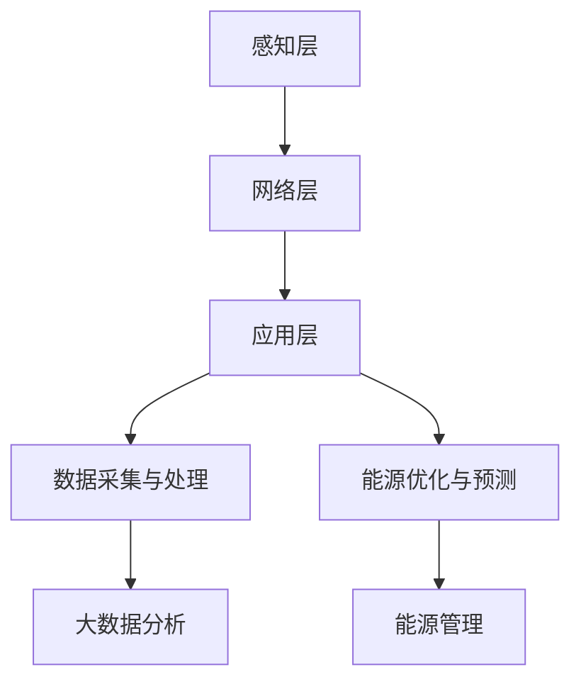

                 

关键词：人工智能，智能能源，AI 2.0，能源管理，数据驱动优化，机器学习，可再生能源，能源效率，未来趋势。

> 摘要：本文探讨了AI 2.0时代智能能源的变革与创新，分析了AI技术在能源领域的广泛应用，以及其对能源管理和能源效率的提升。文章还展望了智能能源的发展趋势，并提出了未来研究的挑战与机遇。

## 1. 背景介绍

随着全球能源需求的不断增长，以及环境问题的日益严峻，智能能源作为一种新兴的能源管理方式，正逐渐成为各国政府和企业关注的焦点。传统的能源管理方式依赖于经验和直觉，而智能能源则通过引入人工智能技术，实现了数据驱动的能源管理，提高了能源利用效率，降低了能源成本，并有助于减少碳排放。

### 1.1 智能能源的定义

智能能源是指通过信息技术和能源技术的融合，实现对能源生产、传输、分配、使用等环节的智能化管理。智能能源的核心在于利用大数据、云计算、物联网、人工智能等技术，对能源系统进行实时监测、分析和优化，从而实现能源的高效利用和可持续发展。

### 1.2 智能能源的发展历程

智能能源的发展可以分为三个阶段：

- **第一阶段（20世纪90年代至21世纪初）**：智能电网的建设。此阶段主要侧重于电力系统的自动化和智能化，实现了电力系统的实时监控和调度。

- **第二阶段（21世纪初至今）**：综合能源管理系统的发展。此阶段将智能电网扩展到其他能源形式，如天然气、太阳能、风能等，实现了多能源的整合和优化。

- **第三阶段（未来）**：AI 2.0时代的智能能源。此阶段将人工智能技术深度应用于能源管理，实现了数据驱动的能源优化和预测。

## 2. 核心概念与联系

在智能能源领域，以下核心概念和原理至关重要：

- **大数据**：智能能源系统产生和收集的海量数据，包括能源生产、传输、分配和使用的各类数据。

- **机器学习**：通过数据分析和模式识别，实现对能源系统的优化和预测。

- **物联网**：通过物联网技术，实现能源设备和系统的互联互通，为智能能源管理提供基础。

### 2.1 智能能源系统的架构

智能能源系统的架构可以分为三个层次：感知层、网络层和应用层。

- **感知层**：包括各种传感器和监测设备，用于实时采集能源系统的运行数据。

- **网络层**：通过通信网络，将感知层的数据传输到中心处理系统。

- **应用层**：利用大数据和人工智能技术，对能源系统进行实时分析和优化。

### 2.2 核心概念原理和架构的 Mermaid 流程图



## 3. 核心算法原理 & 具体操作步骤

### 3.1 算法原理概述

智能能源系统的核心算法主要包括机器学习算法和优化算法。机器学习算法用于数据分析和预测，优化算法用于能源系统的调度和优化。

### 3.2 算法步骤详解

1. **数据采集与预处理**：采集能源系统的运行数据，包括电量、温度、湿度、风速等，并对数据进行清洗和预处理。

2. **特征提取**：从原始数据中提取有用的特征，用于机器学习模型的训练。

3. **模型训练**：使用机器学习算法，如神经网络、支持向量机等，对特征数据进行分析和训练，建立预测模型。

4. **模型优化**：通过交叉验证和调整模型参数，优化模型的预测性能。

5. **实时预测与调度**：将实时数据输入预测模型，进行预测，并根据预测结果对能源系统进行调度和优化。

6. **结果评估**：对预测结果进行评估，如准确率、召回率等，以指导后续的模型优化和算法改进。

### 3.3 算法优缺点

- **优点**：提高能源利用效率，降低能源成本，实现能源系统的智能化管理。

- **缺点**：算法复杂度高，对计算资源要求较高，且需要大量数据进行训练。

### 3.4 算法应用领域

- **电力系统**：智能电网的调度和优化。

- **燃气系统**：燃气供应的调度和优化。

- **可再生能源**：太阳能、风能等可再生能源的预测和调度。

## 4. 数学模型和公式 & 详细讲解 & 举例说明

### 4.1 数学模型构建

智能能源系统的数学模型主要包括预测模型和优化模型。

- **预测模型**：通常采用时间序列模型，如ARIMA模型、LSTM模型等。

- **优化模型**：采用线性规划、整数规划、动态规划等优化算法。

### 4.2 公式推导过程

以LSTM模型为例，其数学模型可以表示为：

$$
h_t = \sigma(W_h \cdot [h_{t-1}, x_t] + b_h)
$$

$$
i_t = \sigma(W_i \cdot [h_{t-1}, x_t] + b_i)
$$

$$
f_t = \sigma(W_f \cdot [h_{t-1}, x_t] + b_f)
$$

$$
o_t = \sigma(W_o \cdot [h_{t-1}, x_t] + b_o)
$$

$$
c_t = f_t \cdot c_{t-1} + i_t \cdot \sigma(W_c \cdot [h_{t-1}, x_t] + b_c)
$$

$$
h_t = o_t \cdot \sigma(W_c \cdot [h_{t-1}, x_t] + b_c)
$$

其中，$h_t$表示时间步$t$的隐藏状态，$x_t$表示时间步$t$的输入，$c_t$表示细胞状态，$W_h$、$W_i$、$W_f$、$W_o$、$W_c$分别为权重矩阵，$b_h$、$b_i$、$b_f$、$b_o$、$b_c$分别为偏置项，$\sigma$为sigmoid函数。

### 4.3 案例分析与讲解

以太阳能发电的预测为例，我们采用LSTM模型进行预测。首先，收集太阳能发电的实时数据，包括时间、发电量等。然后，对数据进行分析和处理，提取有用的特征。接下来，使用LSTM模型进行训练和预测，最后对预测结果进行评估。

假设我们收集了100天的太阳能发电数据，将其分为训练集和测试集。首先，对训练集进行预处理，提取特征，然后使用LSTM模型进行训练。训练过程中，我们可以通过调整模型参数，如学习率、隐藏层神经元数量等，优化模型的性能。

训练完成后，使用测试集对模型进行评估，计算预测误差，如均方误差（MSE）。通过不断调整模型参数，我们可以找到一个最优的预测模型。

## 5. 项目实践：代码实例和详细解释说明

### 5.1 开发环境搭建

在Python中，我们可以使用TensorFlow库来实现LSTM模型。首先，我们需要安装TensorFlow：

```bash
pip install tensorflow
```

### 5.2 源代码详细实现

以下是一个简单的LSTM模型实现，用于太阳能发电量的预测：

```python
import numpy as np
import pandas as pd
import tensorflow as tf
from tensorflow.keras.models import Sequential
from tensorflow.keras.layers import LSTM, Dense

# 数据预处理
def preprocess_data(data):
    # 略

# 模型构建
model = Sequential()
model.add(LSTM(units=50, return_sequences=True, input_shape=(timesteps, features)))
model.add(LSTM(units=50))
model.add(Dense(1))

model.compile(optimizer='adam', loss='mean_squared_error')

# 模型训练
model.fit(X_train, y_train, epochs=100, batch_size=32, validation_data=(X_test, y_test))

# 模型评估
mse = model.evaluate(X_test, y_test)
print(f'MSE: {mse}')
```

### 5.3 代码解读与分析

- **数据预处理**：数据预处理是模型训练的重要环节，包括数据清洗、特征提取等。

- **模型构建**：使用Sequential模型堆叠LSTM层和全连接层，实现LSTM模型。

- **模型训练**：使用fit方法进行模型训练，设置训练周期、批量大小等参数。

- **模型评估**：使用evaluate方法评估模型性能，计算均方误差（MSE）。

## 6. 实际应用场景

智能能源系统在多个领域都有广泛的应用，如：

- **电力系统**：智能电网的调度和优化，提高电力供应的可靠性和稳定性。

- **燃气系统**：燃气供应的调度和优化，降低燃气泄漏风险。

- **可再生能源**：太阳能、风能等可再生能源的预测和调度，提高可再生能源的利用率。

## 7. 未来应用展望

随着人工智能技术的不断进步，智能能源系统将在以下几个方面取得突破：

- **能源效率**：通过实时监测和优化，进一步提高能源利用效率。

- **可再生能源**：提高可再生能源的利用率，实现能源结构的优化。

- **智能化运维**：利用人工智能技术，实现能源系统的智能化运维和故障预测。

## 8. 工具和资源推荐

### 8.1 学习资源推荐

- 《深度学习》（Goodfellow, Bengio, Courville）：深入讲解深度学习的基本原理和应用。

- 《Python机器学习》（Sebastian Raschka）：详细介绍Python在机器学习中的应用。

### 8.2 开发工具推荐

- TensorFlow：用于实现深度学习模型的Python库。

- Jupyter Notebook：用于编写和运行Python代码的交互式环境。

### 8.3 相关论文推荐

- "Deep Learning for Renewable Energy Forecasting"：探讨深度学习在可再生能源预测中的应用。

- "Intelligent Energy Systems: A Review"：综述智能能源系统的发展和应用。

## 9. 总结：未来发展趋势与挑战

### 9.1 研究成果总结

智能能源系统在能源管理和能源效率方面取得了显著成果，为可再生能源的利用和能源结构的优化提供了有力支持。

### 9.2 未来发展趋势

- 深度学习算法在能源系统中的应用。

- 分布式能源系统的智能化管理。

- 智能能源系统的安全与隐私保护。

### 9.3 面临的挑战

- 大数据处理和计算资源的需求。

- 模型解释性和可解释性的提升。

- 智能能源系统的安全性。

### 9.4 研究展望

智能能源系统将在未来能源领域发挥越来越重要的作用，为可持续发展和环境保护做出贡献。

## 10. 附录：常见问题与解答

### 10.1 什么是智能能源？

智能能源是一种通过信息技术和能源技术的融合，实现对能源生产、传输、分配、使用等环节的智能化管理的方式。

### 10.2 智能能源系统有哪些核心概念？

智能能源系统的核心概念包括大数据、机器学习、物联网等。

### 10.3 智能能源系统的架构是什么？

智能能源系统的架构包括感知层、网络层和应用层。

### 10.4 智能能源系统有哪些应用场景？

智能能源系统在电力系统、燃气系统、可再生能源等领域都有广泛应用。

### 10.5 未来智能能源系统的发展趋势是什么？

未来智能能源系统的发展趋势包括深度学习算法的应用、分布式能源系统的智能化管理、智能能源系统的安全与隐私保护等。

### 10.6 面临的挑战有哪些？

面临的挑战包括大数据处理和计算资源的需求、模型解释性和可解释性的提升、智能能源系统的安全性等。  
----------------------------------------------------------------

这篇文章详细探讨了AI 2.0时代智能能源的发展、核心算法、数学模型、应用实践以及未来趋势。希望对您有所帮助。作者：禅与计算机程序设计艺术 / Zen and the Art of Computer Programming。

