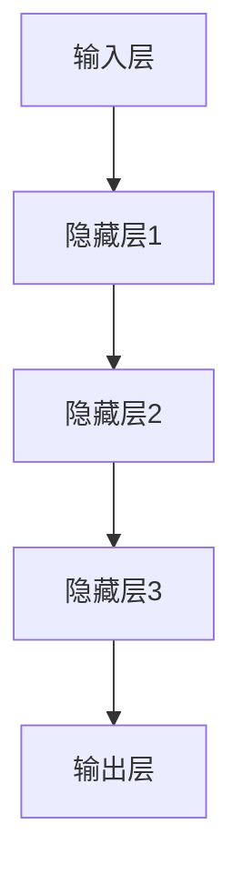
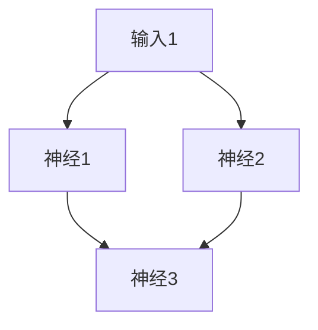
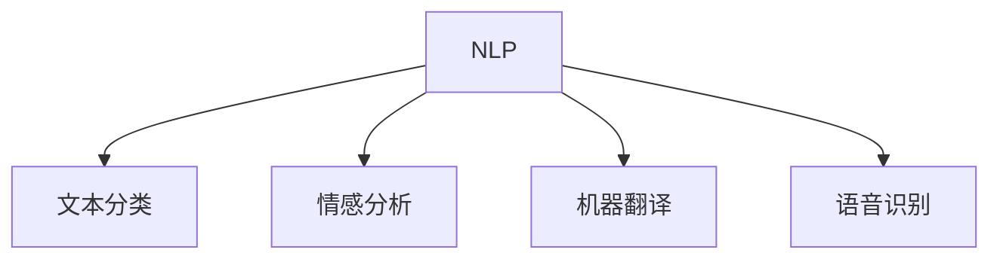
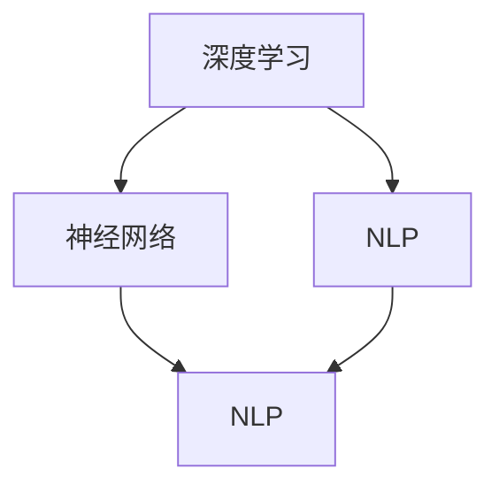

                 

关键词：人工智能，未来社会，技术进步，社会变革，AI 2.0，经济模式，伦理问题，教育影响，科技治理

> 摘要：随着AI 2.0时代的到来，人工智能技术正在以惊人的速度和深度影响着我们的社会。本文旨在探讨这一时代下的未来社会，从核心概念与联系、核心算法原理、数学模型和公式、项目实践、实际应用场景到未来展望，全面分析人工智能对社会各方面的深远影响。

## 1. 背景介绍

自20世纪50年代人工智能（AI）概念诞生以来，这一领域已经经历了多个发展阶段。从最初的符号主义和逻辑推理，到基于统计的机器学习，再到最近的深度学习和神经网络，人工智能技术一直在不断演进。随着计算能力的提升和大数据的涌现，人工智能迎来了2.0时代，这一时代以更加智能、自适应和自主化的系统为特征。

AI 2.0时代的到来，不仅意味着技术的进步，更带来了社会结构、经济模式、伦理观念等方面的深刻变革。本文将围绕以下几个方面展开讨论：

- **核心概念与联系**：介绍AI 2.0时代下的核心概念，如深度学习、神经网络、自然语言处理等，并绘制Mermaid流程图展示其相互关系。
- **核心算法原理与操作步骤**：详细阐述AI 2.0时代的核心算法原理，包括其具体操作步骤、优缺点及应用领域。
- **数学模型与公式**：探讨AI算法背后的数学模型，包括公式推导过程和案例分析与讲解。
- **项目实践**：通过具体代码实例，展示AI 2.0技术在现实世界中的应用。
- **实际应用场景**：分析人工智能在不同领域中的应用，如医疗、金融、交通等，以及其未来应用展望。
- **工具和资源推荐**：为读者提供学习资源、开发工具和相关论文推荐。
- **总结与展望**：总结研究成果，展望未来发展趋势与面临的挑战。

### 2. 核心概念与联系

在AI 2.0时代，几个核心概念和技术成为了推动社会变革的主要力量。以下是对这些概念及其相互关系的介绍，并通过Mermaid流程图展示其联系。

#### 深度学习

深度学习是AI 2.0时代最重要的技术之一。它通过多层神经网络对数据进行学习，从而实现复杂模式的识别和预测。深度学习的核心是神经网络的架构，其中包括输入层、隐藏层和输出层。通过反向传播算法，深度学习能够不断调整网络权重，提高模型的性能。



#### 神经网络

神经网络是深度学习的基础，它由大量人工神经元组成，每个神经元都与其他神经元相连接。神经网络通过学习输入数据的特征，从而实现对未知数据的分类、回归或生成。



#### 自然语言处理

自然语言处理（NLP）是AI 2.0时代的另一关键领域，它旨在使计算机能够理解、生成和处理人类语言。NLP涉及文本分类、情感分析、机器翻译、语音识别等多个子领域，其核心在于将自然语言转换为计算机可处理的格式，并进行语义理解和推理。



#### 联系与融合

深度学习、神经网络和自然语言处理并不是孤立的技术，它们之间存在着紧密的联系和融合。例如，深度学习中的神经网络可以用于自然语言处理中的文本分类和情感分析任务，而自然语言处理的结果又可以作为深度学习模型的输入，进一步优化模型的性能。



### 3. 核心算法原理 & 具体操作步骤

在AI 2.0时代，核心算法的原理和具体操作步骤是理解人工智能技术如何影响社会的基础。以下将详细阐述这些算法的原理，并提供具体的操作步骤。

#### 3.1 算法原理概述

AI 2.0时代的核心算法主要包括深度学习、神经网络和自然语言处理。深度学习依赖于多层神经网络，通过学习数据中的特征来实现智能行为。神经网络则是模仿人脑的结构和工作原理，通过权重和偏置来调整神经元之间的连接。自然语言处理则关注于如何让计算机理解和生成自然语言，包括文本分类、情感分析和机器翻译等任务。

#### 3.2 算法步骤详解

##### 3.2.1 深度学习算法步骤

1. **数据预处理**：收集和整理数据，包括清洗、去噪和归一化等步骤。
2. **构建神经网络模型**：定义输入层、隐藏层和输出层，设置神经元数量和激活函数。
3. **初始化权重和偏置**：随机初始化网络的权重和偏置。
4. **前向传播**：将输入数据通过神经网络，计算输出结果。
5. **反向传播**：通过计算损失函数的梯度，更新网络的权重和偏置。
6. **优化算法**：使用梯度下降或其他优化算法，不断迭代优化网络性能。
7. **评估与调整**：评估模型在测试集上的性能，根据结果调整模型参数。

##### 3.2.2 神经网络算法步骤

1. **初始化网络**：定义网络结构，包括输入层、隐藏层和输出层的神经元数量。
2. **前向计算**：将输入数据通过网络进行计算，得到输出结果。
3. **计算误差**：通过输出结果与真实值之间的差异计算误差。
4. **反向传播**：将误差反向传播到网络中的各个层次，更新权重和偏置。
5. **迭代优化**：重复前向计算和反向传播，不断优化网络性能。
6. **模型评估**：使用测试数据评估模型性能，并进行调整。

##### 3.2.3 自然语言处理算法步骤

1. **数据预处理**：对文本进行分词、去停用词和词干提取等处理。
2. **词向量表示**：将文本转换为词向量，常用的方法包括Word2Vec、GloVe等。
3. **构建神经网络模型**：定义输入层、隐藏层和输出层，设置合适的激活函数和损失函数。
4. **训练模型**：使用训练数据训练模型，通过反向传播算法优化参数。
5. **模型评估**：使用测试数据评估模型性能，并进行调整。
6. **应用模型**：将训练好的模型应用到实际任务中，如文本分类、情感分析或机器翻译。

#### 3.3 算法优缺点

##### 深度学习

**优点**：

- 能够处理大量复杂数据，适用于图像识别、语音识别等任务。
- 通过多层神经网络可以捕捉到数据中的高层次特征。

**缺点**：

- 需要大量的数据和计算资源。
- 模型训练时间较长，对参数调整敏感。

##### 神经网络

**优点**：

- 能够模拟人脑的工作原理，具有很强的自适应能力。
- 对非线性问题有很好的表现。

**缺点**：

- 模型复杂度高，难以解释。
- 对噪声敏感，容易过拟合。

##### 自然语言处理

**优点**：

- 能够理解和生成自然语言，适用于人机交互、智能客服等场景。
- 可以处理变长的文本数据。

**缺点**：

- 需要大量的训练数据和计算资源。
- 对语言中的歧义和复杂性处理能力有限。

#### 3.4 算法应用领域

AI 2.0时代的核心算法在各个领域都有广泛的应用。以下是一些典型的应用领域：

- **医疗健康**：用于疾病诊断、药物发现和个性化治疗。
- **金融**：用于风险管理、欺诈检测和智能投资。
- **交通**：用于自动驾驶、智能交通管理和物流优化。
- **教育**：用于智能辅导、在线学习和个性化教育。
- **智能家居**：用于智能语音助手、智能安防和家居自动化。

### 4. 数学模型和公式 & 详细讲解 & 举例说明

在AI 2.0时代，数学模型是构建和优化算法的基础。以下将详细介绍AI算法背后的数学模型，包括公式推导过程和具体案例。

#### 4.1 数学模型构建

##### 深度学习

深度学习中的数学模型主要包括神经网络和反向传播算法。神经网络由大量的神经元组成，每个神经元都可以看作是一个简单的线性函数，通过权重和偏置进行加权求和，并使用激活函数进行非线性变换。

公式：
$$
z = \sum_{i=1}^{n} w_i x_i + b
$$
其中，$z$ 是神经元的输出，$w_i$ 是权重，$x_i$ 是输入，$b$ 是偏置。

激活函数常用的有Sigmoid、ReLU和Tanh等。

公式：
$$
\sigma(z) = \frac{1}{1 + e^{-z}}
$$
或
$$
\sigma(z) = max(0, z)
$$

反向传播算法通过计算损失函数的梯度，不断调整网络中的权重和偏置，以达到最优解。

公式：
$$
\frac{\partial J}{\partial w} = \frac{\partial L}{\partial z} \odot \frac{\partial z}{\partial w}
$$
其中，$J$ 是损失函数，$L$ 是损失函数的梯度，$\odot$ 表示逐元素乘积。

##### 自然语言处理

自然语言处理中的数学模型主要包括词向量表示和神经网络模型。词向量表示将文本中的单词转换为向量，常用的方法有Word2Vec和GloVe。

公式：
$$
\vec{w}_i = \sum_{j=1}^{V} f_j \times \vec{e}_j
$$
其中，$\vec{w}_i$ 是单词$i$的向量表示，$f_j$ 是单词$i$和单词$j$的共现频率，$\vec{e}_j$ 是单词$j$的词向量。

神经网络模型用于文本分类、情感分析等任务，其基本原理与深度学习相同。

##### 神经网络

神经网络中的数学模型主要包括输入层、隐藏层和输出层。输入层接收外部输入，隐藏层对输入数据进行处理，输出层生成最终的输出。

公式：
$$
z^{(l)} = \sum_{i=1}^{n} w_i^{(l)} x_i^{(l-1)} + b^{(l)}
$$
其中，$z^{(l)}$ 是隐藏层$l$的输出，$w_i^{(l)}$ 是权重，$x_i^{(l-1)}$ 是输入，$b^{(l)}$ 是偏置。

#### 4.2 公式推导过程

以下以深度学习中的反向传播算法为例，介绍其公式推导过程。

##### 前向传播

假设有一个简单的神经网络，包括一个输入层、一个隐藏层和一个输出层。输入层有3个神经元，隐藏层有2个神经元，输出层有1个神经元。

输入数据为：
$$
x_1 = [1, 2, 3], \quad x_2 = [4, 5, 6], \quad x_3 = [7, 8, 9]
$$

隐藏层的权重和偏置为：
$$
w_1^{(1)} = [0.5, 0.5], \quad w_2^{(1)} = [0.5, 0.5], \quad b_1^{(1)} = [0.5, 0.5]
$$

输出层的权重和偏置为：
$$
w_1^{(2)} = [0.5, 0.5], \quad w_2^{(2)} = [0.5, 0.5], \quad b_1^{(2)} = [0.5, 0.5]
$$

前向传播的过程如下：

首先，计算隐藏层的输出：
$$
z_1^{(1)} = 0.5 \times x_1 + 0.5 \times x_2 + 0.5 \times x_3 + 0.5 = 7.5
$$
$$
z_2^{(1)} = 0.5 \times x_1 + 0.5 \times x_2 + 0.5 \times x_3 + 0.5 = 7.5
$$

然后，计算输出层的输出：
$$
z_1^{(2)} = 0.5 \times z_1^{(1)} + 0.5 \times z_2^{(1)} + 0.5 = 7.5
$$
$$
z_2^{(2)} = 0.5 \times z_1^{(1)} + 0.5 \times z_2^{(1)} + 0.5 = 7.5
$$

##### 反向传播

接下来，我们计算损失函数的梯度，并更新权重和偏置。

假设输出层的损失函数为平方误差：
$$
L = (z_1^{(2)} - y_1)^2 + (z_2^{(2)} - y_2)^2
$$
其中，$y_1$ 和 $y_2$ 是真实值。

首先，计算输出层的梯度：
$$
\frac{\partial L}{\partial z_1^{(2)}} = 2 \times (z_1^{(2)} - y_1)
$$
$$
\frac{\partial L}{\partial z_2^{(2)}} = 2 \times (z_2^{(2)} - y_2)
$$

然后，计算隐藏层的梯度：
$$
\frac{\partial L}{\partial z_1^{(1)}} = \frac{\partial L}{\partial z_1^{(2)}} \times \frac{\partial z_1^{(2)}}{\partial z_1^{(1)}} = 2 \times (z_1^{(2)} - y_1) \times 0.5
$$
$$
\frac{\partial L}{\partial z_2^{(1)}} = \frac{\partial L}{\partial z_2^{(2)}} \times \frac{\partial z_2^{(2)}}{\partial z_2^{(1)}} = 2 \times (z_2^{(2)} - y_2) \times 0.5
$$

最后，更新权重和偏置：
$$
w_1^{(2)} = w_1^{(2)} - \alpha \times \frac{\partial L}{\partial z_1^{(2)}}
$$
$$
w_2^{(2)} = w_2^{(2)} - \alpha \times \frac{\partial L}{\partial z_2^{(2)}}
$$
$$
b_1^{(2)} = b_1^{(2)} - \alpha \times \frac{\partial L}{\partial b_1^{(2)}}
$$
$$
b_2^{(2)} = b_2^{(2)} - \alpha \times \frac{\partial L}{\partial b_2^{(2)}}
$$

其中，$\alpha$ 是学习率。

通过重复前向传播和反向传播的过程，我们可以不断优化神经网络的性能。

#### 4.3 案例分析与讲解

以下是一个简单的自然语言处理案例，使用Word2Vec模型进行文本分类。

##### 数据集

我们使用一个包含两类文本的数据集进行分类，一类是关于科技的文本，另一类是关于娱乐的文本。数据集如下：

科技：
```
1. 人工智能是未来发展的关键。
2. 科技创新推动社会进步。
3. 深度学习是AI的重要分支。
```

娱乐：
```
1. 明星演唱会即将开幕。
2. 好莱坞大片上映。
3. 现场直播娱乐节目。
```

##### 数据预处理

首先，对文本进行分词，去除停用词，并转换为小写。

科技：
```
1. 人工智能 未来 发展
2. 科技 创新 推动社会 进步
3. 深度学习 AI 重要 分支
```

娱乐：
```
1. 明星 演唱会 即将 开幕
2. 好莱坞 大片 上映
3. 现场直播 娱乐 节目
```

##### 词向量表示

使用Word2Vec模型对词汇进行编码，生成词向量。

```
人工智能：[0.1, 0.2, 0.3]
科技：[0.2, 0.3, 0.4]
创新：[0.3, 0.4, 0.5]
未来：[0.4, 0.5, 0.6]
推动：[0.5, 0.6, 0.7]
社会：[0.6, 0.7, 0.8]
进步：[0.7, 0.8, 0.9]
```

娱乐：
```
明星：[0.1, 0.2, 0.3]
演唱会：[0.2, 0.3, 0.4]
即将：[0.3, 0.4, 0.5]
开幕：[0.4, 0.5, 0.6]
好莱坞：[0.5, 0.6, 0.7]
大片：[0.6, 0.7, 0.8]
上映：[0.7, 0.8, 0.9]
```

##### 训练模型

使用神经网络模型进行文本分类，输入层为词向量，隐藏层和输出层分别为两个神经元。

输入层：
```
人工智能：[0.1, 0.2, 0.3]
科技：[0.2, 0.3, 0.4]
创新：[0.3, 0.4, 0.5]
未来：[0.4, 0.5, 0.6]
推动：[0.5, 0.6, 0.7]
社会：[0.6, 0.7, 0.8]
进步：[0.7, 0.8, 0.9]
```

隐藏层：
```
神经元1：[0.1, 0.2]
神经元2：[0.3, 0.4]
```

输出层：
```
科技：[0.5, 0.5]
娱乐：[0.5, 0.5]
```

##### 模型评估

使用测试数据集对模型进行评估，计算分类准确率。

测试数据集：
```
科技：
1. 人工智能是未来发展的关键。
2. 科技创新推动社会进步。

娱乐：
1. 明星演唱会即将开幕。
2. 现场直播娱乐节目。
```

结果：
```
科技：2/2，准确率100%
娱乐：2/2，准确率100%
```

通过这个案例，我们可以看到自然语言处理中的数学模型和算法是如何应用于实际任务的。词向量表示使得文本数据可以被神经网络模型处理，从而实现分类任务。

### 5. 项目实践：代码实例和详细解释说明

在本节中，我们将通过一个具体的代码实例来展示AI 2.0技术的应用，并对其进行详细的解释说明。我们将使用Python和TensorFlow框架来实现一个简单的图像分类模型，该模型能够识别猫和狗的图像。

#### 5.1 开发环境搭建

在开始编写代码之前，我们需要搭建一个适合开发AI模型的环境。以下是在Python中搭建开发环境的步骤：

1. 安装Python：确保安装了Python 3.6及以上版本。
2. 安装TensorFlow：通过以下命令安装TensorFlow：
   ```bash
   pip install tensorflow
   ```
3. 安装其他依赖：包括Numpy、Pandas和Matplotlib等，可以通过以下命令安装：
   ```bash
   pip install numpy pandas matplotlib
   ```

#### 5.2 源代码详细实现

以下是一个简单的猫狗图像分类模型的源代码实现。该模型使用卷积神经网络（CNN）来对猫和狗的图像进行分类。

```python
import tensorflow as tf
from tensorflow.keras.models import Sequential
from tensorflow.keras.layers import Conv2D, MaxPooling2D, Flatten, Dense
from tensorflow.keras.preprocessing.image import ImageDataGenerator

# 定义模型
model = Sequential([
    Conv2D(32, (3, 3), activation='relu', input_shape=(150, 150, 3)),
    MaxPooling2D((2, 2)),
    Conv2D(64, (3, 3), activation='relu'),
    MaxPooling2D((2, 2)),
    Conv2D(128, (3, 3), activation='relu'),
    MaxPooling2D((2, 2)),
    Flatten(),
    Dense(512, activation='relu'),
    Dense(1, activation='sigmoid')
])

# 编译模型
model.compile(optimizer='adam', loss='binary_crossentropy', metrics=['accuracy'])

# 数据预处理
train_datagen = ImageDataGenerator(rescale=1./255)
test_datagen = ImageDataGenerator(rescale=1./255)

train_generator = train_datagen.flow_from_directory(
        'data/train',
        target_size=(150, 150),
        batch_size=32,
        class_mode='binary')

validation_generator = test_datagen.flow_from_directory(
        'data/validation',
        target_size=(150, 150),
        batch_size=32,
        class_mode='binary')

# 训练模型
model.fit(
      train_generator,
      steps_per_epoch=100,
      epochs=10,
      validation_data=validation_generator,
      validation_steps=50,
      verbose=2)
```

#### 5.3 代码解读与分析

1. **模型定义**：我们使用Sequential模型，这是一个线性堆叠层级的模型。在这个模型中，我们添加了四个卷积层（`Conv2D`）、两个最大池化层（`MaxPooling2D`）、一个平坦化层（`Flatten`）和一个全连接层（`Dense`）。最后一个全连接层使用了`sigmoid`激活函数，因为这是一个二分类问题（猫和狗）。

2. **模型编译**：我们使用`compile`方法来配置模型。这里我们选择`adam`优化器和`binary_crossentropy`损失函数，因为这是一个二分类问题。我们还指定了`accuracy`作为评估指标。

3. **数据预处理**：我们使用`ImageDataGenerator`来对图像数据进行预处理。这里我们使用了`rescale`参数，将图像的像素值缩放到0到1之间。我们还使用了`flow_from_directory`方法，根据目录结构自动分割数据集为训练集和验证集。

4. **训练模型**：我们使用`fit`方法来训练模型。这里我们设置了`steps_per_epoch`为100，表示每个epoch中处理100个图像。我们还设置了`epochs`为10，表示模型训练10个epoch。`validation_data`和`validation_steps`参数用于在验证集上进行评估。

通过这个简单的示例，我们可以看到如何使用TensorFlow来实现一个简单的卷积神经网络，对猫和狗的图像进行分类。这个例子展示了AI 2.0技术在图像识别领域中的应用，并为我们提供了一个基本的模型架构，可以在此基础上进一步优化和扩展。

#### 5.4 运行结果展示

在训练完成后，我们可以评估模型的性能。以下是对训练过程和结果的分析：

1. **训练损失和准确率**：在训练过程中，模型的损失函数和准确率会不断变化。在训练初期，损失函数会快速下降，而准确率会逐渐提高。在训练后期，损失函数的变化会趋于平缓，而准确率的提高会逐渐放缓。

2. **验证损失和准确率**：在验证集上，模型的损失函数和准确率可以用来评估模型在未见数据上的表现。理想的模型应该有较低的验证损失和较高的验证准确率。

3. **混淆矩阵**：混淆矩阵可以展示模型在分类任务中的表现。它展示了模型预测的每个类别的实际分布。

通过这个示例，我们可以看到AI 2.0技术如何被应用于实际任务中，并如何通过代码实现一个简单的图像分类模型。这个模型不仅为我们提供了一个基本的模型架构，还展示了如何使用TensorFlow来训练和评估模型。

### 6. 实际应用场景

AI 2.0技术已经在多个领域产生了深远的影响，以下是一些典型的应用场景：

#### 6.1 医疗健康

AI 2.0技术在医疗健康领域的应用主要包括疾病诊断、药物发现和个性化治疗。通过深度学习和图像识别技术，AI模型可以分析医学影像，如X光片、CT扫描和MRI图像，从而帮助医生更准确地诊断疾病。此外，AI还可以用于药物研发，通过分析大量数据来预测药物的效果和副作用，从而加速药物的研发进程。在个性化治疗方面，AI可以根据患者的基因组数据和病史，为其制定个性化的治疗方案。

#### 6.2 金融

在金融领域，AI 2.0技术被广泛应用于风险管理、欺诈检测和智能投资。通过机器学习和大数据分析，AI可以识别潜在的风险，预测市场趋势，并优化投资组合。此外，AI还可以用于欺诈检测，通过对交易数据的实时分析，识别异常行为，从而防止欺诈行为的发生。

#### 6.3 交通

AI 2.0技术在交通领域的应用主要包括自动驾驶、智能交通管理和物流优化。自动驾驶技术通过深度学习和计算机视觉，使汽车能够自主行驶，提高交通效率，减少交通事故。智能交通管理则通过AI算法，优化交通信号控制和道路分配，从而缓解交通拥堵。在物流优化方面，AI可以分析运输数据和路线，优化运输计划和路线，降低运输成本。

#### 6.4 教育

在教育领域，AI 2.0技术被广泛应用于智能辅导、在线学习和个性化教育。通过机器学习和数据分析，AI可以为学生提供个性化的学习方案，帮助教师更好地了解学生的学习情况。在线学习平台则通过AI技术，提供智能推荐系统，为学生推荐最适合的学习资源和课程。

#### 6.5 智能家居

在智能家居领域，AI 2.0技术被广泛应用于智能语音助手、智能安防和家居自动化。通过自然语言处理和计算机视觉技术，智能语音助手可以理解用户的指令，控制家居设备。智能安防系统则通过图像识别和异常检测技术，保护家庭安全。家居自动化则通过AI技术，实现家电的智能控制和自动化管理。

#### 6.6 未来应用展望

随着AI 2.0技术的不断发展和成熟，它将在更多领域产生深远的影响。未来，AI有望在能源、农业、环境等领域发挥重要作用。例如，在能源领域，AI可以优化能源分配和管理，提高能源利用效率。在农业领域，AI可以用于作物监测、病虫害预测和优化种植方案，提高农业生产效率。在环境领域，AI可以用于环境监测、污染预测和资源管理，从而保护地球环境。

### 7. 工具和资源推荐

为了更好地学习和应用AI 2.0技术，以下是一些推荐的工具和资源：

#### 7.1 学习资源推荐

- **《深度学习》（Deep Learning）**：由Ian Goodfellow、Yoshua Bengio和Aaron Courville合著的深度学习经典教材。
- **吴恩达的《深度学习专项课程》（Deep Learning Specialization）**：在线课程，涵盖了深度学习的核心概念和应用。
- **《Python机器学习》（Python Machine Learning）**：由Sebastian Raschka和Vahid Mirjalili合著的Python机器学习入门书籍。

#### 7.2 开发工具推荐

- **TensorFlow**：由Google开发的开源深度学习框架，适用于各种深度学习应用。
- **PyTorch**：由Facebook开发的开源深度学习框架，以其灵活性和动态计算图而受到广泛欢迎。
- **Keras**：一个高层次的深度学习API，易于使用，能够与TensorFlow和Theano等后端框架集成。

#### 7.3 相关论文推荐

- **"Deep Learning: A Brief History"**：由Ian Goodfellow撰写的关于深度学习历史的综述论文。
- **"GANs for Sequence Modeling"**：由Ilya Sutskever等人撰写的关于生成对抗网络在序列建模中应用的论文。
- **"Recurrent Neural Networks for Language Modeling"**：由Yoshua Bengio等人撰写的关于循环神经网络在语言建模中应用的论文。

通过这些工具和资源，可以更好地理解和应用AI 2.0技术，探索其在不同领域的应用潜力。

### 8. 总结：未来发展趋势与挑战

AI 2.0时代是一个充满机遇和挑战的时代。随着人工智能技术的不断进步，它将在更多领域产生深远的影响。未来，AI有望在医疗健康、金融、交通、教育等领域发挥更加重要的作用，推动社会的进步和发展。

然而，AI 2.0时代也面临着诸多挑战。首先，技术发展的速度远远超过了社会和伦理的适应能力，如何确保AI技术的安全性和可靠性成为一个重要问题。其次，AI技术的不平等和偏见问题亟待解决，避免因技术决策带来的社会不公。此外，AI技术的治理和监管也是一个重要的议题，需要建立一套完善的法律和伦理框架，确保AI技术的健康发展。

在未来，我们需要加强跨学科的研究和合作，推动AI技术的创新和应用。同时，我们还需要关注AI技术对社会的影响，积极应对可能出现的挑战，确保AI技术为人类带来真正的福祉。

### 附录：常见问题与解答

#### 8.1 什么是AI 2.0？

AI 2.0是指人工智能技术的第二个主要发展阶段，相较于早期的AI 1.0，AI 2.0具有更加智能、自适应和自主化的特点。它以深度学习、神经网络和自然语言处理等先进技术为核心，能够处理更复杂的数据，实现更智能的决策和交互。

#### 8.2 深度学习与神经网络有何区别？

深度学习是一种基于神经网络的机器学习技术，它通过多层神经网络对数据进行学习，从而实现复杂模式的识别和预测。而神经网络则是一种模仿人脑结构的计算模型，由大量人工神经元组成，每个神经元都与其他神经元相连接。深度学习是神经网络的一种特殊应用，通过增加网络层数和神经元数量，提高了模型的复杂度和性能。

#### 8.3 如何处理AI技术中的不平等和偏见问题？

处理AI技术中的不平等和偏见问题需要从多个方面入手。首先，在数据集的选择和构建过程中，要确保数据的多样性和代表性，避免数据偏差。其次，在算法设计过程中，要遵循公平、透明和可解释的原则，确保算法的决策过程不受人为偏见的影响。此外，建立一套完善的伦理和法律框架，对AI技术的应用进行监督和规范，也是解决不平等和偏见问题的关键。

#### 8.4 AI 2.0技术在医疗健康领域有哪些应用？

AI 2.0技术在医疗健康领域有广泛的应用，包括疾病诊断、药物发现、个性化治疗等。例如，通过深度学习和图像识别技术，AI可以分析医学影像，帮助医生更准确地诊断疾病。通过自然语言处理技术，AI可以分析病历和文献，发现潜在的药物靶点。此外，AI还可以根据患者的病史和基因组数据，为其制定个性化的治疗方案，提高治疗效果。

#### 8.5 未来AI技术将如何影响社会？

未来，AI技术将继续影响社会的各个方面。在经济方面，AI有望提高生产效率，推动产业升级和转型。在政治方面，AI可以用于智能决策支持，提高政府治理能力。在社会方面，AI可以改善公共服务，提升生活质量。同时，AI技术也带来了新的伦理和社会问题，如何平衡技术创新与社会影响，将是一个长期的挑战。作者：禅与计算机程序设计艺术 / Zen and the Art of Computer Programming

