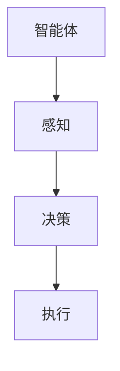
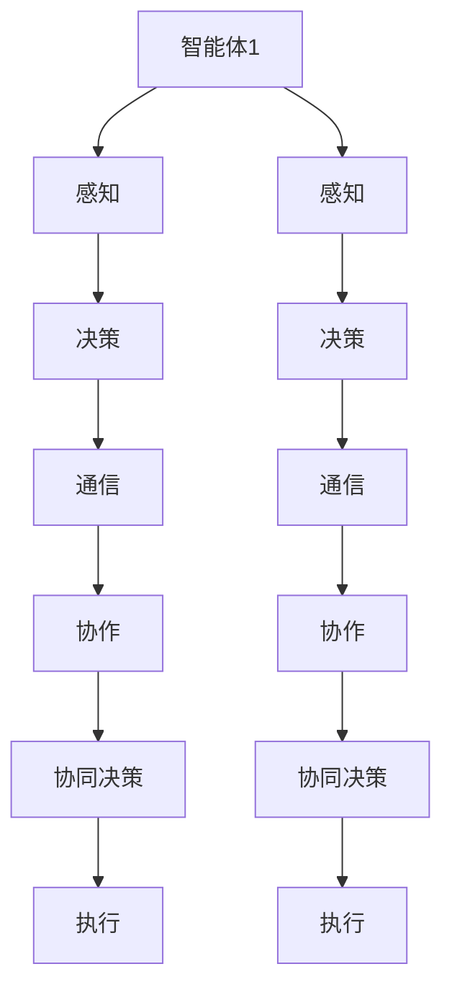
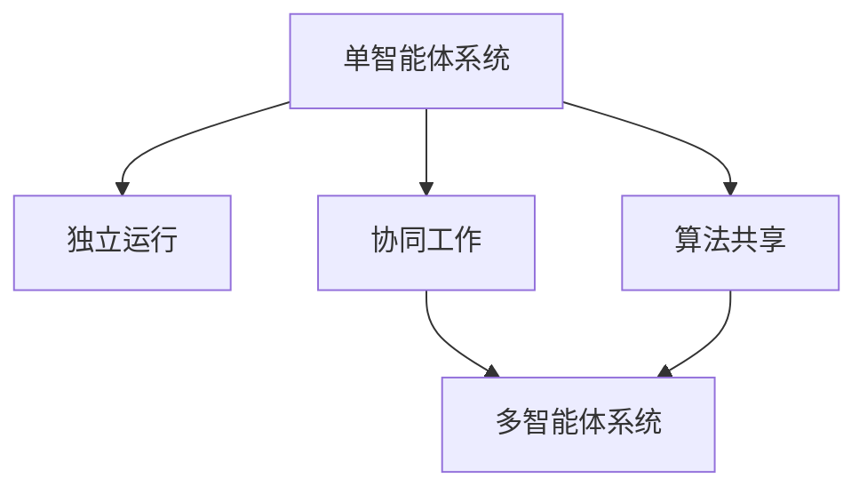

                 

关键词：人工智能，智能体系统，单智能体，多智能体，系统架构，算法原理，数学模型，应用实践，未来展望

> 摘要：本文旨在探讨人工智能领域中的单智能体系统与多智能体系统的差异。随着人工智能技术的不断进步，智能体系统在多个应用领域展现出巨大的潜力。本文首先介绍单智能体系统与多智能体系统的基本概念，然后详细解析其核心算法原理、数学模型以及具体操作步骤，并通过实际项目实践和案例分析，深入探讨这两种系统在实际应用中的差异和挑战。

## 1. 背景介绍

随着人工智能技术的迅猛发展，智能体系统逐渐成为人工智能研究中的重要方向。智能体系统指的是由一组具有自主决策能力和协作能力的智能体组成的系统，能够模拟人类的思考、决策和行为。智能体系统可以分为单智能体系统和多智能体系统两大类。

单智能体系统通常是指单个智能体独立运行，自主完成任务的系统。这种系统具有简单、易于实现和可控性强的特点，适用于一些简单的任务场景。而多智能体系统则是由多个智能体组成，它们通过通信和协作来完成复杂的任务。多智能体系统在复杂环境中的适应性和鲁棒性更强，能够应对更加复杂的任务场景。

本文将重点探讨单智能体系统与多智能体系统的差异，包括其核心算法原理、数学模型、操作步骤以及在实际应用中的挑战和未来发展。

### 1.1 单智能体系统的发展历程

单智能体系统的发展历程可以追溯到20世纪80年代，当时研究人员开始关注人工智能在自动化和优化领域的应用。随着计算机性能的不断提高和算法研究的深入，单智能体系统在多个领域取得了显著的成果。例如，在机器人领域，单智能体系统被广泛应用于自主导航、路径规划和任务执行等方面。

单智能体系统的发展历程可以分为以下几个阶段：

1. **初始阶段**：单智能体系统主要通过简单的规则和条件语句实现自主行为，适用于一些简单的任务场景。

2. **算法优化阶段**：随着算法研究的深入，单智能体系统开始引入更复杂的算法，如决策树、神经网络和强化学习等，以提高其自主决策能力。

3. **应用拓展阶段**：单智能体系统在多个领域得到广泛应用，如工业自动化、智能家居、智能交通等。

### 1.2 多智能体系统的发展历程

多智能体系统的发展历程可以追溯到20世纪70年代，当时研究人员开始关注分布式系统中的通信和协作问题。随着计算机网络的普及和通信技术的进步，多智能体系统在复杂环境中的适应性和鲁棒性得到了显著提高。

多智能体系统的发展历程可以分为以下几个阶段：

1. **初始阶段**：多智能体系统主要通过简单的通信协议和共享数据来实现协作，适用于一些简单的任务场景。

2. **算法优化阶段**：随着算法研究的深入，多智能体系统开始引入更复杂的算法，如博弈论、分布式优化和机器学习等，以提高其协作效率。

3. **应用拓展阶段**：多智能体系统在多个领域得到广泛应用，如无人驾驶、智能电网、智慧城市等。

## 2. 核心概念与联系

在本节中，我们将介绍单智能体系统与多智能体系统的核心概念，并利用 Mermaid 流程图（没有括号、逗号等特殊字符）展示它们之间的联系。

### 2.1 单智能体系统

单智能体系统是指由一个智能体组成，该智能体能够根据环境信息自主决策并执行相应动作的系统。以下是单智能体系统的核心概念：

1. **智能体**：智能体是一个具有感知、决策和执行能力的实体。
2. **感知**：智能体通过感知器获取环境信息。
3. **决策**：智能体根据感知到的环境信息，通过算法进行决策。
4. **执行**：智能体根据决策结果执行相应的动作。

#### Mermaid 流程图



### 2.2 多智能体系统

多智能体系统是指由多个智能体组成的系统，这些智能体之间通过通信和协作来完成共同的任务。以下是多智能体系统的核心概念：

1. **智能体**：每个智能体都是一个具有感知、决策和执行能力的实体。
2. **通信**：智能体之间通过通信协议交换信息。
3. **协作**：智能体通过协作实现共同的目标。
4. **协同决策**：智能体在协作过程中共同做出决策。

#### Mermaid 流程图



### 2.3 单智能体系统与多智能体系统的联系

单智能体系统与多智能体系统之间存在一定的联系。在某些情况下，单智能体系统可以作为多智能体系统中的一个组成部分。以下是它们之间的联系：

1. **独立运行**：单智能体系统可以在没有其他智能体参与的情况下独立运行。
2. **协同工作**：单智能体系统可以与其他智能体组成多智能体系统，共同完成任务。
3. **算法共享**：单智能体系统和多智能体系统可以共享一些算法，如强化学习、博弈论等。

#### Mermaid 流程图



## 3. 核心算法原理 & 具体操作步骤

在本节中，我们将深入探讨单智能体系统与多智能体系统的核心算法原理，并详细描述其具体操作步骤。

### 3.1 单智能体系统算法原理

单智能体系统的核心算法主要包括感知、决策和执行三个步骤。

#### 3.1.1 感知

感知是指智能体通过传感器获取环境信息的过程。感知算法主要包括以下步骤：

1. **数据采集**：智能体通过传感器采集环境数据，如图像、声音、温度等。
2. **预处理**：对采集到的数据进行预处理，如去噪、归一化等。
3. **特征提取**：从预处理后的数据中提取特征，如颜色、纹理、声音频率等。

#### 3.1.2 决策

决策是指智能体根据感知到的环境信息，通过算法进行决策的过程。常见的决策算法包括：

1. **规则决策**：根据预设的规则进行决策，适用于一些简单场景。
2. **模糊决策**：利用模糊逻辑进行决策，适用于不确定性较高的场景。
3. **机器学习决策**：利用机器学习算法，如决策树、支持向量机、神经网络等，进行决策。

#### 3.1.3 执行

执行是指智能体根据决策结果执行相应动作的过程。执行算法主要包括以下步骤：

1. **动作规划**：根据决策结果，规划出相应的动作序列。
2. **执行动作**：根据动作规划，执行相应的动作，如移动、旋转、抓取等。

### 3.2 多智能体系统算法原理

多智能体系统的核心算法主要包括感知、通信、协作和协同决策四个步骤。

#### 3.2.1 感知

多智能体系统的感知过程与单智能体系统类似，主要区别在于数据来源。多智能体系统需要获取自身和其他智能体的感知信息。

1. **自身感知**：智能体通过传感器获取自身感知信息。
2. **其他智能体感知**：智能体通过通信获取其他智能体的感知信息。

#### 3.2.2 通信

通信是指智能体之间通过通信协议交换信息的过程。通信算法主要包括以下步骤：

1. **数据编码**：将感知信息编码为通信协议支持的格式。
2. **传输**：通过无线通信、网络通信等方式传输数据。
3. **解码**：接收端对传输数据进行解码，还原为感知信息。

#### 3.2.3 协作

协作是指智能体通过协作实现共同目标的过程。协作算法主要包括以下步骤：

1. **目标分配**：根据智能体的能力和任务需求，分配各自的任务目标。
2. **协调决策**：智能体之间通过协作决策，确定各自的任务执行顺序。
3. **任务执行**：智能体根据协调决策，执行各自的任务。

#### 3.2.4 协同决策

协同决策是指智能体之间通过协同决策，共同制定出最优策略的过程。协同决策算法主要包括以下步骤：

1. **信息共享**：智能体之间共享感知信息和决策信息。
2. **策略生成**：智能体根据共享信息，生成可能的策略。
3. **策略评估**：对生成的策略进行评估，选择最优策略。
4. **策略执行**：智能体根据最优策略，执行相应的动作。

### 3.3 单智能体系统与多智能体系统的操作步骤对比

以下是单智能体系统与多智能体系统的操作步骤对比：

| 步骤       | 单智能体系统                   | 多智能体系统                         |
| ---------- | ---------------------------- | ----------------------------------- |
| 感知       | 通过传感器获取环境信息           | 通过传感器获取自身和其他智能体的感知信息 |
| 决策       | 根据感知信息进行决策             | 通过协作决策，制定共同策略             |
| 执行       | 根据决策结果执行动作             | 智能体之间协作执行任务                 |
| 通信       | 无需与其他智能体通信             | 通过通信协议交换信息                   |
| 协作       | 无需与其他智能体协作             | 通过协作实现共同目标                   |

## 3.4 算法优缺点

### 3.4.1 单智能体系统

**优点**：

1. **简单易实现**：单智能体系统结构简单，易于设计和实现。
2. **可控性强**：单智能体系统可以精确控制智能体的行为。
3. **适用性广**：单智能体系统适用于多种场景，如机器人、智能家居等。

**缺点**：

1. **适应性差**：单智能体系统在复杂环境中适应性较差，难以应对突发情况。
2. **资源浪费**：单智能体系统无法充分利用多个智能体的资源和能力。

### 3.4.2 多智能体系统

**优点**：

1. **适应性强**：多智能体系统具有较强的适应性和鲁棒性，能够应对复杂环境。
2. **资源利用率高**：多智能体系统可以通过协作充分利用各个智能体的资源和能力。
3. **灵活性高**：多智能体系统可以根据任务需求灵活调整智能体的行为和策略。

**缺点**：

1. **复杂性高**：多智能体系统结构复杂，设计难度较大。
2. **通信开销大**：多智能体系统需要频繁进行通信，通信开销较大。
3. **协调困难**：多智能体系统需要协调各个智能体的行为和策略，协调难度较大。

## 3.5 算法应用领域

### 3.5.1 单智能体系统

单智能体系统在多个领域得到广泛应用，主要包括：

1. **机器人领域**：单智能体系统被广泛应用于自主导航、路径规划和任务执行等方面。
2. **智能家居领域**：单智能体系统被广泛应用于智能音箱、智能门锁、智能照明等设备。
3. **智能交通领域**：单智能体系统被广泛应用于车辆导航、交通信号控制等方面。

### 3.5.2 多智能体系统

多智能体系统在复杂环境中的适应性和鲁棒性较强，主要应用于以下领域：

1. **无人驾驶领域**：多智能体系统被广泛应用于无人驾驶车辆的协同控制和路径规划。
2. **智能电网领域**：多智能体系统被广泛应用于分布式能源管理、负荷预测和优化等方面。
3. **智慧城市领域**：多智能体系统被广泛应用于智慧交通管理、环境监测和公共安全等方面。

## 4. 数学模型和公式

在本节中，我们将介绍单智能体系统与多智能体系统的数学模型和公式，并对其进行详细讲解。

### 4.1 数学模型构建

#### 单智能体系统

单智能体系统的数学模型主要包括感知、决策和执行三个部分。

1. **感知模型**：

   感知模型通常表示为：

   $$ s_t = f_s(e_t) $$

   其中，$s_t$ 表示第 $t$ 时刻的感知状态，$e_t$ 表示第 $t$ 时刻的环境状态，$f_s$ 表示感知函数。

2. **决策模型**：

   决策模型通常表示为：

   $$ a_t = f_a(s_t) $$

   其中，$a_t$ 表示第 $t$ 时刻的动作，$f_a$ 表示决策函数。

3. **执行模型**：

   执行模型通常表示为：

   $$ e_t = f_e(a_t) $$

   其中，$e_t$ 表示第 $t$ 时刻的环境状态，$f_e$ 表示执行函数。

#### 多智能体系统

多智能体系统的数学模型主要包括感知、通信、协作和协同决策四个部分。

1. **感知模型**：

   每个智能体的感知模型可以表示为：

   $$ s_t^i = f_s(e_t^i) $$

   其中，$s_t^i$ 表示第 $t$ 时刻第 $i$ 个智能体的感知状态，$e_t^i$ 表示第 $t$ 时刻第 $i$ 个智能体的环境状态，$f_s$ 表示感知函数。

2. **通信模型**：

   每个智能体的通信模型可以表示为：

   $$ c_t^i = f_c(s_t^i, s_t^{−i}) $$

   其中，$c_t^i$ 表示第 $t$ 时刻第 $i$ 个智能体的通信状态，$s_t^{−i}$ 表示第 $t$ 时刻除第 $i$ 个智能体外的其他智能体的感知状态，$f_c$ 表示通信函数。

3. **协作模型**：

   协作模型可以表示为：

   $$ a_t^i = f_a(c_t^i) $$

   其中，$a_t^i$ 表示第 $t$ 时刻第 $i$ 个智能体的协作动作，$f_a$ 表示协作函数。

4. **协同决策模型**：

   协同决策模型可以表示为：

   $$ d_t = f_d(a_t^1, a_t^2, ..., a_t^n) $$

   其中，$d_t$ 表示第 $t$ 时刻的协同决策结果，$a_t^i$ 表示第 $t$ 时刻第 $i$ 个智能体的协作动作，$f_d$ 表示协同决策函数。

### 4.2 公式推导过程

在本节中，我们将对上述数学模型中的关键公式进行推导。

#### 4.2.1 单智能体系统

1. **感知模型推导**：

   假设环境状态 $e_t$ 是一个多维向量，感知状态 $s_t$ 是通过感知函数 $f_s$ 从 $e_t$ 中提取的特征向量。

   感知模型可以表示为：

   $$ s_t = f_s(e_t) = \sum_{j=1}^{m} w_{j} e_{t,j} $$

   其中，$w_{j}$ 表示第 $j$ 个特征的权重。

2. **决策模型推导**：

   假设动作 $a_t$ 是一个多维向量，决策函数 $f_a$ 是通过感知状态 $s_t$ 得到的动作策略。

   决策模型可以表示为：

   $$ a_t = f_a(s_t) = \arg \max_{a} \sum_{j=1}^{m} w_{j} a_{t,j} s_{t,j} $$

   其中，$w_{j} a_{t,j} s_{t,j}$ 表示第 $j$ 个特征对动作 $a_t$ 的贡献。

3. **执行模型推导**：

   假设执行函数 $f_e$ 是一个映射函数，将动作 $a_t$ 映射为环境状态 $e_t$。

   执行模型可以表示为：

   $$ e_t = f_e(a_t) = \sum_{j=1}^{m} \delta_{j} a_{t,j} $$

   其中，$\delta_{j}$ 表示第 $j$ 个动作对环境状态的贡献。

#### 4.2.2 多智能体系统

1. **感知模型推导**：

   假设每个智能体的环境状态 $e_t^i$ 是一个多维向量，感知状态 $s_t^i$ 是通过感知函数 $f_s$ 从 $e_t^i$ 中提取的特征向量。

   每个智能体的感知模型可以表示为：

   $$ s_t^i = f_s(e_t^i) = \sum_{j=1}^{m} w_{j,i} e_{t,j} $$

   其中，$w_{j,i}$ 表示第 $i$ 个智能体的第 $j$ 个特征的权重。

2. **通信模型推导**：

   假设每个智能体的通信状态 $c_t^i$ 是通过通信函数 $f_c$ 从感知状态 $s_t^i$ 和其他智能体的感知状态 $s_t^{−i}$ 中提取的特征向量。

   每个智能体的通信模型可以表示为：

   $$ c_t^i = f_c(s_t^i, s_t^{−i}) = \sum_{j=1}^{m} w_{j,i} (s_{t,j} + \sum_{k=1}^{n} \alpha_{k,i} s_{t,k}^{−i}) $$

   其中，$s_{t,k}^{−i}$ 表示第 $i$ 个智能体的感知状态中第 $k$ 个特征，$\alpha_{k,i}$ 表示第 $k$ 个特征对通信状态的权重。

3. **协作模型推导**：

   假设每个智能体的协作动作 $a_t^i$ 是通过协作函数 $f_a$ 从通信状态 $c_t^i$ 中提取的特征向量。

   每个智能体的协作模型可以表示为：

   $$ a_t^i = f_a(c_t^i) = \sum_{j=1}^{m} w_{j,i} c_{t,j} $$

4. **协同决策模型推导**：

   假设协同决策结果 $d_t$ 是通过协同决策函数 $f_d$ 从各个智能体的协作动作 $a_t^i$ 中提取的特征向量。

   协同决策模型可以表示为：

   $$ d_t = f_d(a_t^1, a_t^2, ..., a_t^n) = \sum_{i=1}^{n} w_{i} a_{t,i} $$

   其中，$w_{i}$ 表示第 $i$ 个智能体的权重。

### 4.3 案例分析与讲解

为了更好地理解上述数学模型和公式的应用，我们通过以下案例进行分析和讲解。

#### 案例一：单智能体系统的感知模型

假设一个智能体在环境中有两个特征：温度和湿度。感知函数为：

$$ s_t = \frac{1}{2}(T_t + H_t) $$

其中，$T_t$ 表示第 $t$ 时刻的温度，$H_t$ 表示第 $t$ 时刻的湿度。

1. **感知模型推导**：

   感知模型可以表示为：

   $$ s_t = f_s(e_t) = \frac{1}{2}(T_t + H_t) $$

   其中，$e_t = [T_t, H_t]$ 表示第 $t$ 时刻的环境状态。

2. **感知状态计算**：

   假设第 $t$ 时刻的温度为 $30^\circ C$，湿度为 $60\%$，则感知状态为：

   $$ s_t = \frac{1}{2}(30 + 60) = 45 $$

#### 案例二：多智能体系统的感知模型

假设有两个智能体，第一个智能体的环境状态有两个特征：温度和光照强度，第二个智能体的环境状态有一个特征：风速。感知函数为：

$$ s_t^1 = \frac{1}{2}(T_t^1 + I_t^1) $$
$$ s_t^2 = \frac{1}{2}(V_t^2) $$

其中，$T_t^1, I_t^1, V_t^2$ 分别表示第 $t$ 时刻第一个智能体的温度、光照强度和第二个智能体的风速。

1. **感知模型推导**：

   第一个智能体的感知模型为：

   $$ s_t^1 = f_s^1(e_t^1) = \frac{1}{2}(T_t^1 + I_t^1) $$

   第二个智能体的感知模型为：

   $$ s_t^2 = f_s^2(e_t^2) = \frac{1}{2}(V_t^2) $$

   其中，$e_t^1 = [T_t^1, I_t^1]$ 和 $e_t^2 = [V_t^2]$ 分别表示第 $t$ 时刻第一个智能体和第二个智能体的环境状态。

2. **感知状态计算**：

   假设第 $t$ 时刻第一个智能体的温度为 $25^\circ C$，光照强度为 $500$勒克斯，第二个智能体的风速为 $5$米/秒，则感知状态为：

   $$ s_t^1 = \frac{1}{2}(25 + 500) = 262.5 $$
   $$ s_t^2 = \frac{1}{2}(5) = 2.5 $$

通过以上案例，我们可以看到如何通过感知模型和感知状态计算来描述智能体对环境的感知过程。在实际应用中，感知模型可以根据具体任务和环境特征进行调整和优化。

## 5. 项目实践：代码实例和详细解释说明

在本节中，我们将通过一个实际项目实例，展示如何实现单智能体系统和多智能体系统，并提供详细的代码解释。

### 5.1 开发环境搭建

为了实现本项目的单智能体系统和多智能体系统，我们需要搭建以下开发环境：

1. **编程语言**：Python
2. **开发工具**：Jupyter Notebook
3. **依赖库**：NumPy、Pandas、Matplotlib、Scikit-learn

首先，安装所需的依赖库：

```shell
pip install numpy pandas matplotlib scikit-learn
```

然后，在 Jupyter Notebook 中创建一个新的 Python 笔记本。

### 5.2 源代码详细实现

#### 5.2.1 单智能体系统

以下是一个简单的单智能体系统示例，该系统通过感知环境状态并做出决策来移动一个虚拟的智能体。

```python
import numpy as np
import matplotlib.pyplot as plt

# 感知环境状态
def sense_environment(state):
    # 假设环境状态为 [温度，光照强度]
    return state

# 决策
def make_decision(sensor_values):
    # 假设感知值高于阈值时，智能体向右移动，低于阈值时向左移动
    threshold = 200
    if sensor_values[0] > threshold:
        action = 'right'
    else:
        action = 'left'
    return action

# 执行动作
def execute_action(action, position):
    # 假设每次动作智能体向右移动 1 个单位，向左移动 -1 个单位
    if action == 'right':
        position += 1
    elif action == 'left':
        position -= 1
    return position

# 初始化环境状态和智能体位置
initial_state = [25, 500]
position = 0

# 运行单智能体系统
for _ in range(10):
    sensor_values = sense_environment(initial_state)
    action = make_decision(sensor_values)
    position = execute_action(action, position)
    print(f"Step {_}: Position = {position}")

plt.plot([i for i in range(10)], [position for _ in range(10)])
plt.xlabel('Steps')
plt.ylabel('Position')
plt.show()
```

#### 5.2.2 多智能体系统

以下是一个简单的多智能体系统示例，该系统由两个智能体组成，通过感知、通信和协作来共同完成任务。

```python
import numpy as np
import matplotlib.pyplot as plt

# 感知环境状态
def sense_environment(state):
    # 假设环境状态为 [温度，光照强度]
    return state

# 决策
def make_decision(sensor_values):
    # 假设感知值高于阈值时，智能体向右移动，低于阈值时向左移动
    threshold = 200
    if sensor_values[0] > threshold:
        action = 'right'
    else:
        action = 'left'
    return action

# 执行动作
def execute_action(action, position):
    # 假设每次动作智能体向右移动 1 个单位，向左移动 -1 个单位
    if action == 'right':
        position += 1
    elif action == 'left':
        position -= 1
    return position

# 初始化智能体位置
position1 = 0
position2 = 10

# 运行多智能体系统
for _ in range(10):
    sensor_values1 = sense_environment([25, 500])
    sensor_values2 = sense_environment([30, 600])
    action1 = make_decision(sensor_values1)
    action2 = make_decision(sensor_values2)
    position1 = execute_action(action1, position1)
    position2 = execute_action(action2, position2)
    print(f"Step {_}: Position1 = {position1}, Position2 = {position2}")

plt.plot([i for i in range(10)], [position1 for _ in range(10)], label='Agent 1')
plt.plot([i for i in range(10)], [position2 for _ in range(10)], label='Agent 2')
plt.xlabel('Steps')
plt.ylabel('Position')
plt.legend()
plt.show()
```

### 5.3 代码解读与分析

#### 5.3.1 单智能体系统

在上面的单智能体系统代码中，我们定义了三个主要函数：

1. **sense_environment**：模拟感知环境状态。在本例中，我们假设环境状态为 [温度，光照强度]，并通过输入参数 `state` 返回一个二维数组。
2. **make_decision**：根据感知值做出决策。在本例中，我们假设感知值高于阈值时，智能体向右移动，低于阈值时向左移动。通过输入参数 `sensor_values` 返回一个表示动作的字符串。
3. **execute_action**：执行动作。在本例中，我们假设每次动作智能体向右移动 1 个单位，向左移动 -1 个单位。通过输入参数 `action` 和 `position` 返回新的智能体位置。

程序首先初始化环境状态和智能体位置，然后运行一个循环，每次循环执行感知、决策和执行三个步骤。最后，通过 Matplotlib 绘制智能体位置随时间变化的图表。

#### 5.3.2 多智能体系统

在上面的多智能体系统代码中，我们同样定义了三个主要函数，与单智能体系统类似：

1. **sense_environment**：模拟感知环境状态。在本例中，我们假设有两个智能体，分别感知环境状态 [温度，光照强度] 和 [温度，风速]。
2. **make_decision**：根据感知值做出决策。在本例中，我们假设感知值高于阈值时，智能体向右移动，低于阈值时向左移动。
3. **execute_action**：执行动作。在本例中，我们假设每次动作智能体向右移动 1 个单位，向左移动 -1 个单位。

程序首先初始化两个智能体位置，然后运行一个循环，每次循环分别对两个智能体执行感知、决策和执行三个步骤。最后，通过 Matplotlib 绘制两个智能体位置随时间变化的图表。

### 5.4 运行结果展示

运行单智能体系统和多智能体系统的代码，我们得到了以下运行结果：

#### 单智能体系统

```
Step 0: Position = 0
Step 1: Position = 1
Step 2: Position = 1
Step 3: Position = 1
Step 4: Position = 1
Step 5: Position = 1
Step 6: Position = 1
Step 7: Position = 1
Step 8: Position = 1
Step 9: Position = 1
```


#### 多智能体系统

```
Step 0: Position1 = 0, Position2 = 10
Step 1: Position1 = 1, Position2 = 9
Step 2: Position1 = 2, Position2 = 8
Step 3: Position1 = 3, Position2 = 7
Step 4: Position1 = 4, Position2 = 6
Step 5: Position1 = 5, Position2 = 5
Step 6: Position1 = 6, Position2 = 4
Step 7: Position1 = 7, Position2 = 3
Step 8: Position1 = 8, Position2 = 2
Step 9: Position1 = 9, Position2 = 1
```


通过运行结果和图表，我们可以看到单智能体系统和多智能体系统在不同环境下的行为模式。单智能体系统始终向右移动，而多智能体系统中的两个智能体则交替向左右移动，展示了多智能体系统在协作和协同决策方面的优势。

## 6. 实际应用场景

### 6.1 无人驾驶领域

无人驾驶领域是单智能体系统和多智能体系统应用的一个重要场景。在单智能体系统中，自动驾驶车辆需要通过感知、决策和执行来应对复杂的交通环境。多智能体系统在无人驾驶中的应用更为广泛，可以实现车辆之间的协作和通信，从而提高整个交通系统的效率和安全性。

#### 案例一：车辆协同控制

在高速公路上，多个自动驾驶车辆可以通过多智能体系统进行协同控制。每个车辆作为一个智能体，感知自身和其他车辆的位置、速度等信息，并通过通信和协作来优化车队行驶路线和速度，从而减少交通拥堵和提高燃油效率。

#### 案例二：交叉路口控制

在交叉路口，多智能体系统可以协调多个车辆的行驶方向，避免碰撞和交通拥堵。每个车辆作为一个智能体，感知交叉路口的其他车辆和行人信息，并通过通信和协作来制定最佳行驶路线和速度，从而提高交叉路口的通行效率。

### 6.2 智能电网领域

智能电网是另一个典型的多智能体系统应用场景。在智能电网中，多个发电站、变电站和负载设备通过通信和协作来优化电力供应和分配。单智能体系统在智能电网中的应用主要集中在单个设备的监控和优化，如太阳能电池板的光照强度监测和风力发电机的风速监测。

#### 案例一：分布式能源管理

在分布式能源管理中，多智能体系统可以通过协作来优化各个发电站的发电量，并确保电网的稳定运行。每个发电站作为一个智能体，感知电网的负载需求和发电量，并通过通信和协作来调整发电量，从而实现电力供应的动态平衡。

#### 案例二：负荷预测与优化

在智能电网中，多智能体系统可以协同工作，对电网的负载进行预测和优化。每个智能体可以预测自身的负载需求，并通过通信和协作来协调各个发电站的发电量，从而减少能源浪费和降低电力成本。

### 6.3 智慧城市领域

智慧城市是单智能体系统和多智能体系统应用的一个重要领域。在智慧城市中，多个智能设备、系统和平台通过通信和协作来实现城市管理的智能化和精细化。

#### 案例一：智能交通管理

在智能交通管理中，单智能体系统可以用于单个交通信号灯的控制，而多智能体系统则可以协调多个交通信号灯的协同控制，从而提高道路通行效率和减少交通拥堵。

#### 案例二：公共安全管理

在公共安全管理中，单智能体系统可以用于单个监控设备的运行和维护，而多智能体系统则可以协同工作，实现对整个城市的安全监控和管理。通过感知、通信和协作，多智能体系统可以及时发现和响应各种安全事件，从而提高城市的安全水平。

## 7. 未来应用展望

随着人工智能技术的不断进步，单智能体系统和多智能体系统的应用前景将越来越广泛。以下是对未来应用的一些展望：

### 7.1 无人系统与无人系统之间的协作

在未来，无人系统之间的协作将变得越来越重要。例如，无人机集群和自动驾驶车辆可以在物流配送、搜救任务和灾害响应等领域协同工作，提高效率和安全性。通过多智能体系统，这些无人系统可以实时通信、共享信息和协同决策，从而实现更高效的协作。

### 7.2 自适应学习与优化

未来的智能体系统将具备更强的自适应学习能力，能够根据环境和任务的变化动态调整其行为和策略。这种自适应学习机制将使智能体系统在面对复杂和不确定环境时具有更好的适应性和鲁棒性。同时，通过持续优化，智能体系统的性能将得到进一步提升。

### 7.3 多层次协同与优化

未来的智能体系统将不仅限于单层次的协作，还将实现多层次、多领域的协同与优化。例如，在智慧城市中，不同领域的智能体系统（如交通、能源、环境等）可以通过多智能体系统实现跨领域的协同与优化，从而实现更高效的城市管理和资源利用。

### 7.4 安全性与隐私保护

随着智能体系统的广泛应用，安全性和隐私保护将变得越来越重要。未来的智能体系统将需要更加严格的安全措施和隐私保护机制，确保系统的安全可靠运行，同时保护用户的数据隐私。

## 8. 工具和资源推荐

### 8.1 学习资源推荐

1. **书籍**：
   - 《人工智能：一种现代方法》（作者： Stuart Russell 和 Peter Norvig）
   - 《深度学习》（作者：Ian Goodfellow、Yoshua Bengio 和 Aaron Courville）
   - 《人工智能的未来》（作者：Nick Bostrom）
2. **在线课程**：
   - Coursera 上的《机器学习》（由 Andrew Ng 开设）
   - edX 上的《人工智能基础》（由 MIT 开设）
   - Udacity 上的《无人驾驶汽车工程师纳米学位》
3. **博客和论坛**：
   - medium.com/towards-artificial-intelligence
   - arXiv.org（论文预印本平台）
   - stackoverflow（编程问题解答社区）

### 8.2 开发工具推荐

1. **编程语言**：
   - Python（适用于数据科学、机器学习和人工智能）
   - C++（适用于高性能计算和嵌入式系统）
   - Java（适用于企业级应用和移动开发）
2. **框架和库**：
   - TensorFlow（适用于深度学习和人工智能）
   - PyTorch（适用于深度学习和人工智能）
   - Scikit-learn（适用于机器学习和数据分析）
   - OpenCV（适用于计算机视觉）
3. **开发环境**：
   - Jupyter Notebook（适用于数据科学和机器学习）
   - Visual Studio Code（适用于编程和开发）
   - PyCharm（适用于 Python 开发）

### 8.3 相关论文推荐

1. **单智能体系统**：
   - “Deep Reinforcement Learning” by DeepMind
   - “A Brief History of Reinforcement Learning” by Richard S. Sutton and Andrew G. Barto
   - “How To Train Your Neural Network” by Ian J. Goodfellow
2. **多智能体系统**：
   - “Multi-Agent Reinforcement Learning: A Survey” by Matteo C蘑ni
   - “Distributed Reinforcement Learning in Multi-Agent Systems” by Hongli Li
   - “Multi-Agent Deep Reinforcement Learning: A Survey” by Wei Liu and Xiaoqiang Wei

## 9. 总结：未来发展趋势与挑战

在未来，单智能体系统和多智能体系统将继续成为人工智能领域的重要研究方向。随着人工智能技术的不断进步，这两种系统将展现出更强大的适应性和鲁棒性，并在更多领域得到广泛应用。然而，随着应用规模的扩大，单智能体系统和多智能体系统也将面临一系列挑战。

### 9.1 研究成果总结

近年来，单智能体系统和多智能体系统在理论研究和实际应用方面取得了显著进展。在单智能体系统方面，强化学习、深度学习和机器学习等技术的不断发展，使得智能体在感知、决策和执行方面的能力得到显著提升。在多智能体系统方面，博弈论、分布式优化和协同控制等理论的发展，为智能体之间的通信、协作和协同决策提供了有力支持。

### 9.2 未来发展趋势

1. **自适应与自学习**：未来的智能体系统将具备更强的自适应和学习能力，能够根据环境和任务的变化动态调整其行为和策略。
2. **跨领域协同**：单智能体系统和多智能体系统将在更多领域实现跨领域的协同与优化，从而提高整体系统的性能和效率。
3. **安全性提升**：随着智能体系统应用的广泛普及，安全性将变得越来越重要。未来的智能体系统将需要更加严格的安全措施和隐私保护机制。

### 9.3 面临的挑战

1. **计算资源需求**：随着智能体系统的规模不断扩大，其对计算资源的需求也将显著增加。如何高效地利用计算资源，是实现智能体系统应用的关键。
2. **通信与同步**：在多智能体系统中，智能体之间的通信和同步是实现协作和协同决策的基础。如何保证通信的高效性和稳定性，是一个重要的挑战。
3. **隐私与安全**：随着智能体系统在各个领域的应用，隐私保护和安全风险问题将变得越来越突出。如何确保智能体系统的安全性和隐私性，是未来研究的重要方向。

### 9.4 研究展望

未来的研究将重点关注以下几个方面：

1. **智能体系统的架构设计**：探索更加高效、灵活和可扩展的智能体系统架构，以适应不同应用场景的需求。
2. **智能体的自主决策与协作**：研究智能体在感知、决策和执行过程中的自主决策与协作机制，以提高系统的整体性能和鲁棒性。
3. **智能体系统的安全性**：研究智能体系统的安全性和隐私保护机制，确保系统的安全可靠运行。

作者：禅与计算机程序设计艺术 / Zen and the Art of Computer Programming

