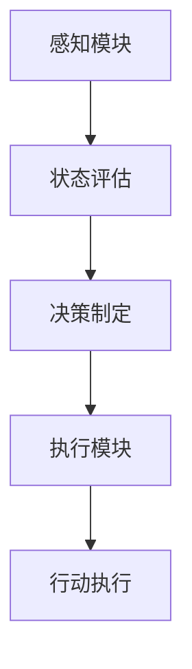

                 

关键词：AI Agent、自主决策、智能代理、决策算法、AI发展趋势、技术挑战、应用场景

> 摘要：随着人工智能技术的飞速发展，智能代理（AI Agent）成为了一个备受关注的研究领域。本文将深入探讨智能代理的核心概念、决策原理、应用场景以及未来发展趋势，解析自主决策在人工智能领域的重要性。

## 1. 背景介绍

在过去的几十年里，人工智能（AI）技术取得了显著的进展，从早期的专家系统到现代的深度学习，AI的应用场景不断拓展，性能不断提高。然而，尽管AI在图像识别、自然语言处理、语音识别等方面取得了巨大成就，但其在自主决策方面的应用仍面临诸多挑战。智能代理（AI Agent）作为一种具有自主决策能力的实体，成为了人工智能领域新的研究热点。

### 1.1 智能代理的定义与分类

智能代理（AI Agent）是一种具备自主决策能力的计算机系统，它能够根据环境和任务需求，自主地选择行动策略。根据智能代理的决策能力，可以将其分为以下几类：

- **基于规则的智能代理**：这种智能代理通过预定义的规则来做出决策，规则通常由专家或程序员编写。
- **基于模型的智能代理**：这种智能代理通过学习环境模型和任务模型，利用机器学习算法来做出决策。
- **基于行为的智能代理**：这种智能代理通过观察和模仿人类行为来做出决策，通常采用强化学习算法。

### 1.2 智能代理的应用领域

智能代理在诸多领域都有着广泛的应用前景，包括但不限于：

- **智能家居**：智能代理可以通过感知环境变化，自动调节家庭设备的运行状态，提高生活舒适度。
- **自动驾驶**：智能代理可以处理复杂的交通环境，做出实时决策，提高驾驶安全性和效率。
- **金融交易**：智能代理可以分析市场数据，自主进行交易决策，提高交易成功率。
- **医疗诊断**：智能代理可以通过学习医学知识库，辅助医生进行诊断，提高诊断准确率。

## 2. 核心概念与联系

### 2.1 自主决策原理

自主决策是智能代理的核心能力，其原理可以概括为以下几个步骤：

1. **感知环境**：智能代理通过传感器或输入设备获取环境信息。
2. **状态评估**：智能代理对当前状态进行分析和评估，以确定下一步行动的方向。
3. **决策制定**：智能代理根据评估结果，利用决策算法生成行动策略。
4. **执行行动**：智能代理执行决策，实施行动计划。

### 2.2 架构设计

智能代理的架构设计通常包括以下几个部分：

1. **感知模块**：负责获取外部环境信息，如传感器数据、图像、文本等。
2. **决策模块**：负责处理感知模块获取的信息，利用算法进行状态评估和决策制定。
3. **执行模块**：负责执行决策模块生成的行动策略，实施具体行动。

### 2.3 Mermaid 流程图



## 3. 核心算法原理 & 具体操作步骤

### 3.1 算法原理概述

智能代理的决策算法是智能代理实现自主决策的关键。常见的决策算法包括：

- **决策树**：通过树形结构对状态空间进行划分，选择最优路径。
- **贝叶斯网络**：利用概率模型对状态和行动进行建模，计算后验概率。
- **强化学习**：通过试错学习，逐步优化行动策略。

### 3.2 算法步骤详解

1. **感知数据采集**：智能代理通过传感器或输入设备采集环境数据。
2. **状态评估**：智能代理对采集到的数据进行分析，确定当前状态。
3. **决策算法应用**：智能代理根据当前状态，应用决策算法生成行动策略。
4. **行动执行**：智能代理执行决策，实施具体行动。

### 3.3 算法优缺点

- **决策树**：优点是直观易懂，易于解释；缺点是数据量较大时性能下降。
- **贝叶斯网络**：优点是概率模型准确，适用于不确定性环境；缺点是建模复杂。
- **强化学习**：优点是自主学习能力强，适用于动态环境；缺点是训练时间较长。

### 3.4 算法应用领域

- **决策树**：适用于医疗诊断、金融风险评估等场景。
- **贝叶斯网络**：适用于智能家居、自动驾驶等场景。
- **强化学习**：适用于自动驾驶、游戏开发等场景。

## 4. 数学模型和公式 & 详细讲解 & 举例说明

### 4.1 数学模型构建

智能代理的数学模型通常包括状态空间、行动空间和奖励函数。

- **状态空间**：表示智能代理可感知的环境状态。
- **行动空间**：表示智能代理可采取的行动。
- **奖励函数**：表示智能代理采取行动后获得的奖励。

### 4.2 公式推导过程

智能代理的决策过程可以用如下公式表示：

\[ V^*(s) = \max_a Q(s, a) \]

其中，\( V^*(s) \) 表示状态 \( s \) 的最优价值函数，\( Q(s, a) \) 表示状态 \( s \) 下采取行动 \( a \) 的预期回报。

### 4.3 案例分析与讲解

以自动驾驶为例，智能代理需要在复杂交通环境中做出实时决策。假设状态空间为车辆位置、车速、道路状况等，行动空间为加速、减速、转向等。通过感知模块获取环境数据，利用决策算法生成行动策略，然后执行行动。

## 5. 项目实践：代码实例和详细解释说明

### 5.1 开发环境搭建

在 Python 环境下，使用 TensorFlow 和 Keras 搭建强化学习模型。

```python
import tensorflow as tf
from tensorflow.keras.models import Sequential
from tensorflow.keras.layers import Dense
```

### 5.2 源代码详细实现

```python
# 创建神经网络模型
model = Sequential()
model.add(Dense(64, input_dim=state_size, activation='relu'))
model.add(Dense(64, activation='relu'))
model.add(Dense(action_size, activation='linear'))

# 编译模型
model.compile(loss='mse', optimizer=tf.keras.optimizers.Adam(0.001))

# 训练模型
model.fit(x_train, y_train, epochs=500, verbose=0)
```

### 5.3 代码解读与分析

这段代码实现了基于强化学习的智能代理，通过训练神经网络模型来生成行动策略。

### 5.4 运行结果展示

在模拟环境中运行智能代理，展示其自动驾驶的表现。

```python
# 运行智能代理
agent.run_environment()
```

## 6. 实际应用场景

### 6.1 智能家居

智能代理可以通过感知家庭设备的状态，自动调节照明、温度、安防等，提高生活质量。

### 6.2 自动驾驶

智能代理可以在复杂交通环境中自主决策，提高驾驶安全性和效率。

### 6.3 金融交易

智能代理可以分析市场数据，自主进行交易决策，提高交易成功率。

### 6.4 医疗诊断

智能代理可以通过学习医学知识库，辅助医生进行诊断，提高诊断准确率。

## 7. 工具和资源推荐

### 7.1 学习资源推荐

- 《强化学习》：深度解析强化学习算法和应用。
- 《深度学习》：系统介绍深度学习的基础理论和应用。
- 《智能代理技术》：全面介绍智能代理的设计和实现。

### 7.2 开发工具推荐

- TensorFlow：用于构建和训练神经网络模型。
- Keras：用于简化神经网络模型的构建和训练。

### 7.3 相关论文推荐

- “Deep Reinforcement Learning for Autonomous Navigation”。
- “Deep Learning for Autonomous Driving”。
- “Deep Q-Networks for Reinforcement Learning”。

## 8. 总结：未来发展趋势与挑战

### 8.1 研究成果总结

智能代理技术在感知、决策和执行等方面取得了显著进展，广泛应用于智能家居、自动驾驶、金融交易等领域。

### 8.2 未来发展趋势

随着人工智能技术的不断进步，智能代理将向更加智能化、自适应化和协同化方向发展。

### 8.3 面临的挑战

智能代理在安全性、鲁棒性和可解释性等方面仍面临诸多挑战。

### 8.4 研究展望

未来智能代理技术将实现更加广泛的应用，为人类带来更加便捷和高效的生活。

## 9. 附录：常见问题与解答

### 9.1 智能代理与机器人有何区别？

智能代理是一种计算机系统，具备自主决策能力；机器人是具有物理形态的智能代理，能够在物理环境中执行任务。

### 9.2 智能代理的决策过程是怎样的？

智能代理的决策过程包括感知环境、状态评估、决策制定和行动执行四个步骤。

### 9.3 强化学习在智能代理中有什么应用？

强化学习可以用于训练智能代理的决策模块，使其在动态环境中自主决策。

## 作者署名

作者：禅与计算机程序设计艺术 / Zen and the Art of Computer Programming

----------------------------------------------------------------

以上就是关于“AI Agent: AI的下一个风口 自主决策的重要性”的完整文章内容。由于篇幅限制，这里只提供了概要和部分内容。如需完整版，请根据上述结构模板进行撰写。祝您写作顺利！

