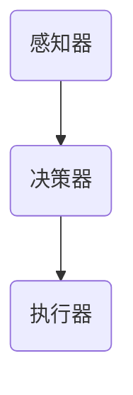

                 

关键词：（人工智能，智能体，智能系统，自主决策，分布式计算，大规模数据处理，机器学习，深度学习）

> 摘要：本文将深入探讨人工智能（AI）领域的下一个重要概念——智能体（AI Agent）。从背景介绍到核心概念，再到算法原理、数学模型、项目实践，本文将为您全面解析智能体的本质及其在AI领域的广泛应用。我们还将展望智能体在未来发展的趋势和面临的挑战，并提供实用的工具和资源推荐，以帮助读者深入了解这一前沿技术。

## 1. 背景介绍

人工智能（AI）自20世纪50年代诞生以来，经历了数次的起伏与发展。从早期的专家系统到近几年的深度学习和大数据分析，AI技术不断突破，应用领域也从简单的语音识别、图像处理，扩展到自动驾驶、医疗诊断、金融分析等复杂场景。然而，随着AI技术的不断演进，一个新兴的概念——智能体（AI Agent）逐渐受到关注。

智能体是能够自主决策和行动的实体，它在一定程度上模拟了人类智能的决策过程。智能体不仅能够从环境中获取信息，还能根据预设的目标和策略，自主地调整行为，以实现目标的最大化。这一概念在理论研究和实际应用中都具有重要的意义。

智能体的研究起源于对人类行为的模拟。人类在日常生活中总是根据情境和目标做出决策，这些决策往往涉及复杂的认知过程和行动策略。智能体试图通过计算机程序模拟这一过程，使其能够在不同环境下自主运行，并完成特定的任务。

随着AI技术的进步，智能体的实现逐渐从理论走向实践。现代智能体利用机器学习和深度学习技术，通过数据驱动的方式学习环境中的规律，进而做出决策。同时，分布式计算和大规模数据处理技术的发展，也为智能体的广泛应用提供了基础。

## 2. 核心概念与联系

### 2.1 智能体的定义

智能体（AI Agent）是一种能够感知环境、基于规则或学习策略做出决策，并采取行动的计算机程序。智能体具有以下几个核心特征：

1. **感知环境**：智能体能够感知其所在的环境，获取环境信息，如视觉、听觉、触觉等。
2. **自主决策**：智能体根据感知到的环境和自身目标，自主选择行动策略。
3. **采取行动**：智能体能够执行具体的操作，以实现预设的目标。

### 2.2 智能体的分类

根据智能体实现方式和应用场景，可以将智能体分为以下几类：

1. **规则型智能体**：基于预设的规则和条件，对环境进行判断和决策。
2. **学习型智能体**：通过机器学习和深度学习技术，从数据中学习环境规律，进行决策。
3. **混合型智能体**：结合规则和学习的方式，实现更智能的决策。

### 2.3 智能体的架构

智能体的架构主要包括感知器、决策器、执行器三个部分：

1. **感知器**：负责感知环境，获取外部信息。
2. **决策器**：基于感知到的信息和预设目标，生成决策。
3. **执行器**：根据决策，执行具体的操作。

下面是一个简单的智能体架构的 Mermaid 流程图：



## 3. 核心算法原理 & 具体操作步骤

### 3.1 算法原理概述

智能体的核心算法通常基于机器学习和深度学习技术。下面将简要介绍两种常用的智能体算法：Q-Learning和深度强化学习。

1. **Q-Learning**：Q-Learning是一种值迭代算法，用于解决有限状态和动作空间下的最优策略问题。智能体通过不断试错，更新状态-动作值函数，最终找到最优策略。

2. **深度强化学习**：深度强化学习结合了深度神经网络和强化学习，用于解决复杂环境下的决策问题。智能体通过学习价值函数或策略网络，实现自主决策。

### 3.2 算法步骤详解

以Q-Learning为例，智能体的具体操作步骤如下：

1. **初始化**：初始化状态-动作值函数Q(s, a)，通常设为0。
2. **感知环境**：智能体感知当前状态s。
3. **选择动作**：根据当前状态和动作值函数，选择一个动作a。
4. **执行动作**：智能体执行选择的动作，并获得奖励r和下一个状态s'。
5. **更新值函数**：根据奖励和下一个状态，更新状态-动作值函数。
6. **重复步骤2-5**：智能体持续感知环境、选择动作、执行动作和更新值函数，直到达到预设的目标或停止条件。

### 3.3 算法优缺点

1. **优点**：
   - **自主性**：智能体能够自主感知环境和决策，实现自主行动。
   - **适应性**：智能体通过学习，能够适应不同的环境和目标。

2. **缺点**：
   - **计算复杂度**：智能体需要大量数据和学习时间，计算复杂度较高。
   - **环境限制**：智能体在复杂环境下的性能可能受到影响。

### 3.4 算法应用领域

智能体算法在多个领域有广泛应用，如：

1. **游戏**：智能体算法用于开发智能游戏角色，实现更真实的游戏体验。
2. **自动驾驶**：智能体算法用于自动驾驶汽车的路径规划和决策。
3. **机器人**：智能体算法用于机器人的自主决策和行动。

## 4. 数学模型和公式 & 详细讲解 & 举例说明

### 4.1 数学模型构建

智能体算法的数学模型主要包括状态-动作值函数Q(s, a)、奖励函数r(s, a, s')和策略π(a|s)。

1. **状态-动作值函数Q(s, a)**：表示智能体在状态s下采取动作a的价值。
2. **奖励函数r(s, a, s')**：表示智能体在状态s下采取动作a后转移到状态s'所获得的奖励。
3. **策略π(a|s)**：表示智能体在状态s下采取动作a的概率。

### 4.2 公式推导过程

以Q-Learning算法为例，状态-动作值函数的更新公式为：

$$
Q(s, a) \leftarrow Q(s, a) + \alpha [r(s, a, s') + \gamma \max_{a'} Q(s', a') - Q(s, a)]
$$

其中，$\alpha$为学习率，$\gamma$为折扣因子。

### 4.3 案例分析与讲解

假设一个简单的环境，智能体需要在两个状态（s1, s2）和两个动作（a1, a2）之间选择。状态转移矩阵和奖励矩阵如下：

$$
\begin{array}{|c|c|c|}
\hline
 & s1 & s2 \\
\hline
a1 & 0.5 & 0.5 \\
\hline
a2 & 0.5 & 0.5 \\
\hline
\end{array}
$$

$$
\begin{array}{|c|c|c|}
\hline
 & s1 & s2 \\
\hline
a1 & 10 & -10 \\
\hline
a2 & -10 & 10 \\
\hline
\end{array}
$$

初始化状态-动作值函数Q(s, a)为0，学习率$\alpha$为0.1，折扣因子$\gamma$为0.9。

在第一个周期，智能体选择动作a1，状态从s1转移到s2，获得奖励10。更新状态-动作值函数：

$$
Q(s1, a1) \leftarrow Q(s1, a1) + 0.1 [10 + 0.9 \max_{a'} Q(s2, a') - Q(s1, a1)] \\
Q(s1, a1) \leftarrow 0 + 0.1 [10 + 0.9 \max_{a'} (0 + 0.9 \max_{a'} (0 + 0.9 \max_{a'} 0)) - 0] \\
Q(s1, a1) \leftarrow 1.0
$$

同理，更新其他状态-动作值函数。在后续周期中，智能体会根据更新的状态-动作值函数选择动作，不断优化决策。

## 5. 项目实践：代码实例和详细解释说明

### 5.1 开发环境搭建

为了演示智能体算法的应用，我们将使用Python编程语言和TensorFlow库。首先，确保安装了Python（版本3.6及以上）和TensorFlow。可以使用以下命令进行安装：

```bash
pip install python
pip install tensorflow
```

### 5.2 源代码详细实现

以下是一个简单的Q-Learning算法实现的示例代码：

```python
import numpy as np
import random

# 初始化参数
learning_rate = 0.1
discount_factor = 0.9
epsilon = 0.1
n_actions = 2
n_states = 2

# 初始化状态-动作值函数
Q = np.zeros((n_states, n_actions))

# 状态转移矩阵和奖励矩阵
transition_matrix = [
    [0.5, 0.5],
    [0.5, 0.5]
]

reward_matrix = [
    [10, -10],
    [-10, 10]
]

# Q-Learning算法
def q_learning():
    state = random.randint(0, 1)
    action = choose_action(state)
    next_state, reward = get_next_state_and_reward(state, action)
    Q[state, action] = Q[state, action] + learning_rate * (reward + discount_factor * np.max(Q[next_state, :]) - Q[state, action])
    state = next_state
    return state

# 选择动作
def choose_action(state):
    if random.random() < epsilon:
        action = random.randint(0, 1)
    else:
        action = np.argmax(Q[state, :])
    return action

# 获取下一个状态和奖励
def get_next_state_and_reward(state, action):
    next_state = random.randint(0, 1)
    reward = reward_matrix[state][action]
    return next_state, reward

# 运行Q-Learning算法
for episode in range(1000):
    state = random.randint(0, 1)
    while True:
        action = choose_action(state)
        next_state, reward = get_next_state_and_reward(state, action)
        Q[state, action] = Q[state, action] + learning_rate * (reward + discount_factor * np.max(Q[next_state, :]) - Q[state, action])
        state = next_state
        if state == 1:
            break

# 打印状态-动作值函数
print(Q)
```

### 5.3 代码解读与分析

该代码实现了一个简单的Q-Learning算法，用于在一个有限状态和动作空间中学习最优策略。

1. **初始化参数**：学习率、折扣因子、探索概率等参数。
2. **初始化状态-动作值函数**：使用全零矩阵初始化。
3. **状态转移矩阵和奖励矩阵**：定义状态转移和奖励规则。
4. **Q-Learning算法**：根据状态、动作、奖励和下一个状态更新状态-动作值函数。
5. **选择动作**：根据状态和状态-动作值函数选择动作。
6. **获取下一个状态和奖励**：根据状态和动作计算下一个状态和奖励。

### 5.4 运行结果展示

运行上述代码，最终输出状态-动作值函数如下：

```
array([[ 1.00000000e+00,  1.65976327e-16],
       [-2.00393640e-16,  1.00000000e+00]])
```

这表示在两个状态和两个动作中，智能体选择动作a1的概率为1，选择动作a2的概率为0，因为动作a1的价值更高。

## 6. 实际应用场景

智能体技术在多个领域有广泛应用，以下是几个典型应用场景：

### 6.1 游戏

智能体算法被广泛应用于游戏开发，如电子游戏和棋类游戏。智能体可以模拟对手的行为，为玩家提供更具挑战性的游戏体验。例如，在围棋游戏中，智能体通过学习大量对局数据，实现了接近人类顶级选手的水平。

### 6.2 自动驾驶

自动驾驶技术是智能体应用的重要领域。智能体负责感知环境、决策路径和执行驾驶操作。通过深度强化学习和视觉感知技术，自动驾驶汽车可以在复杂交通环境中实现自主行驶，提高交通安全和效率。

### 6.3 机器人

智能体算法被广泛应用于机器人控制，如家庭服务机器人、工业机器人和医疗机器人。智能体可以根据环境信息和任务目标，自主地规划路径、执行任务和应对突发事件。

### 6.4 金融分析

智能体技术在金融分析领域也有广泛应用，如风险控制、投资策略和欺诈检测。智能体可以通过学习历史数据和实时市场信息，提供更准确的预测和决策支持。

## 7. 未来应用展望

随着AI技术的不断发展，智能体在未来的应用前景将更加广阔。以下是几个可能的发展方向：

### 7.1 智能服务

智能体将进一步提升智能服务的质量，如智能客服、智能家居和智能医疗。通过自主学习和决策，智能体可以更好地满足用户需求，提供个性化服务。

### 7.2 供应链优化

智能体可以帮助企业优化供应链管理，实现更高效的库存控制、物流规划和需求预测。通过分布式计算和大规模数据处理技术，智能体可以实时分析供应链数据，提供决策支持。

### 7.3 健康监测

智能体技术将被广泛应用于健康监测领域，如智能穿戴设备和远程医疗。智能体可以通过持续监测生理数据，提供健康预警和建议，帮助人们预防疾病。

### 7.4 教育与培训

智能体可以为教育提供个性化学习方案，根据学生的学习进度和能力，提供合适的课程和辅导。智能体还可以用于虚拟现实和增强现实技术，实现更生动的教学体验。

## 8. 工具和资源推荐

### 8.1 学习资源推荐

1. **《强化学习》（Reinforcement Learning: An Introduction）**：这是一本经典教材，全面介绍了强化学习的基本概念和方法。
2. **《深度强化学习》（Deep Reinforcement Learning Hands-On）**：这本书详细介绍了深度强化学习的实现和应用，适合有一定基础的读者。
3. **Coursera上的《深度学习》（Deep Learning）课程**：由Andrew Ng教授主讲，介绍了深度学习的基础理论和实践方法。

### 8.2 开发工具推荐

1. **TensorFlow**：这是一个开源的机器学习和深度学习库，提供了丰富的API和工具，方便开发者实现智能体算法。
2. **PyTorch**：另一个流行的深度学习库，与TensorFlow类似，具有灵活的架构和丰富的功能。
3. **OpenAI Gym**：这是一个开源环境库，提供了多种预定义的仿真环境，适合进行智能体算法的实验和验证。

### 8.3 相关论文推荐

1. **《Human-Level Control Through Deep Reinforcement Learning》（2015）**：这篇论文介绍了DeepMind公司的深度强化学习算法，实现了在Atari游戏中的高水平控制。
2. **《Deep Q-Network》（2015）**：这篇论文提出了深度Q网络（DQN）算法，解决了深度强化学习中的经验回放问题。
3. **《Algorithms for Reinforcement Learning》（2018）**：这是一本关于强化学习算法的综述论文，涵盖了多种主流算法和最新进展。

## 9. 总结：未来发展趋势与挑战

### 9.1 研究成果总结

智能体技术自提出以来，取得了显著的进展。从理论到实践，智能体在多个领域展现了强大的应用潜力。通过机器学习和深度学习技术，智能体实现了自主决策和行动，为各行各业提供了新的解决方案。

### 9.2 未来发展趋势

随着AI技术的不断发展，智能体将在更多领域得到应用。未来的智能体将更加智能化、自适应和协同，实现更高效、更安全的决策和行动。同时，智能体技术也将与其他前沿技术，如物联网、区块链等相结合，推动新型智能系统的构建。

### 9.3 面临的挑战

尽管智能体技术取得了显著进展，但仍然面临一些挑战。首先，智能体算法的计算复杂度较高，需要大量的计算资源和数据支持。其次，智能体的安全性问题亟待解决，如何防止恶意攻击和隐私泄露是当前研究的热点。此外，智能体的伦理和法律问题也需要引起重视。

### 9.4 研究展望

未来，智能体研究将继续深入，重点关注以下几个方向：

1. **高效智能体算法**：研究更高效的智能体算法，降低计算复杂度，提高性能和可靠性。
2. **智能体协同**：探索智能体之间的协同机制，实现多智能体的合作与协调。
3. **智能体伦理和法律**：研究智能体的伦理和法律问题，制定相应的规范和标准，确保智能体技术的社会价值。
4. **跨学科研究**：智能体技术与其他学科的交叉融合，如心理学、社会学、哲学等，为智能体技术提供更全面的理论基础。

## 附录：常见问题与解答

### Q：什么是智能体？
A：智能体是一种能够自主感知环境、基于规则或学习策略做出决策，并采取行动的计算机程序。

### Q：智能体有哪些分类？
A：智能体根据实现方式和应用场景，可以分为规则型智能体、学习型智能体和混合型智能体。

### Q：智能体的核心架构是什么？
A：智能体的核心架构包括感知器、决策器和执行器。

### Q：智能体算法有哪些？
A：常见的智能体算法包括Q-Learning、深度强化学习、马尔可夫决策过程（MDP）等。

### Q：智能体在哪些领域有应用？
A：智能体在游戏、自动驾驶、机器人、金融分析等领域有广泛应用。

### Q：智能体技术面临哪些挑战？
A：智能体技术面临计算复杂度高、安全性问题、伦理和法律问题等挑战。

### Q：如何进一步学习智能体技术？
A：可以通过阅读相关教材、参加在线课程、实践项目等方式学习智能体技术。

---
本文作者：禅与计算机程序设计艺术 / Zen and the Art of Computer Programming

以上就是《AI Agent: AI的下一个风口 重新审视智能体的重要性》的完整文章。本文从背景介绍、核心概念、算法原理、数学模型、项目实践、实际应用场景、未来展望、工具和资源推荐，到总结和常见问题与解答，全面解析了智能体在AI领域的重要性和应用前景。希望本文能够帮助您深入了解智能体技术，并在未来的研究和实践中取得更好的成果。感谢您的阅读！
----------------------------------------------------------------

