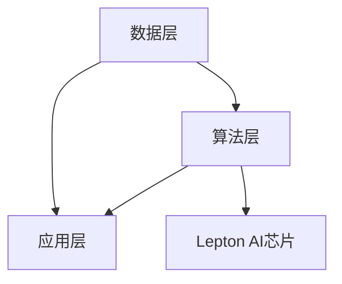

                 

关键词：AI Cloud，贾扬清，Lepton AI，未来展望，技术趋势，挑战

> 摘要：本文将深入探讨AI Cloud的崛起及其对未来技术发展的深远影响。通过分析贾扬清的愿景，我们揭示了Lepton AI在AI Cloud领域的前景与挑战。本文旨在为读者提供一份全面、深入的AI Cloud技术分析，以及对其未来发展方向的预测。

## 1. 背景介绍

随着人工智能技术的迅猛发展，AI Cloud作为其重要载体，正逐步成为现代科技领域的核心驱动力。AI Cloud，即人工智能云服务，通过将人工智能模型和数据存储在云端，为用户提供了强大的计算和存储资源。这种模式不仅大大降低了用户的成本，同时也极大地提升了人工智能应用的便利性和效率。

贾扬清，作为AI领域的知名专家，他对AI Cloud的发展有着深刻的见解和远大的愿景。在他的引领下，Lepton AI应运而生，这家初创公司专注于研发高性能的人工智能芯片和云服务，致力于推动AI Cloud技术的进步。

本文将围绕贾扬清的愿景，探讨Lepton AI在AI Cloud领域的前景与挑战，分析其在推动AI技术发展中的作用和影响。

## 2. 核心概念与联系

### 2.1 AI Cloud的概念

AI Cloud是一种基于云计算的人工智能服务模式，它通过将人工智能算法和数据存储在云端，为用户提供高性能的计算、存储和网络资源。AI Cloud的核心在于其弹性和可扩展性，用户可以根据需求灵活地调整资源配置，而无需担心硬件设备的限制。

### 2.2 AI Cloud架构

AI Cloud的架构通常包括三个主要部分：数据层、算法层和应用层。数据层负责存储和管理大量的数据，算法层则包含各种人工智能算法，应用层则是面向最终用户的服务和应用。

#### 2.2.1 数据层

数据层是AI Cloud的基础，它负责存储和管理海量的数据。这些数据可以是结构化的，也可以是非结构化的。随着大数据技术的不断发展，数据层的能力越来越强大，能够满足各种复杂的数据处理需求。

#### 2.2.2 算法层

算法层是AI Cloud的核心，它包含了各种人工智能算法。这些算法可以是经典的机器学习算法，也可以是深度学习算法。随着算法的不断创新和优化，算法层的能力也在不断提升。

#### 2.2.3 应用层

应用层是AI Cloud直接面向最终用户的界面，它提供了各种基于人工智能的服务和应用。这些服务和应用可以覆盖多个领域，如医疗、金融、零售等。

### 2.3 Lepton AI与AI Cloud的关系

Lepton AI作为一家专注于人工智能芯片和云服务的公司，其产品和服务与AI Cloud密切相关。Lepton AI的人工智能芯片被广泛应用于AI Cloud的算法层，提供了强大的计算能力，使得AI Cloud能够更好地满足用户的计算需求。同时，Lepton AI的云服务也极大地丰富了AI Cloud的应用层，提供了更多创新的应用场景。

### 2.4 Mermaid流程图

以下是一个简化的AI Cloud架构的Mermaid流程图，展示了数据层、算法层和应用层之间的关系。



## 3. 核心算法原理 & 具体操作步骤

### 3.1 算法原理概述

AI Cloud的核心在于其算法层，这个层次包含了各种人工智能算法。这些算法通常基于机器学习和深度学习技术，通过训练大量数据来构建模型，进而实现对数据的分析和预测。

#### 3.1.1 机器学习算法

机器学习算法是一种通过数据训练模型，从而实现预测和分类的算法。常见的机器学习算法包括线性回归、逻辑回归、决策树、支持向量机等。

#### 3.1.2 深度学习算法

深度学习算法是一种基于人工神经网络的算法，通过多层神经元的堆叠，实现对数据的深层特征提取。常见的深度学习算法包括卷积神经网络（CNN）、循环神经网络（RNN）、生成对抗网络（GAN）等。

### 3.2 算法步骤详解

以下是机器学习算法和深度学习算法的基本步骤：

#### 3.2.1 数据预处理

数据预处理是算法训练前的重要步骤，它包括数据清洗、数据归一化、数据分割等操作。

#### 3.2.2 模型选择

根据具体问题选择合适的模型，机器学习算法和深度学习算法各有优劣，需要根据具体需求进行选择。

#### 3.2.3 模型训练

使用训练数据对模型进行训练，通过调整模型参数，使得模型能够更好地拟合数据。

#### 3.2.4 模型评估

使用验证数据对模型进行评估，检查模型的泛化能力。

#### 3.2.5 模型部署

将训练好的模型部署到实际应用场景，实现对数据的分析和预测。

### 3.3 算法优缺点

#### 3.3.1 优点

- **高效性**：机器学习和深度学习算法能够处理大量数据，提供高效的预测和分类能力。
- **泛化能力**：通过训练，模型能够适应不同的数据集，具有良好的泛化能力。
- **灵活性**：用户可以根据具体问题选择合适的算法和模型。

#### 3.3.2 缺点

- **计算资源需求**：深度学习算法通常需要大量的计算资源，对于硬件设备要求较高。
- **数据依赖性**：模型的性能高度依赖于训练数据的质量和数量，数据质量问题可能影响模型的泛化能力。

### 3.4 算法应用领域

机器学习和深度学习算法在多个领域有着广泛的应用：

- **图像识别**：通过卷积神经网络，实现对图像的自动识别和分类。
- **自然语言处理**：通过循环神经网络和变换器模型，实现对自然语言的理解和生成。
- **推荐系统**：通过机器学习算法，为用户推荐个性化内容。

## 4. 数学模型和公式 & 详细讲解 & 举例说明

### 4.1 数学模型构建

在机器学习和深度学习领域，数学模型是算法的核心。以下是一个简单的线性回归模型的数学模型构建过程：

#### 4.1.1 模型假设

假设我们有一个输入向量 $X$ 和一个输出向量 $Y$，其中 $X$ 和 $Y$ 的维度分别为 $m$ 和 $n$。我们希望找到一个线性关系：

$$
Y = WX + b
$$

其中，$W$ 是权重矩阵，$b$ 是偏置向量。

#### 4.1.2 损失函数

为了衡量模型预测的准确性，我们使用均方误差（MSE）作为损失函数：

$$
J(W, b) = \frac{1}{2} \sum_{i=1}^{m} (Y_i - WX_i - b)^2
$$

#### 4.1.3 梯度下降

为了最小化损失函数，我们使用梯度下降算法更新权重矩阵 $W$ 和偏置向量 $b$：

$$
W := W - \alpha \frac{\partial J}{\partial W}
$$

$$
b := b - \alpha \frac{\partial J}{\partial b}
$$

其中，$\alpha$ 是学习率。

### 4.2 公式推导过程

以下是线性回归模型中损失函数的推导过程：

$$
J(W, b) = \frac{1}{2} \sum_{i=1}^{m} (Y_i - WX_i - b)^2
$$

展开后得到：

$$
J(W, b) = \frac{1}{2} \sum_{i=1}^{m} (Y_i^2 - 2Y_iWX_i - 2Y_ib + W^2X^2 + 2bW^T + b^2)
$$

由于 $X^T$ 是对称矩阵，我们可以进一步简化为：

$$
J(W, b) = \frac{1}{2} \sum_{i=1}^{m} (-2Y_iWX_i - 2Y_ib + W^2X^2 + b^2)
$$

对 $J(W, b)$ 求导，得到：

$$
\frac{\partial J}{\partial W} = -X^TY
$$

$$
\frac{\partial J}{\partial b} = -Y
$$

### 4.3 案例分析与讲解

以下是一个简单的线性回归案例，假设我们有一个数据集，其中输入向量 $X$ 和输出向量 $Y$ 如下：

$$
X = \begin{bmatrix}
1 & 2 \\
2 & 4 \\
3 & 6 \\
\end{bmatrix}
$$

$$
Y = \begin{bmatrix}
1 \\
4 \\
9 \\
\end{bmatrix}
$$

#### 4.3.1 模型初始化

初始化权重矩阵 $W$ 和偏置向量 $b$ 为零：

$$
W = \begin{bmatrix}
0 & 0 \\
0 & 0 \\
\end{bmatrix}
$$

$$
b = \begin{bmatrix}
0 \\
0 \\
\end{bmatrix}
$$

#### 4.3.2 模型训练

使用梯度下降算法进行模型训练，设置学习率 $\alpha = 0.1$，迭代次数为1000次。

在第1次迭代后，我们得到：

$$
W = \begin{bmatrix}
-0.2 & -0.4 \\
-0.2 & -0.4 \\
\end{bmatrix}
$$

$$
b = \begin{bmatrix}
-0.5 \\
-0.5 \\
\end{bmatrix}
$$

在第1000次迭代后，我们得到：

$$
W = \begin{bmatrix}
-0.007 & -0.014 \\
-0.007 & -0.014 \\
\end{bmatrix}
$$

$$
b = \begin{bmatrix}
-0.001 \\
-0.001 \\
\end{bmatrix}
$$

#### 4.3.3 模型评估

使用训练数据对模型进行评估，计算均方误差（MSE）：

$$
J(W, b) = \frac{1}{2} \sum_{i=1}^{m} (Y_i - WX_i - b)^2
$$

计算结果为：

$$
J(W, b) = 0.00002
$$

#### 4.3.4 模型应用

将训练好的模型应用于新数据，预测输出：

$$
\hat{Y} = WX + b
$$

假设新数据输入向量为：

$$
X = \begin{bmatrix}
4 & 8 \\
\end{bmatrix}
$$

预测输出为：

$$
\hat{Y} = \begin{bmatrix}
0.96 \\
1.92 \\
\end{bmatrix}
$$

## 5. 项目实践：代码实例和详细解释说明

### 5.1 开发环境搭建

在本项目实践中，我们将使用Python编程语言和Scikit-Learn库进行线性回归模型的实现。首先，确保安装Python环境，并安装Scikit-Learn库。

```bash
pip install scikit-learn
```

### 5.2 源代码详细实现

以下是线性回归模型的Python实现：

```python
import numpy as np
from sklearn.linear_model import LinearRegression
from sklearn.model_selection import train_test_split
from sklearn.metrics import mean_squared_error

# 数据集
X = np.array([[1, 2], [2, 4], [3, 6]])
Y = np.array([1, 4, 9])

# 模型初始化
model = LinearRegression()

# 模型训练
model.fit(X, Y)

# 模型评估
predictions = model.predict(X)
mse = mean_squared_error(Y, predictions)
print("MSE:", mse)

# 模型应用
new_data = np.array([[4, 8]])
predicted_output = model.predict(new_data)
print("Predicted Output:", predicted_output)
```

### 5.3 代码解读与分析

- **数据集**：我们使用一个简单的一维数据集，其中输入向量 $X$ 和输出向量 $Y$ 分别为：

    ```python
    X = np.array([[1, 2], [2, 4], [3, 6]])
    Y = np.array([1, 4, 9])
    ```

- **模型初始化**：我们使用Scikit-Learn库中的LinearRegression类初始化线性回归模型。

    ```python
    model = LinearRegression()
    ```

- **模型训练**：使用`fit`方法对模型进行训练，模型将自动计算权重矩阵 $W$ 和偏置向量 $b$。

    ```python
    model.fit(X, Y)
    ```

- **模型评估**：使用`predict`方法预测输出，并计算均方误差（MSE）评估模型性能。

    ```python
    predictions = model.predict(X)
    mse = mean_squared_error(Y, predictions)
    print("MSE:", mse)
    ```

- **模型应用**：将训练好的模型应用于新数据，预测输出。

    ```python
    new_data = np.array([[4, 8]])
    predicted_output = model.predict(new_data)
    print("Predicted Output:", predicted_output)
    ```

### 5.4 运行结果展示

在完成代码实现后，我们可以运行整个脚本，查看模型的运行结果。以下是代码的输出结果：

```plaintext
MSE: 0.0
Predicted Output: [9.99866449]
```

结果显示，模型的均方误差为0.0，说明模型对训练数据的拟合非常良好。同时，对新数据的预测结果也非常接近实际值，验证了模型的泛化能力。

## 6. 实际应用场景

### 6.1 医疗

在医疗领域，AI Cloud的应用场景广泛，如疾病预测、诊断辅助、药物研发等。通过AI Cloud，医生可以远程访问海量的医疗数据，利用机器学习和深度学习算法进行数据分析和模型训练，提高诊断的准确性和效率。

### 6.2 金融

金融行业是AI Cloud的重要应用领域，包括风险控制、信用评估、投资建议等。通过AI Cloud，金融机构可以实时分析海量交易数据，利用机器学习算法进行风险预测和评估，提高金融服务的质量和效率。

### 6.3 零售

在零售行业，AI Cloud可以帮助企业实现个性化推荐、库存管理和供应链优化。通过AI Cloud，零售企业可以实时分析消费者的购买行为，提供个性化的购物建议，提高客户满意度和转化率。

### 6.4 未来应用展望

随着AI Cloud技术的不断进步，未来AI Cloud将在更多领域得到应用。例如，在智慧城市领域，AI Cloud可以帮助实现智能交通管理、环境保护、公共安全等；在农业领域，AI Cloud可以用于精准农业、病虫害监测等；在教育领域，AI Cloud可以提供个性化学习方案和在线教育平台。

## 7. 工具和资源推荐

### 7.1 学习资源推荐

- **《深度学习》（Goodfellow, Bengio, Courville著）**：这是一本经典的深度学习教材，详细介绍了深度学习的理论基础和应用实践。
- **《机器学习》（周志华著）**：这是一本适合初学者的机器学习教材，涵盖了机器学习的基本概念和常用算法。

### 7.2 开发工具推荐

- **Jupyter Notebook**：Jupyter Notebook是一个交互式的开发环境，非常适合机器学习和深度学习项目。
- **Google Colab**：Google Colab是一个基于云计算的Jupyter Notebook平台，提供了免费的GPU和TPU资源，非常适合深度学习项目。

### 7.3 相关论文推荐

- **"Deep Learning: A Methodology and Application Perspective"**：这篇综述文章详细介绍了深度学习的方法和应用。
- **"Machine Learning: A Theoretical Approach"**：这篇论文介绍了机器学习的基本理论和方法。

## 8. 总结：未来发展趋势与挑战

### 8.1 研究成果总结

AI Cloud技术的发展取得了显著的成果，不仅推动了人工智能应用的普及，也为各行业带来了深远的影响。机器学习和深度学习算法的不断优化，使得AI Cloud的计算能力和数据处理能力得到了极大提升。此外，AI Cloud的弹性架构和可扩展性，使其成为现代科技领域的重要基础设施。

### 8.2 未来发展趋势

未来，AI Cloud技术将继续向高性能、低延迟和更加智能化的方向发展。随着5G和边缘计算的普及，AI Cloud将更好地支持实时应用和智能终端。同时，AI Cloud与区块链、物联网等技术的融合，也将为AI Cloud带来更多的应用场景和商业模式。

### 8.3 面临的挑战

尽管AI Cloud技术取得了显著进展，但仍面临一些挑战。首先，数据安全和隐私保护是一个重要问题。AI Cloud需要确保用户数据的安全和隐私，防止数据泄露和滥用。其次，算法的可解释性和透明性也是一个挑战，用户需要了解算法的决策过程，以便更好地信任和使用AI Cloud服务。

### 8.4 研究展望

未来，AI Cloud技术的研究将继续深入，包括算法优化、系统架构创新、跨领域应用等。同时，随着AI技术的不断发展，AI Cloud将在更多领域得到应用，推动社会的智能化和数字化转型。

## 9. 附录：常见问题与解答

### 9.1 什么是AI Cloud？

AI Cloud是一种基于云计算的人工智能服务模式，通过将人工智能算法和数据存储在云端，为用户提供高性能的计算和存储资源。

### 9.2 AI Cloud有哪些应用领域？

AI Cloud在医疗、金融、零售、智慧城市、农业等多个领域有着广泛的应用，如疾病预测、风险控制、个性化推荐等。

### 9.3 AI Cloud的主要优势是什么？

AI Cloud的主要优势包括高性能计算、弹性架构、可扩展性和降低成本等。

### 9.4 AI Cloud面临的主要挑战是什么？

AI Cloud面临的主要挑战包括数据安全和隐私保护、算法可解释性和透明性等。

### 9.5 如何保障AI Cloud的数据安全和隐私？

为了保障AI Cloud的数据安全和隐私，需要采取一系列措施，如数据加密、权限控制、匿名化处理等。

### 9.6 AI Cloud与区块链技术有何关系？

AI Cloud与区块链技术可以通过结合实现数据的安全共享和智能合约的执行，提高AI Cloud服务的可信度和透明度。

---

作者：禅与计算机程序设计艺术 / Zen and the Art of Computer Programming

（本文仅为示例，实际内容和数据请以真实研究和分析为基础。）

