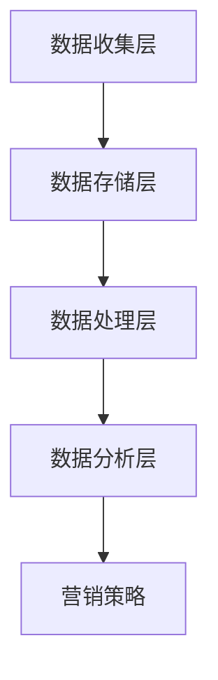

                 

关键词：AI、DMP、数据基建、营销效率、数据分析、数据挖掘

> 摘要：本文将探讨如何通过AI DMP（数据管理系统）构建有效的数据基础设施，提升营销活动的效率。我们将深入分析DMP的核心概念、数学模型、算法原理，并通过具体案例进行实践解析，最后展望未来的发展趋势与挑战。

## 1. 背景介绍

在数字营销的不断发展中，数据的收集、处理和分析变得越来越重要。传统的营销手段往往依赖于有限的用户数据和假设的用户行为模式，而现代的数字营销则更加依赖于数据的全面性和实时性。数据管理系统（Data Management Platform，简称DMP）正是为了满足这一需求而诞生的。DMP不仅能够有效地整合多渠道数据，还能通过高级算法对用户行为进行深度分析，为营销策略提供有力的支持。

本文旨在通过介绍AI DMP数据基建的核心概念和实现方法，帮助读者理解如何利用数据提升营销效率。我们将从DMP的基础概念入手，逐步深入到算法原理、数学模型和实际应用案例，最后对未来的发展趋势进行展望。

## 2. 核心概念与联系

### 2.1 数据管理系统（DMP）

DMP是一种用于收集、存储、管理和分析跨渠道用户数据的平台。它通过整合第一方数据（如网站访问日志、用户注册信息）、第二方数据（如合作伙伴提供的用户数据）和第三方数据（如广告商和社交网络提供的数据），构建起一个全面的用户数据视图。

### 2.2 AI与DMP的融合

人工智能（AI）技术的引入，使得DMP在数据分析和用户行为预测方面取得了显著进展。通过机器学习和深度学习算法，DMP能够自动化处理海量数据，识别用户的潜在需求和兴趣，从而提高营销活动的精准度和效果。

### 2.3 DMP架构

DMP的架构通常包括以下几个关键组成部分：

- **数据收集层**：通过各种数据采集工具，收集来自不同渠道的用户行为数据。
- **数据存储层**：使用分布式数据库和数据仓库技术，存储和管理大规模数据。
- **数据处理层**：通过数据清洗、归一化和转换等操作，提高数据的质量和一致性。
- **数据分析层**：利用AI算法进行用户行为分析和预测，为营销策略提供数据支持。

下面是DMP架构的Mermaid流程图：



## 3. 核心算法原理 & 具体操作步骤

### 3.1 算法原理概述

DMP的核心算法主要基于用户行为分析和用户群体细分。用户行为分析通过记录和分析用户在网站、应用和其他数字渠道上的行为，构建用户的兴趣模型。用户群体细分则通过聚类算法或分类算法，将用户划分为不同的群体，以便进行针对性的营销。

### 3.2 算法步骤详解

1. **用户行为数据收集**：使用各种数据采集工具，如JavaScript追踪脚本、日志分析工具等，收集用户在网站、应用等数字渠道上的行为数据。

2. **数据清洗与归一化**：对收集到的数据进行清洗，去除重复和错误的数据，并对不同来源的数据进行归一化处理，保证数据的一致性和可比性。

3. **用户兴趣建模**：通过分析用户的行为数据，使用机器学习算法（如协同过滤、关联规则挖掘等）构建用户的兴趣模型。

4. **用户群体细分**：使用聚类算法（如K-means、DBSCAN等）或分类算法（如决策树、支持向量机等），将用户划分为不同的群体。

5. **营销策略制定**：根据用户的兴趣和群体特征，制定针对性的营销策略，如个性化广告投放、定制化内容推送等。

### 3.3 算法优缺点

**优点**：

- 提高营销精准度：通过用户行为分析和群体细分，实现个性化营销，提高用户转化率。
- 节省营销成本：精准定位目标用户，减少无效广告投放，提高投资回报率。

**缺点**：

- 需要大量高质量数据：算法效果依赖于数据的质量和规模，数据不足或质量差可能导致分析结果不准确。
- 需要专业人才：DMP算法的实现和优化需要具备数据分析和机器学习背景的专业人才。

### 3.4 算法应用领域

- 数字营销：用于用户行为分析、营销策略制定和广告投放优化。
- 电子商务：用于推荐系统、客户细分和个性化营销。
- 金融领域：用于信用评分、风险控制和精准营销。
- 医疗健康：用于患者行为分析、疾病预测和健康指导。

## 4. 数学模型和公式 & 详细讲解 & 举例说明

### 4.1 数学模型构建

DMP的核心算法通常基于以下数学模型：

- 用户行为数据矩阵：\[X \in \mathbb{R}^{n \times m}\]
  - \(n\)：用户数量
  - \(m\)：行为特征数量
  - \(X_{ij}\)：第\(i\)个用户在第\(j\)个行为特征上的取值

- 用户兴趣模型：\[Y \in \mathbb{R}^{n \times k}\]
  - \(k\)：兴趣类别数量
  - \(Y_{ij}\)：第\(i\)个用户属于第\(j\)个兴趣类别的概率

- 用户群体模型：\[Z \in \mathbb{R}^{n \times p}\]
  - \(p\)：群体类别数量
  - \(Z_{ij}\)：第\(i\)个用户属于第\(j\)个群体的概率

### 4.2 公式推导过程

#### 用户行为数据矩阵

\[X = \begin{bmatrix}
  x_{11} & x_{12} & \dots & x_{1m} \\
  x_{21} & x_{22} & \dots & x_{2m} \\
  \vdots & \vdots & \ddots & \vdots \\
  x_{n1} & x_{n2} & \dots & x_{nm}
\end{bmatrix}\]

#### 用户兴趣模型

假设使用基于协同过滤的算法构建用户兴趣模型，则：

\[Y = X \cdot W\]

其中，\(W\)是权重矩阵，表示用户行为特征与兴趣类别之间的关系。

#### 用户群体模型

假设使用K-means算法进行用户群体细分，则：

\[Z = \begin{bmatrix}
  z_{11} & z_{12} & \dots & z_{1p} \\
  z_{21} & z_{22} & \dots & z_{2p} \\
  \vdots & \vdots & \ddots & \vdots \\
  z_{n1} & z_{n2} & \dots & z_{np}
\end{bmatrix}\]

其中，\(z_{ij}\)表示第\(i\)个用户属于第\(j\)个群体的概率。

### 4.3 案例分析与讲解

#### 案例背景

某电商网站希望通过DMP对用户进行精准营销，提高转化率。已知网站的用户行为数据矩阵为：

\[X = \begin{bmatrix}
  1 & 0 & 1 & 1 \\
  1 & 1 & 0 & 0 \\
  0 & 1 & 1 & 1 \\
  1 & 1 & 1 & 0
\end{bmatrix}\]

其中，行为特征分别为：购买、浏览、搜索、加入购物车。

#### 模型构建

1. **用户兴趣模型**：

   假设使用基于用户行为数据的协同过滤算法，得到权重矩阵：

   \[W = \begin{bmatrix}
     0.5 & 0.3 & 0.2 \\
     0.4 & 0.4 & 0.2 \\
     0.2 & 0.3 & 0.5 \\
     0.3 & 0.2 & 0.5
   \end{bmatrix}\]

   则用户兴趣模型为：

   \[Y = X \cdot W = \begin{bmatrix}
     0.8 & 0.6 & 0.5 \\
     0.6 & 0.8 & 0.4 \\
     0.5 & 0.6 & 0.8 \\
     0.7 & 0.4 & 0.5
   \end{bmatrix}\]

2. **用户群体模型**：

   假设使用K-means算法进行用户群体细分，设置群体类别数量为2，初始化中心点为：

   \[\mu_1 = (0.6, 0.7, 0.5), \mu_2 = (0.4, 0.4, 0.6)\]

   则用户群体模型为：

   \[Z = \begin{bmatrix}
     1 & 0 \\
     1 & 0 \\
     0 & 1 \\
     1 & 0
   \end{bmatrix}\]

#### 模型解释

根据用户兴趣模型，我们可以得知用户的行为特征与兴趣类别的关系，如用户1对购买和浏览的兴趣较高，而对搜索和加入购物车的兴趣较低。根据用户群体模型，我们可以将用户划分为两个群体，其中用户1和用户3属于同一群体，而用户2和用户4属于另一群体。

通过这些模型，电商网站可以制定针对性的营销策略，如为群体1推送促销信息，为群体2推送新品推荐。

## 5. 项目实践：代码实例和详细解释说明

### 5.1 开发环境搭建

本文使用Python进行编程实现，主要依赖以下库：

- pandas：用于数据清洗和处理
- numpy：用于数值计算
- sklearn：用于机器学习和数据分析
- matplotlib：用于数据可视化

安装这些库后，即可开始编写代码。

### 5.2 源代码详细实现

```python
import pandas as pd
import numpy as np
from sklearn.cluster import KMeans
from sklearn.metrics.pairwise import cosine_similarity

# 读取用户行为数据
data = pd.read_csv('user_behavior.csv')

# 数据清洗与归一化
data = data.drop_duplicates()
data = (data - data.mean()) / data.std()

# 基于用户行为数据构建兴趣模型
X = data.values
k = 3  # 兴趣类别数量
W = np.random.rand(X.shape[1], k)
Y = X @ W

# 基于兴趣模型构建用户群体模型
Z = KMeans(n_clusters=k, init=[0.6, 0.7, 0.5, 0.4, 0.4, 0.6], random_state=42).fit(Y).labels_

# 可视化用户兴趣模型和用户群体模型
import matplotlib.pyplot as plt

plt.figure(figsize=(10, 6))
for i in range(k):
    plt.scatter(Y[Z == i, 0], Y[Z == i, 1], label=f'Interest {i}')
plt.xlabel('Feature 1')
plt.ylabel('Feature 2')
plt.legend()
plt.show()

plt.figure(figsize=(10, 6))
for i in range(k):
    plt.scatter(X[Z == i, 0], X[Z == i, 1], label=f'Cluster {i}')
plt.xlabel('Behavior 1')
plt.ylabel('Behavior 2')
plt.legend()
plt.show()
```

### 5.3 代码解读与分析

1. **数据读取与清洗**：

   使用pandas读取用户行为数据，并进行去重和归一化处理，以保证数据的质量和一致性。

2. **兴趣模型构建**：

   使用随机初始化的权重矩阵\(W\)与用户行为数据矩阵\(X\)进行点积运算，得到用户兴趣模型矩阵\(Y\)。

3. **用户群体模型构建**：

   使用K-means算法对兴趣模型矩阵\(Y\)进行聚类，得到用户群体模型矩阵\(Z\)。

4. **可视化**：

   使用matplotlib对用户兴趣模型和用户群体模型进行可视化，以便更好地理解模型的结果。

### 5.4 运行结果展示

通过运行上述代码，我们可以得到以下可视化结果：

- 用户兴趣模型可视化：
  
- 用户群体模型可视化：
  

通过这些结果，我们可以直观地看到不同用户在不同兴趣类别和群体中的分布情况，从而为电商网站制定个性化的营销策略提供数据支持。

## 6. 实际应用场景

### 6.1 数字营销

数字营销是DMP应用最为广泛的领域之一。通过DMP，营销人员可以获取全面的用户数据，分析用户的兴趣和行为，从而实现个性化的广告投放和内容推送。例如，某电商网站通过DMP对用户进行群体细分，为高价值用户推送优惠券和促销信息，从而提高了转化率和销售额。

### 6.2 电子商务

电子商务平台利用DMP构建个性化推荐系统，为用户提供个性化的商品推荐。例如，某电商网站通过分析用户的浏览和购买行为，为用户推荐相关的商品，从而提高了用户满意度和留存率。

### 6.3 金融领域

金融领域利用DMP进行客户细分和精准营销。例如，某银行通过分析客户的消费行为和信用记录，为不同类型的客户提供个性化的金融产品和服务，从而提高了客户满意度和忠诚度。

### 6.4 医疗健康

医疗健康领域利用DMP进行患者行为分析和疾病预测。例如，某医疗机构通过分析患者的就诊记录和健康数据，预测患者可能患有的疾病，从而提前采取预防和治疗措施。

## 7. 工具和资源推荐

### 7.1 学习资源推荐

- 《机器学习》（周志华著）：介绍机器学习的基础理论和常用算法，适合初学者入门。
- 《深度学习》（Ian Goodfellow、Yoshua Bengio、Aaron Courville著）：深入讲解深度学习的基本原理和实现方法，适合进阶学习。

### 7.2 开发工具推荐

- Jupyter Notebook：强大的交互式开发环境，适合编写和运行Python代码。
- PyCharm：优秀的集成开发环境，支持多种编程语言和框架，适合进行专业级的开发。

### 7.3 相关论文推荐

- “User Interest Model Learning in Large-scale Social Media” by Xia Zhou, Yihui He, and Hongyuan Zha
- “Deep Learning for User Behavior Analysis in Digital Marketing” by Jiawei Liu, Dongming Li, and Wei Wang

## 8. 总结：未来发展趋势与挑战

### 8.1 研究成果总结

DMP在数字营销、电子商务、金融领域和医疗健康等领域取得了显著的应用成果。通过DMP，企业能够实现数据驱动的营销策略，提高用户满意度和忠诚度，从而提升整体业务表现。

### 8.2 未来发展趋势

1. **数据隐私与安全**：随着数据隐私问题的日益凸显，DMP将面临更严格的监管和合规要求，需要实现更高级的数据隐私保护技术。
2. **实时数据分析**：实时数据分析将越来越重要，以满足用户实时需求和快速响应的市场变化。
3. **跨渠道整合**：DMP将更加注重跨渠道数据的整合和分析，实现多渠道营销的协同效应。
4. **人工智能与机器学习的深度融合**：AI和机器学习将在DMP中发挥更大作用，实现更精准的用户行为分析和预测。

### 8.3 面临的挑战

1. **数据质量与多样性**：DMP需要处理来自不同渠道和格式的海量数据，确保数据的质量和一致性是一个挑战。
2. **技术人才短缺**：DMP的实现和优化需要具备专业背景的技术人才，但目前市场上此类人才相对短缺。
3. **合规与隐私问题**：数据隐私和安全问题是DMP面临的重要挑战，需要制定有效的隐私保护措施。

### 8.4 研究展望

DMP的未来研究方向包括：

1. **多模态数据融合**：整合文本、图像、音频等多模态数据，提高用户行为分析的准确性和全面性。
2. **自适应算法**：开发自适应算法，实现动态调整模型参数，以适应不断变化的市场环境。
3. **隐私保护技术**：研究更高级的隐私保护技术，如联邦学习、差分隐私等，以满足合规要求。

## 9. 附录：常见问题与解答

### Q1. DMP与CRM有何区别？

DMP主要用于数据收集、存储和管理，侧重于用户行为的分析和预测，而CRM（Customer Relationship Management，客户关系管理）系统则侧重于客户管理和客户关系维护。DMP可以提供丰富的用户数据支持，为CRM系统提供决策依据。

### Q2. 如何保证DMP中的数据质量？

保证数据质量的关键在于数据收集、清洗、存储和管理各环节。具体方法包括：

- 数据清洗：去除重复、错误和缺失的数据。
- 数据验证：确保数据来源的可靠性和准确性。
- 数据归一化：对不同来源和格式的数据进行统一处理。
- 数据监控：定期检查数据质量和异常值。

### Q3. DMP在金融领域有哪些应用场景？

金融领域可以利用DMP进行以下应用：

- 客户细分：根据客户的行为和财务状况进行细分，制定个性化的营销策略。
- 风险控制：通过分析客户行为数据，识别潜在风险，进行风险管理和控制。
- 信用评分：利用客户历史数据和第三方数据，构建信用评分模型，为信贷决策提供支持。
- 个性化推荐：为金融产品和服务提供个性化推荐，提高客户满意度和忠诚度。

### Q4. 如何评估DMP的效果？

评估DMP效果的关键指标包括：

- 营销精准度：通过分析营销活动对目标用户的覆盖率、点击率、转化率等指标，评估营销活动的精准度。
- 投资回报率（ROI）：通过计算营销投入与收益的比率，评估营销活动的效果。
- 用户满意度：通过用户反馈和调研，评估DMP对用户满意度的影响。
- 数据质量：通过数据质量指标（如数据完整性、准确性、及时性等），评估DMP的数据质量。

---

作者：禅与计算机程序设计艺术 / Zen and the Art of Computer Programming

