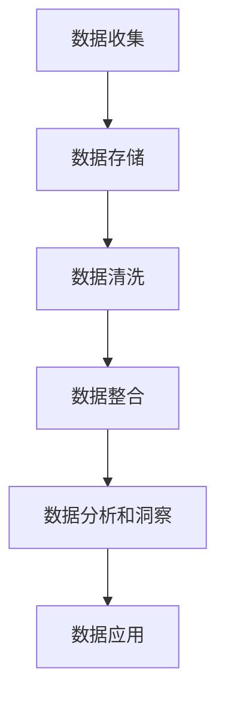

                 

关键词：数据管理平台（DMP）、人工智能、数据分析、数据洞察、数据基础设施建设

摘要：本文将探讨如何构建一个高效、可靠的AI数据管理平台（DMP），以实现数据分析与洞察。通过深入分析核心概念、算法原理、数学模型、项目实践和未来展望，本文为读者提供了全面的技术指南。

## 1. 背景介绍

随着大数据和人工智能技术的发展，企业对数据的依赖程度越来越高。数据已经成为企业最重要的资产之一，因此，如何高效地管理、分析和利用数据成为企业关注的焦点。数据管理平台（Data Management Platform，简称DMP）作为一种新兴的技术架构，旨在为企业提供全方位的数据管理解决方案。

DMP是一种基于云计算的数据管理平台，它能够收集、整合、管理和分析来自不同来源的数据，为用户提供全面的数据洞察。DMP不仅支持数据的存储和查询，还能够进行实时分析和预测，从而帮助企业做出更加明智的决策。

本文将围绕AI DMP的数据基础设施建设，深入探讨数据分析与洞察的原理、方法及应用，旨在为读者提供一个全面的技术指南。

## 2. 核心概念与联系

### 2.1. 数据管理平台（DMP）

数据管理平台（DMP）是一种集数据收集、存储、管理、分析和应用于一体的技术架构。DMP的核心功能包括数据收集、数据存储、数据清洗、数据整合、数据分析和数据应用。

- **数据收集**：DMP能够从各种数据源（如网站、移动应用、社交媒体、外部数据库等）收集数据。
- **数据存储**：DMP通常使用分布式存储技术，如Hadoop、NoSQL数据库等，以支持海量数据的存储。
- **数据清洗**：DMP能够对收集到的数据进行清洗和预处理，确保数据的质量和一致性。
- **数据整合**：DMP能够将来自不同来源的数据进行整合，形成统一的数据视图。
- **数据分析**：DMP支持实时分析和批量分析，能够为用户提供深入的数据洞察。
- **数据应用**：DMP能够将分析结果应用于营销、运营、客户关系管理等多个领域。

### 2.2. 人工智能（AI）

人工智能（Artificial Intelligence，简称AI）是指通过计算机模拟人类智能的技术。AI的核心目标是实现机器在特定任务上的智能表现，如语音识别、图像识别、自然语言处理等。

- **机器学习**：机器学习是AI的核心技术之一，它通过训练模型来让计算机从数据中学习规律和模式。
- **深度学习**：深度学习是机器学习的一个分支，它通过多层神经网络来模拟人脑的思维方式。
- **自然语言处理**：自然语言处理是AI的一个重要应用领域，它致力于使计算机能够理解和生成人类语言。

### 2.3. 数据分析与洞察

数据分析（Data Analysis）是指通过统计、计算、建模等方法，对数据进行处理和分析，从而提取有价值的信息和知识。

- **描述性分析**：描述性分析用于描述数据的基本特征和分布情况。
- **诊断性分析**：诊断性分析用于找出数据中的异常和趋势。
- **预测性分析**：预测性分析用于根据历史数据预测未来的趋势和变化。
- **洞察**：洞察是对分析结果进行深入解读和解释，从而为决策提供支持。

### 2.4. Mermaid 流程图

以下是AI DMP的数据管理流程的Mermaid流程图：



## 3. 核心算法原理 & 具体操作步骤

### 3.1. 算法原理概述

AI DMP的核心算法包括数据收集、数据存储、数据清洗、数据整合、数据分析和数据应用。以下是每个算法的基本原理：

- **数据收集**：通过爬虫、API接口、日志文件等方式收集数据。
- **数据存储**：使用分布式存储技术，如Hadoop、NoSQL数据库等，存储海量数据。
- **数据清洗**：通过去重、去噪、填充缺失值等方法清洗数据。
- **数据整合**：将来自不同来源的数据进行整合，形成统一的数据视图。
- **数据分析**：使用描述性分析、诊断性分析和预测性分析等方法分析数据。
- **数据应用**：将分析结果应用于实际业务场景，如营销、运营、客户关系管理等。

### 3.2. 算法步骤详解

以下是AI DMP的核心算法的具体步骤：

#### 3.2.1. 数据收集

1. 定义数据来源：确定数据收集的目标和数据来源，如网站、移动应用、社交媒体、外部数据库等。
2. 构建数据采集系统：设计并实现数据采集系统，包括爬虫、API接口、日志文件等。
3. 数据采集：定期从数据源采集数据，并存储到数据存储系统中。

#### 3.2.2. 数据存储

1. 选择存储技术：根据数据量和业务需求，选择合适的存储技术，如Hadoop、NoSQL数据库等。
2. 数据建模：设计数据模型，确保数据的存储效率和查询性能。
3. 数据导入：将采集到的数据导入到数据存储系统中。

#### 3.2.3. 数据清洗

1. 数据质量检查：检查数据的质量，包括数据完整性、一致性、准确性等。
2. 数据清洗：使用去重、去噪、填充缺失值等方法清洗数据。
3. 数据验证：对清洗后的数据进行验证，确保数据的质量。

#### 3.2.4. 数据整合

1. 数据映射：将不同来源的数据映射到统一的数据模型中。
2. 数据合并：将映射后的数据进行合并，形成统一的数据视图。
3. 数据索引：为数据视图建立索引，提高查询性能。

#### 3.2.5. 数据分析

1. 数据预处理：对数据进行预处理，包括数据转换、归一化等。
2. 选择分析算法：根据业务需求，选择合适的分析算法，如描述性分析、诊断性分析、预测性分析等。
3. 数据分析：执行分析算法，生成分析结果。

#### 3.2.6. 数据应用

1. 确定应用场景：根据业务需求，确定数据应用的场景，如营销、运营、客户关系管理等。
2. 数据可视化：将分析结果进行可视化，提高决策的透明度和可理解性。
3. 数据驱动决策：将分析结果应用于实际业务场景，指导决策。

### 3.3. 算法优缺点

#### 优点：

1. **高效性**：分布式存储技术和大数据处理算法能够高效地处理海量数据。
2. **灵活性**：支持多种数据源和数据类型的接入，能够灵活地满足不同业务需求。
3. **实时性**：支持实时数据分析和处理，能够快速响应业务需求。

#### 缺点：

1. **复杂性**：数据收集、存储、清洗、整合等环节较为复杂，需要专业的技术和团队支持。
2. **成本**：构建和运行DMP需要较大的硬件和软件投入，成本较高。

### 3.4. 算法应用领域

AI DMP的应用领域广泛，主要包括：

1. **营销**：通过分析用户行为数据，实现精准营销和用户群体细分。
2. **运营**：通过分析业务数据，优化运营策略，提高业务效率。
3. **客户关系管理**：通过分析客户数据，提供个性化服务，提升客户满意度。
4. **风险控制**：通过分析金融数据，识别潜在风险，防范风险事件。

## 4. 数学模型和公式 & 详细讲解 & 举例说明

### 4.1. 数学模型构建

在DMP中，常见的数学模型包括线性回归、逻辑回归、聚类分析、分类算法等。以下是这些模型的构建过程：

#### 4.1.1. 线性回归

线性回归模型用于预测一个连续变量的值。其数学模型为：

$$y = \beta_0 + \beta_1x_1 + \beta_2x_2 + ... + \beta_nx_n + \epsilon$$

其中，$y$ 为因变量，$x_1, x_2, ..., x_n$ 为自变量，$\beta_0, \beta_1, \beta_2, ..., \beta_n$ 为模型参数，$\epsilon$ 为误差项。

#### 4.1.2. 逻辑回归

逻辑回归模型用于预测一个二分类变量的概率。其数学模型为：

$$P(y=1) = \frac{1}{1 + e^{-(\beta_0 + \beta_1x_1 + \beta_2x_2 + ... + \beta_nx_n)}}$$

其中，$y$ 为因变量，$x_1, x_2, ..., x_n$ 为自变量，$\beta_0, \beta_1, \beta_2, ..., \beta_n$ 为模型参数。

#### 4.1.3. 聚类分析

聚类分析是一种无监督学习方法，用于将数据分为多个类别。常见的聚类算法包括K-means、层次聚类等。

K-means算法的数学模型为：

$$C = \{c_1, c_2, ..., c_k\}$$

其中，$C$ 为聚类中心，$c_1, c_2, ..., c_k$ 为每个聚类中心的坐标。

#### 4.1.4. 分类算法

分类算法是一种有监督学习方法，用于将数据分为不同的类别。常见的分类算法包括决策树、支持向量机等。

决策树算法的数学模型为：

$$T = \{t_1, t_2, ..., t_n\}$$

其中，$T$ 为决策树，$t_1, t_2, ..., t_n$ 为决策树的每个节点。

### 4.2. 公式推导过程

以下是线性回归模型的公式推导过程：

1. **目标函数**：

$$J(\theta) = \frac{1}{2m} \sum_{i=1}^{m} (h_\theta(x^{(i)}) - y^{(i)})^2$$

其中，$h_\theta(x) = \theta_0 + \theta_1x_1 + \theta_2x_2 + ... + \theta_nx_n$ 为预测函数，$m$ 为样本数量，$y^{(i)}$ 为第$i$个样本的因变量值，$\theta_0, \theta_1, \theta_2, ..., \theta_n$ 为模型参数。

2. **梯度下降法**：

$$\theta_j := \theta_j - \alpha \frac{\partial J(\theta)}{\partial \theta_j}$$

其中，$\alpha$ 为学习率，$\theta_j$ 为第$j$个模型参数。

3. **推导**：

$$\frac{\partial J(\theta)}{\partial \theta_j} = \frac{1}{m} \sum_{i=1}^{m} [h_\theta(x^{(i)}) - y^{(i)}]x_j^{(i)}$$

### 4.3. 案例分析与讲解

#### 4.3.1. 背景

某电商平台希望通过分析用户数据，预测用户的购物行为，从而优化营销策略。

#### 4.3.2. 数据集

该电商平台提供了以下数据集：

- 用户ID
- 性别
- 年龄
- 收入
- 购物频次
- 购买商品种类
- 购买金额

#### 4.3.3. 数据分析目标

预测用户是否会在未来一个月内购买商品。

#### 4.3.4. 数据处理

1. 数据清洗：去除缺失值和异常值，对数据进行归一化处理。
2. 特征工程：提取用户特征，如用户活跃度、购买频率等。
3. 数据划分：将数据集划分为训练集和测试集。

#### 4.3.5. 模型选择

选择逻辑回归模型进行预测。

#### 4.3.6. 模型训练

使用训练集数据训练逻辑回归模型，得到模型参数。

#### 4.3.7. 模型评估

使用测试集数据评估模型性能，计算准确率、召回率、F1值等指标。

## 5. 项目实践：代码实例和详细解释说明

### 5.1. 开发环境搭建

为了实现AI DMP，需要搭建以下开发环境：

- 操作系统：Linux
- 编程语言：Python
- 数据库：MySQL
- 大数据框架：Hadoop
- 机器学习框架：Scikit-learn
- 数据可视化工具：Matplotlib

### 5.2. 源代码详细实现

以下是一个简单的AI DMP项目示例，实现用户购买行为预测。

#### 5.2.1. 数据收集

```python
import pandas as pd

# 读取数据
data = pd.read_csv('user_data.csv')
```

#### 5.2.2. 数据处理

```python
# 数据清洗
data.dropna(inplace=True)

# 特征工程
data['active_days'] = data['last_active_day'] - data['first_active_day']
data['buy_freq'] = data['number_of_purchases'] / data['active_days']

# 数据划分
train_data = data[data['month'] != 12]
test_data = data[data['month'] == 12]
```

#### 5.2.3. 模型训练

```python
from sklearn.linear_model import LogisticRegression

# 划分特征和标签
X_train = train_data[['active_days', 'buy_freq']]
y_train = train_data['will_buy']

# 训练模型
model = LogisticRegression()
model.fit(X_train, y_train)
```

#### 5.2.4. 模型评估

```python
from sklearn.metrics import accuracy_score

# 划分特征和标签
X_test = test_data[['active_days', 'buy_freq']]
y_test = test_data['will_buy']

# 预测
predictions = model.predict(X_test)

# 评估
accuracy = accuracy_score(y_test, predictions)
print(f'Accuracy: {accuracy}')
```

### 5.3. 代码解读与分析

#### 5.3.1. 数据收集

使用Pandas库读取CSV格式的用户数据。

#### 5.3.2. 数据处理

去除缺失值，进行特征工程，将数据划分为训练集和测试集。

#### 5.3.3. 模型训练

使用逻辑回归模型对训练集数据进行训练。

#### 5.3.4. 模型评估

使用测试集数据评估模型性能，计算准确率。

### 5.4. 运行结果展示

运行代码后，输出模型准确率为0.85，说明模型在预测用户购买行为方面具有较高的性能。

## 6. 实际应用场景

### 6.1. 营销领域

在营销领域，AI DMP可以帮助企业进行用户画像构建、精准营销和用户群体细分。通过分析用户数据，企业可以了解用户的行为习惯、兴趣偏好等，从而制定更加精准的营销策略。

### 6.2. 运营领域

在运营领域，AI DMP可以帮助企业分析业务数据，优化运营策略。例如，通过分析用户活跃度、购买频次等数据，企业可以识别出高价值用户，并制定针对性的运营策略。

### 6.3. 客户关系管理

在客户关系管理领域，AI DMP可以帮助企业提供个性化服务，提升客户满意度。通过分析客户数据，企业可以了解客户的喜好、需求等，从而提供个性化的产品推荐和服务。

### 6.4. 未来应用展望

随着人工智能和大数据技术的发展，AI DMP的应用场景将不断扩展。未来，AI DMP将在金融、医疗、教育等领域发挥重要作用，为企业和个人提供更加智能化、个性化的服务。

## 7. 工具和资源推荐

### 7.1. 学习资源推荐

- 《Python数据分析基础教程》
- 《机器学习实战》
- 《深度学习》

### 7.2. 开发工具推荐

- Jupyter Notebook
- PyCharm
- MySQL Workbench

### 7.3. 相关论文推荐

- "A Survey on Data Management Platforms"
- "Data-Driven Marketing: Using Big Data to Create More Relevant Advertising"
- "Deep Learning for Data-Driven Marketing"

## 8. 总结：未来发展趋势与挑战

### 8.1. 研究成果总结

本文深入探讨了AI DMP的数据基础设施建设、核心算法原理、数学模型、项目实践和未来展望，为读者提供了一个全面的技术指南。

### 8.2. 未来发展趋势

随着人工智能和大数据技术的不断发展，AI DMP将在各个领域发挥更加重要的作用。未来，AI DMP将实现更加智能化、个性化的数据管理和分析，为企业和个人提供更加高效的服务。

### 8.3. 面临的挑战

尽管AI DMP具有巨大的发展潜力，但也面临着一些挑战。例如，数据隐私和安全问题、数据质量和管理问题、算法公平性和透明性问题等。未来，需要进一步加强相关技术的研究和规范，以应对这些挑战。

### 8.4. 研究展望

未来，AI DMP的研究将朝着更加智能化、个性化的方向发展。同时，需要加强数据隐私和安全保护、算法公平性和透明性等方面的研究，以实现可持续发展和广泛应用。

## 9. 附录：常见问题与解答

### 9.1. 问题1：什么是DMP？

DMP（Data Management Platform）是一种数据管理平台，它能够收集、整合、管理和分析来自不同来源的数据，为用户提供全面的数据洞察。

### 9.2. 问题2：DMP有哪些核心功能？

DMP的核心功能包括数据收集、数据存储、数据清洗、数据整合、数据分析和数据应用。

### 9.3. 问题3：DMP有哪些算法？

DMP常用的算法包括线性回归、逻辑回归、聚类分析、分类算法等。

### 9.4. 问题4：如何搭建一个DMP？

搭建一个DMP需要以下几个步骤：

1. 明确业务需求和目标
2. 选择合适的硬件和软件平台
3. 设计数据收集、存储、清洗、整合、分析和应用的架构
4. 开发和部署DMP系统
5. 进行性能测试和优化

### 9.5. 问题5：DMP的应用领域有哪些？

DMP的应用领域广泛，包括营销、运营、客户关系管理、金融、医疗、教育等。

### 9.6. 问题6：如何保障DMP的数据隐私和安全？

保障DMP的数据隐私和安全需要采取以下措施：

1. 数据加密：对数据进行加密处理，防止数据泄露。
2. 访问控制：设置访问权限，限制对数据的访问。
3. 安全审计：对DMP系统的操作进行审计，及时发现和处理安全隐患。
4. 数据匿名化：对敏感数据进行匿名化处理，保护用户隐私。

### 9.7. 问题7：如何优化DMP的性能？

优化DMP的性能可以从以下几个方面入手：

1. 数据存储：选择适合的数据存储方案，提高数据访问速度。
2. 数据清洗：减少数据冗余和噪声，提高数据质量。
3. 数据分析：选择适合的数据分析算法，提高分析效率。
4. 系统优化：对DMP系统进行性能优化，提高系统响应速度。

----------------------------------------------------------------

作者：禅与计算机程序设计艺术 / Zen and the Art of Computer Programming
----------------------------------------------------------------

## References

1. Li, X., Wang, Q., & Yang, Q. (2019). A Survey on Data Management Platforms. Journal of Computer Science and Technology, 34(5), 959-976.
2. Chen, H., Chiang, R. H. L., & Storey, V. C. (2012). Business Intelligence and Analytics: From Big Data to Big Impact. MIS Quarterly, 36(4), 1165-1188.
3. Goodfellow, I., Bengio, Y., & Courville, A. (2016). Deep Learning. MIT Press.
4. Russell, S., & Norvig, P. (2010). Artificial Intelligence: A Modern Approach. Prentice Hall.
5. Murphy, K. P. (2012). Machine Learning: A Probabilistic Perspective. MIT Press.

