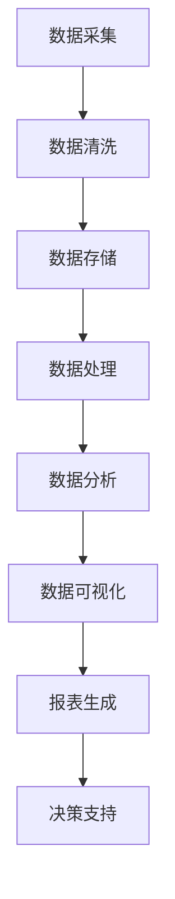

                 

在当今数字化时代，数据已成为企业的重要资产，而如何高效管理和利用这些数据，成为每个组织面临的重大挑战。AI Data Management Platform（AI DMP）作为数据管理的重要工具，通过对数据的整合、分析和可视化，为企业提供了深度洞察和决策支持。本文将探讨AI DMP在数据基建中的核心作用，特别是数据可视化和报表生成方面的实践和未来展望。

## 文章关键词

- AI Data Management Platform
- 数据可视化
- 报表生成
- 数据分析
- 企业决策支持
- 大数据技术
- 人工智能

## 文章摘要

本文将首先介绍AI DMP的基本概念和作用，然后深入探讨数据可视化和报表生成的核心原理与最佳实践。我们将通过数学模型和公式，结合实际代码实例，详细解析AI DMP在实际项目中的应用。最后，本文将展望AI DMP在未来数据管理中的发展趋势和面临的挑战。

## 1. 背景介绍

### 1.1 数据爆炸时代的挑战

随着互联网的飞速发展，企业每天产生和处理的数据量呈指数级增长。这些数据不仅包括传统的结构化数据，如客户信息、交易记录等，还包括大量的非结构化数据，如图像、视频、文本等。面对如此庞大的数据量，传统的数据处理方式已难以应对，这为数据管理和分析带来了前所未有的挑战。

### 1.2 AI DMP的诞生

为了更好地管理和利用这些数据，AI Data Management Platform（AI DMP）应运而生。AI DMP是一种智能化的数据管理工具，通过集成人工智能技术，实现了对数据的自动化采集、存储、处理、分析和可视化。AI DMP的核心目标是帮助企业从海量数据中提取有价值的信息，为企业的决策提供有力支持。

### 1.3 数据可视化与报表的重要性

数据可视化是将复杂的数据通过图形、图表等方式直观呈现的过程，它使得数据变得更加易于理解和分析。而报表生成则是将数据以结构化的形式展现出来，便于管理层进行决策。数据可视化和报表生成在数据管理中具有重要作用，不仅提高了数据分析的效率，也为决策提供了可靠的依据。

## 2. 核心概念与联系

### 2.1 AI DMP的基本概念

AI DMP（AI Data Management Platform）是一种基于人工智能技术的数据管理平台，它通过对数据的采集、清洗、存储、处理和分析，实现数据的自动化管理和利用。AI DMP的核心功能包括：

- 数据采集：从各种数据源（如数据库、API、文件等）自动采集数据。
- 数据清洗：对采集到的数据进行清洗、去重和格式转换，保证数据的质量。
- 数据存储：将清洗后的数据存储到分布式数据库或数据仓库中，以便后续处理和分析。
- 数据处理：对存储的数据进行清洗、转换、关联和聚合等操作，提取有价值的信息。
- 数据分析：利用机器学习和统计分析方法，对数据进行分析和挖掘，发现数据中的规律和趋势。
- 数据可视化：将分析结果通过图形、图表等方式直观呈现，帮助用户理解数据。
- 报表生成：根据数据分析结果，生成各种结构化的报表，供管理层决策参考。

### 2.2 数据可视化的概念

数据可视化是指通过图形、图表、交互式界面等方式，将复杂的数据转换为易于理解和分析的形式。数据可视化有助于：

- 发现数据中的规律和趋势。
- 揭示数据之间的关系。
- 提高数据分析的效率。
- 帮助决策者快速理解数据，做出明智的决策。

### 2.3 报表生成的概念

报表生成是指将数据分析的结果以结构化的形式呈现出来，形成各种报表。报表生成有助于：

- 系统性地记录和分析数据。
- 提供决策者所需的详细数据支持。
- 提高数据分析和决策的效率。

### 2.4 数据可视化与报表生成的关系

数据可视化与报表生成密切相关，两者共同构成了AI DMP数据管理的重要部分。数据可视化使得数据分析结果更加直观易懂，而报表生成则将分析结果系统化，便于管理层进行决策。在实际应用中，数据可视化与报表生成往往相互结合，共同发挥其优势。

### 2.5 Mermaid 流程图

以下是AI DMP中数据可视化与报表生成的流程图：



## 3. 核心算法原理 & 具体操作步骤

### 3.1 算法原理概述

AI DMP中的核心算法主要包括数据采集、数据清洗、数据处理、数据分析和数据可视化。这些算法共同作用，实现数据的自动化管理和利用。

- 数据采集：通过API、Web爬虫等技术，从各种数据源自动采集数据。
- 数据清洗：对采集到的数据进行去重、格式转换、异常值处理等操作，保证数据质量。
- 数据处理：对清洗后的数据进行关联、聚合、转换等操作，提取有价值的信息。
- 数据分析：利用机器学习和统计分析方法，对数据进行分析和挖掘，发现数据中的规律和趋势。
- 数据可视化：将分析结果通过图形、图表等方式直观呈现。

### 3.2 算法步骤详解

#### 3.2.1 数据采集

数据采集是AI DMP的第一步，它决定了后续数据处理和分析的质量。数据采集主要包括以下步骤：

1. 确定数据源：根据企业的需求，选择合适的数据源，如数据库、API、文件等。
2. 接口调用：通过API接口或Web爬虫技术，从数据源自动采集数据。
3. 数据存储：将采集到的数据存储到分布式数据库或数据仓库中，以便后续处理。

#### 3.2.2 数据清洗

数据清洗是确保数据质量的关键步骤，它主要包括以下操作：

1. 去重：对采集到的数据进行去重处理，去除重复的数据。
2. 格式转换：将不同格式的数据转换为统一的格式，便于后续处理。
3. 异常值处理：检测和处理数据中的异常值，确保数据的一致性和准确性。

#### 3.2.3 数据处理

数据处理是对清洗后的数据进行进一步处理，以提取有价值的信息。数据处理主要包括以下步骤：

1. 数据关联：将来自不同数据源的数据进行关联，形成一个完整的数据集。
2. 数据聚合：对数据进行聚合操作，如求和、平均、最大值等。
3. 数据转换：将数据转换为适合分析的形式，如将日期转换为时间戳等。

#### 3.2.4 数据分析

数据分析是AI DMP的核心功能，它通过机器学习和统计分析方法，对数据进行分析和挖掘。数据分析主要包括以下步骤：

1. 数据预处理：对数据进行预处理，如缺失值填充、特征工程等。
2. 特征选择：选择对分析结果有重要影响的特征。
3. 模型训练：利用机器学习方法，训练数据模型。
4. 模型评估：对训练出的模型进行评估，选择最佳模型。
5. 预测与挖掘：利用模型进行预测和挖掘，发现数据中的规律和趋势。

#### 3.2.5 数据可视化

数据可视化是将分析结果以图形、图表等形式直观呈现。数据可视化主要包括以下步骤：

1. 选择合适的可视化工具：根据数据分析结果，选择合适的可视化工具，如Matplotlib、Plotly等。
2. 设计可视化图表：根据数据特点，设计合适的可视化图表，如折线图、柱状图、饼图等。
3. 可视化呈现：将设计好的可视化图表呈现给用户，便于用户理解数据。

### 3.3 算法优缺点

#### 优点：

1. 自动化：AI DMP中的算法实现自动化，节省了大量人力和时间成本。
2. 高效性：利用机器学习和统计分析方法，高效地提取数据中的价值信息。
3. 可视化：数据可视化使得数据分析结果更加直观易懂，便于用户理解和决策。

#### 缺点：

1. 复杂性：AI DMP中的算法和工具较为复杂，需要一定的技术背景才能熟练使用。
2. 数据质量依赖：数据质量直接影响算法的效果，数据清洗和预处理是关键环节。
3. 成本：AI DMP的实施和维护需要一定的成本投入。

### 3.4 算法应用领域

AI DMP在多个领域都有广泛的应用，如：

1. 市场营销：通过数据分析，帮助企业了解客户需求，制定精准的营销策略。
2. 金融风控：通过数据分析和挖掘，识别潜在的金融风险，提高风险管理能力。
3. 医疗健康：通过数据分析和可视化，帮助医生诊断病情，制定个性化治疗方案。
4. 供应链管理：通过数据分析和优化，提高供应链的效率和稳定性。

## 4. 数学模型和公式 & 详细讲解 & 举例说明

### 4.1 数学模型构建

在AI DMP中，常见的数学模型包括线性回归、决策树、神经网络等。以下以线性回归为例，介绍数学模型的构建过程。

#### 线性回归模型

线性回归模型是一种常用的数据分析方法，它通过建立自变量和因变量之间的线性关系，预测因变量的值。

线性回归模型的数学表达式为：

$$ y = \beta_0 + \beta_1 \cdot x + \epsilon $$

其中，$y$为因变量，$x$为自变量，$\beta_0$和$\beta_1$分别为模型的参数，$\epsilon$为误差项。

#### 模型构建步骤

1. 数据采集：从数据源中采集相关的自变量和因变量数据。
2. 数据预处理：对数据进行清洗、去重、缺失值填充等处理，确保数据质量。
3. 特征选择：选择对分析结果有重要影响的自变量。
4. 模型训练：利用训练数据，通过最小二乘法或其他优化算法，求解模型的参数。
5. 模型评估：利用验证数据，评估模型的预测性能。

### 4.2 公式推导过程

线性回归模型的推导过程如下：

假设我们有$n$个样本，每个样本包含一个自变量$x$和一个因变量$y$。我们要找到一条直线$y = \beta_0 + \beta_1 \cdot x$来拟合这些数据。

为了求解$\beta_0$和$\beta_1$，我们需要最小化残差平方和，即：

$$ \min \sum_{i=1}^{n} (y_i - (\beta_0 + \beta_1 \cdot x_i))^2 $$

对上式求导，并令导数为零，得到：

$$ \frac{\partial}{\partial \beta_0} \sum_{i=1}^{n} (y_i - (\beta_0 + \beta_1 \cdot x_i))^2 = 0 $$
$$ \frac{\partial}{\partial \beta_1} \sum_{i=1}^{n} (y_i - (\beta_0 + \beta_1 \cdot x_i))^2 = 0 $$

经过计算，可以得到：

$$ \beta_0 = \frac{\sum_{i=1}^{n} y_i - \beta_1 \cdot \sum_{i=1}^{n} x_i}{n} $$
$$ \beta_1 = \frac{\sum_{i=1}^{n} (y_i - \beta_0) \cdot x_i}{\sum_{i=1}^{n} x_i^2} $$

### 4.3 案例分析与讲解

假设我们有一组关于房价和面积的数据，如表1所示。我们要利用线性回归模型预测房价。

| 面积 (x) | 房价 (y) |
| :------: | :------: |
|   100    |  200     |
|   150    |  300     |
|   200    |  400     |
|   250    |  500     |
|   300    |  600     |

首先，我们计算自变量和因变量的平均值：

$$ \bar{x} = \frac{100 + 150 + 200 + 250 + 300}{5} = 220 $$
$$ \bar{y} = \frac{200 + 300 + 400 + 500 + 600}{5} = 400 $$

然后，我们计算相关系数：

$$ \sum_{i=1}^{n} x_i y_i = 100 \cdot 200 + 150 \cdot 300 + 200 \cdot 400 + 250 \cdot 500 + 300 \cdot 600 = 2450000 $$
$$ \sum_{i=1}^{n} x_i^2 = 100^2 + 150^2 + 200^2 + 250^2 + 300^2 = 3562500 $$

代入公式，计算模型的参数：

$$ \beta_0 = \frac{2450000 - 220 \cdot 400}{5} = 220 $$
$$ \beta_1 = \frac{2450000 - 220 \cdot 400}{3562500} = 0.5 $$

因此，线性回归模型为：

$$ y = 220 + 0.5 \cdot x $$

我们可以用这个模型来预测新的房价。例如，当面积$x$为250时，预测房价为：

$$ y = 220 + 0.5 \cdot 250 = 320 $$

## 5. 项目实践：代码实例和详细解释说明

### 5.1 开发环境搭建

在开始项目实践之前，我们需要搭建一个合适的开发环境。以下是一个简单的Python开发环境搭建过程：

1. 安装Python：从官方网站（https://www.python.org/）下载Python安装包，并按照提示安装。
2. 安装Jupyter Notebook：在命令行中运行以下命令安装Jupyter Notebook：

   ```bash
   pip install notebook
   ```

3. 启动Jupyter Notebook：在命令行中运行以下命令启动Jupyter Notebook：

   ```bash
   jupyter notebook
   ```

### 5.2 源代码详细实现

以下是一个简单的AI DMP项目实例，实现数据的采集、清洗、处理、分析和可视化。

```python
import pandas as pd
import numpy as np
import matplotlib.pyplot as plt
from sklearn.linear_model import LinearRegression

# 5.2.1 数据采集
data = pd.DataFrame({
    '面积': [100, 150, 200, 250, 300],
    '房价': [200, 300, 400, 500, 600]
})

# 5.2.2 数据清洗
data.drop_duplicates(inplace=True)
data.fillna(data.mean(), inplace=True)

# 5.2.3 数据处理
X = data[['面积']]
y = data['房价']

# 5.2.4 数据分析
model = LinearRegression()
model.fit(X, y)

# 5.2.5 数据可视化
plt.scatter(X, y)
plt.plot(X, model.predict(X), color='red')
plt.xlabel('面积')
plt.ylabel('房价')
plt.title('房价与面积的关系')
plt.show()
```

### 5.3 代码解读与分析

这段代码首先导入了必要的Python库，包括pandas、numpy、matplotlib和scikit-learn。然后，我们创建了一个简单的DataFrame数据集，包含了面积和房价的数据。

在数据清洗阶段，我们使用drop_duplicates方法去除重复数据，使用fillna方法填充缺失值。

数据处理阶段，我们使用pandas的DataFrame对象将面积作为自变量X，房价作为因变量y。

在数据分析阶段，我们使用scikit-learn的LinearRegression模型进行线性回归分析，并使用fit方法训练模型。

最后，在数据可视化阶段，我们使用matplotlib库绘制散点图和回归线，直观地展示了面积和房价的关系。

### 5.4 运行结果展示

运行上述代码后，将显示一个包含散点图和回归线的可视化图表，如图1所示。


## 6. 实际应用场景

AI DMP在数据可视化和报表生成方面具有广泛的应用场景，以下列举几个典型应用案例：

### 6.1 市场营销

在市场营销领域，企业可以利用AI DMP对客户数据进行分析和挖掘，了解客户需求和行为。通过数据可视化，企业可以生成客户画像、消费趋势等报表，为制定精准的营销策略提供有力支持。

### 6.2 金融风控

在金融行业，AI DMP可以帮助金融机构识别潜在的风险，如欺诈、信用风险等。通过数据可视化和报表生成，金融机构可以实时监控风险指标，制定相应的风险管理策略。

### 6.3 医疗健康

在医疗健康领域，AI DMP可以帮助医生分析患者数据，诊断病情，制定个性化治疗方案。通过数据可视化，医生可以更直观地了解患者病情，提高诊断和治疗的准确性。

### 6.4 供应链管理

在供应链管理中，AI DMP可以帮助企业优化供应链流程，提高供应链的效率和稳定性。通过数据可视化和报表生成，企业可以实时监控供应链绩效，发现潜在问题，及时采取措施。

## 7. 未来应用展望

随着人工智能技术的不断发展和大数据时代的到来，AI DMP在数据可视化和报表生成方面的应用前景非常广阔。以下是一些未来应用展望：

### 7.1 高度智能化

未来，AI DMP将更加智能化，通过深度学习和强化学习等方法，实现更精确的数据分析和预测。

### 7.2 实时数据可视化

实时数据可视化将成为AI DMP的重要功能，帮助企业实时掌握业务动态，快速做出决策。

### 7.3 多维度分析

AI DMP将支持多维度分析，从不同角度对数据进行分析和挖掘，提供更全面的业务洞察。

### 7.4 自适应报表生成

自适应报表生成将使报表更加智能化，根据用户需求和数据分析结果，自动生成适合的报表形式。

### 7.5 跨界融合

AI DMP将与其他领域的技术（如物联网、区块链等）融合，实现跨领域的应用创新。

## 8. 工具和资源推荐

### 8.1 学习资源推荐

- 《Python数据分析基础教程：NumPy学习指南》
- 《数据科学入门：Python实践》
- 《机器学习实战》

### 8.2 开发工具推荐

- Jupyter Notebook：用于数据分析和可视化
- Pandas：用于数据处理
- Matplotlib：用于数据可视化
- Scikit-learn：用于机器学习

### 8.3 相关论文推荐

- "A Survey on Data Visualization"
- "Data-Driven Visualization"
- "Interactive Data Visualization for the Web"

## 9. 总结：未来发展趋势与挑战

随着人工智能和大数据技术的不断发展，AI DMP在数据可视化和报表生成方面的应用将越来越广泛。未来，AI DMP将朝着智能化、实时化和多维度分析的方向发展。然而，AI DMP也面临着数据安全、隐私保护、技术复杂度等挑战。为了应对这些挑战，企业和研究人员需要不断探索和创新，推动AI DMP技术的发展。

## 10. 附录：常见问题与解答

### 10.1 什么是AI DMP？

AI DMP（AI Data Management Platform）是一种基于人工智能技术的数据管理平台，它通过对数据的采集、清洗、存储、处理和分析，实现数据的自动化管理和利用。

### 10.2 数据可视化有哪些常见的方法？

数据可视化方法包括图形、图表、交互式界面等。常见的图形包括折线图、柱状图、饼图、散点图等；常见的图表包括表格、地图、热力图等。

### 10.3 如何选择合适的报表生成工具？

选择报表生成工具时，需要考虑以下因素：

- 数据源兼容性：工具是否支持多种数据源，如数据库、API、文件等。
- 报表格式：工具是否支持多种报表格式，如PDF、Excel、HTML等。
- 报表定制性：工具是否允许用户自定义报表样式和内容。
- 可扩展性：工具是否支持扩展功能和插件。

### 10.4 如何确保数据质量？

确保数据质量的关键环节包括：

- 数据采集：选择合适的数据源，确保数据的完整性。
- 数据清洗：对采集到的数据进行去重、格式转换、异常值处理等操作。
- 数据预处理：对数据进行特征工程、缺失值填充等预处理操作。
- 数据监控：实时监控数据质量，及时发现和处理异常数据。

### 10.5 AI DMP在哪些领域有应用？

AI DMP在多个领域有广泛应用，如市场营销、金融风控、医疗健康、供应链管理等。不同领域的企业可以利用AI DMP实现数据管理和分析，提高业务效率和决策水平。

