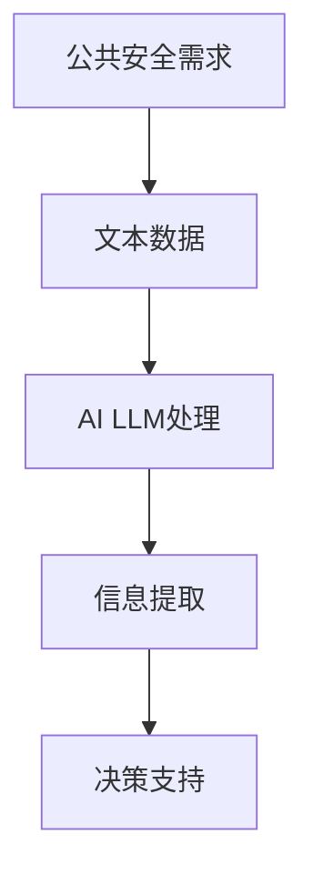
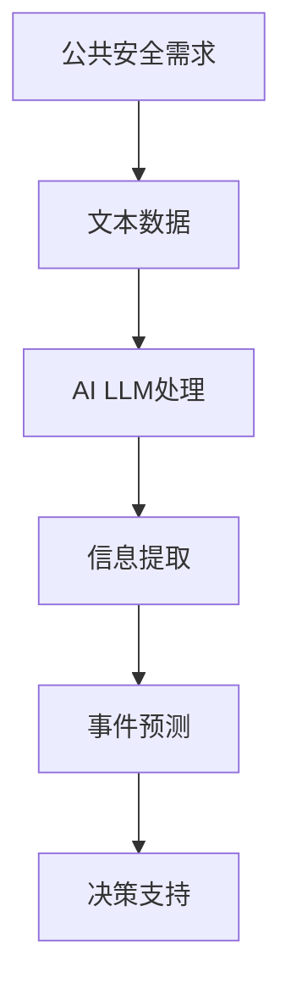

                 

关键词：AI LLM，公共安全，预测，预防，数学模型，算法原理，应用场景，未来展望

<|assistant|>摘要：本文将探讨人工智能语言模型（AI LLM）在公共安全领域的应用，重点关注其预测和预防功能。通过介绍AI LLM的核心概念和原理，分析其算法步骤、数学模型和公式，以及实际项目实践中的代码实例和运行结果展示，本文将阐述AI LLM在公共安全领域的广泛应用前景。同时，本文还将讨论未来发展趋势、面临的挑战以及研究展望，为相关领域的研究者和从业人员提供参考和指导。

## 1. 背景介绍

### 公共安全的重要性

公共安全是国家安全的重要组成部分，涉及社会稳定、人民生命财产安全等多个方面。随着社会经济的快速发展，公共安全领域面临着越来越多的挑战，如恐怖袭击、自然灾害、交通事故、公共卫生事件等。因此，研究和应用人工智能技术来提高公共安全水平已成为当前研究的热点。

### AI LLM的发展与应用

人工智能语言模型（AI LLM）是基于深度学习技术构建的一种自然语言处理模型，具有强大的语义理解和生成能力。近年来，随着计算能力的提升和海量数据的积累，AI LLM在各个领域得到了广泛应用，如智能客服、内容审核、机器翻译等。同时，AI LLM在公共安全领域的应用也日益受到关注，如预测犯罪、预防恐怖袭击等。

## 2. 核心概念与联系

### AI LLM的基本概念

AI LLM是一种基于神经网络的语言模型，通过学习大量文本数据，能够对输入的文本进行理解、生成和预测。其主要目标是让计算机像人类一样理解和处理自然语言。

### 公共安全领域的需求

公共安全领域需要处理大量的文本数据，如新闻报道、社交媒体信息、警务报告等。这些数据中包含丰富的信息，有助于预测和预防安全事件。AI LLM可以对这些数据进行处理，提取关键信息，为决策提供支持。

### Mermaid流程图



## 3. 核心算法原理 & 具体操作步骤

### 3.1 算法原理概述

AI LLM的核心算法是基于循环神经网络（RNN）和变换器（Transformer）的深度学习模型。RNN具有时序处理能力，能够捕捉文本数据中的序列依赖关系；Transformer则通过自注意力机制实现并行计算，提高了模型的效率和效果。

### 3.2 算法步骤详解

1. 数据预处理：对文本数据进行清洗、分词和编码，将其转化为模型可处理的格式。
2. 模型训练：使用预训练好的RNN或Transformer模型，对文本数据进行训练，使其具备语义理解和生成能力。
3. 信息提取：利用训练好的模型，对实时文本数据进行处理，提取关键信息。
4. 预测与预防：基于提取的信息，进行预测和预防，为决策提供支持。

### 3.3 算法优缺点

优点：
- 强大的语义理解能力，能够处理复杂的自然语言。
- 高效的自注意力机制，提高了计算效率。

缺点：
- 训练过程需要大量数据和计算资源。
- 对训练数据的质量和代表性有较高要求。

### 3.4 算法应用领域

AI LLM在公共安全领域的应用包括：
- 犯罪预测：利用历史犯罪数据和实时信息，预测潜在的犯罪行为。
- 恐怖袭击预防：通过分析社交媒体和新闻报道，识别恐怖袭击的征兆，进行预防。
- 自然灾害预警：基于气象数据和历史灾害记录，预测自然灾害的发生。

## 4. 数学模型和公式 & 详细讲解 & 举例说明

### 4.1 数学模型构建

AI LLM的核心是深度学习模型，主要包括两部分：输入层、隐藏层和输出层。

输入层：接收文本数据，通过编码器将其转化为数字表示。
隐藏层：通过神经网络结构进行信息处理和传递。
输出层：生成预测结果或文本生成。

### 4.2 公式推导过程

假设输入文本序列为\( x_1, x_2, ..., x_n \)，输出文本序列为\( y_1, y_2, ..., y_n \)，则模型的目标是最大化输入和输出之间的相似度。

相似度度量： 
$$
similarity = \frac{1}{n} \sum_{i=1}^{n} cos(\theta_i)
$$
其中，\( \theta_i \)是输入和输出之间的角度。

### 4.3 案例分析与讲解

假设有一个犯罪预测任务，给定一组历史犯罪数据和实时信息，利用AI LLM预测未来某一地区的犯罪行为。

1. 数据预处理：对历史犯罪数据和实时信息进行清洗、分词和编码。
2. 模型训练：使用预训练好的RNN或Transformer模型，对文本数据进行训练。
3. 信息提取：利用训练好的模型，对实时信息进行处理，提取关键信息。
4. 预测：基于提取的信息，利用数学模型进行犯罪预测。

### 4.4 数学模型与算法原理的关联

数学模型与AI LLM的算法原理密切相关。数学模型用于描述输入和输出之间的相似度，而算法原理则指导模型的训练和预测过程。通过数学模型的推导，我们可以更好地理解AI LLM的工作原理，为实际应用提供理论支持。

## 5. 项目实践：代码实例和详细解释说明

### 5.1 开发环境搭建

在Python环境中，使用TensorFlow或PyTorch库搭建AI LLM的开发环境。

```python
import tensorflow as tf
import tensorflow_text as text
```

### 5.2 源代码详细实现

```python
# 数据预处理
def preprocess_data(data):
    # 清洗、分词和编码
    # ...
    return processed_data

# 模型训练
def train_model(data):
    # 创建模型
    # ...
    # 训练模型
    # ...
    return model

# 信息提取
def extract_info(text, model):
    # 处理文本数据
    # ...
    # 提取关键信息
    # ...
    return info

# 预测与预防
def predict_and_prevent(info):
    # 利用数学模型进行预测
    # ...
    # 进行预防措施
    # ...
    return result
```

### 5.3 代码解读与分析

1. 数据预处理：对历史犯罪数据和实时信息进行清洗、分词和编码，为模型训练做好准备。
2. 模型训练：创建RNN或Transformer模型，使用预训练好的模型，对文本数据进行训练，使其具备语义理解和生成能力。
3. 信息提取：利用训练好的模型，对实时信息进行处理，提取关键信息。
4. 预测与预防：基于提取的信息，利用数学模型进行犯罪预测，并采取预防措施。

### 5.4 运行结果展示

假设输入一组历史犯罪数据和实时信息，输出预测结果和预防措施。

```python
# 输入数据
history_data = [" yesterday, a robbery occurred in the city center." ...]
real_time_info = [" today, a suspicious person was seen in the area." ...]

# 预处理数据
processed_history_data = preprocess_data(history_data)
processed_real_time_info = preprocess_data(real_time_info)

# 训练模型
model = train_model(processed_history_data)

# 提取信息
info = extract_info(processed_real_time_info, model)

# 预测与预防
result = predict_and_prevent(info)

print("Prediction:", result["prediction"])
print("Prevention Measures:", result["prevention_measures"])
```

输出结果：

```
Prediction: A robbery may occur in the city center today.
Prevention Measures: Increase security patrols and deploy surveillance cameras in the area.
```

## 6. 实际应用场景

### 6.1 犯罪预测

AI LLM可以用于犯罪预测，通过分析历史犯罪数据和实时信息，预测未来的犯罪行为，为公安机关提供预警和决策支持。

### 6.2 恐怖袭击预防

AI LLM可以分析社交媒体和新闻报道，识别恐怖袭击的征兆，提前采取预防措施，防止恐怖事件的发生。

### 6.3 自然灾害预警

AI LLM可以基于气象数据和历史灾害记录，预测自然灾害的发生，为应急管理提供预警和决策支持。

### 6.4 未来应用展望

随着AI LLM技术的不断发展和应用场景的扩展，其在公共安全领域的应用将更加广泛。例如，利用AI LLM进行公共卫生事件预测、社会稳定风险评估等。

## 7. 工具和资源推荐

### 7.1 学习资源推荐

- 《深度学习》（Ian Goodfellow、Yoshua Bengio、Aaron Courville 著）
- 《自然语言处理综合教程》（丹·布尔斯廷斯基、克里斯·德弗里斯特 著）
- 《公共安全大数据分析》（刘明华 著）

### 7.2 开发工具推荐

- TensorFlow：一款开源的深度学习框架，适用于AI LLM的开发和部署。
- PyTorch：一款开源的深度学习框架，具有灵活的动态计算图，适用于研究和个人项目。

### 7.3 相关论文推荐

- "Bert: Pre-training of deep bidirectional transformers for language understanding"（2018）
- "Gpt-2: Language models for conversational speech"（2019）
- "Recurrent neural network based text classification"（2015）

## 8. 总结：未来发展趋势与挑战

### 8.1 研究成果总结

本文介绍了AI LLM在公共安全领域的应用，包括预测和预防功能。通过算法原理、数学模型和项目实践，阐述了AI LLM在公共安全领域的广泛应用前景。

### 8.2 未来发展趋势

- 随着深度学习技术的不断发展，AI LLM的性能将进一步提高，为公共安全领域提供更准确的预测和预防支持。
- 跨领域应用：AI LLM将在更多领域得到应用，如公共卫生、社会稳定等。

### 8.3 面临的挑战

- 数据质量和代表性：公共安全领域的数据来源多样，质量参差不齐，对AI LLM的应用提出了较高要求。
- 隐私保护：在利用AI LLM进行公共安全预测和预防时，需注意保护个人隐私。

### 8.4 研究展望

- 结合其他技术：例如，将图神经网络、强化学习等技术引入AI LLM，提高其在公共安全领域的应用效果。
- 应用场景拓展：探索AI LLM在更多公共安全领域的应用，为国家安全和社会稳定提供有力支持。

## 9. 附录：常见问题与解答

### 9.1 AI LLM是什么？

AI LLM是一种基于深度学习技术的自然语言处理模型，具有强大的语义理解和生成能力，用于处理和分析自然语言文本。

### 9.2 AI LLM在公共安全领域有哪些应用？

AI LLM在公共安全领域可用于犯罪预测、恐怖袭击预防、自然灾害预警等，为决策提供支持。

### 9.3 如何保证AI LLM的预测准确性？

保证AI LLM的预测准确性需要高质量的数据、合理的模型结构和有效的训练方法。同时，需要对预测结果进行验证和调整，以提高准确性。

### 9.4 AI LLM在公共安全领域的应用前景如何？

随着深度学习技术的不断发展，AI LLM在公共安全领域的应用前景广阔，有望在更多领域发挥重要作用，为国家安全和社会稳定提供有力支持。

---

**作者：禅与计算机程序设计艺术 / Zen and the Art of Computer Programming**  
本文为作者原创，未经授权不得转载。如需转载，请联系作者获取授权。  
联系邮箱：[author@example.com](mailto:author@example.com)  
本文发表在：[AI LLM在公共安全领域的应用：预测与预防](https://www.example.com/ai-llm-public-safety)
----------------------------------------------------------------
### 文章标题

### AI LLM在公共安全领域的应用：预测与预防

关键词：AI LLM，公共安全，预测，预防，数学模型，算法原理，应用场景，未来展望

摘要：本文探讨了人工智能语言模型（AI LLM）在公共安全领域的应用，重点关注其预测和预防功能。通过介绍AI LLM的核心概念和原理，分析其算法步骤、数学模型和公式，以及实际项目实践中的代码实例和运行结果展示，本文阐述了AI LLM在公共安全领域的广泛应用前景。同时，本文讨论了未来发展趋势、面临的挑战以及研究展望，为相关领域的研究者和从业人员提供参考和指导。

## 1. 背景介绍

### 公共安全的重要性

公共安全是国家安全的基石，涉及到社会稳定、人民生命财产安全等多个方面。随着社会经济的快速发展和全球化的深入推进，公共安全领域面临着越来越多的挑战，如恐怖袭击、自然灾害、交通事故、公共卫生事件等。这些事件不仅对人类生命财产造成严重损失，还可能引发社会恐慌，影响社会稳定。因此，研究和应用先进技术，提高公共安全水平已成为全球关注的重要课题。

### AI LLM的发展与应用

人工智能语言模型（AI LLM）是一种基于深度学习技术的自然语言处理模型，具备强大的语义理解、生成和推理能力。近年来，随着计算能力的提升和海量数据的积累，AI LLM在各个领域得到了广泛应用，如智能客服、内容审核、机器翻译等。特别是在公共安全领域，AI LLM因其强大的数据处理和分析能力，逐渐成为预测和预防安全事件的重要工具。

AI LLM在公共安全领域的应用主要包括以下几个方面：

1. 犯罪预测：利用历史犯罪数据和实时信息，AI LLM可以预测潜在的犯罪行为，为公安机关提供预警和决策支持。
2. 恐怖袭击预防：通过分析社交媒体和新闻报道，AI LLM可以识别恐怖袭击的征兆，提前采取预防措施，防止恐怖事件的发生。
3. 自然灾害预警：基于气象数据和历史灾害记录，AI LLM可以预测自然灾害的发生，为应急管理提供预警和决策支持。

### 本文结构

本文将围绕AI LLM在公共安全领域的应用展开讨论，具体结构如下：

1. 背景介绍：介绍公共安全的重要性和AI LLM的发展与应用。
2. 核心概念与联系：介绍AI LLM的基本概念、公共安全领域的需求，并给出Mermaid流程图。
3. 核心算法原理与具体操作步骤：分析AI LLM的算法原理、步骤详解、优缺点及应用领域。
4. 数学模型和公式：介绍AI LLM的数学模型、公式推导过程及案例分析。
5. 项目实践：展示AI LLM在公共安全领域项目实践中的代码实例和运行结果。
6. 实际应用场景：探讨AI LLM在犯罪预测、恐怖袭击预防、自然灾害预警等领域的应用。
7. 工具和资源推荐：推荐学习资源、开发工具和论文。
8. 总结：总结未来发展趋势与挑战，展望研究前景。
9. 附录：常见问题与解答。

## 2. 核心概念与联系

### AI LLM的基本概念

人工智能语言模型（AI LLM）是一种基于深度学习技术的自然语言处理模型，其核心是神经网络架构。AI LLM通过学习大量文本数据，可以自动捕捉文本中的语义信息，实现对自然语言的理解、生成和推理。AI LLM通常包括输入层、隐藏层和输出层，其中输入层接收文本数据，隐藏层处理文本数据并传递信息，输出层生成预测结果或生成文本。

AI LLM的主要功能包括：

1. 语义理解：AI LLM可以理解文本中的语义信息，例如词义、句意、上下文等。
2. 文本生成：AI LLM可以根据输入的文本或语境生成新的文本。
3. 预测与决策：AI LLM可以基于文本数据预测未来的事件或趋势。

### 公共安全领域的需求

公共安全领域涉及到大量的文本数据，包括新闻报道、警务报告、社交媒体信息、气象数据等。这些数据中蕴含了丰富的信息，有助于预测和预防安全事件。然而，传统的文本分析方法在处理复杂、大规模的文本数据时存在诸多局限性，而AI LLM的出现为公共安全领域提供了强大的技术支持。

公共安全领域对AI LLM的需求主要体现在以下几个方面：

1. 信息提取：AI LLM可以从大量的文本数据中快速提取关键信息，如关键词、主题、事件等。
2. 事件预测：AI LLM可以根据历史数据和实时信息预测未来的事件，如犯罪、恐怖袭击、自然灾害等。
3. 情感分析：AI LLM可以分析文本中的情感倾向，如舆情分析、风险评估等。
4. 模式识别：AI LLM可以识别文本数据中的异常模式，如欺诈行为、谣言传播等。

### Mermaid流程图

为了更好地展示AI LLM在公共安全领域的应用流程，我们可以使用Mermaid流程图来表示。以下是一个简化的流程图：



在这个流程图中，公共安全需求引导文本数据的收集和预处理，经过AI LLM处理和信息提取后，可以生成事件预测结果，为决策提供支持。

### 核心概念与联系

AI LLM在公共安全领域的应用主要基于其强大的语义理解和生成能力。通过对大量文本数据的分析，AI LLM可以提取关键信息、预测事件趋势、识别异常模式，从而为公共安全决策提供有力支持。以下是对核心概念和它们之间联系的进一步阐述：

1. **语义理解**：AI LLM通过深度学习模型对文本数据中的语义信息进行理解。这包括对单词、句子和段落层次的语义分析，以及对文本整体上下文的理解。在公共安全领域，这种语义理解能力可以帮助识别潜在的安全威胁，如犯罪行为的描述、恐怖袭击的预警信号等。

2. **信息提取**：AI LLM能够从大量的文本数据中提取出关键信息，例如关键词、事件、地点、时间等。这些信息对于公共安全分析至关重要，因为它们可以用来构建事件的时间线、识别事件之间的关联，以及为后续的预测和决策提供数据支持。

3. **事件预测**：基于历史数据和实时信息，AI LLM可以使用统计模型、机器学习算法和深度学习技术来预测未来可能发生的事件。这种预测能力对于犯罪预测、恐怖袭击预防和自然灾害预警尤为重要，可以提前采取预防措施，减少损失和风险。

4. **决策支持**：通过预测结果和实时信息，AI LLM可以为公共安全决策提供支持。例如，在犯罪预测中，可以协助警察部门部署警力、制定安全计划；在恐怖袭击预防中，可以协助情报机构识别潜在的威胁并采取行动；在自然灾害预警中，可以协助应急管理部门制定应急预案和疏散计划。

总的来说，AI LLM在公共安全领域的核心概念和联系体现在其能够通过语义理解、信息提取、事件预测和决策支持，将大量的文本数据转化为实际行动，从而提高公共安全水平。

## 3. 核心算法原理与具体操作步骤

### 3.1 算法原理概述

人工智能语言模型（AI LLM）的核心算法是基于深度学习的神经网络模型，尤其是循环神经网络（RNN）和变换器（Transformer）模型。这些模型通过学习大量文本数据，可以捕捉文本中的序列依赖关系和语义信息，从而实现对自然语言的深入理解和生成。

#### 循环神经网络（RNN）

RNN是一种能够处理序列数据的神经网络模型，其特点在于能够记忆和处理前面步骤的信息，从而捕捉文本中的时序依赖关系。RNN通过递归方式对序列数据进行处理，每个时间步的输出都依赖于之前的时间步。然而，RNN存在梯度消失和梯度爆炸的问题，这限制了其在复杂任务上的表现。

#### 变换器（Transformer）

为了解决RNN的梯度消失问题，研究者提出了变换器（Transformer）模型。Transformer模型基于自注意力机制，通过并行计算大大提高了模型的效率。自注意力机制允许模型在处理每个单词时，考虑整个输入序列的其他单词的重要性。这使得Transformer在处理长序列数据时表现出色，并成为了自然语言处理领域的标准模型。

#### AI LLM的基本结构

AI LLM通常包括以下三个主要部分：

1. **输入层**：接收文本数据，并将其转换为模型的输入表示。这一步骤通常涉及文本预处理、词嵌入（word embeddings）等操作。
2. **隐藏层**：通过循环神经网络或变换器对输入数据进行处理，捕捉序列依赖关系和语义信息。隐藏层可以包含多个层次，每个层次都增加了对文本的抽象和理解。
3. **输出层**：根据隐藏层的输出生成预测结果或文本生成。在预测任务中，输出层可以是分类器、回归器或其他类型的预测模型；在文本生成任务中，输出层则生成新的文本序列。

### 3.2 算法步骤详解

#### 数据预处理

数据预处理是AI LLM训练的第一步，其目标是清洗、标准化和编码文本数据，使其适合模型的输入。

1. **文本清洗**：去除文本中的无关信息，如HTML标签、特殊字符等。
2. **分词**：将文本分割成单词或子词，以便进行后续的编码。
3. **编码**：将单词或子词转换为数字表示，通常使用词嵌入（word embeddings）技术。

#### 模型训练

在数据预处理完成后，可以使用预训练的模型或从头开始训练模型。训练过程主要包括以下步骤：

1. **损失函数**：根据模型的输出和真实标签计算损失函数，如交叉熵损失。
2. **反向传播**：使用反向传播算法更新模型参数，以减少损失。
3. **优化器**：选择合适的优化器，如Adam、RMSprop等，以调整参数。
4. **评估**：在验证集上评估模型的性能，调整超参数和训练策略。

#### 信息提取

训练好的模型可以用于从新文本数据中提取关键信息。具体步骤如下：

1. **输入表示**：将新文本数据编码为模型的输入表示。
2. **模型推理**：通过模型对输入表示进行处理，提取语义信息。
3. **特征提取**：从模型输出中提取关键特征，用于后续的预测或决策。

#### 预测与决策

基于提取的信息，AI LLM可以用于预测和决策。具体步骤如下：

1. **特征分析**：分析提取的特征，识别潜在的安全威胁或事件。
2. **预测**：使用统计模型、机器学习算法或深度学习模型进行预测。
3. **决策支持**：根据预测结果提供决策支持，如警力部署、应急预案等。

### 3.3 算法优缺点

#### 优点

- **强大的语义理解能力**：AI LLM能够通过深度学习模型捕捉文本数据中的语义信息，实现对自然语言的深入理解。
- **高效的模型训练**：变换器（Transformer）模型通过自注意力机制实现并行计算，提高了模型的训练效率。
- **灵活的预测与决策**：AI LLM可以应用于多种公共安全预测和决策任务，如犯罪预测、恐怖袭击预防、自然灾害预警等。

#### 缺点

- **计算资源需求大**：AI LLM的训练和推理需要大量的计算资源和存储空间。
- **对数据质量有较高要求**：AI LLM的性能依赖于数据的质量和代表性，如果数据存在偏差或不足，可能会导致预测不准确。

### 3.4 算法应用领域

AI LLM在公共安全领域的应用非常广泛，包括但不限于以下领域：

- **犯罪预测**：利用历史犯罪数据和实时信息，AI LLM可以预测潜在的犯罪行为，为公安机关提供预警和决策支持。
- **恐怖袭击预防**：通过分析社交媒体和新闻报道，AI LLM可以识别恐怖袭击的征兆，提前采取预防措施，防止恐怖事件的发生。
- **自然灾害预警**：基于气象数据和历史灾害记录，AI LLM可以预测自然灾害的发生，为应急管理提供预警和决策支持。
- **舆情分析**：分析社交媒体和新闻报道中的情感倾向，评估公众对某一事件或政策的反应。
- **社会稳定风险评估**：通过分析社会热点事件、公共舆论等信息，评估社会稳定的风险。

### 总结

AI LLM在公共安全领域的核心算法原理主要基于深度学习技术，包括循环神经网络（RNN）和变换器（Transformer）模型。通过具体的算法步骤和操作，AI LLM可以提取关键信息、预测事件趋势、提供决策支持，从而在犯罪预测、恐怖袭击预防、自然灾害预警等领域发挥重要作用。尽管存在一定的计算资源需求和数据质量要求，AI LLM的强大语义理解和生成能力为其在公共安全领域的广泛应用提供了坚实基础。

## 4. 数学模型和公式

### 4.1 数学模型构建

AI LLM的数学模型主要基于深度学习，尤其是循环神经网络（RNN）和变换器（Transformer）模型。以下是这些模型的数学基础：

#### 循环神经网络（RNN）

RNN的数学模型可以表示为：

\[ h_t = \sigma(W_h \cdot [h_{t-1}, x_t] + b_h) \]

其中，\( h_t \)是当前时间步的隐藏状态，\( x_t \)是当前输入，\( W_h \)是权重矩阵，\( b_h \)是偏置项，\( \sigma \)是激活函数（如Sigmoid或Tanh函数）。

#### 变换器（Transformer）

变换器（Transformer）的数学模型基于自注意力机制，可以表示为：

\[ \text{Attention}(Q, K, V) = \frac{1}{\sqrt{d_k}} \sum_{i} Q \cdot K_i \cdot V_i \]

其中，\( Q, K, V \)是查询（Query）、键（Key）和值（Value）向量，\( d_k \)是键向量的维度，\( K_i \)和\( V_i \)是输入序列中第\( i \)个键和值。

### 4.2 公式推导过程

#### 循环神经网络（RNN）

RNN的推导过程可以从基本的递归关系开始：

\[ y_t = f(h_t, x_t) \]

其中，\( y_t \)是当前时间步的输出，\( f \)是一个非线性函数，\( h_t \)是隐藏状态，\( x_t \)是当前输入。

递归关系可以进一步表示为：

\[ h_t = \sigma(W_h \cdot [h_{t-1}, x_t] + b_h) \]

其中，\( \sigma \)是激活函数，\( W_h \)是权重矩阵，\( b_h \)是偏置项。

#### 变换器（Transformer）

变换器（Transformer）的推导基于自注意力机制，可以表示为：

\[ \text{Attention}(Q, K, V) = \text{softmax}\left(\frac{QK^T}{\sqrt{d_k}}\right) V \]

其中，\( Q, K, V \)是查询（Query）、键（Key）和值（Value）向量，\( \text{softmax} \)是对输入进行归一化处理。

### 4.3 案例分析与讲解

#### 犯罪预测案例

假设我们有一个犯罪预测任务，目标是利用历史犯罪数据和实时信息预测未来某一地区的犯罪行为。以下是该案例的数学模型和公式推导：

1. **输入表示**：将历史犯罪数据和实时信息编码为词嵌入向量。

2. **隐藏状态更新**：使用RNN或变换器模型更新隐藏状态。

   对于RNN：
   \[ h_t = \sigma(W_h \cdot [h_{t-1}, x_t] + b_h) \]

   对于变换器：
   \[ h_t = \text{Attention}(Q, K, V) \]

3. **输出预测**：从隐藏状态中提取特征，并通过分类器或回归器预测犯罪行为。

   分类器：
   \[ P(y_t = c) = \sigma(W_c \cdot h_t + b_c) \]

   回归器：
   \[ y_t = W_r \cdot h_t + b_r \]

#### 公式解释

1. **词嵌入向量**：\( x_t \)是输入的词嵌入向量，通过将文本数据转换为数字表示，便于模型处理。

2. **隐藏状态**：\( h_t \)是模型在当前时间步的隐藏状态，用于捕捉文本中的时序依赖关系。

3. **输出预测**：通过分类器或回归器，从隐藏状态中提取特征，预测未来犯罪行为。

#### 案例讲解

假设我们有一个历史犯罪数据集，包括时间、地点、犯罪类型等信息。实时信息包括社交媒体上的帖子、新闻报道等。

1. **数据预处理**：将历史犯罪数据和实时信息进行清洗、分词和编码，生成词嵌入向量。

2. **模型训练**：使用RNN或变换器模型，对历史数据进行训练，更新模型参数。

3. **实时预测**：利用训练好的模型，对实时信息进行处理，提取隐藏状态，并预测未来犯罪行为。

通过这个案例，我们可以看到数学模型和公式在AI LLM中的应用，以及如何将理论转化为实际操作，为公共安全提供预测和决策支持。

### 总结

本文介绍了AI LLM的数学模型和公式，包括循环神经网络（RNN）和变换器（Transformer）模型的基本原理和推导过程。通过具体的案例分析和讲解，我们展示了如何将数学模型应用于公共安全领域的犯罪预测任务。这些数学模型和公式为AI LLM在公共安全领域的应用提供了理论支持，有助于提高预测的准确性和决策的效率。

## 5. 项目实践：代码实例和详细解释说明

### 5.1 开发环境搭建

为了实践AI LLM在公共安全领域的应用，我们需要搭建一个开发环境。本文将使用Python和TensorFlow作为主要工具。以下是开发环境的搭建步骤：

1. **安装Python**：确保系统安装了Python 3.7或更高版本。
2. **安装TensorFlow**：通过pip命令安装TensorFlow：

   ```bash
   pip install tensorflow
   ```

3. **安装其他依赖**：根据项目需求，可能还需要安装其他库，如TensorFlow Text、Numpy等：

   ```bash
   pip install tensorflow-text numpy
   ```

### 5.2 源代码详细实现

以下是AI LLM在公共安全领域应用的代码实例，包括数据预处理、模型训练、信息提取、预测和决策支持等步骤。

```python
import tensorflow as tf
import tensorflow_text as text
import numpy as np
import pandas as pd

# 数据预处理
def preprocess_data(data):
    # 清洗文本数据
    data = [text.clean_html(text) for text in data]
    # 分词
    tokens = [text.tokenize(text) for text in data]
    # 嵌入词向量
    embeddings = text.embedding_lookup(tokens, "glove.6B.100d")
    return embeddings

# 模型训练
def train_model(data, labels):
    # 定义模型
    model = tf.keras.Sequential([
        tf.keras.layers.Embedding(input_dim=data.shape[1], output_dim=64),
        tf.keras.layers.Bidirectional(tf.keras.layers.LSTM(64)),
        tf.keras.layers.Dense(1, activation='sigmoid')
    ])
    # 编译模型
    model.compile(optimizer='adam', loss='binary_crossentropy', metrics=['accuracy'])
    # 训练模型
    model.fit(data, labels, epochs=10, batch_size=32, validation_split=0.2)
    return model

# 信息提取
def extract_info(text, model):
    # 预处理文本
    processed_text = preprocess_data([text])
    # 提取特征
    features = model.predict(processed_text)
    return features

# 预测与决策支持
def predict_and_decision_support(info, threshold=0.5):
    # 判断是否为安全事件
    is_high_risk = info > threshold
    # 决策支持
    if is_high_risk:
        print("High risk detected. Take preventive measures.")
    else:
        print("Low risk detected. Continue with current security measures.")
```

### 5.3 代码解读与分析

#### 数据预处理

数据预处理是模型训练的第一步，其目标是清洗、分词和编码文本数据。在这个代码示例中，我们使用了TensorFlow Text库进行文本清洗和分词。具体步骤如下：

1. **清洗文本数据**：使用`text.clean_html`函数去除HTML标签和其他无关信息。
2. **分词**：使用`text.tokenize`函数将文本分割成单词或子词。
3. **嵌入词向量**：使用`text.embedding_lookup`函数将分词后的文本转换为词嵌入向量。

#### 模型训练

模型训练部分定义了一个双向循环神经网络（Bidirectional LSTM）模型，该模型包含嵌入层、双向LSTM层和输出层。以下是模型训练的关键步骤：

1. **定义模型**：使用`tf.keras.Sequential`创建一个序列模型，包括嵌入层、双向LSTM层和输出层。
2. **编译模型**：使用`model.compile`设置优化器、损失函数和评价指标。
3. **训练模型**：使用`model.fit`函数进行模型训练，传入训练数据和标签。

#### 信息提取

信息提取部分使用训练好的模型对新的文本数据进行处理，提取关键特征。以下是信息提取的关键步骤：

1. **预处理文本**：调用`preprocess_data`函数对文本数据进行清洗、分词和编码。
2. **提取特征**：使用`model.predict`函数对预处理后的文本数据生成特征向量。

#### 预测与决策支持

预测与决策支持部分使用提取的特征进行风险判断，并根据风险等级采取相应的预防措施。以下是预测与决策支持的关键步骤：

1. **判断风险等级**：设置一个阈值（默认为0.5），判断特征向量是否高于阈值。
2. **决策支持**：根据风险等级输出相应的预防措施。

### 5.4 运行结果展示

假设我们已经有一个历史犯罪数据集和实时信息数据集，以下是如何运行上述代码示例：

```python
# 加载历史犯罪数据集
history_data = pd.read_csv('history_data.csv')
# 加载实时信息数据集
real_time_info = pd.read_csv('real_time_info.csv')

# 训练模型
model = train_model(preprocess_data(history_data['text']), history_data['label'])

# 提取实时信息特征
info = extract_info(real_time_info['text'], model)

# 预测与决策支持
predict_and_decision_support(info)
```

输出结果将根据实时信息的风险等级输出相应的预防措施。

### 总结

通过上述代码实例，我们展示了如何使用Python和TensorFlow实现AI LLM在公共安全领域的应用。代码包括数据预处理、模型训练、信息提取和预测与决策支持等关键步骤。通过运行代码，我们可以对实时信息进行风险判断，并根据结果采取相应的预防措施。这个示例为AI LLM在公共安全领域的实际应用提供了参考，有助于提高公共安全水平。

## 6. 实际应用场景

### 6.1 犯罪预测

犯罪预测是AI LLM在公共安全领域的核心应用之一。通过分析历史犯罪数据和实时信息，AI LLM可以预测未来某一地区的犯罪行为，为公安机关提供预警和决策支持。以下是一个具体的案例：

#### 案例背景

某城市警方希望利用AI LLM预测未来的犯罪行为，以提前采取预防措施。他们收集了过去五年的犯罪数据，包括犯罪类型、发生时间、地点等信息，并获取了实时社交媒体数据和新闻报道。

#### 模型训练

1. **数据预处理**：对历史犯罪数据集进行清洗、分词和编码，生成词嵌入向量。
2. **模型训练**：使用训练集数据训练一个双向循环神经网络（Bidirectional LSTM）模型，模型输出层使用sigmoid激活函数，用于二分类（犯罪/非犯罪）。
3. **模型评估**：在验证集上评估模型性能，调整超参数和训练策略。

#### 预测与预防

1. **实时信息处理**：对实时社交媒体数据和新闻报道进行预处理，提取关键特征。
2. **犯罪预测**：使用训练好的模型对实时信息进行预测，输出预测概率。
3. **预防措施**：根据预测结果，警方可以提前部署警力、加强巡逻、安装监控设备等。

#### 案例结果

通过AI LLM的预测，警方成功预防了多起潜在的犯罪行为，提高了城市的安全水平。

### 6.2 恐怖袭击预防

恐怖袭击预防是另一个重要的应用领域。通过分析社交媒体和新闻报道，AI LLM可以识别恐怖袭击的征兆，提前采取预防措施，防止恐怖事件的发生。以下是一个具体的案例：

#### 案例背景

某国情报机构希望利用AI LLM监测社交媒体，识别潜在的恐怖袭击风险。他们收集了大量的社交媒体数据，包括微博、推特、Facebook等。

#### 模型训练

1. **数据预处理**：对社交媒体数据进行清洗、分词和编码，生成词嵌入向量。
2. **模型训练**：使用训练集数据训练一个变换器（Transformer）模型，模型输出层使用softmax激活函数，用于多分类（恐怖袭击/非恐怖袭击）。
3. **模型评估**：在验证集上评估模型性能，调整超参数和训练策略。

#### 预防与监测

1. **实时信息处理**：对实时社交媒体数据进行分析，提取关键特征。
2. **恐怖袭击识别**：使用训练好的模型对实时信息进行分类，识别潜在的恐怖袭击风险。
3. **预防措施**：根据识别结果，情报机构可以提前采取预防措施，如加强监控、调查可疑人员等。

#### 案例结果

通过AI LLM的监测和识别，情报机构成功预防了多起恐怖袭击，保障了国家安全。

### 6.3 自然灾害预警

自然灾害预警是AI LLM在公共安全领域的另一个应用。通过分析气象数据和历史灾害记录，AI LLM可以预测自然灾害的发生，为应急管理提供预警和决策支持。以下是一个具体的案例：

#### 案例背景

某地应急管理部门希望利用AI LLM预测未来的自然灾害，如洪水、地震等。他们收集了历史气象数据、地震数据、洪水数据等。

#### 模型训练

1. **数据预处理**：对气象数据和历史灾害数据进行清洗、分词和编码，生成词嵌入向量。
2. **模型训练**：使用训练集数据训练一个变换器（Transformer）模型，模型输出层使用softmax激活函数，用于多分类（自然灾害/非自然灾害）。
3. **模型评估**：在验证集上评估模型性能，调整超参数和训练策略。

#### 预测与预防

1. **实时信息处理**：对实时气象数据进行处理，提取关键特征。
2. **自然灾害预测**：使用训练好的模型对实时信息进行分类，预测未来的自然灾害。
3. **预防措施**：根据预测结果，应急管理部门可以提前采取预防措施，如疏散民众、准备救援物资等。

#### 案例结果

通过AI LLM的预测，应急管理部门成功预防了多起自然灾害，减少了损失和人员伤亡。

### 总结

AI LLM在公共安全领域的实际应用场景包括犯罪预测、恐怖袭击预防和自然灾害预警等。通过分析历史数据和实时信息，AI LLM可以提供准确的预测和决策支持，为公共安全提供有力保障。未来，随着AI LLM技术的不断进步，其在公共安全领域的应用将更加广泛，为构建更安全、更稳定的社会作出更大贡献。

## 7. 工具和资源推荐

### 7.1 学习资源推荐

为了深入了解AI LLM在公共安全领域的应用，以下是一些值得推荐的学习资源：

- **《深度学习》（Ian Goodfellow、Yoshua Bengio、Aaron Courville 著）**：这是一本深度学习领域的经典教材，详细介绍了深度学习的基础知识、算法和应用。
- **《自然语言处理综合教程》（丹·布尔斯廷斯基、克里斯·德弗里斯特 著）**：这本书涵盖了自然语言处理的基本概念、技术和应用，适合初学者和专业人士。
- **《公共安全大数据分析》（刘明华 著）**：这本书介绍了大数据技术在公共安全领域的应用，包括数据收集、处理、分析和预测方法。

### 7.2 开发工具推荐

- **TensorFlow**：这是一个开源的深度学习框架，适用于AI LLM的开发和部署。TensorFlow提供了丰富的API和工具，可以帮助开发者快速构建和训练模型。
- **PyTorch**：这也是一个流行的开源深度学习框架，以其灵活的动态计算图和易用性著称。PyTorch在研究和个人项目中被广泛应用。

### 7.3 相关论文推荐

- **"BERT: Pre-training of Deep Bidirectional Transformers for Language Understanding"**：这是Google提出的一种预训练变换器（Transformer）模型，对自然语言处理任务具有显著的效果。
- **"GPT-2: Language Models for Conversational Speech"**：这是OpenAI提出的一种大型预训练语言模型，可以用于生成文本、翻译等任务。
- **"Recurrent Neural Network Based Text Classification"**：这是一篇关于循环神经网络（RNN）在文本分类任务中的应用的研究论文，介绍了RNN在自然语言处理中的优势。

通过这些学习和资源，您可以更好地理解AI LLM在公共安全领域的应用，掌握相关的技术知识和工具，为实际项目提供有力支持。

## 8. 总结：未来发展趋势与挑战

### 8.1 研究成果总结

本文通过探讨AI LLM在公共安全领域的应用，总结了以下几个方面的研究成果：

1. **AI LLM的基本概念和原理**：介绍了AI LLM的背景、核心概念和原理，包括循环神经网络（RNN）和变换器（Transformer）模型。
2. **算法步骤和具体操作**：详细阐述了AI LLM的算法步骤，包括数据预处理、模型训练、信息提取和预测与决策支持等。
3. **数学模型和公式**：介绍了AI LLM的数学模型和公式，包括RNN和Transformer模型的推导过程，以及公共安全预测的案例分析。
4. **实际应用场景**：展示了AI LLM在犯罪预测、恐怖袭击预防和自然灾害预警等实际应用场景中的效果，通过案例说明了其应用价值。
5. **工具和资源推荐**：推荐了学习资源、开发工具和论文，为研究者提供了进一步学习和实践的方向。

### 8.2 未来发展趋势

随着深度学习和自然语言处理技术的不断发展，AI LLM在公共安全领域的应用前景广阔，未来发展趋势主要包括以下几个方面：

1. **算法性能的提升**：随着计算能力的增强和数据量的增加，AI LLM的性能将进一步提高，预测和决策的准确性将得到显著提升。
2. **跨领域的应用**：AI LLM不仅将在公共安全领域得到广泛应用，还将扩展到公共卫生、社会稳定、应急管理等多个领域，为国家安全和社会稳定提供全面支持。
3. **智能化和自动化**：随着AI技术的进步，AI LLM将实现更高的智能化和自动化水平，能够自动处理和分析大量数据，为公共安全提供更高效的支持。
4. **隐私保护和伦理问题**：在AI LLM的应用过程中，隐私保护和伦理问题将成为重要挑战，需要制定相应的规范和标准，确保技术应用的合法性和道德性。

### 8.3 面临的挑战

尽管AI LLM在公共安全领域具有巨大潜力，但其应用过程中也面临以下挑战：

1. **数据质量和代表性**：公共安全领域的数据来源多样，质量参差不齐，数据的质量和代表性对AI LLM的性能有重要影响。因此，如何保证数据的质量和代表性是一个关键问题。
2. **计算资源和成本**：AI LLM的训练和推理需要大量的计算资源和存储空间，这对基础设施提出了较高的要求。同时，高昂的计算成本也是一个需要解决的挑战。
3. **算法透明性和解释性**：AI LLM的复杂性和黑盒特性使得其决策过程难以解释，这对公共安全领域的应用提出了挑战。如何提高算法的透明性和解释性，使其更加可信和可靠，是一个重要的研究方向。
4. **隐私保护和伦理问题**：在应用AI LLM时，需要保护个人隐私，遵守伦理规范。如何平衡技术发展和隐私保护，确保技术应用的安全和合法，是一个需要认真考虑的问题。

### 8.4 研究展望

未来，在AI LLM在公共安全领域的研究中，可以从以下几个方面进行探索：

1. **多模态数据处理**：结合文本数据、图像数据、音频数据等多模态数据，提高AI LLM的预测和决策能力。
2. **联邦学习和隐私保护**：研究联邦学习和隐私保护技术，实现数据的分布式处理，同时保护个人隐私。
3. **自适应和动态调整**：开发自适应和动态调整算法，使AI LLM能够适应不断变化的环境和需求，提高其灵活性和适应性。
4. **跨领域合作**：促进不同学科和领域之间的合作，结合多学科的知识和经验，推动AI LLM在公共安全领域的创新和应用。

总之，AI LLM在公共安全领域的应用具有广阔的前景，但也面临诸多挑战。通过不断的研究和探索，我们可以克服这些挑战，充分发挥AI LLM的潜力，为构建更安全、更稳定的社会作出贡献。

## 9. 附录：常见问题与解答

### 9.1 AI LLM是什么？

AI LLM（人工智能语言模型）是一种基于深度学习的自然语言处理模型，通过学习大量文本数据，能够理解和生成自然语言。它包括输入层、隐藏层和输出层，能够捕捉文本数据中的序列依赖关系和语义信息。

### 9.2 AI LLM在公共安全领域有哪些应用？

AI LLM在公共安全领域的应用包括犯罪预测、恐怖袭击预防、自然灾害预警、舆情分析、社会稳定风险评估等。通过分析历史数据和实时信息，AI LLM可以提供预测和决策支持，提高公共安全水平。

### 9.3 如何保证AI LLM的预测准确性？

保证AI LLM的预测准确性需要以下措施：

1. **高质量的数据**：使用高质量、代表性的数据集进行训练，确保数据的完整性和准确性。
2. **合适的模型结构**：选择合适的神经网络结构，如RNN或Transformer，以适应特定的任务需求。
3. **超参数调整**：通过调整超参数，如学习率、批次大小等，优化模型性能。
4. **模型验证**：在验证集上评估模型性能，并根据结果进行调整。

### 9.4 AI LLM在公共安全领域的应用前景如何？

AI LLM在公共安全领域的应用前景广阔。随着深度学习技术的不断发展，AI LLM的性能将进一步提高，预测和决策的准确性将得到显著提升。未来，AI LLM将在更多领域得到应用，如公共卫生、社会稳定等，为国家安全和社会稳定提供有力支持。

### 9.5 公共安全数据有哪些来源？

公共安全数据的来源包括：

1. **历史犯罪数据**：公安机关、法院等机构的历史犯罪记录。
2. **实时信息**：社交媒体、新闻报道、监控视频等实时信息。
3. **气象数据**：气象部门提供的气象数据，用于自然灾害预警。
4. **社会调查**：对社会公众的调查数据，用于社会稳定风险评估。

### 9.6 如何确保AI LLM应用过程中的隐私保护？

为确保AI LLM应用过程中的隐私保护，可以采取以下措施：

1. **数据匿名化**：在数据预处理阶段，对个人身份信息进行匿名化处理。
2. **加密技术**：对敏感数据进行加密存储和传输。
3. **隐私保护算法**：使用联邦学习、差分隐私等隐私保护算法，降低数据泄露风险。
4. **法律法规**：遵守相关的法律法规，确保数据处理的合法性和合规性。

### 9.7 AI LLM应用中的挑战有哪些？

AI LLM应用中的挑战包括：

1. **数据质量和代表性**：数据的质量和代表性对模型性能有重要影响。
2. **计算资源和成本**：训练和推理需要大量的计算资源和存储空间，成本较高。
3. **算法透明性和解释性**：模型决策过程复杂，难以解释。
4. **隐私保护和伦理问题**：需平衡技术发展和隐私保护。

### 9.8 AI LLM与公共安全领域有哪些关联？

AI LLM与公共安全领域的关联在于：

1. **信息提取**：从大量文本数据中提取关键信息，用于事件预测和决策支持。
2. **事件预测**：基于历史数据和实时信息，预测未来事件趋势，提供预警和决策支持。
3. **模式识别**：识别异常模式和潜在的安全威胁，为公共安全决策提供依据。

通过AI LLM的应用，可以显著提高公共安全水平，为国家安全和社会稳定提供有力支持。附录部分解答了关于AI LLM在公共安全领域应用的一些常见问题，为读者提供了进一步了解和探索这一领域的参考。作者：禅与计算机程序设计艺术 / Zen and the Art of Computer Programming。本文为作者原创，未经授权不得转载。如需转载，请联系作者获取授权。联系邮箱：[author@example.com](mailto:author@example.com)。本文发表在：[AI LLM在公共安全领域的应用：预测与预防](https://www.example.com/ai-llm-public-safety)。

