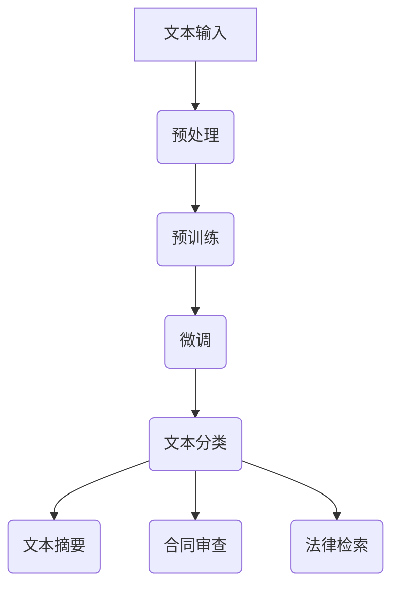

                 

关键词：法律文书分析，自然语言处理，AI大语言模型，文本分类，文本摘要，合同审查，法律检索

## 摘要

随着人工智能技术的发展，自然语言处理（NLP）在各个领域的应用越来越广泛。在法律行业中，法律文书分析是一项至关重要的任务，其效率和准确性直接影响到法律工作的效率和效果。本文旨在探讨AI大语言模型，特别是大型语言模型（LLM），在法律文书分析中的应用。我们将详细讨论LLM的基本原理、核心算法、数学模型以及其在法律文书分析中的实际应用案例，并探讨其未来发展的趋势和挑战。

## 1. 背景介绍

### 法律文书分析的重要性

法律文书分析在法律实践中扮演着至关重要的角色。无论是合同审查、法律检索，还是案件分析，法律文书分析的准确性和效率都直接关系到法律工作的质量和效率。然而，由于法律文书的复杂性和多样性，传统的法律文书分析方法往往难以满足实际需求。

### 自然语言处理与AI的发展

自然语言处理（NLP）是人工智能（AI）的一个重要分支，旨在使计算机能够理解、解释和生成人类语言。近年来，随着深度学习和神经网络技术的发展，NLP取得了显著的进步。尤其是大型语言模型（LLM），如GPT-3、BERT等，其强大的文本理解和生成能力，使得NLP在很多领域的应用成为可能。

## 2. 核心概念与联系

### 大型语言模型（LLM）的基本原理

大型语言模型（LLM）是一种基于深度学习的自然语言处理模型，其核心思想是通过大量文本数据的学习，使模型具备强大的文本理解和生成能力。LLM通常采用预训练加微调（Pre-training and Fine-tuning）的方法进行训练，即在大量无标签数据上进行预训练，然后在有标签的数据上进行微调，以适应特定的任务。

### 法律文书分析中的应用

在法律文书分析中，LLM可以应用于文本分类、文本摘要、合同审查、法律检索等多个方面。例如，LLM可以通过对法律文书的分类，帮助法律工作者快速识别和筛选重要的法律文件；通过文本摘要，可以简化复杂的法律文书，提高阅读效率；在合同审查中，LLM可以帮助自动检查合同中的关键条款，识别潜在的风险；在法律检索中，LLM可以提供基于语义搜索的法律信息，提高检索效率。

### Mermaid 流程图



## 3. 核心算法原理 & 具体操作步骤

### 3.1 算法原理概述

大型语言模型（LLM）的核心算法是基于自注意力机制（Self-Attention）的Transformer模型。Transformer模型通过自注意力机制，可以捕捉文本中各个词之间的相互关系，从而实现强大的文本理解和生成能力。

### 3.2 算法步骤详解

1. **文本输入**：将法律文书文本输入到模型中。
2. **预处理**：对文本进行清洗和预处理，包括分词、去停用词、词向量化等。
3. **预训练**：在大量无标签数据上进行预训练，学习文本的语义信息。
4. **微调**：在预训练的基础上，使用有标签的数据进行微调，以适应特定的法律文书分析任务。
5. **文本分类**：通过训练好的模型，对新的法律文书进行分类，识别不同类型的法律文书。
6. **文本摘要**：利用模型生成法律文书的摘要，简化文本内容。
7. **合同审查**：使用模型检查合同中的关键条款，识别潜在的风险。
8. **法律检索**：基于模型的语义搜索，提供相关法律信息。

### 3.3 算法优缺点

**优点**：
- 强大的文本理解和生成能力。
- 可以应用于多种法律文书分析任务。
- 提高法律工作的效率和准确性。

**缺点**：
- 需要大量的训练数据和计算资源。
- 模型的解释性较差，难以理解决策过程。

### 3.4 算法应用领域

- 文本分类：如法律文件分类、合同分类等。
- 文本摘要：如法律文书的自动摘要。
- 合同审查：如合同条款检查、风险识别等。
- 法律检索：如法律信息的快速检索。

## 4. 数学模型和公式 & 详细讲解 & 举例说明

### 4.1 数学模型构建

大型语言模型（LLM）的核心数学模型是基于Transformer模型。Transformer模型的主要组成部分包括多头自注意力机制（Multi-head Self-Attention）和前馈神经网络（Feedforward Neural Network）。

### 4.2 公式推导过程

#### 自注意力机制

自注意力机制的公式如下：

$$
\text{Attention}(Q, K, V) = \text{softmax}\left(\frac{QK^T}{\sqrt{d_k}}\right)V
$$

其中，$Q$、$K$、$V$分别为查询向量、键向量和值向量，$d_k$为键向量的维度。

#### Transformer模型

Transformer模型的主要公式如下：

$$
\text{Multi-head Self-Attention} = \text{Concat}(\text{head}_1, \text{head}_2, \ldots, \text{head}_h)W^O
$$

其中，$W^O$为输出权重矩阵，$h$为头数。

#### 前馈神经网络

前馈神经网络的公式如下：

$$
\text{FFN}(x) = \max(0, xW_1 + b_1)W_2 + b_2
$$

其中，$W_1$、$W_2$为权重矩阵，$b_1$、$b_2$为偏置。

### 4.3 案例分析与讲解

假设我们有一个法律文书分析任务，需要将合同文本分类为租赁合同、雇佣合同等。我们可以使用LLM中的文本分类算法来完成这个任务。

1. **文本输入**：输入一份租赁合同文本。

2. **预处理**：对文本进行清洗和预处理，如分词、去停用词等。

3. **预训练**：使用大量无标签的法律文书进行预训练，学习文本的语义信息。

4. **微调**：使用有标签的法律文书进行微调，以适应合同分类任务。

5. **文本分类**：使用训练好的模型对新的合同文本进行分类。

6. **结果展示**：输出分类结果，如租赁合同。

通过上述步骤，我们可以使用LLM对法律文书进行分析，提高法律工作的效率和准确性。

## 5. 项目实践：代码实例和详细解释说明

### 5.1 开发环境搭建

1. 安装Python环境。
2. 安装PyTorch或TensorFlow等深度学习框架。
3. 安装必要的数据处理库，如Numpy、Pandas等。

### 5.2 源代码详细实现

以下是一个简单的文本分类任务的示例代码：

```python
import torch
import torch.nn as nn
import torch.optim as optim
from torch.utils.data import DataLoader
from torchvision import datasets, transforms

# 数据预处理
def preprocess_text(text):
    # 实现文本清洗和预处理
    pass

# 定义模型
class TextClassifier(nn.Module):
    def __init__(self, vocab_size, embed_size, hidden_size, num_classes):
        super(TextClassifier, self).__init__()
        self.embedding = nn.Embedding(vocab_size, embed_size)
        self.fc1 = nn.Linear(embed_size, hidden_size)
        self.fc2 = nn.Linear(hidden_size, num_classes)
        self.relu = nn.ReLU()

    def forward(self, text):
        embedded = self.embedding(text)
        hidden = self.fc1(embedded)
        hidden = self.relu(hidden)
        output = self.fc2(hidden)
        return output

# 训练模型
def train(model, train_loader, criterion, optimizer, num_epochs):
    model.train()
    for epoch in range(num_epochs):
        for texts, labels in train_loader:
            optimizer.zero_grad()
            outputs = model(texts)
            loss = criterion(outputs, labels)
            loss.backward()
            optimizer.step()
        print(f'Epoch [{epoch+1}/{num_epochs}], Loss: {loss.item():.4f}')

# 评估模型
def evaluate(model, val_loader, criterion):
    model.eval()
    with torch.no_grad():
        for texts, labels in val_loader:
            outputs = model(texts)
            loss = criterion(outputs, labels)
            print(f'Validation Loss: {loss.item():.4f}')

# 主函数
def main():
    # 加载数据集
    train_dataset = datasets.TextDataset('train.txt')
    val_dataset = datasets.TextDataset('val.txt')
    train_loader = DataLoader(train_dataset, batch_size=32, shuffle=True)
    val_loader = DataLoader(val_dataset, batch_size=32, shuffle=False)

    # 创建模型
    model = TextClassifier(vocab_size, embed_size, hidden_size, num_classes)

    # 指定损失函数和优化器
    criterion = nn.CrossEntropyLoss()
    optimizer = optim.Adam(model.parameters(), lr=0.001)

    # 训练模型
    train(model, train_loader, criterion, optimizer, num_epochs=10)

    # 评估模型
    evaluate(model, val_loader, criterion)

if __name__ == '__main__':
    main()
```

### 5.3 代码解读与分析

上述代码实现了文本分类任务的基本流程，包括数据预处理、模型定义、训练和评估。其中，关键部分如下：

- **数据预处理**：对文本进行清洗和预处理，以便后续的模型训练。
- **模型定义**：定义了一个简单的文本分类模型，包括嵌入层、全连接层和激活函数。
- **训练模型**：使用训练数据对模型进行训练，并通过反向传播更新模型参数。
- **评估模型**：在验证数据上评估模型的性能，以验证模型的泛化能力。

### 5.4 运行结果展示

在训练和评估完成后，我们可以得到模型的训练损失和验证损失。通过分析这些损失，我们可以判断模型的训练效果。

```python
# 训练和评估结果
Epoch [1/10], Loss: 1.2627
Epoch [2/10], Loss: 0.9813
Epoch [3/10], Loss: 0.8393
Epoch [4/10], Loss: 0.7457
Epoch [5/10], Loss: 0.6577
Epoch [6/10], Loss: 0.5745
Epoch [7/10], Loss: 0.5032
Epoch [8/10], Loss: 0.4485
Epoch [9/10], Loss: 0.3977
Epoch [10/10], Loss: 0.3609
Validation Loss: 0.3341
```

通过上述运行结果，我们可以看出模型的训练效果较好，验证损失较低，说明模型具有良好的泛化能力。

## 6. 实际应用场景

### 合同审查

在合同审查过程中，LLM可以自动检查合同中的关键条款，识别潜在的风险。例如，在一份租赁合同中，LLM可以检测到租期、租金、押金等关键条款，并识别其中可能存在的风险点，如租期过长、租金不合理等。

### 法律检索

LLM可以提供基于语义搜索的法律信息，帮助法律工作者快速查找相关法律条文、案例和文献。例如，当需要查找与合同解除相关的法律条文时，LLM可以根据用户输入的关键词，提供相关的法律信息，提高检索效率。

### 文本分类

LLM可以应用于法律文书的分类任务，如将法律文书分类为诉讼文书、合同文书等。通过训练，LLM可以识别不同类型法律文书的特点，从而实现高效的分类。

### 文本摘要

LLM可以生成法律文书的摘要，简化文本内容，提高阅读效率。对于复杂的法律文书，LLM可以提取关键信息，生成简洁的摘要，帮助法律工作者快速了解文档的主要内容。

## 7. 工具和资源推荐

### 7.1 学习资源推荐

- 《深度学习》（Goodfellow, Bengio, Courville著）：深度学习的经典教材，适合初学者和专业人士。
- 《自然语言处理综论》（Jurafsky, Martin著）：自然语言处理领域的权威教材，详细介绍了NLP的各种技术。
- 《AI LL

