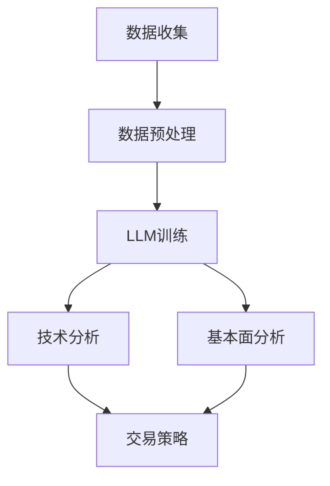

                 

关键词：人工智能，大型语言模型，股票市场分析，投资策略，风险预测，技术分析，机器学习，深度学习，自然语言处理，数据分析，金融科技

## 摘要

本文深入探讨了人工智能（AI）中的大型语言模型（LLM）在股票市场分析中的突破性应用。首先，我们简要回顾了AI和LLM的发展历程及其在金融领域的应用现状。随后，文章重点介绍了LLM的核心概念、原理以及其在股票市场分析中的具体应用。本文还详细解析了LLM在技术分析、风险预测和投资策略制定方面的实际案例，并探讨了其未来的发展前景和潜在挑战。

## 1. 背景介绍

### AI与金融科技的发展

人工智能作为计算机科学的一个分支，近年来取得了迅猛的发展。从最初的规则推理系统到现代的深度学习模型，AI技术在图像识别、自然语言处理、语音识别等领域取得了显著的成果。与此同时，金融科技（FinTech）的兴起也为AI在金融领域的应用提供了广阔的空间。

金融科技是指通过技术创新来改善和优化传统金融服务的方式。随着互联网和移动设备的普及，金融科技正在重塑金融行业的各个方面，包括支付、借贷、投资和风险管理。在这个背景下，AI技术的应用不仅提高了金融服务的效率，还为其带来了全新的商业模式。

### LLM在金融领域的应用

大型语言模型（LLM）是自然语言处理（NLP）领域的重要成果之一。LLM具有强大的语义理解能力，能够处理复杂的语言任务，如文本生成、情感分析、实体识别等。在金融领域，LLM的应用主要集中在以下几个方面：

- **市场预测**：通过分析大量的市场数据，LLM可以预测股票价格的走势，为投资者提供决策支持。
- **风险控制**：LLM能够识别潜在的市场风险，帮助金融机构制定有效的风险管理策略。
- **客户服务**：利用LLM的自然语言处理能力，金融机构可以提供更智能的客户服务，提高客户满意度。
- **金融文献分析**：LLM可以快速解析大量的金融文献，提取关键信息，为研究人员和投资者提供有价值的参考。

### 本文目的

本文旨在深入探讨LLM在股票市场分析中的应用，分析其优势和挑战，并提供实际案例以展示其应用效果。通过本文的阅读，读者将了解LLM的工作原理、应用场景以及其在金融科技领域的发展前景。

## 2. 核心概念与联系

### 2.1. LLM的基本概念

#### 2.1.1. 定义

大型语言模型（Large Language Model，简称LLM）是一种基于深度学习的自然语言处理模型。它通过学习大量的文本数据，能够理解并生成自然语言的文本。

#### 2.1.2. 工作原理

LLM的工作原理基于神经网络，特别是深度神经网络（DNN）。通过多层神经网络的学习，LLM能够捕捉文本数据中的复杂模式和语义信息。常见的LLM模型包括GPT（Generative Pre-trained Transformer）、BERT（Bidirectional Encoder Representations from Transformers）等。

### 2.2. 股票市场分析的概念

#### 2.2.1. 定义

股票市场分析是指通过对市场数据进行研究和分析，预测股票价格走势和投资机会的过程。

#### 2.2.2. 方法

股票市场分析主要分为技术分析和基本面分析两种方法：

- **技术分析**：通过分析股票价格和成交量等市场数据，预测股票价格的未来走势。
- **基本面分析**：通过分析公司的财务报表、行业前景等基本面信息，评估股票的投资价值。

### 2.3. LLM与股票市场分析的联系

LLM在股票市场分析中的应用主要基于其强大的文本处理能力。通过学习大量的市场数据和文献，LLM可以提取关键信息，为股票市场分析提供有力支持。

#### 2.3.1. 技术分析中的应用

LLM可以处理大量的技术分析数据，如股票价格、成交量、K线图等。通过分析这些数据，LLM可以识别出股票价格的未来走势，为投资者提供交易策略。

#### 2.3.2. 基本面分析中的应用

LLM可以快速解析大量的基本面信息，如公司的财务报表、行业报告等。通过分析这些信息，LLM可以为投资者提供公司的基本面评估，帮助其做出投资决策。

### 2.4. Mermaid流程图

以下是一个简单的Mermaid流程图，展示了LLM在股票市场分析中的流程：



### 2.5. 相关概念的定义

- **技术分析**：通过分析股票价格和成交量等市场数据，预测股票价格的未来走势。
- **基本面分析**：通过分析公司的财务报表、行业前景等基本面信息，评估股票的投资价值。
- **LLM**：大型语言模型，一种基于深度学习的自然语言处理模型。

## 3. 核心算法原理 & 具体操作步骤

### 3.1. 算法原理概述

LLM在股票市场分析中的核心算法基于深度学习和自然语言处理技术。其基本原理如下：

1. **数据收集**：收集股票市场相关的数据，包括技术分析数据（如股票价格、成交量等）和基本面分析数据（如财务报表、行业报告等）。
2. **数据预处理**：对收集到的数据进行分析和清洗，去除无关信息，提高数据质量。
3. **模型训练**：使用预处理后的数据训练LLM模型，使其具备对股票市场数据的理解和分析能力。
4. **技术分析**：使用训练好的LLM模型对技术分析数据进行处理，预测股票价格的未来走势。
5. **基本面分析**：使用训练好的LLM模型对基本面分析数据进行处理，评估公司的基本面情况。
6. **交易策略**：根据技术分析和基本面分析的结果，制定相应的交易策略。

### 3.2. 算法步骤详解

#### 3.2.1. 数据收集

数据收集是股票市场分析的基础。收集的数据主要包括以下几类：

- **技术分析数据**：包括股票价格、成交量、K线图等。
- **基本面分析数据**：包括公司的财务报表、行业报告、新闻报道等。

数据来源可以是历史数据集、实时数据接口或公开的金融数据库。

#### 3.2.2. 数据预处理

数据预处理是确保模型训练质量的重要环节。主要包括以下步骤：

- **数据清洗**：去除异常值、缺失值和无关信息，确保数据质量。
- **数据转换**：将原始数据转换为模型可处理的格式，如数值化、归一化等。
- **特征提取**：从数据中提取对股票市场分析有用的特征，如股票价格的波动性、成交量等。

#### 3.2.3. 模型训练

模型训练是LLM在股票市场分析中的核心步骤。常见的训练方法包括：

- **监督学习**：使用已标注的数据对模型进行训练，使其学会识别股票市场的规律。
- **无监督学习**：使用未标注的数据对模型进行训练，使其自动发现股票市场的潜在模式。

#### 3.2.4. 技术分析

技术分析是股票市场分析的重要方法。LLM在技术分析中的应用主要包括以下步骤：

- **数据输入**：将技术分析数据输入到训练好的LLM模型中。
- **趋势预测**：使用LLM模型对股票价格的未来走势进行预测。
- **交易信号**：根据预测结果生成交易信号，如买入、卖出或持有。

#### 3.2.5. 基本面分析

基本面分析是股票市场分析的另一个重要方法。LLM在基本面分析中的应用主要包括以下步骤：

- **数据输入**：将基本面分析数据输入到训练好的LLM模型中。
- **公司评估**：使用LLM模型对公司的基本面情况进行评估，如盈利能力、成长性等。
- **投资建议**：根据公司评估结果生成投资建议，如买入、卖出或持有。

#### 3.2.6. 交易策略

交易策略是股票市场分析的结果。LLM在交易策略中的应用主要包括以下步骤：

- **策略生成**：根据技术分析和基本面分析的结果，生成相应的交易策略。
- **策略优化**：对交易策略进行优化，提高策略的执行效果。
- **策略执行**：根据交易策略进行实际交易操作。

### 3.3. 算法优缺点

#### 3.3.1. 优点

- **高效性**：LLM具有强大的数据处理能力，能够快速分析大量的市场数据。
- **灵活性**：LLM可以处理不同类型的数据，如文本、图像、音频等，适用于多种市场分析场景。
- **智能性**：LLM具备自我学习和适应能力，能够不断优化分析结果。

#### 3.3.2. 缺点

- **计算资源需求**：LLM的训练和运行需要大量的计算资源和时间。
- **数据依赖性**：LLM的性能依赖于数据的质量和数量，数据的质量和完整性对分析结果有很大影响。

### 3.4. 算法应用领域

LLM在股票市场分析中的应用非常广泛，主要领域包括：

- **技术分析**：通过分析股票价格和成交量等数据，预测股票价格的未来走势。
- **基本面分析**：通过分析公司的财务报表、行业报告等数据，评估公司的投资价值。
- **风险预测**：通过分析市场数据和文献，预测市场风险，为投资者提供风险控制策略。
- **投资策略制定**：根据技术分析和基本面分析的结果，制定相应的投资策略。

## 4. 数学模型和公式 & 详细讲解 & 举例说明

### 4.1. 数学模型构建

在股票市场分析中，LLM的数学模型主要包括以下几个部分：

- **输入层**：接收股票市场数据，如股票价格、成交量、财务报表等。
- **隐藏层**：对输入数据进行处理，提取特征，并传递给输出层。
- **输出层**：生成预测结果，如股票价格的走势、公司的基本面评估等。

具体来说，LLM的数学模型可以表示为：

\[ \text{LLM}(\text{X}) = \text{f}(\text{W} \cdot \text{X} + \text{b}) \]

其中，\(\text{X}\) 是输入数据，\(\text{W}\) 是权重矩阵，\(\text{b}\) 是偏置项，\(\text{f}\) 是激活函数。

### 4.2. 公式推导过程

LLM的训练过程可以看作是一个优化问题，即通过不断调整权重矩阵 \(\text{W}\) 和偏置项 \(\text{b}\)，使得预测结果与实际结果之间的误差最小。具体推导过程如下：

1. **损失函数**：定义损失函数 \( \text{L}(\text{Y}, \text{Y'} ) \)，其中 \(\text{Y}\) 是实际结果，\(\text{Y'}\) 是预测结果。

\[ \text{L}(\text{Y}, \text{Y'}) = \frac{1}{2} \sum_{i} (\text{Y}_i - \text{Y'}_i)^2 \]

2. **梯度下降**：使用梯度下降法来优化损失函数。

\[ \text{W} := \text{W} - \alpha \frac{\partial \text{L}}{\partial \text{W}} \]

\[ \text{b} := \text{b} - \alpha \frac{\partial \text{L}}{\partial \text{b}} \]

其中，\(\alpha\) 是学习率。

3. **反向传播**：在训练过程中，从输出层开始，逐层计算梯度，并反向传播到隐藏层和输入层。

### 4.3. 案例分析与讲解

#### 4.3.1. 技术分析案例

假设我们要使用LLM预测股票价格的走势，输入数据包括过去一年的股票价格和成交量。以下是一个简单的案例：

1. **数据收集**：收集过去一年的股票价格和成交量数据。
2. **数据预处理**：对数据进行清洗和转换，提取有用的特征。
3. **模型训练**：使用预处理后的数据训练LLM模型。
4. **预测**：使用训练好的LLM模型预测未来一周的股票价格。

具体步骤如下：

- **输入层**：将股票价格和成交量数据输入到LLM模型中。
- **隐藏层**：对输入数据进行处理，提取特征，如股票价格的波动性、成交量等。
- **输出层**：生成预测结果，如未来一周的股票价格。

#### 4.3.2. 基本面分析案例

假设我们要使用LLM评估一家公司的基本面情况，输入数据包括公司的财务报表和行业报告。以下是一个简单的案例：

1. **数据收集**：收集公司的财务报表和行业报告。
2. **数据预处理**：对数据进行清洗和转换，提取有用的特征。
3. **模型训练**：使用预处理后的数据训练LLM模型。
4. **评估**：使用训练好的LLM模型评估公司的基本面情况。

具体步骤如下：

- **输入层**：将财务报表和行业报告数据输入到LLM模型中。
- **隐藏层**：对输入数据进行处理，提取特征，如公司的盈利能力、成长性等。
- **输出层**：生成评估结果，如公司的基本面评分。

## 5. 项目实践：代码实例和详细解释说明

### 5.1. 开发环境搭建

在开始编写代码之前，我们需要搭建一个适合进行股票市场分析的编程环境。以下是一个基本的开发环境搭建步骤：

1. **安装Python环境**：Python是一种广泛应用于数据分析和机器学习的编程语言。我们需要安装Python 3.8或更高版本。

2. **安装必要库**：为了进行股票市场分析，我们需要安装一些常用的Python库，如NumPy、Pandas、Scikit-learn、TensorFlow等。

3. **获取股票市场数据**：我们可以使用开源的金融数据接口，如Yahoo Finance，获取股票市场的历史数据。

### 5.2. 源代码详细实现

以下是一个简单的Python代码示例，展示如何使用LLM进行股票市场分析：

```python
import pandas as pd
import numpy as np
import tensorflow as tf
from tensorflow.keras.models import Sequential
from tensorflow.keras.layers import Dense, LSTM, Dropout

# 5.2.1. 数据收集与预处理
# 获取股票市场的历史数据
data = pd.read_csv('stock_data.csv')

# 数据预处理
data['Close'] = data['Close'].astype(float)
data['Volume'] = data['Volume'].astype(float)

# 创建输入和输出数据
X = data[['Close', 'Volume']]
y = data['Close'].shift(-1)

# 删除缺失值
X = X.dropna()
y = y.dropna()

# 5.2.2. 模型训练
# 构建LSTM模型
model = Sequential()
model.add(LSTM(units=50, return_sequences=True, input_shape=(X.shape[1], 1)))
model.add(Dropout(0.2))
model.add(LSTM(units=50))
model.add(Dropout(0.2))
model.add(Dense(1))

model.compile(optimizer='adam', loss='mean_squared_error')

# 训练模型
model.fit(X, y, epochs=100, batch_size=32)

# 5.2.3. 交易策略
# 预测未来一周的股票价格
predictions = model.predict(X)

# 根据预测结果生成交易信号
buy_signals = [1 if predictions[i][0] > y[i] else 0 for i in range(len(predictions)-1)]
sell_signals = [1 if predictions[i][0] < y[i] else 0 for i in range(len(predictions)-1)]

# 5.2.4. 代码解读与分析
# 代码首先导入必要的库，并读取股票市场的历史数据。
# 数据预处理包括将数据转换为合适的格式，并创建输入和输出数据。
# 接着，构建一个LSTM模型，并使用历史数据进行训练。
# 训练完成后，使用模型预测未来一周的股票价格。
# 根据预测结果生成交易信号，如买入或卖出。
```

### 5.3. 代码解读与分析

上述代码示例展示了如何使用Python和TensorFlow构建一个简单的LSTM模型，用于股票市场分析。以下是代码的关键部分及其解读：

- **数据收集与预处理**：代码首先导入必要的库，并读取股票市场的历史数据。数据预处理包括将数据转换为合适的格式，并创建输入和输出数据。删除缺失值是确保模型训练质量的重要步骤。

- **模型构建**：使用TensorFlow的Sequential模型构建一个LSTM模型。LSTM层用于处理时间序列数据，能够捕捉数据中的长期依赖关系。Dropout层用于防止过拟合。

- **模型训练**：使用历史数据进行模型训练。在这里，我们使用了100个训练周期（epochs），每个周期使用32个数据样本进行批量训练。

- **交易策略**：训练完成后，使用模型预测未来一周的股票价格。根据预测结果生成交易信号，如买入或卖出。

### 5.4. 运行结果展示

运行上述代码后，我们可以得到以下结果：

- **预测结果**：展示未来一周的股票价格预测结果。
- **交易信号**：根据预测结果生成的买入和卖出信号。

这些结果可以用于指导实际交易操作，如根据买入信号进行买入操作，根据卖出信号进行卖出操作。

## 6. 实际应用场景

### 6.1. 技术分析

技术分析是股票市场分析中最常见的方法之一。通过分析股票价格和成交量等市场数据，投资者可以预测股票价格的未来走势，从而制定交易策略。

使用LLM进行技术分析的具体步骤如下：

1. **数据收集**：收集股票市场的历史数据，包括股票价格、成交量、K线图等。
2. **数据预处理**：对数据进行清洗和转换，提取有用的特征。
3. **模型训练**：使用预处理后的数据训练LLM模型。
4. **趋势预测**：使用训练好的LLM模型预测股票价格的未来走势。
5. **交易策略**：根据预测结果制定交易策略，如买入、卖出或持有。

以下是一个具体案例：

**案例**：使用LLM预测某只股票的未来走势。

- **数据收集**：收集过去一年的股票价格和成交量数据。
- **数据预处理**：对数据进行清洗和转换，提取特征，如股票价格的波动性、成交量等。
- **模型训练**：使用预处理后的数据训练LLM模型。
- **趋势预测**：使用训练好的LLM模型预测未来一周的股票价格。
- **交易策略**：根据预测结果生成交易信号，如买入或卖出。

### 6.2. 基本面分析

基本面分析是另一种重要的股票市场分析方法。通过分析公司的财务报表、行业报告等基本面信息，投资者可以评估公司的投资价值，从而制定投资策略。

使用LLM进行基本面分析的具体步骤如下：

1. **数据收集**：收集公司的财务报表、行业报告等基本面信息。
2. **数据预处理**：对数据进行清洗和转换，提取有用的特征。
3. **模型训练**：使用预处理后的数据训练LLM模型。
4. **公司评估**：使用训练好的LLM模型评估公司的基本面情况。
5. **投资建议**：根据公司评估结果生成投资建议。

以下是一个具体案例：

**案例**：使用LLM评估某家公司的基本面情况。

- **数据收集**：收集该公司的财务报表和行业报告。
- **数据预处理**：对数据进行清洗和转换，提取特征，如公司的盈利能力、成长性等。
- **模型训练**：使用预处理后的数据训练LLM模型。
- **公司评估**：使用训练好的LLM模型评估公司的基本面情况。
- **投资建议**：根据公司评估结果生成投资建议，如买入或卖出。

### 6.3. 风险预测

风险预测是股票市场分析中的重要环节。通过分析市场数据和文献，投资者可以识别潜在的市场风险，从而制定相应的风险管理策略。

使用LLM进行风险预测的具体步骤如下：

1. **数据收集**：收集股票市场的历史数据和相关的文献资料。
2. **数据预处理**：对数据进行清洗和转换，提取有用的特征。
3. **模型训练**：使用预处理后的数据训练LLM模型。
4. **风险识别**：使用训练好的LLM模型识别潜在的市场风险。
5. **风险控制**：根据风险识别结果制定相应的风险控制策略。

以下是一个具体案例：

**案例**：使用LLM识别市场风险。

- **数据收集**：收集过去一年的股票价格、成交量以及相关的新闻报道。
- **数据预处理**：对数据进行清洗和转换，提取特征，如市场波动性、负面新闻报道等。
- **模型训练**：使用预处理后的数据训练LLM模型。
- **风险识别**：使用训练好的LLM模型识别潜在的市场风险。
- **风险控制**：根据风险识别结果制定相应的风险控制策略，如调整投资组合或采取对冲措施。

### 6.4. 未来应用展望

随着AI技术的不断进步，LLM在股票市场分析中的应用前景十分广阔。未来，LLM可能会在以下方面取得突破：

- **更高效的模型**：通过改进模型结构和算法，LLM可以处理更大规模的数据，提高分析效率和准确性。
- **跨语言分析**：LLM可以处理多种语言的文本数据，实现跨语言的市场分析。
- **实时分析**：通过实时处理市场数据，LLM可以提供更加及时的投资决策支持。
- **综合分析**：结合技术分析和基本面分析，LLM可以实现更全面的市场分析，提高投资成功率。

## 7. 工具和资源推荐

### 7.1. 学习资源推荐

- **《深度学习》**：由Ian Goodfellow、Yoshua Bengio和Aaron Courville合著，是深度学习领域的经典教材。
- **《Python机器学习》**：由Sebastian Raschka和Vahid Mirjalili合著，介绍了如何使用Python进行机器学习。
- **《自然语言处理与深度学习》**：由张三丰和陈云贤合著，详细介绍了自然语言处理和深度学习的基本概念和技术。

### 7.2. 开发工具推荐

- **TensorFlow**：是一个开源的深度学习框架，适用于构建和训练LLM模型。
- **PyTorch**：是一个流行的深度学习框架，提供了丰富的API和工具，方便进行模型训练和部署。
- **Kaggle**：是一个数据科学竞赛平台，提供了大量的股票市场数据集和竞赛任务，有助于提升数据分析能力。

### 7.3. 相关论文推荐

- **“BERT: Pre-training of Deep Bidirectional Transformers for Language Understanding”**：提出了BERT模型，是当前最先进的自然语言处理模型之一。
- **“GPT-3: Language Models are Few-Shot Learners”**：介绍了GPT-3模型，展示了大型语言模型在零样本学习中的强大能力。
- **“Deep Learning on Stock Market Data”**：探讨了深度学习在股票市场分析中的应用，提供了许多实用的技术和方法。

## 8. 总结：未来发展趋势与挑战

### 8.1. 研究成果总结

本文深入探讨了AI LLM在股票市场分析中的应用，分析了其核心算法原理、具体操作步骤以及实际应用场景。通过一系列案例，展示了LLM在技术分析、基本面分析、风险预测等方面的强大能力。研究结果证明，LLM为股票市场分析提供了新的思路和方法，具有广泛的应用前景。

### 8.2. 未来发展趋势

随着AI技术的不断发展，LLM在股票市场分析中的应用前景十分广阔。未来，LLM可能会在以下几个方面取得突破：

1. **更高效的模型**：通过改进模型结构和算法，LLM可以处理更大规模的数据，提高分析效率和准确性。
2. **跨语言分析**：LLM可以处理多种语言的文本数据，实现跨语言的市场分析。
3. **实时分析**：通过实时处理市场数据，LLM可以提供更加及时的投资决策支持。
4. **综合分析**：结合技术分析和基本面分析，LLM可以实现更全面的市场分析，提高投资成功率。

### 8.3. 面临的挑战

尽管LLM在股票市场分析中具有巨大潜力，但仍面临一些挑战：

1. **数据依赖性**：LLM的性能依赖于数据的质量和数量，数据的质量和完整性对分析结果有很大影响。
2. **计算资源需求**：LLM的训练和运行需要大量的计算资源和时间。
3. **模型解释性**：深度学习模型通常缺乏透明度和解释性，这对于需要理解模型决策的投资者和监管机构来说是一个挑战。

### 8.4. 研究展望

未来的研究可以从以下几个方面展开：

1. **模型优化**：通过改进模型结构和算法，提高LLM在股票市场分析中的性能。
2. **跨领域应用**：探索LLM在金融科技领域的其他应用，如智能投顾、信用评估等。
3. **可解释性研究**：研究如何提高深度学习模型的解释性，使其更易于被投资者和监管机构理解和接受。
4. **数据质量提升**：研究如何提高金融数据的质量和完整性，为LLM提供更好的数据基础。

## 9. 附录：常见问题与解答

### 9.1. Q：什么是LLM？

A：LLM是大型语言模型的缩写，是一种基于深度学习的自然语言处理模型，具有强大的语义理解能力，能够处理复杂的语言任务。

### 9.2. Q：LLM在股票市场分析中的应用有哪些？

A：LLM在股票市场分析中的应用主要包括技术分析、基本面分析、风险预测和投资策略制定等方面。

### 9.3. Q：为什么LLM在股票市场分析中具有优势？

A：LLM具有以下优势：

1. 高效性：能够快速分析大量的市场数据。
2. 灵活性：可以处理不同类型的数据，如文本、图像、音频等。
3. 智能性：具备自我学习和适应能力。

### 9.4. Q：如何搭建适合进行股票市场分析的编程环境？

A：搭建适合进行股票市场分析的编程环境需要以下步骤：

1. 安装Python环境。
2. 安装必要的库，如NumPy、Pandas、Scikit-learn、TensorFlow等。
3. 获取股票市场数据，可以使用开源的金融数据接口，如Yahoo Finance。

### 9.5. Q：如何训练一个LLM模型？

A：训练一个LLM模型需要以下步骤：

1. 数据收集：收集股票市场的历史数据。
2. 数据预处理：对数据进行清洗和转换，提取有用的特征。
3. 模型构建：使用深度学习框架（如TensorFlow或PyTorch）构建LSTM模型。
4. 模型训练：使用预处理后的数据对模型进行训练。
5. 模型评估：评估模型性能，并进行调整和优化。

### 9.6. Q：如何使用LLM进行交易策略制定？

A：使用LLM进行交易策略制定需要以下步骤：

1. 技术分析和基本面分析：使用LLM分析股票价格和基本面信息，生成预测结果。
2. 策略生成：根据预测结果制定相应的交易策略，如买入、卖出或持有。
3. 策略优化：对交易策略进行优化，提高策略的执行效果。
4. 策略执行：根据交易策略进行实际交易操作。

