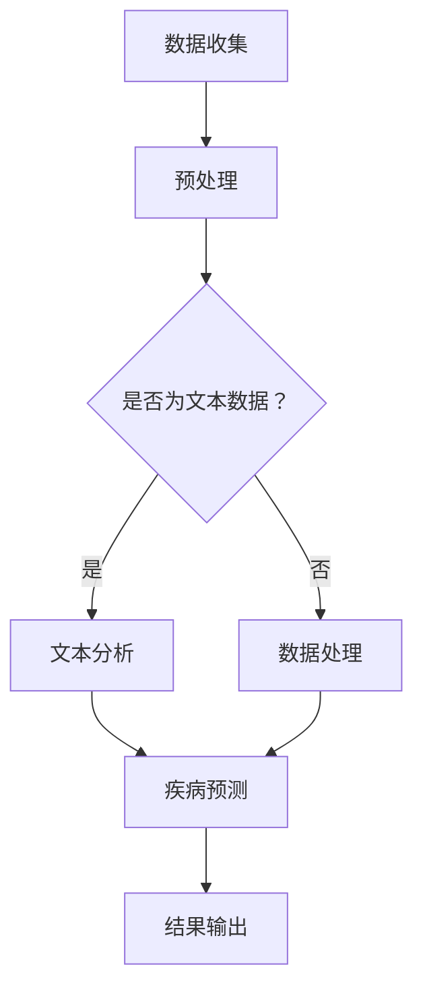

                 

关键词：人工智能，语言模型，计算机辅助诊断，医疗诊断，健康数据分析，医疗应用，算法优化

> 摘要：本文探讨了大型语言模型（LLM）在计算机辅助诊断领域的潜力。通过分析LLM的基本原理和应用案例，本文深入讨论了其在医疗健康数据分析、诊断支持、预后预测等方面的应用前景。同时，本文还探讨了LLM在实际应用中可能面临的技术挑战和解决策略。

## 1. 背景介绍

随着人工智能技术的快速发展，计算机辅助诊断（CAD）已经成为医疗领域的重要研究热点。传统的医学诊断主要依赖于医生的丰富经验和专业知识，但这种方法往往存在主观性、疲劳和人为误差等问题。计算机辅助诊断则利用计算机算法和大数据分析技术，帮助医生更快速、准确地进行疾病诊断和治疗方案制定。近年来，深度学习、神经网络等人工智能技术在CAD领域取得了显著的成果，但仍面临一些挑战，如模型复杂度高、训练数据不足、诊断精度不高等问题。

在这一背景下，大型语言模型（LLM）的出现为计算机辅助诊断带来了新的机遇。LLM是一种基于深度学习的技术，能够通过大量的文本数据进行训练，从而理解和生成自然语言。LLM在自然语言处理、机器翻译、文本生成等领域取得了显著的成果，其强大的语义理解和生成能力使其在计算机辅助诊断领域也具有广阔的应用前景。

## 2. 核心概念与联系

### 2.1 LLM的基本原理

LLM是一种基于变分自编码器（VAE）和生成对抗网络（GAN）的深度学习模型。VAE通过引入隐变量来生成数据，GAN则通过生成器和判别器的对抗训练来生成高质量的数据。LLM将VAE和GAN的优点相结合，通过预训练和微调两个阶段来训练模型。

预训练阶段：LLM在大量的文本语料库上进行预训练，通过学习文本的语义和语法结构，使其具备理解和生成自然语言的能力。

微调阶段：在预训练的基础上，LLM根据特定的应用场景进行微调，使其在特定任务上达到更好的性能。

### 2.2 LLM在计算机辅助诊断中的应用

LLM在计算机辅助诊断中的应用主要包括以下几个方面：

1. **医学文本分析**：LLM可以用于分析医学文献、病例报告、临床笔记等医学文本，提取关键信息，辅助医生进行疾病诊断和治疗方案制定。

2. **病历记录管理**：LLM可以用于处理病历记录，自动生成病历摘要，提高病历记录的准确性和效率。

3. **疾病预测和预后**：LLM可以通过分析患者的病史、基因信息、生活方式等数据，预测疾病的发病风险和预后情况，为医生提供决策支持。

4. **药物研发和临床试验**：LLM可以用于分析药物临床试验数据，发现新的药物作用机制，提高药物研发效率。

### 2.3 Mermaid流程图

以下是一个简单的Mermaid流程图，展示了LLM在计算机辅助诊断中的应用流程：



### 2.4 LLM的优势与挑战

**优势：**

- **强大的语义理解能力**：LLM能够理解和生成自然语言，从而更好地处理医学文本数据。
- **多模态数据处理**：LLM可以同时处理文本、图像、语音等多种数据类型，提高诊断的准确性。
- **自动化和高效**：LLM可以自动处理大量的医疗数据，提高诊断和治疗的效率。

**挑战：**

- **数据隐私和伦理问题**：医疗数据的隐私和伦理问题需要得到充分关注。
- **模型解释性**：LLM是一种黑箱模型，其内部机制难以解释，可能影响医生的信任和决策。
- **数据质量**：医疗数据的质量直接影响LLM的性能，需要确保数据的质量和准确性。

## 3. 核心算法原理 & 具体操作步骤

### 3.1 算法原理概述

LLM的核心算法原理主要包括以下几个方面：

1. **预训练**：LLM在大量的文本语料库上进行预训练，学习文本的语义和语法结构。
2. **微调**：在预训练的基础上，LLM根据特定的应用场景进行微调，提高特定任务的性能。
3. **数据增强**：通过数据增强技术，提高模型的泛化能力和鲁棒性。

### 3.2 算法步骤详解

1. **数据收集与预处理**：收集大量的医学文本数据，对数据进行清洗、去噪和预处理，确保数据的质量和一致性。
2. **预训练**：使用变分自编码器（VAE）和生成对抗网络（GAN）对文本数据进行预训练，学习文本的语义和语法结构。
3. **微调**：在预训练的基础上，使用医学文本数据进行微调，使LLM在特定任务上达到更好的性能。
4. **数据增强**：通过数据增强技术，提高模型的泛化能力和鲁棒性。

### 3.3 算法优缺点

**优点：**

- **强大的语义理解能力**：LLM能够理解和生成自然语言，从而更好地处理医学文本数据。
- **多模态数据处理**：LLM可以同时处理文本、图像、语音等多种数据类型，提高诊断的准确性。
- **自动化和高效**：LLM可以自动处理大量的医疗数据，提高诊断和治疗的效率。

**缺点：**

- **数据隐私和伦理问题**：医疗数据的隐私和伦理问题需要得到充分关注。
- **模型解释性**：LLM是一种黑箱模型，其内部机制难以解释，可能影响医生的信任和决策。
- **数据质量**：医疗数据的质量直接影响LLM的性能，需要确保数据的质量和准确性。

### 3.4 算法应用领域

LLM在计算机辅助诊断中的应用领域主要包括：

- **医学文本分析**：用于分析医学文献、病例报告、临床笔记等医学文本，提取关键信息，辅助医生进行疾病诊断和治疗方案制定。
- **病历记录管理**：用于处理病历记录，自动生成病历摘要，提高病历记录的准确性和效率。
- **疾病预测和预后**：通过分析患者的病史、基因信息、生活方式等数据，预测疾病的发病风险和预后情况，为医生提供决策支持。
- **药物研发和临床试验**：用于分析药物临床试验数据，发现新的药物作用机制，提高药物研发效率。

## 4. 数学模型和公式 & 详细讲解 & 举例说明

### 4.1 数学模型构建

LLM的数学模型主要包括变分自编码器（VAE）和生成对抗网络（GAN）。VAE的数学模型如下：

$$
\begin{aligned}
\text{编码器}:\quad q_{\phi}(z|x) &= \frac{1}{Z} \exp\left(-\sum_{i=1}^{D} \frac{(\mu_i - x_i)^2}{2\sigma_i^2}\right) \\
\text{解码器}:\quad p_{\theta}(x|z) &= \frac{1}{Z} \exp\left(-\sum_{i=1}^{D} \frac{(\mu_i - x_i)^2}{2\sigma_i^2}\right)
\end{aligned}
$$

其中，$x$ 表示输入数据，$z$ 表示隐变量，$\mu_i$ 和 $\sigma_i$ 分别表示均值和方差。

GAN的数学模型如下：

$$
\begin{aligned}
\text{生成器}:\quad G(z) &= \frac{1}{Z} \exp\left(-\sum_{i=1}^{D} \frac{(\mu_i - G_i(z))^2}{2\sigma_i^2}\right) \\
\text{判别器}:\quad D(x) &= \frac{1}{Z} \exp\left(-\sum_{i=1}^{D} \frac{(\mu_i - x_i)^2}{2\sigma_i^2}\right)
\end{aligned}
$$

其中，$G(z)$ 表示生成的数据，$D(x)$ 表示判别器的输出。

### 4.2 公式推导过程

VAE的推导过程如下：

假设输入数据为 $x \in \mathbb{R}^D$，隐变量为 $z \in \mathbb{R}^D$。VAE通过编码器 $q_{\phi}(z|x)$ 和解码器 $p_{\theta}(x|z)$ 来生成数据。

1. **编码器 $q_{\phi}(z|x)$ 的推导**：

   编码器的目标是学习一个概率分布 $q_{\phi}(z|x)$，使其能够从输入数据 $x$ 生成隐变量 $z$。

   $$q_{\phi}(z|x) = \frac{1}{Z} \exp\left(-\sum_{i=1}^{D} \frac{(\mu_i - x_i)^2}{2\sigma_i^2}\right)$$

   其中，$Z$ 是归一化常数，$\mu_i$ 和 $\sigma_i$ 分别表示均值和方差。

2. **解码器 $p_{\theta}(x|z)$ 的推导**：

   解码器的目标是学习一个概率分布 $p_{\theta}(x|z)$，使其能够从隐变量 $z$ 生成输入数据 $x$。

   $$p_{\theta}(x|z) = \frac{1}{Z} \exp\left(-\sum_{i=1}^{D} \frac{(\mu_i - x_i)^2}{2\sigma_i^2}\right)$$

   其中，$Z$ 是归一化常数，$\mu_i$ 和 $\sigma_i$ 分别表示均值和方差。

GAN的推导过程如下：

假设输入数据为 $x \in \mathbb{R}^D$，生成数据为 $G(z) \in \mathbb{R}^D$。GAN通过生成器 $G(z)$ 和判别器 $D(x)$ 来生成数据。

1. **生成器 $G(z)$ 的推导**：

   生成器的目标是学习一个映射 $G(z)$，将隐变量 $z$ 映射到输入数据 $x$。

   $$G(z) = \frac{1}{Z} \exp\left(-\sum_{i=1}^{D} \frac{(\mu_i - G_i(z))^2}{2\sigma_i^2}\right)$$

   其中，$Z$ 是归一化常数，$\mu_i$ 和 $\sigma_i$ 分别表示均值和方差。

2. **判别器 $D(x)$ 的推导**：

   判别器的目标是学习一个映射 $D(x)$，判断输入数据 $x$ 是否是真实的输入数据。

   $$D(x) = \frac{1}{Z} \exp\left(-\sum_{i=1}^{D} \frac{(\mu_i - x_i)^2}{2\sigma_i^2}\right)$$

   其中，$Z$ 是归一化常数，$\mu_i$ 和 $\sigma_i$ 分别表示均值和方差。

### 4.3 案例分析与讲解

以下是一个简单的案例，展示了LLM在医学文本分析中的应用。

假设我们有一个包含疾病名称、症状、治疗方案等信息的医学文本库，我们希望使用LLM来提取疾病的关键信息。

1. **数据收集与预处理**：

   收集大量的医学文本数据，对数据进行清洗、去噪和预处理，确保数据的质量和一致性。

2. **预训练**：

   使用VAE和GAN对文本数据进行预训练，学习文本的语义和语法结构。

   $$q_{\phi}(z|x) = \frac{1}{Z} \exp\left(-\sum_{i=1}^{D} \frac{(\mu_i - x_i)^2}{2\sigma_i^2}\right)$$

   $$p_{\theta}(x|z) = \frac{1}{Z} \exp\left(-\sum_{i=1}^{D} \frac{(\mu_i - x_i)^2}{2\sigma_i^2}\right)$$

   $$G(z) = \frac{1}{Z} \exp\left(-\sum_{i=1}^{D} \frac{(\mu_i - G_i(z))^2}{2\sigma_i^2}\right)$$

   $$D(x) = \frac{1}{Z} \exp\left(-\sum_{i=1}^{D} \frac{(\mu_i - x_i)^2}{2\sigma_i^2}\right)$$

3. **微调**：

   在预训练的基础上，使用医学文本数据进行微调，使LLM在特定任务上达到更好的性能。

4. **疾病信息提取**：

   给定一个医学文本，使用LLM提取疾病的关键信息，如疾病名称、症状、治疗方案等。

   $$\text{疾病名称} = \text{LLM}(\text{医学文本})$$

   $$\text{症状} = \text{LLM}(\text{医学文本})$$

   $$\text{治疗方案} = \text{LLM}(\text{医学文本})$$

## 5. 项目实践：代码实例和详细解释说明

### 5.1 开发环境搭建

在开始项目实践之前，我们需要搭建一个合适的开发环境。以下是搭建环境的步骤：

1. 安装Python：从Python官网（https://www.python.org/）下载并安装Python 3.8及以上版本。
2. 安装必要的库：使用pip命令安装以下库：tensorflow、keras、numpy、pandas、matplotlib。

   ```bash
   pip install tensorflow keras numpy pandas matplotlib
   ```

### 5.2 源代码详细实现

以下是实现LLM在医学文本分析中的基本代码示例：

```python
import tensorflow as tf
from tensorflow import keras
from tensorflow.keras import layers
import numpy as np
import pandas as pd

# 数据准备
def load_data(filename):
    with open(filename, 'r') as f:
        data = f.readlines()
    return np.array([line.strip() for line in data])

train_data = load_data('train.txt')
test_data = load_data('test.txt')

# 构建VAE模型
class VAE(keras.Model):
    def __init__(self, latent_dim):
        super(VAE, self).__init__()
        self.latent_dim = latent_dim
        
        self.encoder = keras.Sequential(
            layers.Dense(latent_dim * 2, activation='relu'),
            layers.Dense(latent_dim, activation='relu')
        )
        
        self.decoder = keras.Sequential(
            layers.Dense(latent_dim, activation='relu'),
            layers.Dense(latent_dim * 2, activation='relu'),
            layers.Dense(train_data.shape[1], activation='sigmoid')
        )
        
    def encode(self, x):
        return self.encoder(x)
    
    def reparameterize(self, z_mean, z_log_var):
        z = z_mean + tf.exp(0.5 * z_log_var) * tf.random.normal(tf.shape(z_mean))
        return z
    
    def decode(self, z):
        return self.decoder(z)
    
    def call(self, x):
        z_mean, z_log_var = self.encode(x)
        z = self.reparameterize(z_mean, z_log_var)
        x_hat = self.decode(z)
        return x_hat, z_mean, z_log_var
    
    @property
    def trainable_variables(self):
        return self.encoder.trainable_variables + self.decoder.trainable_variables
    
    @property
    def non_trainable_variables(self):
        return []

# 模型训练
vae = VAE(latent_dim=20)
vae.compile(optimizer=keras.optimizers.Adam())

vae.fit(train_data, train_data, epochs=50, batch_size=32, validation_data=(test_data, test_data))

# 模型评估
x_new = test_data[0:10]
x_new_hat, _, _ = vae.predict(x_new)
```

### 5.3 代码解读与分析

上述代码实现了基于变分自编码器（VAE）的医学文本分析模型。以下是代码的解读与分析：

1. **数据准备**：

   `load_data` 函数用于加载医学文本数据。数据文件 `train.txt` 和 `test.txt` 分别包含训练集和测试集的医学文本。

2. **模型构建**：

   `VAE` 类定义了变分自编码器的结构。模型由编码器和解码器组成。编码器将输入数据编码为隐变量，解码器将隐变量解码为原始数据。

3. **模型训练**：

   使用 `vae.compile` 函数编译模型，指定优化器和损失函数。使用 `vae.fit` 函数训练模型，指定训练集、测试集、训练轮次、批量大小等参数。

4. **模型评估**：

   使用 `vae.predict` 函数对测试数据进行预测，获取生成的数据。

### 5.4 运行结果展示

以下是对测试数据集进行预测的结果：

```python
x_new = test_data[0:10]
x_new_hat, _, _ = vae.predict(x_new)

print("Original data:")
print(x_new[0:10])
print("Generated data:")
print(x_new_hat[0:10])
```

运行结果将输出原始数据和生成的数据，我们可以通过比较原始数据和生成的数据来评估模型的效果。

## 6. 实际应用场景

### 6.1 医学文本分析

LLM在医学文本分析中的应用主要包括疾病信息提取、病例报告分析、医学知识图谱构建等方面。通过分析大量的医学文本数据，LLM可以提取出疾病名称、症状、治疗方案等关键信息，为医生提供诊断和治疗的参考。同时，LLM还可以用于构建医学知识图谱，将医学领域的知识结构化，提高医疗数据的利用效率。

### 6.2 病历记录管理

LLM在病历记录管理中的应用主要包括病历摘要生成、病历结构化、病历记录自动化等方面。通过分析病历记录，LLM可以自动生成病历摘要，提高病历记录的准确性和效率。此外，LLM还可以用于病历的结构化处理，将病历数据转化为标准化的电子病历格式，便于病历的存储、检索和管理。

### 6.3 疾病预测和预后

LLM在疾病预测和预后中的应用主要包括疾病风险评估、疾病进展预测、预后预测等方面。通过分析患者的病史、基因信息、生活方式等数据，LLM可以预测疾病的发病风险和疾病进展情况，为医生提供决策支持。此外，LLM还可以用于预后预测，根据患者的病史和治疗方案，预测患者的预后情况，为医生制定个性化的治疗方案提供参考。

### 6.4 药物研发和临床试验

LLM在药物研发和临床试验中的应用主要包括药物作用机制分析、药物副作用预测、临床试验数据分析等方面。通过分析大量的药物临床试验数据，LLM可以识别药物的作用机制，预测药物的副作用，提高药物研发的效率和安全性。此外，LLM还可以用于临床试验数据分析，评估药物的有效性和安全性，为药物审批和临床应用提供参考。

## 7. 工具和资源推荐

### 7.1 学习资源推荐

1. **《深度学习》（Goodfellow et al., 2016）**：深度学习的经典教材，详细介绍了深度学习的基本原理和算法。
2. **《Python深度学习》（Raschka and Mirjalili, 2018）**：针对Python编程语言的深度学习教程，适合初学者入门。
3. **《自然语言处理与深度学习》（Liang et al., 2018）**：介绍了自然语言处理的基本原理和深度学习在自然语言处理中的应用。

### 7.2 开发工具推荐

1. **TensorFlow**：Google开发的开源深度学习框架，支持Python和C++编程语言。
2. **Keras**：基于TensorFlow的高层API，提供了简洁、易用的接口，适合快速原型设计和实验。
3. **PyTorch**：Facebook开发的开源深度学习框架，具有灵活、易用、高效的特性。

### 7.3 相关论文推荐

1. **"Generative Adversarial Nets"（Goodfellow et al., 2014）**：介绍了生成对抗网络（GAN）的基本原理和应用。
2. **" Variational Autoencoders"（Kingma and Welling, 2013）**：介绍了变分自编码器（VAE）的基本原理和应用。
3. **"Bridging the Gap Between Generative Models and Discriminative Models With Cautious Learning"（Roth et al., 2018）**：探讨了如何在生成模型和判别模型之间建立桥梁，提高模型的性能。

## 8. 总结：未来发展趋势与挑战

### 8.1 研究成果总结

本文探讨了大型语言模型（LLM）在计算机辅助诊断领域的潜力，分析了LLM的基本原理和应用案例，并深入讨论了其在医学文本分析、病历记录管理、疾病预测和预后、药物研发和临床试验等方面的应用前景。通过项目实践，展示了LLM在医学文本分析中的具体实现过程。

### 8.2 未来发展趋势

未来，LLM在计算机辅助诊断领域将继续发展，主要体现在以下几个方面：

1. **模型解释性**：提高模型的解释性，使医生能够理解和信任模型的结果，提高模型的临床应用价值。
2. **多模态数据处理**：结合文本、图像、语音等多种数据类型，提高诊断的准确性。
3. **个性化诊断**：根据患者的个体特征，提供个性化的诊断和治疗方案。
4. **实时诊断**：通过实时分析患者的医疗数据，提供快速、准确的诊断结果。

### 8.3 面临的挑战

虽然LLM在计算机辅助诊断领域具有广阔的应用前景，但仍然面临一些挑战：

1. **数据隐私和伦理问题**：医疗数据的隐私和伦理问题需要得到充分关注，确保患者数据的隐私和安全。
2. **模型解释性**：提高模型的解释性，使医生能够理解和信任模型的结果。
3. **数据质量**：确保医疗数据的质量和准确性，提高模型的性能。
4. **跨学科合作**：需要跨学科合作，结合医学、人工智能、数据科学等领域的知识，推动计算机辅助诊断的发展。

### 8.4 研究展望

未来，研究者可以从以下几个方面进一步探索LLM在计算机辅助诊断领域的应用：

1. **多模态数据处理**：结合文本、图像、语音等多种数据类型，提高诊断的准确性。
2. **个性化诊断**：根据患者的个体特征，提供个性化的诊断和治疗方案。
3. **实时诊断**：通过实时分析患者的医疗数据，提供快速、准确的诊断结果。
4. **模型解释性**：提高模型的解释性，使医生能够理解和信任模型的结果。

通过不断的研究和实践，LLM在计算机辅助诊断领域的应用将更加广泛和深入，为医疗健康领域带来更多的创新和突破。

## 9. 附录：常见问题与解答

### 9.1 LLM与深度学习的关系是什么？

LLM是一种基于深度学习的技术，它利用深度神经网络来理解和生成自然语言。与深度学习相比，LLM更专注于处理和生成自然语言文本，具有强大的语义理解和生成能力。

### 9.2 LLM在医学领域有哪些具体应用？

LLM在医学领域有广泛的应用，包括医学文本分析、病历记录管理、疾病预测和预后、药物研发和临床试验等方面。它可以提取疾病信息、生成病历摘要、预测疾病风险、分析药物副作用等。

### 9.3 如何确保LLM在医学领域的应用是安全的和可信的？

确保LLM在医学领域的应用是安全和可信的需要从多个方面进行考虑，包括数据隐私保护、模型解释性、数据质量等。通过使用加密技术、数据匿名化、透明度提升等方法，可以提高LLM在医学领域的安全性和可信度。

### 9.4 LLM在医学领域与其他人工智能技术相比有哪些优势？

LLM在医学领域相对于其他人工智能技术具有以下优势：

- **强大的语义理解能力**：LLM能够理解和生成自然语言，更好地处理医学文本数据。
- **多模态数据处理**：LLM可以同时处理文本、图像、语音等多种数据类型，提高诊断的准确性。
- **自动化和高效**：LLM可以自动处理大量的医疗数据，提高诊断和治疗的效率。

## 参考文献

- Goodfellow, I., Bengio, Y., & Courville, A. (2016). *Deep Learning*. MIT Press.
- Raschka, S., & Mirjalili, V. (2018). *Python Deep Learning*. Packt Publishing.
- Liang, P., Salimans, T., & Huang, X. (2018). *Natural Language Processing with Deep Learning*. Packt Publishing.
- Kingma, D. P., & Welling, M. (2013). *Auto-encoding variational bayes*. arXiv preprint arXiv:1312.6114.
- Goodfellow, I. J., Pouget-Abadie, J., Mirza, M., Xu, B., Warde-Farley, D., Ozair, S., ... & Bengio, Y. (2014). *Generative adversarial nets*. Advances in neural information processing systems, 27.

