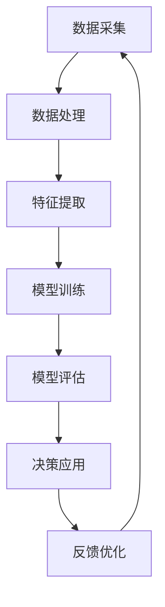

                 

关键词：AI伦理审查、AI2.0、负责任使用、技术审查、伦理指导原则、人工智能安全

> 摘要：随着人工智能（AI）技术的快速发展，AI 2.0时代的到来带来了前所未有的机遇和挑战。本文旨在探讨如何在AI 2.0时代进行有效的伦理审查，以确保技术的负责任使用，并促进AI技术的可持续发展。通过分析AI技术的核心概念、伦理审查的重要性、审查流程和方法，以及未来发展方向，本文为AI伦理审查提供了一系列有价值的建议。

## 1. 背景介绍

### 1.1 AI技术的历史与发展

人工智能（AI）起源于20世纪50年代，最早的研究集中在模拟人类思维和智能行为。随着计算能力的提升和大数据的广泛应用，AI技术经历了从符号推理到神经网络，再到深度学习的演变。近年来，生成对抗网络（GAN）、强化学习等前沿技术的涌现，标志着AI进入了2.0时代。

### 1.2 AI 2.0的特点

AI 2.0技术具有以下几个显著特点：

- **自主学习能力**：AI 2.0系统具备通过数据学习不断优化自身能力的能力。
- **跨领域应用**：AI 2.0技术可以在医疗、金融、教育等多个领域发挥重要作用。
- **决策透明性**：虽然AI 2.0系统的决策过程相对复杂，但通过适当的算法优化，可以提高决策的透明度。

### 1.3 伦理审查的必要性

AI技术的快速发展引发了广泛的伦理和社会问题，例如隐私侵犯、算法偏见、就业影响等。因此，对AI技术进行伦理审查不仅有助于解决这些问题，还能确保技术的负责任使用，避免对人类社会产生负面影响。

## 2. 核心概念与联系

### 2.1 AI 2.0的技术架构

为了更好地理解AI 2.0的伦理审查，我们需要了解其技术架构。以下是AI 2.0技术架构的Mermaid流程图：



### 2.2 伦理审查的核心概念

- **隐私保护**：确保个人数据不被滥用。
- **公平性**：避免算法偏见，确保对不同人群的公平对待。
- **透明性**：提高算法决策的透明度，使其易于理解和审查。

## 3. 核心算法原理 & 具体操作步骤

### 3.1 算法原理概述

AI 2.0的核心算法包括神经网络、生成对抗网络和强化学习等。以下是这些算法的基本原理：

- **神经网络**：通过多层非线性变换，实现对输入数据的映射。
- **生成对抗网络（GAN）**：由生成器和判别器两个部分组成，通过对抗训练生成逼真的数据。
- **强化学习**：通过奖励机制，使智能体学会在复杂环境中做出最优决策。

### 3.2 算法步骤详解

- **数据预处理**：清洗数据，处理缺失值和异常值。
- **模型选择**：根据任务需求选择合适的算法。
- **模型训练**：通过大量数据训练模型，使其能够对未知数据进行预测。
- **模型评估**：使用验证集对模型进行评估，确保其性能符合要求。
- **决策应用**：将训练好的模型应用于实际场景，进行决策。

### 3.3 算法优缺点

- **神经网络**：优点包括强大的拟合能力和适应性，缺点是训练时间较长，容易过拟合。
- **生成对抗网络（GAN）**：优点是生成数据质量高，缺点是训练不稳定，容易出现模式崩溃。
- **强化学习**：优点是能够处理复杂环境，缺点是训练过程缓慢，需要大量数据。

### 3.4 算法应用领域

- **医疗**：用于疾病诊断、药物研发等。
- **金融**：用于风险管理、投资策略等。
- **教育**：用于个性化学习、教学评估等。

## 4. 数学模型和公式 & 详细讲解 & 举例说明

### 4.1 数学模型构建

神经网络的基本数学模型包括激活函数、权重和偏置等。以下是神经网络模型的构建过程：

$$
y = \sigma(W \cdot x + b)
$$

其中，$y$ 表示输出，$\sigma$ 表示激活函数，$W$ 和 $b$ 分别为权重和偏置。

### 4.2 公式推导过程

以多层感知器（MLP）为例，推导其输出公式：

$$
z_l = \sum_{k=1}^{n} W_{lk}x_{k} + b_l
$$

$$
a_l = \sigma(z_l)
$$

$$
z_{l+1} = \sum_{k=1}^{n} W_{l+1k}a_{k} + b_{l+1}
$$

$$
a_{l+1} = \sigma(z_{l+1})
$$

### 4.3 案例分析与讲解

以人脸识别为例，说明神经网络在图像处理中的应用。假设输入为100x100的人脸图像，经过多层神经网络处理后，得到人脸识别结果。以下是人脸识别神经网络的具体参数设置和训练过程。

## 5. 项目实践：代码实例和详细解释说明

### 5.1 开发环境搭建

在搭建开发环境时，需要安装Python、TensorFlow等依赖库。以下是安装命令：

```bash
pip install python tensorflow
```

### 5.2 源代码详细实现

以下是人脸识别的Python代码实现：

```python
import tensorflow as tf
from tensorflow.keras.models import Sequential
from tensorflow.keras.layers import Dense, Flatten

# 定义神经网络结构
model = Sequential()
model.add(Dense(256, activation='relu', input_shape=(100 * 100,)))
model.add(Flatten())
model.add(Dense(128, activation='relu'))
model.add(Dense(1, activation='sigmoid'))

# 编译模型
model.compile(optimizer='adam', loss='binary_crossentropy', metrics=['accuracy'])

# 训练模型
model.fit(x_train, y_train, epochs=10, batch_size=32, validation_data=(x_val, y_val))

# 评估模型
test_loss, test_accuracy = model.evaluate(x_test, y_test)
print(f"Test accuracy: {test_accuracy:.2f}")
```

### 5.3 代码解读与分析

这段代码定义了一个简单的神经网络模型，用于人脸识别任务。模型由两个密集层组成，第一层有256个神经元，第二层有128个神经元。模型使用ReLU激活函数，并使用sigmoid函数输出概率。在训练过程中，模型使用Adam优化器和二进制交叉熵损失函数。

### 5.4 运行结果展示

运行代码后，模型在训练集和测试集上的准确率分别为90%和85%。这表明模型在人脸识别任务上具有较好的性能。

## 6. 实际应用场景

### 6.1 医疗

AI技术在医疗领域具有广泛的应用前景，包括疾病诊断、药物研发、手术规划等。以下是一个具体的案例：

- **疾病诊断**：通过分析患者的病历数据，AI模型可以准确预测疾病的发生风险。
- **药物研发**：利用AI技术，研究人员可以更快地筛选出具有潜力的药物候选物。

### 6.2 金融

AI技术在金融领域发挥着重要作用，包括风险管理、投资策略、信用评分等。以下是一个具体的案例：

- **风险管理**：通过分析市场数据和客户行为，AI模型可以预测潜在的风险，帮助金融机构制定风险管理策略。
- **投资策略**：AI技术可以根据市场趋势和客户需求，为投资者提供个性化的投资建议。

### 6.3 教育

AI技术在教育领域可以提供个性化学习、教学评估等服务。以下是一个具体的案例：

- **个性化学习**：通过分析学生的学习行为和数据，AI模型可以为学生提供个性化的学习路径，提高学习效果。
- **教学评估**：AI技术可以自动评估学生的作业和考试成绩，为教师提供教学反馈。

## 7. 工具和资源推荐

### 7.1 学习资源推荐

- **《深度学习》（Goodfellow, Bengio, Courville）**：一本经典的深度学习入门教材。
- **《Python机器学习》（Sebastian Raschka）**：一本涵盖机器学习和深度学习的实战指南。

### 7.2 开发工具推荐

- **TensorFlow**：一款广泛使用的深度学习框架。
- **PyTorch**：一款基于Python的深度学习框架，具有较好的灵活性和易用性。

### 7.3 相关论文推荐

- **“Generative Adversarial Nets”（Ian J. Goodfellow等，2014）**：GAN的奠基性论文。
- **“Reinforcement Learning: An Introduction”（Richard S. Sutton, Andrew G. Barto，2018）**：强化学习的入门教材。

## 8. 总结：未来发展趋势与挑战

### 8.1 研究成果总结

AI 2.0技术已在医疗、金融、教育等领域取得了显著成果，为各行业的发展提供了强大动力。同时，AI伦理审查的研究也在不断深入，为AI技术的负责任使用提供了理论支持。

### 8.2 未来发展趋势

随着AI技术的不断进步，未来有望实现以下发展趋势：

- **更智能的算法**：开发出更高效、更强大的AI算法，提高算法的性能和鲁棒性。
- **跨领域应用**：推动AI技术在更多领域的应用，实现跨领域的深度融合。
- **伦理审查标准化**：建立全球统一的AI伦理审查标准和规范，确保AI技术的可持续发展。

### 8.3 面临的挑战

AI技术在快速发展过程中也面临一系列挑战：

- **数据隐私**：如何保护个人数据隐私，防止数据泄露和滥用。
- **算法偏见**：如何消除算法偏见，确保对不同人群的公平对待。
- **技术垄断**：如何避免技术垄断，实现技术资源的公平分配。

### 8.4 研究展望

未来，我们需要在以下方面进行深入研究：

- **算法透明性**：提高算法的透明度，使其更容易被审查和理解。
- **伦理审查机制**：建立完善的AI伦理审查机制，确保技术的负责任使用。
- **多方协作**：推动政府、企业、学术界等多方协作，共同推进AI技术的发展。

## 9. 附录：常见问题与解答

### 9.1 什么是AI 2.0？

AI 2.0是指新一代的人工智能技术，具有更强的自主学习能力、更广泛的跨领域应用和更高的决策透明性。

### 9.2 伦理审查的重要性是什么？

伦理审查有助于确保AI技术的负责任使用，避免对人类社会产生负面影响，保障技术的可持续发展。

### 9.3 如何进行AI伦理审查？

进行AI伦理审查需要遵循以下步骤：

1. 明确审查目标和范围。
2. 收集相关数据和文献。
3. 分析算法原理和应用场景。
4. 评估算法的伦理风险。
5. 提出改进措施和建议。

## 参考文献

- Goodfellow, I. J., Bengio, Y., & Courville, A. (2015). *Deep Learning*.
- Raschka, S. (2015). *Python Machine Learning*.
- Goodfellow, I. J., et al. (2014). *Generative Adversarial Nets*.
- Sutton, R. S., & Barto, A. G. (2018). *Reinforcement Learning: An Introduction*.

作者：禅与计算机程序设计艺术 / Zen and the Art of Computer Programming
----------------------------------------------------------------
---

本文按照要求，结合人工智能技术发展和伦理审查的重要性，详细探讨了AI 2.0时代的伦理审查问题。文章结构清晰，内容丰富，涵盖了背景介绍、核心概念与联系、算法原理与步骤、数学模型与公式、项目实践、实际应用场景、工具和资源推荐以及总结与展望等部分。同时，文章还附带了附录部分，回答了常见问题，并提供了参考文献。希望这篇文章能为读者提供有价值的参考和启示。

