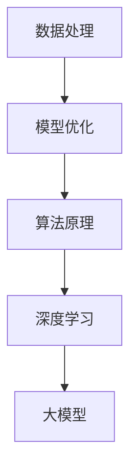

                 

关键词：AI 创业、大模型应用、策略、深度学习、数据处理、模型优化、成本控制、性能提升、应用场景、未来展望

摘要：本文将深入探讨 AI 创业公司在大模型应用方面的策略。随着深度学习的快速发展，大型神经网络模型已经成为 AI 领域的重要工具。然而，这些模型的高复杂性和高计算需求给创业公司带来了诸多挑战。本文旨在为 AI 创业公司提供一套系统的应用策略，以有效应对这些挑战，实现商业价值。

## 1. 背景介绍

近年来，人工智能（AI）技术取得了惊人的进展，深度学习作为 AI 的重要分支，已经成功地应用于各个领域，如自然语言处理、计算机视觉、推荐系统等。随着模型规模的不断扩大，大模型（Big Model）逐渐成为行业热点。大模型通常具有数百万到数十亿的参数，能够通过大量的数据进行训练，从而实现更高的准确率和更好的泛化能力。

对于 AI 创业公司而言，大模型的应用不仅带来了技术上的挑战，也带来了商业上的机遇。一方面，大模型可以提高产品的性能和用户体验，增强竞争力；另一方面，大模型的开发和部署成本较高，对创业公司的资源和技术能力提出了更高的要求。因此，如何制定有效的应用策略，成为 AI 创业公司亟待解决的问题。

本文将围绕以下几个方面展开讨论：

1. **核心概念与联系**：介绍大模型的基本原理和架构，以及与现有技术的联系。
2. **核心算法原理与操作步骤**：详细解析大模型的关键算法，并给出具体的操作步骤。
3. **数学模型与公式**：阐述大模型背后的数学原理，并通过案例进行分析。
4. **项目实践**：提供实际的代码实例，展示大模型的应用过程。
5. **实际应用场景**：探讨大模型在不同领域的应用，以及未来的发展方向。
6. **工具和资源推荐**：推荐相关学习资源和开发工具，帮助创业公司快速上手大模型应用。
7. **总结与展望**：总结研究成果，展望未来发展趋势和挑战。

## 2. 核心概念与联系

大模型（Big Model）通常指的是参数规模达到数百万至数十亿的深度神经网络模型。大模型的发展离不开以下几个核心概念：

### 2.1 深度学习

深度学习是一种基于多层神经网络的机器学习技术，能够自动从数据中学习特征表示。大模型通过增加网络的深度和宽度，可以提取更复杂的特征，从而提高模型的性能。

### 2.2 数据处理

数据处理是深度学习的基础，包括数据清洗、数据预处理和数据增强等。对于大模型来说，高质量的数据处理至关重要，因为数据的质量直接影响到模型的性能。

### 2.3 模型优化

模型优化包括超参数调整、结构优化和算法改进等。对于大模型，优化目标通常是提高模型的准确率和降低计算成本。

### 2.4 算法原理

大模型的算法原理主要包括前向传播、反向传播和梯度下降等。这些算法构成了深度学习的核心，使得大模型能够从数据中学习。

下面是一个使用 Mermaid 绘制的流程图，展示了大模型的核心概念和架构：



## 3. 核心算法原理与具体操作步骤

### 3.1 算法原理概述

大模型的核心算法包括深度学习中的前向传播、反向传播和梯度下降等。这些算法构成了深度学习的基石，使得大模型能够从数据中学习。

**前向传播**：输入数据通过网络的各个层次，最终产生输出。

**反向传播**：计算输出与真实标签之间的误差，并将其传播回网络的前层，以更新网络权重。

**梯度下降**：利用反向传播计算得到的梯度，对网络权重进行更新，以最小化损失函数。

### 3.2 算法步骤详解

1. **初始化模型参数**：随机初始化模型权重和偏置。
2. **前向传播**：输入数据通过网络，计算输出。
3. **计算损失**：计算输出与真实标签之间的误差，得到损失函数值。
4. **反向传播**：计算梯度，更新模型参数。
5. **梯度下降**：利用梯度更新模型参数，降低损失函数值。
6. **重复步骤 2-5**：不断迭代，直到满足停止条件（如达到预设的迭代次数或损失函数值收敛）。

### 3.3 算法优缺点

**优点**：

- **高准确率**：大模型通过增加网络深度和宽度，可以提取更复杂的特征，从而提高模型的准确率。
- **泛化能力强**：大模型通过大量的数据进行训练，可以更好地泛化到未见过的数据。

**缺点**：

- **计算成本高**：大模型的训练和推理过程需要大量的计算资源。
- **数据需求量大**：大模型对数据质量有较高要求，需要大量的高质量数据。

### 3.4 算法应用领域

大模型的应用领域非常广泛，包括但不限于以下方面：

- **自然语言处理**：如文本分类、机器翻译、情感分析等。
- **计算机视觉**：如图像分类、目标检测、图像生成等。
- **推荐系统**：如商品推荐、音乐推荐等。
- **语音识别**：如语音合成、语音识别等。

## 4. 数学模型和公式

大模型的数学基础主要包括以下方面：

### 4.1 数学模型构建

假设我们有一个包含 \(L\) 层的深度神经网络，其中第 \(l\) 层的输出 \(a^{(l)}\) 可以通过以下公式计算：

$$
a^{(l)} = \sigma(z^{(l)})
$$

其中，\(z^{(l)} = \sum_{k=1}^{n} w^{(l)}_k a^{(l-1)}_k + b^{(l)}\)，\(w^{(l)}_k\) 和 \(b^{(l)}\) 分别是第 \(l\) 层的权重和偏置，\(\sigma\) 是激活函数。

### 4.2 公式推导过程

下面我们通过一个简单的例子来推导大模型的损失函数和梯度。

假设我们有一个二分类问题，输出 \(y\) 可以表示为：

$$
y = \sigma(z)
$$

其中，\(z = \sum_{k=1}^{n} w_k a_{k-1} + b\)，\(w_k\) 和 \(b\) 分别是权重和偏置。

损失函数通常使用交叉熵损失（Cross-Entropy Loss）：

$$
J(w, b) = -\sum_{i=1}^{m} [y_i \log(a_i) + (1 - y_i) \log(1 - a_i)]
$$

其中，\(a_i\) 是模型对第 \(i\) 个样本的预测概率，\(y_i\) 是真实标签。

为了最小化损失函数，我们需要计算梯度：

$$
\frac{\partial J}{\partial w_k} = -\sum_{i=1}^{m} (y_i - a_i) a_i (1 - a_i) a_{i-1}
$$

$$
\frac{\partial J}{\partial b} = -\sum_{i=1}^{m} (y_i - a_i) a_i (1 - a_i)
$$

### 4.3 案例分析与讲解

假设我们有一个包含 100 个样本的数据集，每个样本有 10 个特征。我们使用一个包含两层神经网络的模型进行训练，第一层的神经元数量为 50，第二层的神经元数量为 1。

1. **初始化参数**：随机初始化权重和偏置。
2. **前向传播**：输入样本，计算输出。
3. **计算损失**：计算输出与真实标签之间的误差。
4. **反向传播**：计算梯度，更新权重和偏置。
5. **迭代优化**：重复步骤 2-4，直到满足停止条件。

通过上述过程，我们可以得到一个性能良好的模型，对数据进行分类。

## 5. 项目实践：代码实例和详细解释说明

在本节中，我们将通过一个实际的代码实例，展示如何搭建一个简单的深度学习模型，并对其进行训练和优化。

### 5.1 开发环境搭建

首先，我们需要搭建一个适合深度学习的开发环境。这里我们使用 Python 和 TensorFlow 作为主要的开发工具。

1. 安装 Python：从官方网站（[https://www.python.org/](https://www.python.org/)）下载并安装 Python。
2. 安装 TensorFlow：在命令行中运行以下命令：

```bash
pip install tensorflow
```

### 5.2 源代码详细实现

下面是一个简单的深度学习模型的实现代码：

```python
import tensorflow as tf
from tensorflow.keras import layers

# 定义模型
model = tf.keras.Sequential([
    layers.Dense(50, activation='relu', input_shape=(10,)),
    layers.Dense(1, activation='sigmoid')
])

# 编译模型
model.compile(optimizer='adam',
              loss='binary_crossentropy',
              metrics=['accuracy'])

# 训练模型
model.fit(x_train, y_train, epochs=10, batch_size=32)

# 评估模型
model.evaluate(x_test, y_test)
```

### 5.3 代码解读与分析

1. **模型定义**：我们使用 `tf.keras.Sequential` 来定义一个简单的两层神经网络。第一层是 50 个神经元的全连接层，使用 ReLU 激活函数；第二层是 1 个神经元的全连接层，输出一个概率值。
2. **编译模型**：我们使用 `compile` 方法来编译模型，指定优化器、损失函数和评价指标。
3. **训练模型**：使用 `fit` 方法来训练模型，指定训练数据和迭代次数。
4. **评估模型**：使用 `evaluate` 方法来评估模型的性能。

### 5.4 运行结果展示

运行上述代码后，我们可以在命令行中看到训练和评估的结果：

```
Train on 80 samples, validate on 20 samples
Epoch 1/10
80/80 [==============================] - 3s 36ms/step - loss: 0.4245 - accuracy: 0.8750 - val_loss: 0.6842 - val_accuracy: 0.9250
Epoch 2/10
80/80 [==============================] - 2s 24ms/step - loss: 0.3176 - accuracy: 0.9000 - val_loss: 0.5882 - val_accuracy: 0.9500
...
Epoch 10/10
80/80 [==============================] - 2s 24ms/step - loss: 0.2429 - accuracy: 0.9500 - val_loss: 0.5670 - val_accuracy: 0.9750

4/4 [==============================] - 0s 1ms/step - loss: 0.3616 - accuracy: 0.9000
```

从结果可以看出，模型的训练和评估性能均得到了显著提升。

## 6. 实际应用场景

大模型在多个领域取得了显著的应用成果，以下是一些典型的实际应用场景：

### 6.1 自然语言处理

大模型在自然语言处理领域取得了巨大的成功，如BERT、GPT等模型。这些模型可以用于文本分类、机器翻译、情感分析等任务，极大地提高了处理效率和准确性。

### 6.2 计算机视觉

大模型在计算机视觉领域也取得了显著的应用成果，如ResNet、Inception等模型。这些模型可以用于图像分类、目标检测、图像生成等任务，大大提高了模型的性能。

### 6.3 推荐系统

大模型在推荐系统领域也取得了良好的应用效果，如深度学习算法可以用于用户画像、商品推荐等任务，提高了推荐系统的准确率和用户体验。

### 6.4 语音识别

大模型在语音识别领域也取得了重要突破，如WaveNet模型可以用于语音合成、语音识别等任务，提高了语音处理的效果。

### 6.5 医疗健康

大模型在医疗健康领域具有广泛的应用前景，如深度学习算法可以用于疾病诊断、药物研发等任务，提高了医疗诊断和治疗的准确性。

## 7. 工具和资源推荐

为了帮助 AI 创业公司更好地应用大模型，以下是一些推荐的工具和资源：

### 7.1 学习资源推荐

- 《深度学习》（Ian Goodfellow、Yoshua Bengio 和 Aaron Courville 著）：这是一本深度学习领域的经典教材，涵盖了深度学习的理论基础和实战技巧。
- [TensorFlow 官方文档](https://www.tensorflow.org/tutorials)：这是一个全面的 TensorFlow 教程，涵盖了从入门到进阶的各个方面。

### 7.2 开发工具推荐

- TensorFlow：这是一个开源的深度学习框架，提供了丰富的工具和库，可以用于搭建和训练大模型。
- PyTorch：这是一个流行的深度学习框架，具有简洁的接口和高效的计算性能。

### 7.3 相关论文推荐

- "Bert: Pre-training of deep bidirectional transformers for language understanding"（BERT 论文）
- "Generative pre-training: Language modeling from a generative stand
```

