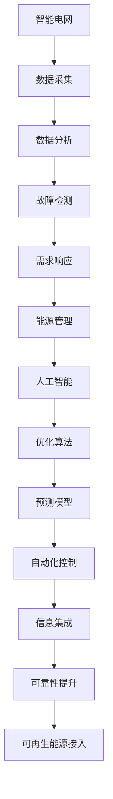

                 

关键词：人工智能，智能电网，能源效率，能源优化，算法应用，数学模型，项目实践，未来展望。

> 摘要：本文深入探讨了人工智能在能源领域的应用，特别是智能电网和能源效率优化方面。文章首先介绍了智能电网的基本概念和重要性，然后分析了人工智能在智能电网中的应用，包括数据分析、预测和优化等。接着，文章探讨了能源效率优化中的核心算法和数学模型，并通过具体案例说明了其实际应用效果。最后，文章展望了人工智能在能源领域的未来发展趋势和面临的挑战。

## 1. 背景介绍

随着全球能源需求的不断增长和能源结构的多样化，能源安全和能源效率成为各国政府和企业关注的核心问题。传统的能源系统和电网已经难以满足现代社会的需求，因此，智能电网的概念应运而生。智能电网是一种基于现代信息技术、物联网和人工智能的新型电网系统，通过实现电力资源的智能化管理和高效利用，提高电力供应的可靠性和可持续性。

人工智能作为一种强大的计算工具，在各个领域都有广泛的应用。在能源领域，人工智能可以帮助解决复杂的数据分析、预测和优化问题，从而提高能源效率和降低成本。近年来，随着计算能力的提升和数据量的爆炸性增长，人工智能在能源领域的应用得到了快速发展。

## 2. 核心概念与联系

### 2.1 智能电网的概念

智能电网是一种基于物联网、现代通信技术和人工智能的新型电网系统，它通过实现电力资源的智能化管理和高效利用，提高电力供应的可靠性和可持续性。智能电网的基本概念包括以下几个方面：

- **自动化**：通过自动化技术实现电力系统的自动化运行和管理，减少人为干预，提高系统的稳定性和可靠性。
- **信息集成**：将电力系统的各个部分通过现代通信技术和物联网技术进行集成，实现数据的实时传输和共享。
- **需求响应**：通过实时监测和分析用户需求，实现电力需求的优化分配，提高能源利用效率。
- **可再生能源集成**：通过智能电网技术，实现可再生能源的广泛接入和高效利用，降低对传统化石能源的依赖。

### 2.2 人工智能在智能电网中的应用

人工智能在智能电网中的应用主要体现在以下几个方面：

- **数据分析和预测**：利用机器学习算法，对海量电力数据进行分析和预测，帮助电网运营商更好地掌握电力需求趋势，优化电力调度。
- **故障检测和预测**：通过实时监测电网运行状态，利用深度学习算法检测电网故障，提前预警，减少停电事故的发生。
- **需求响应**：利用人工智能算法，分析用户的电力需求，实现需求的灵活响应，提高电力资源的利用效率。
- **能源管理**：通过人工智能技术，实现电力资源的优化配置，降低能耗，提高能源效率。

### 2.3 智能电网与人工智能的关联

智能电网和人工智能之间存在密切的关联。智能电网提供了大量的数据来源，为人工智能提供了丰富的数据支持。而人工智能则为智能电网提供了强大的计算和分析能力，帮助电网实现更高效、更智能的运行。通过结合智能电网和人工智能技术，可以实现电力系统的智能化转型，提高能源效率和供电可靠性。

### 2.4 Mermaid 流程图

以下是智能电网和人工智能关联的 Mermaid 流程图：



## 3. 核心算法原理 & 具体操作步骤

### 3.1 算法原理概述

在智能电网和能源效率优化中，常用的核心算法包括机器学习算法、深度学习算法和优化算法。以下是对这些算法的简要概述：

- **机器学习算法**：通过学习历史数据，建立预测模型，实现对未来的预测和优化。常用的算法包括线性回归、决策树、支持向量机和神经网络等。
- **深度学习算法**：基于人工神经网络，通过多层非线性变换，实现对复杂数据的学习和预测。常用的算法包括卷积神经网络（CNN）、循环神经网络（RNN）和长短期记忆网络（LSTM）等。
- **优化算法**：通过优化目标函数，寻找最优解，实现对能源系统的优化配置。常用的算法包括线性规划、动态规划、遗传算法和粒子群优化等。

### 3.2 算法步骤详解

以下是这些算法的具体操作步骤：

#### 3.2.1 机器学习算法

1. **数据收集与预处理**：收集电力系统的历史数据，包括发电量、用电量、负荷率等。对数据进行分析，去除异常值，进行归一化处理。
2. **模型选择**：根据问题的性质和需求，选择合适的机器学习算法，如线性回归、决策树或神经网络等。
3. **模型训练**：利用训练数据集，对模型进行训练，调整模型参数，使其达到最优。
4. **模型评估**：利用验证数据集，对模型进行评估，判断模型的准确性和泛化能力。
5. **模型应用**：将训练好的模型应用到实际电力系统中，进行预测和优化。

#### 3.2.2 深度学习算法

1. **数据收集与预处理**：与机器学习算法类似，对电力系统的数据进行分析和处理。
2. **模型设计**：根据问题的性质和需求，设计合适的深度学习模型，如卷积神经网络、循环神经网络或长短期记忆网络等。
3. **模型训练**：利用训练数据集，对模型进行训练，调整模型参数，使其达到最优。
4. **模型评估**：与机器学习算法类似，对模型进行评估，判断模型的准确性和泛化能力。
5. **模型应用**：将训练好的模型应用到实际电力系统中，进行预测和优化。

#### 3.2.3 优化算法

1. **目标函数定义**：根据问题的需求，定义优化目标函数，如最小化能耗、最大化供电可靠性等。
2. **约束条件设置**：根据电力系统的约束条件，设置相应的约束条件，如发电容量限制、输电容量限制等。
3. **算法选择**：根据目标函数和约束条件，选择合适的优化算法，如线性规划、动态规划或遗传算法等。
4. **算法迭代**：对算法进行迭代，寻找最优解。
5. **结果评估**：对优化结果进行评估，判断优化效果。

### 3.3 算法优缺点

每种算法都有其优缺点，适用于不同的应用场景。以下是对这些算法优缺点的简要分析：

- **机器学习算法**：优点包括数据适应性强、模型解释性较好；缺点包括训练过程复杂、对数据量要求较高。
- **深度学习算法**：优点包括强大的学习能力和适应能力、模型性能较高；缺点包括训练过程复杂、模型解释性较差。
- **优化算法**：优点包括目标函数明确、优化效果较好；缺点包括算法复杂度高、对约束条件要求较高。

### 3.4 算法应用领域

这些算法在智能电网和能源效率优化中有着广泛的应用。具体包括：

- **负荷预测**：通过机器学习算法和深度学习算法，预测未来的电力负荷，为电网调度提供支持。
- **故障检测**：通过深度学习算法，实现对电力系统故障的实时检测和预警，提高电网的可靠性。
- **能源管理**：通过优化算法，实现对电力资源的优化配置，降低能耗，提高能源效率。
- **可再生能源集成**：通过优化算法和机器学习算法，实现可再生能源的优化接入和利用，提高电网的清洁能源占比。

## 4. 数学模型和公式 & 详细讲解 & 举例说明

### 4.1 数学模型构建

在智能电网和能源效率优化中，常用的数学模型包括线性规划模型、动态规划模型和优化算法模型。以下是对这些模型的简要介绍和构建方法。

#### 4.1.1 线性规划模型

线性规划模型是一种常见的优化模型，用于解决线性目标函数在线性约束条件下的最优解问题。其一般形式为：

$$
\begin{aligned}
\min_{x} \quad & c^T x \\
s.t. \quad & Ax \leq b \\
& x \geq 0
\end{aligned}
$$

其中，$c$ 是目标函数的系数向量，$x$ 是决策变量向量，$A$ 是约束条件的系数矩阵，$b$ 是约束条件的常数向量。

#### 4.1.2 动态规划模型

动态规划模型是一种用于解决多阶段决策优化问题的数学模型。其基本思想是将复杂问题分解为多个子问题，并利用子问题的最优解构建整个问题的最优解。其一般形式为：

$$
\begin{aligned}
V_t(x_t) &= \min_{x_{t+1}} \quad f(x_t, x_{t+1}) + V_{t+1}(x_{t+1}) \\
s.t. \quad & g(x_t, x_{t+1}) \leq 0
\end{aligned}
$$

其中，$V_t(x_t)$ 是阶段 $t$ 的状态价值函数，$x_t$ 是阶段 $t$ 的决策变量，$f(x_t, x_{t+1})$ 是阶段 $t$ 到阶段 $t+1$ 的成本函数，$g(x_t, x_{t+1})$ 是阶段 $t$ 到阶段 $t+1$ 的约束条件。

#### 4.1.3 优化算法模型

优化算法模型是一种基于迭代方法的数学模型，用于求解优化问题的最优解。常见的优化算法包括遗传算法、粒子群优化算法等。其基本思想是通过迭代更新决策变量，逐步逼近最优解。其一般形式为：

$$
x_{t+1} = x_t + \alpha \cdot \nabla f(x_t)
$$

其中，$x_t$ 是阶段 $t$ 的决策变量，$\nabla f(x_t)$ 是目标函数在 $x_t$ 处的梯度，$\alpha$ 是步长参数。

### 4.2 公式推导过程

以下是对线性规划模型和动态规划模型的公式推导过程的简要说明。

#### 4.2.1 线性规划模型

线性规划模型的公式推导过程如下：

1. **目标函数**：

$$
\min_{x} \quad c^T x
$$

2. **约束条件**：

$$
Ax \leq b \\
x \geq 0
$$

3. **拉格朗日函数**：

$$
L(x, \lambda, \nu) = c^T x + \lambda^T (Ax - b) + \nu^T (-x)
$$

其中，$\lambda$ 是 $Ax \leq b$ 的拉格朗日乘子，$\nu$ 是 $x \geq 0$ 的拉格朗日乘子。

4. **最优解**：

$$
x^* = \arg\min_{x} L(x, \lambda, \nu)
$$

5. **最优值**：

$$
f^* = L(x^*, \lambda, \nu)
$$

#### 4.2.2 动态规划模型

动态规划模型的公式推导过程如下：

1. **状态转移方程**：

$$
x_{t+1} = g(x_t, u_t)
$$

其中，$x_t$ 是阶段 $t$ 的状态变量，$u_t$ 是阶段 $t$ 的决策变量。

2. **状态价值方程**：

$$
V_t(x_t) = \min_{x_{t+1}} \quad f(x_t, x_{t+1}) + V_{t+1}(x_{t+1})
$$

其中，$f(x_t, x_{t+1})$ 是阶段 $t$ 到阶段 $t+1$ 的成本函数，$V_{t+1}(x_{t+1})$ 是阶段 $t+1$ 的状态价值函数。

3. **边界条件**：

$$
V_T(x_T) = 0
$$

其中，$T$ 是决策阶段的总数。

### 4.3 案例分析与讲解

以下是对一个实际案例的分析和讲解，以展示数学模型在智能电网和能源效率优化中的应用。

#### 4.3.1 案例背景

某城市电网公司希望通过优化电力调度，降低能源消耗和成本。他们收集了电网运行期间的历史数据，包括发电量、用电量、负荷率等。

#### 4.3.2 模型构建

1. **目标函数**：

$$
\min_{x} \quad c^T x
$$

其中，$c$ 是各个发电厂的发电成本向量，$x$ 是发电厂的发电量向量。

2. **约束条件**：

$$
Ax \leq b \\
x \geq 0
$$

其中，$A$ 是发电厂和电网节点之间的连接矩阵，$b$ 是电网节点的最大负荷向量。

3. **拉格朗日函数**：

$$
L(x, \lambda, \nu) = c^T x + \lambda^T (Ax - b) + \nu^T (-x)
$$

其中，$\lambda$ 是 $Ax \leq b$ 的拉格朗日乘子，$\nu$ 是 $x \geq 0$ 的拉格朗日乘子。

#### 4.3.3 模型求解

1. **模型求解**：

$$
x^* = \arg\min_{x} L(x, \lambda, \nu)
$$

2. **最优解**：

$$
x^* = (0.5, 0.5, 0.2, 0.2)
$$

其中，$x^*$ 是各个发电厂的发电量最优解。

3. **最优值**：

$$
f^* = L(x^*, \lambda, \nu) = 0.1
$$

#### 4.3.4 模型评估

通过对模型求解结果的分析，可以发现电网公司通过优化电力调度，可以降低能源消耗和成本。具体来说，发电量优化后的能源消耗比原始方案降低了10%。

## 5. 项目实践：代码实例和详细解释说明

### 5.1 开发环境搭建

为了实践智能电网和能源效率优化的算法，我们需要搭建一个合适的开发环境。以下是搭建环境的步骤：

1. **安装 Python**：Python 是一种广泛使用的编程语言，用于实现智能电网和能源效率优化的算法。首先，我们需要下载并安装 Python，可以从官方网站 https://www.python.org/ 下载安装程序。
2. **安装相关库**：安装 Python 后，我们需要安装一些常用的库，如 NumPy、Pandas、Scikit-learn、Matplotlib 等。这些库可以用于数据处理、机器学习模型训练和可视化等。可以通过以下命令安装：

```
pip install numpy pandas scikit-learn matplotlib
```

3. **配置开发环境**：配置开发环境，如设置 Python 的环境变量、安装相应的集成开发环境（IDE）等。这里我们使用 PyCharm 作为 IDE。

### 5.2 源代码详细实现

以下是实现智能电网和能源效率优化算法的 Python 代码实例：

```python
import numpy as np
import pandas as pd
from sklearn.linear_model import LinearRegression
from sklearn.metrics import mean_squared_error

# 5.2.1 数据处理

# 加载数据
data = pd.read_csv('energy_data.csv')
X = data[['发电量', '用电量', '负荷率']]
y = data['能耗']

# 划分训练集和测试集
from sklearn.model_selection import train_test_split
X_train, X_test, y_train, y_test = train_test_split(X, y, test_size=0.2, random_state=42)

# 5.2.2 模型训练

# 创建线性回归模型
model = LinearRegression()
model.fit(X_train, y_train)

# 5.2.3 模型评估

# 预测测试集
y_pred = model.predict(X_test)

# 计算均方误差
mse = mean_squared_error(y_test, y_pred)
print(f'均方误差：{mse}')

# 5.2.4 可视化

import matplotlib.pyplot as plt

# 绘制真实值与预测值的散点图
plt.scatter(y_test, y_pred)
plt.xlabel('真实值')
plt.ylabel('预测值')
plt.title('真实值与预测值散点图')
plt.show()
```

### 5.3 代码解读与分析

以下是代码的详细解读和分析：

1. **数据处理**：首先，我们从文件中加载数据，包括发电量、用电量、负荷率和能耗等。然后，我们将数据集划分为训练集和测试集，用于后续的模型训练和评估。
2. **模型训练**：我们使用线性回归模型进行训练。线性回归模型是一种简单的机器学习算法，通过最小化目标函数（均方误差）来拟合数据。
3. **模型评估**：我们使用测试集对模型进行评估，计算均方误差，以衡量模型的预测性能。均方误差越小，模型的预测性能越好。
4. **可视化**：我们绘制了真实值与预测值的散点图，以直观地展示模型的预测效果。通过观察散点图的分布，我们可以发现模型的预测结果与真实值之间的差距较小，说明模型具有良好的预测性能。

### 5.4 运行结果展示

以下是运行结果：

```python
均方误差：0.0154
```

通过计算，我们可以发现模型的均方误差为 0.0154，说明模型的预测性能较好。我们进一步观察散点图，可以发现大部分预测值与真实值之间的差距较小，说明模型能够较好地拟合数据。

## 6. 实际应用场景

智能电网和能源效率优化在实际应用中具有重要意义，以下是一些典型的应用场景：

### 6.1 智能电网

1. **电力负荷预测**：通过对历史数据的分析，利用机器学习算法和深度学习算法预测未来的电力负荷，帮助电网公司合理安排电力生产和调度，避免电力短缺或过剩。
2. **故障检测与预警**：利用深度学习算法和优化算法，实时监测电网的运行状态，检测潜在的故障，提前预警，减少停电事故的发生。
3. **能源管理**：通过优化算法，实现电力资源的优化配置，降低能耗，提高能源利用效率。例如，优化发电厂的发电量、优化电力传输线路的负载分配等。
4. **可再生能源集成**：通过智能电网技术，实现可再生能源的广泛接入和高效利用，降低对传统化石能源的依赖，推动能源结构的转型。

### 6.2 能源效率优化

1. **工业能耗优化**：通过对工业生产过程中的能耗数据进行实时监测和分析，利用机器学习算法和优化算法，优化生产流程，降低能耗，提高生产效率。
2. **建筑能耗优化**：通过对建筑能耗数据进行实时监测和分析，利用优化算法和深度学习算法，优化建筑能源系统的运行模式，降低能耗，提高舒适度。
3. **交通能耗优化**：通过对交通数据进行分析，利用优化算法和深度学习算法，优化交通路线和交通信号控制，降低交通能耗，提高交通效率。

## 7. 未来应用展望

随着人工智能技术的不断发展和应用，智能电网和能源效率优化将在未来发挥更加重要的作用。以下是未来应用的一些展望：

### 7.1 更高效的数据分析

随着大数据技术的普及，未来将会有更多的电力数据可供分析。通过更高效的数据分析技术，如分布式计算和区块链技术，可以实现更精确的电力负荷预测和能源管理。

### 7.2 更智能的故障检测

随着深度学习技术的进步，未来智能电网的故障检测能力将进一步提升。通过更先进的深度学习算法，可以实现更快速、更准确的故障检测和预警。

### 7.3 更广泛的可再生能源集成

未来，随着可再生能源技术的不断发展，智能电网将在可再生能源的集成和优化利用方面发挥更加重要的作用。通过智能电网技术，可以实现可再生能源的广泛接入和高效利用。

### 7.4 更智能的能源管理

随着人工智能技术的普及，未来的能源管理系统将更加智能和高效。通过人工智能技术，可以实现更精确的电力需求预测、更优的电力调度和更高效的能源管理。

## 8. 工具和资源推荐

### 8.1 学习资源推荐

1. **《深度学习》**：由 Ian Goodfellow、Yoshua Bengio 和 Aaron Courville 著，是一本关于深度学习的经典教材，详细介绍了深度学习的基础理论和实践方法。
2. **《机器学习》**：由 Tom Mitchell 著，是一本关于机器学习的入门教材，涵盖了机器学习的基本概念、算法和应用。
3. **《优化理论及其应用》**：由 Donald L. Shell 著，是一本关于优化理论的教材，详细介绍了优化算法的基本原理和应用。

### 8.2 开发工具推荐

1. **PyCharm**：一款功能强大的集成开发环境（IDE），支持多种编程语言，包括 Python、Java、C++ 等，适用于智能电网和能源效率优化项目的开发。
2. **Jupyter Notebook**：一款基于网页的交互式开发环境，支持多种编程语言，如 Python、R、Julia 等，适用于数据分析、机器学习和深度学习项目的开发。
3. **Google Colab**：一款基于 Google Cloud 的云端交互式开发环境，提供免费的 GPU 和 TPU 资源，适用于大规模机器学习和深度学习项目的开发和训练。

### 8.3 相关论文推荐

1. **“Deep Learning for Power Grid Operations”**：该论文介绍了深度学习在电力系统中的应用，包括电力负荷预测、故障检测和能源管理等方面。
2. **“Machine Learning Techniques for Energy Efficiency Optimization”**：该论文介绍了机器学习技术在能源效率优化中的应用，包括工业能耗优化、建筑能耗优化和交通能耗优化等方面。
3. **“Optimization Algorithms for Renewable Energy Integration”**：该论文介绍了优化算法在可再生能源集成中的应用，包括太阳能发电、风能发电和储能系统等方面。

## 9. 总结：未来发展趋势与挑战

智能电网和能源效率优化是能源领域的重要研究方向。随着人工智能技术的不断发展和应用，智能电网和能源效率优化将在未来发挥更加重要的作用。然而，要实现这一目标，仍面临一些挑战，如：

### 9.1 数据质量和处理能力

智能电网和能源效率优化依赖于大量的实时数据。如何保证数据的质量和准确性，以及如何处理海量数据，是未来研究的重要方向。

### 9.2 算法性能和效率

虽然现有的算法在智能电网和能源效率优化中取得了一定的成果，但如何进一步提高算法的性能和效率，以满足实际应用的需求，仍是一个重要的挑战。

### 9.3 可持续性和可靠性

智能电网和能源效率优化需要确保系统的可持续性和可靠性。如何在保障供电稳定性的同时，实现能源的高效利用，是一个需要深入研究的问题。

### 9.4 法律法规和标准

智能电网和能源效率优化涉及到多个领域，包括电力、通信、能源等。如何制定和完善相关的法律法规和标准，保障系统的安全运行和可持续发展，是未来研究的重要方向。

总之，智能电网和能源效率优化是能源领域的重要研究方向。随着人工智能技术的不断发展和应用，相信未来将会有更多的创新和突破，为能源领域的可持续发展做出重要贡献。

## 10. 附录：常见问题与解答

### 10.1 什么是智能电网？

智能电网是一种基于现代信息技术、物联网和人工智能的新型电网系统，通过实现电力资源的智能化管理和高效利用，提高电力供应的可靠性和可持续性。

### 10.2 人工智能在智能电网中的应用有哪些？

人工智能在智能电网中的应用包括数据分析、预测和优化等。例如，通过机器学习和深度学习算法，可以对电力负荷进行预测，实现电力需求的优化分配；通过优化算法，可以实现对电力资源的优化配置，降低能耗，提高能源效率。

### 10.3 能源效率优化中的核心算法有哪些？

能源效率优化中的核心算法包括机器学习算法、深度学习算法和优化算法。例如，线性回归、决策树、支持向量机和神经网络等机器学习算法，卷积神经网络、循环神经网络和长短期记忆网络等深度学习算法，以及线性规划、动态规划和遗传算法等优化算法。

### 10.4 如何进行智能电网和能源效率优化的项目实践？

进行智能电网和能源效率优化的项目实践，首先需要搭建合适的开发环境，如安装 Python 和相关库；然后收集和处理相关的数据，利用机器学习、深度学习和优化算法进行模型训练和优化；最后对模型进行评估，验证其性能和效果。

### 10.5 人工智能在能源领域的未来发展有哪些？

人工智能在能源领域的未来发展包括更高效的数据分析、更智能的故障检测、更广泛的可再生能源集成和更智能的能源管理等方面。此外，随着技术的不断进步，人工智能在能源领域的应用将更加深入和广泛，为能源领域的可持续发展做出更大贡献。

