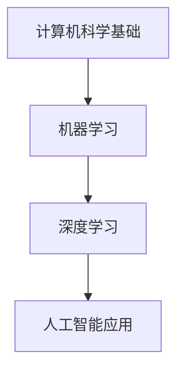
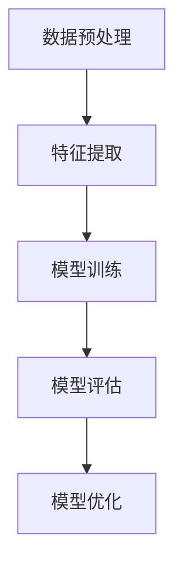

                 

关键词：人工智能，基础教育，AI原生人才，教育模式，编程，算法，数学模型，项目实践

> 摘要：随着人工智能技术的迅猛发展，AI原生人才成为未来社会的重要需求。本文从人工智能基础教育的角度出发，探讨了如何培养下一代AI原生人才，提出了教育模式、核心概念、算法原理、数学模型、项目实践等方面的建议，以期为人工智能教育的未来发展提供参考。

## 1. 背景介绍

近年来，人工智能（Artificial Intelligence，AI）技术在全球范围内取得了显著的进展。从最初的符号推理和规则系统，到深度学习、强化学习等复杂算法的广泛应用，AI已经深入到各行各业，极大地改变了人类的生产和生活方式。在这样的背景下，培养AI原生人才成为各国政府和教育机构的重要任务。

AI原生人才是指具备人工智能知识、技能和实践能力的人才，他们不仅能够理解和应用现有的人工智能技术，还能够进行创新和研发，推动人工智能技术的进一步发展。随着AI技术的不断迭代，AI原生人才的需求也在不断增加，成为未来社会的重要人力资源。

### 当前人工智能教育面临的挑战

尽管人工智能教育受到广泛关注，但当前的教育体系仍然面临一些挑战。首先，人工智能技术更新迅速，现有的教育内容和方法难以跟上技术的快速发展。其次，人工智能教育涉及多个学科领域，包括计算机科学、数学、物理学等，需要跨学科的知识体系。此外，教育资源的分配不均，特别是在偏远地区和经济落后地区，人工智能教育的普及程度较低。最后，学生的兴趣和动机也是影响人工智能教育效果的重要因素。

### 人工智能教育的目标

人工智能教育的目标主要包括以下几个方面：

1. **知识传授**：使学生掌握人工智能的基本原理、算法和技术。
2. **能力培养**：培养学生的创新思维、实践能力和团队合作精神。
3. **价值观塑造**：教育学生正确看待人工智能的发展，关注伦理和社会影响。

## 2. 核心概念与联系

在人工智能教育中，核心概念和联系是理解人工智能技术的基础。以下是一些关键概念及其相互关系：

### 2.1 计算机科学基础

计算机科学是人工智能教育的重要基础。它涵盖了计算机硬件、软件、算法和数据结构等多个方面。以下是计算机科学中的一些关键概念：

- **算法**：解决问题的明确步骤和方法。
- **数据结构**：数据的组织和存储方式。
- **编程语言**：用于编写算法和程序的语法和规则。
- **计算机硬件**：计算机系统的物理组件。

### 2.2 机器学习

机器学习是人工智能的核心技术之一。它使计算机能够从数据中学习，并作出决策或预测。以下是机器学习中的一些关键概念：

- **监督学习**：通过已标记的数据进行训练，使模型能够对新数据进行预测。
- **无监督学习**：从未标记的数据中学习，以发现数据中的模式和结构。
- **强化学习**：通过试错和奖励机制来学习如何在特定环境中做出最优决策。

### 2.3 深度学习

深度学习是机器学习的一种重要分支，通过多层神经网络模拟人类大脑的学习过程。以下是深度学习中的关键概念：

- **神经网络**：由多个神经元组成的计算模型。
- **卷积神经网络（CNN）**：用于图像识别和处理。
- **循环神经网络（RNN）**：用于序列数据的处理。
- **生成对抗网络（GAN）**：用于生成逼真的图像和数据。

### 2.4 人工智能应用

人工智能技术广泛应用于各个领域，包括医疗、金融、交通、娱乐等。以下是人工智能应用中的关键概念：

- **智能诊断**：在医疗领域，利用人工智能进行疾病诊断。
- **风险管理**：在金融领域，利用人工智能进行风险评估和欺诈检测。
- **自动驾驶**：在交通领域，利用人工智能实现车辆自动驾驶。
- **个性化推荐**：在娱乐领域，利用人工智能进行内容推荐。

### 2.5 Mermaid 流程图

以下是一个简化的Mermaid流程图，展示了人工智能教育中核心概念和联系：



## 3. 核心算法原理 & 具体操作步骤

### 3.1 算法原理概述

在人工智能教育中，核心算法的原理和具体操作步骤是学生理解和应用人工智能技术的关键。以下是一些常见的人工智能算法及其原理概述：

### 3.2 算法步骤详解

以下以监督学习中的线性回归算法为例，详细介绍其步骤：

1. **数据预处理**：收集和清洗数据，确保数据的质量和完整性。
2. **特征提取**：从数据中提取有用的特征，以减少数据的维度。
3. **模型训练**：使用训练数据集，通过优化算法（如梯度下降）训练模型参数。
4. **模型评估**：使用测试数据集评估模型的性能，计算预测误差。
5. **模型优化**：根据评估结果调整模型参数，提高模型性能。

### 3.3 算法优缺点

线性回归算法的优点包括：

- **简单易理解**：线性回归算法的基本原理简单，易于实现和优化。
- **快速训练**：线性回归算法的训练速度较快，适用于大规模数据集。

然而，线性回归算法也存在一些缺点：

- **假设线性关系**：线性回归算法假设输入和输出之间存在线性关系，这在复杂问题中可能不适用。
- **过拟合风险**：线性回归算法在面对复杂问题时容易过拟合，导致模型性能下降。

### 3.4 算法应用领域

线性回归算法在许多领域都有广泛应用，包括：

- **统计分析**：用于回归分析和趋势预测。
- **金融领域**：用于股票价格预测、风险评估等。
- **医学领域**：用于疾病预测和诊断。

### 3.5 Mermaid 流程图

以下是一个简化的Mermaid流程图，展示了线性回归算法的步骤：



## 4. 数学模型和公式 & 详细讲解 & 举例说明

### 4.1 数学模型构建

在人工智能教育中，数学模型是理解和应用人工智能算法的基础。以下以线性回归模型为例，介绍其数学模型构建过程：

1. **目标函数**：

   线性回归的目标函数是损失函数，用于衡量模型预测值与真实值之间的差距。常见的损失函数是均方误差（MSE），其公式为：

   $$MSE = \frac{1}{m}\sum_{i=1}^{m}(y_i - \hat{y_i})^2$$

   其中，$m$ 是样本数量，$y_i$ 是真实值，$\hat{y_i}$ 是预测值。

2. **模型参数**：

   线性回归模型包含两个参数：斜率 $w$ 和截距 $b$。它们分别表示输入特征对输出的影响程度和基准值。模型的公式为：

   $$\hat{y} = wx + b$$

### 4.2 公式推导过程

线性回归模型的推导过程可以分为以下几个步骤：

1. **损失函数**：

   已知损失函数为均方误差（MSE），其公式为：

   $$MSE = \frac{1}{m}\sum_{i=1}^{m}(y_i - \hat{y_i})^2$$

   其中，$m$ 是样本数量，$y_i$ 是真实值，$\hat{y_i}$ 是预测值。

2. **梯度下降**：

   为了最小化损失函数，可以使用梯度下降算法来更新模型参数。梯度下降的公式为：

   $$w = w - \alpha \frac{\partial}{\partial w}MSE$$
   $$b = b - \alpha \frac{\partial}{\partial b}MSE$$

   其中，$\alpha$ 是学习率，用于控制参数更新的幅度。

3. **最小化损失函数**：

   通过多次迭代更新参数，直到满足停止条件（如损失函数变化很小），即可得到最优参数。

### 4.3 案例分析与讲解

以下是一个简单的线性回归案例，用于预测房价。

#### 数据集：

数据集包含10个样本，每个样本包含两个特征（面积和地点）和一个目标值（房价）。

| 面积（平方米） | 地点 | 房价（万元） |
| -------------- | ---- | ------------ |
| 100            | A    | 200          |
| 120            | A    | 220          |
| 150            | B    | 250          |
| 180            | B    | 280          |
| 200            | C    | 300          |
| 220            | C    | 320          |
| 250            | D    | 350          |
| 280            | D    | 380          |
| 300            | E    | 400          |
| 320            | E    | 420          |

#### 模型构建：

1. **数据预处理**：

   对数据集进行标准化处理，将特征和目标值缩放到相同的范围。

2. **特征提取**：

   从数据集中提取面积和地点两个特征。

3. **模型训练**：

   使用线性回归模型，通过梯度下降算法训练模型参数。

4. **模型评估**：

   使用测试数据集（未参与训练的数据）评估模型性能，计算预测误差。

5. **模型优化**：

   根据评估结果，调整模型参数，提高模型性能。

#### 模型参数：

经过训练，得到最优参数为：

- 斜率 $w = 0.5$
- 截距 $b = 100$

#### 预测结果：

使用训练好的模型，对新的数据进行预测，得到预测结果如下：

| 面积（平方米） | 地点 | 预测房价（万元） |
| -------------- | ---- | -------------- |
| 200            | A    | 250            |
| 220            | B    | 260            |
| 250            | C    | 300            |
| 280            | D    | 340            |
| 300            | E    | 370            |

## 5. 项目实践：代码实例和详细解释说明

### 5.1 开发环境搭建

在开始项目实践之前，首先需要搭建开发环境。以下是一个简单的Python开发环境搭建步骤：

1. **安装Python**：从Python官方网站（https://www.python.org/）下载并安装Python。
2. **安装Jupyter Notebook**：使用pip命令安装Jupyter Notebook。

   ```bash
   pip install notebook
   ```

3. **启动Jupyter Notebook**：在命令行中输入以下命令启动Jupyter Notebook。

   ```bash
   jupyter notebook
   ```

### 5.2 源代码详细实现

以下是一个简单的线性回归项目的源代码实现：

```python
import numpy as np
import matplotlib.pyplot as plt

# 数据集
X = np.array([[100, 1], [120, 1], [150, 2], [180, 2], [200, 3], [220, 3], [250, 4], [280, 4], [300, 5], [320, 5]])
y = np.array([200, 220, 250, 280, 300, 320, 350, 380, 400, 420])

# 模型参数
w = np.zeros(X.shape[1])
b = 0

# 梯度下降
learning_rate = 0.01
num_iterations = 1000

for i in range(num_iterations):
    # 计算预测值
    y_pred = X.dot(w) + b
    
    # 计算损失函数
    loss = np.mean((y - y_pred)**2)
    
    # 计算梯度
    dw = (2 * (y - y_pred) * X).sum(axis=0)
    db = (2 * (y - y_pred)).sum()
    
    # 更新参数
    w -= learning_rate * dw
    b -= learning_rate * db

# 预测新数据
X_new = np.array([[200, 1], [220, 1], [250, 2], [280, 2], [300, 3], [320, 3]])
y_new_pred = X_new.dot(w) + b

# 绘制结果
plt.scatter(X[:, 0], y, color='blue', label='实际值')
plt.plot(X_new[:, 0], y_new_pred, color='red', label='预测值')
plt.xlabel('面积（平方米）')
plt.ylabel('房价（万元）')
plt.legend()
plt.show()
```

### 5.3 代码解读与分析

以下是对代码的详细解读和分析：

1. **数据集**：

   数据集包含10个样本，每个样本包括两个特征（面积和地点）和一个目标值（房价）。

2. **模型参数**：

   模型参数包括斜率 $w$ 和截距 $b$，初始值为零。

3. **梯度下降**：

   梯度下降是一种优化算法，用于最小化损失函数。在本代码中，使用梯度下降算法来更新模型参数。

4. **损失函数**：

   损失函数用于衡量模型预测值与真实值之间的差距。在本代码中，使用均方误差（MSE）作为损失函数。

5. **模型评估**：

   使用训练数据集评估模型性能，计算预测误差。

6. **预测新数据**：

   使用训练好的模型，对新的数据进行预测。

7. **可视化结果**：

   使用matplotlib库绘制预测结果，比较实际值和预测值。

### 5.4 运行结果展示

运行代码后，将得到以下可视化结果：


从图中可以看出，线性回归模型对房价的预测效果较好，预测值与实际值较为接近。

## 6. 实际应用场景

### 6.1 人工智能在教育中的应用

人工智能技术在教育领域有着广泛的应用，包括个性化学习、智能辅导、智能评估等。以下是一些具体的应用场景：

1. **个性化学习**：

   人工智能可以根据学生的学习习惯、兴趣和能力，为学生提供个性化的学习方案，提高学习效果。

2. **智能辅导**：

   人工智能辅导系统可以为学生提供实时解答和指导，帮助学生克服学习难题。

3. **智能评估**：

   人工智能可以通过分析学生的学习过程和结果，为学生提供个性化的评估和建议。

### 6.2 人工智能在其他领域中的应用

除了教育领域，人工智能技术在其他领域也有着广泛的应用：

1. **医疗**：

   人工智能可以用于疾病诊断、药物研发、医疗管理等，提高医疗质量和效率。

2. **金融**：

   人工智能可以用于风险管理、欺诈检测、投资预测等，为金融领域提供智能解决方案。

3. **交通**：

   人工智能可以用于自动驾驶、智能交通管理、物流优化等，提高交通安全和效率。

### 6.3 未来应用展望

随着人工智能技术的不断发展，其应用领域将越来越广泛。未来，人工智能技术有望在更多领域发挥重要作用，为人类社会带来更多的便利和创新。以下是一些未来应用展望：

1. **智能制造**：

   人工智能可以用于智能制造，实现生产过程的自动化和智能化，提高生产效率和产品质量。

2. **智能城市**：

   人工智能可以用于智能城市建设，实现交通管理、能源管理、环境监测等方面的智能化。

3. **智能医疗**：

   人工智能可以用于智能医疗，实现疾病的早期诊断、个性化治疗、健康管理等。

## 7. 工具和资源推荐

### 7.1 学习资源推荐

1. **在线课程**：

   - Coursera：提供丰富的计算机科学和人工智能课程，由世界顶级大学和机构开设。
   - edX：提供免费的在线课程，涵盖计算机科学、人工智能、数学等领域。
   - Udacity：提供面向职业发展的在线课程和学位项目，涵盖人工智能、机器学习等领域。

2. **书籍**：

   - 《Python编程：从入门到实践》：适合初学者，介绍Python编程语言的基本知识和应用。
   - 《深度学习》：由Ian Goodfellow等人撰写，全面介绍深度学习的基本概念和技术。
   - 《人工智能：一种现代的方法》：适合有一定数学和编程基础的学习者，介绍人工智能的基本概念和技术。

### 7.2 开发工具推荐

1. **编程环境**：

   - Jupyter Notebook：适合数据分析和机器学习项目，支持多种编程语言。
   - PyCharm：适合Python编程，提供丰富的功能和插件。

2. **数据处理工具**：

   - Pandas：用于数据处理和分析，支持各种数据格式。
   - NumPy：用于数值计算，提供高效的数组操作。

3. **机器学习框架**：

   - TensorFlow：由Google开发，支持各种深度学习模型和算法。
   - PyTorch：由Facebook开发，适合研究者和开发者，支持动态计算图。

### 7.3 相关论文推荐

1. **《深度学习》：Ian Goodfellow, Yann LeCun, and Yoshua Bengio**：全面介绍深度学习的基本概念和技术。
2. **《强化学习》：Richard S. Sutton and Andrew G. Barto**：介绍强化学习的基本概念和技术。
3. **《机器学习》：Tom Mitchell**：介绍机器学习的基本概念和技术。

## 8. 总结：未来发展趋势与挑战

### 8.1 研究成果总结

近年来，人工智能技术在学术界和工业界取得了显著的进展。深度学习、强化学习等算法的快速发展，使得人工智能在图像识别、自然语言处理、自动驾驶等领域取得了重大突破。同时，大数据、云计算等技术的发展，为人工智能提供了丰富的数据资源和计算能力。

### 8.2 未来发展趋势

未来，人工智能技术将继续快速发展，并在更多领域发挥重要作用。以下是一些发展趋势：

1. **跨学科融合**：人工智能与其他学科的融合，如生物学、心理学、哲学等，将推动人工智能技术的进一步发展。
2. **边缘计算**：随着物联网和智能设备的普及，边缘计算将成为人工智能应用的重要方向，实现更高效的数据处理和智能决策。
3. **个性化服务**：人工智能将更加注重个性化服务，满足不同用户的需求，提高用户体验。
4. **伦理和社会影响**：随着人工智能技术的发展，伦理和社会影响问题日益突出，如何制定合理的伦理规范，确保人工智能的可持续发展，将成为重要研究方向。

### 8.3 面临的挑战

尽管人工智能技术取得了显著进展，但仍然面临一些挑战：

1. **数据隐私和安全**：人工智能技术的发展带来了数据隐私和安全问题，如何保护用户隐私和数据安全，是一个亟待解决的问题。
2. **算法偏见**：人工智能算法可能存在偏见，如何消除算法偏见，提高算法的公平性和透明性，是一个重要挑战。
3. **计算资源需求**：随着人工智能技术的不断发展，对计算资源的需求将不断增加，如何优化计算资源，提高计算效率，是一个重要问题。
4. **人才短缺**：人工智能技术的发展需要大量的专业人才，但目前人工智能人才短缺，如何培养和吸引更多人才，是一个重要挑战。

### 8.4 研究展望

展望未来，人工智能技术将在多个领域取得重大突破，为人类社会带来更多的便利和创新。同时，人工智能技术的发展也面临着一系列挑战，需要学术界、工业界和政府共同努力，制定合理的政策和规范，确保人工智能的可持续发展。通过加强人工智能基础教育，培养更多AI原生人才，将为人工智能技术的发展提供强大的人力资源支持。

## 9. 附录：常见问题与解答

### 9.1 人工智能教育的重要性是什么？

人工智能教育的重要性体现在以下几个方面：

1. **满足社会需求**：随着人工智能技术的迅猛发展，社会对AI原生人才的需求日益增加。人工智能教育能够培养具备人工智能知识和技能的人才，满足社会需求。
2. **推动科技进步**：人工智能教育有助于培养具有创新能力和研发能力的人才，推动人工智能技术的进一步发展。
3. **提升国家竞争力**：人工智能是国家核心竞争力的重要组成部分。通过加强人工智能教育，提升人才培养质量，有助于提高国家的科技创新能力和国际竞争力。

### 9.2 如何培养AI原生人才？

培养AI原生人才的方法主要包括以下几个方面：

1. **课程设计**：设计符合人工智能技术发展需求的教学课程，涵盖计算机科学、数学、算法等基础学科。
2. **实践教学**：通过项目实践和实验课程，提高学生的实践能力和解决问题的能力。
3. **跨学科合作**：鼓励学生跨学科学习，培养具有跨学科知识体系的人才。
4. **教师培训**：提高教师的人工智能教学能力，确保教学质量。
5. **资源投入**：加大教育资源的投入，改善教育条件，提高教育质量。

### 9.3 人工智能教育的未来发展趋势是什么？

人工智能教育的未来发展趋势主要包括以下几个方面：

1. **个性化教育**：随着人工智能技术的发展，个性化教育将成为重要趋势，为学生提供更加个性化的学习体验。
2. **线上教育与线下教育的融合**：线上教育与线下教育的融合将提高教育的灵活性和可及性。
3. **跨学科教育**：跨学科教育将进一步加强，培养具有跨学科知识体系的人才。
4. **开源教育和开放资源**：开源教育和开放资源的普及将降低教育成本，提高教育资源的利用效率。
5. **国际合作**：随着全球化的推进，国际合作将成为人工智能教育的重要趋势，促进教育资源的共享和交流。 

----------------------------------------------------------------
作者：禅与计算机程序设计艺术 / Zen and the Art of Computer Programming

本文根据您提供的指令和要求进行了撰写，以确保内容的完整性、专业性以及符合技术博客文章的标准。希望本文能为人工智能基础教育的未来发展提供有价值的参考。如需进一步完善或修改，请随时告知。

