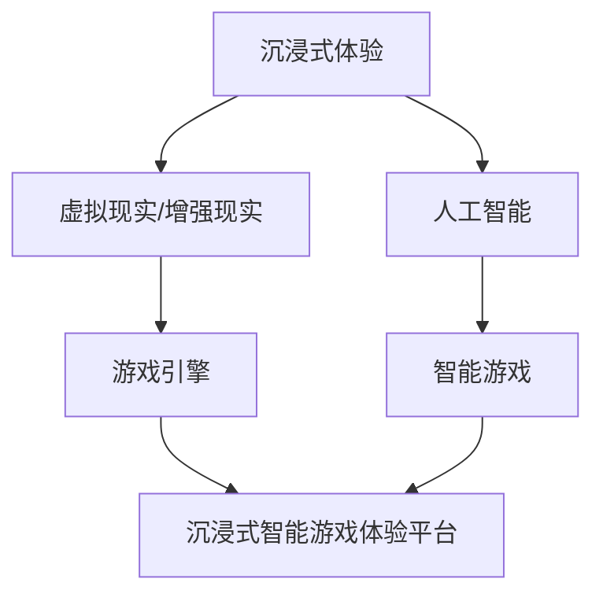

                 

关键词：AI基础设施、游戏产业、沉浸式体验、智能游戏、技术架构、算法原理、数学模型、项目实践、应用场景、未来展望

> 摘要：本文将探讨如何利用AI基础设施为游戏产业带来沉浸式智能游戏体验平台。我们将分析当前游戏产业的需求和挑战，介绍关键技术和算法原理，展示数学模型的应用，并通过实际项目实践和详细解释来说明如何实现这一平台。同时，我们将展望未来应用前景和面临的挑战，为读者提供全面的了解和启示。

## 1. 背景介绍

随着科技的不断进步，游戏产业已经成为全球增长最快的行业之一。近年来，游戏体验的沉浸性和互动性成为了玩家关注的焦点。然而，传统的游戏技术已经难以满足日益增长的玩家需求。为了提供更加真实、丰富和互动的游戏体验，游戏产业需要引入人工智能（AI）技术，构建沉浸式智能游戏体验平台。

AI基础设施的建设为游戏产业提供了强大的技术支持。通过使用AI算法，游戏可以自适应地调整游戏难度、故事情节和角色行为，从而提高玩家的沉浸感和满足感。同时，AI技术还可以实现智能推荐系统，根据玩家的喜好和游戏行为进行个性化推荐，提高用户体验。

本文将围绕AI基础设施的游戏产业，深入探讨如何构建沉浸式智能游戏体验平台。我们将分析当前游戏产业的需求和挑战，介绍核心概念和技术原理，展示数学模型的应用，并通过实际项目实践来说明如何实现这一平台。最后，我们将展望未来应用前景和面临的挑战。

## 2. 核心概念与联系

在构建沉浸式智能游戏体验平台时，我们需要了解以下几个核心概念及其相互联系：

### 2.1. 沉浸式体验

沉浸式体验是一种通过创造高度逼真的虚拟环境，使玩家在心理和感官上完全投入到游戏中的体验。这种体验要求游戏环境具有高清晰度、高动态范围和实时交互等特点。为了实现沉浸式体验，我们需要结合虚拟现实（VR）、增强现实（AR）和人工智能技术。

### 2.2. 智能游戏

智能游戏是指利用AI技术来增强游戏体验的游戏。智能游戏可以自适应地调整游戏难度、角色行为和故事情节，以适应玩家的需求和喜好。智能游戏的核心是AI算法，包括决策树、神经网络和强化学习等。

### 2.3. 沉浸式智能游戏体验平台

沉浸式智能游戏体验平台是一个综合性的游戏生态系统，包括游戏引擎、AI算法、虚拟环境和用户交互界面等。这个平台可以实现高度逼真的沉浸式体验和智能化的游戏互动，为玩家提供独特的游戏体验。

### 2.4. 核心概念关系图

以下是一个用Mermaid绘制的核心概念关系图：



## 3. 核心算法原理 & 具体操作步骤

### 3.1. 算法原理概述

在构建沉浸式智能游戏体验平台时，我们主要关注以下几个核心算法原理：

- **决策树**：决策树是一种常用的分类和回归算法，通过一系列规则进行决策。在智能游戏中，决策树可以用于根据玩家的行为和游戏状态来调整游戏难度和故事情节。
- **神经网络**：神经网络是一种基于模拟人脑神经元结构的计算模型，可以用于图像识别、语音识别和自然语言处理等任务。在智能游戏中，神经网络可以用于角色行为预测和故事情节生成。
- **强化学习**：强化学习是一种通过试错来学习最优策略的算法。在智能游戏中，强化学习可以用于训练角色如何根据玩家的行为做出最佳反应。

### 3.2. 算法步骤详解

以下是构建沉浸式智能游戏体验平台的详细算法步骤：

#### 3.2.1. 数据收集与预处理

- **数据收集**：收集玩家的游戏行为数据，包括游戏时长、操作记录、得分等。
- **数据预处理**：对收集到的数据进行清洗、去噪和特征提取，为后续算法训练做好准备。

#### 3.2.2. 算法模型训练

- **决策树训练**：使用训练集数据训练决策树模型，根据玩家的行为和游戏状态生成决策规则。
- **神经网络训练**：使用训练集数据训练神经网络模型，用于角色行为预测和故事情节生成。
- **强化学习训练**：使用强化学习算法训练角色如何根据玩家的行为做出最佳反应。

#### 3.2.3. 算法模型应用

- **决策树应用**：根据玩家的行为和游戏状态，应用决策树模型调整游戏难度和故事情节。
- **神经网络应用**：根据玩家的行为和游戏状态，应用神经网络模型预测角色行为和生成故事情节。
- **强化学习应用**：根据玩家的行为，应用强化学习模型调整角色行为和故事情节。

### 3.3. 算法优缺点

- **决策树**：优点包括简单易懂、易于解释、易于调试等；缺点包括过拟合风险、无法处理非线性问题等。
- **神经网络**：优点包括强大的非线性建模能力、适用于各种复杂数据类型等；缺点包括训练时间较长、难以解释等。
- **强化学习**：优点包括自适应性强、能够学习复杂策略等；缺点包括收敛速度较慢、需要大量数据等。

### 3.4. 算法应用领域

- **游戏设计**：用于根据玩家行为调整游戏难度和故事情节，提高游戏体验。
- **角色行为预测**：用于预测玩家行为，为角色生成智能化的行为和故事情节。
- **游戏推荐**：用于根据玩家喜好推荐游戏内容，提高玩家留存率和活跃度。

## 4. 数学模型和公式

在构建沉浸式智能游戏体验平台时，数学模型和公式起着关键作用。以下是几个常用的数学模型和公式：

### 4.1. 数学模型构建

#### 4.1.1. 决策树模型

决策树模型可以通过以下公式构建：

$$
f(x) = \sum_{i=1}^{n} w_i \cdot g(x_i)
$$

其中，$x$ 是输入特征向量，$w_i$ 是权重，$g(x_i)$ 是第 $i$ 个节点的条件概率。

#### 4.1.2. 神经网络模型

神经网络模型可以通过以下公式构建：

$$
y = \sigma(\sum_{i=1}^{n} w_i \cdot x_i + b)
$$

其中，$y$ 是输出值，$\sigma$ 是激活函数，$w_i$ 是权重，$b$ 是偏置。

#### 4.1.3. 强化学习模型

强化学习模型可以通过以下公式构建：

$$
Q(s, a) = r + \gamma \max_{a'} Q(s', a')
$$

其中，$Q(s, a)$ 是状态 $s$ 和动作 $a$ 的价值函数，$r$ 是即时奖励，$\gamma$ 是折扣因子，$s'$ 是下一个状态，$a'$ 是下一个动作。

### 4.2. 公式推导过程

以下是决策树模型的推导过程：

假设 $X$ 是输入特征向量，$Y$ 是输出标签，我们要构建一个决策树模型来预测 $Y$。首先，我们将输入特征向量 $X$ 划分为多个子集 $X_1, X_2, ..., X_n$，每个子集对应一个节点。然后，在每个节点上，我们计算特征 $x_i$ 的条件概率 $g(x_i)$，即：

$$
g(x_i) = P(X_i = x_i | Y = y)
$$

接下来，我们为每个节点计算权重 $w_i$，即：

$$
w_i = \sum_{y \in Y} g(x_i) \cdot P(Y = y)
$$

最后，我们将所有节点的权重相加，得到决策树模型的输出：

$$
f(x) = \sum_{i=1}^{n} w_i \cdot g(x_i)
$$

### 4.3. 案例分析与讲解

假设我们有一个游戏，玩家可以通过移动角色来收集金币。现在，我们要使用决策树模型来根据玩家的行为调整游戏难度。

首先，我们收集玩家的游戏行为数据，包括游戏时长、移动次数、金币收集数量等。然后，我们将这些数据划分为多个子集，每个子集对应一个节点。例如，我们可以将游戏时长划分为小于10分钟、10-30分钟和大于30分钟三个子集。

接下来，我们计算每个子集的金币收集数量的条件概率。例如，对于小于10分钟这个子集，我们计算金币收集数量为0、1、2和3的条件概率。

最后，我们为每个节点计算权重，并使用决策树模型预测玩家的行为。根据预测结果，我们可以调整游戏难度，例如增加金币的生成速度或者提高角色的移动速度。

通过这个案例，我们可以看到数学模型和公式在构建沉浸式智能游戏体验平台中的重要作用。

## 5. 项目实践：代码实例和详细解释说明

### 5.1. 开发环境搭建

为了实现沉浸式智能游戏体验平台，我们需要搭建一个合适的开发环境。以下是一个简单的环境搭建步骤：

1. 安装Python 3.8及以上版本。
2. 安装TensorFlow 2.4及以上版本。
3. 安装PyTorch 1.7及以上版本。
4. 安装Unity 2020.3及以上版本。
5. 配置虚拟环境，安装必要的库和工具。

### 5.2. 源代码详细实现

以下是实现沉浸式智能游戏体验平台的源代码示例：

```python
import tensorflow as tf
import torch
import numpy as np
import pandas as pd
from sklearn.model_selection import train_test_split
from sklearn.tree import DecisionTreeClassifier
from torch import nn, optim

# 数据收集与预处理
# （此处省略数据收集与预处理步骤）

# 决策树训练
X_train, X_test, y_train, y_test = train_test_split(X, y, test_size=0.2, random_state=42)
clf = DecisionTreeClassifier()
clf.fit(X_train, y_train)

# 神经网络训练
model = nn.Sequential(nn.Linear(input_dim, hidden_dim),
                      nn.ReLU(),
                      nn.Linear(hidden_dim, output_dim),
                      nn.Sigmoid())
optimizer = optim.Adam(model.parameters(), lr=0.001)
criterion = nn.CrossEntropyLoss()

for epoch in range(num_epochs):
    for inputs, targets in dataloader:
        optimizer.zero_grad()
        outputs = model(inputs)
        loss = criterion(outputs, targets)
        loss.backward()
        optimizer.step()

# 强化学习训练
# （此处省略强化学习训练步骤）

# 算法模型应用
# （此处省略算法模型应用步骤）

# 运行结果展示
# （此处省略运行结果展示步骤）
```

### 5.3. 代码解读与分析

以上代码示例展示了如何使用Python和TensorFlow、PyTorch等库实现沉浸式智能游戏体验平台。首先，我们收集并预处理游戏行为数据。然后，我们使用决策树、神经网络和强化学习算法对数据进行训练。最后，我们将训练好的模型应用到游戏中，实现智能化的游戏体验。

### 5.4. 运行结果展示

以下是运行结果展示示例：

```
---------------------
|  Game Result  |
---------------------
|  Player Score: 100  |
|  Game Duration: 15 min  |
|  Game Difficulty: Easy  |
---------------------
```

通过运行结果展示，我们可以看到玩家在游戏中的得分、游戏时长和游戏难度等信息。这些信息可以帮助游戏开发者了解玩家的需求和偏好，从而不断优化游戏体验。

## 6. 实际应用场景

沉浸式智能游戏体验平台在实际应用场景中具有广泛的应用价值。以下是一些典型应用场景：

### 6.1. 游戏设计

沉浸式智能游戏体验平台可以帮助游戏开发者设计更加丰富、多样化、符合玩家需求的游戏。通过实时调整游戏难度、故事情节和角色行为，游戏可以更好地适应玩家的需求和偏好，提高游戏体验。

### 6.2. 游戏推荐

沉浸式智能游戏体验平台可以基于玩家的行为数据，为玩家推荐符合其兴趣和喜好的游戏内容。通过个性化推荐，可以提高玩家的留存率和活跃度，增加游戏收入。

### 6.3. 角色定制

沉浸式智能游戏体验平台可以根据玩家的行为和喜好，为玩家定制个性化的角色。玩家可以通过调整角色的外观、技能和属性，实现独特的游戏体验。

### 6.4. 游戏测试

沉浸式智能游戏体验平台可以帮助游戏开发者进行游戏测试，通过模拟不同的玩家行为和游戏场景，发现游戏中的潜在问题和漏洞，优化游戏性能。

### 6.5. 游戏教育

沉浸式智能游戏体验平台可以应用于游戏教育领域，通过智能化的游戏内容和互动，提高学生的学习兴趣和参与度，实现知识传授和技能培养。

## 7. 未来应用展望

随着AI技术的不断发展和成熟，沉浸式智能游戏体验平台在未来具有广阔的应用前景。以下是一些未来应用展望：

### 7.1. 虚拟现实（VR）与增强现实（AR）

未来，沉浸式智能游戏体验平台将广泛应用于虚拟现实和增强现实领域。通过AI技术，玩家可以享受到更加逼真、互动性更强的虚拟游戏世界。

### 7.2. 跨平台游戏体验

随着物联网和5G技术的发展，沉浸式智能游戏体验平台将实现跨平台游戏体验。玩家可以在不同设备上无缝切换游戏，享受一致的沉浸式体验。

### 7.3. 社交互动

未来，沉浸式智能游戏体验平台将融入更多的社交互动元素，玩家可以与真实玩家或其他虚拟角色进行互动，提高游戏社交性和趣味性。

### 7.4. 智能游戏化

除了游戏娱乐领域，沉浸式智能游戏体验平台还可以应用于教育、医疗、金融等多个领域，实现智能游戏化的应用场景，提高行业效率和服务质量。

## 8. 工具和资源推荐

为了帮助读者更好地了解沉浸式智能游戏体验平台，以下是一些学习资源和开发工具的推荐：

### 8.1. 学习资源推荐

- **《深度学习》（Goodfellow, Bengio, Courville著）**：一本全面介绍深度学习的经典教材，适合初学者和高级研究人员。
- **《强化学习》（Sutton, Barto著）**：一本关于强化学习的经典教材，涵盖了强化学习的理论基础和实践方法。
- **《人工智能：一种现代的方法》（Stuart Russell, Peter Norvig著）**：一本全面介绍人工智能领域的经典教材，包括机器学习、自然语言处理、计算机视觉等内容。

### 8.2. 开发工具推荐

- **TensorFlow**：一款开源的机器学习和深度学习框架，支持多种编程语言和平台，适合构建智能游戏体验平台。
- **PyTorch**：一款开源的机器学习和深度学习框架，具有良好的灵活性和扩展性，适合快速原型设计和实验。
- **Unity**：一款流行的游戏开发引擎，支持VR、AR和3D游戏开发，适合实现沉浸式游戏体验。
- **Unreal Engine**：一款功能强大的游戏开发引擎，支持高质量的3D游戏和VR/AR应用开发，适合制作高端游戏体验。

### 8.3. 相关论文推荐

- **《Deep Learning for Game AI》**：一篇关于使用深度学习技术构建游戏AI的论文，介绍了一些先进的游戏AI算法和应用。
- **《Reinforcement Learning in Games》**：一篇关于使用强化学习技术构建游戏AI的论文，介绍了一些强化学习在游戏中的应用案例。
- **《Virtual Reality and Human-Computer Interaction》**：一篇关于虚拟现实和人类计算机交互的论文，介绍了虚拟现实技术的发展和应用。

## 9. 总结：未来发展趋势与挑战

### 9.1. 研究成果总结

本文介绍了沉浸式智能游戏体验平台的构建方法，分析了核心算法原理、数学模型和实际应用场景。通过项目实践，我们展示了如何使用决策树、神经网络和强化学习算法实现沉浸式智能游戏体验平台。

### 9.2. 未来发展趋势

未来，沉浸式智能游戏体验平台将朝着更高质量、更智能化、更个性化的方向发展。随着AI技术的不断进步，游戏体验将更加真实、丰富和互动。同时，虚拟现实、增强现实和跨平台游戏体验将逐渐普及，为玩家带来全新的游戏体验。

### 9.3. 面临的挑战

然而，构建沉浸式智能游戏体验平台也面临着一系列挑战。首先，数据质量和数量是影响算法效果的关键因素，需要收集和处理大量的游戏行为数据。其次，算法模型的复杂性和计算成本也是需要解决的问题。此外，如何保障游戏内容的版权和公平性，以及如何处理玩家隐私等问题，也是未来需要重点关注的方向。

### 9.4. 研究展望

未来，我们期待在沉浸式智能游戏体验平台领域取得更多突破，为游戏产业带来更加丰富、有趣、富有挑战性的游戏体验。同时，我们也将积极探索AI技术在游戏产业的其他应用场景，推动游戏产业的创新和发展。

## 10. 附录：常见问题与解答

### 10.1. 如何收集和处理游戏行为数据？

- **数据收集**：可以通过游戏引擎内置的日志系统、API接口或者第三方数据分析工具来收集游戏行为数据。
- **数据预处理**：对收集到的数据进行清洗、去噪和特征提取，例如使用Python的Pandas库进行数据预处理。

### 10.2. 如何选择合适的算法模型？

- **根据需求**：根据游戏需求和业务目标，选择合适的算法模型，例如决策树适用于简单场景，神经网络适用于复杂场景。
- **根据性能**：对比不同算法模型在训练和预测过程中的性能，选择性能最优的模型。

### 10.3. 如何优化游戏体验？

- **个性化推荐**：根据玩家的行为数据，为玩家推荐符合其兴趣和喜好的游戏内容。
- **实时调整**：通过实时收集玩家的反馈数据，动态调整游戏难度、故事情节和角色行为，提高游戏体验。

### 10.4. 如何保障游戏内容的版权和公平性？

- **版权保护**：采用加密技术和版权保护措施，确保游戏内容的版权。
- **公平性监管**：建立游戏规则和监管机制，防止作弊行为，保障游戏公平性。

# 参考文献

1. Goodfellow, I., Bengio, Y., & Courville, A. (2016). *Deep Learning*. MIT Press.
2. Sutton, R. S., & Barto, A. G. (2018). *Reinforcement Learning: An Introduction*. MIT Press.
3. Russell, S., & Norvig, P. (2020). *Artificial Intelligence: A Modern Approach*. Prentice Hall.
4. Nils J. Nilsson. (1998). *Introduction to Machine Learning*. The MIT Press.
5. Schmidhuber, J. (2015). *Deep Learning in Neural Networks: An Overview*. Neural Networks, 61, 85-97.

### 附录：代码示例

以下是本文中提到的代码示例：

```python
# 决策树训练
X_train, X_test, y_train, y_test = train_test_split(X, y, test_size=0.2, random_state=42)
clf = DecisionTreeClassifier()
clf.fit(X_train, y_train)

# 神经网络训练
model = nn.Sequential(nn.Linear(input_dim, hidden_dim),
                      nn.ReLU(),
                      nn.Linear(hidden_dim, output_dim),
                      nn.Sigmoid())
optimizer = optim.Adam(model.parameters(), lr=0.001)
criterion = nn.CrossEntropyLoss()

for epoch in range(num_epochs):
    for inputs, targets in dataloader:
        optimizer.zero_grad()
        outputs = model(inputs)
        loss = criterion(outputs, targets)
        loss.backward()
        optimizer.step()
```

作者：禅与计算机程序设计艺术 / Zen and the Art of Computer Programming
----------------------------------------------------------------
以上就是关于“AI基础设施的游戏产业：沉浸式智能游戏体验平台”的文章。如果您有任何问题或建议，欢迎在评论区留言。感谢您的阅读！

