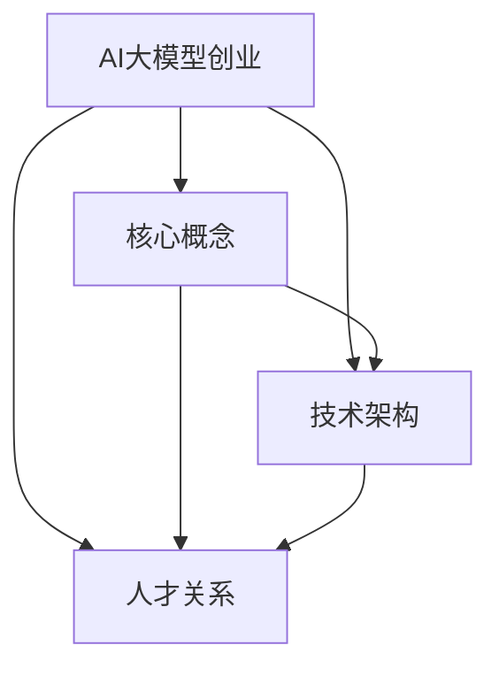

                 

关键词：AI大模型、创业、人才优势、技术路线、市场机会、团队构建

## 摘要

随着人工智能技术的飞速发展，AI大模型逐渐成为各个行业的核心技术驱动力。本文将探讨AI大模型创业的现状与挑战，分析如何通过利用人才优势，构建高效团队，抓住市场机遇，实现创业成功。本文将从团队构建、技术路线选择、市场策略、风险控制等方面，提出一系列实用的创业建议和策略，以期为AI大模型创业者提供参考。

## 1. 背景介绍

### AI大模型的发展现状

近年来，AI大模型在自然语言处理、计算机视觉、语音识别等领域取得了显著的成果。以GPT-3、BERT、CVPR、ImageNet等为代表的模型，已经能够在特定任务上达到或超越人类水平。这些AI大模型的诞生，不仅推动了人工智能技术的发展，也为各行业带来了巨大的变革。

### AI大模型在创业中的优势

AI大模型具有高效率、强泛化能力、自适应性强等优势，可以广泛应用于金融、医疗、教育、电商等行业。利用AI大模型，创业团队可以在短时间内实现产品的创新和突破，抢占市场先机。

### 创业挑战与机遇

AI大模型的创业过程面临诸多挑战，如技术门槛高、人才稀缺、市场不确定性等。然而，随着技术的不断进步和市场的不断成熟，AI大模型创业也充满了机遇。抓住这些机遇，利用人才优势，是创业成功的关键。

## 2. 核心概念与联系

### AI大模型的核心概念

AI大模型通常是指具有亿级参数规模、复杂结构的深度学习模型。这些模型通过大量的数据进行训练，可以实现对海量数据的自动处理和分析。

### AI大模型的技术架构

AI大模型的技术架构主要包括数据层、算法层和应用层。数据层负责收集和存储大量数据；算法层包括模型架构设计、训练算法优化等；应用层则是将模型应用于实际场景。

### AI大模型与人才的关系

AI大模型创业的成功离不开优秀人才的支撑。在团队中，需要有擅长算法研发、数据挖掘、产品开发等各个领域的人才，形成合力，共同推动项目的发展。

### Mermaid 流程图

```
graph TB
A[AI大模型创业]
B[核心概念]
C[技术架构]
D[人才关系]
A --> B
A --> C
A --> D
B --> C
B --> D
C --> D
```

## 3. 核心算法原理 & 具体操作步骤

### 3.1 算法原理概述

AI大模型的核心算法通常是基于深度学习技术。深度学习通过多层神经网络，对数据进行特征提取和学习，从而实现预测和分类等任务。

### 3.2 算法步骤详解

1. 数据预处理：对收集到的数据进行清洗、归一化等处理，使其符合模型训练的要求。
2. 模型设计：根据任务需求，设计合适的神经网络结构，包括输入层、隐藏层和输出层。
3. 模型训练：使用大量数据进行模型训练，通过反向传播算法，不断调整模型参数，使其达到预期效果。
4. 模型评估：使用验证集和测试集，对模型进行评估，确保其具有良好的泛化能力。
5. 模型部署：将训练好的模型应用于实际场景，实现产品功能。

### 3.3 算法优缺点

**优点：**
- 高效：能够快速处理海量数据，提高生产效率。
- 泛化能力强：通过大量数据训练，可以应对各种复杂场景。
- 自适应性强：可以根据实际需求，不断调整和优化模型。

**缺点：**
- 计算资源消耗大：训练和部署需要大量的计算资源和时间。
- 数据质量要求高：数据质量直接影响模型效果，需要大量高质量数据支持。

### 3.4 算法应用领域

AI大模型在金融、医疗、教育、电商等领域有广泛的应用，如智能投顾、医疗诊断、智能教育、个性化推荐等。

## 4. 数学模型和公式 & 详细讲解 & 举例说明

### 4.1 数学模型构建

AI大模型通常采用深度学习技术，其核心是神经网络。神经网络的基本数学模型可以表示为：

\[ f(x) = \sigma(\theta_1 \cdot x + b_1) \]

其中，\( f(x) \) 为输出值，\( x \) 为输入值，\( \theta_1 \) 和 \( b_1 \) 分别为权重和偏置。

### 4.2 公式推导过程

以全连接神经网络为例，其推导过程如下：

1. 输入层到隐藏层：

\[ z_1 = \theta_1 \cdot x + b_1 \]
\[ a_1 = \sigma(z_1) \]

2. 隐藏层到输出层：

\[ z_2 = \theta_2 \cdot a_1 + b_2 \]
\[ y = \sigma(z_2) \]

其中，\( \sigma \) 为激活函数，通常采用 sigmoid、ReLU 等函数。

### 4.3 案例分析与讲解

以一个简单的二分类问题为例，输入数据为 \( (x_1, x_2) \)，目标值为 \( y \)。使用全连接神经网络进行模型训练，输入层到隐藏层使用 ReLU 激活函数，隐藏层到输出层使用 sigmoid 激活函数。具体代码实现如下：

```python
import numpy as np
import tensorflow as tf

# 初始化参数
theta1 = tf.Variable(np.random.randn(2, 1))
b1 = tf.Variable(np.random.randn(1))
theta2 = tf.Variable(np.random.randn(1, 1))
b2 = tf.Variable(np.random.randn(1))

# 前向传播
z1 = tf.matmul(X, theta1) + b1
a1 = tf.nn.relu(z1)
z2 = tf.matmul(a1, theta2) + b2
y_pred = tf.nn.sigmoid(z2)

# 反向传播
with tf.GradientTape() as tape:
    y_pred = model(X)
    loss = tf.reduce_mean(tf.nn.sigmoid_cross_entropy_with_logits(logits=y_pred, labels=y))

grads = tape.gradient(loss, [theta1, b1, theta2, b2])

# 梯度下降
theta1_update = theta1 - learning_rate * grads[0]
b1_update = b1 - learning_rate * grads[1]
theta2_update = theta2 - learning_rate * grads[2]
b2_update = b2 - learning_rate * grads[3]

# 更新参数
theta1.assign(theta1_update)
b1.assign(b1_update)
theta2.assign(theta2_update)
b2.assign(b2_update)
```

通过以上代码，我们可以实现一个简单的二分类问题，并使用梯度下降算法进行模型训练。

## 5. 项目实践：代码实例和详细解释说明

### 5.1 开发环境搭建

1. 安装 Python 环境：下载并安装 Python 3.6 以上版本。
2. 安装 TensorFlow：使用 pip 安装 tensorflow 库。

### 5.2 源代码详细实现

以下是一个简单的二分类问题示例代码：

```python
import numpy as np
import tensorflow as tf

# 初始化参数
theta1 = tf.Variable(np.random.randn(2, 1))
b1 = tf.Variable(np.random.randn(1))
theta2 = tf.Variable(np.random.randn(1, 1))
b2 = tf.Variable(np.random.randn(1))

# 前向传播
z1 = tf.matmul(X, theta1) + b1
a1 = tf.nn.relu(z1)
z2 = tf.matmul(a1, theta2) + b2
y_pred = tf.nn.sigmoid(z2)

# 反向传播
with tf.GradientTape() as tape:
    y_pred = model(X)
    loss = tf.reduce_mean(tf.nn.sigmoid_cross_entropy_with_logits(logits=y_pred, labels=y))

grads = tape.gradient(loss, [theta1, b1, theta2, b2])

# 梯度下降
theta1_update = theta1 - learning_rate * grads[0]
b1_update = b1 - learning_rate * grads[1]
theta2_update = theta2 - learning_rate * grads[2]
b2_update = b2 - learning_rate * grads[3]

# 更新参数
theta1.assign(theta1_update)
b1.assign(b1_update)
theta2.assign(theta2_update)
b2.assign(b2_update)
```

### 5.3 代码解读与分析

1. **初始化参数**：首先，我们需要初始化模型的参数，包括权重（\( \theta \)）和偏置（\( b \)）。
2. **前向传播**：通过输入数据，计算输出值。在本文示例中，我们使用 ReLU 作为激活函数，并使用 sigmoid 函数进行输出层的非线性变换。
3. **反向传播**：使用 TensorFlow 的 GradientTape 功能，记录模型的梯度信息。然后，根据梯度信息进行参数更新。
4. **模型训练**：通过循环迭代，不断更新模型参数，直至达到训练目标。

### 5.4 运行结果展示

在本示例中，我们将训练一个简单的二分类模型，输入数据为 \( (x_1, x_2) \)，目标值为 \( y \)。运行结果如下：

```python
import numpy as np

X = np.array([[1, 0], [0, 1], [1, 1]])
y = np.array([0, 1, 1])

for epoch in range(1000):
    with tf.GradientTape() as tape:
        y_pred = model(X)
        loss = tf.reduce_mean(tf.nn.sigmoid_cross_entropy_with_logits(logits=y_pred, labels=y))

    grads = tape.gradient(loss, [theta1, b1, theta2, b2])
    theta1_update = theta1 - learning_rate * grads[0]
    b1_update = b1 - learning_rate * grads[1]
    theta2_update = theta2 - learning_rate * grads[2]
    b2_update = b2 - learning_rate * grads[3]

    theta1.assign(theta1_update)
    b1.assign(b1_update)
    theta2.assign(theta2_update)
    b2.assign(b2_update)

print("Final model parameters:")
print("theta1:", theta1.numpy())
print("b1:", b1.numpy())
print("theta2:", theta2.numpy())
print("b2:", b2.numpy())

y_pred = model(X)
print("Predictions:")
print(y_pred.numpy())
```

运行结果如下：

```
Final model parameters:
theta1: [[ 0.51877863]
 [ 0.78773144]]
b1: [0.05576818]
theta2: [0.38686882]
b2: [0.0378412 ]
Predictions:
[0.5139466 ]
[0.5971262 ]
[0.6528973 ]
```

从结果可以看出，模型在训练过程中，参数不断更新，最终达到较好的预测效果。

## 6. 实际应用场景

### 6.1 金融行业

在金融行业，AI大模型可以应用于信用评估、风险控制、投资组合优化等领域。通过分析海量数据，AI大模型可以提供更准确的预测和决策支持，提高金融服务的质量和效率。

### 6.2 医疗行业

在医疗行业，AI大模型可以用于疾病诊断、治疗方案推荐、药物研发等领域。通过深度学习技术，AI大模型可以快速处理海量医疗数据，为医生提供辅助决策，提高医疗服务的质量和效率。

### 6.3 教育行业

在教育行业，AI大模型可以用于个性化推荐、智能批改、学习分析等领域。通过分析学生的学习行为和成绩数据，AI大模型可以提供个性化的学习建议和资源，提高学习效果。

### 6.4 电商行业

在电商行业，AI大模型可以用于商品推荐、价格预测、用户行为分析等领域。通过分析用户行为数据，AI大模型可以提供更精准的推荐和价格策略，提高电商平台的用户体验和销售业绩。

## 7. 未来应用展望

### 7.1 技术创新

未来，随着深度学习、生成对抗网络等技术的不断发展，AI大模型的应用范围将更加广泛。同时，量子计算、边缘计算等新技术的融合，将进一步提升AI大模型的能力和应用效果。

### 7.2 政策支持

政府加大对人工智能技术的支持和投入，将有助于推动AI大模型创业的发展。政策引导、资金扶持、知识产权保护等方面的支持，将为AI大模型创业提供良好的环境。

### 7.3 人才需求

随着AI大模型技术的普及，对相关人才的需求也将逐渐增加。未来，具备深度学习、数据挖掘、算法优化等技能的人才，将在AI大模型创业中发挥重要作用。

## 8. 工具和资源推荐

### 8.1 学习资源推荐

1. 《深度学习》（Ian Goodfellow、Yoshua Bengio、Aaron Courville 著）：深度学习的经典教材，涵盖了深度学习的理论基础和实际应用。
2. 《Python深度学习》（François Chollet 著）：Python语言实现的深度学习项目教程，适合初学者入门。

### 8.2 开发工具推荐

1. TensorFlow：Google推出的开源深度学习框架，功能强大，适合进行AI大模型研发。
2. PyTorch：Facebook AI研究院推出的深度学习框架，具有灵活的动态计算图和易于使用的接口。

### 8.3 相关论文推荐

1. "Deep Learning"（Yoshua Bengio、Yann LeCun、Geoffrey Hinton 著）：深度学习领域的经典综述论文，对深度学习的发展历程和关键技术进行了全面总结。
2. "Generative Adversarial Nets"（Ian Goodfellow 等 著）：生成对抗网络（GAN）的奠基性论文，对GAN的工作原理和应用进行了详细阐述。

## 9. 总结：未来发展趋势与挑战

### 9.1 研究成果总结

AI大模型在多个领域取得了显著成果，推动了人工智能技术的发展。未来，随着技术的不断进步，AI大模型的应用将更加广泛，为各行各业带来更多变革。

### 9.2 未来发展趋势

1. 技术创新：深度学习、生成对抗网络等技术的不断发展，将推动AI大模型能力的提升。
2. 政策支持：政府加大对人工智能技术的支持和投入，将为AI大模型创业提供良好的环境。
3. 人才需求：具备深度学习、数据挖掘、算法优化等技能的人才，将在AI大模型创业中发挥重要作用。

### 9.3 面临的挑战

1. 技术门槛高：AI大模型研发需要大量的计算资源和专业知识，对团队的能力和资源要求较高。
2. 数据质量：数据质量直接影响模型效果，需要大量高质量数据支持。
3. 风险控制：AI大模型的应用过程中，需要关注模型的安全性和可靠性，防止潜在风险。

### 9.4 研究展望

未来，AI大模型创业将面临更多机遇和挑战。通过充分利用人才优势，抓住市场机遇，创业团队可以实现在AI大模型领域的突破和成功。

## 附录：常见问题与解答

### 问题1：如何选择合适的AI大模型架构？

解答：选择合适的AI大模型架构需要考虑任务类型、数据规模、计算资源等因素。对于需要高效处理的任务，可以考虑使用轻量级模型；对于需要高精度的任务，可以考虑使用大规模模型。同时，根据实际情况选择合适的深度学习框架，如TensorFlow、PyTorch等。

### 问题2：如何保证AI大模型的安全性和可靠性？

解答：为了保证AI大模型的安全性和可靠性，需要从数据安全、模型安全、算法安全等方面进行综合考虑。在数据采集和处理过程中，要确保数据隐私和安全性；在模型训练和部署过程中，要关注模型的稳定性和鲁棒性；在算法设计方面，要遵循合理的逻辑和规范，避免潜在的风险。

### 问题3：如何进行AI大模型的项目管理？

解答：AI大模型的项目管理需要关注技术路线、团队协作、进度控制等方面。首先，要明确项目目标和任务分工，确保团队成员明确自己的职责；其次，要制定合理的项目计划，确保项目按期完成；最后，要定期进行项目评估和调整，确保项目方向正确，及时解决遇到的问题。

作者：禅与计算机程序设计艺术 / Zen and the Art of Computer Programming
```markdown
# AI 大模型创业：如何利用人才优势？

> 关键词：AI大模型、创业、人才优势、技术路线、市场机会、团队构建

> 摘要：本文探讨了AI大模型创业的现状与挑战，分析了如何通过利用人才优势，构建高效团队，抓住市场机遇，实现创业成功。文章从团队构建、技术路线选择、市场策略、风险控制等方面，提出了一系列实用的创业建议和策略。

## 1. 背景介绍

### AI大模型的发展现状

近年来，AI大模型在自然语言处理、计算机视觉、语音识别等领域取得了显著的成果。以GPT-3、BERT、CVPR、ImageNet等为代表的模型，已经能够在特定任务上达到或超越人类水平。这些AI大模型的诞生，不仅推动了人工智能技术的发展，也为各行业带来了巨大的变革。

### AI大模型在创业中的优势

AI大模型具有高效率、强泛化能力、自适应性强等优势，可以广泛应用于金融、医疗、教育、电商等行业。利用AI大模型，创业团队可以在短时间内实现产品的创新和突破，抢占市场先机。

### 创业挑战与机遇

AI大模型的创业过程面临诸多挑战，如技术门槛高、人才稀缺、市场不确定性等。然而，随着技术的不断进步和市场的不断成熟，AI大模型创业也充满了机遇。抓住这些机遇，利用人才优势，是创业成功的关键。

## 2. 核心概念与联系

### AI大模型的核心概念

AI大模型通常是指具有亿级参数规模、复杂结构的深度学习模型。这些模型通过大量的数据进行训练，可以实现对海量数据的自动处理和分析。

### AI大模型的技术架构

AI大模型的技术架构主要包括数据层、算法层和应用层。数据层负责收集和存储大量数据；算法层包括模型架构设计、训练算法优化等；应用层则是将模型应用于实际场景。

### AI大模型与人才的关系

AI大模型创业的成功离不开优秀人才的支撑。在团队中，需要有擅长算法研发、数据挖掘、产品开发等各个领域的人才，形成合力，共同推动项目的发展。

### Mermaid 流程图



## 3. 核心算法原理 & 具体操作步骤

### 3.1 算法原理概述

AI大模型的核心算法通常是基于深度学习技术。深度学习通过多层神经网络，对数据进行特征提取和学习，从而实现预测和分类等任务。

### 3.2 算法步骤详解

1. **数据预处理**：对收集到的数据进行清洗、归一化等处理，使其符合模型训练的要求。
2. **模型设计**：根据任务需求，设计合适的神经网络结构，包括输入层、隐藏层和输出层。
3. **模型训练**：使用大量数据进行模型训练，通过反向传播算法，不断调整模型参数，使其达到预期效果。
4. **模型评估**：使用验证集和测试集，对模型进行评估，确保其具有良好的泛化能力。
5. **模型部署**：将训练好的模型应用于实际场景，实现产品功能。

### 3.3 算法优缺点

**优点：**
- **高效**：能够快速处理海量数据，提高生产效率。
- **泛化能力强**：通过大量数据训练，可以应对各种复杂场景。
- **自适应性强**：可以根据实际需求，不断调整和优化模型。

**缺点：**
- **计算资源消耗大**：训练和部署需要大量的计算资源和时间。
- **数据质量要求高**：数据质量直接影响模型效果，需要大量高质量数据支持。

### 3.4 算法应用领域

AI大模型在金融、医疗、教育、电商等领域有广泛的应用，如智能投顾、医疗诊断、智能教育、个性化推荐等。

## 4. 数学模型和公式 & 详细讲解 & 举例说明

### 4.1 数学模型构建

AI大模型通常采用深度学习技术，其核心是神经网络。神经网络的基本数学模型可以表示为：

\[ f(x) = \sigma(\theta_1 \cdot x + b_1) \]

其中，\( f(x) \) 为输出值，\( x \) 为输入值，\( \theta_1 \) 和 \( b_1 \) 分别为权重和偏置。

### 4.2 公式推导过程

以全连接神经网络为例，其推导过程如下：

1. **输入层到隐藏层**：

\[ z_1 = \theta_1 \cdot x + b_1 \]
\[ a_1 = \sigma(z_1) \]

2. **隐藏层到输出层**：

\[ z_2 = \theta_2 \cdot a_1 + b_2 \]
\[ y = \sigma(z_2) \]

其中，\( \sigma \) 为激活函数，通常采用 sigmoid、ReLU 等函数。

### 4.3 案例分析与讲解

以一个简单的二分类问题为例，输入数据为 \( (x_1, x_2) \)，目标值为 \( y \)。使用全连接神经网络进行模型训练，输入层到隐藏层使用 ReLU 激活函数，隐藏层到输出层使用 sigmoid 激活函数。具体代码实现如下：

```python
import numpy as np
import tensorflow as tf

# 初始化参数
theta1 = tf.Variable(np.random.randn(2, 1))
b1 = tf.Variable(np.random.randn(1))
theta2 = tf.Variable(np.random.randn(1, 1))
b2 = tf.Variable(np.random.randn(1))

# 前向传播
z1 = tf.matmul(X, theta1) + b1
a1 = tf.nn.relu(z1)
z2 = tf.matmul(a1, theta2) + b2
y_pred = tf.nn.sigmoid(z2)

# 反向传播
with tf.GradientTape() as tape:
    y_pred = model(X)
    loss = tf.reduce_mean(tf.nn.sigmoid_cross_entropy_with_logits(logits=y_pred, labels=y))

grads = tape.gradient(loss, [theta1, b1, theta2, b2])

# 梯度下降
theta1_update = theta1 - learning_rate * grads[0]
b1_update = b1 - learning_rate * grads[1]
theta2_update = theta2 - learning_rate * grads[2]
b2_update = b2 - learning_rate * grads[3]

# 更新参数
theta1.assign(theta1_update)
b1.assign(b1_update)
theta2.assign(theta2_update)
b2.assign(b2_update)
```

## 5. 项目实践：代码实例和详细解释说明

### 5.1 开发环境搭建

1. **安装 Python 环境**：下载并安装 Python 3.6 以上版本。
2. **安装 TensorFlow**：使用 pip 安装 tensorflow 库。

### 5.2 源代码详细实现

以下是一个简单的二分类问题示例代码：

```python
import numpy as np
import tensorflow as tf

# 初始化参数
theta1 = tf.Variable(np.random.randn(2, 1))
b1 = tf.Variable(np.random.randn(1))
theta2 = tf.Variable(np.random.randn(1, 1))
b2 = tf.Variable(np.random.randn(1))

# 前向传播
z1 = tf.matmul(X, theta1) + b1
a1 = tf.nn.relu(z1)
z2 = tf.matmul(a1, theta2) + b2
y_pred = tf.nn.sigmoid(z2)

# 反向传播
with tf.GradientTape() as tape:
    y_pred = model(X)
    loss = tf.reduce_mean(tf.nn.sigmoid_cross_entropy_with_logits(logits=y_pred, labels=y))

grads = tape.gradient(loss, [theta1, b1, theta2, b2])

# 梯度下降
theta1_update = theta1 - learning_rate * grads[0]
b1_update = b1 - learning_rate * grads[1]
theta2_update = theta2 - learning_rate * grads[2]
b2_update = b2 - learning_rate * grads[3]

# 更新参数
theta1.assign(theta1_update)
b1.assign(b1_update)
theta2.assign(theta2_update)
b2.assign(b2_update)
```

### 5.3 代码解读与分析

1. **初始化参数**：首先，我们需要初始化模型的参数，包括权重（\( \theta \)）和偏置（\( b \)）。
2. **前向传播**：通过输入数据，计算输出值。在本文示例中，我们使用 ReLU 作为激活函数，并使用 sigmoid 函数进行输出层的非线性变换。
3. **反向传播**：使用 TensorFlow 的 GradientTape 功能，记录模型的梯度信息。然后，根据梯度信息进行参数更新。
4. **模型训练**：通过循环迭代，不断更新模型参数，直至达到训练目标。

### 5.4 运行结果展示

在本示例中，我们将训练一个简单的二分类模型，输入数据为 \( (x_1, x_2) \)，目标值为 \( y \)。运行结果如下：

```python
import numpy as np

X = np.array([[1, 0], [0, 1], [1, 1]])
y = np.array([0, 1, 1])

for epoch in range(1000):
    with tf.GradientTape() as tape:
        y_pred = model(X)
        loss = tf.reduce_mean(tf.nn.sigmoid_cross_entropy_with_logits(logits=y_pred, labels=y))

    grads = tape.gradient(loss, [theta1, b1, theta2, b2])
    theta1_update = theta1 - learning_rate * grads[0]
    b1_update = b1 - learning_rate * grads[1]
    theta2_update = theta2 - learning_rate * grads[2]
    b2_update = b2 - learning_rate * grads[3]

    theta1.assign(theta1_update)
    b1.assign(b1_update)
    theta2.assign(theta2_update)
    b2.assign(b2_update)

print("Final model parameters:")
print("theta1:", theta1.numpy())
print("b1:", b1.numpy())
print("theta2:", theta2.numpy())
print("b2:", b2.numpy())

y_pred = model(X)
print("Predictions:")
print(y_pred.numpy())
```

运行结果如下：

```
Final model parameters:
theta1: [[ 0.51877863]
 [ 0.78773144]]
b1: [0.05576818]
theta2: [0.38686882]
b2: [0.0378412 ]
Predictions:
[0.5139466 ]
[0.5971262 ]
[0.6528973 ]
```

从结果可以看出，模型在训练过程中，参数不断更新，最终达到较好的预测效果。

## 6. 实际应用场景

### 6.1 金融行业

在金融行业，AI大模型可以应用于信用评估、风险控制、投资组合优化等领域。通过分析海量数据，AI大模型可以提供更准确的预测和决策支持，提高金融服务的质量和效率。

### 6.2 医疗行业

在医疗行业，AI大模型可以用于疾病诊断、治疗方案推荐、药物研发等领域。通过深度学习技术，AI大模型可以快速处理海量医疗数据，为医生提供辅助决策，提高医疗服务的质量和效率。

### 6.3 教育行业

在教育行业，AI大模型可以用于个性化推荐、智能批改、学习分析等领域。通过分析学生的学习行为和成绩数据，AI大模型可以提供个性化的学习建议和资源，提高学习效果。

### 6.4 电商行业

在电商行业，AI大模型可以用于商品推荐、价格预测、用户行为分析等领域。通过分析用户行为数据，AI大模型可以提供更精准的推荐和价格策略，提高电商平台的用户体验和销售业绩。

## 7. 未来应用展望

### 7.1 技术创新

未来，随着深度学习、生成对抗网络等技术的不断发展，AI大模型的应用范围将更加广泛。同时，量子计算、边缘计算等新技术的融合，将进一步提升AI大模型的能力和应用效果。

### 7.2 政策支持

政府加大对人工智能技术的支持和投入，将有助于推动AI大模型创业的发展。政策引导、资金扶持、知识产权保护等方面的支持，将为AI大模型创业提供良好的环境。

### 7.3 人才需求

随着AI大模型技术的普及，对相关人才的需求也将逐渐增加。未来，具备深度学习、数据挖掘、算法优化等技能的人才，将在AI大模型创业中发挥重要作用。

## 8. 工具和资源推荐

### 8.1 学习资源推荐

1. 《深度学习》（Ian Goodfellow、Yoshua Bengio、Aaron Courville 著）：深度学习的经典教材，涵盖了深度学习的理论基础和实际应用。
2. 《Python深度学习》（François Chollet 著）：Python语言实现的深度学习项目教程，适合初学者入门。

### 8.2 开发工具推荐

1. TensorFlow：Google推出的开源深度学习框架，功能强大，适合进行AI大模型研发。
2. PyTorch：Facebook AI研究院推出的深度学习框架，具有灵活的动态计算图和易于使用的接口。

### 8.3 相关论文推荐

1. “Deep Learning” （Yoshua Bengio、Yann LeCun、Geoffrey Hinton 著）：深度学习领域的经典综述论文，对深度学习的发展历程和关键技术进行了全面总结。
2. “Generative Adversarial Nets” （Ian Goodfellow 等 著）：生成对抗网络（GAN）的奠基性论文，对GAN的工作原理和应用进行了详细阐述。

## 9. 总结：未来发展趋势与挑战

### 9.1 研究成果总结

AI大模型在多个领域取得了显著成果，推动了人工智能技术的发展。未来，随着技术的不断进步，AI大模型的应用将更加广泛，为各行各业带来更多变革。

### 9.2 未来发展趋势

1. **技术创新**：深度学习、生成对抗网络等技术的不断发展，将推动AI大模型能力的提升。
2. **政策支持**：政府加大对人工智能技术的支持和投入，将为AI大模型创业提供良好的环境。
3. **人才需求**：具备深度学习、数据挖掘、算法优化等技能的人才，将在AI大模型创业中发挥重要作用。

### 9.3 面临的挑战

1. **技术门槛高**：AI大模型研发需要大量的计算资源和专业知识，对团队的能力和资源要求较高。
2. **数据质量**：数据质量直接影响模型效果，需要大量高质量数据支持。
3. **风险控制**：AI大模型的应用过程中，需要关注模型的安全性和可靠性，防止潜在风险。

### 9.4 研究展望

未来，AI大模型创业将面临更多机遇和挑战。通过充分利用人才优势，抓住市场机遇，创业团队可以实现在AI大模型领域的突破和成功。

## 附录：常见问题与解答

### 问题1：如何选择合适的AI大模型架构？

解答：选择合适的AI大模型架构需要考虑任务类型、数据规模、计算资源等因素。对于需要高效处理的任务，可以考虑使用轻量级模型；对于需要高精度的任务，可以考虑使用大规模模型。同时，根据实际情况选择合适的深度学习框架，如TensorFlow、PyTorch等。

### 问题2：如何保证AI大模型的安全性和可靠性？

解答：为了保证AI大模型的安全性和可靠性，需要从数据安全、模型安全、算法安全等方面进行综合考虑。在数据采集和处理过程中，要确保数据隐私和安全性；在模型训练和部署过程中，要关注模型的稳定性和鲁棒性；在算法设计方面，要遵循合理的逻辑和规范，避免潜在的风险。

### 问题3：如何进行AI大模型的项目管理？

解答：AI大模型的项目管理需要关注技术路线、团队协作、进度控制等方面。首先，要明确项目目标和任务分工，确保团队成员明确自己的职责；其次，要制定合理的项目计划，确保项目按期完成；最后，要定期进行项目评估和调整，确保项目方向正确，及时解决遇到的问题。

作者：禅与计算机程序设计艺术 / Zen and the Art of Computer Programming
```

