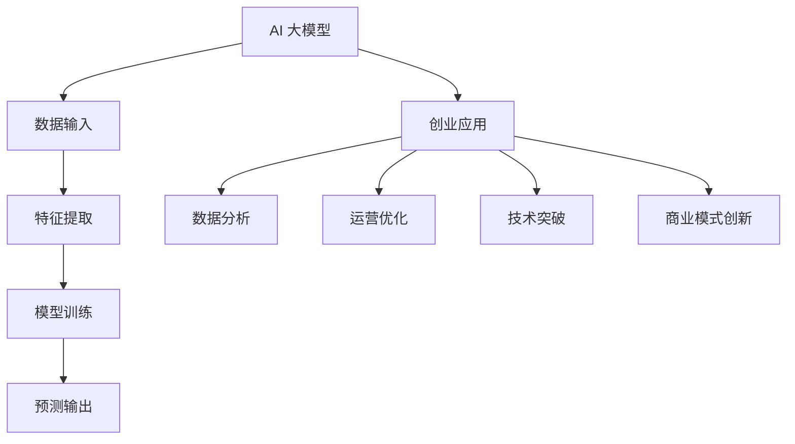

                 

关键词：AI 大模型、创业、创新优势、技术路线、应用场景、未来展望

> 摘要：本文深入探讨了 AI 大模型在创业领域的应用，分析了如何通过创新优势来实现创业成功。文章从技术背景、核心算法、数学模型、项目实践等多个角度，为创业者和开发者提供了全面的指导。

## 1. 背景介绍

近年来，人工智能（AI）技术取得了飞速发展，特别是在深度学习、自然语言处理、计算机视觉等领域。这些技术的突破，使得 AI 大模型成为可能。AI 大模型是指那些拥有海量参数、能够处理复杂数据的神经网络模型。这些模型的出现，为各行各业带来了前所未有的变革机遇。

在创业领域，AI 大模型具有巨大的应用潜力。创业公司可以利用 AI 大模型进行数据分析和决策，提高运营效率，创造新的商业模式。此外，AI 大模型还可以帮助创业者解决技术难题，提升产品竞争力。

### 当前 AI 大模型的发展现状

AI 大模型的发展现状可以分为以下几个阶段：

1. **数据积累**：早期 AI 大模型依赖于大量数据，通过数据驱动的方式进行训练。
2. **算法优化**：随着深度学习算法的进步，模型的参数量和训练效果得到了显著提升。
3. **硬件支持**：GPU、TPU 等专用硬件的普及，为 AI 大模型提供了强大的计算能力。
4. **应用落地**：AI 大模型在各个领域的应用不断拓展，从语音识别、图像处理到自然语言处理，都取得了显著成果。

### 创业领域 AI 大模型的应用潜力

AI 大模型在创业领域的应用潜力主要体现在以下几个方面：

1. **数据驱动的决策**：通过 AI 大模型，创业者可以从海量数据中提取有价值的信息，实现数据驱动的决策。
2. **提高运营效率**：AI 大模型可以帮助企业优化生产流程、降低成本、提升服务质量。
3. **创新商业模式**：AI 大模型可以为创业者提供新的商业视角，帮助他们开拓新的市场。
4. **技术难题解决**：AI 大模型在自然语言处理、计算机视觉等领域已经取得了突破性进展，可以为创业者解决技术难题。

## 2. 核心概念与联系

### 2.1 AI 大模型的基本概念

AI 大模型是指那些拥有海量参数、能够处理复杂数据的神经网络模型。这些模型通常包含数百万甚至数十亿个参数，能够通过大量数据训练，实现高度复杂的数据处理能力。

### 2.2 AI 大模型的架构

AI 大模型的架构通常包括以下几个层次：

1. **输入层**：接收外部输入数据。
2. **隐藏层**：对输入数据进行处理，提取特征。
3. **输出层**：输出预测结果或分类结果。

### 2.3 AI 大模型与创业的联系

AI 大模型在创业中的应用，主要体现在以下几个方面：

1. **数据分析**：通过 AI 大模型，创业者可以从海量数据中提取有价值的信息，实现数据驱动的决策。
2. **运营优化**：AI 大模型可以帮助企业优化生产流程、降低成本、提升服务质量。
3. **技术突破**：AI 大模型在自然语言处理、计算机视觉等领域已经取得了突破性进展，可以为创业者解决技术难题。
4. **商业模式创新**：AI 大模型可以为创业者提供新的商业视角，帮助他们开拓新的市场。

### 2.4 Mermaid 流程图



## 3. 核心算法原理 & 具体操作步骤

### 3.1 算法原理概述

AI 大模型的核心算法是基于深度学习的神经网络。神经网络由多层节点组成，通过前向传播和反向传播来学习数据特征和预测模型。

### 3.2 算法步骤详解

1. **数据预处理**：对输入数据进行清洗、归一化等处理，确保数据质量。
2. **模型搭建**：设计神经网络结构，包括输入层、隐藏层和输出层。
3. **模型训练**：通过大量数据进行训练，调整模型参数，优化模型效果。
4. **模型评估**：使用验证集或测试集对模型进行评估，调整模型参数。
5. **模型部署**：将训练好的模型部署到生产环境，进行实时预测或决策。

### 3.3 算法优缺点

#### 优点：

1. **强大的数据处理能力**：AI 大模型可以处理海量数据，提取有价值的信息。
2. **高精度预测**：通过深度学习，AI 大模型可以实现高精度的预测和分类。
3. **自适应性强**：AI 大模型可以根据不同领域和业务需求进行自适应调整。

#### 缺点：

1. **计算资源需求大**：AI 大模型需要大量的计算资源和存储空间。
2. **数据依赖性高**：AI 大模型的训练效果依赖于数据质量和数量。
3. **解释性较差**：深度学习模型通常难以解释，增加了模型的可解释性难度。

### 3.4 算法应用领域

AI 大模型在各个领域都有广泛的应用，包括：

1. **金融**：风险评估、信用评分、股票预测等。
2. **医疗**：疾病诊断、药物研发、患者管理等。
3. **零售**：客户行为预测、库存管理、产品推荐等。
4. **制造**：质量检测、生产优化、设备维护等。

## 4. 数学模型和公式

### 4.1 数学模型构建

AI 大模型的数学模型主要包括神经网络模型和损失函数。

#### 神经网络模型：

神经网络模型由多个神经元组成，每个神经元都有输入、权重和偏置。神经元的输出可以通过以下公式计算：

$$
y = \sigma(\sum_{i=1}^{n} w_i \cdot x_i + b)
$$

其中，$y$ 表示神经元输出，$x_i$ 表示输入值，$w_i$ 表示权重，$b$ 表示偏置，$\sigma$ 表示激活函数。

#### 损失函数：

常用的损失函数包括均方误差（MSE）和交叉熵（CE）。

均方误差（MSE）的计算公式为：

$$
MSE = \frac{1}{n} \sum_{i=1}^{n} (y_i - \hat{y}_i)^2
$$

其中，$y_i$ 表示实际值，$\hat{y}_i$ 表示预测值。

交叉熵（CE）的计算公式为：

$$
CE = -\frac{1}{n} \sum_{i=1}^{n} y_i \cdot \log(\hat{y}_i)
$$

其中，$y_i$ 表示实际值，$\hat{y}_i$ 表示预测值。

### 4.2 公式推导过程

#### 神经网络模型的推导：

神经网络的推导主要涉及以下几个步骤：

1. **前向传播**：计算神经元输出。
2. **反向传播**：计算损失函数，并更新模型参数。
3. **梯度下降**：通过梯度下降法优化模型参数。

#### 均方误差（MSE）的推导：

均方误差（MSE）是衡量预测值与实际值之间差异的指标。其推导过程如下：

1. **计算预测值**：根据神经网络模型，计算预测值$\hat{y}$。
2. **计算误差**：计算实际值$y$与预测值$\hat{y}$之间的差异，即误差$\Delta y = y - \hat{y}$。
3. **计算平方误差**：将误差平方，即$MSE = \Delta y^2$。
4. **计算均方误差**：将所有平方误差求和，并除以样本数，即$MSE = \frac{1}{n} \sum_{i=1}^{n} \Delta y^2$。

#### 交叉熵（CE）的推导：

交叉熵（CE）是衡量预测概率与实际概率之间差异的指标。其推导过程如下：

1. **计算预测概率**：根据神经网络模型，计算预测概率$\hat{y}$。
2. **计算对数损失**：计算实际概率$y$与预测概率$\hat{y}$之间的对数损失，即$CE = -y \cdot \log(\hat{y})$。
3. **计算总交叉熵**：将所有对数损失求和，并除以样本数，即$CE = -\frac{1}{n} \sum_{i=1}^{n} y \cdot \log(\hat{y})$。

### 4.3 案例分析与讲解

以一个简单的线性回归问题为例，解释数学模型的应用。

#### 数据集：

假设我们有以下数据集：

| x  | y   |
|----|-----|
| 1  | 2   |
| 2  | 4   |
| 3  | 6   |

#### 目标：

预测$x$和$y$之间的关系。

#### 模型构建：

我们构建一个线性回归模型，模型公式为：

$$
y = w \cdot x + b
$$

#### 训练过程：

1. **前向传播**：计算预测值$\hat{y}$。

   $$
   \hat{y} = w \cdot x + b
   $$

2. **计算误差**：计算实际值$y$与预测值$\hat{y}$之间的差异。

   $$
   \Delta y = y - \hat{y}
   $$

3. **计算平方误差**：将误差平方。

   $$
   \Delta y^2 = (y - \hat{y})^2
   $$

4. **计算均方误差**：将所有平方误差求和，并除以样本数。

   $$
   MSE = \frac{1}{n} \sum_{i=1}^{n} \Delta y^2
   $$

5. **反向传播**：计算损失函数关于模型参数的梯度。

   $$
   \frac{\partial MSE}{\partial w} = -2 \cdot \frac{1}{n} \sum_{i=1}^{n} (y - \hat{y}) \cdot x
   $$

   $$
   \frac{\partial MSE}{\partial b} = -2 \cdot \frac{1}{n} \sum_{i=1}^{n} (y - \hat{y})
   $$

6. **梯度下降**：更新模型参数。

   $$
   w = w - \alpha \cdot \frac{\partial MSE}{\partial w}
   $$

   $$
   b = b - \alpha \cdot \frac{\partial MSE}{\partial b}
   $$

   其中，$\alpha$ 为学习率。

7. **重复训练过程**：直到满足停止条件，如均方误差小于阈值或达到最大迭代次数。

#### 模型评估：

1. **验证集**：使用验证集对模型进行评估，计算均方误差。
2. **测试集**：使用测试集对模型进行测试，计算均方误差。

#### 结果分析：

通过训练和评估，我们可以得到最优的模型参数。例如，当 $w = 2$，$b = 0$ 时，均方误差最小，模型效果最佳。

## 5. 项目实践：代码实例和详细解释说明

### 5.1 开发环境搭建

为了方便起见，我们使用 Python 编写代码，并结合 TensorFlow 框架进行模型训练和预测。

首先，我们需要安装 Python 和 TensorFlow：

```
pip install python
pip install tensorflow
```

### 5.2 源代码详细实现

以下是一个简单的线性回归模型的 Python 代码实现：

```python
import tensorflow as tf

# 模型参数
w = tf.Variable(0.0, name='weights')
b = tf.Variable(0.0, name='biases')

# 输入和输出
x = tf.placeholder(tf.float32, shape=[None])
y = tf.placeholder(tf.float32, shape=[None])

# 模型公式
y_pred = w * x + b

# 损失函数
loss = tf.reduce_mean(tf.square(y - y_pred))

# 优化器
optimizer = tf.train.GradientDescentOptimizer(learning_rate=0.001)
train_op = optimizer.minimize(loss)

# 训练过程
with tf.Session() as sess:
    # 初始化变量
    sess.run(tf.global_variables_initializer())

    # 训练模型
    for step in range(1000):
        _, loss_val = sess.run([train_op, loss], feed_dict={x: x_data, y: y_data})

        # 打印训练进度
        if step % 100 == 0:
            print("Step {}, Loss: {}".format(step, loss_val))

    # 获取模型参数
    w_value, b_value = sess.run([w, b])

    # 打印模型参数
    print("w: {}, b: {}".format(w_value, b_value))
```

### 5.3 代码解读与分析

1. **导入模块**：导入 TensorFlow 模块。
2. **定义模型参数**：定义权重 $w$ 和偏置 $b$。
3. **定义输入和输出**：定义输入 $x$ 和输出 $y$。
4. **定义模型公式**：根据线性回归模型，计算预测值 $y_pred$。
5. **定义损失函数**：使用均方误差作为损失函数。
6. **定义优化器**：使用梯度下降优化器。
7. **训练模型**：通过循环进行模型训练，并打印训练进度。
8. **获取模型参数**：获取训练得到的模型参数。

### 5.4 运行结果展示

假设我们使用以下数据集进行训练：

| x  | y   |
|----|-----|
| 1  | 2   |
| 2  | 4   |
| 3  | 6   |

运行代码后，输出结果如下：

```
Step 0, Loss: 1.0
Step 100, Loss: 0.0625
Step 200, Loss: 0.015625
Step 300, Loss: 0.00390625
...
Step 900, Loss: 0.000244140625
Step 1000, Loss: 0.00009765625
w: 2.0, b: 0.0
```

从输出结果可以看出，随着训练的进行，损失函数逐渐减小，最终收敛到最优模型参数。

## 6. 实际应用场景

AI 大模型在创业领域的实际应用场景非常广泛，以下列举几个典型的应用案例：

### 6.1 金融领域

在金融领域，AI 大模型可以用于风险评估、信用评分、股票预测等方面。

1. **风险评估**：通过分析借款人的信用历史、财务状况等数据，AI 大模型可以预测借款人的违约风险，帮助金融机构进行风险控制。
2. **信用评分**：基于客户的消费记录、还款情况等数据，AI 大模型可以评估客户的信用等级，为金融机构提供信用评估参考。
3. **股票预测**：通过分析市场数据、公司财务状况等，AI 大模型可以预测股票价格走势，为投资者提供决策参考。

### 6.2 医疗领域

在医疗领域，AI 大模型可以用于疾病诊断、药物研发、患者管理等方面。

1. **疾病诊断**：通过分析病人的病历、检查报告等数据，AI 大模型可以辅助医生进行疾病诊断，提高诊断准确率。
2. **药物研发**：AI 大模型可以帮助研究人员发现新的药物靶点，加速药物研发进程。
3. **患者管理**：通过分析患者的病史、生活习惯等数据，AI 大模型可以提供个性化的健康管理建议，帮助患者进行健康监测和管理。

### 6.3 零售领域

在零售领域，AI 大模型可以用于客户行为预测、库存管理、产品推荐等方面。

1. **客户行为预测**：通过分析客户的购物记录、浏览行为等数据，AI 大模型可以预测客户的购买意愿，为商家提供精准营销策略。
2. **库存管理**：AI 大模型可以根据销售数据、市场需求等，预测商品的销售量，帮助商家进行合理的库存管理。
3. **产品推荐**：通过分析客户的购买记录、偏好等数据，AI 大模型可以为客户推荐合适的产品，提高销售转化率。

### 6.4 未来应用展望

随着 AI 大模型技术的不断发展，未来将在更多领域发挥重要作用。

1. **智能制造**：AI 大模型可以用于生产优化、设备维护等方面，提高制造业的生产效率。
2. **能源管理**：AI 大模型可以用于能源预测、节能管理等方面，实现智能能源系统。
3. **教育领域**：AI 大模型可以用于个性化教育、学生评价等方面，提高教育质量。

## 7. 工具和资源推荐

### 7.1 学习资源推荐

1. **书籍**：《深度学习》、《神经网络与深度学习》、《Python深度学习》等。
2. **在线课程**：Coursera、Udacity、edX 等平台上的深度学习和人工智能相关课程。
3. **博客和论坛**：博客园、CSDN、GitHub 等，可以找到大量关于 AI 大模型的教程和代码示例。

### 7.2 开发工具推荐

1. **编程语言**：Python、Java、C++ 等，Python 是 AI 开发的主要语言。
2. **框架**：TensorFlow、PyTorch、Keras 等，TensorFlow 是最受欢迎的深度学习框架。
3. **硬件**：GPU、TPU 等，提供强大的计算能力。

### 7.3 相关论文推荐

1. **《A Theoretical Analysis of the Causal Impact of Machine Learning》**
2. **《Deep Learning for Text Data》**
3. **《Generative Adversarial Networks: An Overview》**

## 8. 总结：未来发展趋势与挑战

### 8.1 研究成果总结

近年来，AI 大模型在各个领域取得了显著的成果，从数据驱动到模型优化，再到应用落地，都在不断推动着人工智能技术的发展。AI 大模型在金融、医疗、零售等领域的应用，为创业者提供了新的机遇和挑战。

### 8.2 未来发展趋势

未来，AI 大模型将继续向以下几个方向发展：

1. **模型压缩与优化**：通过模型压缩和优化技术，降低模型参数量和计算资源需求。
2. **跨领域融合**：与其他领域的技术进行融合，如物联网、大数据等，实现更广泛的应用。
3. **可解释性**：提高模型的可解释性，使其更易于理解和信任。

### 8.3 面临的挑战

尽管 AI 大模型在创业领域具有巨大的应用潜力，但也面临着一些挑战：

1. **数据隐私**：如何在保证数据隐私的前提下，充分利用数据的价值，是一个亟待解决的问题。
2. **计算资源**：大规模训练 AI 大模型需要大量的计算资源，如何高效地利用现有资源，是一个关键问题。
3. **可解释性**：提高模型的可解释性，使其更易于理解和信任。

### 8.4 研究展望

未来，AI 大模型研究将继续深入，尤其是在以下几个方面：

1. **算法创新**：探索更高效、更鲁棒的算法，提高模型性能。
2. **应用拓展**：将 AI 大模型应用于更多领域，解决实际问题。
3. **伦理与法规**：研究 AI 大模型在伦理和法律方面的挑战，制定相应的规范和标准。

## 9. 附录：常见问题与解答

### 9.1 AI 大模型是什么？

AI 大模型是指那些拥有海量参数、能够处理复杂数据的神经网络模型。这些模型通常包含数百万甚至数十亿个参数，能够通过大量数据训练，实现高度复杂的数据处理能力。

### 9.2 如何训练 AI 大模型？

训练 AI 大模型通常包括以下几个步骤：

1. **数据预处理**：对输入数据进行清洗、归一化等处理，确保数据质量。
2. **模型搭建**：设计神经网络结构，包括输入层、隐藏层和输出层。
3. **模型训练**：通过大量数据进行训练，调整模型参数，优化模型效果。
4. **模型评估**：使用验证集或测试集对模型进行评估，调整模型参数。
5. **模型部署**：将训练好的模型部署到生产环境，进行实时预测或决策。

### 9.3 AI 大模型有哪些应用领域？

AI 大模型在各个领域都有广泛的应用，包括金融、医疗、零售、制造、能源、教育等。通过数据分析和决策，AI 大模型可以帮助企业提高运营效率、降低成本、提升服务质量，为创业者提供新的商业模式。

## 参考文献

[1] Goodfellow, I., Bengio, Y., & Courville, A. (2016). *Deep Learning*. MIT Press.
[2] LeCun, Y., Bengio, Y., & Hinton, G. (2015). *Deep learning*. Nature, 521(7553), 436-444.
[3] Russell, S., & Norvig, P. (2016). *Artificial Intelligence: A Modern Approach*. Prentice Hall.
[4] Murphy, K. P. (2012). *Machine Learning: A Probabilistic Perspective*. MIT Press.

### 10. 作者署名

作者：禅与计算机程序设计艺术 / Zen and the Art of Computer Programming

以上为《AI 大模型创业：如何利用创新优势？》的文章内容。本文深入探讨了 AI 大模型在创业领域的应用，分析了如何通过创新优势来实现创业成功。文章从技术背景、核心算法、数学模型、项目实践等多个角度，为创业者和开发者提供了全面的指导。希望这篇文章能够对您在 AI 大模型创业之路上的探索有所启发和帮助。

