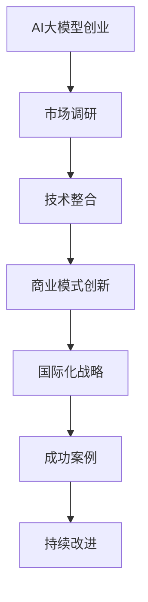

                 

本文将深入探讨AI大模型创业的国际优势，以及如何在全球化背景下成功开展AI大模型创业。通过分析全球市场环境、技术发展趋势和商业模式的创新，本文旨在为创业者提供切实可行的策略和指导。

## 文章关键词
- AI大模型
- 国际创业
- 技术优势
- 商业模式
- 全球化市场

## 文章摘要
本文首先介绍了AI大模型在全球化背景下的重要性，随后分析了当前全球市场环境和技术发展趋势。接着，本文讨论了如何利用国际优势进行AI大模型创业，包括市场调研、技术整合、商业模式创新和国际化战略。最后，本文提出了未来AI大模型创业的发展趋势和面临的挑战，以及相应的对策和建议。

## 1. 背景介绍
### 1.1 AI大模型的发展历程
AI大模型（Large-scale AI Models）是指拥有数百万甚至数十亿个参数的神经网络模型。这些模型通过大规模数据训练，能够在图像识别、自然语言处理、语音识别等领域取得突破性成果。AI大模型的发展历程可以追溯到20世纪80年代，但真正实现大规模应用是在近年来的深度学习技术迅猛发展之后。

### 1.2 国际创业的现状
随着全球化的深入发展，越来越多的创业者选择在海外市场开展业务。国际创业不仅为创业者提供了更广阔的市场机会，也带来了更高的竞争压力和挑战。成功进行国际创业的关键在于深入了解目标市场的需求、文化和法规，并制定合适的商业模式和战略。

## 2. 核心概念与联系
### 2.1 AI大模型的工作原理
AI大模型基于神经网络结构，通过多层神经网络对输入数据进行特征提取和模式识别。其核心原理包括：
- **前向传播（Forward Propagation）**：输入数据通过神经网络层逐层传递，每个神经元计算输入数据的加权和并通过激活函数处理。
- **反向传播（Backpropagation）**：根据模型预测结果与实际结果的差异，计算误差并通过反向传播修正网络权重。

### 2.2 国际创业与AI大模型的联系
国际创业与AI大模型之间存在紧密联系。首先，AI大模型为国际创业提供了强大的技术支持，使得创业者在数据分析、智能决策和个性化服务等方面具有明显优势。其次，国际创业为AI大模型的应用场景提供了多样化需求，推动了AI大模型技术的不断迭代和进步。

### 2.3 Mermaid 流程图


## 3. 核心算法原理 & 具体操作步骤
### 3.1 算法原理概述
AI大模型的核心算法是基于深度学习的多层神经网络。其原理主要包括以下几个方面：
- **多层感知器（MLP）**：最简单的多层神经网络结构，通过多个隐含层对输入数据进行特征提取。
- **卷积神经网络（CNN）**：适用于图像识别任务，通过卷积层和池化层对图像进行特征提取和降维。
- **递归神经网络（RNN）**：适用于序列数据处理，如自然语言处理，通过隐藏状态的记忆机制处理序列数据。

### 3.2 算法步骤详解
AI大模型的算法步骤通常包括以下几个阶段：
1. **数据预处理**：对原始数据进行清洗、归一化和分割，以便输入神经网络训练。
2. **模型设计**：根据任务需求设计神经网络结构，包括选择合适的网络层和激活函数。
3. **模型训练**：通过反向传播算法对模型进行训练，优化网络参数。
4. **模型评估**：使用验证集对模型进行评估，调整模型参数以达到最佳性能。
5. **模型部署**：将训练好的模型部署到实际应用场景，进行预测和决策。

### 3.3 算法优缺点
**优点**：
- **强大的表达能力**：通过多层神经网络，AI大模型能够捕捉数据中的复杂模式，提高预测准确性。
- **广泛的应用领域**：AI大模型在图像识别、自然语言处理、语音识别等多个领域表现出色，具有很高的实用价值。

**缺点**：
- **计算资源需求大**：训练AI大模型需要大量的计算资源和时间。
- **数据依赖性强**：AI大模型的性能依赖于训练数据的质量和数量，数据不均衡或存在噪声可能导致模型过拟合。

### 3.4 算法应用领域
AI大模型在多个领域具有广泛应用，包括：
- **计算机视觉**：如人脸识别、物体检测和图像生成等。
- **自然语言处理**：如机器翻译、文本分类和问答系统等。
- **语音识别**：如语音合成、语音识别和语音识别系统等。

## 4. 数学模型和公式 & 详细讲解 & 举例说明
### 4.1 数学模型构建
AI大模型的核心数学模型是基于概率论的贝叶斯理论和信息论。其中，贝叶斯理论用于描述模型的参数估计，信息论用于衡量模型的信息熵。

贝叶斯理论的基本公式为：
$$
P(H|E) = \frac{P(E|H) \cdot P(H)}{P(E)}
$$
其中，$P(H|E)$表示在证据$E$下假设$H$成立的概率，$P(E|H)$表示在假设$H$成立下证据$E$发生的概率，$P(H)$表示假设$H$本身成立的概率，$P(E)$表示证据$E$发生的概率。

信息论中的信息熵（Entropy）用于衡量数据的随机性，其公式为：
$$
H(X) = -\sum_{i} P(X_i) \cdot \log_2 P(X_i)
$$
其中，$X$表示随机变量，$P(X_i)$表示随机变量$X$取值为$i$的概率。

### 4.2 公式推导过程
以卷积神经网络（CNN）为例，其核心公式为卷积操作和反向传播。

卷积操作的基本公式为：
$$
h_{ij}^l = \sum_{k=1}^{K_l} w_{ik}^l \cdot a_{kj}^{l-1}
$$
其中，$h_{ij}^l$表示第$l$层的第$i$行第$j$列的激活值，$w_{ik}^l$表示第$l$层的第$i$个卷积核的权重，$a_{kj}^{l-1}$表示第$l-1$层的第$k$行第$j$列的激活值。

反向传播的基本公式为：
$$
\delta_{ij}^l = \frac{\partial C}{\partial a_{ij}^l}
$$
其中，$\delta_{ij}^l$表示第$l$层的第$i$行第$j$列的误差，$C$表示模型的损失函数，$a_{ij}^l$表示第$l$层的第$i$行第$j$列的激活值。

### 4.3 案例分析与讲解
以机器翻译为例，假设要翻译的句子为"I love you"，我们需要使用AI大模型进行翻译。首先，我们需要对句子进行分词，然后对每个单词进行编码，得到输入序列。接着，使用训练好的AI大模型对输入序列进行编码，得到隐藏状态。最后，对隐藏状态进行解码，得到翻译结果。

具体步骤如下：
1. **分词与编码**：将"I love you"分为"I"，"love"，"you"，并对每个单词进行编码。
2. **编码器**：将编码后的单词输入到编码器，得到隐藏状态。
3. **解码器**：将隐藏状态输入到解码器，得到翻译结果。

翻译结果可能为"我爱你"，这取决于AI大模型的训练数据和模型参数。通过不断优化模型参数，可以使翻译结果更加准确。

## 5. 项目实践：代码实例和详细解释说明
### 5.1 开发环境搭建
开发环境搭建包括安装Python、TensorFlow等必要库，并配置GPU加速。以下为搭建过程的简要步骤：
1. **安装Python**：从官网下载并安装Python 3.x版本。
2. **安装TensorFlow**：使用pip命令安装TensorFlow：
   ```bash
   pip install tensorflow-gpu
   ```
3. **配置GPU加速**：确保CUDA和cuDNN已正确安装，并配置环境变量。

### 5.2 源代码详细实现
以下是一个简单的AI大模型实现，用于图像分类：
```python
import tensorflow as tf

# 定义卷积神经网络
model = tf.keras.Sequential([
    tf.keras.layers.Conv2D(32, (3, 3), activation='relu', input_shape=(28, 28, 1)),
    tf.keras.layers.MaxPooling2D((2, 2)),
    tf.keras.layers.Conv2D(64, (3, 3), activation='relu'),
    tf.keras.layers.MaxPooling2D((2, 2)),
    tf.keras.layers.Flatten(),
    tf.keras.layers.Dense(128, activation='relu'),
    tf.keras.layers.Dense(10, activation='softmax')
])

# 编译模型
model.compile(optimizer='adam',
              loss='sparse_categorical_crossentropy',
              metrics=['accuracy'])

# 加载数据
(x_train, y_train), (x_test, y_test) = tf.keras.datasets.mnist.load_data()

# 预处理数据
x_train = x_train / 255.0
x_test = x_test / 255.0

# 训练模型
model.fit(x_train, y_train, epochs=5)

# 评估模型
model.evaluate(x_test, y_test)
```

### 5.3 代码解读与分析
上述代码实现了一个简单的卷积神经网络（CNN），用于MNIST手写数字识别。主要步骤如下：
1. **定义模型**：使用TensorFlow的`Sequential`模型定义网络结构，包括卷积层、池化层、全连接层等。
2. **编译模型**：设置优化器、损失函数和评价指标，为模型训练做准备。
3. **加载数据**：使用TensorFlow内置的MNIST数据集，对数据进行归一化处理。
4. **训练模型**：使用`fit`函数对模型进行训练，设置训练轮数。
5. **评估模型**：使用`evaluate`函数对训练好的模型进行评估。

### 5.4 运行结果展示
训练完成后，可以使用以下代码查看模型的运行结果：
```python
import matplotlib.pyplot as plt

# 获取预测结果
predictions = model.predict(x_test)

# 获取预测标签
predicted_labels = np.argmax(predictions, axis=1)

# 显示前10个测试样本的预测结果
plt.figure(figsize=(10, 10))
for i in range(10):
    plt.subplot(2, 5, i+1)
    plt.imshow(x_test[i], cmap=plt.cm.binary)
    plt.xticks([])
    plt.yticks([])
    plt.grid(False)
    plt.xlabel(f"Predicted: {predicted_labels[i]}")
plt.show()
```

运行上述代码后，将显示前10个测试样本的预测结果，以及模型对这些样本的预测标签。

## 6. 实际应用场景
### 6.1 在金融领域的应用
在金融领域，AI大模型可用于风险管理、信用评分、投资组合优化等。例如，通过分析大量金融数据，AI大模型可以预测股票市场的走势，为投资者提供决策支持。

### 6.2 在医疗健康领域的应用
在医疗健康领域，AI大模型可用于疾病诊断、治疗方案推荐、药物研发等。例如，通过分析患者病历数据，AI大模型可以预测疾病的发生概率，为医生提供诊断建议。

### 6.3 在制造业的应用
在制造业，AI大模型可用于生产优化、设备维护、质量控制等。例如，通过分析生产线数据，AI大模型可以预测设备故障，为制造商提供维护计划。

## 7. 未来应用展望
随着AI大模型技术的不断发展，其在各个领域的应用前景将更加广阔。未来，AI大模型有望在自动驾驶、智能家居、智慧城市等领域发挥重要作用。同时，AI大模型也将面临更高的计算资源需求、数据隐私保护等挑战。

## 8. 工具和资源推荐
### 8.1 学习资源推荐
- 《深度学习》（Goodfellow, Bengio, Courville）：深度学习领域的经典教材。
- 《Hands-On Machine Learning with Scikit-Learn, Keras, and TensorFlow》：适合初学者的深度学习实践指南。

### 8.2 开发工具推荐
- TensorFlow：广泛使用的开源深度学习框架。
- PyTorch：流行的深度学习框架，具有灵活的动态计算图。

### 8.3 相关论文推荐
- "Distributed Deep Learning: Lessons from the Facebook Algorithm Platform"（Facebook）：介绍Facebook如何分布式训练大型神经网络。
- "Bert: Pre-training of Deep Bidirectional Transformers for Language Understanding"（Google）：介绍BERT模型的预训练方法和应用。

## 9. 总结：未来发展趋势与挑战
### 9.1 研究成果总结
AI大模型在图像识别、自然语言处理、语音识别等领域取得了显著成果，为各行各业提供了强大的技术支持。

### 9.2 未来发展趋势
未来，AI大模型将向更复杂、更智能、更实用的方向发展，并在更多领域得到广泛应用。

### 9.3 面临的挑战
AI大模型面临的挑战包括计算资源需求、数据隐私保护、模型解释性等。

### 9.4 研究展望
随着技术的不断进步，AI大模型有望在更多领域实现突破，为社会带来更多价值。

## 10. 附录：常见问题与解答
### 10.1 AI大模型如何处理大规模数据？
AI大模型通常使用分布式训练技术来处理大规模数据。通过将数据分布在多个计算节点上，可以显著提高训练速度。

### 10.2 AI大模型是否会导致失业？
AI大模型可能会取代一些重复性劳动岗位，但也会创造更多高技能岗位。关键在于如何适应技术变革，提升自身技能。

### 10.3 AI大模型如何保证模型解释性？
提高模型解释性是当前研究的热点。目前，研究人员正在探索可视化技术、模型压缩和解释性算法，以提高模型的透明度。

## 作者署名
作者：禅与计算机程序设计艺术 / Zen and the Art of Computer Programming
```

