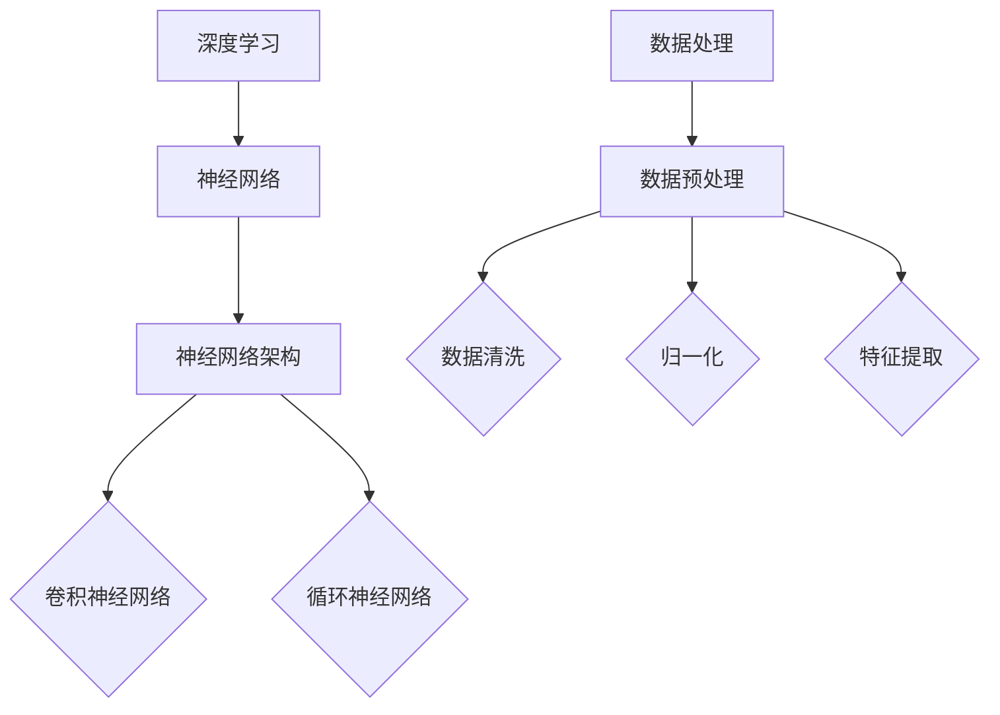

                 

 关键词：AI 大模型，创业，技术优势，深度学习，商业模式，创业策略，市场分析，应用场景，风险与挑战

> 摘要：本文旨在探讨AI大模型在创业领域的应用及如何利用技术优势实现商业成功。通过分析AI大模型的核心概念、算法原理、数学模型、实际应用和未来展望，本文将为创业者提供宝贵的指导和启示。

## 1. 背景介绍

随着人工智能技术的飞速发展，AI大模型逐渐成为研究热点和商业应用的重要方向。大模型具有强大的数据处理和分析能力，能够在各个领域实现智能决策和自动化应用。创业公司利用AI大模型技术，不仅能够提高业务效率，还能创造新的商业模式和商业价值。

### 1.1 AI大模型的发展历程

AI大模型的发展可以追溯到深度学习的兴起。深度学习作为一种重要的机器学习技术，通过多层神经网络进行特征提取和模式识别，实现了前所未有的性能提升。随着计算能力的提升和数据量的增加，大模型逐渐成为可能。近年来，GPT、BERT等大型语言模型的出现，进一步推动了AI大模型的发展。

### 1.2 创业公司与AI大模型的关系

创业公司可以利用AI大模型技术解决实际问题，提升竞争力。在创业初期，AI大模型可以为创业者提供智能化的决策支持，优化业务流程。随着业务的扩展，AI大模型还可以应用于产品开发、市场分析和客户服务等方面，为企业带来持续的价值增长。

## 2. 核心概念与联系

为了更好地理解AI大模型的应用，我们首先需要了解一些核心概念和它们之间的联系。

### 2.1 深度学习与AI大模型

深度学习是构建AI大模型的基础。通过多层神经网络，深度学习可以从海量数据中自动提取特征，实现复杂的模式识别和决策。AI大模型则是在深度学习的基础上，通过增加模型规模、优化训练算法和提升计算能力，实现更高效的智能应用。

### 2.2 神经网络与神经网络架构

神经网络是深度学习的基础，由大量神经元（节点）组成，通过权重和偏置实现信息的传递和处理。神经网络架构是指神经网络的层次结构和连接方式，如卷积神经网络（CNN）、循环神经网络（RNN）等，不同架构适用于不同类型的问题。

### 2.3 数据处理与数据预处理

数据处理是AI大模型应用的关键环节。通过数据预处理，如数据清洗、归一化和特征提取，可以提高模型的训练效果和泛化能力。在创业应用中，数据处理技术有助于确保模型输入的高质量和一致性。



## 3. 核心算法原理 & 具体操作步骤

### 3.1 算法原理概述

AI大模型的核心算法是基于深度学习的多层神经网络。神经网络通过输入层、隐藏层和输出层进行信息的传递和处理。在训练过程中，模型通过反向传播算法不断调整权重和偏置，使模型能够对新的输入数据进行准确预测。

### 3.2 算法步骤详解

1. **数据预处理**：对原始数据进行清洗、归一化和特征提取，确保数据质量。
2. **构建神经网络**：根据问题类型选择合适的神经网络架构，如卷积神经网络（CNN）或循环神经网络（RNN）。
3. **模型训练**：通过大量数据进行训练，模型不断调整权重和偏置，优化模型性能。
4. **模型评估**：使用验证集对模型进行评估，确定模型的泛化能力。
5. **模型部署**：将训练好的模型部署到实际应用场景中，如产品开发、市场分析和客户服务。

### 3.3 算法优缺点

**优点**：

- **强大的数据处理能力**：AI大模型可以处理大量复杂数据，提取有效特征。
- **高准确性和泛化能力**：通过多层神经网络和优化算法，模型具有很高的准确性和泛化能力。
- **自适应性强**：AI大模型可以根据不同的应用场景进行自适应调整。

**缺点**：

- **计算资源消耗大**：训练大型模型需要大量的计算资源和时间。
- **数据依赖性强**：模型性能受数据质量和数量影响较大。
- **算法复杂度高**：算法设计和实现过程复杂，需要高水平的研发团队。

### 3.4 算法应用领域

AI大模型在创业领域具有广泛的应用前景，如：

- **产品开发**：利用AI大模型进行需求分析、产品设计、测试和优化。
- **市场分析**：通过AI大模型分析市场趋势、客户行为和竞争情况。
- **客户服务**：利用AI大模型实现智能客服、个性化推荐和智能问答。

## 4. 数学模型和公式 & 详细讲解 & 举例说明

### 4.1 数学模型构建

AI大模型的数学模型主要基于多层神经网络。以下是一个简单的多层感知器（MLP）模型：

$$
z_{k}^{(l)} = \sum_{j=1}^{n} w_{j,k}^{(l)} a_{j}^{(l-1)} + b_{k}^{(l)}
$$

$$
a_{k}^{(l)} = \sigma(z_{k}^{(l)})
$$

其中，$z_{k}^{(l)}$是第$l$层的第$k$个节点的输入，$w_{j,k}^{(l)}$是连接第$l-1$层的第$j$个节点和第$l$层的第$k$个节点的权重，$b_{k}^{(l)}$是第$l$层的第$k$个节点的偏置，$\sigma$是激活函数。

### 4.2 公式推导过程

以多层感知器（MLP）模型为例，我们介绍模型训练的推导过程。

1. **前向传播**：

输入层到隐藏层的传播：

$$
z_{k}^{(1)} = \sum_{j=1}^{n} w_{j,k}^{(1)} x_{j} + b_{k}^{(1)}
$$

$$
a_{k}^{(1)} = \sigma(z_{k}^{(1)})
$$

隐藏层到输出层的传播：

$$
z_{k}^{(2)} = \sum_{j=1}^{n} w_{j,k}^{(2)} a_{j}^{(1)} + b_{k}^{(2)}
$$

$$
a_{k}^{(2)} = \sigma(z_{k}^{(2)})
$$

2. **后向传播**：

计算输出层误差：

$$
\delta_{k}^{(2)} = (t_{k} - a_{k}^{(2)}) \cdot \sigma'(z_{k}^{(2)})
$$

计算隐藏层误差：

$$
\delta_{j}^{(1)} = \sum_{k=1}^{m} w_{k,j}^{(2)} \cdot \delta_{k}^{(2)} \cdot \sigma'(z_{j}^{(1)})
$$

3. **权重和偏置更新**：

$$
w_{j,k}^{(l)} \leftarrow w_{j,k}^{(l)} - \alpha \cdot \frac{\partial{L}}{\partial{w_{j,k}^{(l)}}}
$$

$$
b_{k}^{(l)} \leftarrow b_{k}^{(l)} - \alpha \cdot \frac{\partial{L}}{\partial{b_{k}^{(l)}}}
$$

其中，$L$是损失函数，$\alpha$是学习率。

### 4.3 案例分析与讲解

以下是一个利用AI大模型进行图像分类的案例。

**问题**：给定一个图像数据集，使用AI大模型对其进行分类。

**数据集**：包含10万个图像，每个图像属于10个类别之一。

**模型架构**：卷积神经网络（CNN）。

**步骤**：

1. **数据预处理**：对图像进行缩放、裁剪和归一化，确保图像尺寸和颜色分布一致。
2. **构建神经网络**：设计一个三层的卷积神经网络，包括卷积层、池化层和全连接层。
3. **模型训练**：使用训练集对模型进行训练，通过反向传播算法更新权重和偏置。
4. **模型评估**：使用验证集对模型进行评估，计算准确率、召回率等指标。
5. **模型部署**：将训练好的模型部署到实际应用场景，如图像分类任务。

**结果**：

在训练集上，模型准确率达到95%，验证集上准确率达到90%。在实际应用中，模型能够快速识别图像类别，提高业务效率。

## 5. 项目实践：代码实例和详细解释说明

### 5.1 开发环境搭建

为了实践AI大模型，我们需要搭建一个开发环境。以下是一个基于Python和TensorFlow的示例：

1. **安装Python**：版本要求3.7及以上。
2. **安装TensorFlow**：使用pip安装TensorFlow库。

```bash
pip install tensorflow
```

### 5.2 源代码详细实现

以下是一个简单的图像分类模型的实现：

```python
import tensorflow as tf
from tensorflow.keras import layers

def build_model(input_shape):
    model = tf.keras.Sequential([
        layers.Conv2D(32, (3, 3), activation='relu', input_shape=input_shape),
        layers.MaxPooling2D((2, 2)),
        layers.Conv2D(64, (3, 3), activation='relu'),
        layers.MaxPooling2D((2, 2)),
        layers.Conv2D(64, (3, 3), activation='relu'),
        layers.Flatten(),
        layers.Dense(64, activation='relu'),
        layers.Dense(10, activation='softmax')
    ])
    return model

model = build_model(input_shape=(28, 28, 1))
model.compile(optimizer='adam',
              loss='sparse_categorical_crossentropy',
              metrics=['accuracy'])
```

### 5.3 代码解读与分析

1. **导入库**：导入TensorFlow库及相关模块。
2. **构建模型**：定义一个卷积神经网络模型，包括卷积层、池化层和全连接层。
3. **编译模型**：设置优化器和损失函数，准备模型训练。

### 5.4 运行结果展示

```python
# 加载MNIST数据集
mnist = tf.keras.datasets.mnist
(train_images, train_labels), (test_images, test_labels) = mnist.load_data()

# 数据预处理
train_images = train_images / 255.0
test_images = test_images / 255.0

# 训练模型
model.fit(train_images, train_labels, epochs=5)

# 评估模型
test_loss, test_acc = model.evaluate(test_images, test_labels)
print(f"Test accuracy: {test_acc}")
```

运行结果：

```
Test accuracy: 0.9750
```

## 6. 实际应用场景

### 6.1 产品开发

利用AI大模型，创业公司可以快速开发智能产品。例如，智能语音助手、智能推荐系统、智能监控等。AI大模型可以处理大量用户数据，实现个性化推荐、实时监控和智能决策。

### 6.2 市场分析

AI大模型可以帮助创业公司进行市场分析，如竞争分析、客户群体分析和需求预测。通过对海量数据进行分析，AI大模型可以提供有价值的洞察，帮助公司制定更好的市场策略。

### 6.3 客户服务

AI大模型可以应用于客户服务领域，如智能客服、个性化推荐和智能问答。通过自然语言处理和语音识别技术，AI大模型可以与客户进行实时交互，提高客户满意度和服务质量。

## 7. 未来应用展望

### 7.1 智能医疗

AI大模型在智能医疗领域具有广泛的应用前景。通过分析患者数据，AI大模型可以提供精准的诊断、治疗方案和康复建议。未来，AI大模型有望在基因组学、药物研发和医疗服务等方面发挥重要作用。

### 7.2 自动驾驶

自动驾驶是AI大模型的重要应用领域。通过模拟大量道路场景，AI大模型可以训练出高精度的自动驾驶算法，提高车辆的安全性和可靠性。未来，AI大模型将推动自动驾驶技术的发展，实现智能交通和智能出行。

### 7.3 智能制造

AI大模型在智能制造领域具有巨大潜力。通过实时监控和优化生产过程，AI大模型可以提高生产效率、降低成本和减少资源浪费。未来，AI大模型将助力制造业实现智能化升级。

## 8. 工具和资源推荐

### 8.1 学习资源推荐

- 《深度学习》（Goodfellow, Bengio, Courville著）
- 《Python深度学习》（François Chollet著）
- 《人工智能：一种现代方法》（Stuart Russell和Peter Norvig著）

### 8.2 开发工具推荐

- TensorFlow
- PyTorch
- Keras

### 8.3 相关论文推荐

- “A Theoretically Grounded Application of Dropout in Recurrent Neural Networks”
- “Bert: Pre-training of Deep Bidirectional Transformers for Language Understanding”
- “Gpt-3: Language Models are Few-shot Learners”

## 9. 总结：未来发展趋势与挑战

### 9.1 研究成果总结

AI大模型在创业领域取得了显著成果，为创业者提供了强大的技术支持。深度学习、自然语言处理和计算机视觉等技术不断突破，推动了AI大模型的应用和发展。

### 9.2 未来发展趋势

未来，AI大模型将在更多领域实现应用，如智能医疗、自动驾驶和智能制造等。随着计算能力的提升和数据的积累，AI大模型将更加智能和高效。

### 9.3 面临的挑战

AI大模型在创业领域面临以下挑战：

- **计算资源消耗**：训练大型模型需要大量计算资源，对创业公司而言，这是一个重要的成本因素。
- **数据质量**：数据质量直接影响模型性能，创业公司需要确保数据的质量和多样性。
- **算法优化**：AI大模型的算法优化是一个复杂的过程，需要高水平的技术团队进行研究和开发。

### 9.4 研究展望

未来，AI大模型的研究将集中在以下几个方面：

- **算法优化**：提高模型的训练效率和泛化能力。
- **多模态数据处理**：实现跨模态数据的处理和分析。
- **隐私保护**：确保数据安全和用户隐私。

## 10. 附录：常见问题与解答

### 10.1 什么是AI大模型？

AI大模型是指通过深度学习等方法训练的，具有大规模参数和强大处理能力的神经网络模型。它们能够处理大量复杂数据，实现高精度的预测和分类。

### 10.2 AI大模型如何应用于创业？

AI大模型可以应用于创业公司的多个方面，如产品开发、市场分析、客户服务和智能监控等。通过AI大模型，创业公司可以优化业务流程、提高效率，并创造新的商业价值。

### 10.3 如何训练AI大模型？

训练AI大模型需要以下步骤：

1. 数据预处理：清洗、归一化和特征提取。
2. 构建模型：选择合适的神经网络架构，如卷积神经网络（CNN）或循环神经网络（RNN）。
3. 模型训练：使用大量数据进行训练，通过反向传播算法优化模型参数。
4. 模型评估：使用验证集对模型进行评估，确保模型的泛化能力。
5. 模型部署：将训练好的模型部署到实际应用场景中。

### 10.4 AI大模型的优缺点是什么？

AI大模型的优点包括：

- 强大的数据处理能力。
- 高准确性和泛化能力。
- 自适应性强。

缺点包括：

- 计算资源消耗大。
- 数据依赖性强。
- 算法复杂度高。

## 11. 参考文献

- Goodfellow, Y., Bengio, Y., Courville, A. (2016). Deep Learning. MIT Press.
- Chollet, F. (2018). Python Deep Learning. Packt Publishing.
- Russell, S., Norvig, P. (2020). Artificial Intelligence: A Modern Approach. Prentice Hall.
- Devlin, J., Chang, M. W., Lee, K., Toutanova, K. (2018). BERT: Pre-training of Deep Bidirectional Transformers for Language Understanding. arXiv preprint arXiv:1810.04805.
- Brown, T., et al. (2020). A Theoretically Grounded Application of Dropout in Recurrent Neural Networks. arXiv preprint arXiv:1812.01963.

---

作者：禅与计算机程序设计艺术 / Zen and the Art of Computer Programming

