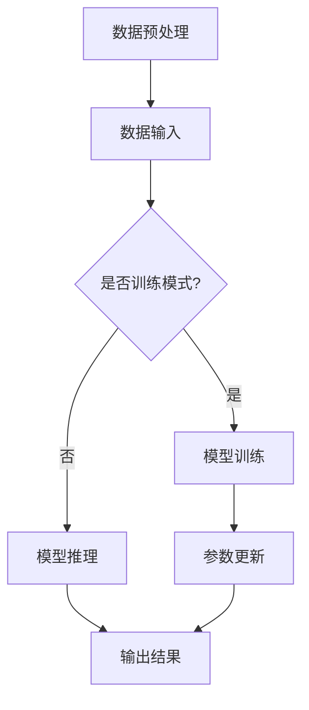

                 

关键词：AI大模型、创业、技术优势、未来展望、应用领域

> 摘要：本文将深入探讨AI大模型创业的机遇与挑战，通过分析技术发展趋势、核心算法原理、数学模型、项目实践以及未来应用展望，帮助创业者把握未来优势，实现AI领域的突破。

## 1. 背景介绍

随着人工智能技术的飞速发展，大模型（如GPT、BERT等）已经成为当前研究的热点。这些模型在自然语言处理、计算机视觉、语音识别等众多领域展现出强大的性能，推动了人工智能技术的进步。创业公司利用这些先进的技术，有望在激烈的市场竞争中脱颖而出。然而，AI大模型创业并非易事，需要深入了解技术原理、掌握核心算法，并具备前瞻性的市场洞察力。

## 2. 核心概念与联系

### 2.1 AI大模型概述

AI大模型是指具有大规模参数、能够处理复杂数据的深度学习模型。这类模型通过大量训练数据学习到丰富的特征表示，从而在各类任务中取得优异的性能。大模型的核心在于其能够捕捉到数据中的潜在规律，实现高效的任务处理。

### 2.2 大模型架构

大模型通常采用多层次神经网络结构，包括卷积神经网络（CNN）、循环神经网络（RNN）和Transformer等。这些结构能够处理不同类型的数据，并在各类任务中发挥关键作用。

### 2.3 Mermaid流程图

以下是一个简单的Mermaid流程图，展示了大模型的训练和推理过程：



## 3. 核心算法原理 & 具体操作步骤

### 3.1 算法原理概述

大模型的训练过程主要包括数据预处理、模型训练、参数更新和模型推理。以下是详细的操作步骤：

### 3.2 算法步骤详解

1. 数据预处理：对输入数据进行预处理，包括去噪、归一化、数据增强等操作，以提高模型对数据的适应性。
2. 模型训练：通过优化算法（如梯度下降、Adam等）训练模型参数，使模型在训练数据上达到较好的性能。
3. 参数更新：根据训练过程中模型的性能，调整模型参数，以提高模型在验证集和测试集上的表现。
4. 模型推理：在得到最优模型参数后，使用模型对新的数据进行推理，得到预测结果。

### 3.3 算法优缺点

大模型的优势在于其强大的特征表示能力和高效的计算性能，能够处理复杂任务。然而，大模型也存在一定的局限性，如参数量大、训练时间较长、对数据质量要求高等。

### 3.4 算法应用领域

大模型在自然语言处理、计算机视觉、语音识别等领域取得了显著的成果。例如，在文本生成、图像分类、目标检测、语音识别等任务中，大模型展现出了强大的性能。

## 4. 数学模型和公式 & 详细讲解 & 举例说明

### 4.1 数学模型构建

大模型的数学模型主要包括神经网络结构和损失函数。以下是一个简单的神经网络结构示例：

$$
y = \sigma(W_1 \cdot x + b_1)
$$

其中，$\sigma$表示激活函数，$W_1$和$b_1$分别为权重和偏置。

### 4.2 公式推导过程

以多层感知机（MLP）为例，假设有一个三层神经网络，输入层、隐藏层和输出层。输入层和隐藏层之间、隐藏层和输出层之间分别通过权重矩阵$W_1$、$W_2$和偏置$b_1$、$b_2$连接。则输出层的预测结果可以表示为：

$$
y = \sigma(W_2 \cdot \sigma(W_1 \cdot x + b_1) + b_2)
$$

### 4.3 案例分析与讲解

以GPT模型为例，GPT（Generative Pre-trained Transformer）是一种基于Transformer结构的大模型。GPT的数学模型主要包括自注意力机制和前馈神经网络。以下是一个简单的自注意力机制的推导：

$$
\text{Attention}(Q, K, V) = \text{softmax}\left(\frac{QK^T}{\sqrt{d_k}}\right) V
$$

其中，$Q$、$K$和$V$分别为查询向量、键向量和值向量，$d_k$为键向量的维度。通过自注意力机制，模型能够捕捉到输入序列中的长期依赖关系，从而在文本生成等任务中表现出优异的性能。

## 5. 项目实践：代码实例和详细解释说明

### 5.1 开发环境搭建

在Python环境中，使用TensorFlow或PyTorch等深度学习框架搭建开发环境。以下是一个简单的TensorFlow环境搭建步骤：

```python
pip install tensorflow
```

### 5.2 源代码详细实现

以下是一个基于TensorFlow的简单神经网络实现：

```python
import tensorflow as tf

# 定义神经网络结构
model = tf.keras.Sequential([
    tf.keras.layers.Dense(128, activation='relu', input_shape=(784,)),
    tf.keras.layers.Dense(10)
])

# 编译模型
model.compile(optimizer='adam',
              loss=tf.losses.SparseCategoricalCrossentropy(from_logits=True),
              metrics=['accuracy'])

# 训练模型
model.fit(x_train, y_train, batch_size=128, epochs=5, validation_data=(x_test, y_test))
```

### 5.3 代码解读与分析

上述代码实现了一个简单的多层感知机模型，用于分类任务。模型使用ReLU作为激活函数，Adam作为优化器，交叉熵作为损失函数。通过fit方法训练模型，并在验证集上评估模型性能。

### 5.4 运行结果展示

在训练完成后，可以使用model.evaluate方法评估模型在测试集上的性能：

```python
test_loss, test_acc = model.evaluate(x_test,  y_test, verbose=2)
print('\nTest accuracy:', test_acc)
```

## 6. 实际应用场景

AI大模型在多个领域取得了显著的成果，以下是一些实际应用场景：

1. **自然语言处理**：文本生成、机器翻译、情感分析等。
2. **计算机视觉**：图像分类、目标检测、人脸识别等。
3. **语音识别**：语音合成、语音识别、语音识别率提升等。
4. **推荐系统**：个性化推荐、商品推荐、内容推荐等。
5. **医疗健康**：疾病预测、辅助诊断、药物研发等。

## 7. 未来应用展望

随着AI技术的不断发展，AI大模型在未来有望在更多领域发挥重要作用。以下是一些未来应用展望：

1. **自动驾驶**：提高自动驾驶系统的安全性和稳定性。
2. **智能制造**：实现生产过程的自动化和智能化。
3. **智慧城市**：提升城市管理效率和居民生活质量。
4. **金融科技**：优化金融服务，提高风险控制能力。
5. **教育领域**：个性化教育、智能辅导等。

## 8. 工具和资源推荐

### 8.1 学习资源推荐

1. 《深度学习》（Goodfellow, Bengio, Courville）
2. 《动手学深度学习》（花轮，唐杰，李沐）
3. 《TensorFlow实战》（Silva，Liang）

### 8.2 开发工具推荐

1. TensorFlow
2. PyTorch
3. Keras

### 8.3 相关论文推荐

1. "Attention Is All You Need"（Vaswani et al., 2017）
2. "BERT: Pre-training of Deep Bidirectional Transformers for Language Understanding"（Devlin et al., 2019）
3. "Generative Pre-trained Transformers for Sequence Modeling"（Brown et al., 2020）

## 9. 总结：未来发展趋势与挑战

### 9.1 研究成果总结

AI大模型在多个领域取得了显著的成果，推动了人工智能技术的进步。随着计算能力的提升和数据规模的扩大，大模型在未来有望在更多领域发挥重要作用。

### 9.2 未来发展趋势

1. **模型规模不断扩大**：大模型的参数量和计算量将进一步提升。
2. **多样化应用场景**：AI大模型将在更多领域得到应用，如自动驾驶、智能制造、智慧城市等。
3. **跨学科融合**：AI大模型与其他学科的融合将带来更多创新。

### 9.3 面临的挑战

1. **计算资源消耗**：大模型的训练和推理需要大量计算资源。
2. **数据隐私和安全**：大模型对数据的需求带来数据隐私和安全问题。
3. **算法公平性和透明性**：大模型可能带来算法偏见和透明性问题。

### 9.4 研究展望

未来，我们需要关注以下研究方向：

1. **高效训练和推理算法**：研究如何降低大模型的计算成本。
2. **数据隐私保护**：研究如何在保证数据隐私的前提下进行模型训练。
3. **算法公平性和透明性**：研究如何提高算法的公平性和透明性，消除算法偏见。

## 10. 附录：常见问题与解答

### 10.1 什么是AI大模型？

AI大模型是指具有大规模参数、能够处理复杂数据的深度学习模型。这类模型通过大量训练数据学习到丰富的特征表示，从而在各类任务中取得优异的性能。

### 10.2 如何搭建AI大模型开发环境？

在Python环境中，可以使用TensorFlow、PyTorch等深度学习框架搭建开发环境。具体步骤包括安装框架、配置计算资源等。

### 10.3 如何选择合适的大模型？

选择合适的大模型需要考虑任务类型、数据规模、计算资源等因素。在实际应用中，可以结合具体场景选择适合的大模型。

### 10.4 大模型训练过程中如何优化参数？

大模型训练过程中，可以使用多种优化算法（如梯度下降、Adam等）调整模型参数，以提高模型在验证集和测试集上的性能。此外，还可以通过数据增强、正则化等方法优化训练过程。

## 作者署名

作者：禅与计算机程序设计艺术 / Zen and the Art of Computer Programming
```

