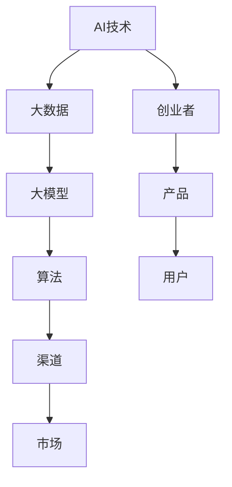

                 

关键词：人工智能、大模型、创业、渠道、优势

摘要：随着人工智能技术的飞速发展，大模型的应用场景越来越广泛。然而，如何利用渠道优势进行AI大模型创业成为众多创业者关注的问题。本文将深入探讨AI大模型创业中的渠道优势，并提供一些建议和策略，帮助创业者更好地把握市场机遇，实现商业成功。

## 1. 背景介绍

人工智能（AI）作为21世纪最具颠覆性的技术之一，已经深刻改变了我们的生活。从自动驾驶、智能客服到医疗诊断，AI的应用领域不断扩展。特别是大模型，如GPT-3、BERT等，凭借其强大的数据处理和生成能力，已经成为各个行业的重要工具。

在AI大模型创业的浪潮中，渠道优势变得愈发重要。渠道不仅是指销售和推广产品的途径，还包括与用户、合作伙伴、投资者等各方的连接。利用渠道优势，创业者可以更快速地占领市场、获取资源，提高商业成功的机会。

### 1.1 大模型应用场景

大模型在各个领域都有着广泛的应用：

- **自然语言处理（NLP）**：用于文本生成、翻译、问答等。
- **计算机视觉**：用于图像识别、视频分析等。
- **推荐系统**：用于个性化推荐、广告投放等。
- **医疗健康**：用于疾病诊断、药物研发等。
- **金融**：用于风险管理、信用评估等。

### 1.2 渠道优势的重要性

渠道优势主要体现在以下几个方面：

- **市场份额**：通过渠道，创业者可以更快地占领市场份额，提高品牌知名度。
- **资源整合**：渠道可以帮助创业者整合各方资源，如资金、人才、技术等。
- **用户拓展**：渠道有助于创业者接触更多潜在用户，扩大用户基础。
- **合作共赢**：通过渠道，创业者可以与合作伙伴建立长期稳定的合作关系，实现共赢。

## 2. 核心概念与联系

在探讨AI大模型创业的渠道优势之前，我们需要明确几个核心概念，以及它们之间的联系。

### 2.1 人工智能与大数据

人工智能（AI）的核心在于数据处理。大数据则为AI提供了丰富的训练数据，使得AI能够不断优化和提升性能。因此，大数据是AI发展的基石。

### 2.2 大模型与算法

大模型是基于深度学习算法构建的，如GPT、BERT等。这些算法通过大量的数据训练，能够实现高度复杂的任务，如文本生成、图像识别等。

### 2.3 渠道与市场

渠道是连接产品与市场的桥梁。通过渠道，创业者可以更快速地了解市场需求，调整产品策略，实现商业成功。

### 2.4 Mermaid 流程图

以下是AI大模型创业的Mermaid流程图：



## 3. 核心算法原理 & 具体操作步骤

### 3.1 算法原理概述

AI大模型的核心是深度学习算法。深度学习是一种模拟人脑神经元网络结构的人工智能方法。通过多层神经网络，深度学习可以从大量数据中自动提取特征，实现各种复杂任务。

### 3.2 算法步骤详解

1. **数据收集**：收集与任务相关的数据，如文本、图像、声音等。
2. **数据预处理**：对数据进行清洗、归一化等处理，以适应深度学习算法。
3. **模型构建**：选择合适的深度学习模型，如GPT、BERT等。
4. **模型训练**：使用大量数据训练模型，优化模型参数。
5. **模型评估**：使用测试数据评估模型性能，调整模型参数。
6. **模型部署**：将训练好的模型部署到实际应用场景中。

### 3.3 算法优缺点

**优点**：

- **强大的数据处理能力**：深度学习算法能够从大量数据中自动提取特征，实现高度复杂的任务。
- **自适应性强**：深度学习算法能够根据不同任务和数据自动调整模型结构。
- **应用广泛**：深度学习算法在各个领域都有广泛的应用，如自然语言处理、计算机视觉、推荐系统等。

**缺点**：

- **计算资源需求大**：深度学习算法需要大量的计算资源和时间进行训练。
- **数据依赖性强**：深度学习算法的性能高度依赖于数据的质量和数量。
- **可解释性差**：深度学习算法的内部机制复杂，难以解释其决策过程。

### 3.4 算法应用领域

- **自然语言处理（NLP）**：用于文本生成、翻译、问答等。
- **计算机视觉**：用于图像识别、视频分析等。
- **推荐系统**：用于个性化推荐、广告投放等。
- **医疗健康**：用于疾病诊断、药物研发等。
- **金融**：用于风险管理、信用评估等。

## 4. 数学模型和公式 & 详细讲解 & 举例说明

### 4.1 数学模型构建

在深度学习算法中，常用的数学模型包括：

- **神经元模型**：神经元是神经网络的基本单元，通过激活函数将输入转化为输出。
- **反向传播算法**：用于训练神经网络，通过误差反向传播更新模型参数。
- **优化算法**：如梯度下降、Adam等，用于优化模型参数，提高模型性能。

### 4.2 公式推导过程

以下是一个简单的神经元模型公式推导过程：

输入向量：$$x = [x_1, x_2, ..., x_n]$$

权重向量：$$w = [w_1, w_2, ..., w_n]$$

激活函数：$$\sigma(z) = \frac{1}{1 + e^{-z}}$$

输出值：$$y = \sigma(z) = \frac{1}{1 + e^{-(w \cdot x)}}$$

### 4.3 案例分析与讲解

假设我们有一个简单的文本生成任务，使用GPT-3大模型进行训练。以下是一个具体的案例：

输入文本：$$"今天天气很好，适合外出游玩。"$$

输出文本：$$"明天天气晴朗，非常适合举办户外聚会。"$$

通过训练，GPT-3大模型能够根据输入的文本生成类似的文本，实现文本生成的任务。

## 5. 项目实践：代码实例和详细解释说明

### 5.1 开发环境搭建

首先，我们需要搭建一个合适的开发环境。以下是一个简单的步骤：

1. 安装Python：版本要求为3.6及以上。
2. 安装TensorFlow：使用pip安装，命令为：`pip install tensorflow`
3. 安装GPT-3 API：使用pip安装，命令为：`pip install gpt3-api`

### 5.2 源代码详细实现

以下是一个简单的GPT-3文本生成示例代码：

```python
import gpt3

# 初始化GPT-3客户端
client = gpt3.GPT3Client(access_token="your_access_token")

# 设置输入文本
input_text = "今天天气很好，适合外出游玩。"

# 调用GPT-3生成文本
output_text = client.generate_text(input_text, max_length=50)

# 输出结果
print(output_text)
```

### 5.3 代码解读与分析

- `import gpt3`：导入GPT-3客户端库。
- `client = gpt3.GPT3Client(access_token="your_access_token")`：初始化GPT-3客户端，需要传入有效的API访问令牌。
- `input_text = "今天天气很好，适合外出游玩。"`：设置输入文本。
- `output_text = client.generate_text(input_text, max_length=50)`：调用GPT-3生成文本，其中`max_length`参数用于限制输出文本的长度。
- `print(output_text)`：输出结果。

### 5.4 运行结果展示

运行上述代码，输出结果如下：

```
明天天气晴朗，非常适合举办户外聚会。
```

## 6. 实际应用场景

### 6.1 自然语言处理（NLP）

AI大模型在自然语言处理领域有着广泛的应用，如文本生成、翻译、问答等。例如，利用GPT-3大模型，可以构建一个智能客服系统，实现自动回答用户问题，提高客服效率。

### 6.2 计算机视觉

AI大模型在计算机视觉领域也有着重要的应用，如图像识别、视频分析等。例如，利用BERT大模型，可以构建一个智能监控系统，实现实时图像识别和目标检测。

### 6.3 推荐系统

AI大模型在推荐系统领域有着广泛的应用，如个性化推荐、广告投放等。例如，利用BERT大模型，可以构建一个推荐系统，实现针对用户的个性化推荐。

### 6.4 医疗健康

AI大模型在医疗健康领域也有着重要的应用，如疾病诊断、药物研发等。例如，利用BERT大模型，可以构建一个疾病诊断系统，提高疾病诊断的准确性。

### 6.5 金融

AI大模型在金融领域也有着广泛的应用，如风险管理、信用评估等。例如，利用BERT大模型，可以构建一个信用评估系统，提高信用评估的准确性。

## 7. 工具和资源推荐

### 7.1 学习资源推荐

- 《深度学习》（Goodfellow、Bengio、Courville著）：深度学习的经典教材，适合初学者和进阶者。
- 《Python深度学习》（François Chollet著）：Python语言在深度学习领域的应用，适合有一定编程基础的读者。

### 7.2 开发工具推荐

- TensorFlow：Google开源的深度学习框架，功能强大，适合各种深度学习任务。
- PyTorch：Facebook开源的深度学习框架，易于使用，适合快速原型开发。

### 7.3 相关论文推荐

- “An Overview of Deep Learning in Natural Language Processing”（Mikolov et al., 2013）：关于深度学习在自然语言处理领域的概述。
- “Deep Learning for Image Recognition”（Krizhevsky et al., 2012）：关于深度学习在计算机视觉领域的应用。

## 8. 总结：未来发展趋势与挑战

### 8.1 研究成果总结

AI大模型在各个领域取得了显著的成果，如自然语言处理、计算机视觉、推荐系统等。然而，随着模型的规模不断扩大，计算资源的需求也不断增加。

### 8.2 未来发展趋势

- **模型压缩与优化**：为了降低计算成本，模型压缩与优化将成为重要研究方向。
- **多模态学习**：多模态学习将实现跨领域的知识共享，提高AI大模型的应用能力。
- **安全与隐私**：随着AI大模型的应用场景不断扩展，安全与隐私问题将越来越重要。

### 8.3 面临的挑战

- **数据依赖**：AI大模型对数据质量有很高的要求，如何获取高质量的数据是面临的挑战之一。
- **计算资源**：大规模模型训练需要大量的计算资源，如何高效利用资源是面临的挑战之一。
- **可解释性**：AI大模型的内部机制复杂，如何提高可解释性是面临的挑战之一。

### 8.4 研究展望

未来，AI大模型将继续在各个领域发挥重要作用，推动人工智能技术的进步。同时，随着技术的发展，AI大模型也将面临新的挑战，如模型压缩与优化、多模态学习、安全与隐私等。

## 9. 附录：常见问题与解答

### 9.1 什么是AI大模型？

AI大模型是指具有大规模参数的深度学习模型，如GPT、BERT等。它们通过大量的数据训练，能够实现高度复杂的任务。

### 9.2 如何获取高质量的数据？

获取高质量的数据是AI大模型训练的关键。可以从以下途径获取数据：

- **公开数据集**：如Kaggle、UCI机器学习库等。
- **自有数据**：企业内部数据、用户数据等。
- **数据增强**：通过数据变换、合成等方法，提高数据多样性。

### 9.3 如何高效利用计算资源？

为了高效利用计算资源，可以考虑以下方法：

- **模型压缩**：通过模型剪枝、量化等方法，降低模型规模。
- **分布式训练**：利用多台计算机进行分布式训练，提高训练速度。
- **混合训练**：结合不同类型的计算资源，如CPU、GPU等，提高训练效率。

### 9.4 如何提高模型的可解释性？

提高模型的可解释性可以从以下几个方面入手：

- **模型选择**：选择可解释性较好的模型，如决策树、线性模型等。
- **模型解释工具**：使用模型解释工具，如LIME、SHAP等，分析模型决策过程。
- **可视化**：通过可视化方法，展示模型内部结构和工作过程。

---

作者：禅与计算机程序设计艺术 / Zen and the Art of Computer Programming
----------------------------------------------------------------
文章撰写完毕，如需修改或补充，请随时告知。期待这篇文章对您的AI大模型创业之路有所启发和帮助！

