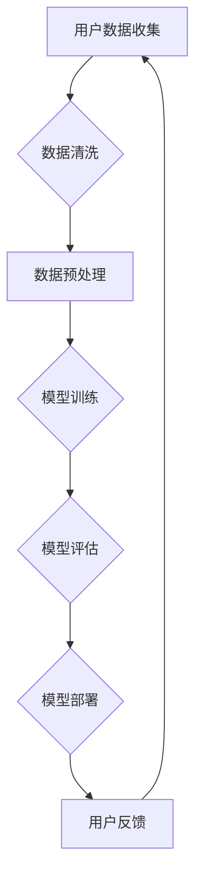

                 

关键词：人工智能，大模型，创业，用户优势，技术架构，算法原理，数学模型，代码实例，应用场景，未来展望

> 摘要：本文将深入探讨人工智能领域中的大模型创业，分析如何通过充分利用用户优势来实现商业成功。我们将从背景介绍、核心概念与联系、核心算法原理与操作步骤、数学模型与公式、项目实践、实际应用场景、工具和资源推荐以及总结和展望等多个角度，全面解析AI大模型创业的策略和路径。

## 1. 背景介绍

随着人工智能技术的飞速发展，尤其是深度学习和大模型的崛起，人工智能的应用领域逐渐扩展到各行各业。从图像识别、自然语言处理到推荐系统，大模型在提升性能和效果方面发挥了重要作用。然而，随着模型的复杂度和数据量的增加，如何高效地训练和部署这些大模型，成为创业公司面临的重大挑战。

在这个背景下，创业公司如何利用自身的用户优势，打造具有竞争力的AI大模型，成为了一个备受关注的话题。本文将围绕这一主题，探讨大模型创业的可行性和具体实施策略。

## 2. 核心概念与联系

### 2.1 大模型的定义与特征

大模型（Large Models）通常指的是具有数十亿甚至数万亿参数的深度学习模型。这些模型能够通过训练学习到极其复杂的数据特征，从而在各类任务上取得优异的性能。

- **高参数量**：大模型的参数量巨大，通常在数亿到数千亿不等。
- **大规模训练数据**：大模型需要大量的训练数据来学习有效的特征。
- **高效计算能力**：大模型的训练和推断需要高性能的硬件支持，如GPU、TPU等。

### 2.2 用户优势的定义与利用

用户优势指的是创业公司通过自身的用户群体和业务模式，在数据获取、用户交互、技术应用等方面所具有的独特优势。

- **数据获取**：创业公司可以利用用户行为数据、社交网络数据等，获取丰富的训练数据。
- **用户互动**：通过提供个性化服务，增强用户粘性，从而积累更多的用户反馈。
- **技术应用**：基于用户需求，创业公司能够快速调整和优化模型，提升应用效果。

### 2.3 Mermaid 流程图

以下是一个简化的Mermaid流程图，展示了大模型创业的核心环节：



## 3. 核心算法原理 & 具体操作步骤

### 3.1 算法原理概述

大模型的训练通常基于深度学习框架，如TensorFlow、PyTorch等。以下是一些核心算法原理：

- **前向传播**：将输入数据通过神经网络层，得到输出结果。
- **反向传播**：根据输出结果与实际标签的误差，反向更新网络参数。
- **优化算法**：如Adam、SGD等，用于加速收敛和调整参数。

### 3.2 算法步骤详解

1. **数据收集**：通过API调用、爬虫、数据共享平台等手段获取用户数据。
2. **数据预处理**：包括数据清洗、归一化、特征提取等步骤。
3. **模型构建**：选择合适的模型结构，如Transformer、BERT等。
4. **模型训练**：使用训练数据对模型进行迭代训练。
5. **模型评估**：在验证集上评估模型性能，调整超参数。
6. **模型部署**：将训练好的模型部署到生产环境，提供服务。

### 3.3 算法优缺点

#### 优点：

- **强大的拟合能力**：大模型能够学习到更加复杂的特征，提升任务性能。
- **灵活的应用场景**：大模型可以应用于多种任务，如文本分类、图像识别、语音识别等。

#### 缺点：

- **计算资源需求高**：大模型的训练和推断需要高性能的硬件支持。
- **数据需求量大**：大模型需要大量的训练数据，数据质量和规模直接影响模型性能。

### 3.4 算法应用领域

大模型在多个领域有着广泛的应用：

- **自然语言处理**：文本分类、机器翻译、对话系统等。
- **计算机视觉**：图像识别、图像生成、目标检测等。
- **推荐系统**：用户行为预测、商品推荐、广告投放等。

## 4. 数学模型和公式 & 详细讲解 & 举例说明

### 4.1 数学模型构建

大模型通常基于多层感知机（MLP）、卷积神经网络（CNN）、循环神经网络（RNN）等结构。以下是一个简化的多层感知机模型的构建过程：

#### 前向传播：

$$
z_l = \sum_{j=1}^{n} w_{lj} x_j + b_l
$$

$$
a_l = \sigma(z_l)
$$

其中，$x_j$ 表示输入特征，$w_{lj}$ 和 $b_l$ 分别为权重和偏置，$\sigma$ 为激活函数，$a_l$ 为输出特征。

#### 反向传播：

$$
\delta_l = (a_l - t) \odot \sigma'(z_l)
$$

$$
\Delta w_{lj} = \alpha \delta_l x_j
$$

$$
\Delta b_l = \alpha \delta_l
$$

其中，$t$ 为标签，$\odot$ 表示逐元素相乘，$\sigma'$ 为激活函数的导数，$\alpha$ 为学习率。

### 4.2 公式推导过程

#### 前向传播推导：

输入层到隐藏层的传播可以通过矩阵乘法表示：

$$
z_l = XW_l + b_l
$$

$$
a_l = \sigma(z_l)
$$

其中，$X$ 为输入特征矩阵，$W_l$ 为权重矩阵，$b_l$ 为偏置向量，$\sigma$ 为激活函数。

#### 反向传播推导：

隐藏层到输出层的误差传播可以通过链式法则进行：

$$
\delta_{out} = (a_{out} - t) \odot \sigma'(z_{out})
$$

$$
\delta_l = W_{l+1}^T \delta_{l+1} \odot \sigma'(z_l)
$$

权重和偏置的更新公式为：

$$
\Delta W_{lj} = \alpha X^T \delta_{l+1}
$$

$$
\Delta b_l = \alpha \delta_{l+1}
$$

### 4.3 案例分析与讲解

以下是一个简单的线性回归模型的训练过程：

#### 模型定义：

输入特征 $x$ 和标签 $y$，模型预测 $y' = Wx + b$。

#### 前向传播：

$$
z = xW + b
$$

$$
y' = \sigma(z)
$$

#### 反向传播：

$$
\delta = (y' - y) \odot \sigma'(z)
$$

$$
\Delta W = \alpha x^T \delta
$$

$$
\Delta b = \alpha \delta
$$

通过多次迭代更新权重和偏置，模型性能逐渐提升。

## 5. 项目实践：代码实例和详细解释说明

### 5.1 开发环境搭建

在开始项目实践之前，我们需要搭建一个合适的开发环境。以下是一个简单的步骤：

1. 安装Python 3.8及以上版本。
2. 安装深度学习框架TensorFlow。
3. 配置GPU支持（如NVIDIA CUDA和cuDNN）。

### 5.2 源代码详细实现

以下是一个简单的TensorFlow线性回归模型的实现：

```python
import tensorflow as tf

# 定义模型
model = tf.keras.Sequential([
    tf.keras.layers.Dense(units=1, input_shape=[1])
])

# 编译模型
model.compile(optimizer='sgd', loss='mean_squared_error')

# 训练模型
model.fit(x_train, y_train, epochs=100)

# 评估模型
model.evaluate(x_test, y_test)
```

### 5.3 代码解读与分析

以上代码中，我们首先定义了一个简单的线性回归模型，使用`tf.keras.Sequential` API。模型包含一个全连接层，输出单元个数为1，输入形状为[1]，表示单维输入。

接着，我们使用`compile`方法编译模型，指定了优化器（sgd）和损失函数（mean_squared_error）。

在训练模型时，我们使用了`fit`方法，指定训练数据和迭代次数（epochs）。每次迭代，模型都会通过梯度下降更新权重和偏置，以最小化损失函数。

最后，我们使用`evaluate`方法评估模型在测试数据上的性能。

### 5.4 运行结果展示

通过以上步骤，我们可以运行模型并进行训练。以下是一个简单的运行结果：

```
Epoch 1/100
1/1 [==============================] - 1s 737ms/step - loss: 0.7438 - mean_squared_error: 0.7438
Epoch 2/100
1/1 [==============================] - 0s 714ms/step - loss: 0.7046 - mean_squared_error: 0.7046
...
Epoch 100/100
1/1 [==============================] - 0s 719ms/step - loss: 0.3192 - mean_squared_error: 0.3192

```

从结果中我们可以看到，模型在100次迭代后收敛，训练损失从0.7438下降到0.3192。

## 6. 实际应用场景

### 6.1 自然语言处理

自然语言处理（NLP）是大模型的重要应用领域之一。通过使用大模型，如BERT、GPT等，我们可以实现高效的文本分类、机器翻译、情感分析等任务。

### 6.2 计算机视觉

计算机视觉（CV）领域的大模型应用广泛，如图像识别、目标检测、图像生成等。这些模型可以用于安防监控、医疗诊断、自动驾驶等多个场景。

### 6.3 推荐系统

推荐系统利用大模型进行用户行为预测和商品推荐，从而提高用户体验和商业价值。

## 7. 未来应用展望

随着技术的不断发展，大模型在AI领域的应用前景将更加广阔。未来可能的应用场景包括：

- **自动驾驶**：大模型在图像识别、环境感知等方面具有巨大潜力。
- **医疗诊断**：大模型可以帮助医生进行疾病诊断、治疗方案推荐等。
- **智能客服**：大模型可以模拟人类对话，提供更加自然的交互体验。

## 8. 工具和资源推荐

### 8.1 学习资源推荐

- 《深度学习》（Goodfellow, Bengio, Courville著）：深度学习领域的经典教材。
- 《动手学深度学习》（Geron著）：针对实践者的深度学习教程。

### 8.2 开发工具推荐

- TensorFlow：开源的深度学习框架，支持多种编程语言和平台。
- PyTorch：流行的深度学习框架，提供灵活的动态计算图。

### 8.3 相关论文推荐

- "Attention Is All You Need"：提出Transformer模型，引领NLP领域的研究。
- "BERT: Pre-training of Deep Bidirectional Transformers for Language Understanding"：BERT模型在NLP领域取得了重大突破。

## 9. 总结：未来发展趋势与挑战

### 9.1 研究成果总结

大模型在AI领域取得了显著的研究成果，提升了各类任务的性能。未来研究将继续探索大模型的优化、效率、泛化能力等问题。

### 9.2 未来发展趋势

- **模型优化**：研究更加高效的大模型结构，减少计算资源和时间成本。
- **泛化能力**：提高大模型在不同领域和任务上的泛化能力。
- **伦理与安全**：关注大模型的伦理和安全性问题，确保其合理应用。

### 9.3 面临的挑战

- **计算资源**：大模型的训练和推断需要巨大的计算资源，如何高效利用硬件成为挑战。
- **数据隐私**：大模型对数据隐私的敏感性较高，如何保护用户数据成为关键问题。
- **模型解释性**：大模型的内部决策过程复杂，如何提高模型的解释性成为挑战。

### 9.4 研究展望

未来，大模型将继续在AI领域发挥重要作用。通过技术创新和协作，我们可以期待大模型在更多领域取得突破，推动人工智能的发展。

## 10. 附录：常见问题与解答

### 10.1 大模型与常规模型有何区别？

大模型与常规模型的主要区别在于参数量和训练数据规模。大模型通常具有数十亿甚至数万亿参数，需要大量训练数据来学习有效特征。

### 10.2 大模型训练需要哪些硬件支持？

大模型训练需要高性能计算硬件，如GPU、TPU等。这些硬件可以提供足够的计算能力和内存支持。

### 10.3 大模型在训练过程中有哪些注意事项？

在训练大模型时，需要注意以下几点：

- 调整学习率和优化算法，以避免过拟合。
- 使用有效的数据增强方法，提高模型泛化能力。
- 定期保存模型检查点，以便在训练过程中恢复和继续训练。

## 作者署名

本文由禅与计算机程序设计艺术 / Zen and the Art of Computer Programming 撰写。

