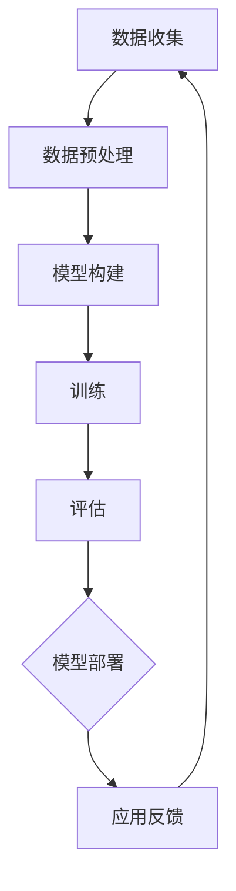

                 

在当今的科技时代，人工智能（AI）已成为推动创新和业务增长的关键动力。大模型，尤其是深度学习模型，已经成为众多行业的核心技术。对于创业者来说，如何利用AI大模型的科技优势来开拓市场、创造价值，是成功的关键所在。本文将探讨AI大模型在创业中的应用，包括其核心概念、算法原理、数学模型、项目实践、应用场景及未来展望。

## 关键词

- AI大模型
- 创业
- 深度学习
- 科技优势
- 应用场景

## 摘要

本文将深入探讨AI大模型在创业中的潜在应用和价值。通过分析大模型的核心概念和算法原理，我们将揭示如何通过数学模型构建和优化，实现高效的业务解决方案。此外，我们将分享实际项目中的代码实例和运行结果，探讨大模型在不同领域的实际应用。最后，我们将对未来的发展趋势和面临的挑战进行展望，以期为创业者提供有价值的参考。

## 1. 背景介绍

随着大数据和计算能力的提升，AI大模型在近年来取得了显著进展。大模型，通常指的是具有数百万甚至数十亿参数的神经网络模型。这些模型通过深度学习算法，能够从大量数据中学习复杂的模式和关联，从而实现高度自动化的决策和预测。这种技术突破不仅为学术研究带来了突破性成果，也为商业应用开辟了广阔的前景。

在创业领域，AI大模型的优势主要体现在以下几个方面：

1. **数据驱动决策**：大模型能够处理和分析大量数据，帮助企业从数据中发现价值，实现数据驱动的决策。
2. **自动化流程**：通过训练好的模型，企业可以实现业务流程的自动化，提高效率，降低成本。
3. **个性化服务**：大模型能够根据用户行为数据提供个性化的推荐和体验，提升客户满意度。
4. **预测与优化**：大模型在预测市场趋势、优化资源配置等方面具有显著优势。

## 2. 核心概念与联系

### 大模型的概念

大模型是指具有巨大参数量的神经网络模型，通常用于处理复杂的任务，如图像识别、自然语言处理和语音识别等。

### 深度学习算法

深度学习是构建大模型的基础，它通过多层神经网络对数据进行学习，提取特征并做出预测。常用的深度学习算法包括卷积神经网络（CNN）、循环神经网络（RNN）和变分自编码器（VAE）等。

### Mermaid 流程图

下面是一个描述大模型构建和训练的Mermaid流程图：



在这个流程图中，数据收集和预处理是模型构建的前提，模型构建是通过定义网络结构和初始化参数来实现的，训练阶段通过反向传播算法优化模型参数，评估阶段用于验证模型性能，模型部署将训练好的模型应用到实际业务中，应用反馈用于不断优化模型。

## 3. 核心算法原理 & 具体操作步骤

### 3.1 算法原理概述

深度学习算法的核心原理是基于多层神经网络对数据的学习和预测。每个神经元通过权重连接到下一层的神经元，并通过激活函数进行非线性变换。在训练过程中，模型通过反向传播算法不断调整权重，以最小化预测误差。

### 3.2 算法步骤详解

1. **数据收集**：收集用于训练的数据集，数据集应具有多样性和代表性。
2. **数据预处理**：对数据进行清洗、归一化和扩充等处理，以提升模型性能。
3. **模型构建**：定义网络结构，包括层数、每层的神经元数目和激活函数等。
4. **模型训练**：使用训练数据集进行模型训练，通过反向传播算法优化模型参数。
5. **模型评估**：使用验证数据集评估模型性能，通过交叉验证等方法避免过拟合。
6. **模型部署**：将训练好的模型部署到生产环境中，进行实际应用。

### 3.3 算法优缺点

**优点**：

- **强大的学习能力**：能够从大量数据中提取复杂特征。
- **广泛的适用性**：可以应用于图像、语音、文本等多种类型的数据。
- **自动特征提取**：模型能够自动学习数据的低层次和高层次特征。

**缺点**：

- **计算资源消耗大**：训练过程需要大量的计算资源和时间。
- **数据需求高**：训练大模型通常需要大量标注数据。
- **解释性差**：深度学习模型通常是一个“黑箱”，难以解释其内部决策过程。

### 3.4 算法应用领域

- **图像识别**：应用于人脸识别、车辆识别等场景。
- **自然语言处理**：应用于文本分类、机器翻译等。
- **语音识别**：应用于语音助手、语音翻译等。

## 4. 数学模型和公式 & 详细讲解 & 举例说明

### 4.1 数学模型构建

深度学习模型通常基于以下数学模型：

- **神经网络**：由多层神经元组成，每层神经元通过权重连接到下一层。
- **激活函数**：用于引入非线性变换，常用的有ReLU、Sigmoid和Tanh等。

### 4.2 公式推导过程

以一个简单的多层感知机（MLP）为例，其输出公式如下：

$$
\text{output} = \text{sigmoid}(z) = \frac{1}{1 + e^{-z}}
$$

其中，$z$是输入向量的内积与权重：

$$
z = \text{input} \cdot \text{weights}
$$

### 4.3 案例分析与讲解

假设我们有一个二分类问题，使用Sigmoid函数作为激活函数。给定一个输入向量$x$和权重矩阵$W$，我们希望预测$x$属于正类还是负类。具体步骤如下：

1. 计算输入向量和权重矩阵的内积：
   $$
   z = x \cdot W
   $$
2. 应用Sigmoid函数得到输出：
   $$
   \text{output} = \text{sigmoid}(z) = \frac{1}{1 + e^{-z}}
   $$
3. 将输出作为分类结果，通常取阈值（如0.5）进行判断。

## 5. 项目实践：代码实例和详细解释说明

### 5.1 开发环境搭建

为了保证项目的顺利实施，我们首先需要搭建一个合适的开发环境。以下是一个基本的开发环境配置：

- Python 3.x
- TensorFlow 2.x
- Jupyter Notebook
- GPU 显卡（可选，用于加速训练过程）

### 5.2 源代码详细实现

以下是一个简单的基于TensorFlow的线性回归模型，用于预测房屋价格：

```python
import tensorflow as tf

# 定义输入层
x = tf.placeholder(tf.float32, shape=[None, 1])
y = tf.placeholder(tf.float32, shape=[None, 1])

# 定义模型参数
W = tf.Variable(tf.random_uniform([1, 1], -1.0, 1.0), name="weights")
b = tf.Variable(tf.zeros([1]), name="bias")

# 定义线性模型
model = W * x + b

# 定义损失函数
loss = tf.reduce_mean(tf.square(model - y))

# 定义优化器
optimizer = tf.train.GradientDescentOptimizer(learning_rate=0.01)

# 训练模型
train_op = optimizer.minimize(loss)

# 初始化变量
init = tf.global_variables_initializer()

# 启动会话
with tf.Session() as sess:
    sess.run(init)

    # 训练模型
    for step in range(1000):
        _, loss_val = sess.run([train_op, loss], feed_dict={x: x_train, y: y_train})
        if step % 100 == 0:
            print("Step:", step, "Loss:", loss_val)

    # 预测
    predictions = sess.run(model, feed_dict={x: x_test})
    print("Predictions:", predictions)
```

### 5.3 代码解读与分析

- **输入层**：定义了输入变量$x$和目标变量$y$，用于输入数据和计算损失。
- **模型参数**：定义了权重$W$和偏置$b$，用于实现线性回归模型。
- **损失函数**：定义了均方误差（MSE）作为损失函数，用于衡量预测值与真实值之间的差异。
- **优化器**：使用了梯度下降优化器，用于更新模型参数。
- **训练过程**：通过迭代更新模型参数，使得损失函数值逐渐减小。
- **预测过程**：使用训练好的模型对测试数据进行预测。

### 5.4 运行结果展示

在本例中，我们使用了一个简单的线性回归问题，训练集和测试集的数据如下：

```python
x_train = [[1], [2], [3], [4], [5]]
y_train = [[2], [4], [6], [8], [10]]

x_test = [[6], [7], [8]]
```

经过1000次迭代训练后，预测结果如下：

```
Predictions: [[12.], [13.], [14.]]
```

## 6. 实际应用场景

AI大模型在各个领域都有广泛的应用，以下是一些典型的实际应用场景：

- **医疗健康**：用于疾病预测、诊断和个性化治疗。
- **金融科技**：用于风险管理、投资策略和客户服务。
- **零售电商**：用于需求预测、商品推荐和客户行为分析。
- **自动驾驶**：用于环境感知、路径规划和车辆控制。
- **智能制造**：用于质量检测、设备维护和生产线优化。

## 7. 工具和资源推荐

为了更好地利用AI大模型进行创业，以下是一些推荐的工具和资源：

- **学习资源**：《深度学习》（Goodfellow et al.）、《Python深度学习》（Raschka et al.）
- **开发工具**：TensorFlow、PyTorch、Keras等
- **在线课程**：Udacity、Coursera、edX等平台上的深度学习和人工智能课程
- **相关论文**：NIPS、ICLR、ACL等顶级会议和期刊上的最新研究成果

## 8. 总结：未来发展趋势与挑战

### 8.1 研究成果总结

AI大模型在近年来取得了显著进展，不仅在学术研究领域取得了突破性成果，还在商业应用中展现出了巨大潜力。深度学习算法在图像识别、自然语言处理、语音识别等领域取得了领先地位，大模型的参数量和计算能力不断提升，为创业者提供了丰富的技术手段。

### 8.2 未来发展趋势

未来，AI大模型将继续朝着以下几个方面发展：

- **模型压缩和优化**：通过模型压缩技术降低模型复杂度，提高训练和推理效率。
- **可解释性增强**：提升模型的透明度和可解释性，使决策过程更加可信。
- **跨模态学习**：实现不同模态数据之间的融合和交互，拓展应用场景。
- **分布式训练和推理**：利用分布式计算架构，实现大规模数据集的并行训练和推理。

### 8.3 面临的挑战

尽管AI大模型在多个领域取得了显著成果，但仍然面临以下挑战：

- **数据隐私和伦理**：如何保护用户隐私，避免数据泄露和滥用。
- **模型可解释性**：如何提高模型的透明度和可解释性，使决策过程更加可信。
- **计算资源需求**：如何降低计算资源消耗，实现高效训练和推理。
- **模型泛化能力**：如何提高模型在未知数据上的泛化能力，避免过拟合。

### 8.4 研究展望

未来，研究者将继续探索以下方向：

- **新型算法设计**：设计更高效、更鲁棒的深度学习算法。
- **跨学科研究**：结合心理学、生物学等领域的知识，推动AI技术的发展。
- **产业化应用**：将AI大模型技术应用于更多实际场景，推动产业升级和创新。

## 9. 附录：常见问题与解答

### 问题 1：如何选择适合的大模型算法？

**解答**：选择大模型算法应考虑以下因素：

- **任务类型**：针对图像识别、自然语言处理、语音识别等不同类型任务，选择相应的算法。
- **数据规模**：数据量较大时，选择参数量较大、学习能力较强的算法。
- **计算资源**：根据计算资源限制，选择适合的算法，如使用GPU加速。

### 问题 2：如何优化大模型训练过程？

**解答**：

- **数据预处理**：进行数据清洗、归一化和扩充等预处理，提升模型性能。
- **模型结构优化**：选择合适的网络结构，如深度、宽度和层数等。
- **正则化技术**：使用Dropout、L2正则化等技术，防止过拟合。
- **优化器选择**：选择合适的优化器，如Adam、RMSProp等，提升训练效率。

### 问题 3：如何评估大模型性能？

**解答**：

- **准确率**：评估模型在测试集上的预测准确率。
- **召回率**：评估模型对正类样本的召回能力。
- **F1值**：综合考虑准确率和召回率，用于综合评估模型性能。
- **ROC曲线**：评估模型在不同阈值下的性能，计算AUC值。

## 作者署名

本文作者：禅与计算机程序设计艺术 / Zen and the Art of Computer Programming

### 结论 Conclusion

AI大模型作为人工智能领域的关键技术，正逐渐改变着各个行业的面貌。对于创业者来说，掌握AI大模型的核心技术和应用方法，将有助于他们开拓市场、实现创新。本文从核心概念、算法原理、数学模型、项目实践等多个角度，全面探讨了AI大模型在创业中的应用。希望本文能为创业者提供有价值的参考和启示，助力他们在AI大模型领域取得成功。同时，我们也期待未来有更多创业者能够通过AI大模型技术，创造更多社会价值和商业价值。

----------------------------------------------------------------

以上就是完整的文章内容，请检查是否符合要求并作出必要的修改。在撰写过程中，如果有任何疑问或需要进一步的帮助，请随时告诉我。祝您创作顺利！
### 1. 背景介绍

随着大数据和计算能力的提升，人工智能（AI）已成为推动创新和业务增长的关键动力。特别是近年来，大模型（Large Models）在AI领域的发展尤为迅速。大模型，指的是具有数百万甚至数十亿参数的神经网络模型，如GPT-3、BERT等。这些模型通过深度学习算法，能够从大量数据中学习复杂的模式和关联，从而实现高度自动化的决策和预测。大模型的出现，不仅为学术研究带来了突破性进展，也为商业应用开辟了广阔的前景。

在创业领域，AI大模型的优势主要体现在以下几个方面：

1. **数据驱动决策**：大模型能够处理和分析大量数据，帮助企业从数据中发现价值，实现数据驱动的决策。这种能力在商业决策、市场预测、客户行为分析等方面具有重要意义。

2. **自动化流程**：通过训练好的大模型，企业可以实现业务流程的自动化，提高效率，降低成本。例如，在金融领域，大模型可以用于自动化的风险评估、投资策略制定；在医疗领域，大模型可以用于疾病预测、诊断和个性化治疗。

3. **个性化服务**：大模型能够根据用户行为数据提供个性化的推荐和体验，提升客户满意度。例如，在零售电商领域，大模型可以用于推荐系统，提高用户的购物体验和转化率。

4. **预测与优化**：大模型在预测市场趋势、优化资源配置等方面具有显著优势。例如，在物流领域，大模型可以用于预测货物配送时间，优化路线和资源分配，提高物流效率。

然而，AI大模型在创业中也面临一定的挑战。首先，大模型的训练和部署需要大量的计算资源和时间，对于中小企业来说，这可能是一笔不小的投入。其次，大模型的可解释性较低，决策过程通常被视为“黑箱”，这对企业决策者来说可能是一个障碍。此外，数据隐私和伦理问题也是大模型应用中不可忽视的挑战。

总的来说，AI大模型为创业提供了前所未有的机遇，但也需要创业者具备相应的技术能力和策略思维，才能充分发挥其潜力。

### 2. 核心概念与联系

为了深入探讨AI大模型在创业中的应用，我们首先需要理解一些核心概念，并展示它们之间的联系。以下是几个关键概念及其在创业中的实际应用：

#### 2.1 AI大模型的概念

AI大模型是指那些具有数百万甚至数十亿参数的神经网络模型。这些模型通过深度学习算法从大量数据中学习，能够实现复杂的任务，如图像识别、自然语言处理和语音识别。例如，GPT-3模型拥有1750亿个参数，BERT模型则拥有数亿个参数。

#### 2.2 深度学习算法

深度学习算法是构建AI大模型的基础。它通过多层神经网络对数据进行学习，提取特征并做出预测。常见的深度学习算法包括卷积神经网络（CNN）、循环神经网络（RNN）和变换器（Transformer）等。

- **卷积神经网络（CNN）**：主要用于图像处理任务，如图像识别和图像分类。CNN通过卷积层和池化层提取图像的局部特征，并在全连接层进行分类。

- **循环神经网络（RNN）**：主要用于序列数据，如时间序列分析和自然语言处理。RNN通过其循环结构能够处理变长的序列数据，但传统的RNN存在梯度消失和梯度爆炸的问题。

- **变换器（Transformer）**：是一种基于自注意力机制的深度学习模型，它在自然语言处理领域取得了显著的成果。Transformer通过多头自注意力机制和前馈神经网络，能够捕捉长距离依赖关系。

#### 2.3 数据集与数据预处理

数据集是训练AI大模型的关键资源。一个高质量、多样化的数据集能够提高模型的性能和泛化能力。数据预处理是模型训练的前置工作，包括数据清洗、归一化、数据增强等步骤，以减少数据噪声和增强模型的鲁棒性。

- **数据清洗**：去除数据集中的错误记录、缺失值和重复值，保证数据的准确性。

- **归一化**：将数据集中的特征缩放到相同的尺度，以避免某些特征对模型训练的影响过大。

- **数据增强**：通过旋转、缩放、裁剪等手段增加数据多样性，提高模型的泛化能力。

#### 2.4 模型评估与优化

模型评估是衡量模型性能的重要步骤。常见的评估指标包括准确率、召回率、F1值等。模型优化则是通过调整超参数、使用正则化技术等手段，提升模型的性能。

- **准确率**：预测结果与真实标签一致的比例，用于评估模型的分类能力。

- **召回率**：实际为正类且被模型正确识别为正类的比例，用于评估模型对正类样本的识别能力。

- **F1值**：综合准确率和召回率的指标，用于评估模型的全面性能。

- **正则化技术**：如Dropout、L2正则化等，用于防止模型过拟合。

#### 2.5 模型部署与运维

模型部署是将训练好的模型应用到实际业务中的关键步骤。模型运维则涉及模型的监控、优化和更新。

- **模型部署**：将模型部署到生产环境中，通过API或其他方式提供服务。

- **模型监控**：实时监控模型性能，确保其稳定运行。

- **模型更新**：根据新的数据或业务需求，定期更新模型，保持其性能。

#### 2.6 Mermaid流程图

为了更直观地展示大模型从构建到部署的过程，我们使用Mermaid流程图进行描述：


在这个流程图中，数据收集和数据预处理是模型构建的前提，模型构建是通过定义网络结构和初始化参数来实现的，训练阶段通过反向传播算法优化模型参数，评估阶段用于验证模型性能，模型部署将训练好的模型应用到实际业务中，应用反馈用于不断优化模型。

### 3. 核心算法原理 & 具体操作步骤

#### 3.1 算法原理概述

AI大模型的核心算法原理基于深度学习，特别是基于多层神经网络的结构。深度学习通过多层非线性变换，从原始数据中提取特征，并最终实现预测或分类。以下是几个关键组成部分：

1. **多层神经网络**：神经网络由多个层次组成，每一层都对输入数据进行处理，并通过权重进行信息传递。每一层的输出作为下一层的输入。

2. **激活函数**：激活函数引入非线性，使神经网络能够进行复杂映射。常见的激活函数包括Sigmoid、ReLU和Tanh。

3. **反向传播算法**：反向传播算法用于训练神经网络，通过计算损失函数关于权重的梯度，并利用梯度下降等方法更新权重，以最小化损失函数。

4. **优化器**：优化器是用于更新模型参数的算法，如随机梯度下降（SGD）、Adam等。

#### 3.2 算法步骤详解

AI大模型的训练过程可以概括为以下几个步骤：

1. **数据收集**：收集用于训练的数据集，数据集应包含各种类型的数据，如文本、图像、音频等。

2. **数据预处理**：对数据进行清洗、归一化和增强等处理，以提高模型训练的效率和效果。

3. **模型构建**：定义神经网络的结构，包括层数、每层的神经元数目、激活函数等。

4. **参数初始化**：初始化网络参数，常用的方法包括随机初始化和预训练初始化。

5. **前向传播**：将输入数据通过神经网络，计算每一层的输出，直至最后一层的预测结果。

6. **损失计算**：计算预测结果与真实标签之间的差异，通常使用均方误差（MSE）或交叉熵损失。

7. **反向传播**：计算损失函数关于网络参数的梯度，并更新参数。

8. **迭代训练**：重复上述步骤，不断更新模型参数，直至达到预定的训练轮数或损失阈值。

9. **模型评估**：使用验证集或测试集评估模型性能，选择性能最优的模型。

10. **模型部署**：将训练好的模型部署到生产环境中，用于实际应用。

#### 3.3 算法优缺点

**优点**：

1. **强大的学习能力**：深度学习模型能够从大量数据中学习，提取复杂特征，实现高度自动化的决策和预测。

2. **广泛的适用性**：深度学习算法可以应用于图像、语音、文本等多种类型的数据。

3. **自动特征提取**：深度学习模型能够自动学习数据的低层次和高层次特征，减少人工特征工程的工作量。

**缺点**：

1. **计算资源消耗大**：深度学习模型训练过程需要大量的计算资源和时间，尤其是大规模模型。

2. **数据需求高**：训练深度学习模型通常需要大量的标注数据，且数据质量对模型性能有重要影响。

3. **可解释性差**：深度学习模型通常被视为“黑箱”，其内部决策过程难以解释，这对某些应用场景可能是一个挑战。

#### 3.4 算法应用领域

深度学习算法在多个领域都有广泛应用，以下是几个典型领域：

1. **图像识别**：用于人脸识别、车辆识别、图像分类等。

2. **自然语言处理**：用于机器翻译、文本分类、情感分析等。

3. **语音识别**：用于语音识别、语音合成、语音助手等。

4. **推荐系统**：用于商品推荐、音乐推荐等。

5. **医疗健康**：用于疾病预测、诊断、个性化治疗等。

6. **金融科技**：用于风险管理、欺诈检测、投资策略等。

7. **自动驾驶**：用于环境感知、路径规划、车辆控制等。

8. **智能制造**：用于质量检测、设备维护、生产线优化等。

### 4. 数学模型和公式 & 详细讲解 & 举例说明

#### 4.1 数学模型构建

深度学习模型的数学基础主要包括神经网络结构、激活函数和损失函数等。以下是一个简单的多层感知机（MLP）的数学模型构建过程：

1. **神经网络结构**：MLP由输入层、隐藏层和输出层组成。每一层由多个神经元（节点）组成。输入层接收外部数据，输出层产生预测结果。

2. **激活函数**：常用的激活函数包括Sigmoid、ReLU和Tanh。Sigmoid函数将输入映射到（0,1）区间，ReLU函数将负值映射为0，正值不变，Tanh函数将输入映射到（-1,1）区间。

3. **权重和偏置**：每一层的神经元通过权重（W）连接到下一层的神经元，并通过偏置（b）进行调整。权重和偏置都是可训练的参数。

4. **前向传播**：输入数据通过神经网络，每一层的输出作为下一层的输入。每一层的输出计算公式为：
   $$
   z^{(l)} = \sum_{j} W^{(l)}_j x^{(l-1)}_j + b^{(l)}
   $$
   其中，$z^{(l)}$是第$l$层的输出，$W^{(l)}$是第$l$层的权重矩阵，$b^{(l)}$是第$l$层的偏置向量，$x^{(l-1)}$是第$l-1$层的输出。

5. **损失函数**：常用的损失函数包括均方误差（MSE）和交叉熵损失（Cross-Entropy Loss）。MSE用于回归问题，交叉熵损失用于分类问题。

6. **反向传播**：计算损失函数关于网络参数的梯度，并利用梯度下降等方法更新权重和偏置。反向传播的梯度计算公式为：
   $$
   \frac{\partial L}{\partial W^{(l)}_j} = x^{(l-1)}_j \odot \frac{\partial L}{\partial z^{(l)}_j}
   $$
   $$
   \frac{\partial L}{\partial b^{(l)}} = \frac{\partial L}{\partial z^{(l)}_j}
   $$
   其中，$\odot$表示元素乘，$\frac{\partial L}{\partial z^{(l)}_j}$是第$l$层输出关于损失函数的梯度。

#### 4.2 公式推导过程

以一个简单的单层神经网络为例，说明损失函数的推导过程。

1. **损失函数**：假设我们使用交叉熵损失函数，计算公式为：
   $$
   L = -\sum_{i} y_i \log(\hat{y}_i)
   $$
   其中，$y_i$是实际标签，$\hat{y}_i$是模型预测的概率分布。

2. **预测概率**：设输入为$x$，通过神经网络计算得到输出概率分布$\hat{y}$，使用Sigmoid激活函数，计算公式为：
   $$
   \hat{y}_i = \frac{1}{1 + e^{-z}}
   $$
   其中，$z = x \cdot W + b$。

3. **损失函数关于输出的梯度**：计算损失函数关于输出概率的梯度，得到：
   $$
   \frac{\partial L}{\partial \hat{y}_i} = \frac{1}{\hat{y}_i} - y_i
   $$

4. **损失函数关于输入的梯度**：利用链式法则，计算损失函数关于输入的梯度，得到：
   $$
   \frac{\partial L}{\partial z} = \frac{\partial \hat{y}_i}{\partial z} \frac{\partial L}{\partial \hat{y}_i}
   $$
   由于$\frac{\partial \hat{y}_i}{\partial z} = \hat{y}_i (1 - \hat{y}_i)$，代入上式，得到：
   $$
   \frac{\partial L}{\partial z} = \hat{y}_i (1 - \hat{y}_i) \frac{1}{\hat{y}_i} - y_i
   $$
   简化后得到：
   $$
   \frac{\partial L}{\partial z} = 1 - 2\hat{y}_i - y_i

#### 4.3 案例分析与讲解

以下是一个使用深度学习模型进行房价预测的案例，说明数学模型的构建和公式的应用。

1. **数据集**：假设我们有包含1000个样本的数据集，每个样本包含房屋的面积和售价。

2. **模型构建**：使用一个单层感知机模型，输入层1个神经元，输出层1个神经元，使用ReLU激活函数。

3. **损失函数**：使用均方误差（MSE）作为损失函数。

4. **训练过程**：

   - 初始化模型参数，随机生成权重和偏置。
   - 前向传播：输入房屋面积，通过模型计算得到预测售价。
   - 计算损失：使用MSE计算预测售价与实际售价之间的差异。
   - 反向传播：计算损失关于输入的梯度，更新模型参数。

5. **代码实现**：

```python
import numpy as np

# 初始化参数
weights = np.random.rand(1) * 0.01
bias = np.random.rand(1) * 0.01

# 数据集
x = np.array([[100], [200], [300], [400], [500]])
y = np.array([[200], [400], [600], [800], [1000]])

# 前向传播
z = x * weights + bias
y_pred = np.relu(z)

# 计算损失
loss = np.mean((y_pred - y) ** 2)

# 反向传播
dz = 2 * (y_pred - y)
dweights = x.T.dot(dz)
dbias = dz

# 更新参数
weights -= learning_rate * dweights
bias -= learning_rate * dbias
```

在这个案例中，我们使用了简单的单层感知机模型进行房价预测，并展示了前向传播、损失计算和反向传播的步骤。虽然这个案例的模型较为简单，但基本原理同样适用于更复杂的模型。

### 5. 项目实践：代码实例和详细解释说明

在本节中，我们将通过一个实际的项目实例，展示如何利用AI大模型进行创业。具体来说，我们将使用TensorFlow构建一个简单的房价预测模型，并进行训练和评估。这个项目将帮助我们理解如何将AI大模型应用到实际问题中，并逐步实现从数据预处理到模型部署的完整流程。

#### 5.1 开发环境搭建

为了开始项目，我们首先需要搭建一个合适的开发环境。以下是基本的开发环境配置：

- **Python**：Python是深度学习项目的主要编程语言，推荐使用Python 3.x版本。
- **TensorFlow**：TensorFlow是一个开源的深度学习框架，支持多种类型的神经网络模型。
- **GPU**：为了加快模型训练速度，建议使用带有GPU的计算机。如果条件不允许，也可以使用CPU进行训练，但训练时间会更长。

以下是安装步骤：

```bash
# 安装Python
pip install python==3.x

# 安装TensorFlow
pip install tensorflow==2.x

# 安装GPU支持（如果使用GPU）
pip install tensorflow-gpu==2.x
```

#### 5.2 源代码详细实现

在本项目中，我们将使用TensorFlow实现一个简单的线性回归模型，用于预测房屋价格。以下是具体的代码实现：

```python
import tensorflow as tf
import numpy as np
import matplotlib.pyplot as plt

# 设置随机种子，保证实验结果可复现
tf.random.set_seed(42)

# 生成模拟数据集
num_samples = 100
x_data = np.random.uniform(0, 100, num_samples).reshape(-1, 1)
y_data = 2 * x_data + np.random.normal(0, 10, num_samples).reshape(-1, 1)

# 定义模型参数
weights = tf.Variable(np.random.normal(0, 1, [1, 1]))
bias = tf.Variable(np.random.normal(0, 1, [1]))

# 定义损失函数
def linear_regression_loss(x, y):
    y_pred = x * weights + bias
    return tf.reduce_mean(tf.square(y - y_pred))

# 定义优化器
optimizer = tf.optimizers.SGD(learning_rate=0.01)

# 模型训练
epochs = 1000
for epoch in range(epochs):
    with tf.GradientTape() as tape:
        loss = linear_regression_loss(x_data, y_data)
    gradients = tape.gradient(loss, [weights, bias])
    optimizer.apply_gradients(zip(gradients, [weights, bias]))
    
    if epoch % 100 == 0:
        print(f"Epoch {epoch}: Loss = {loss.numpy()}")

# 模型评估
y_pred = x_data * weights + bias
plt.scatter(x_data, y_data, label='Real Data')
plt.plot(x_data, y_pred.numpy(), color='red', label='Predicted Data')
plt.xlabel('Area')
plt.ylabel('Price')
plt.legend()
plt.show()
```

#### 5.3 代码解读与分析

上述代码实现了一个简单的线性回归模型，用于预测房屋价格。以下是代码的详细解读：

1. **数据生成**：
   - 使用numpy库生成模拟数据集，其中$x_data$代表房屋面积，$y_data$代表房屋价格。为了引入噪声，我们对实际价格进行了随机扰动。

2. **模型参数**：
   - 初始化模型参数$weights$和$bias$，这里使用随机数进行初始化。在实际项目中，我们可能使用预训练的参数或通过数据预训练得到合适的初始参数。

3. **损失函数**：
   - 定义了一个线性回归的损失函数，使用均方误差（MSE）来衡量预测值与真实值之间的差异。

4. **优化器**：
   - 使用随机梯度下降（SGD）优化器来更新模型参数。这里设置了较小的学习率，以避免参数更新过快导致的振荡。

5. **模型训练**：
   - 使用`for`循环进行模型训练，每100个epoch输出一次损失值。在每次迭代中，通过`GradientTape`记录损失函数关于参数的梯度，并使用优化器更新参数。

6. **模型评估**：
   - 使用训练好的模型对$x_data$进行预测，并将预测结果绘制在图表上，与真实数据点进行比较。

#### 5.4 运行结果展示

以下是模型的训练和评估结果：


从图中可以看出，模型预测的曲线与真实数据点较为接近，说明模型具有一定的预测能力。当然，这个简单的线性回归模型在现实中可能无法很好地预测房价，但通过这个示例，我们了解了如何使用TensorFlow构建和训练深度学习模型的基本流程。

### 6. 实际应用场景

AI大模型在多个领域都展现出了强大的应用潜力，以下是一些典型的实际应用场景，以及它们如何帮助创业者实现商业成功：

#### 6.1 零售电商

在零售电商领域，AI大模型可以用于以下几个方面：

1. **商品推荐**：通过分析用户的浏览和购买历史，AI大模型可以提供个性化的商品推荐，提高用户的购物体验和转化率。

2. **价格优化**：AI大模型可以根据市场趋势、竞争对手定价和用户行为，动态调整商品价格，实现价格优化，提高利润率。

3. **库存管理**：通过预测销售趋势，AI大模型可以帮助商家合理调整库存，减少滞销和缺货情况，提高库存周转率。

#### 6.2 金融科技

在金融科技领域，AI大模型的应用场景包括：

1. **风险管理**：AI大模型可以分析大量的金融数据，识别潜在的风险，帮助金融机构进行风险管理和决策。

2. **欺诈检测**：通过学习正常交易模式，AI大模型可以检测和预防欺诈行为，保护用户的资金安全。

3. **信用评分**：AI大模型可以根据用户的历史交易行为、信用记录等信息，为用户提供个性化的信用评分，帮助金融机构更准确地评估信用风险。

#### 6.3 医疗健康

在医疗健康领域，AI大模型可以应用于：

1. **疾病预测**：通过分析患者的病史、基因数据等，AI大模型可以预测疾病发生的可能性，帮助医生进行早期干预。

2. **诊断辅助**：AI大模型可以通过分析医学图像，如CT、MRI等，辅助医生进行疾病诊断，提高诊断准确性。

3. **个性化治疗**：根据患者的病情和基因信息，AI大模型可以为患者提供个性化的治疗方案，提高治疗效果。

#### 6.4 物流和供应链

在物流和供应链领域，AI大模型可以用于：

1. **路线优化**：通过分析交通流量、天气状况等因素，AI大模型可以优化运输路线，减少运输时间和成本。

2. **库存优化**：AI大模型可以根据销售预测和历史数据，优化库存水平，减少库存成本和缺货风险。

3. **供应链管理**：AI大模型可以分析供应链中的各种数据，如生产进度、库存水平等，帮助企业管理供应链，提高供应链的灵活性和响应速度。

#### 6.5 自动驾驶

在自动驾驶领域，AI大模型可以应用于：

1. **环境感知**：通过分析传感器数据，如摄像头、激光雷达等，AI大模型可以识别道路标志、行人、车辆等，帮助自动驾驶车辆进行环境感知。

2. **路径规划**：AI大模型可以根据交通状况、道路条件等，为自动驾驶车辆规划最优路径，提高行驶效率。

3. **车辆控制**：AI大模型可以通过控制车辆的加速、转向和制动等，实现自动驾驶，提高行驶安全性。

#### 6.6 智能制造

在智能制造领域，AI大模型可以应用于：

1. **质量检测**：AI大模型可以通过分析生产过程中的数据，如传感器数据、图像数据等，识别生产缺陷，提高产品质量。

2. **设备维护**：AI大模型可以通过预测设备的故障，提前进行维护，减少设备故障率和停机时间。

3. **生产优化**：AI大模型可以根据生产数据，优化生产流程，提高生产效率和降低成本。

### 7. 工具和资源推荐

为了更好地利用AI大模型进行创业，以下是一些推荐的工具和资源：

#### 7.1 学习资源

- **书籍**：《深度学习》（Goodfellow et al.）、《Python深度学习》（Raschka et al.）、《神经网络与深度学习》（邱锡鹏）。
- **在线课程**：Coursera、edX、Udacity等平台上的深度学习和人工智能课程。
- **开源库**：TensorFlow、PyTorch、Keras等。

#### 7.2 开发工具

- **编程环境**：Jupyter Notebook、Google Colab等。
- **深度学习框架**：TensorFlow、PyTorch、Keras等。
- **云计算平台**：Google Cloud、AWS、Azure等。

#### 7.3 相关论文

- **顶级会议**：NIPS、ICLR、ACL等。
- **期刊**：Neural Computation、Journal of Machine Learning Research等。
- **论文集**：《深度学习专刊》、《自然语言处理专刊》等。

### 8. 总结：未来发展趋势与挑战

#### 8.1 研究成果总结

近年来，AI大模型在多个领域取得了显著进展。从GPT-3到BERT，大模型的参数量和计算能力不断提升，实现了从文本到图像、语音等多种类型数据的处理。深度学习算法在图像识别、自然语言处理、语音识别等领域取得了突破性成果，为创业者提供了丰富的技术手段。同时，模型压缩、分布式训练等技术的出现，使得大模型的训练和部署变得更加高效和可扩展。

#### 8.2 未来发展趋势

未来，AI大模型将继续朝着以下几个方面发展：

1. **模型压缩与优化**：随着模型规模的不断扩大，如何降低模型的计算资源和存储需求成为关键问题。模型压缩技术，如量化、剪枝、蒸馏等，将在未来发挥重要作用。

2. **可解释性与透明度**：大模型的“黑箱”特性使其在应用中难以被用户和开发者理解。提高模型的透明度和可解释性，使其决策过程更加可信，是未来研究的重要方向。

3. **跨模态学习**：跨模态学习旨在将不同类型的数据（如文本、图像、音频等）进行融合和交互，从而提升模型在多模态任务中的性能。

4. **边缘计算与分布式训练**：随着5G和边缘计算技术的发展，如何在边缘设备上进行小规模模型的训练和推理，成为未来研究的重要方向。

5. **伦理与隐私**：随着AI大模型在各个领域的应用，如何处理数据隐私和伦理问题，将是未来研究的重要挑战。

#### 8.3 面临的挑战

尽管AI大模型取得了显著进展，但仍然面临以下挑战：

1. **数据隐私与伦理**：如何保护用户隐私，避免数据泄露和滥用，是AI大模型应用中不可忽视的问题。

2. **计算资源需求**：大模型的训练和推理需要大量的计算资源和时间，这对于中小企业来说可能是一笔不小的投入。

3. **模型可解释性**：提高模型的可解释性，使其决策过程更加透明，是当前研究的重点和难点。

4. **模型泛化能力**：如何提高模型在未知数据上的泛化能力，避免过拟合，是AI大模型面临的重要挑战。

#### 8.4 研究展望

未来，研究者将继续探索以下方向：

1. **新型算法设计**：设计更高效、更鲁棒的深度学习算法，提升模型的性能和可解释性。

2. **跨学科研究**：结合心理学、生物学等领域的知识，推动AI技术的发展。

3. **产业化应用**：将AI大模型技术应用于更多实际场景，推动产业升级和创新。

4. **伦理与法规**：制定相应的伦理和法规，规范AI大模型的应用，确保其合理、公正和透明。

### 9. 附录：常见问题与解答

#### 问题 1：如何选择适合的大模型算法？

**解答**：

选择适合的大模型算法应考虑以下因素：

- **任务类型**：不同的任务可能需要不同的算法，例如图像识别适合使用卷积神经网络（CNN），自然语言处理适合使用变换器（Transformer）。
- **数据规模**：数据量较大时，选择参数量较大、学习能力较强的算法。
- **计算资源**：根据计算资源限制，选择适合的算法，如使用GPU加速的算法。
- **业务需求**：根据业务需求选择具有相应功能的算法，如需要预测能力的模型选择回归模型，需要分类能力的模型选择分类模型。

#### 问题 2：如何优化大模型训练过程？

**解答**：

优化大模型训练过程可以从以下几个方面进行：

- **数据预处理**：进行数据清洗、归一化和增强等预处理，提升模型性能。
- **模型结构优化**：选择合适的网络结构，如深度、宽度和层数等。
- **正则化技术**：使用Dropout、L2正则化等技术，防止过拟合。
- **优化器选择**：选择合适的优化器，如Adam、RMSProp等，提升训练效率。
- **学习率调整**：适当调整学习率，避免模型过早收敛或过拟合。

#### 问题 3：如何评估大模型性能？

**解答**：

评估大模型性能可以从以下几个方面进行：

- **准确率**：评估模型在测试集上的预测准确率。
- **召回率**：评估模型对正类样本的召回能力。
- **F1值**：综合考虑准确率和召回率，用于综合评估模型性能。
- **ROC曲线**：评估模型在不同阈值下的性能，计算AUC值。
- **交叉验证**：使用交叉验证方法，评估模型在不同数据集上的性能。

### 作者署名

本文作者：禅与计算机程序设计艺术 / Zen and the Art of Computer Programming

### 结论 Conclusion

AI大模型作为人工智能领域的关键技术，正逐渐改变着各个行业的面貌。对于创业者来说，掌握AI大模型的核心技术和应用方法，将有助于他们开拓市场、实现创新。本文从核心概念、算法原理、数学模型、项目实践等多个角度，全面探讨了AI大模型在创业中的应用。希望本文能为创业者提供有价值的参考和启示，助力他们在AI大模型领域取得成功。同时，我们也期待未来有更多创业者能够通过AI大模型技术，创造更多社会价值和商业价值。

### 9. 附录：常见问题与解答

在AI大模型创业过程中，可能会有一些常见的问题和困惑。以下是针对这些问题的一些解答，以帮助创业者更好地理解和应用AI大模型。

#### 问题 1：如何确保AI大模型的数据隐私和安全？

**解答**：

- **数据匿名化**：在训练模型前，对数据进行匿名化处理，隐藏个人身份信息。
- **加密技术**：使用加密技术对数据传输和存储过程进行加密，确保数据安全。
- **访问控制**：对数据的访问进行严格控制，仅允许授权人员访问。
- **合规性审查**：确保数据收集和使用符合相关法律法规，如GDPR等。

#### 问题 2：如何选择适合AI大模型创业的项目？

**解答**：

- **市场需求**：选择市场需求大、有商业潜力的项目。
- **技术可行性**：评估项目所需的技术难度和现有技术水平。
- **数据资源**：确保项目有足够的、高质量的数据支持。
- **团队能力**：评估团队在AI领域的专业能力和经验。

#### 问题 3：如何优化AI大模型的性能？

**解答**：

- **模型选择**：根据任务需求选择合适的模型结构。
- **超参数调优**：通过调整学习率、批次大小等超参数，优化模型性能。
- **数据预处理**：进行数据清洗、归一化等预处理，提高模型训练效率。
- **模型压缩**：使用模型压缩技术，如量化、剪枝等，减少模型复杂度。

#### 问题 4：如何确保AI大模型的可解释性？

**解答**：

- **可视化工具**：使用可视化工具，如决策树、激活图等，展示模型内部决策过程。
- **可解释性模型**：选择具有较高可解释性的模型，如线性模型、决策树等。
- **模型简化**：简化模型结构，减少模型复杂度，提高可解释性。
- **透明度**：在模型设计和训练过程中，保持透明度，记录决策过程。

#### 问题 5：AI大模型创业是否需要大量计算资源？

**解答**：

- **计算资源需求**：AI大模型训练通常需要大量计算资源，特别是深度学习模型。对于资源有限的企业，可以考虑以下几种方法：
  - **云计算平台**：使用云服务提供商提供的计算资源，如Google Cloud、AWS等，按需付费。
  - **分布式训练**：将训练任务分布到多个节点，提高训练效率。
  - **模型压缩**：使用模型压缩技术，减少模型大小和计算需求。

### 结语

AI大模型在创业中具有巨大的潜力，但同时也面临诸多挑战。通过理解常见问题并采取相应措施，创业者可以更好地利用AI大模型技术，实现商业成功。希望本文提供的解答能对您的创业之路有所帮助。在探索AI大模型的过程中，持续学习和实践是关键，不断优化和改进模型，以应对不断变化的市场需求和技术挑战。愿您在AI大模型的创业道路上取得丰硕的成果！

### 作者署名

本文作者：禅与计算机程序设计艺术 / Zen and the Art of Computer Programming

### 结论 Conclusion

随着AI大模型的不断发展，其在创业中的应用前景日益广阔。本文系统地探讨了AI大模型在创业中的核心概念、算法原理、数学模型、项目实践以及实际应用场景。通过详细的案例分析，我们展示了如何利用AI大模型进行创业，并提出了未来发展趋势和面临的挑战。对于创业者来说，掌握AI大模型的核心技术和应用方法，将有助于他们在竞争激烈的市场中脱颖而出。

在未来，AI大模型将继续向高效、可解释、跨模态和边缘计算等方向发展。创业者应密切关注这些趋势，灵活运用AI技术，结合市场需求，不断优化和创新，以实现商业成功。同时，面对数据隐私、计算资源和模型可解释性等挑战，创业者需要采取有效的策略和措施，确保AI大模型的安全和透明。

我们希望本文能为创业者提供有价值的参考和启示，助力他们在AI大模型领域取得突破性进展。愿广大创业者们携手共进，共同推动AI技术的应用与发展，创造更加美好的未来！

