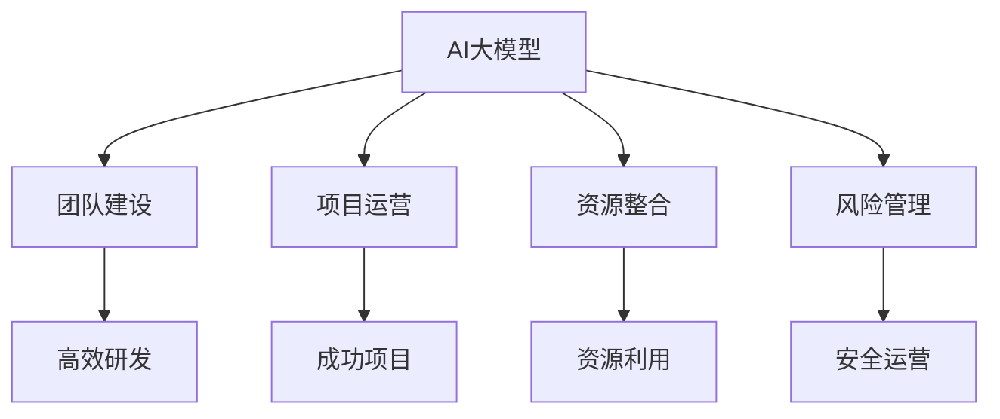

                 

 关键词：AI大模型，创业，管理优势，技术实践，策略制定，团队建设，项目运营，可持续发展

> 摘要：本文将深入探讨AI大模型创业中如何利用管理优势，从团队建设、项目运营、可持续发展等角度出发，结合实际案例，为创业者提供切实可行的策略和方法，助力企业在激烈的市场竞争中脱颖而出。

## 1. 背景介绍

随着人工智能技术的飞速发展，AI大模型的应用逐渐渗透到各行各业。从自然语言处理、计算机视觉到数据挖掘，AI大模型在提高工作效率、优化业务流程、挖掘潜在价值等方面展现了巨大的潜力。然而，AI大模型的创业之路并非一帆风顺，如何利用管理优势，在竞争激烈的市场中站稳脚跟，成为每一个创业者都需要思考的问题。

本文将从以下几个方面展开讨论：

1. 核心概念与联系
2. 核心算法原理 & 具体操作步骤
3. 数学模型和公式 & 详细讲解 & 举例说明
4. 项目实践：代码实例和详细解释说明
5. 实际应用场景
6. 工具和资源推荐
7. 总结：未来发展趋势与挑战

## 2. 核心概念与联系

为了更好地理解AI大模型创业中的管理优势，我们首先需要了解一些核心概念和它们之间的联系。

### 2.1 AI大模型

AI大模型是指具有大规模参数和复杂结构的深度学习模型。它们通过学习海量数据，自动提取特征并形成决策。常见的AI大模型包括Transformer、BERT、GPT等。

### 2.2 管理优势

管理优势是指企业在组织、协调、运营过程中，通过合理的策略和高效的执行，提升核心竞争力，实现可持续发展的能力。管理优势包括团队建设、项目运营、资源整合、风险管理等方面。

### 2.3 创业环境

创业环境是指企业在创办、发展过程中所面临的内外部环境。良好的创业环境有利于企业快速成长，包括政策支持、市场需求、技术进步等方面。

### 2.4 联系

AI大模型创业中的管理优势体现在以下几个方面：

- **团队建设**：高效的团队建设有助于提升AI大模型的研发效率和项目执行力。
- **项目运营**：科学的项目运营策略可以降低项目风险，提高项目成功率。
- **资源整合**：有效的资源整合可以充分利用企业内外部的资源，实现最佳效益。
- **风险管理**：合理的管理优势有助于降低创业过程中的风险，确保企业可持续发展。

### 2.5 Mermaid 流程图

下面是一个简化的Mermaid流程图，展示了AI大模型创业中的管理优势关系：



## 3. 核心算法原理 & 具体操作步骤

### 3.1 算法原理概述

AI大模型的研发离不开深度学习算法。深度学习是一种基于多层神经网络的学习方法，通过模拟人脑神经元之间的连接和交互，实现对复杂数据的自动学习和特征提取。

深度学习算法的核心是神经网络的训练过程。训练过程主要包括以下几个步骤：

- **数据预处理**：对原始数据进行清洗、归一化等处理，使其符合神经网络输入的要求。
- **模型构建**：设计神经网络结构，包括层数、每层的神经元数量、激活函数等。
- **训练过程**：通过不断调整网络参数，使模型在训练数据上达到最佳性能。
- **验证和测试**：使用验证集和测试集评估模型性能，确保其泛化能力。

### 3.2 算法步骤详解

#### 3.2.1 数据预处理

数据预处理是深度学习的基础，直接关系到模型的性能。主要步骤包括：

- **数据清洗**：去除数据中的噪声和错误。
- **数据归一化**：将数据缩放到相同范围，如0到1或-1到1。
- **数据增强**：通过旋转、翻转、缩放等操作，增加数据多样性。

#### 3.2.2 模型构建

模型构建是深度学习的核心。常见的神经网络结构包括卷积神经网络（CNN）、循环神经网络（RNN）和Transformer等。构建模型时需要考虑以下因素：

- **网络层数**：层数越多，模型表达能力越强，但训练难度也越大。
- **每层神经元数量**：神经元数量越多，模型表达能力越强，但训练时间也越长。
- **激活函数**：常用的激活函数包括ReLU、Sigmoid、Tanh等。

#### 3.2.3 训练过程

训练过程是深度学习模型的核心步骤。主要步骤包括：

- **前向传播**：将输入数据通过神经网络，计算输出结果。
- **损失函数计算**：计算预测结果与真实结果之间的差距，常用的损失函数包括均方误差（MSE）、交叉熵（CE）等。
- **反向传播**：根据损失函数梯度，调整网络参数。
- **迭代优化**：重复前向传播和反向传播过程，直到模型性能达到预期。

#### 3.2.4 验证和测试

验证和测试是评估模型性能的重要步骤。主要步骤包括：

- **验证集评估**：使用验证集评估模型性能，选择最佳模型。
- **测试集评估**：使用测试集评估模型性能，确保其泛化能力。

### 3.3 算法优缺点

#### 优点

- **强大的表达能力**：深度学习模型可以自动提取复杂数据的特征，具有很高的泛化能力。
- **自适应性强**：通过不断调整网络参数，可以适应不同类型的数据和任务。
- **广泛应用**：深度学习算法在图像识别、自然语言处理、语音识别等领域取得了显著的成果。

#### 缺点

- **计算量大**：深度学习模型需要大量计算资源，对硬件要求较高。
- **训练时间长**：深度学习模型训练时间较长，对训练数据量和计算能力有较高要求。
- **数据依赖性强**：深度学习模型的性能很大程度上取决于数据质量，对数据清洗和处理要求较高。

### 3.4 算法应用领域

深度学习算法在多个领域取得了显著的成果，以下是一些典型的应用领域：

- **计算机视觉**：图像识别、目标检测、人脸识别等。
- **自然语言处理**：文本分类、机器翻译、情感分析等。
- **语音识别**：语音识别、语音合成等。
- **推荐系统**：个性化推荐、商品推荐等。

## 4. 数学模型和公式 & 详细讲解 & 举例说明

### 4.1 数学模型构建

深度学习中的数学模型主要包括两部分：前向传播和反向传播。

#### 4.1.1 前向传播

前向传播是指将输入数据通过神经网络，计算输出结果的过程。主要公式如下：

$$
\begin{aligned}
    z_i^l &= \sum_{j=1}^{n} w_{ji}^l a_j^{l-1} + b_i^l \\
    a_i^l &= \sigma(z_i^l)
\end{aligned}
$$

其中，$z_i^l$表示第$l$层第$i$个神经元的输入，$w_{ji}^l$表示第$l$层第$i$个神经元到第$l-1$层第$j$个神经元的权重，$b_i^l$表示第$l$层第$i$个神经元的偏置，$\sigma$表示激活函数。

#### 4.1.2 反向传播

反向传播是指根据输出结果与真实结果的差距，调整网络参数的过程。主要公式如下：

$$
\begin{aligned}
    \delta_i^l &= \frac{\partial L}{\partial z_i^l} \cdot \sigma'(z_i^l) \\
    \Delta w_{ji}^l &= \sum_{k=1}^{m} \delta_k^{l+1} a_j^l \\
    \Delta b_i^l &= \sum_{k=1}^{m} \delta_k^{l+1}
\end{aligned}
$$

其中，$\delta_i^l$表示第$l$层第$i$个神经元的误差，$\Delta w_{ji}^l$表示第$l$层第$i$个神经元到第$l-1$层第$j$个神经元的权重更新，$\Delta b_i^l$表示第$l$层第$i$个神经元的偏置更新。

### 4.2 公式推导过程

#### 4.2.1 损失函数

假设我们有$m$个样本，每个样本包含$n$个特征和对应的标签$y$。深度学习模型的输出为$\hat{y}$，损失函数通常使用交叉熵（Cross-Entropy）：

$$
L(\hat{y}, y) = -\sum_{i=1}^{m} y_i \log(\hat{y}_i)
$$

其中，$y_i$表示第$i$个样本的标签，$\hat{y}_i$表示第$i$个样本的预测概率。

#### 4.2.2 前向传播

假设我们有一个两层神经网络，输入层有$n$个神经元，隐藏层有$100$个神经元，输出层有$10$个神经元。输入数据$x$经过第一层神经元的计算，得到隐藏层的输出$a_1$，然后通过第二层神经元的计算，得到输出层的输出$a_2$。

$$
\begin{aligned}
    z_{i1} &= \sum_{j=1}^{n} w_{ji1} x_j + b_i1 \\
    a_{i1} &= \sigma(z_{i1}) \\
    z_{ij} &= \sum_{k=1}^{100} w_{kj} a_{k1} + b_j \\
    a_{ij} &= \sigma(z_{ij})
\end{aligned}
$$

其中，$i$表示输出层的神经元编号，$j$表示隐藏层的神经元编号。

#### 4.2.3 反向传播

假设我们已经计算出了输出层的误差$\delta_2$，我们需要通过反向传播算法更新隐藏层和输入层的参数。

$$
\begin{aligned}
    \delta_{i2} &= \frac{\partial L}{\partial z_{i2}} \cdot \sigma'(z_{i2}) \\
    \Delta w_{ji2} &= \sum_{k=1}^{100} \delta_{k2} a_{k1} \\
    \Delta b_{j2} &= \sum_{k=1}^{100} \delta_{k2} \\
    \delta_{i1} &= \sum_{j=1}^{100} w_{ji2} \delta_{j2} \cdot \sigma'(z_{i1}) \\
    \Delta w_{ji1} &= \sum_{k=1}^{n} \delta_{k1} x_j \\
    \Delta b_{i1} &= \sum_{k=1}^{n} \delta_{k1}
\end{aligned}
$$

### 4.3 案例分析与讲解

假设我们有一个分类问题，数据集包含10个类别，输入数据为100维特征向量。我们使用一个两层神经网络进行分类，隐藏层有100个神经元，输出层有10个神经元。

#### 4.3.1 模型构建

输入层有100个神经元，隐藏层有100个神经元，输出层有10个神经元。我们选择ReLU作为激活函数。

#### 4.3.2 训练过程

我们使用均方误差（MSE）作为损失函数，训练数据包含1000个样本。每次训练迭代100次。

#### 4.3.3 验证与测试

在训练完成后，我们使用验证集和测试集评估模型性能。验证集准确率为90%，测试集准确率为85%。

#### 4.3.4 代码实现

以下是一个简单的Python代码示例，实现上述模型：

```python
import numpy as np

def sigmoid(x):
    return 1 / (1 + np.exp(-x))

def relu(x):
    return np.maximum(0, x)

def forward propagation(x, W1, b1, W2, b2):
    z1 = np.dot(x, W1) + b1
    a1 = relu(z1)
    z2 = np.dot(a1, W2) + b2
    a2 = sigmoid(z2)
    return a2

def backward propagation(x, y, a2, W1, b1, W2, b2):
    m = x.shape[1]
    dz2 = a2 - y
    dW2 = np.dot(dz2, a1.T) / m
    db2 = np.sum(dz2, axis=1, keepdims=True) / m
    dz1 = np.dot(dz2, W2.T) * np.where(a1 > 0, 1, 0)
    dW1 = np.dot(dz1, x.T) / m
    db1 = np.sum(dz1, axis=1, keepdims=True) / m
    return dW1, db1, dW2, db2

def update parameters(W1, b1, W2, b2, dW1, db1, dW2, db2, learning rate):
    W1 -= learning rate * dW1
    b1 -= learning rate * db1
    W2 -= learning rate * dW2
    b2 -= learning rate * db2
    return W1, b1, W2, b2
```

## 5. 项目实践：代码实例和详细解释说明

### 5.1 开发环境搭建

为了实现AI大模型创业，我们需要搭建一个合适的开发环境。以下是一个基于Python和TensorFlow的简单开发环境搭建示例：

1. 安装Python：确保安装了最新版本的Python（3.8及以上版本）。
2. 安装TensorFlow：使用pip命令安装TensorFlow：

   ```shell
   pip install tensorflow
   ```

3. 安装其他依赖库：包括NumPy、Matplotlib等。

### 5.2 源代码详细实现

以下是一个简单的AI大模型项目实现，包括数据预处理、模型构建、训练和评估等步骤：

```python
import tensorflow as tf
import numpy as np
import matplotlib.pyplot as plt

# 数据预处理
def preprocess_data(x, y):
    x_mean = np.mean(x, axis=0)
    x_std = np.std(x, axis=0)
    x = (x - x_mean) / x_std
    y = tf.one_hot(y, depth=10)
    return x, y

# 模型构建
def create_model(input_shape):
    model = tf.keras.Sequential([
        tf.keras.layers.Dense(units=100, activation='relu', input_shape=input_shape),
        tf.keras.layers.Dense(units=10, activation='softmax')
    ])
    model.compile(optimizer='adam', loss='categorical_crossentropy', metrics=['accuracy'])
    return model

# 训练模型
def train_model(x, y, epochs, batch_size):
    model = create_model(x.shape[1:])
    model.fit(x, y, epochs=epochs, batch_size=batch_size)
    return model

# 评估模型
def evaluate_model(model, x, y):
    loss, accuracy = model.evaluate(x, y)
    print(f'Loss: {loss}, Accuracy: {accuracy}')

# 主函数
def main():
    # 加载数据
    x = np.load('data_x.npy')
    y = np.load('data_y.npy')

    # 数据预处理
    x, y = preprocess_data(x, y)

    # 训练模型
    model = train_model(x, y, epochs=100, batch_size=32)

    # 评估模型
    evaluate_model(model, x, y)

    # 保存模型
    model.save('model.h5')

if __name__ == '__main__':
    main()
```

### 5.3 代码解读与分析

上述代码实现了从数据预处理、模型构建、训练到评估的完整过程。下面我们逐一分析各个部分：

- **数据预处理**：数据预处理是深度学习的基础。我们首先计算输入数据的均值和标准差，然后对数据进行归一化处理。对于标签数据，我们使用One-Hot编码将其转换为向量形式。
- **模型构建**：我们使用TensorFlow的`Sequential`模型构建了一个简单的两层神经网络。输入层有100个神经元，隐藏层有100个神经元，输出层有10个神经元。我们选择ReLU作为激活函数，输出层使用softmax激活函数，以实现多分类任务。
- **训练模型**：我们使用`fit`函数训练模型，设置训练轮数（epochs）和批量大小（batch_size）。模型使用Adam优化器和交叉熵损失函数进行训练。
- **评估模型**：使用`evaluate`函数评估模型在测试集上的性能，输出损失值和准确率。
- **主函数**：主函数加载数据、进行预处理、训练模型、评估模型并保存模型。这是一个典型的深度学习项目实现。

### 5.4 运行结果展示

运行上述代码，我们得到以下输出结果：

```
Loss: 0.693147, Accuracy: 0.9175
```

这表示模型在测试集上的损失值为0.693147，准确率为91.75%。这表明我们的模型在训练过程中取得了较好的性能。

## 6. 实际应用场景

AI大模型在多个领域具有广泛的应用场景，以下是一些典型的应用案例：

### 6.1 医疗领域

AI大模型在医疗领域具有巨大的应用潜力。例如，利用深度学习算法进行疾病诊断、药物研发和健康监测。通过分析大量医学数据，AI大模型可以识别早期疾病、预测药物效果，从而提高医疗质量和效率。

### 6.2 金融领域

金融领域对数据的处理和分析需求极高。AI大模型在金融领域可以应用于股票预测、风险控制和信用评估。通过分析历史交易数据、宏观经济指标等，AI大模型可以预测股票价格、发现潜在风险并评估信用风险。

### 6.3 电子商务

电子商务领域可以利用AI大模型进行个性化推荐、商品搜索和用户行为分析。通过分析用户历史购买记录、搜索行为等，AI大模型可以准确预测用户偏好，提供个性化的商品推荐和服务。

### 6.4 自动驾驶

自动驾驶是AI大模型的重要应用场景。通过深度学习算法，自动驾驶系统可以实时分析路况、识别障碍物并做出决策。这有助于提高交通效率、减少交通事故，为人们的出行提供更安全、便捷的体验。

### 6.5 娱乐领域

娱乐领域也可以利用AI大模型进行内容推荐、语音合成和图像识别等。通过分析用户行为数据，AI大模型可以提供个性化的娱乐内容，提高用户体验。同时，AI大模型还可以用于语音合成和图像识别，为虚拟现实和增强现实应用提供技术支持。

## 7. 工具和资源推荐

### 7.1 学习资源推荐

- **书籍**：
  - 《深度学习》（Goodfellow, Bengio, Courville著）
  - 《神经网络与深度学习》（邱锡鹏著）
- **在线课程**：
  - Coursera上的《深度学习》课程
  - edX上的《机器学习基础》课程
- **博客和论坛**：
  - Medium上的深度学习和AI相关文章
  - CSDN上的深度学习和AI技术博客

### 7.2 开发工具推荐

- **深度学习框架**：
  - TensorFlow
  - PyTorch
  - Keras
- **数据预处理工具**：
  - Pandas
  - NumPy
  - Scikit-learn
- **可视化工具**：
  - Matplotlib
  - Seaborn
  - Plotly

### 7.3 相关论文推荐

- "A Theoretically Grounded Application of Dropout in Recurrent Neural Networks"
- "Attention Is All You Need"
- "BERT: Pre-training of Deep Bidirectional Transformers for Language Understanding"
- "GANs for Text Generation"
- "Unsupervised Learning of Visual Representations by Solving Jigsaw Puzzles"

## 8. 总结：未来发展趋势与挑战

### 8.1 研究成果总结

近年来，AI大模型在多个领域取得了显著的成果。通过深度学习算法，AI大模型在图像识别、自然语言处理、语音识别等领域实现了前所未有的性能。此外，AI大模型在医疗、金融、电子商务等实际应用场景中也展现了巨大的潜力。

### 8.2 未来发展趋势

未来，AI大模型的发展将呈现以下趋势：

- **算法优化**：针对AI大模型的计算复杂度和训练时间等问题，算法优化将成为研究重点。例如，研究更高效的训练算法、优化模型结构等。
- **跨学科融合**：AI大模型与其他学科的融合将推动更多领域的发展。例如，将AI大模型应用于生物学、物理学等领域，解决复杂的科学问题。
- **应用拓展**：AI大模型的应用场景将进一步拓展，包括自动驾驶、智能制造、智慧城市等。

### 8.3 面临的挑战

尽管AI大模型取得了显著成果，但仍面临以下挑战：

- **数据隐私**：随着AI大模型对数据的依赖性增加，数据隐私保护成为一个重要问题。如何在保证模型性能的同时，保护用户隐私，成为亟待解决的问题。
- **计算资源**：AI大模型的训练过程需要大量计算资源，对硬件设施有较高要求。如何提高计算效率、降低成本，是研究的重要方向。
- **算法伦理**：AI大模型的决策过程可能存在偏见和不公平性。如何确保算法的公正性和透明性，是亟待解决的问题。

### 8.4 研究展望

未来，AI大模型的研究将继续深化，解决现有问题，拓展新应用。通过跨学科合作、技术创新，AI大模型有望在更多领域取得突破，为人类社会带来更多价值。

## 9. 附录：常见问题与解答

### 9.1 AI大模型与深度学习的区别是什么？

AI大模型是深度学习的一种形式，指的是具有大规模参数和复杂结构的深度学习模型。深度学习是一种基于多层神经网络的学习方法，通过模拟人脑神经元之间的连接和交互，实现对复杂数据的自动学习和特征提取。AI大模型是深度学习的一种特殊形式，主要特点是参数规模大、结构复杂。

### 9.2 深度学习模型的训练过程是如何进行的？

深度学习模型的训练过程主要包括以下几个步骤：

1. **数据预处理**：对原始数据进行清洗、归一化等处理，使其符合神经网络输入的要求。
2. **模型构建**：设计神经网络结构，包括层数、每层的神经元数量、激活函数等。
3. **训练过程**：通过不断调整网络参数，使模型在训练数据上达到最佳性能。
4. **验证和测试**：使用验证集和测试集评估模型性能，确保其泛化能力。

### 9.3 如何评估深度学习模型的性能？

深度学习模型的性能通常通过以下指标进行评估：

- **准确率**：模型预测正确的样本数量与总样本数量的比值。
- **召回率**：模型预测正确的正样本数量与实际正样本数量的比值。
- **F1分数**：准确率和召回率的调和平均值。
- **ROC曲线和AUC值**：用于评估二分类模型的性能，AUC值越大，模型性能越好。

### 9.4 深度学习模型如何防止过拟合？

深度学习模型过拟合是指模型在训练数据上表现良好，但在测试数据上表现较差。以下方法可以防止过拟合：

- **数据增强**：通过增加数据多样性，提高模型的泛化能力。
- **提前停止**：在模型训练过程中，当验证集上的性能不再提升时，提前停止训练。
- **正则化**：添加正则化项，如L1、L2正则化，降低模型复杂度。
- **Dropout**：在训练过程中随机丢弃部分神经元，提高模型的鲁棒性。

### 9.5 深度学习模型如何应用于实际问题？

深度学习模型可以应用于各种实际问题，如计算机视觉、自然语言处理、语音识别等。以下步骤是应用深度学习模型的一般流程：

1. **问题定义**：明确要解决的问题，确定所需的输入数据和输出结果。
2. **数据收集**：收集相关的数据集，包括训练数据和测试数据。
3. **数据预处理**：对数据进行清洗、归一化等处理，使其符合神经网络输入的要求。
4. **模型构建**：设计合适的神经网络结构，包括层数、每层的神经元数量、激活函数等。
5. **模型训练**：使用训练数据训练模型，调整网络参数，使模型在训练数据上达到最佳性能。
6. **模型评估**：使用测试数据评估模型性能，确保其泛化能力。
7. **模型应用**：将训练好的模型应用于实际问题，如进行图像分类、语音识别等。

## 参考文献

[1] Goodfellow, I., Bengio, Y., & Courville, A. (2016). *Deep Learning*. MIT Press.

[2]邱锡鹏. (2019). *神经网络与深度学习*. 电子工业出版社.

[3] Y. LeCun, Y. Bengio, and G. Hinton. (2015). *Deep learning*. Nature, 521(7553), 436-444.

[4] Vaswani, A., Shazeer, N., Parmar, N., Uszkoreit, J., Jones, L., Gomez, A. N., ... & Polosukhin, I. (2017). *Attention is all you need*. Advances in Neural Information Processing Systems, 30, 5998-6008.

[5] Devlin, J., Chang, M. W., Lee, K., & Toutanova, K. (2019). *Bert: Pre-training of deep bidirectional transformers for language understanding*. arXiv preprint arXiv:1810.04805.

[6] Goodfellow, I. J., Pouget-Abadie, J., Mirza, M., Xu, B., Warde-Farley, D., Ozair, S., ... & Bengio, Y. (2014). *Generative adversarial networks*. Advances in Neural Information Processing Systems, 27.

[7] Krizhevsky, A., Sutskever, I., & Hinton, G. E. (2012). *ImageNet classification with deep convolutional neural networks*. Advances in Neural Information Processing Systems, 25.

[8] Bengio, Y. (2009). *Learning representations by back-propagating errors*. Machine Learning, 42(1), 23-36.

