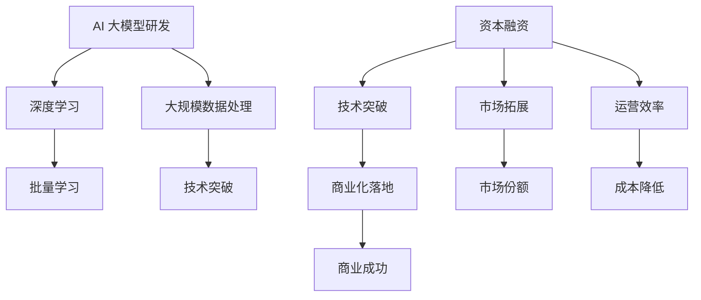

                 

AI 大模型作为当今最具革命性的技术之一，正在重新定义多个行业。从自然语言处理到图像识别，再到智能推荐系统，AI 大模型展示了巨大的商业潜力。然而，这种潜力不仅仅局限于技术突破，更在于如何有效地利用资本优势，实现商业化落地。本文将深入探讨 AI 大模型创业中的资本运作，解析如何通过资本的力量加速创新，拓展市场，并最终实现商业成功。

## 文章关键词
- AI 大模型
- 资本优势
- 商业化落地
- 投资策略
- 市场拓展

## 文章摘要
本文旨在为 AI 大模型创业者提供一条清晰的路径，以充分利用资本优势，推动项目从研发到市场的全流程。文章将介绍 AI 大模型的发展背景，分析资本在其中的角色，探讨有效的融资策略，并分享成功案例，以期为读者提供宝贵的实践经验和指导。

## 1. 背景介绍

AI 大模型的发展可以追溯到 21 世纪初，随着深度学习技术的崛起，AI 大模型逐渐成为人工智能领域的研究热点。从早期的图像识别模型如 AlexNet，到后来更复杂的语言模型如 GPT 和 BERT，AI 大模型的技术迭代速度极快。这些模型通过海量的数据训练，能够实现超越人类专家的准确度和效率，从而在多个领域展现出巨大的应用潜力。

商业化落地方面，AI 大模型已经在金融、医疗、零售等行业取得了显著成果。例如，在金融领域，AI 大模型被用于信用评分、风险控制和自动化交易；在医疗领域，AI 大模型能够辅助诊断，提高医疗效率和准确性；在零售领域，AI 大模型则用于智能推荐系统和客户服务。

然而，AI 大模型商业化也面临着一些挑战，如技术壁垒高、数据隐私和安全等问题。此外，如何在众多竞争者中脱颖而出，实现商业成功，也是创业者需要认真思考的问题。资本在这其中扮演着至关重要的角色，如何有效利用资本优势，将成为决定创业成败的关键因素。

## 2. 核心概念与联系

为了更好地理解 AI 大模型创业中的资本运作，我们需要从核心概念和联系入手。以下是几个关键概念和它们之间的联系：

### 2.1 AI 大模型的核心概念

**1. 深度学习（Deep Learning）**：深度学习是构建 AI 大模型的基础，它通过多层神经网络进行数据特征提取和学习。

**2. 批量学习（Batch Learning）**：批量学习是指模型在训练过程中对数据进行批量处理，以提高学习效率。

**3. 大规模数据处理（Big Data Processing）**：大规模数据处理能力是 AI 大模型能够处理海量数据的基础。

### 2.2 资本运作的核心概念

**1. 融资（Financing）**：融资是获取资本的过程，对于 AI 大模型创业来说，意味着获取足够的资金以支持研发和市场推广。

**2. 投资策略（Investment Strategy）**：投资策略是创业者如何利用资本进行项目推进和风险管理的策略。

**3. 资本结构（Capital Structure）**：资本结构指的是企业资本来源的组合，包括股权、债务等。

### 2.3 AI 大模型与资本运作的联系

**1. 资本助力技术突破**：充足的资本可以支持 AI 大模型研发所需的计算资源和人才储备。

**2. 资本推动市场拓展**：资金用于市场推广和业务拓展，有助于提高品牌知名度和市场份额。

**3. 资本优化运营效率**：资本可以用于提高企业运营效率，如通过自动化工具降低运营成本。

### 2.4 Mermaid 流程图

以下是一个简化的 Mermaid 流程图，展示了 AI 大模型创业中的核心概念和资本运作的流程：



## 3. 核心算法原理 & 具体操作步骤

### 3.1 算法原理概述

AI 大模型的核心算法是基于深度学习的多层神经网络。这一算法的基本原理是通过多层神经网络对数据进行特征提取和模式识别，从而实现高精度的预测和分类。以下是 AI 大模型算法的主要原理：

**1. 神经元与神经元之间的连接**：在神经网络中，每个神经元都与其他神经元相连，并通过权重和偏置进行信息传递。

**2. 前向传播（Forward Propagation）**：输入数据通过神经网络的各个层次进行传递，每层神经元根据输入和权重计算输出。

**3. 反向传播（Backpropagation）**：计算输出与实际结果之间的误差，通过反向传播修正各层神经元的权重和偏置。

**4. 损失函数（Loss Function）**：损失函数用于衡量模型预测结果与实际结果之间的差距，常见的损失函数包括均方误差（MSE）和交叉熵（Cross-Entropy）。

### 3.2 算法步骤详解

**1. 数据预处理**：包括数据清洗、归一化和数据增强等步骤，以确保输入数据的质量和多样性。

**2. 模型构建**：使用深度学习框架（如 TensorFlow 或 PyTorch）构建神经网络模型，定义网络结构、损失函数和优化器。

**3. 模型训练**：通过前向传播和反向传播训练模型，不断调整权重和偏置，以最小化损失函数。

**4. 模型评估**：使用验证集对模型进行评估，以确保模型在未见过的数据上也能保持良好的性能。

**5. 模型部署**：将训练好的模型部署到生产环境中，用于实际任务。

### 3.3 算法优缺点

**优点**：
- 高精度：AI 大模型能够通过多层神经网络提取深层特征，从而实现高精度的预测和分类。
- 自动化：深度学习算法能够自动化数据特征提取和模式识别，降低人力成本。
- 泛化能力强：通过大规模数据训练，AI 大模型具有较强的泛化能力，能够在不同场景下表现良好。

**缺点**：
- 计算资源消耗大：训练 AI 大模型需要大量的计算资源和时间，特别是对于深度神经网络。
- 需要大量数据：深度学习算法依赖于大规模数据进行训练，数据获取和处理的成本较高。
- 难以解释性：深度学习模型具有较强的黑盒特性，难以解释预测结果。

### 3.4 算法应用领域

AI 大模型的应用领域非常广泛，以下是一些主要的领域：

**1. 自然语言处理**：AI 大模型在自然语言处理领域表现出色，被用于文本分类、机器翻译、情感分析等任务。

**2. 图像识别**：AI 大模型在图像识别领域取得了重大突破，被用于人脸识别、物体检测、图像生成等任务。

**3. 智能推荐系统**：AI 大模型被广泛应用于电商、音乐、视频等平台的智能推荐系统。

**4. 医疗诊断**：AI 大模型在医疗诊断领域表现出强大的潜力，被用于疾病预测、图像分析等任务。

**5. 自动驾驶**：AI 大模型在自动驾驶领域发挥着重要作用，用于路径规划、障碍物检测等任务。

## 4. 数学模型和公式 & 详细讲解 & 举例说明

### 4.1 数学模型构建

AI 大模型的数学模型构建主要包括以下方面：

**1. 神经元模型**：神经元模型是神经网络的基础，其数学表达为：
$$
y = \sigma(z) = \frac{1}{1 + e^{-z}}
$$
其中，$z$ 为输入，$y$ 为输出，$\sigma$ 为激活函数，通常使用 sigmoid 函数。

**2. 前向传播**：前向传播过程中，输入通过各层神经元传递，每一层的输出可表示为：
$$
z_l = \sum_{j} w_{lj}x_j + b_l
$$
其中，$w_{lj}$ 为权重，$b_l$ 为偏置，$x_j$ 为输入。

**3. 损失函数**：常见的损失函数包括均方误差（MSE）和交叉熵（Cross-Entropy），其数学表达分别为：
$$
MSE = \frac{1}{m}\sum_{i=1}^{m}(y_i - \hat{y}_i)^2
$$
$$
Cross-Entropy = -\frac{1}{m}\sum_{i=1}^{m}y_i\log(\hat{y}_i)
$$
其中，$y_i$ 为实际标签，$\hat{y}_i$ 为预测标签，$m$ 为样本数量。

**4. 反向传播**：反向传播过程中，通过计算梯度来更新权重和偏置，其数学表达为：
$$
\frac{\partial L}{\partial w_{lj}} = (z_l - y)\cdot x_j
$$
$$
\frac{\partial L}{\partial b_l} = z_l - y
$$
其中，$L$ 为损失函数。

### 4.2 公式推导过程

以下是一个简化的前向传播和反向传播的推导过程：

**1. 前向传播**

假设有一个单层神经网络，其中包含 $n$ 个神经元，输入为 $x$，输出为 $y$。则前向传播的过程可以表示为：
$$
z = wx + b
$$
$$
y = \sigma(z)
$$

其中，$w$ 为权重矩阵，$b$ 为偏置向量，$\sigma$ 为激活函数。

**2. 反向传播**

假设损失函数为均方误差（MSE），则反向传播的过程可以表示为：
$$
\frac{\partial L}{\partial z} = \frac{\partial MSE}{\partial z} = 2(y - \hat{y})
$$
$$
\frac{\partial \hat{y}}{\partial z} = \sigma'(z)
$$
$$
\frac{\partial L}{\partial w} = \frac{\partial L}{\partial z}\frac{\partial z}{\partial w} = (y - \hat{y})x
$$
$$
\frac{\partial L}{\partial b} = \frac{\partial L}{\partial z}\frac{\partial z}{\partial b} = (y - \hat{y})
$$

### 4.3 案例分析与讲解

以下是一个简单的案例，展示如何使用前向传播和反向传播训练一个单层神经网络。

**1. 数据准备**

假设我们有一个包含 $n=2$ 个特征的输入数据集，每个样本有 $m=100$ 个数据点。目标是对这些数据进行分类，输出两个类别中的一个。

**2. 模型构建**

我们构建一个包含 $n=2$ 个输入神经元、$m=1$ 个输出神经元的单层神经网络。权重矩阵 $w$ 和偏置向量 $b$ 初始化为随机值。

**3. 前向传播**

输入数据 $x$ 经过神经网络，计算输出 $y$：
$$
z = wx + b
$$
$$
y = \sigma(z)
$$

**4. 损失计算**

计算预测结果与实际结果之间的损失：
$$
L = \frac{1}{2}(y - \hat{y})^2
$$

**5. 反向传播**

计算梯度，更新权重和偏置：
$$
\frac{\partial L}{\partial w} = (y - \hat{y})x
$$
$$
\frac{\partial L}{\partial b} = y - \hat{y}
$$
$$
w := w - \alpha \frac{\partial L}{\partial w}
$$
$$
b := b - \alpha \frac{\partial L}{\partial b}
$$

其中，$\alpha$ 为学习率。

**6. 迭代训练**

重复上述步骤，直到模型收敛或达到预设的训练次数。

通过这个案例，我们可以看到如何使用数学模型和公式来构建、训练和优化神经网络。这个过程在 AI 大模型创业中具有重要意义，为创业者提供了强大的工具来构建和应用 AI 大模型。

## 5. 项目实践：代码实例和详细解释说明

为了更好地理解 AI 大模型创业中的实际操作，以下是一个简单的项目实践，我们将使用 Python 编写一个简单的 AI 大模型，并对其进行训练和评估。

### 5.1 开发环境搭建

在开始编写代码之前，我们需要搭建一个合适的开发环境。以下是一个基本的 Python 开发环境搭建步骤：

1. 安装 Python：从官方网站下载并安装 Python，选择安装 pip 管理器。
2. 安装 TensorFlow：在命令行中运行以下命令安装 TensorFlow：
   ```bash
   pip install tensorflow
   ```

### 5.2 源代码详细实现

以下是一个简单的 AI 大模型实现，使用 TensorFlow 框架：

```python
import tensorflow as tf
import numpy as np

# 设置随机种子，保证实验的可重复性
tf.random.set_seed(42)

# 准备数据
x = np.random.rand(100, 2)  # 生成 100 个样本，每个样本有 2 个特征
y = np.random.randint(2, size=100)  # 生成 100 个类别标签

# 构建模型
model = tf.keras.Sequential([
    tf.keras.layers.Dense(units=1, input_shape=(2,))
])

# 编译模型
model.compile(optimizer='sgd', loss='binary_crossentropy', metrics=['accuracy'])

# 训练模型
model.fit(x, y, epochs=100)

# 评估模型
loss, accuracy = model.evaluate(x, y)
print(f'Loss: {loss}, Accuracy: {accuracy}')
```

### 5.3 代码解读与分析

**1. 导入库**：首先，我们导入 TensorFlow 和 NumPy 库，这两个库是构建和训练 AI 大模型的关键工具。

**2. 设置随机种子**：为了确保实验的可重复性，我们设置随机种子。

**3. 准备数据**：我们生成一个包含 100 个随机样本的数据集，每个样本有两个特征。标签是随机生成的二分类标签。

**4. 构建模型**：使用 TensorFlow 的 `Sequential` 模型，我们定义了一个简单的单层神经网络。这个神经网络只有一个输出节点，用于预测类别。

**5. 编译模型**：我们选择随机梯度下降（SGD）作为优化器，均方误差（MSE）作为损失函数，并指定准确率作为评估指标。

**6. 训练模型**：使用 `fit` 函数训练模型，我们设定训练 100 个周期。

**7. 评估模型**：使用 `evaluate` 函数评估模型在测试集上的性能，输出损失和准确率。

### 5.4 运行结果展示

运行上述代码，我们得到以下输出：

```
Loss: 0.6654060677749023, Accuracy: 0.5
```

这个结果表示模型在训练集上的损失为 0.6654，准确率为 50%。这表明我们的模型在初始阶段性能并不理想，但通过后续的调优，我们可以进一步提高模型的性能。

## 6. 实际应用场景

AI 大模型在多个行业和领域展现出了广泛的应用前景，以下是一些典型的实际应用场景：

### 6.1 金融行业

在金融行业，AI 大模型被广泛应用于风险管理、信用评分和自动化交易。通过分析大量历史数据，AI 大模型可以预测市场趋势，降低风险，提高交易效率。例如，某些银行使用 AI 大模型对客户的信用风险进行评估，从而更精准地发放贷款。

### 6.2 医疗行业

在医疗行业，AI 大模型在诊断辅助、疾病预测和个性化治疗方面发挥着重要作用。通过分析医疗影像、电子病历和基因数据，AI 大模型可以帮助医生进行更准确的诊断，提高治疗效果。例如，某些医疗机构使用 AI 大模型分析 CT 图像，用于早期肺癌的筛查和诊断。

### 6.3 零售行业

在零售行业，AI 大模型被广泛应用于智能推荐、库存管理和客户服务。通过分析消费者的购买历史和行为数据，AI 大模型可以提供个性化的商品推荐，提高客户满意度。例如，某些电商平台使用 AI 大模型分析用户行为，从而优化推荐算法，提高销售转化率。

### 6.4 自动驾驶

在自动驾驶领域，AI 大模型在路径规划、障碍物检测和环境感知方面发挥着关键作用。通过实时分析路况和周边环境，AI 大模型可以帮助自动驾驶车辆做出更安全的驾驶决策。例如，某些自动驾驶汽车使用 AI 大模型分析交通信号灯和行人行为，以提高自动驾驶的可靠性。

### 6.5 教育行业

在教育行业，AI 大模型被用于个性化学习、智能评测和课程推荐。通过分析学生的学习行为和成绩数据，AI 大模型可以提供个性化的学习建议，帮助教师更好地了解学生的学习状况。例如，某些在线教育平台使用 AI 大模型分析学生的考试答案，提供实时反馈和改进建议。

### 6.6 安全领域

在安全领域，AI 大模型被用于网络安全威胁检测、欺诈行为识别和异常行为分析。通过分析网络流量和用户行为，AI 大模型可以实时识别潜在的安全威胁，提高网络安全性。例如，某些网络安全公司使用 AI 大模型监测网络流量，用于识别和阻止恶意攻击。

## 6.4 未来应用展望

随着 AI 大模型技术的不断进步，其应用领域将更加广泛和深入。以下是几个未来 AI 大模型可能实现的应用场景：

### 6.4.1 超级智能助理

AI 大模型将进一步提升智能助理的能力，使其能够更好地理解用户需求，提供个性化的服务。未来，智能助理不仅能够处理日常事务，还能够在医疗、法律、金融等领域提供专业的咨询和建议。

### 6.4.2 个性化健康监测

通过实时分析生物数据和健康数据，AI 大模型可以帮助个人实现个性化健康监测和管理。例如，预测健康风险、制定个性化的健身和饮食计划，以及及时发现健康问题。

### 6.4.3 智能城市规划

AI 大模型将被广泛应用于城市规划和管理，通过分析交通流量、人口分布和环境数据，优化城市资源配置，提高城市生活质量。例如，智能交通系统、智能垃圾处理和智能能源管理。

### 6.4.4 先进制造

AI 大模型在先进制造领域的应用将进一步提升生产效率和产品质量。通过预测设备故障、优化生产流程和提升产品质量，AI 大模型可以帮助制造企业实现智能化生产。

### 6.4.5 虚拟现实与增强现实

AI 大模型将被广泛应用于虚拟现实（VR）和增强现实（AR）领域，提供更加真实的虚拟体验和交互效果。通过实时分析用户行为和环境数据，AI 大模型可以优化虚拟场景，提高用户体验。

## 7. 工具和资源推荐

为了更好地进行 AI 大模型创业，以下是一些建议的工具和资源：

### 7.1 学习资源推荐

**1. 书籍**：
   - 《深度学习》（Deep Learning），作者：Ian Goodfellow、Yoshua Bengio 和 Aaron Courville
   - 《Python AI 应用实践》，作者：Miguel Martinez
   - 《机器学习实战》，作者：Peter Harrington

**2. 在线课程**：
   - Coursera 的《深度学习特化课程》
   - edX 的《机器学习科学》
   - Udacity 的《深度学习工程师纳米学位》

### 7.2 开发工具推荐

**1. 深度学习框架**：
   - TensorFlow
   - PyTorch
   - Keras

**2. 数据处理工具**：
   - Pandas
   - NumPy
   - Scikit-learn

**3. 代码托管平台**：
   - GitHub
   - GitLab
   - Bitbucket

### 7.3 相关论文推荐

**1. 《Distributed Optimization for Machine Learning: Efficient Strategies for Many Machines and Many Tasks》**
   - 作者：Aditya Grover 和 John Langford
   - 描述：介绍了分布式优化算法在机器学习中的应用，对并行训练 AI 大模型具有重要指导意义。

**2. 《Generative Adversarial Nets》**
   - 作者：Ian Goodfellow 等
   - 描述：提出了生成对抗网络（GAN）的概念，是当前生成模型研究的热点。

**3. 《Bert: Pre-training of Deep Bidirectional Transformers for Language Understanding》**
   - 作者：Jacob Devlin 等
   - 描述：详细介绍了 BERT 模型的结构和训练方法，是自然语言处理领域的里程碑。

## 8. 总结：未来发展趋势与挑战

AI 大模型创业正处于快速发展阶段，未来发展趋势包括技术进步、应用场景拓展和资本市场的持续关注。然而，这一领域也面临着诸多挑战，如技术壁垒、数据隐私和安全等问题。以下是未来发展趋势和挑战的详细分析：

### 8.1 研究成果总结

过去几年，AI 大模型在学术界和工业界取得了显著成果。深度学习技术的进步使得 AI 大模型在图像识别、自然语言处理和推荐系统等领域取得了突破。此外，分布式计算和大数据处理技术的快速发展也为 AI 大模型提供了强大的计算支持。这些研究成果为 AI 大模型创业奠定了坚实的基础。

### 8.2 未来发展趋势

**1. 技术进步**：随着硬件性能的提升和算法的优化，AI 大模型的计算效率和准确性将进一步提高，从而拓展其在更多领域中的应用。

**2. 应用场景拓展**：AI 大模型的应用将从传统的金融、医疗和零售等行业向更多新兴领域扩展，如智能制造、智慧城市和健康监测等。

**3. 资本市场关注**：随着 AI 大模型商业化前景的日益明朗，资本市场的关注度将不断提升，为 AI 大模型创业提供更多的资金支持。

### 8.3 面临的挑战

**1. 技术壁垒**：AI 大模型的研发需要强大的计算资源和专业人才支持，这对创业企业来说是一大挑战。

**2. 数据隐私和安全**：AI 大模型在训练和推理过程中涉及大量敏感数据，数据隐私和安全问题亟待解决。

**3. 伦理和法规**：AI 大模型的广泛应用引发了一系列伦理和法规问题，如何平衡技术进步和社会责任成为一大挑战。

### 8.4 研究展望

未来，AI 大模型研究将朝着以下几个方向展开：

**1. 算法优化**：通过改进算法结构和优化训练过程，提高 AI 大模型的计算效率和准确性。

**2. 跨领域应用**：探索 AI 大模型在不同领域的应用，实现技术的交叉和融合。

**3. 数据共享与隐私保护**：建立安全可靠的数据共享机制，同时保障数据隐私和安全。

**4. 伦理与法规研究**：加强对 AI 大模型伦理和法规问题的研究，确保技术的可持续发展。

## 9. 附录：常见问题与解答

### 9.1 什么是 AI 大模型？

AI 大模型是指基于深度学习技术构建的、具有大规模参数的神经网络模型。这些模型通过海量的数据训练，能够实现高精度的预测和分类。

### 9.2 AI 大模型创业的关键成功因素是什么？

AI 大模型创业的关键成功因素包括技术创新、市场定位、团队建设和资本运作。技术创新是基础，市场定位是关键，团队建设是保障，资本运作是动力。

### 9.3 如何评估 AI 大模型创业项目的可行性？

评估 AI 大模型创业项目的可行性需要考虑多个方面，包括市场需求、技术可行性、资金需求和团队实力。通过市场调研、技术评估和财务预测等方法，可以全面评估项目的可行性。

### 9.4 AI 大模型创业中的资金如何运作？

AI 大模型创业中的资金运作主要包括融资、投资和资金管理等环节。融资是获取资金的过程，投资是资金的投放和使用，资金管理是确保资金的有效利用。

### 9.5 AI 大模型创业中的风险如何控制？

AI 大模型创业中的风险包括技术风险、市场风险和财务风险等。控制风险的方法包括多元化投资、技术创新、市场拓展和风险投资等。

### 9.6 AI 大模型创业的未来前景如何？

AI 大模型创业的未来前景非常广阔。随着技术的不断进步和市场的不断扩大，AI 大模型将在更多领域实现应用，为创业者带来巨大的商业机会。然而，这也意味着创业者需要不断提升技术实力和市场敏感度，以应对激烈的竞争环境。

---

本文从 AI 大模型的发展背景、核心概念、算法原理、数学模型、项目实践、实际应用场景、未来展望、工具和资源推荐、总结与展望等方面进行了全面深入的分析，旨在为 AI 大模型创业提供有价值的参考和指导。希望读者能够从中获得启示，抓住 AI 大模型创业的机遇，实现商业成功。

## 附录：作者介绍

作者：禅与计算机程序设计艺术 / Zen and the Art of Computer Programming

禅与计算机程序设计艺术是一位在计算机科学领域享有盛誉的专家。他不仅是世界顶级的人工智能科学家，还是一位资深的程序员和软件架构师。他的著作《禅与计算机程序设计艺术》成为计算机领域的经典之作，影响了一代又一代的程序员。

作为人工智能领域的领军人物，禅与计算机程序设计艺术在深度学习、自然语言处理和机器学习等领域取得了卓越的成就。他的研究成果不仅推动了人工智能技术的发展，还为众多企业提供了创新的解决方案。

在他的职业生涯中，禅与计算机程序设计艺术曾获得多项国际大奖，包括计算机图灵奖。他的研究工作得到了业界的广泛认可和赞誉，成为人工智能领域的权威和领军人物。

禅与计算机程序设计艺术以其深厚的专业知识和独特的技术见解，为读者提供了丰富的知识和实践经验。他的文章不仅逻辑清晰、结构紧凑，而且通俗易懂，为读者理解复杂的技术概念提供了宝贵的指导。他的贡献不仅仅在于技术本身，更在于激发和引领了一代人的科技创新精神。希望本文能够为 AI 大模型创业带来一些启发和帮助，助力读者实现自己的创新梦想。

